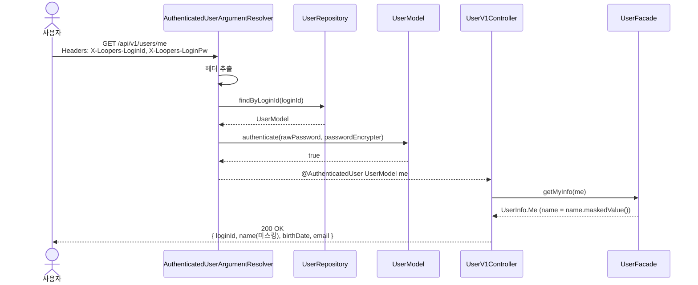
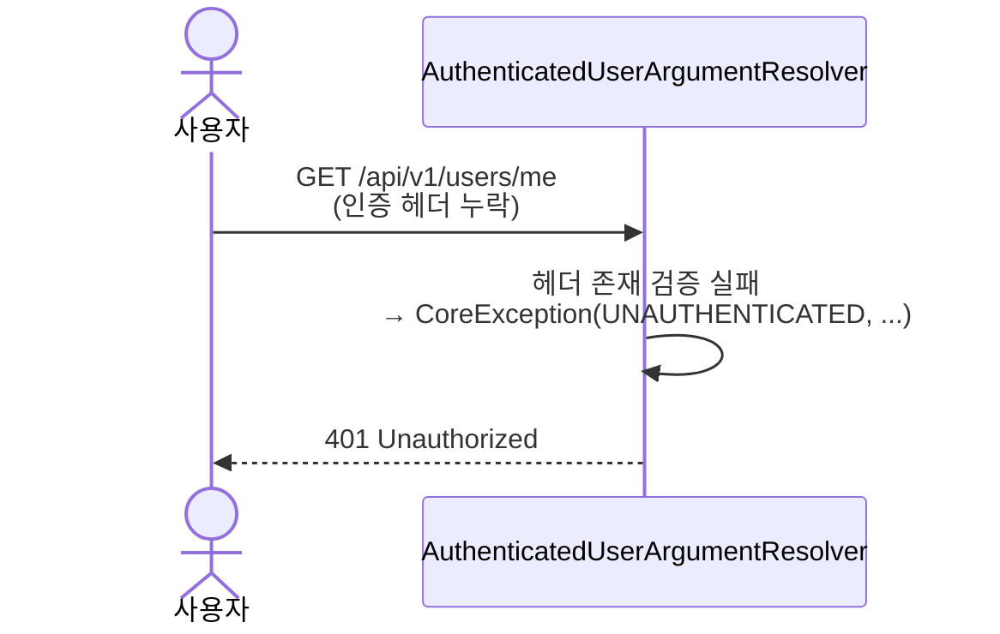
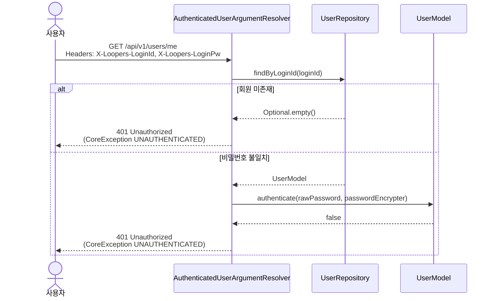

# 내 정보 조회 요구사항 명세

## 1. 용어 정의

| 한글 | 영어 | 의미 |
|---|---|---|
| 회원 | `User` | 서비스에 가입하여 식별 가능한 사용자. 본 명세의 도메인 객체 명칭. |
| 로그인 ID | `loginId` | 회원이 본인을 식별하기 위해 사용하는 비즈니스 키. 영문 대소문자·숫자 4~20자, 유니크 제약. |
| 비밀번호 | `password` | 본인 인증 수단. 평문은 메모리 상에서만 다루며 저장하지 않는다. |
| 비밀번호 암호문 | `encryptedPassword` | 단방향 해시 알고리즘(BCrypt)으로 변환된 비밀번호 값. DB 저장 형태. |
| 이름 | `name` | 회원의 표시용 이름. |
| 생년월일 | `birthDate` | 회원의 출생일자. `YYYY-MM-DD` 형식의 날짜 값. |
| 이메일 | `email` | 회원의 이메일 주소. |

## 2. 기능 요구사항

| 번호 | 요구사항 |
|---|---|
| 1 | 인증이 필요한 모든 요청에는 `X-Loopers-LoginId`와 `X-Loopers-LoginPw` 두 헤더가 동반되어야 한다. 서버는 두 헤더의 값으로 회원을 조회하고, 평문 비밀번호가 저장된 `encryptedPassword`와 BCrypt `matches`로 일치할 때만 본인 인증을 성립시킨다. |
| 2 | 본인 인증 실패의 모든 사유(헤더 누락 / 헤더 값이 회원가입 포맷 위반 / 회원 미존재 / 비밀번호 불일치)는 응답에서 구분하지 않고 단일 응답(`401 Unauthorized`)으로 처리한다. 사용자 열거 공격을 방지하기 위함. |
| 3 | 본인 인증 성공 시 회원의 `{ loginId, name(마스킹), birthDate, email }` 네 필드를 응답 본문에 반환한다. 이외 필드는 응답에 포함하지 않는다. |
| 4 | 응답의 `name` 값은 원본 이름의 **마지막 1글자를 `*`로 치환**한 형태다. 원본 이름은 어떤 형태로도 응답에 포함하지 않는다. 회원가입에서 `name`은 한글 완성형 2~20자로 보장되므로 항상 마스킹 대상이 존재한다. |
| 5 | `password` 평문, `encryptedPassword`, 비밀번호 정책 관련 어떤 필드도 응답·로그·에러 메시지에 포함하지 않는다. |
| 6 | 본 API는 **본인의 정보만** 반환한다. 다른 회원의 정보를 조회할 수단(쿼리 파라미터·경로 변수 등)을 제공하지 않는다. |
| 7 | 응답에 PK `userId`는 포함하지 않는다. 본인이 누구인지는 클라이언트가 이미 헤더의 `loginId`로 알고 있으며, 내부 식별자를 추가 노출할 이유가 없다. |

## 3. 비기능 요구사항

| 번호 | 카테고리 | 요구사항 |
|---|---|---|
| 1 | 보안 | 평문 비밀번호(`X-Loopers-LoginPw` 헤더 값)는 로그·응답·스택트레이스·에러 메시지 어디에도 노출하지 않는다. 헤더 로깅 시 값은 마스킹(`***`)한다. |
| 2 | 보안 | 본인 인증 실패 사유는 응답에서 구분하지 않는다(기능 요구 2). 응답 메시지·상태 코드·헤더 어디에도 사유 식별이 가능한 신호를 두지 않는다. |
| 3 | 가용성 | 조회 트랜잭션은 `readOnly = true`로 실행한다. 부수 효과가 없으므로 트랜잭션 격리·롤백 부담을 줄인다. |
| 4 | 관측성 | 본인 인증 시도의 성공/실패를 구조화된 로그로 기록한다. 실패 로그에도 평문 비밀번호는 포함하지 않으며, 사유 분류는 내부 로그에 한정한다(클라이언트 응답엔 노출하지 않음). |
| 5 | 호환성 | 응답 본문은 `application/json; charset=utf-8`. 에러 메시지는 한국어로 작성한다. |

## 4. 목표가 아닌 것

- **회원 정보 수정** (`name` / `email` / `birthDate` 변경) — 별도 수정 API의 책임. 본 라운드는 조회 한정.
- **비밀번호 수정** — 원문에 명시된 별도 기능. 별도 라운드에서 다룬다.
- **다른 회원의 정보 조회** — 본 API는 본인만(기능 요구 6). 관리자·타인 조회 API는 권한 모델 도입 시 별도 라운드.
- **자동 로그인 / 세션 발급 / 토큰 발급** — 본 시스템은 매 요청 헤더 인증 방식으로 영구히 세션 모델을 두지 않는다.

## 5. 시나리오

본 라운드에서 인증 실패는 의미상 "본인 인증되지 않음"이며 HTTP 표준의 401(Unauthorized)에 매핑된다. `CoreException`에 새 `ErrorType.UNAUTHENTICATED`(`status = 401`, `code = "Unauthorized"`)를 도입해 표현한다.

본인 인증은 커스텀 `@AuthenticatedUser` 어노테이션과 `AuthenticatedUserArgumentResolver`로 처리한다. Resolver가 요청 헤더에서 `X-Loopers-LoginId`/`X-Loopers-LoginPw`를 추출해 회원을 조회하고 `UserModel.authenticate(...)`로 본인 인증을 수행한 뒤, 컨트롤러에 인증된 `UserModel`을 주입한다. 인증이 필요한 모든 엔드포인트에서 동일하게 재사용한다.

### 5.1 정상 시나리오

### 5.2 본인 인증 헤더 누락

### 5.3 본인 인증 실패 (회원 미존재 또는 비밀번호 불일치)

## 6. 도메인 모델링

본 라운드는 회원 도메인의 **조회 + 본인 인증** 행위를 추가한다. 새로운 도메인 객체나 값 객체는 도입하지 않고, 기존 객체에 행위만 보강한다.

| 역할 (객체명) | 책임 | 속성 | 행위 (본 라운드 추가는 **굵게**) |
|---|---|---|---|
| **`UserModel`** *(JPA Entity)* | 가입한 회원 한 명을 표현. 자신의 본인 인증 책임을 가진다. | `id` (`BaseEntity`로부터), `loginId: LoginId`, `encryptedPassword: EncryptedPassword`, `name: Name`, `birthDate: BirthDate`, `email: Email` | 기존: `new UserModel(...)`. **추가: `authenticate(rawPassword: String, passwordEncrypter: PasswordEncrypter)` → `boolean` — 자신의 `encryptedPassword.matches(...)`에 위임** |
| **`Name`** *(값 객체)* | 이름 도메인 규칙의 단일 진실의 원천. 한글 완성형 2~20자 검증, 표시용 마스킹 변환 책임을 가진다. | `value: String` | 기존: `static from(String)` → `Name`. **추가: `maskedValue()` → `String` — 마지막 1글자를 `*`로 치환한 새 문자열 반환** |
| **`EncryptedPassword`** *(값 객체)* | BCrypt 해시 값을 감싼다. 평문↔해시 일치 검증 책임. | `value: String` | 기존: `static encrypt(rawPassword, passwordEncrypter)` → `EncryptedPassword`. **추가: `matches(rawPassword: String, passwordEncrypter: PasswordEncrypter)` → `boolean`** |
| `LoginId` *(값 객체)* | 로그인 ID 값을 표현. 영문 대소문자·숫자 4~20자 검증. | `value: String` | `static from(String)` (기존 그대로) |
| `BirthDate` *(값 객체)* | 생년월일을 표현. 유효 달력 일자, 미래 일자 금지. | `value: LocalDate` | `static from(LocalDate)` (기존 그대로) |
| `Email` *(값 객체)* | 이메일 주소를 표현. RFC 5322 형식, 최대 254자 검증. | `value: String` | `static from(String)` (기존 그대로) |
| `PasswordEncrypter` *(포트, 인터페이스)* | 평문 → 단방향 해시 변환, 평문↔해시 일치 검증을 추상화한다. | — | `encrypt`, `matches` (기존 인터페이스 그대로) |
| `BcryptPasswordEncrypter` *(어댑터)* | `PasswordEncrypter` 포트의 BCrypt 구현. Spring Security `BCryptPasswordEncoder`(cost=10)에 위임. | — | `encrypt`, `matches` 위임 (기존 그대로) |
