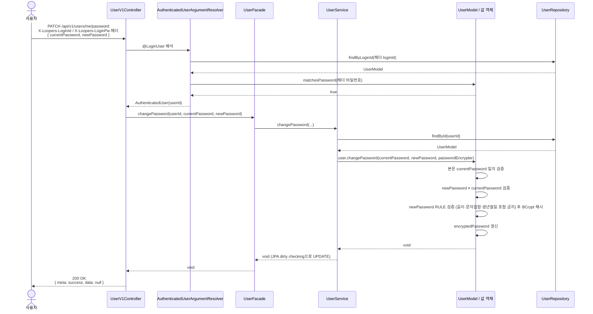
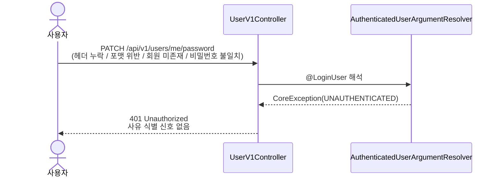
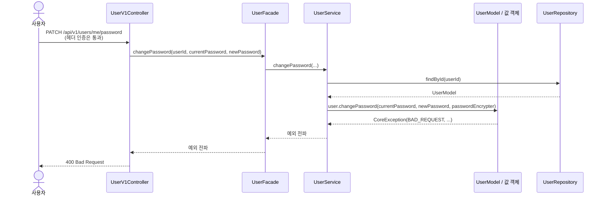

# 비밀번호 수정 요구사항 명세

본 기능은 본인 인증된 회원이 자신의 비밀번호를 새 값으로 교체하는 흐름이다. 매 요청 헤더 인증(`X-Loopers-LoginId` / `X-Loopers-LoginPw`)을 통해 본인을 확인하고, 본문
`currentPassword`로 변경 의도를 한 번 더 재확인한 뒤, `newPassword`가 비밀번호 RULE을 만족하면 BCrypt 해시로 교체한다. 헤더는 **본인 인증**의 책임을, 본문
`currentPassword`는 **변경 의도 재확인**의 책임을 진다 — 같은 값을 두 군데서 받지만 검증 위치와 실패 코드(`401` vs `400`)가 다르다.

## 1. 기능 요구사항

| 번호 | 요구사항                                                                                                                                                                          |                                         |
|----|-------------------------------------------------------------------------------------------------------------------------------------------------------------------------------|-----------------------------------------|
| 1  | 클라이언트는 요청 본문에 `currentPassword`, `newPassword` 두 필드를 모두 포함한다. 어느 하나라도 누락되면 거부한다.                                                                                              |                                         |
| 2  | 본 요청은 `X-Loopers-LoginId` / `X-Loopers-LoginPw` 헤더 인증을 통과해야 한다. 인증 실패는 사유와 무관하게 `UNAUTHENTICATED`(`401`) 단일 응답으로 처리한다 — 공통 인증 인프라(`AuthenticatedUserArgumentResolver`)에 위임한다. |                                         |
| 3  | 본문 `currentPassword`는 회원의 저장된 `encryptedPassword`와 BCrypt `matches`로 일치 검증한다. 불일치 시 `BAD_REQUEST`(`400`)로 거부한다. 헤더 인증과 별개의 **도메인 입력 검증**이며, 사용자가 변경 의도를 명시적으로 재확인하기 위한 절차다.   |                                         |
| 4  | `newPassword`는 비밀번호 RULE을 만족한다 — 영문 대소문자·숫자·특수문자만 허용하며 길이는 **8~16자**다. 허용 특수문자 집합(`! @ # $ % ^ & * ( ) _ + - = [ ] { } ; ' : " , . < > / ?                                    | \ ~ \``)을 포함해 회원가입에서 합의된 정책을 그대로 재사용한다. |
| 5  | `newPassword`는 회원의 `birthDate`를 포함할 수 없다. 검사 패턴은 회원가입과 동일한 `YYYYMMDD`, `YYMMDD` 두 가지다.                                                                                        |                                         |
| 6  | `newPassword`는 `currentPassword`와 동일할 수 없다. 비교는 **평문 동등성**으로 한다 — BCrypt는 동일 평문에 대해서도 매번 다른 해시를 산출하므로 해시 비교는 의미가 없다. 동일 시 `BAD_REQUEST`로 거부한다.                                |                                         |
| 7  | 본 명세는 **직전 한 번의 비밀번호**와의 동일성만 검증한다. 더 과거 이력과의 비교(비밀번호 히스토리 검사)는 도입하지 않는다.                                                                                                     |                                         |
| 8  | 모든 검증을 통과한 경우 `newPassword`를 BCrypt(cost=10)로 해시해 `encryptedPassword` 컬럼을 갱신한다. `updated_at`은 JPA의 `@LastModifiedDate`에 의해 자동 갱신된다.                                           |                                         |
| 9  | 비밀번호 변경 처리는 단일 트랜잭션 안에서 실행한다. 도중 예외 발생 시 컬럼 값은 변하지 않는다.                                                                                                                       |                                         |

## 2. 비기능 요구사항

| 번호 | 카테고리 | 요구사항                                                                                                                                             |
|----|------|--------------------------------------------------------------------------------------------------------------------------------------------------|
| 1  | 보안   | 평문 `currentPassword` / `newPassword`는 로그·응답·스택트레이스·에러 메시지 어디에도 노출하지 않는다. 요청 본문 로깅 시 두 필드는 마스킹(`***`)한다.                                          |
| 2  | 보안   | 본문 `currentPassword` 검증은 헤더 인증과 별개로 수행되며 실패 시 `BAD_REQUEST`(`400`)로 분리 보고한다 — 사용자 열거 신호로 활용될 수 없는 위치(이미 헤더 인증 통과)에서의 검증이므로 인증 단일 응답 정책의 예외가 아니다. |
| 3  | 가용성  | 비밀번호 변경 처리는 단일 트랜잭션. 부분 갱신 상태는 존재하지 않는다.                                                                                                         |
| 4  | 호환성  | 요청·응답 본문은 `application/json; charset=utf-8`. 에러 메시지는 한국어로 작성한다.                                                                                  |

## 3. 목표가 아닌 것

본 라운드에서 다루지 않을 항목.

- **비밀번호 분실 / 재발급** — 본인 확인 수단이 없는 상태에서 비밀번호를 재설정하는 흐름. 이메일·SMS 등 외부 의존성이 필요해 별도 라운드에서 다룬다.
- **비밀번호 만료 정책** — 일정 기간 경과 시 강제 변경 요구. 본 시스템은 비밀번호에 수명 개념을 두지 않는다.
- **동시성 락** — 동일 회원이 동시 변경 요청을 보낼 때의 충돌 방지. 본 과제 규모에서 마지막 갱신이 덮어쓰는 정책으로 충분하다고 판단해 도입하지 않는다.

## 4. 시나리오

### 4.1 정상 시나리오

### 4.2 헤더 인증 실패

사유와 무관하게 동일한 단일 응답이다 — 공통 인증 인프라(`AuthenticatedUserArgumentResolver`)의 사용자 열거 방지 정책을 그대로 따른다.

### 4.3 본문 검증 실패

`BAD_REQUEST`로 전파되는 4가지 사유:

- 본문 `currentPassword`가 저장된 `encryptedPassword`와 불일치
- `newPassword`가 비밀번호 RULE 위반 (빈 값 / 길이 8~16자 외 / 허용 문자집합 외)
- `newPassword`가 회원 `birthDate`를 포함 (`YYYYMMDD` 또는 `YYMMDD`)
- `newPassword`가 `currentPassword`와 평문 동일

모두 동일 `BAD_REQUEST`로 매핑되므로 외부 컨트랙트에는 차이가 없다. 어떤 사유의 메시지를 우선 반환할지는 도메인 모델링(§5)의 검증 순서에 따른다.

## 5. 도메인 모델링

본 기능은 회원가입에서 합의된 도메인 객체를 거의 그대로 재사용하며, **새 객체는 만들지 않는다**. 추가되는 것은 `UserModel`에 새 행위(`changePassword`) 하나뿐이다. 나머지는 기존
`EncryptedPassword` / `BirthDate` / `PasswordEncrypter` / `BcryptPasswordEncrypter`의 행위를 그대로 호출해 정책 단일성을 보장한다.

| 역할 (객체명)                                  | 책임                                                                                                                                                                                     | 속성                                                                                                    | 행위                                                                                                                                                                                                                                                                                                                                                                                                                                                                                                             |
|-------------------------------------------|----------------------------------------------------------------------------------------------------------------------------------------------------------------------------------------|-------------------------------------------------------------------------------------------------------|----------------------------------------------------------------------------------------------------------------------------------------------------------------------------------------------------------------------------------------------------------------------------------------------------------------------------------------------------------------------------------------------------------------------------------------------------------------------------------------------------------------|
| **`UserModel`** *(JPA Entity)*            | 비밀번호 수정의 도메인 진입점. 본인 확인(본문 `currentPassword`의 저장 해시 일치), 새 비밀번호의 RULE·생년월일 포함·기존과의 동일성 검증, `encryptedPassword` 필드 교체를 자기 자신 안에서 일관되게 책임진다. 평문 비밀번호는 메서드 파라미터 스코프에서만 존재하며 필드로 보관하지 않는다. | 회원가입에서 결정된 속성 그대로 (`id`, `loginId`, `encryptedPassword`, `name`, `birthDate`, `email`). 새 속성·새 컬럼 없음. | `changePassword(currentRawPassword, newRawPassword, passwordEncrypter)` — 다음 순서로 검증·갱신한다. 어느 단계든 실패 시 `CoreException(BAD_REQUEST)`. 모든 검증 통과 후에만 필드를 교체한다. ① `matchesPassword(currentRawPassword, passwordEncrypter)`가 `false`면 거부 (가장 먼저, 본인 확인이 실패하면 나머지 검증은 의미 없음). ② `newRawPassword.equals(currentRawPassword)`면 거부 (cheap한 평문 비교를 BCrypt 해시보다 앞에). ③ `EncryptedPassword.encrypt(newRawPassword, this.birthDate, passwordEncrypter)`로 RULE 검증 + 생년월일 포함 가드 + BCrypt 해시. ④ 반환된 `EncryptedPassword`로 필드 교체. |
| **`EncryptedPassword`** *(값 객체, 기존)*      | 평문 비밀번호의 RULE(빈 값 금지, 길이 8~16자, 허용 문자집합) 검증과 BCrypt 해싱을 자기 자신이 책임진다. 비밀번호 수정 흐름은 회원가입과 동일한 `encrypt(...)` 정적 팩토리를 호출해 정책 단일 진실의 원천을 보장한다.                                              | `value: String` (BCrypt 해시 60자)                                                                       | `static encrypt(rawPassword, passwordEncrypter)` → `EncryptedPassword`, `matches(rawPassword, passwordEncrypter)` → `boolean`                                                                                                                                                                                                                                                                                                                                                                                  |
| **`BirthDate`** *(값 객체, 기존)*              | 회원의 생년월일. 비밀번호 RULE의 "생년월일 포함 금지" 검사를 위해 자기 자신이 포함 여부 판단을 제공한다. 검사 패턴(`YYYYMMDD` / `YYMMDD`)도 자기 자신이 결정한다.                                                                             | `value: LocalDate`                                                                                    | `static from(LocalDate)` → `BirthDate`, `isContainedIn(rawPassword)` → `boolean`                                                                                                                                                                                                                                                                                                                                                                                                                               |
| **`PasswordEncrypter`** *(인터페이스, 기존)*     | 평문 비밀번호의 해시·검증을 추상화한다. 도메인 객체가 BCrypt 구현체에 직접 의존하지 않게 한다.                                                                                                                              | —                                                                                                     | `encrypt(rawPassword)` → `String`, `matches(rawPassword, encryptedPassword)` → `boolean`                                                                                                                                                                                                                                                                                                                                                                                                                       |
| **`BcryptPasswordEncrypter`** *(구현체, 기존)* | `PasswordEncrypter`의 BCrypt(cost=10) 구현. Spring Security `BCryptPasswordEncoder`에 위임.                                                                                                  | —                                                                                                     | `encrypt`, `matches`                                                                                                                                                                                                                                                                                                                                                                                                                                                                                           |

### 5.1 검증 순서 결정 사유

`changePassword` 행위 컬럼의 ①~③ 순서는 다음 근거를 따른다.

- ① **본인 확인 우선**: 현재 비밀번호가 틀렸는데 RULE 위반 메시지를 받으면 사용자가 혼란스럽다. 또한 본인 확인이 실패하면 나머지 검증 자체가 무의미하다.
- ② **평문 동일성을 RULE보다 먼저**: 평문 비교는 BCrypt 해시 대비 매우 cheap한 연산이다. 같다면 무거운 검증·해시 작업을 회피한다.
- ③ **RULE·생년월일·해싱은 마지막**: BCrypt(cost=10)는 단일 호출 ~100ms 수준의 무거운 연산이다. 앞 두 단계로 걸러진 입력에만 적용한다.
