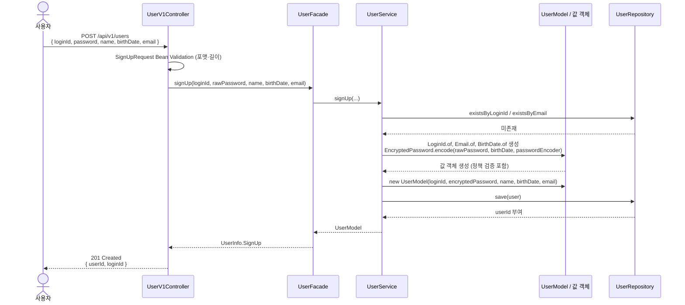
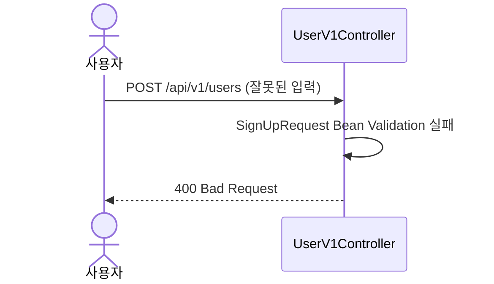
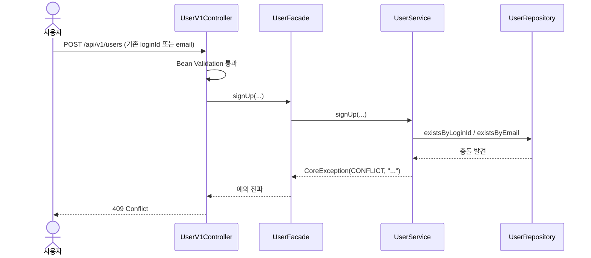

# 회원가입 요구사항 명세

## 1. 용어 정의

| 한글 | 영어 | 의미 |
|---|---|---|
| 회원 | `User` | 서비스에 가입하여 식별 가능한 사용자. 본 명세의 도메인 객체 명칭. |
| 회원가입 | `SignUp` | 신규 회원을 생성하는 행위. |
| 로그인 ID | `loginId` | 회원이 본인을 식별하기 위해 사용하는 비즈니스 키. 유니크 제약. |
| 비밀번호 | `password` | 본인 인증 수단. 평문은 메모리 상에서만 다루고 저장하지 않음. |
| 비밀번호 암호문 | `encryptedPassword` | 단방향 해시 알고리즘으로 변환된 비밀번호 값. DB 저장 형태. |
| 이름 | `name` | 회원의 표시용 이름. |
| 생년월일 | `birthDate` | 회원의 출생일자. `YYYY-MM-DD` 형식의 날짜 값. |
| 이메일 | `email` | 회원의 이메일 주소. |

## 2. 비밀번호 보호 방식

비밀번호는 **단방향 해시 알고리즘**으로 변환해 저장하며, 알고리즘으로 **BCrypt**를 채택한다. 양방향 암호화(AES 등)는 키 유출 시 모든 비밀번호의 평문 복원이 가능해 본인 인증 용도로 부적합하다.

### 2.1 대안 비교

| 알고리즘 | 핵심 특성 | 강점 | 약점 / 본 프로젝트 부적합 사유 |
|---|---|---|---|
| **BCrypt** *(채택)* | Blowfish 기반 / work factor(cost) 조정 가능 / 자동 salt 포함 / 출력 60자 고정 | Spring Security `BCryptPasswordEncoder` 기본 제공으로 추가 의존성 불필요. cost 파라미터 하나만 튜닝하면 되어 운영 부담 적음. 20년 이상 검증된 안정성. | 입력 평문이 72바이트로 제한됨(본 요구사항의 16자 상한 내에서는 무관). GPU 공격에 Argon2보다 상대적 취약. |
| Argon2 (Argon2id) | 2015 PHC 우승 알고리즘 / 메모리 하드 함수 | GPU/ASIC 공격에 가장 강함. 이론적으로 가장 현대적. | JVM 환경에서 Bouncy Castle 등 별도 의존성 필요. 메모리/병렬도/iterations 세 파라미터 튜닝이 까다로워 학습/운영 비용이 큼. 본 과제 규모에 과함. |
| PBKDF2 | NIST 표준 / HMAC 반복 해싱 | FIPS 호환 환경 필수. 표준 라이브러리만으로 구현 가능. | 메모리 하드가 아니어 GPU 무차별 공격에 BCrypt 대비 약함. FIPS 호환이 본 과제의 요구사항이 아님. |
| SHA-256 / MD5 단독 | 범용 해시 | — | **사용 금지.** 빠른 해시는 무차별 공격에 취약. 솔트가 없으면 레인보우 테이블 공격에 노출. |
| AES 등 양방향 암호화 | 키 기반 가역 변환 | — | **사용 금지.** 키 유출 시 전체 평문 복원 가능. 본인 인증 용도엔 단방향이어야 함. |

### 2.2 채택 결론

BCrypt는 Spring 생태계 기본 제공으로 도입 비용이 가장 낮고, cost 파라미터로 미래 하드웨어 성능 향상에 대응 가능하며, 검증된 안정성을 갖춰 본 과제의 보안 요건을 충분히 만족한다. Argon2는 더 강하나 학습/운영 비용 대비 이득이 작아 채택하지 않는다.

> 컬럼명을 `encryptedPassword`로 채택했으나, 실제 저장 값은 BCrypt 해시 결과(예: `$2a$10$...`)이며 단방향 해시임을 본 절에서 확정한다.

## 3. 기능 요구사항

| 번호 | 요구사항 |
|---|---|
| 1 | 클라이언트는 `loginId`, `password`, `name`, `birthDate`, `email` 다섯 필드를 모두 포함한 회원가입 요청을 전송한다. 어느 하나라도 누락되면 가입은 거부된다. |
| 2 | `loginId`는 영문 대소문자와 숫자만 허용하며 길이는 **4~20자**다. 그 외 문자가 포함되거나 범위를 벗어나면 거부한다. 길이 범위는 일반적 ID 컨벤션을 따른 디폴트이며, 대소문자는 원문 그대로 저장한다. |
| 3 | `loginId`는 시스템 전역에서 유일하다. 이미 존재하는 `loginId`로의 가입은 거부한다. |
| 4 | `password`는 **8~16자**이며, 영문 대소문자 / 숫자 / 특수문자만 허용한다. 허용 집합 외의 문자(공백, 한글 등)는 거부한다. 특수문자 범위는 OWASP 권장에 따라 ASCII 인쇄 가능 문자 중 영숫자·공백을 제외한 집합(`! @ # $ % ^ & * ( ) _ + - = [ ] { } ; ' : " , . < > / ? | \ ~ \``)으로 한다. |
| 5 | `password`는 영문 / 숫자 / 특수문자 중 **최소 2개 카테고리 이상**을 포함해야 한다. 원문이 단순히 "허용 문자"만 정의해 영문 8자 단일 패스워드도 통과되는 보안 허점을 보완하기 위한 규칙이다. |
| 6 | `password`는 본인의 `birthDate`를 포함할 수 없다. 검사 패턴은 `YYYYMMDD`, `YYMMDD` 두 가지이며, 두 패턴 중 하나라도 비밀번호 내 부분문자열로 등장하면 거부한다. 추가 패턴은 우연한 4자리 일치로 정상 비밀번호를 거부할 위험이 커 검사 대상에서 제외한다. |
| 7 | `password`는 BCrypt 단방향 해시로 변환해 `encryptedPassword` 컬럼에 저장한다. work factor(cost)는 Spring Security 기본값인 **10**을 사용한다. 평문은 메모리 상에서만 다루며 저장·로깅하지 않는다. |
| 8 | `name`은 한글 완성형만 허용하며 길이는 **2~20자**다. 영문·숫자·특수문자·공백·자모 분리 문자는 거부한다. (한국인 전용 서비스 가정) |
| 9 | `birthDate`는 `YYYY-MM-DD` 형식의 유효한 달력 일자여야 한다. 오늘 일자 이후(미래)는 거부한다. 인위적 과거 하한은 두지 않는다. |
| 10 | `email`은 RFC 5322 호환 형식이며 길이는 **최대 254자**다. 형식 불일치 시 거부한다. `email`은 시스템 전역에서 유일하며, 이미 존재하는 `email`로의 가입은 거부한다. |
| 11 | 가입이 성공하면 서버는 신규 회원의 `userId`, `loginId`를 응답 본문에 반환한다. 가입 직후엔 식별 가능 여부 확인이 주 목적이며, 나머지 상세 정보는 별도 "내 정보 조회" API의 책임이다. 비밀번호 관련 필드는 어떤 형태로도 응답에 포함하지 않는다. |
| 12 | 가입 성공은 자동 로그인을 의미하지 않는다. 본 시스템은 매 요청 헤더 인증 방식이며 세션/토큰 발급 절차가 존재하지 않는다. 이후 인증이 필요한 요청은 헤더 `X-Loopers-LoginId`, `X-Loopers-LoginPw`로 본인 인증을 수행해야 한다. |
| 13 | 가입 실패 응답은 어느 필드가 어떤 사유로 실패했는지 식별 가능한 에러 코드와 메시지를 포함한다. 다만 비밀번호 자체의 원문은 어떤 메시지에도 노출하지 않는다. |

## 4. 비기능 요구사항

| 번호 | 카테고리 | 요구사항 |
|---|---|---|
| 1 | 보안 | 평문 비밀번호는 로그·응답·스택트레이스·에러 메시지 어디에도 노출하지 않는다. 요청 본문 로깅 시 `password` 필드는 마스킹(`***`)한다. |
| 2 | 보안 | `loginId`와 `email`은 DB UNIQUE 제약으로 무결성을 보장한다. 가입 처리 코드는 사전 SELECT로 중복을 우선 거부한다. |
| 3 | 가용성 | 가입 처리는 단일 트랜잭션 안에서 실행한다. 트랜잭션 도중 예외 발생 시 회원 레코드는 생성되지 않는다. |
| 4 | 관측성 | 가입 성공/실패에 대해서는 구조화된 로그로 기록한다. `password`는 절대 로그에 포함하지 않는다. |
| 5 | 호환성 | 요청·응답 본문은 `application/json; charset=utf-8`. 에러 메시지는 한국어로 작성한다. (한국인 전용 서비스 가정) |

## 5. 목표가 아닌 것

본 라운드에서 다루지 않을 항목.

- **회원 탈퇴 및 동일 `loginId`/`email` 재사용 정책** — 탈퇴 라운드에서 soft/hard delete 정책과 함께 합의한다.
- **비밀번호 분실 / 재발급** — 비밀번호 수정과는 다른 흐름. 이메일·SMS 외부 의존성이 필요해 후속 라운드로 미룬다.
- **소셜 로그인** — 인증 방식 확장 라운드에서 다룬다.
- **회원 등급 / 권한 / 역할도입** — 관리자 권한이 필요한 기능이 도입될 때 다룬다.
- **자동 로그인 / 세션 발급 / 토큰 발급** — 본 시스템은 매 요청 헤더 인증 방식이며 세션 모델이 존재하지 않는다

## 6. 시나리오

### 6.1 정상 시나리오

### 6.2 입력 검증 실패

값 객체(`LoginId`, `Email`, `BirthDate`, `EncryptedPassword`) 생성 단계에서 정책 위반이 발견되는 경우에도 동일하게 `CoreException(BAD_REQUEST, ...)`이 Controller까지 전파되어 `400`이 반환된다.

### 6.3 중복 (`loginId` 또는 `email`)

## 7. 도메인 모델링

| 역할 (객체명) | 책임 | 속성 | 행위 |
|---|---|---|---|
| **`UserModel`** *(JPA Entity, `BaseEntity` 상속)* | 가입한 회원 한 명을 표현한다. 자신의 식별 정보와 개인 정보를 값 객체 형태로 보존한다. 비밀번호는 해시 상태(`EncryptedPassword`)로만 보관하며 평문은 어떤 게터·로그·응답을 통해서도 외부로 노출하지 않는다. | `id` (`BaseEntity`로부터), `loginId: LoginId`, `encryptedPassword: EncryptedPassword`, `name: String`, `birthDate: BirthDate`, `email: Email` | `new UserModel(loginId, encryptedPassword, name, birthDate, email)` |
| **`LoginId`** *(값 객체)* | 로그인 ID 값을 표현한다. 영문 대소문자·숫자 4~20자 규칙을 자기 자신이 검증한다. | `value: String` | `static of(String)` → `LoginId`, 위반 시 `CoreException(BAD_REQUEST, ...)` |
| **`EncryptedPassword`** *(값 객체)* | BCrypt 해시 값을 감싼다. 정적 팩토리에서 평문에 정책(8~16자, 허용 문자, 카테고리 ≥ 2, 생년월일 포함 금지)을 적용해 검증한 뒤 `PasswordEncoder`로 해싱한다. 해시 값만 내부에 보관한다. | `hash: String` | `static encode(rawPassword: String, birthDate: BirthDate, encoder: PasswordEncoder)` → `EncryptedPassword`, `matches(rawPassword: String, encoder: PasswordEncoder)` → `boolean` |
| **`Email`** *(값 객체)* | 이메일 주소를 표현한다. RFC 5322 형식과 254자 길이를 자기 자신이 검증한다. | `value: String` | `static of(String)` → `Email`, 위반 시 `CoreException(BAD_REQUEST, ...)` |
| **`BirthDate`** *(값 객체)* | 생년월일을 표현한다. 유효 달력 일자·미래 일자 금지 규칙을 자기 자신이 검증한다. 비밀번호 정책 검증에 쓰일 수 있도록 `YYYYMMDD` / `YYMMDD` 형식 문자열을 노출한다. | `value: LocalDate` | `static of(LocalDate)` → `BirthDate`, `toCompact()` → `String("YYYYMMDD")`, `toShortCompact()` → `String("YYMMDD")` |
| **`PasswordEncoder`** *(포트, 인터페이스)* | 평문 비밀번호를 단방향 해시로 변환하고 평문↔해시 일치 여부를 검증한다. | — | `encode(rawPassword: String)` → `String`, `matches(rawPassword: String, encrypted: String)` → `boolean` |
| **`BcryptPasswordEncoder`** *(어댑터, 구현체)* | `PasswordEncoder` 포트의 BCrypt(cost=10) 구현. Spring Security의 `org.springframework.security.crypto.bcrypt.BCryptPasswordEncoder`에 위임한다. | — | `encode`, `matches` 위임 |
