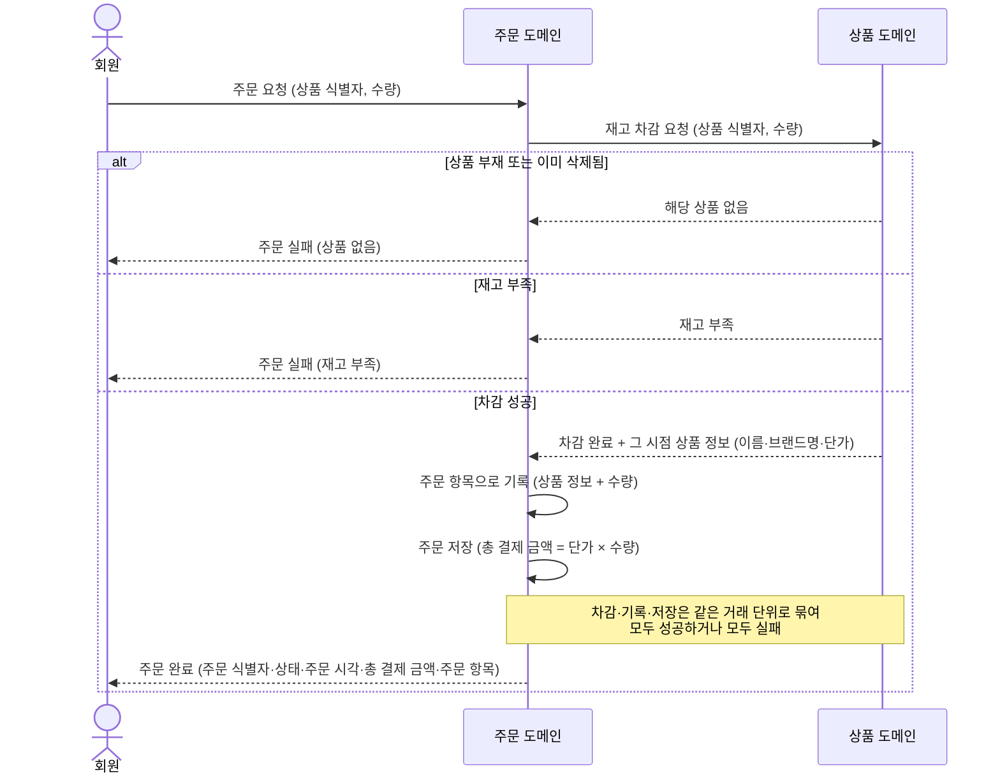
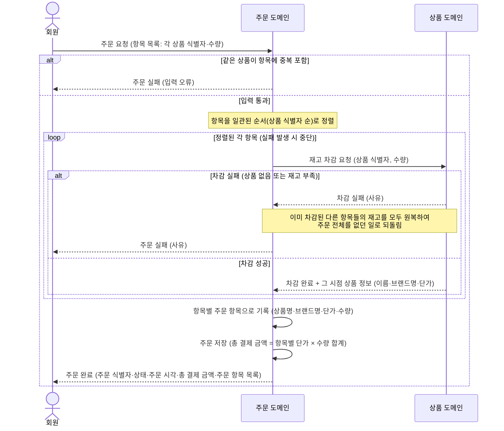
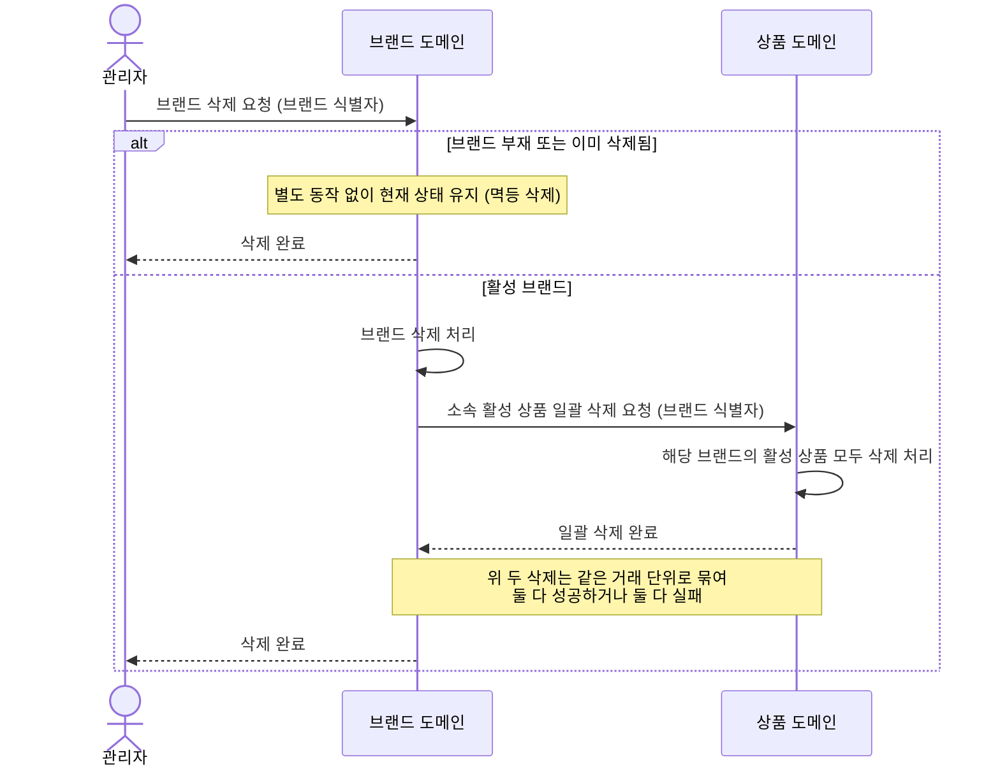

# '감성 이커머스' 시퀀스 다이어그램

[01-requirements.md](01-requirements.md)의 유저 스토리 중 도메인 간 협력이 본질이거나 합의해야 할 정책이 많아 글만으로 흐름이 잘 잡히지 않는 시나리오를 그림으로 옮긴 문서다. 도메인 어휘로 적어 PM·디자이너도 따라갈 수 있게 했고, 백엔드 구현 어휘(트랜잭션·SQL·잠금)는 다이어그램에서 빼고 추가 고려사항에 텍스트로 보강했다.

---

## ORD-1. 회원은 특정 상품 하나를 즉시 주문할 수 있다.

### 그린 이유
단일 상품 주문 한 건이지만 차감 시점(결정 2)·동시성 약속(결정 4)·스냅샷 기록(결정 5)·거래 단위·실패 분기가 한 흐름으로 모이는 시나리오다. 결정들이 어디에서 맞물리고 어떤 순서로 풀리는지 시퀀스로 옮긴다.

### 한 줄 요약
회원이 상품 한 종을 N개 주문하면, 주문 도메인은 상품 도메인에게 차감을 요청한다. 차감이 성공하면 응답으로 받은 상품 정보(이름·브랜드명·단가)를 주문 항목으로 기록해 그 시점의 거래를 영수증처럼 남기고, 주문 식별자·상태·주문 시각·총 결제 금액과 함께 회원에게 돌려준다.

### 다이어그램

### 추가 고려사항

- **스냅샷의 이유 (결정 5)**: 기록 대상은 "그 시점 거래를 재현하는 데 재무·식별 가치가 있는 최소 집합"으로 한정한다 — 상품명·브랜드명·단가·수량. 이후 상품의 이름이나 가격이 바뀌어도 영수증·정산은 그 시점 모습 그대로 남는다.
- **즉시 차감의 이유 (결정 2)**: 결제 미구현 단계라 "주문 = 차감"으로 단순화했다. 결제가 들어오면 차감이 두 단계(주문 시 예약 → 결제 시 확정)로 쪼개지고 본 시퀀스도 둘로 갈라진다.
- **동시 주문에서도 재고가 음수가 되지 않는 약속 (결정 4)**: 도메인 협력 수준에서는 드러나지 않지만, 상품 도메인이 "차감 요청을 받았을 때 재고가 충분한 경우에만 차감한다"는 약속을 거래 단위로 보장한다. 같은 상품에 동시 주문이 몰려도 재고가 0 아래로 내려가지 않는다.
- **거래 단위의 의미**: 차감·기록·저장 셋 중 하나라도 실패하면 셋 모두 처음 상태로 되돌아간다. "차감은 됐는데 주문은 저장 안 된" 상태가 외부에 보이는 일은 없다.

---

## ORD-2. 회원은 단일 또는 여러 상품을 한 번의 주문으로 묶어 주문할 수 있다.

### 그린 이유
ORD-1의 합의 위에 같은 상품 중복 거부·차감 순서·부분 실패 원복·전부 성공 또는 전부 실패 정책이 더해져 결정 가짓수가 배로 늘어난 시나리오다. 여러 항목이 한 거래로 묶이고 풀리는 분기를 시퀀스로 옮긴다.

### 한 줄 요약
회원이 여러 상품을 묶어 한 번에 주문하면, 주문 도메인은 항목들을 일관된 순서로 정렬한 뒤 상품 도메인에 항목별 차감을 요청한다. 모든 항목이 성공하면 항목별 스냅샷으로 기록해 주문을 저장하고, 어느 한 항목이라도 실패하면 그 시점에 멈춰 이미 차감된 다른 항목까지 모두 되돌려 주문 전체를 없던 일로 만든다.

### 다이어그램

### 추가 고려사항

- **전부 성공 또는 전부 실패의 이유**: 부분 성공("재고 있는 항목만이라도 처리")은 본 라운드의 정책이 아니다. 회원이 의도한 주문 묶음이 그대로 성립하거나 아예 성립하지 않는 두 결과만 허용해 결제·환불·CS의 사고 경로를 단순하게 유지한다.
- **같은 상품 중복 거부의 이유**: 한 주문 안에 같은 상품이 두 줄 이상 들어오면 수량 합산이 누구 책임인지 모호해진다. 합산 책임은 클라이언트로 미루고, 서버는 단일 항목 단일 줄을 강제한다.
- **동시 주문에서도 재고가 음수가 되지 않는 약속 (결정 4)**: ORD-1과 동일하다. 상품 도메인이 "차감 요청을 받았을 때 재고가 충분한 경우에만 차감한다"는 약속을 거래 단위로 보장한다. ORD-2는 항목이 여럿이라 이 약속이 항목마다 그대로 걸린다.
- **일관된 순서로 차감 요청하는 이유 (결정 4의 교착 회피 측면)**: 두 회원이 같은 두 상품 묶음을 동시에 주문할 때, 한 쪽은 A→B 순으로, 다른 쪽은 B→A 순으로 차감을 시도하면 서로 상대방의 차감을 기다리는 교착이 생긴다. 항목을 상품 식별자 같은 일관된 키로 정렬하면 두 요청이 같은 순서로 차감을 보내므로 교착이 끊긴다.
- **항목별 스냅샷 (결정 5)**: ORD-1과 마찬가지로 항목마다 그 시점 상품명·브랜드명·단가·수량을 기록한다.
- **추후 변화 자리**:
    - 결제 도입 시(결정 2 추후 개선): 차감이 예약·확정 두 단계로 쪼개진다. 본 시퀀스는 둘로 갈라진다.
    - 옵션·할인 도입 시(결정 5 추후 개선): 옵션명·할인 적용가가 스냅샷에 더해진다.

---

## BRD-6. 관리자는 등록된 브랜드를 삭제할 수 있다. 삭제 시 해당 브랜드의 상품도 함께 삭제된다.

### 그린 이유
브랜드 삭제 한 줄 뒤에 두 도메인의 책임 경계·cascade의 처리 위치·멱등 응답 정책(결정 6)이 함께 합의되어야 하는 시나리오다. 두 도메인이 한 거래로 손잡고 풀리는 협력 흐름을 시퀀스로 옮긴다.

### 한 줄 요약
관리자가 브랜드 삭제를 요청하면, 브랜드 도메인은 자신을 삭제 처리한 뒤 상품 도메인에게 "이 브랜드의 활성 상품을 모두 삭제해줘"라고 요청한다. 두 삭제는 같은 거래 단위로 묶여 둘 다 성공하거나 둘 다 실패한다. 대상 브랜드가 없거나 이미 삭제된 경우에도 별도의 오류 없이 정상 응답으로 마무리한다.

### 다이어그램

### 추가 고려사항

- **멱등 삭제의 이유 (결정 6)**: 같은 자원에 같은 삭제 요청이 여러 번 들어와도 결과가 같아야 한다는 약속이다. 부재·이미 삭제 모두 정상 응답으로 통일해 (1) 반복 호출이 안전하고, (2) 응답으로부터 자원 존재 여부를 추론할 수 없게 한다. 잘못된 식별자도 정상 응답이라 운영에서 디버깅이 불리한 점은 관리자 로그·도구로 보완한다.
- **거래 단위로 묶이는 이유**: 브랜드만 삭제되고 소속 상품은 살아 있는 상태(또는 그 반대)가 외부에 노출되면, 회원이 "브랜드 없는 상품"을 조회하게 되어 정합이 깨진다. 두 삭제를 같은 거래로 묶어 부분 삭제 상태가 외부에 보이지 않게 한다.
- **진행 중인 주문**: 같은 상품에 진행 중인 주문이 있더라도, 주문 시점에 기록된 항목 스냅샷(결정 5)이 보존되므로 과거 주문 표시는 영향받지 않는다.

<!-- HUMANIZE-SUMMARY v1.6.1
run_id: 2026-05-20-003
metrics:
  char_in: 3360
  char_out: 3338
  change_rate: 약 6%
  self_check: 6/6
  grade: A
categories:  # before → after
  H-3 메타 진입/기계적 메타 도입: 4 → 0
  E-2 평탄 종결 "~한다/~된다" 균일: 다수 → 일부 (단언·"~다/"~ㄴ다"로 분산)
  A-15 추상 주어 기계적 호응 ("결정들이 만나는 지점과 흐름의 순서를 ~로 기록한다"): 3 → 0
  번역투 의심 ("이 약속이 매 항목 차감에 동일하게 적용된다"): 1 → 0
  도입부 "본 문서는 ~을 그림으로 기록한다" 기계적 자기 지시: 1 → 0
self_check:
  - 고유명사·수치·인용 100% 보존: OK (도메인·결정 번호·식별자·mermaid 전부 원형)
  - 변경률 30% 이하: OK (산문 영역 약 6%, mermaid 0%)
  - 장르 이탈 없음: OK (리포트·설계 문서 톤 유지)
  - register 보존: OK (격식 "~한다·~된다·~다" 일관)
  - S1 잔존 0건: OK (H-3·D-1·D-6·I-1 등 핵심 S1 없음)
  - 인공 표현 추가 없음: OK (비유·수사 신규 도입 없음)
highlights:
  - id: 도입부 메타 도입
    before: "본 문서는 [01-requirements.md]의 유저 스토리 중 도메인 간 협력이 본질이거나 합의해야 할 정책이 많아 글만으로 흐름의 형상이 잘 떠오르지 않는 시나리오를 그림으로 기록한다."
    after: "[01-requirements.md]의 유저 스토리 중 도메인 간 협력이 본질이거나 합의해야 할 정책이 많아 글만으로 흐름이 잘 잡히지 않는 시나리오를 그림으로 옮긴 문서다."
  - id: A-15 추상 주어
    before: "결정들이 만나는 지점과 흐름의 순서를 시퀀스 다이어그램으로 기록한다."
    after: "결정들이 어디에서 맞물리고 어떤 순서로 풀리는지 시퀀스로 옮긴다."
  - id: 라벨 호응 평탄화
    before: "여러 항목이 한 거래로 묶이고 풀리는 분기 흐름을 시퀀스 다이어그램으로 기록한다."
    after: "여러 항목이 한 거래로 묶이고 풀리는 분기를 시퀀스로 옮긴다."
  - id: 번역투 정리
    before: "ORD-2는 항목이 여럿이라 이 약속이 매 항목 차감에 동일하게 적용된다."
    after: "ORD-2는 항목이 여럿이라 이 약속이 항목마다 그대로 걸린다."
  - id: E-2 종결 분산
    before: "외부에 보이지 않음."
    after: "외부에 보이는 일은 없다."
residual_findings: 없음 (도메인·결정 번호·mermaid·굵게 라벨 전부 원형 유지, S1 0건)
grade_reason: "A — S1 0건, 산문 영역 변경률 약 6%, mermaid·헤딩·결정 번호·기술 어휘 100% 보존, 자체검증 6항 통과. 리포트·설계 문서 register 그대로."
-->
