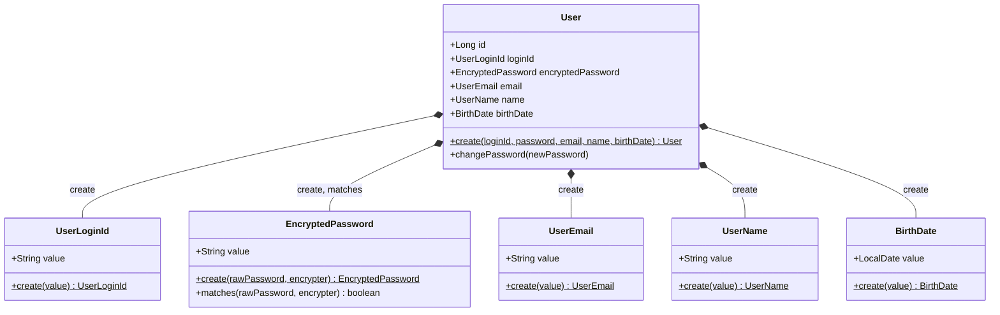
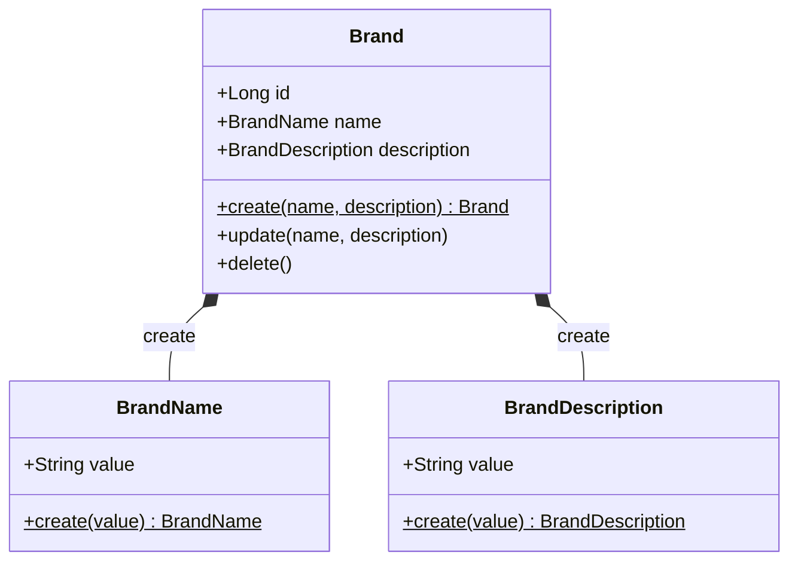
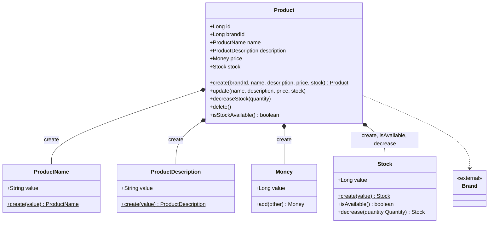
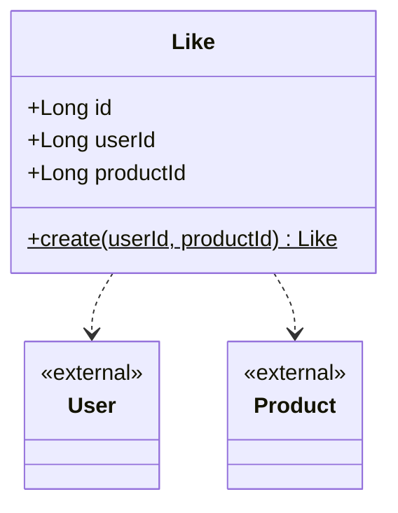
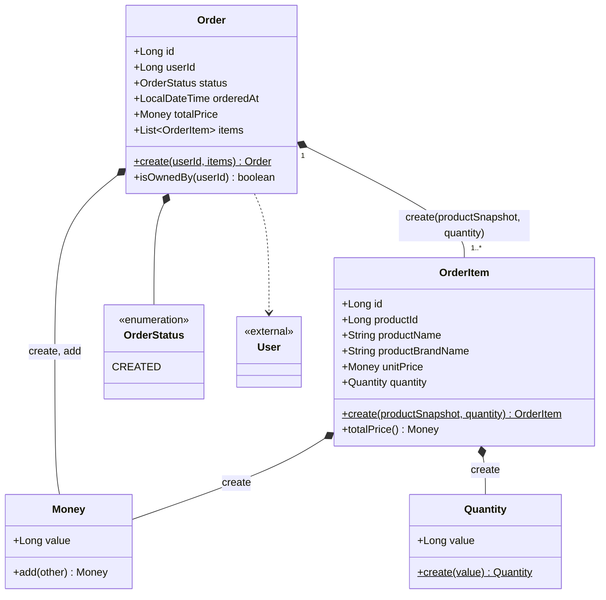

# '감성 이커머스' 클래스 다이어그램

본 문서는 [01-requirements.md](01-requirements.md)의 모든 유저 시나리오에서 도출한 **도메인 모델**의 정적 구조를 한 장의 통합 클래스 다이어그램으로 기록하고, 도메인별로 작은 다이어그램과 함께 책임·도출 과정을 정리한다.

## 통합 클래스 다이어그램

```mermaid
classDiagram
    class Money {
        +Long value
        +create(value)$ Money
        +add(other) Money
    }

    namespace Users {
        class User {
            +Long id
            +UserLoginId loginId
            +EncryptedPassword encryptedPassword
            +UserEmail email
            +UserName name
            +BirthDate birthDate
            +create(loginId, password, email, name, birthDate)$ User
            +changePassword(newPassword)
        }
        class UserLoginId {
            +String value
            +create(value)$ UserLoginId
        }
        class EncryptedPassword {
            +String value
            +create(rawPassword, encrypter)$ EncryptedPassword
            +matches(rawPassword, encrypter) boolean
        }
        class UserEmail {
            +String value
            +create(value)$ UserEmail
        }
        class UserName {
            +String value
            +create(value)$ UserName
        }
        class BirthDate {
            +LocalDate value
            +create(value)$ BirthDate
        }
    }

    namespace Brands {
        class Brand {
            +Long id
            +BrandName name
            +BrandDescription description
            +create(name, description)$ Brand
            +update(name, description)
            +delete()
        }
        class BrandName {
            +String value
            +create(value)$ BrandName
        }
        class BrandDescription {
            +String value
            +create(value)$ BrandDescription
        }
    }

    namespace Products {
        class Product {
            +Long id
            +Long brandId
            +ProductName name
            +ProductDescription description
            +Money price
            +Stock stock
            +create(brandId, name, description, price, stock)$ Product
            +update(name, description, price, stock)
            +decreaseStock(quantity)
            +delete()
            +isStockAvailable() boolean
        }
        class ProductName {
            +String value
            +create(value)$ ProductName
        }
        class ProductDescription {
            +String value
            +create(value)$ ProductDescription
        }
        class Stock {
            +Long value
            +create(value)$ Stock
            +isAvailable() boolean
            +decrease(quantity Quantity) Stock
        }
    }

    namespace Likes {
        class Like {
            +Long id
            +Long userId
            +Long productId
            +create(userId, productId)$ Like
        }
    }

    namespace Orders {
        class Order {
            +Long id
            +Long userId
            +OrderStatus status
            +LocalDateTime orderedAt
            +Money totalPrice
            +List~OrderItem~ items
            +create(userId, items)$ Order
            +isOwnedBy(userId) boolean
        }
        class OrderItem {
            +Long id
            +Long productId
            +String productName
            +String productBrandName
            +Money unitPrice
            +Quantity quantity
            +create(productSnapshot, quantity)$ OrderItem
            +totalPrice() Money
        }
        class Quantity {
            +Long value
            +create(value)$ Quantity
        }
        class OrderStatus {
            <<enumeration>>
            CREATED
        }
    }

    User *-- UserLoginId : create
    User *-- EncryptedPassword : create, matches
    User *-- UserEmail : create
    User *-- UserName : create
    User *-- BirthDate : create
    Brand *-- BrandName : create
    Brand *-- BrandDescription : create
    Product *-- ProductName : create
    Product *-- ProductDescription : create
    Product *-- Money : create
    Product *-- Stock : create, isAvailable, decrease
    Order *-- Money : create, add
    Order *-- OrderStatus
    OrderItem *-- Money : create
    OrderItem *-- Quantity : create

    Order "1" *-- "1..*" OrderItem : create(productSnapshot, quantity)
```

---

## 회원 도메인 (User)

> 본 volume-2 시나리오에는 User 자체 시나리오가 명세되지 않았지만, volume-1에서 회원가입·인증 작업이 완료된 도메인이며 Like·Order가 `userId`로 참조하므로 본 다이어그램에 표기.

### 다이어그램

### 도메인 모델

| 객체 | 종류 | 책임 |
| --- | --- | --- |
| `User` | Entity | 로그인 ID·암호화 비밀번호·이메일·이름·생년월일 보유. `create`(정적 팩토리), `changePassword`(자기 비밀번호 갱신). |
| `UserLoginId`·`UserEmail`·`UserName`·`BirthDate` | VO | 형식·길이 검증을 `create()` 팩토리에 단일화. |
| `EncryptedPassword` | VO | 암호화된 값 보유. `create(rawPassword, encrypter)`가 평문을 암호화해 인스턴스 생성, `matches(rawPassword, encrypter) boolean`로 인증 시 평문 일치 판단. `encrypter`는 도메인 인터페이스 `PasswordEncrypter`; `BcryptPasswordEncrypter` 같은 구현은 인프라 책임이라 다이어그램 밖. |

---

## 브랜드 도메인 (Brand)

### 다이어그램

### 도메인 모델

| 객체 | 종류 | 책임 |
| --- | --- | --- |
| `Brand` | Entity | 이름·설명 보유. `create`(정적 팩토리), `update`(자기 속성 갱신), `delete`(자기 soft delete). 자기 외 다른 브랜드와의 협력(중복 검사·소속 상품 cascade)은 응용 계층 책임. |
| `BrandName` | VO | 1~50자 검증을 `create()` 팩토리에 단일화. |
| `BrandDescription` | VO | 설명 값 보존. |

---

## 상품 도메인 (Product)

### 다이어그램

### 도메인 모델

| 객체 | 종류 | 책임 |
| --- | --- | --- |
| `Product` | Entity | 브랜드 ID·이름·설명·가격·재고 보유. `create`(정적 팩토리), `update`(자기 속성 갱신, brandId 변경 불가), `decreaseStock`(Stock에 위임), `delete`(자기 soft delete), `isStockAvailable`(Stock에 위임). 브랜드 존재 검증·재고 차감 동시성 보장은 응용 계층/인프라 책임. |
| `ProductName` | VO | 1~100자 검증을 `create()` 팩토리에 단일화. |
| `ProductDescription` | VO | 설명 값 보존. |
| `Stock` | VO | 재고 (Long value). `isAvailable()`로 가용 여부 판단, `decrease(quantity: Quantity) Stock`로 차감(불변 — 새 인스턴스 반환, 재고 부족 시 예외). 매개변수가 Quantity 타입이라 도메인 의미 명료. |

---

## 좋아요 도메인 (Like)

### 다이어그램

### 도메인 모델

| 객체 | 종류 | 책임 |
| --- | --- | --- |
| `Like` | Entity | 회원·상품 ID 보유. `create`(정적 팩토리). 멱등 등록·hard delete(취소)는 응용 계층 책임. |

---

## 주문 도메인 (Order)

### 다이어그램

### 도메인 모델

| 객체 | 종류 | 책임 |
| --- | --- | --- |
| `Order` | Entity (Aggregate Root) | 회원 ID·상태·시각·총 결제 금액·주문 항목 보유. `create`(정적 팩토리, 항목들의 `totalPrice()` 합으로 총 결제 금액 계산, 내부에서 `OrderItem.create(productSnapshot, quantity)` 호출), `isOwnedBy`(본인 검증). 항목 정렬·트랜잭션·재고 차감 조율은 응용 계층. |
| `OrderItem` | Entity (Order 종속) | 주문 시점 상품 정보(`productId`·`productName`·`productBrandName`·`unitPrice`)와 수량 보유. 평탄한 스냅샷 필드로 보존해 Product 변경에 영향받지 않음 (결정 5의 시간상 결합 끊김). `create(productSnapshot, quantity)`(정적 팩토리), `totalPrice()`(단가 × 수량). Order 없이 독립 존재 불가. |
| `Quantity` | VO | 주문 항목 수량 (1 이상). |
| `OrderStatus` | Enum | 본 라운드 `CREATED`만. 결제 도입 시 PAID·CANCELLED 자리. |
