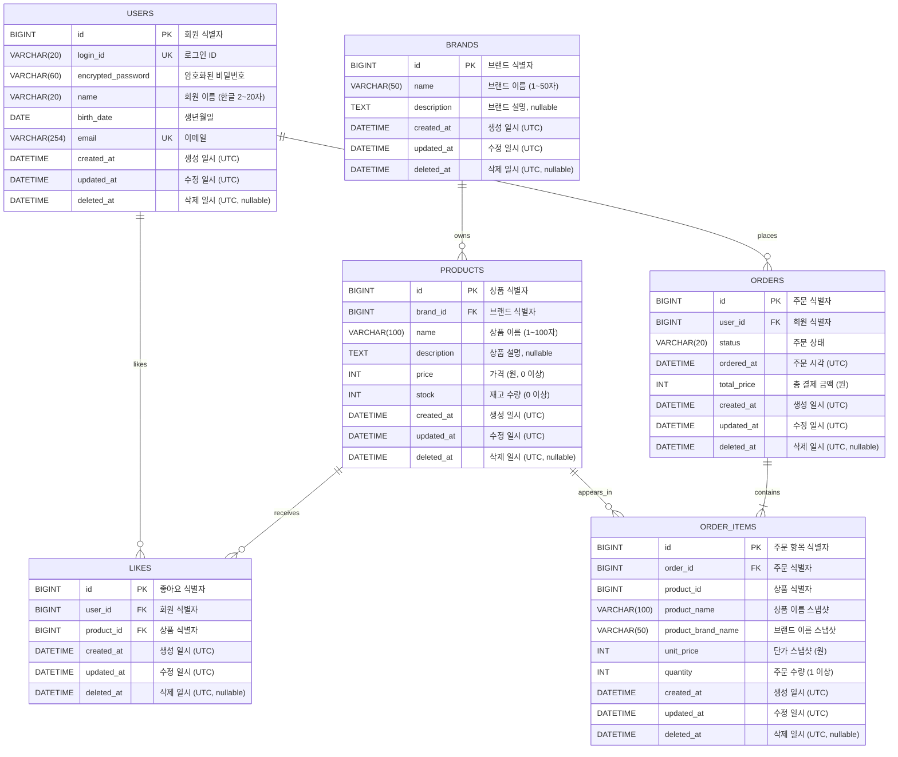

# '감성 이커머스' ERD

본 문서는 [03-class-diagram.md](03-class-diagram.md)의 도메인 모델을 MySQL 8.0+ 물리 스키마로 옮긴 결과를 기록한다. 01·02·03이 도메인 어휘로 "무엇을·왜·누가"를 말한다면, 본 문서는 RDB 어휘로 "그 약속을 어떤 테이블·컬럼·제약으로 보존하는가"를 답한다. 컬럼 타입·키·제약은 도메인 모델의 VO·스냅샷 정책이 RDB 차원에서 어떻게 표현되는지를 그대로 따른다.

## 공통 컨벤션

- 엔진: `InnoDB`
- 문자셋 / Collation: `utf8mb4` / `utf8mb4_unicode_ci`
- PK: `BIGINT AUTO_INCREMENT`
- 시간 컬럼: `DATETIME`. 모든 행은 **UTC wall-clock** 시각을 저장한다.
- Soft delete: 모든 테이블이 `BaseEntity`(`modules/jpa`)를 상속받아 `created_at`, `updated_at`, `deleted_at`(nullable) 세 컬럼을 공통 보유한다.

## 다이어그램



## 테이블 정의

### `users` — 회원

```sql
CREATE TABLE users (
    id                 BIGINT       NOT NULL AUTO_INCREMENT COMMENT '회원 식별자',
    login_id           VARCHAR(20)  NOT NULL COMMENT '로그인 ID (영문 대소문자/숫자, 4~20자)',
    encrypted_password VARCHAR(60)  NOT NULL COMMENT 'BCrypt 해시 비밀번호 (60자 고정)',
    name               VARCHAR(20)  NOT NULL COMMENT '회원 이름 (한글 완성형, 2~20자)',
    birth_date         DATE         NOT NULL COMMENT '생년월일',
    email              VARCHAR(254) NOT NULL COMMENT '이메일 주소 (RFC 5322, 최대 254자)',
    created_at         DATETIME     NOT NULL COMMENT '생성 일시 (UTC)',
    updated_at         DATETIME     NOT NULL COMMENT '수정 일시 (UTC)',
    deleted_at         DATETIME     NULL     COMMENT '삭제 일시 (UTC)',
    PRIMARY KEY (id),
    UNIQUE KEY uk_users_login_id (login_id),
    UNIQUE KEY uk_users_email    (email)
) ENGINE=InnoDB
  DEFAULT CHARSET=utf8mb4
  COLLATE=utf8mb4_unicode_ci
  COMMENT='회원';
```

---

### `brands` — 브랜드

```sql
CREATE TABLE brands (
    id          BIGINT       NOT NULL AUTO_INCREMENT COMMENT '브랜드 식별자',
    name        VARCHAR(50)  NOT NULL COMMENT '브랜드 이름 (1~50자)',
    description TEXT         NULL     COMMENT '브랜드 설명 (임의 길이 자연어)',
    created_at  DATETIME     NOT NULL COMMENT '생성 일시 (UTC)',
    updated_at  DATETIME     NOT NULL COMMENT '수정 일시 (UTC)',
    deleted_at  DATETIME     NULL     COMMENT '삭제 일시 (UTC)',
    PRIMARY KEY (id)
) ENGINE=InnoDB
  DEFAULT CHARSET=utf8mb4
  COLLATE=utf8mb4_unicode_ci
  COMMENT='브랜드';
```

---

### `products` — 상품

```sql
CREATE TABLE products (
    id          BIGINT       NOT NULL AUTO_INCREMENT COMMENT '상품 식별자',
    brand_id    BIGINT       NOT NULL COMMENT '브랜드 식별자 (brands.id)',
    name        VARCHAR(100) NOT NULL COMMENT '상품 이름 (1~100자)',
    description TEXT         NULL     COMMENT '상품 설명 (임의 길이 자연어)',
    price       INT          NOT NULL COMMENT '가격 (원, 0 이상)',
    stock       INT          NOT NULL COMMENT '재고 수량 (0 이상)',
    created_at  DATETIME     NOT NULL COMMENT '생성 일시 (UTC)',
    updated_at  DATETIME     NOT NULL COMMENT '수정 일시 (UTC)',
    deleted_at  DATETIME     NULL     COMMENT '삭제 일시 (UTC)',
    PRIMARY KEY (id)
) ENGINE=InnoDB
  DEFAULT CHARSET=utf8mb4
  COLLATE=utf8mb4_unicode_ci
  COMMENT='상품';
```

---

### `likes` — 좋아요

```sql
CREATE TABLE likes (
    id         BIGINT   NOT NULL AUTO_INCREMENT COMMENT '좋아요 식별자',
    user_id    BIGINT   NOT NULL COMMENT '회원 식별자 (users.id)',
    product_id BIGINT   NOT NULL COMMENT '상품 식별자 (products.id)',
    created_at DATETIME NOT NULL COMMENT '생성 일시 (UTC)',
    updated_at DATETIME NOT NULL COMMENT '수정 일시 (UTC)',
    deleted_at DATETIME NULL     COMMENT '삭제 일시 (UTC)',
    PRIMARY KEY (id),
    UNIQUE KEY uk_likes_user_id_product_id (user_id, product_id)
) ENGINE=InnoDB
  DEFAULT CHARSET=utf8mb4
  COLLATE=utf8mb4_unicode_ci
  COMMENT='좋아요';
```

---

### `orders` — 주문

```sql
CREATE TABLE orders (
    id          BIGINT      NOT NULL AUTO_INCREMENT COMMENT '주문 식별자',
    user_id     BIGINT      NOT NULL COMMENT '회원 식별자 (users.id)',
    status      VARCHAR(20) NOT NULL COMMENT '주문 상태 (현재 CREATED만 사용. 향후 PAID/CANCELLED/REFUNDED 등 확장 여지)',
    ordered_at  DATETIME    NOT NULL COMMENT '주문 시각 (UTC, 도메인 의미)',
    total_price INT         NOT NULL COMMENT '총 결제 금액 (원, 항목 단가×수량 합)',
    created_at  DATETIME    NOT NULL COMMENT '생성 일시 (UTC)',
    updated_at  DATETIME    NOT NULL COMMENT '수정 일시 (UTC)',
    deleted_at  DATETIME    NULL     COMMENT '삭제 일시 (UTC)',
    PRIMARY KEY (id)
) ENGINE=InnoDB
  DEFAULT CHARSET=utf8mb4
  COLLATE=utf8mb4_unicode_ci
  COMMENT='주문';
```

---

### `order_items` — 주문 항목

```sql
CREATE TABLE order_items (
    id                 BIGINT       NOT NULL AUTO_INCREMENT COMMENT '주문 항목 식별자',
    order_id           BIGINT       NOT NULL COMMENT '주문 식별자 (orders.id)',
    product_id         BIGINT       NOT NULL COMMENT '상품 식별자 (products.id)',
    product_name       VARCHAR(100) NOT NULL COMMENT '주문 시점 상품 이름',
    product_brand_name VARCHAR(50)  NOT NULL COMMENT '주문 시점 브랜드 이름',
    unit_price         INT          NOT NULL COMMENT '주문 시점 단가 (원)',
    quantity           INT          NOT NULL COMMENT '주문 수량 (1 이상)',
    created_at         DATETIME     NOT NULL COMMENT '생성 일시 (UTC)',
    updated_at         DATETIME     NOT NULL COMMENT '수정 일시 (UTC)',
    deleted_at         DATETIME     NULL     COMMENT '삭제 일시 (UTC)',
    PRIMARY KEY (id)
) ENGINE=InnoDB
  DEFAULT CHARSET=utf8mb4
  COLLATE=utf8mb4_unicode_ci
  COMMENT='주문 항목';
```
