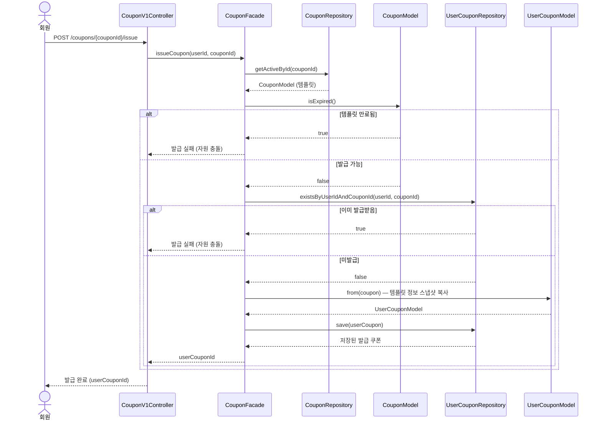
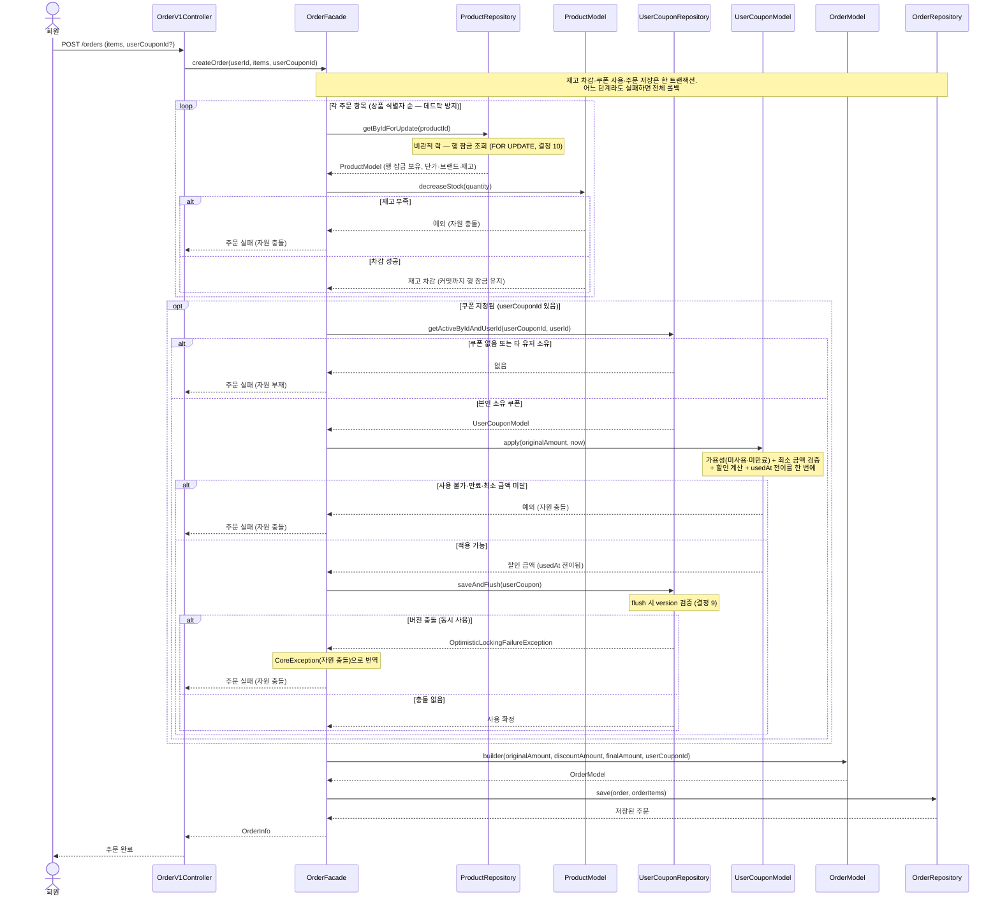

# '감성 이커머스' 시퀀스 다이어그램

본 문서는 [01-requirements.md](01-requirements.md)의 유저 스토리 중 백엔드 구현 복잡도가 높은 시나리오를 `Controller → Facade → Repository·Model` 레이어 관점에서 기록한다. 본 스킬의 기본 양식(도메인 협력 관점)과 달리, 이번 문서는 구현 흐름 파악을 목적으로 레이어·클래스명·메서드를 노출하는 예외 형식이다. 동시성 제어는 단계 2(구현)의 범위 밖이므로 제외하며, 단계 4(락 적용)에서 이 문서도 함께 갱신한다.

표기 규칙: 회원 검증(`getActiveById(userId)`)처럼 모든 대고객 API 공통인 분기는 생략한다. 영속성 경계는 `Repository`(인터페이스)까지만 그리고 `RepositoryImpl`·`JpaRepository`·DB는 생략한다. 도메인 로직은 `Model`(엔티티) 참여자로 표현한다.

---

## CPN-6. 회원은 특정 쿠폰 템플릿의 쿠폰을 발급받을 수 있다.

### 정리한 이유

쿠폰 발급은 템플릿 조회 → 만료 검증 → 1인 1매 중복 검사 → 템플릿 정보 스냅샷 복사 생성이 한 트랜잭션 안에서 순차로 진행되며, 검증 분기와 `Facade`·`Model`·`Repository` 간 책임 분담이 한 흐름에 모이는 시나리오다. 이 호출 연쇄를 백엔드 레이어 관점에서 기록한다.

### 흐름 요약

`CouponV1Controller`가 발급 요청을 받아 `CouponFacade`에 위임한다. `Facade`는 `CouponRepository`로 템플릿을 조회한 뒤 만료 여부 검증을 `CouponModel`에 맡기고, `UserCouponRepository`로 1인 1매 중복을 확인한다. 통과하면 템플릿 정보(이름·할인 타입·할인 값·최소 주문 금액·만료 시각)를 스냅샷 복사한 `UserCouponModel`을 생성해 저장하고 발급 쿠폰 식별자를 돌려준다. 템플릿이 만료되었거나 이미 발급받은 이력이 있으면 자원 충돌로 응답한다.

### 다이어그램

### 구현 메모

- **트랜잭션 경계**: `CouponFacade.issueCoupon`에 `@Transactional`. 템플릿 조회·중복 검사·발급 쿠폰 저장이 한 경계 안에서 처리된다.
- **스냅샷 복사 (결정 3)**: `UserCouponModel.from(coupon)`이 템플릿의 이름·할인 타입·할인 값·최소 주문 금액·만료 시각을 복사해 발급 쿠폰에 고정한다. 이후 템플릿 수정·삭제와 무관하게 발급 쿠폰이 자족적으로 동작한다.
- **만료 판정 (결정 2)**: `CouponModel.isExpired()`는 템플릿의 만료 시각 기준 질의이며, `Facade`가 그 결과로 발급 가능 여부를 분기한다. 발급된 쿠폰은 복사된 만료 시각으로 자신의 수명을 판정한다.
- **1인 1매 (결정 5)**: `existsByUserIdAndCouponId`로 발급 이력을 검사한다. 재발급 요청은 자원 충돌로 응답한다.
- **동시성 (1인 1매 UK)**: 동일 회원이 동시에 발급을 요청하면 중복 검사(`exists`)와 저장(`save`) 사이 경합으로 두 장이 생길 수 있으나, `(user_id, coupon_id)` 유니크 제약([04-erd.md](04-erd.md))이 두 번째 저장을 막는다. 이 제약은 단계 4가 아니라 ERD에 이미 반영되어 있으므로, 단계 2 구현에서 제약 위반을 자원 충돌 예외로 변환해 응답하면 충분하며 별도 락은 두지 않는다.

---

## ORD-7. 회원은 주문에 보유한 쿠폰 한 장을 적용해 할인받을 수 있다.

### 정리한 이유

주문 쿠폰 적용은 다중 항목 재고 차감, 쿠폰 소유·상태 검증, 최소 주문 금액 확인, 할인 계산, 쿠폰 사용 전이, 금액 스냅샷 기록이 한 트랜잭션 경계 안에서 순차로 진행되며, 여러 도메인의 `Repository`와 `Model`이 `OrderFacade`의 오케스트레이션으로 협력하는 본 라운드 최대 복잡도 시나리오다. 이 호출 연쇄와 실패 시 전체 롤백 범위를 백엔드 레이어 관점에서 기록한다.

### 흐름 요약

`OrderV1Controller`가 주문 요청(항목들과 선택적 `userCouponId`)을 받아 `OrderFacade`에 위임한다. `Facade`는 항목마다 `ProductRepository`로 상품을 **잠금 조회(비관적 락, 결정 10)** 한 뒤 `ProductModel`에 재고 차감을 위임한다. 쿠폰이 지정되면 `UserCouponRepository`로 본인 소유의 발급 쿠폰을 조회해 `UserCouponModel.apply`에 가용성 검증·최소 금액 검증·할인 계산·사용 전이를 한 번에 위임한다(동일 쿠폰 동시 사용은 낙관적 락으로 차단, 결정 9). 마지막으로 원 주문 금액·할인 금액·최종 결제 금액·적용 쿠폰 식별자를 스냅샷한 `OrderModel`을 저장한다. 재고 부족, 쿠폰 부재·타인 소유, 사용됨·만료·최소 금액 미달 중 어느 하나라도 발생하면 전체가 롤백된다.

### 다이어그램

### 구현 메모

- **트랜잭션 경계**: `OrderFacade.createOrder`에 `@Transactional`. 재고 차감·쿠폰 사용·주문 저장이 한 경계 안에서 처리되며, 어느 단계라도 실패하면 차감된 재고와 사용 전이된 쿠폰이 모두 처음 상태로 되돌아간다.
- **쿠폰 적용 단일 진입점**: `UserCouponModel.apply(originalAmount, now)`가 가용성 검증(`getStatus(now)`가 `AVAILABLE`이 아니면 예외)·최소 주문 금액 검증(할인 전 금액 기준, 결정 8)·할인 계산(정액은 주문 금액으로 캡, 정률은 내림)·사용 전이(`usedAt` 기록)를 한 메서드로 수행하고 할인액을 반환한다. 검증과 전이가 한 메서드에 묶여 그 사이에 다른 흐름이 끼어들 여지가 없다.
- **쿠폰 검증 응답 어휘 (결정 7)**: 쿠폰 부재·타인 소유는 자원 부재로, 사용됨·만료·최소 금액 미달은 자원 충돌로 응답한다. 다이어그램의 두 실패 분기가 이 구분에 대응한다.
- **재고 비관적 락 (결정 10)**: 재고 차감은 `ProductRepository.getByIdForUpdate`로 상품 행을 잠금 조회(`@Lock(PESSIMISTIC_WRITE)`)한 뒤 `ProductModel.decreaseStock(quantity)`로 메모리에서 차감한다. 행 잠금은 트랜잭션 커밋까지 유지되어 같은 상품의 동시 차감을 직렬화한다. 다중 항목 주문은 상품 식별자 순으로 잠금을 획득해 데드락을 피한다.
- **쿠폰 낙관적 락 (결정 9)**: 발급 쿠폰에 버전을 두어, 사용 전이 flush 시 버전이 바뀌었으면 `OptimisticLockingFailureException`이 발생한다. 버전 충돌은 flush 시점에 나는데 트랜잭션 커밋은 `OrderFacade.createOrder` 메서드 밖이라, `apply` 직후 `UserCouponRepository.saveAndFlush`로 명시적 flush해 충돌을 메서드 안에서 감지한다. `OrderFacade`가 이 예외를 잡아 `CoreException(CONFLICT)`로 번역하므로(advice가 인프라 예외를 직접 처리하지 않음), 동일 쿠폰 동시 사용 시 두 번째 요청은 재시도 없이 자원 충돌(409)로 응답한다.
- **할인 계산 (결정 8)**: 최소 주문 금액 검증(할인 전 금액 기준)과 할인 계산(정액 캡·정률 내림)은 위 `apply` 안에서 함께 수행한다.
- **금액 스냅샷 (결정 6)**: `OrderModel`은 매개변수가 많아 정적 팩토리 대신 Lombok `@Builder`로 생성하며, 원 주문 금액·할인 금액·최종 결제 금액·적용 쿠폰 식별자를 기록한다. 세 금액의 정합(`최종 = 원금 − 할인`)은 단일 호출자인 `OrderFacade`가 계산해 보장한다. 쿠폰 미적용 주문은 할인 금액 0, 적용 쿠폰 식별자가 비어 있다.
- **브랜드명 스냅샷**: 주문 항목 생성 시 `BrandRepository`로 브랜드명도 조회해 함께 스냅샷한다(ORD-2 흐름 승계). 본 다이어그램에서는 핵심 흐름에 집중하기 위해 생략했다.
- **검증 순서**: 다이어그램은 재고 차감 → 쿠폰 적용 순으로 그렸다. 명세상 순서는 무관하다.
