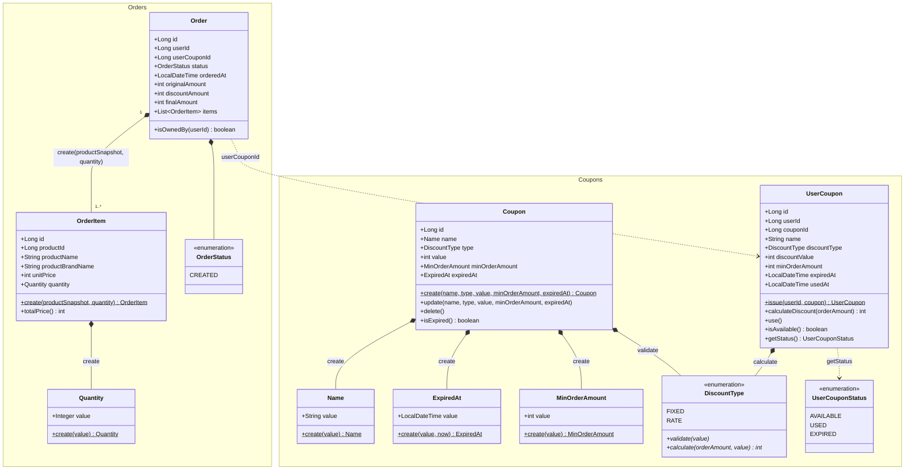
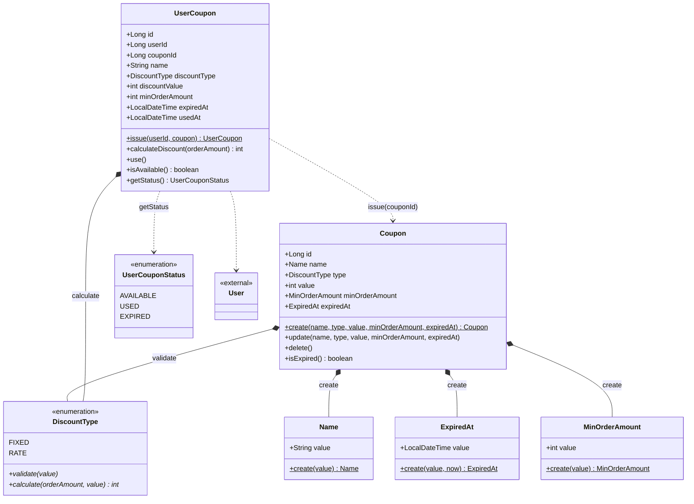
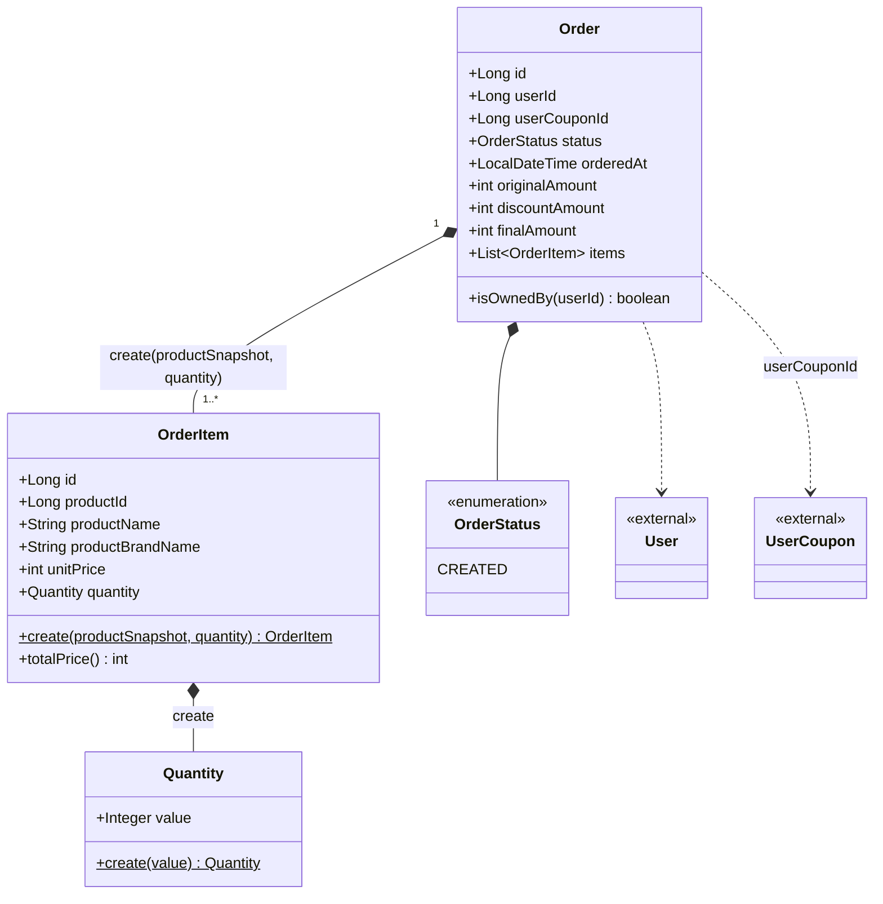

# '감성 이커머스' 클래스 다이어그램

본 문서는 [01-requirements.md](01-requirements.md)의 쿠폰 도메인과 주문 변경분에서 도출한 **도메인 모델**의 정적 구조를 기록한다. 회원·브랜드·상품·좋아요 도메인과 주문의 기존 구조는 [volume-2/03-class-diagram.md](../volume-2/03-class-diagram.md)를 따르며, 본 문서는 신규 쿠폰 도메인과 주문의 쿠폰 적용 변경분만 다룬다. 메서드명은 도메인 의미 어휘(`create`·`issue`·`use`·`calculateDiscount`)로 적으며, 코드 컨벤션(`of`·`from`·`build`) 매핑은 구현 단계의 책임이다. 금액은 실제 구현이 원시 정수로 다루므로(별도 금액 래퍼 VO 없음) `int`로 표기한다.

## 통합 클래스 다이어그램

---

## 쿠폰 도메인 (Coupon)

> 관리자가 정의하는 템플릿(`Coupon`)과 회원에게 발급된 쿠폰(`UserCoupon`)은 **별도 Aggregate**다. 발급 쿠폰은 템플릿을 `couponId`로 ID 참조하되, 할인 조건·만료를 발급 시점에 스냅샷으로 복사해 보유한다 (결정 3). 스냅샷 값은 템플릿 생성 시 이미 검증된 값이므로, `OrderItem`이 상품 정보를 원시 타입으로 보존하는 것과 같이 `UserCoupon`도 원시 타입으로 보유해 재검증하지 않는다. 이후 템플릿 수정·삭제와 무관하게 발급 쿠폰이 자족적으로 동작한다.

### 다이어그램

### 도메인 모델

| 객체 | 종류 | 책임 |
| --- | --- | --- |
| `Coupon` | Entity (Aggregate Root) | 이름·할인 타입·할인 값·최소 주문 금액·만료 시각 보유. 값이 최초로 들어오는 검증 원천 지점이라 `Name`·`MinOrderAmount`·`ExpiredAt` VO와 `DiscountType.validate`로 입력을 검증한다. `create`(정적 팩토리 — VO 검증에 더해 할인 값 전체 검증을 `DiscountType.validate`에 위임), `update`(자기 속성 갱신), `delete`(자기 soft delete), `isExpired`(만료 시각 경과 여부 질의 — 발급 가능 판단의 일부). 발급 쿠폰 생성은 자기 책임이 아니라 `UserCoupon`이 가져간다. 삭제 시 발급 중단·발급 쿠폰 독립은 응용 계층 책임. |
| `UserCoupon` | Entity (Aggregate Root) | 소유 회원 ID·템플릿 ID와 스냅샷(이름·할인 타입·할인 값·최소 주문 금액·만료 시각)·사용 시각 보유. 스냅샷은 템플릿에서 VO로 검증된 값이라 원시 타입으로 보유(재검증 없음). `issue(userId, coupon)`(정적 팩토리, 템플릿 정보 스냅샷 복사 생성), `calculateDiscount(orderAmount)`(최소 주문 금액 검증 통합 — 할인 전 금액이 `minOrderAmount` 미달 시 예외, 통과 시 `DiscountType.calculate`에 위임해 할인액 산출), `use`(사용 완료 전이 — `usedAt` 기록, 이미 사용·만료 시 예외), `isAvailable`(`getStatus() == AVAILABLE` 질의), `getStatus`(`usedAt`이 있으면 `USED`, 없고 만료 시각 경과면 `EXPIRED`, 아니면 `AVAILABLE` — 사용 완료가 만료보다 우선). 1인 1매 중복 검사와 본인 소유 검증(레포지토리 조회로 부재·타인을 한 번에 차단, 결정 7)은 응용 계층 책임. |
| `Name` | VO | `Coupon`의 이름. 1~100자 검증을 `create()` 팩토리에 단일화. 발급 시 `UserCoupon`에는 `String`으로 스냅샷. |
| `ExpiredAt` | VO | `Coupon`의 만료 시각. 사용자 입력값이라 null·기준 시각(`now`) 이전 금지를 `create(value, now)` 팩토리에 단일화(`BirthDate`의 미래 날짜 금지와 대칭). 비교 기준 시각은 표현 계층이 `DateTimeUtil`로 확정해 주입한다(요청 단위 시각 고정·테스트 용이). 발급 시 `UserCoupon`에는 원시 시각 타입으로 스냅샷. |
| `MinOrderAmount` | VO | `Coupon`의 최소 주문 금액(0 이상). `create()` 팩토리에 검증 단일화하며, 미지정(null) 시 0(제약 없음)으로 흡수해 항상 non-null로 보유한다. 발급 시 `UserCoupon`에는 `int`로 스냅샷되며, 충족 판정은 `UserCoupon.calculateDiscount`가 직접 비교 (결정 8). |
| `DiscountType` | Enum | `FIXED`·`RATE`. 할인 값(`int`)은 타입과 분리해 검증할 수 없어 별도 VO 없이 `DiscountType`이 검증을 단일 소유한다 — `validate(value)`(null 가드 + 타입별 전체 범위: 정액 1 이상, 정률 1~100)와 `calculate(orderAmount, value) int`(정액은 `min(value, orderAmount)`, 정률은 `orderAmount × value ÷ 100` 정수 나눗셈 내림, 결정 8)를 각 상수가 오버라이드. 분기·DI 없이 다형 디스패치. 템플릿과 발급 쿠폰이 같은 enum을 공유한다. |
| `UserCouponStatus` | Enum | `AVAILABLE`·`USED`·`EXPIRED`. `getStatus()`의 반환 타입. 저장 컬럼이 아니라 `usedAt`·`expiredAt`에서 파생되는 표시 상태 (결정 2). |

---

## 주문 도메인 (Order) — 쿠폰 적용 변경분

> 기존 주문 구조(volume-2 03)에서 총 결제 금액 단일 필드(`totalPrice`)를 원 주문 금액·할인 금액·최종 결제 금액 세 금액으로 분리하고, 적용한 발급 쿠폰을 `userCouponId`로 ID 참조한다 (결정 6). `OrderItem`·`Quantity`·`OrderStatus`는 volume-2와 동일하다.

### 다이어그램

### 도메인 모델

| 객체 | 종류 | 책임 |
| --- | --- | --- |
| `Order` | Entity (Aggregate Root) | 회원 ID·적용 쿠폰 ID·상태·시각·세 금액·주문 항목 보유. 매개변수가 많아 정적 팩토리 대신 Lombok `@Builder`로 생성하며, 세 금액의 정합(`최종 = 원금 − 할인`)은 단일 호출자인 응용 계층이 계산해 보장한다. `isOwnedBy`(본인 검증). 쿠폰 미적용 시 응용 계층이 할인 금액 0·`userCouponId` 없이 생성한다. 할인 금액 계산(쿠폰)·항목 정렬·재고 차감·트랜잭션은 응용 계층 책임. |
| `OrderItem` | Entity (Order 종속) | 주문 시점 상품 스냅샷(`productId`·`productName`·`productBrandName`·`unitPrice`)과 수량 보유. volume-2와 동일. |
| `Quantity` | VO | 주문 항목 수량(1 이상). volume-2와 동일. |
| `OrderStatus` | Enum | 본 라운드 `CREATED`만. volume-2와 동일. |
