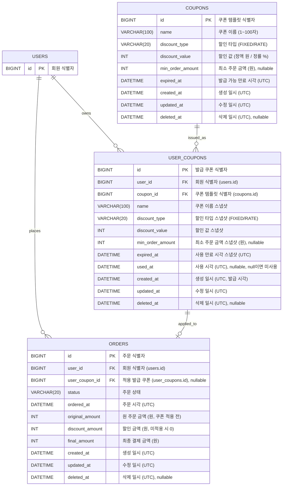

# '감성 이커머스' ERD

본 문서는 [03-class-diagram.md](03-class-diagram.md)의 쿠폰 도메인과 주문 변경분을 MySQL 8.0+ 물리 스키마로 옮긴 결과를 기록한다. 01·02·03이 도메인 어휘로 "무엇을·왜·누가"를 말한다면, 본 문서는 RDB 어휘로 "그 약속을 어떤 테이블·컬럼·제약으로 보존하는가"를 답한다. 회원·브랜드·상품·좋아요 테이블과 주문 항목 테이블의 전체 정의는 [volume-2/04-erd.md](../volume-2/04-erd.md)를 따르며, 본 문서는 신규 테이블(`coupons`·`user_coupons`)과 변경 테이블(`orders`)만 기재한다. 컬럼 타입·키·제약은 도메인 모델의 VO·스냅샷 정책이 RDB 차원에서 어떻게 표현되는지를 그대로 따른다.

## 공통 컨벤션

- 엔진: `InnoDB`
- 문자셋 / Collation: `utf8mb4` / `utf8mb4_unicode_ci`
- PK: `BIGINT AUTO_INCREMENT`
- 시간 컬럼: `DATETIME`. 모든 행은 **UTC wall-clock** 시각을 저장한다.
- Soft delete: 모든 테이블이 `BaseEntity`(`modules/jpa`)를 상속받아 `created_at`, `updated_at`, `deleted_at`(nullable) 세 컬럼을 공통 보유한다.
- FK 제약: DDL에 `FOREIGN KEY` 제약을 두지 않고, 참조 컬럼 COMMENT에 `(대상 테이블.id)`를 명시한다. 참조 정합성은 애플리케이션 책임이며, erDiagram의 관계선·카디널리티는 도메인 관계로서 유지한다.

## 다이어그램



## 테이블 정의

### `coupons` — 쿠폰 템플릿

```sql
CREATE TABLE coupons (
    id               BIGINT       NOT NULL AUTO_INCREMENT COMMENT '쿠폰 템플릿 식별자',
    name             VARCHAR(100) NOT NULL COMMENT '쿠폰 이름 (1~100자)',
    discount_type    VARCHAR(20)  NOT NULL COMMENT '할인 타입 (FIXED: 정액, RATE: 정률)',
    discount_value   INT          NOT NULL COMMENT '할인 값 (정액은 원, 정률은 %)',
    min_order_amount INT          NULL     COMMENT '최소 주문 금액 (원, 1 이상). 미지정 시 제약 없음',
    expired_at       DATETIME     NOT NULL COMMENT '발급 가능 만료 시각 (UTC)',
    created_at       DATETIME     NOT NULL COMMENT '생성 일시 (UTC)',
    updated_at       DATETIME     NOT NULL COMMENT '수정 일시 (UTC)',
    deleted_at       DATETIME     NULL     COMMENT '삭제 일시 (UTC)',
    PRIMARY KEY (id)
) ENGINE=InnoDB
  DEFAULT CHARSET=utf8mb4
  COLLATE=utf8mb4_unicode_ci
  COMMENT='쿠폰 템플릿';
```

> 쿠폰 이름은 중복을 허용하므로(CPN-1) `name`에 UK를 두지 않는다.

---

### `user_coupons` — 발급 쿠폰

```sql
CREATE TABLE user_coupons (
    id               BIGINT       NOT NULL AUTO_INCREMENT COMMENT '발급 쿠폰 식별자',
    user_id          BIGINT       NOT NULL COMMENT '회원 식별자 (users.id)',
    coupon_id        BIGINT       NOT NULL COMMENT '쿠폰 템플릿 식별자 (coupons.id)',
    name             VARCHAR(100) NOT NULL COMMENT '발급 시점 쿠폰 이름 스냅샷',
    discount_type    VARCHAR(20)  NOT NULL COMMENT '발급 시점 할인 타입 스냅샷 (FIXED/RATE)',
    discount_value   INT          NOT NULL COMMENT '발급 시점 할인 값 스냅샷',
    min_order_amount INT          NULL     COMMENT '발급 시점 최소 주문 금액 스냅샷 (원)',
    expired_at       DATETIME     NOT NULL COMMENT '사용 만료 시각 스냅샷 (UTC)',
    used_at          DATETIME     NULL     COMMENT '사용 시각 (UTC). NULL이면 미사용',
    created_at       DATETIME     NOT NULL COMMENT '생성 일시 (UTC, 발급 시각)',
    updated_at       DATETIME     NOT NULL COMMENT '수정 일시 (UTC)',
    deleted_at       DATETIME     NULL     COMMENT '삭제 일시 (UTC)',
    PRIMARY KEY (id),
    UNIQUE KEY uk_user_coupons_user_id_coupon_id (user_id, coupon_id)
) ENGINE=InnoDB
  DEFAULT CHARSET=utf8mb4
  COLLATE=utf8mb4_unicode_ci
  COMMENT='발급 쿠폰';
```

> 한 회원이 한 템플릿에서 한 장만 발급받으므로(1인 1매, 결정 5) `(user_id, coupon_id)`에 UK를 둔다. 발급 시각은 별도 컬럼 없이 `created_at`으로 제공한다(CPN-7·8 정렬·노출).

---

### `orders` — 주문 (변경)

volume-2의 `orders`에서 총 결제 금액 단일 컬럼(`total_price`)을 원 주문 금액·할인 금액·최종 결제 금액 세 컬럼으로 분리하고, 적용한 발급 쿠폰을 `user_coupon_id`(nullable)로 참조한다 (결정 6). 그 외 컬럼은 volume-2와 동일하다.

```sql
CREATE TABLE orders (
    id              BIGINT      NOT NULL AUTO_INCREMENT COMMENT '주문 식별자',
    user_id         BIGINT      NOT NULL COMMENT '회원 식별자 (users.id)',
    user_coupon_id  BIGINT      NULL     COMMENT '적용 발급 쿠폰 식별자 (user_coupons.id). 미적용 시 NULL',
    status          VARCHAR(20) NOT NULL COMMENT '주문 상태 (현재 CREATED만 사용. 향후 PAID/CANCELLED 등 확장 여지)',
    ordered_at      DATETIME    NOT NULL COMMENT '주문 시각 (UTC, 도메인 의미)',
    original_amount INT         NOT NULL COMMENT '원 주문 금액 (원, 쿠폰 적용 전 항목 단가×수량 합)',
    discount_amount INT         NOT NULL COMMENT '할인 금액 (원, 쿠폰 미적용 시 0)',
    final_amount    INT         NOT NULL COMMENT '최종 결제 금액 (원, 원 주문 금액 - 할인 금액)',
    created_at      DATETIME    NOT NULL COMMENT '생성 일시 (UTC)',
    updated_at      DATETIME    NOT NULL COMMENT '수정 일시 (UTC)',
    deleted_at      DATETIME    NULL     COMMENT '삭제 일시 (UTC)',
    PRIMARY KEY (id)
) ENGINE=InnoDB
  DEFAULT CHARSET=utf8mb4
  COLLATE=utf8mb4_unicode_ci
  COMMENT='주문';
```
