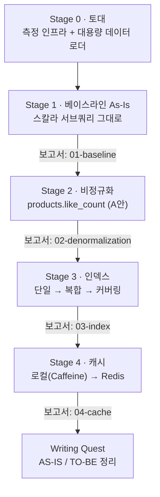

# Volume 5 — 상품 목록 조회 읽기 성능 최적화 TODO

> 이 문서는 **살아있는 계획서(가설)** 다. 측정 결과가 가정과 어긋나면(예: 단일 인덱스가 예상과 달리 먹힘) plan을 사실에 맞게 고친다.
> 대상 API: `GET /api/v1/products` (목록) · `GET /api/v1/products/{id}` (상세)

---

## 0. 목표 & 성공 기준

읽기 병목을 **비정규화 → 인덱스 → 캐시** 순으로 단계적으로 제거하며, **각 단계가 직전 대비 얼마나 개선됐는지 수치 증거(보고서)로 증명**한다. 단순 속도 개선이 아니라 "왜 빨라졌는가"를 EXPLAIN과 부하 지표로 설명할 수 있는 것이 목표.

성공 기준 (요구사항 체크리스트 매핑):

- **Index** — brandId 필터 + 좋아요 순 정렬을 처리하고, 정렬/필터 유즈케이스별 인덱스(단일·복합·커버링)를 적용해 전후 성능을 보고서로 비교했다.
- **Structure** — 목록/상세에서 좋아요 수 조회·정렬이 가능하도록 구조를 개선하고, 좋아요 등록/해제 시 카운트가 정상 동기화된다.
- **Cache** — Redis 캐시 + TTL/무효화 전략을 적용하고, **캐시 미스 상황에서도 서비스가 정상 동작**한다.
- **Evidence** — 모든 단계의 EXPLAIN/k6 결과가 `reports/`에 구조적으로 남아 테크니컬 라이팅의 증거가 된다.

---

## 1. 핵심 결정 (확정)

| 주제 | 결정 | 근거 |
|---|---|---|
| 좋아요 비정규화 위치 | **products.like_count 컬럼(A안)으로 고정** | 단일 테이블이라 복합/커버링 인덱스가 온전히 성립 → 인덱스 학습이 깔끔. (별도 읽기모델 테이블 B안은 이번 범위 밖) |
| 동시성 처리 | **원자적 갱신으로 고정** (`UPDATE … SET like_count = like_count ± 1`). 락/lost-update 재현 학습은 **하지 않음** | 이번 과제 주제는 인덱스·캐시이므로 동시성은 정답만 적용 |
| 성능 측정 | **EXPLAIN/EXPLAIN ANALYZE**(DB 근거) + **k6 동시 50명**(API p50/p95/p99) | 캐시 효과는 EXPLAIN에 안 잡혀 API 계층 측정 필수. 부하 모델·시나리오는 `reports/00-setup.md` §6 |
| 데이터 준비 | **일회성 Java 로더 + 영속 로컬 MySQL** | likes 수백만 행 → data.sql 리터럴/매 부팅 재생성은 비현실적 |
| 목록 캐시 범위 | **핫셋만**(필터 없는 인기 정렬 + 앞쪽 몇 페이지)을 짧은 TTL로 | 필터×정렬×페이지 조합 폭발을 무차별 캐시하지 않음 |

---

## 2. 최적화 사다리 + 측정 게이트

핵심 불변 원칙: **측정 → 변경 → 측정 → 비교**. 각 화살표마다 `EXPLAIN`(추정)+`EXPLAIN ANALYZE`(실측) + `k6`(동시 50명) 비교 보고서를 남긴다.



---

## 3. 측정·보고 규약 (1급 산출물)

> EXPLAIN·k6를 돌릴 때마다 **반드시** 보고서를 남긴다. 이 데이터가 블로그/이슈의 수치 증거다.

- **위치**: `docs/volume-5/reports/`
- **단계별 보고서**: `01-baseline.md`, `02-denormalization.md`, `03-index.md`, `04-cache.md`
  - 작성 양식은 `reports/TEMPLATE.md` 복사 — **시나리오별**(쿼리 → EXPLAIN 추정 → EXPLAIN ANALYZE 실측 → 차이 이유 → API 동시 50명) + **이 단계 총괄표**.
- **누적 비교**: `reports/SUMMARY.md` — 모든 단계의 헤드라인 p95를 한 표(사다리)에 누적. **PM이 보는 증거 척추**.
- **환경·시나리오·규약**: `reports/00-setup.md` — 환경·데이터 분포·시나리오 S1~S4 정의·부하 모델(동시 50명)·DNF(>30s) 규칙을 한 번 고정 기록.

### 시나리오 세트 (4개) — 정의·파라미터는 `reports/00-setup.md` §6

| ID | 정렬 | 브랜드 필터 | 페이지 | 주인공 단계 |
|---|---|---|---|---|
| **S1** | 좋아요순 | 없음(전역) | 1페이지 | 서브쿼리 → 비정규화 → 커버링 인덱스 |
| **S2** | 좋아요순 | 인기 브랜드(847) | 1페이지 | 복합 인덱스(brand_id, like_count) |
| **S3** | 최신순 | 없음(전역) | 1페이지 | 기본 정렬 |
| **S4** | (상세) | productId 단건(45577) | — | 캐시(로컬→Redis) |

> **측정 방법**: 실행계획은 `EXPLAIN`(추정) + `EXPLAIN ANALYZE FORMAT=TREE`(실측, 단건 30s 초과면 DNF). API 는 **k6 동시 50명**(`constant-vus`) p50/p95/p99 + 에러율. 두 렌즈는 1:1로 같지 않다(ANALYZE=단일 쿼리, API=50명 경합) — 함께 본다.

---

## Stage 0 — 토대: 측정 인프라 + 대용량 데이터

**목표:** 재현 가능하고 영속적인 측정 환경을 만든다. (환경·분포·규약: `reports/00-setup.md`)

- [x] **영속 로컬 MySQL 확보** — `docker/infra-compose.yml`의 MySQL(3306), named volume `docker_mysql-8-data`.
- [x] **측정 전용 프로파일 정리** — `local,seed`(스키마 create + 비웹 적재 후 종료) / `perf`(`ddl-auto:none`, 데이터 보존).
- [x] **Java 일회성 데이터 로더** — `com.loopers.support.seed.MeasurementDataSeeder` (products 100,000 / likes 2,905,713 / brands 1,000 / users 5,000, 고정 시드). **데이터는 DB에 적재 완료 — 재적재 불필요.**
- [x] **데이터 분포 sanity 체크** — `measurement/sql/00-sanity.sql`. 인기 브랜드 `847`, 핫 상품 `45577` 확정.
- [x] **측정 규약 재정비(50VU)** — k6 `products.js`(S1~S4, `constant-vus` 50/30s), `01-explain-baseline.sql`(S1~S4), `reports/00-setup.md` 재작성.
- [x] **`perf`/`seed` 로깅 블록 추가** — `supports/logging/.../logback.xml` 에 `perf,seed` springProfile 부재로 배너 이후 로그가 침묵 → 콘솔 appender 추가(기동 진단 가능).
- [x] **50VU 하니스 스모크 재검증** — EXPLAIN S1~S4 계획 정상. k6 S4 1133건 100% 200(p50 343ms·p95 871ms). S3 단건 200(7.05s) 정상, 동시 50명은 커넥션 풀 고갈로 ~3s 500(`connection-timeout`).

**검증 ✅:** S1~S4 EXPLAIN + k6(동시 50명) 한 번씩 동작 확인.

> **Stage 1 사전 메모:** 베이스라인 목록(S1·S2·S3)은 동시 50명에서 7초 서브쿼리가 풀(40)을 고갈시켜 **~3초에 500(connection-timeout)** 으로 떨어진다 → API 는 DNF/에러로 기록(단건은 S3 7.05s·S1/S2 >30s). EXPLAIN(추정)은 항상 캡처.

---

## Stage 1 — 베이스라인 (As-Is, 최적화 0)

**목표:** 현재 구현의 병목을 수치로 박제해 모든 비교의 원점을 만든다. → `reports/01-baseline.md`

- [x] 현재 코드(스칼라 서브쿼리 기반 like 카운트) **변경 없이** 측정
- [x] EXPLAIN 계획 캡처 — S1~S4 (추정). EXPLAIN ANALYZE 실측 S3·S4. S1·S2 는 DNF(31s 캡 ERROR 3024 확인)
- [x] k6 동시 50명 — S4 정상(p50 435·p95 707·p99 905), S1·S2·S3 100% 에러(3s 풀 고갈)
- [x] **`reports/01-baseline.md` 작성** + `SUMMARY.md` 베이스라인 열 채움

**검증 ✅:** 베이스라인 보고서 완성. 가장 느린 시나리오 = 좋아요순(S1·S2 DNF). 목록 3종 모두 동시 50명 붕괴, 상세(S4)만 생존.

---

## Stage 2 — 비정규화 (products.like_count, A안)

**목표:** 매 조회 집계(COUNT 서브쿼리)를 제거한다.

- [x] `products`에 `like_count INT NOT NULL DEFAULT 0` 컬럼 추가(엔티티 매핑) + 백필 SQL 작성 — `measurement/sql/02-denormalize-backfill.sql`(ALTER + GROUP BY 조인 백필 + 일치 검증). 측정 DB(perf) 실제 실행은 측정 단계에서.
- [x] **좋아요 동기화 (원자적 갱신 고정)** — LikeFacade 등록/취소에 같은 트랜잭션으로
  - 등록: 실제 INSERT 시 `incrementLikeCount` (`UPDATE … SET like_count = like_count + 1 WHERE id = ?`)
  - 취소: 실제 삭제 시(`deletedCount > 0`) `decrementLikeCount` (`… - 1`). 미존재 취소는 미감소
  - 등록/취소의 멱등 의미(중복 등록·미존재 취소)를 기존 동작과 정확히 일치 (`existsBy` early-return / 삭제 행 수 0 분기)
- [x] 동기화 테스트 — LikeFacade 통합 테스트로 등록/취소 후 `like_count == COUNT(likes)`(멱등 포함) 검증 + 단위 테스트로 증감 호출 검증
- [x] **서브쿼리 제거** → `like_count` 컬럼 직접 정렬/조회 — 목록(LATEST/PRICE_ASC/LIKES_DESC)·상세·좋아요한 상품 목록 전부
- [ ] S1~S4 EXPLAIN + k6 재측정
  - 예상: 서브쿼리는 사라지지만 **인덱스가 아직 없어 정렬은 filesort** → 다음 단계 동기
- [ ] **`reports/02-denormalization.md` 작성** + `SUMMARY.md` 갱신

**검증:** like 카운트 서브쿼리가 사라지고, like_count 동기화 테스트가 통과한다. 베이스라인 대비 개선폭이 보고서에 기록된다.

---

## Stage 3 — 인덱스 (단일 → 복합 → 커버링)

**목표:** 정렬·필터 비용을 인덱스로 제거하고, 그 과정의 한계를 단계적으로 체감한다.

> 4개 시나리오 × 인덱스 변형을 다 측정하지 않는다. **각 인덱스 타입의 효과/한계를 가장 잘 보여주는 시나리오로 illustrate** 한 뒤, **최종 인덱스 세트로 S1~S4 전부 측정**해 총괄표에 올린다.

### 3a. 단일 인덱스의 한계 관찰 (illustrate)
- [ ] `(like_count)`, `(brand_id)` 단일 인덱스를 걸고 S1·S2 EXPLAIN
- [ ] 관찰: 필터는 타도 **정렬을 못 커버**(filesort 잔존), 정렬은 타도 필터를 못 좁힘 → 단일 인덱스의 구조적 한계 기록

### 3b. 복합 인덱스 + leftmost prefix (illustrate)
- [ ] 좋아요 정렬용 `(brand_id, like_count DESC, id DESC)` — S2에서 **정렬 생략**(filesort 사라짐) 확인
- [ ] **컬럼 순서를 일부러 바꿔**(예: `(like_count, brand_id)`) leftmost prefix가 깨지는 것을 EXPLAIN으로 체감
- [ ] 최신순용 `(created_at DESC, id DESC)` 또는 `(id DESC)`

### 3c. 커버링 인덱스 (illustrate)
- [ ] SELECT 컬럼을 인덱스에 포함시켜 `Using index`(북마크 조회 제거) 달성 → 효과 측정 (S1)

### 3d. 옵티마이저·통계·무력화 (학습 재현)
- [ ] `ANALYZE TABLE products` 전/후 비교 (대량 적재 후 통계 갱신 효과)
- [ ] **인덱스가 안 쓰이는 경우** 재현: 인기 브랜드(매칭 행 多)에서 옵티마이저가 Full Scan을 택하는 것이 **옳은 비용 판단**임을 EXPLAIN으로 확인

### 마무리
- [ ] 최종 인덱스 세트를 **실제 코드/스키마에 반영**
- [ ] S1~S4 전체 재측정 → **`reports/03-index.md` 작성** + `SUMMARY.md` 갱신

**검증:** S2에서 `Using filesort`가 사라지고(`Using index` 등장), 인덱스 적용 전후 비교가 보고서에 남는다.

---

## Stage 4 — 캐시 (로컬 → Redis)

**목표:** 자주·동일하게 요청되는 조회의 DB 호출을 줄여 **캐시로 성능이 얼마나 개선되는지** 측정한다.

### 4a. 상세 API — 로컬 캐시 먼저
- [ ] `@Cacheable`(Caffeine 로컬)로 상세 조회 캐시. 키 = productId, 캐시 대상은 **엔티티가 아닌 DTO**
- [ ] 상품 수정/삭제 시 `@CacheEvict`, 무효화는 **트랜잭션 커밋 이후(AFTER_COMMIT)**
- [ ] S4 측정 (hit/miss 시 p95 대비)

### 4b. Redis 전환
- [ ] `RedisCacheManager` + 직렬화(`GenericJackson2JsonRedisSerializer`, DTO 직렬화) 설정 (modules/redis 활용)
- [ ] **TTL을 근거로 결정** — like_count·상품 필드의 변경 빈도와 허용 staleness를 따져 상세/목록 각각의 TTL 산정(감 금지, 보고서에 근거 기록)
- [ ] 캐시 미스 시 정상 DB 폴백 동작 확인

### 4c. 목록 API 캐시 (핫셋 한정)
- [ ] 전략: **필터 없는 인기 정렬(LIKES_DESC, S1) + 앞쪽 몇 페이지만** 짧은 TTL로 캐시
- [ ] 무효화 범위 트레이드오프(좋아요/상품 변경 시) 결정·기록

### 마무리
- [ ] S1·S2·S4 캐시 on/off 비교 측정 → **`reports/04-cache.md` 작성** + `SUMMARY.md` 갱신

**검증:** 캐시 hit 시 API p95가 급감하고, 캐시 미스에도 서비스가 정상 동작한다. on/off 개선폭이 보고서에 남는다.

---

## Writing Quest

- [ ] `SUMMARY.md`의 단계별 수치를 근거로 AS-IS/TO-BE 서사 작성 (블로그 or GitHub Issue 4포맷 중 택1)
- [ ] 의사결정 중심("왜 그렇게 판단했는가") — 단일→복합 인덱스 전환, 비정규화 트레이드오프, TTL/무효화 근거

---

## 산출물 트리

```
docs/volume-5/
  TODO.md                      ← (이 문서, 로컬 작업용 · 커밋 제외)
  reports/
    TEMPLATE.md                ← 보고서 양식 (시나리오 블록 + 단계 총괄표)
    SUMMARY.md                 ← 단계별 헤드라인 p95 누적 (PM용 사다리)
    00-setup.md                ← 환경·데이터 분포·시나리오·측정 규약
    01-baseline.md
    02-denormalization.md
    03-index.md
    04-cache.md
```
