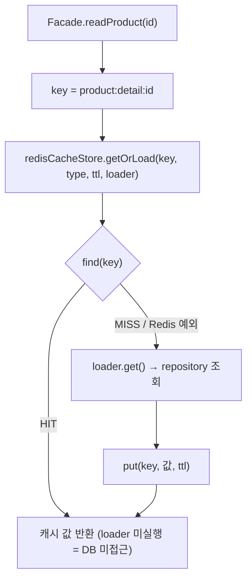
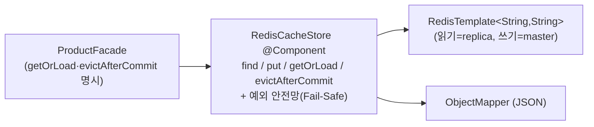

# Stage 4 캐시 설계 — Redis(RedisTemplate) · Facade 레이어

> **TL;DR** 상품 상세·목록(핫셋)을 Redis에 캐싱한다. 캐시 흐름은 `@Cacheable`로 감추지 않고 **RedisTemplate을 감싼 `RedisCacheStore`**(`getOrLoad` read-through)로 `ProductFacade`에 명시한다. `likeCount`는 근사 표시값으로 보고 **TTL을 정합성 노브**로 쓴다(상세 60s·목록 30s). 무효화는 상품 본문 변경(수정/삭제)에만 **커밋 이후(AFTER_COMMIT)**, 좋아요 증감엔 걸지 않는다. 측정 근거는 `reports/04-cache.md`.

## 결정 요약

| 주제 | 결정 | 근거 |
|---|---|---|
| 정합성 모델 | `likeCount`는 staleness 허용(근사 표시값) | 5,001 vs 5,000은 사용자 체감 0, 비즈니스 크리티컬 아님 → 캐시 본질(정확도↔속도) |
| 캐시 백엔드 | **Redis**, `RedisTemplate` 직접 제어(`@Cacheable` 미사용) | "언제 저장·무효화되는지 눈으로" — 흐름 가시성·학습/글쓰기 근거 |
| 캐시 위치 | **Facade(애플리케이션) 레이어** | 무효화 이벤트(수정/삭제)가 보이는 곳 = read·evict 동거. 핫셋·쿼리기반 캐시는 유즈케이스 정책 |
| raw 접근 격리 | `RedisCacheStore` 래퍼로 캡슐화 | `redisTemplate.opsForValue()`는 래퍼 안에만. Facade는 `getOrLoad/evictAfterCommit`만 |
| read-through | `getOrLoad(key, type, ttl, loader)` 한 메서드 | find→히트반환/미스→loader→put 의식을 한 곳에. loader(Supplier)로 DB 호출을 미스 시점까지 지연 |
| 상세 무효화 | 수정/삭제 시 AFTER_COMMIT evict | 본문 변경은 "보여서 티 나는" 변경. 좋아요엔 무효화 안 함(TTL 흡수) |
| 목록 무효화 | **TTL-only**(evict 없음) | 핫셋 30s TTL로 신선도 통제. "상품변경=핫목록 전체 evict"는 둔하고 학습가치 적음 |
| 로컬 캐시 | 드롭(Caffeine/2-tier 안 함) | RedisTemplate 단일 경로로 단순화 |

## 1. 캐싱 대상 · 키 · 값 · TTL

| 대상 | 조건 | 키 | 값 | TTL | 무효화 |
|---|---|---|---|---|---|
| 상세 `GET /products/{id}` | 항상 | `product:detail:{id}` | `ProductDetailInfo`(record) JSON | **60s** | 수정/삭제 시 AFTER_COMMIT evict |
| 목록 `GET /products` | **핫셋만**: `brandId==null && sort==LIKES_DESC && page==0` | `product:list:likes_desc:p0:s{size}` | `CachedProductSummaryInfos`(content+total) JSON | **30s** | TTL-only |

> 그 외 목록(브랜드 필터·다른 정렬·뒷페이지)은 **캐시 우회, DB 직행** — 필터×정렬×페이지 조합 폭발을 무차별 캐싱하지 않는다.

**TTL 근거:** 상세는 본문 변경을 evict가 즉시 처리하므로 TTL이 책임지는 건 `likeCount` 신선도뿐 → 60s 드리프트는 표시값으로 무의미. 목록은 순위(`like_count`)가 실시간 출렁이고 삭제 상품이 잠깐 잔존할 수 있어 더 짧게(30s).

## 2. 읽기 흐름 (read-through · getOrLoad)



- **loader는 `Supplier`** — `getOrLoad`에 넘길 때는 실행되지 않고, 미스일 때만 `loader.get()`으로 repository를 호출한다(히트면 repository 미호출). repository 의존성은 Facade에만 있고 `RedisCacheStore`는 도메인을 모른다(범용).
- **캐시 미스/Redis 장애 시 정상 동작(Fail-Safe):** `find`가 비거나 예외면 loader(DB)로 폴백. `RedisCacheStore`가 Redis 예외를 삼켜 MISS로 처리 → 서비스가 멈추지 않는다.
- **캐시 penetration 회피:** loader가 예외(NOT_FOUND)를 던지면 `put`에 도달하지 않아 부재가 캐시되지 않는다.

## 3. 무효화 (AFTER_COMMIT)

`@CacheEvict`/즉시 evict는 트랜잭션 *커밋 전*에 동작해, evict와 커밋 사이에 동시 reader가 옛 값을 재적재하는 레이스가 있다. `RedisCacheStore.evictAfterCommit(key)`는 **실제 트랜잭션이 활성(`isActualTransactionActive`)이면** `afterCommit`에 delete를 등록하고, 없으면 즉시 delete한다.

```
updateProduct: product.update(...);                evictAfterCommit(detailKey)
deleteProduct: ...ifPresent(p -> { p.delete();     evictAfterCommit(detailKey) })
createLike/deleteLike: incrementLikeCount 등         → 무효화 안 함 (TTL 흡수)
```

## 4. 컴포넌트



- `RedisCacheStore`(`support/cache`): 제네릭 `find/put/getOrLoad/evictAfterCommit`. 직렬화·예외처리·커밋후 무효화를 한 곳에 캡슐화.
- 값 타입: 상세=`ProductDetailInfo`, 목록=`CachedProductSummaryInfos(List<ProductSummaryInfo> content, long totalElements)`. Spring `Page`(PageImpl)는 역직렬화 생성자가 없어 깨지므로, **record로 평탄화**해 담고 조회 시 `toPage(page,size)`로 복원(PageWrapper 패턴).

## 5. 아키텍트 렌즈 자가점검

1. **반드시 참이어야 할 전제:** likeCount staleness가 허용된다 · 핫셋(인기순 1p·핫 상품 상세)이 트래픽의 큰 비중 · 상품 본문 변경 빈도가 낮다 · Redis가 DB보다 빠르고 장애 시 폴백으로 degrade 가능.
2. **10배 트래픽 첫 병목:** 비핫셋 경로(브랜드 필터·최신순·뒷페이지)는 여전히 DB 직행 + 전역 count 풀스캔(측정상 S3 ~197ms). 핫셋 키가 단일(p0)이라 동시 만료 시 thundering herd(일제 미스→DB 몰림) 가능.
3. **hit율 30% 이하:** 캐시 유지비(메모리·네트워크·직렬화)만 늘고 DB 부하는 거의 그대로 → 순이득 미미~음수. 원인은 보통 키 과분산 → **핫셋만 캐싱**이 hit율 방어책(측정상 S4 hit 99.96%).
4. **정합성 깨짐 시나리오:** (a) 좋아요 폭주 중 TTL 동안 옛 카운트(허용) (b) 삭제 상품이 핫목록에 30s 잔존→클릭 404 (c) 본문 수정 후 커밋 전 evict+동시 재적재→AFTER_COMMIT로 방어 (d) Redis 장애 시 evict 유실→옛 값 TTL까지 잔존(무효화는 best-effort).
5. **가장 나중까지 미룰 개선:** 목록 evict · 2-tier 로컬 캐시 · penetration 마커 · refresh-ahead/키 워밍.
6. **가장 먼저 손댈 위험:** 캐시 장애 폴백(미스 시 정상 동작) + AFTER_COMMIT 무효화 — 가용성·정합성 직결. 그래서 `RedisCacheStore`의 예외 안전망과 `evictAfterCommit`을 1급으로 둔다.

## 6. 측정 결과 요약 (동시 50명 p95, `reports/04-cache.md`)

| 시나리오 | 캐싱 | ③ 인덱스 | ④ 캐시 | 효과 |
|---|---|---:|---:|---|
| S1 목록 인기순·전역 | 핫셋 캐싱 | 260ms | **22ms** | 약 12× (DB 미접근) |
| S4 상세·단건 | 캐싱 | 23ms | **18ms** | 지연 소폭, **DB 호출 99.96% 제거**(replica 적중 113,060/40) |
| S2 좋아요·브랜드 | 우회 | 69ms | 49ms | ③ 동급(의도된 경계) |
| S3 최신·전역 | 우회 | 247ms | 197ms | ③ 동급(캐싱 범위 밖) |

전 구간 에러율 0%. 캐시의 본질 이득은 **S1 지연 급감 + S4 DB 부하 제거**이며, 캐싱하지 않은 시나리오는 인덱스 수준을 유지한다.

## 비범위 (Out of scope)

로컬/2-tier 캐시 · 목록 evict · 캐시 부재 마커(penetration) · refresh-ahead/스탬피드 정면 대응 · 동시성 락 기반 lost-update 재현.
