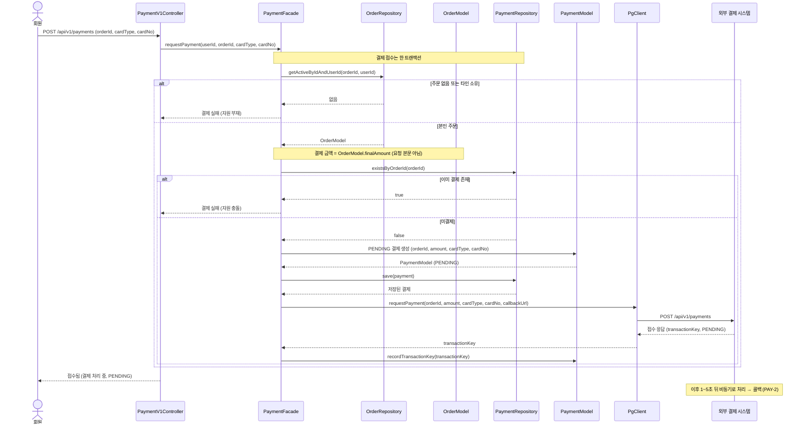
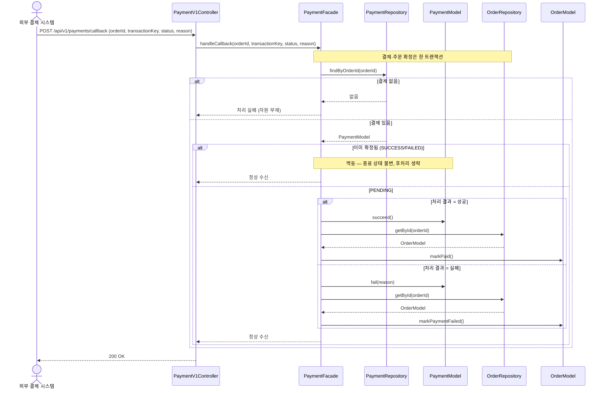
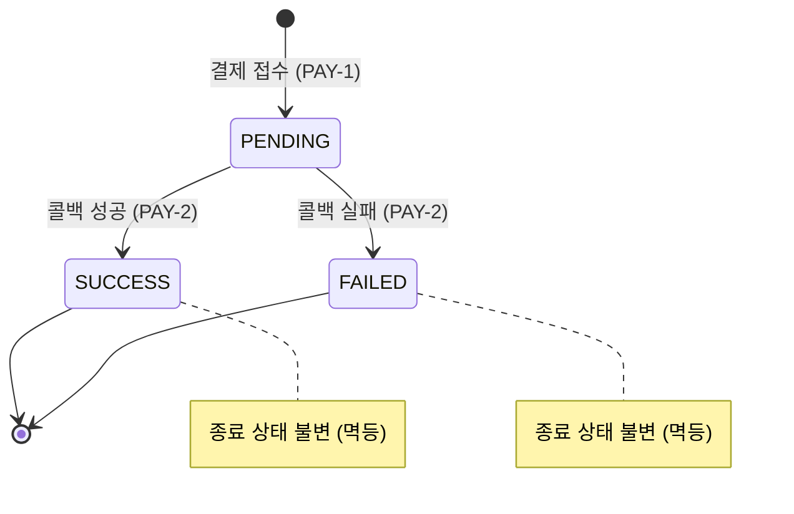

# '감성 이커머스' 시퀀스 다이어그램

본 문서는 [01-requirements.md](01-requirements.md)의 유저 스토리를 `Controller → Facade → Repository·Model` 레이어 관점에서 기록한다. 본 스킬의 기본 양식(도메인 협력 관점)과 달리, 이번 문서는 구현 흐름 파악을 목적으로 레이어·클래스명·메서드를 노출하는 예외 형식이다. 외부 시스템 연동의 회복 전략(타임아웃·서킷 브레이커·재시도·폴링 보정)과 콜백·폴링 동시성 제어는 기능 완결 단계의 범위 밖이므로 제외하며, 후속 단계에서 이 문서도 함께 갱신한다.

표기 규칙: 회원 인증(`getActiveById(userId)`)처럼 모든 대고객 API 공통인 분기는 생략한다. 영속성 경계는 `Repository`(인터페이스)까지만 그리고 `RepositoryImpl`·`JpaRepository`·DB는 생략한다. 외부 결제 시스템 경계는 `PgClient`(포트)까지 그리되, 비동기 연동을 드러내기 위해 `외부 결제 시스템`을 참여자로 표시한다. 도메인 로직은 `Model`(엔티티) 참여자로 표현한다.

---

## PAY-1. 회원은 주문에 대해 카드 결제를 요청한다.

### 정리한 이유

결제 요청은 주문 소유·결제 가능 검증 → 결제 금액 도출 → 멱등(주문당 1건) 검사 → `PENDING` 결제 생성 → 외부 결제 시스템 접수 요청 → 거래 식별자 기록이 한 흐름에 모이며, **요청(동기 접수)과 결과(비동기 콜백)가 분리되는** 첫 지점이다. 접수 응답까지의 호출 연쇄를 백엔드 레이어 관점에서 기록한다.

### 흐름 요약

`PaymentV1Controller`가 결제 요청(주문 식별자·카드 종류·카드 번호)을 받아 `PaymentFacade`에 위임한다. `Facade`는 `OrderRepository`로 본인 소유 주문을 조회하고, 결제 금액을 `OrderModel`의 최종 결제 금액에서 도출한다(요청 본문의 금액을 신뢰하지 않음). `PaymentRepository`로 해당 주문에 이미 결제가 있는지 확인한 뒤, 없으면 `PENDING` 상태의 `PaymentModel`을 생성·저장하고 `PgClient`로 외부 결제 시스템에 접수를 요청한다. 발급받은 거래 식별자를 결제에 기록하고 접수 결과(`PENDING`)를 돌려준다. 주문이 없거나 타인 소유이면 자원 부재로, 이미 결제가 있으면 자원 충돌로 응답한다. 최종 결과는 이후 콜백(PAY-2)으로 도착한다.

### 다이어그램

### 구현 메모

- **트랜잭션 경계**: `PaymentFacade.requestPayment`에 `@Transactional`. 주문 조회·멱등 검사·결제 저장·접수 요청이 한 경계 안에서 처리된다. 이 기능 완결 단계에서는 외부 접수 호출이 트랜잭션 안에 있다 — 외부 응답 대기 동안 커넥션을 점유하므로, 외부 호출을 트랜잭션 밖(커밋 이후/별도 트랜잭션)으로 빼는 것은 타임아웃 단계에서 이 문서와 함께 갱신한다.
- **멱등 (결정 1)**: `existsByOrderId`로 1차 방어하고, 동시 "따닥" 요청은 `payments`의 주문 식별자 유일 제약([04-erd.md](04-erd.md))이 두 번째 저장을 막는다(volume-4 쿠폰 유니크 제약과 동형). 제약 위반은 자원 충돌로 번역한다. 결제가 없다는 것은 곧 주문이 아직 결제 가능 상태(`CREATED`)임을 함의하므로, 별도의 상태 분기 없이 멱등 검사로 충돌을 포착한다.
- **금액 도출 (결정 2)**: 결제 금액은 `OrderModel`의 최종 결제 금액에서 도출하며, 요청 본문의 금액을 신뢰하지 않는다.
- **카드 종류 매핑 (결정 3)**: 요청의 카드 종류는 우리 도메인 `CardType`으로 받고, `PgClient` 어댑터가 외부 표현으로 매핑해 전송한다. 외부 응답을 도메인 결과로 되돌리는 변환도 어댑터 경계에 둔다.
- **접수/결과 분리**: `PgClient.requestPayment`는 접수 응답(거래 식별자·`PENDING`)만 받는다. 접수 성공 시 `PaymentModel`에 거래 식별자를 보조 핸들로 기록한다. 외부 접수 실패·지연 대응(예외 처리·`PENDING` 흡수)은 타임아웃·폴백 단계에서 이 문서와 함께 갱신한다.

---

## PAY-2. 외부 결제 시스템의 처리 결과 콜백을 받아 결제·주문 상태를 확정한다.

### 정리한 이유

콜백 처리는 비동기로 도착한 결과를 받아 `PENDING` 결제를 종료 상태로 전이시키고, 그에 맞춰 주문 상태까지 한 트랜잭션 안에서 함께 확정하는 흐름이다. 종료 상태 불변(멱등)이 중복 콜백을 안전하게 흡수하는 핵심이다. 이 전이 연쇄를 백엔드 레이어 관점에서 기록한다.

### 흐름 요약

`PaymentV1Controller`의 콜백 엔드포인트가 외부 결제 시스템의 통보(거래 식별자·주문 식별자·처리 상태·사유)를 받아 `PaymentFacade`에 위임한다. `Facade`는 콜백의 주문 식별자로 `PaymentRepository`에서 결제를 조회한다. 결제가 이미 종료 상태이면 변경 없이 정상 수신으로 응답하고(멱등), `PENDING`이면 처리 결과에 따라 `PaymentModel`을 성공/실패로 전이한 뒤 `OrderModel`을 결제 완료/결제 실패로 함께 전이한다. 콜백이 가리키는 결제가 없으면 자원 부재로 응답한다.

### 다이어그램

### 구현 메모

- **트랜잭션 경계**: `PaymentFacade.handleCallback`에 `@Transactional`. 결제 상태 전이와 주문 상태 전이가 한 경계 안에서 처리되어 함께 확정되거나 함께 되돌아간다.
- **결제 식별 (결정 1)**: 콜백 본문의 주문 식별자(우리 멱등 닻)로 결제를 조회한다. 거래 식별자도 함께 오지만, 타임아웃으로 거래 식별자가 부재할 수 있는 경우까지 견디기 위해 주문 식별자를 조회 기준으로 둔다.
- **종료 상태 불변(멱등)**: `PaymentModel.succeed()`·`fail(reason)`은 `PENDING`에서만 전이하고, 이미 종료 상태이면 변경하지 않는다. 같은 결과의 콜백이 중복 도착해도 주문 후처리가 한 번만 일어난다. 콜백과 폴링이 동시에 같은 결제를 확정하려는 경합의 후처리 중복 방지(조건부 갱신)는 동시성 단계에서 이 문서와 함께 갱신한다.
- **결제↔주문 동반 전이**: 결제 성공은 `OrderModel.markPaid()`, 실패는 `OrderModel.markPaymentFailed()`로 이어진다. 실패 사유(한도 초과·잘못된 카드 등)는 결제에 기록한다. 재고·쿠폰 보상 복원은 이번 범위 밖이다.
- **콜백 신뢰 범위**: 기능 완결 단계에서는 콜백 본문을 신뢰해 확정한다. 콜백을 외부 결제 시스템 조회로 교차검증(위변조 방어)하는 것과 콜백 누락 시의 폴링 보정은 reconciliation 단계에서 이 문서와 함께 갱신한다.

### 결제 상태 전이

결제 상태는 접수 시 `PENDING`에서 시작해 콜백으로 종료 상태(`SUCCESS`/`FAILED`)로 한 번만 전이하며, 종료 상태는 더 이상 바뀌지 않는다(멱등의 근거).

