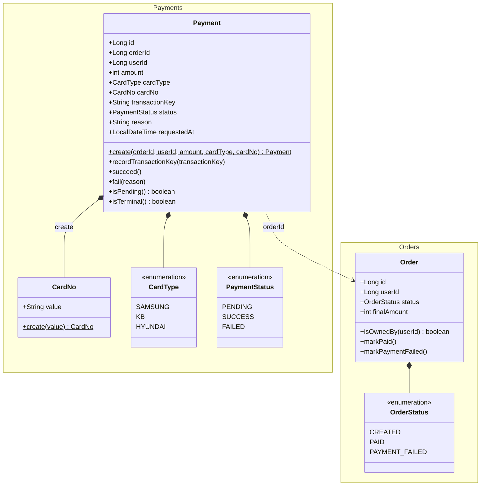
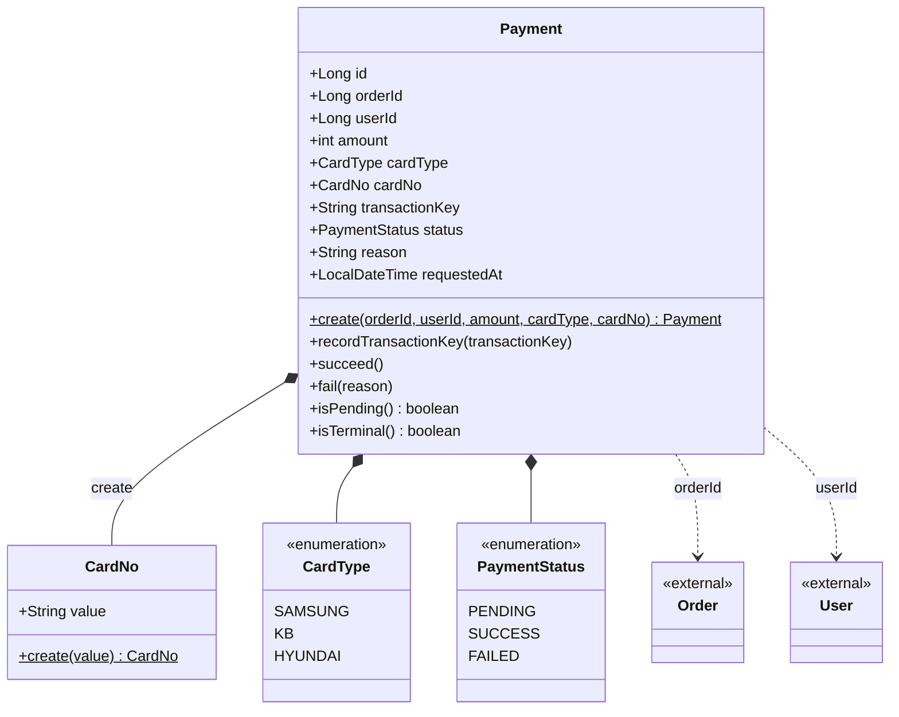
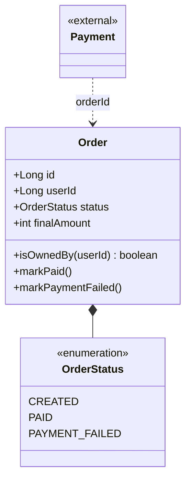

# '감성 이커머스' 클래스 다이어그램

본 문서는 [01-requirements.md](01-requirements.md)의 결제 도메인에서 도출한 **도메인 모델**의 정적 구조와, 결제 결과를 반영하는 주문 상태 변경분을 기록한다. 회원·브랜드·상품·좋아요·쿠폰 도메인과 주문의 기존 구조는 [volume-2](../volume-2/03-class-diagram.md)~[volume-4](../volume-4/03-class-diagram.md)의 클래스 다이어그램을 따르며, 본 문서는 신규 결제 도메인과 주문의 결제 상태 전이 변경분만 다룬다. 메서드명은 도메인 의미 어휘(`create`·`succeed`·`fail`·`markPaid`)로 적으며, 코드 컨벤션(`of`·`from`·`build`) 매핑은 구현 단계의 책임이다. 결제 금액은 주문에서 도출된 파생값이라 별도 래퍼 VO 없이 `int`로 표기한다.

## 통합 클래스 다이어그램

---

## 결제 도메인 (Payment)

> 결제는 자기 자신의 Aggregate Root다. 주문은 별도 Aggregate이므로 `orderId`로 ID 참조하며, 결제 확정 시 주문 상태를 전이시키는 오케스트레이션은 응용 계층이 맡는다. 결제 금액은 주문의 최종 결제 금액에서 도출된 파생값이라 — `OrderItem`이 상품 정보를 원시 타입으로 보존하듯 — 원시 `int`로 보유해 재검증하지 않는다. 카드 번호만은 값이 최초로 들어오는 원천 지점이라 `CardNo` VO로 형식을 검증한다.

### 다이어그램

### 도메인 모델

| 객체 | 종류 | 책임 |
| --- | --- | --- |
| `Payment` | Entity (Aggregate Root) | 주문 ID·회원 ID·결제 금액·카드 종류·카드 번호·거래 식별자·상태·사유·접수 시각 보유. `create`(정적 팩토리 — `CardNo` VO로 카드 번호 형식을 검증하고 `PENDING`으로 시작하며 접수 시각을 기록), `recordTransactionKey`(접수 응답의 거래 식별자를 보조 핸들로 기록 — 접수 후에야 알 수 있어 생성과 분리), `succeed`·`fail(reason)`(`PENDING`에서만 종료 상태로 전이하는 전이 가드), `isPending`·`isTerminal`(상태 질의). 결제 금액은 주문에서 도출된 파생값이라 `int`로 보유(재검증 없음). 멱등(주문당 1건) 검사, 주문 상태 동반 전이, 외부 접수 요청, 트랜잭션은 응용 계층 책임. 중복 콜백은 응용 계층이 `isTerminal`로 걸러 후처리를 한 번만 수행한다. |
| `CardNo` | VO | 카드 번호. `xxxx-xxxx-xxxx-xxxx` 형식 검증을 `create()` 팩토리에 단일화(값의 원천 지점). |
| `CardType` | Enum | `SAMSUNG`·`KB`·`HYUNDAI`. 우리 도메인의 카드 종류. 외부 결제 시스템의 카드 종류 표현과의 매핑은 인프라 어댑터(`PgClient`) 책임이며 도메인은 외부 표현을 모른다 (결정 3). |
| `PaymentStatus` | Enum | `PENDING`·`SUCCESS`·`FAILED`. 접수 시 `PENDING`으로 시작하고, 종료 상태(`SUCCESS`/`FAILED`)는 한 번 정해지면 바뀌지 않는다. |

---

## 주문 도메인 (Order) — 결제 상태 전이 변경분

> 기존 주문 구조([volume-4/03](../volume-4/03-class-diagram.md))에 결제 결과를 반영하는 상태 전이를 더한다. `OrderStatus`에 `PAID`·`PAYMENT_FAILED`를 추가하고, 결제 확정 시 응용 계층이 호출하는 `markPaid`·`markPaymentFailed`를 둔다. 결제 가능한 상태는 `CREATED`다. `OrderItem`·`Quantity` 등 나머지 구조는 변경 없다.

### 다이어그램

### 도메인 모델

| 객체 | 종류 | 책임 |
| --- | --- | --- |
| `Order` | Entity (Aggregate Root) | volume-4 구조를 승계하며, 결제 결과를 반영하는 상태 전이가 추가된다. `markPaid`(`CREATED`→`PAID`), `markPaymentFailed`(`CREATED`→`PAYMENT_FAILED`)는 자기 상태를 전이하는 자기 책임 메서드이고, `isOwnedBy`(본인 검증)는 유지된다. 결제와 주문은 별도 Aggregate라 `Payment`가 `orderId`로 ID 참조하며, 결제 확정 시 어느 전이를 호출할지 결정하는 오케스트레이션은 응용 계층 책임이다. |
| `OrderStatus` | Enum | `CREATED`·`PAID`·`PAYMENT_FAILED`. 본 라운드에서 `PAID`·`PAYMENT_FAILED`를 추가한다. 결제 가능한 상태는 `CREATED`다. |
