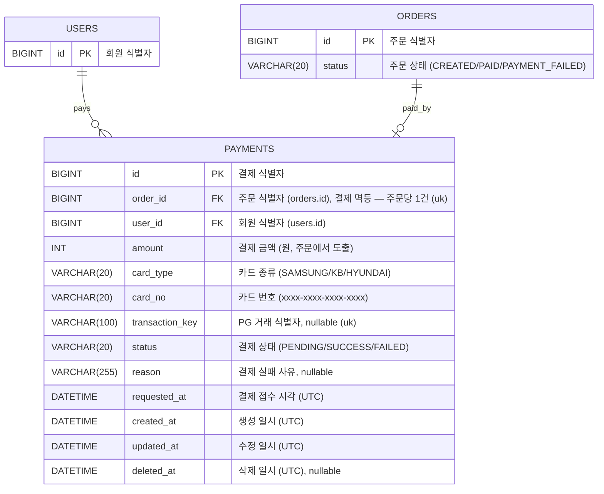

# '감성 이커머스' ERD

본 문서는 [03-class-diagram.md](03-class-diagram.md)의 결제 도메인을 MySQL 8.0+ 물리 스키마로 옮긴 결과를 기록한다. 01·02·03이 도메인 어휘로 "무엇을·왜·누가"를 말한다면, 본 문서는 RDB 어휘로 "그 약속을 어떤 테이블·컬럼·제약으로 보존하는가"를 답한다. 본 문서는 신규 `payments` 테이블을 정의하고, `orders`는 결제 상태 전이에 따른 `status` 허용값 변경만 기재한다. 회원·주문 등 기존 테이블의 전체 정의는 [volume-2](../volume-2/04-erd.md)~[volume-4](../volume-4/04-erd.md)의 ERD를 따른다. 일반 인덱스는 정합성 제약(PK·UK) 외에는 운영 후 추가한다.

## 공통 컨벤션

- 엔진: `InnoDB`
- 문자셋 / Collation: `utf8mb4` / `utf8mb4_unicode_ci`
- PK: `BIGINT AUTO_INCREMENT`
- 시간 컬럼: `DATETIME`. 모든 행은 **UTC wall-clock** 시각을 저장한다.
- Soft delete: 모든 테이블이 `BaseEntity`(`modules/jpa`)를 상속받아 `created_at`, `updated_at`, `deleted_at`(nullable) 세 컬럼을 공통 보유한다.
- FK 제약: DDL에 `FOREIGN KEY` 제약을 두지 않고, 참조 컬럼 COMMENT에 `(대상 테이블.id)`를 명시한다. 참조 정합성은 애플리케이션 책임이며, erDiagram의 관계선·카디널리티는 도메인 관계로서 유지한다.

## 다이어그램



## 테이블 정의

### `payments` — 결제

```sql
CREATE TABLE payments (
    id              BIGINT       NOT NULL AUTO_INCREMENT COMMENT '결제 식별자',
    order_id        BIGINT       NOT NULL COMMENT '주문 식별자 (orders.id). 결제 멱등 기준 — 주문당 1건',
    user_id         BIGINT       NOT NULL COMMENT '회원 식별자 (users.id)',
    amount          INT          NOT NULL COMMENT '결제 금액 (원, 주문 최종 결제 금액에서 도출)',
    card_type       VARCHAR(20)  NOT NULL COMMENT '카드 종류 (SAMSUNG/KB/HYUNDAI)',
    card_no         VARCHAR(20)  NOT NULL COMMENT '카드 번호 (xxxx-xxxx-xxxx-xxxx)',
    transaction_key VARCHAR(100) NULL     COMMENT '외부 결제 시스템 거래 식별자. 접수 결과를 받지 못하면 NULL',
    status          VARCHAR(20)  NOT NULL COMMENT '결제 상태 (PENDING/SUCCESS/FAILED)',
    reason          VARCHAR(255) NULL     COMMENT '결제 실패 사유. 성공·미확정 시 NULL',
    requested_at    DATETIME     NOT NULL COMMENT '결제 접수 시각 (UTC, 도메인 의미)',
    created_at      DATETIME     NOT NULL COMMENT '생성 일시 (UTC)',
    updated_at      DATETIME     NOT NULL COMMENT '수정 일시 (UTC)',
    deleted_at      DATETIME     NULL     COMMENT '삭제 일시 (UTC)',
    PRIMARY KEY (id),
    UNIQUE KEY uk_payments_order_id (order_id),
    UNIQUE KEY uk_payments_transaction_key (transaction_key)
) ENGINE=InnoDB
  DEFAULT CHARSET=utf8mb4
  COLLATE=utf8mb4_unicode_ci
  COMMENT='결제';
```

> 주문당 결제 한 건(결정 1)을 `order_id` 유니크 제약으로 보존한다. 주문 생성 시점에 재고·쿠폰이 이미 그 주문에 소비되므로 결제 단위는 주문 단위와 1:1이고, 별도 멱등 키 없이 `order_id` 하나로 충분하다. 동시 "따닥" 요청은 이 제약이 두 번째 INSERT를 막으며, 애플리케이션은 제약 위반을 자원 충돌로 번역한다. 외부 거래 식별자(`transaction_key`)는 PG가 발급하는 보조 핸들이라 타임아웃으로 접수 응답을 받지 못하면 NULL일 수 있고(이 경우의 추적은 `order_id`로 한다), 같은 거래가 두 결제에 매핑되지 않도록 nullable 유일 제약을 둔다(NULL은 서로 충돌하지 않아 미수신 건 다수를 허용한다). 접수 시각(`requested_at`)은 행 생성 시각과 별도 도메인 의미로 두며, 콜백 누락 보정(폴링)이 PENDING 경과 시간을 이 시각 기준으로 판정한다.
>
> 결제 실패는 주문의 종료 상태(`PAYMENT_FAILED`)다. 동일 주문 재결제(실패 후 재시도)는 선차감된 재고·쿠폰의 보상 복원 또는 예약 모델이 갖춰져야 안전하므로 이번 범위 밖이며, 실패한 주문의 선점분이 복원되지 않는 한계가 남는다.

---

### `orders` — 결제 상태 전이 변경분

`orders` 테이블의 전체 정의는 [volume-4/04-erd.md](../volume-4/04-erd.md)를 따른다. 본 라운드는 **구조 변경 없이** `status` 컬럼의 허용값에 `PAID`(결제 완료)·`PAYMENT_FAILED`(결제 실패)를 추가한다. `status`는 이미 `VARCHAR(20)`이라 스키마 마이그레이션이 없다.
