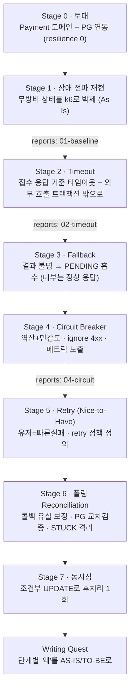

# Volume 6 — PG 연동 Resilience TODO

> 이 문서는 **살아있는 계획서(가설)** 다. 단계 진행 중 측정·구현 결과가 가정과 어긋나면(예: 타임아웃을 줄였는데 서킷이 더 자주 열림) plan을 사실에 맞게 고친다.
> 대상: 주문에 대한 카드 결제 API (`POST /api/v1/payments`) + 외부 결제 모듈(`pg-simulator`, 포트 8082) 연동.

---

## 0. 목표 & 성공 기준

> **무방비 동기 연동에서 출발 → 결함을 수치로 박제 → Resilience4j로 한 겹씩 보강**한다. 매 단계 "왜 이 수치/전략인가"를 PG 사양 역산과 장애 재현으로 증명한다. 단순 "동작"이 아니라 **PG가 느려지고·실패하고·중복되고·응답을 잃어도 내부는 산다**가 목표.

핵심 철학:

- **기능적 완결성 먼저, 튜닝은 그 다음.** Stage 0에서 happy path를 끝까지 흐르게 한 뒤, Stage 1에서 결함을 박제하고, 그 위에 Resilience를 얹는다.
- 모든 장치는 결국 **`PENDING`("우리가 결과를 모른다"를 정직하게 표현하는 상태)** 으로 수렴 → 콜백/폴링이 정합성을 복구한다.
- 외부 시스템은 **항상 지연되고·실패하고·중복되고·성공했어도 응답을 잃을 수 있다**고 가정한다.

### 성공 기준 (요구사항 체크리스트 매핑)

| 체크리스트 | 충족 단계 |
|---|---|
| PG 연동은 FeignClient로 외부 시스템을 호출한다 | Stage 0 |
| 응답 지연에 타임아웃을 설정하고, 실패 시 적절한 예외 처리 | Stage 2 |
| 결제 요청 실패 응답을 적절히 시스템에 연동한다 | Stage 0(저장) + Stage 3(PENDING 흡수) |
| 콜백 + 상태 확인 API로 결제정보를 시스템과 연동한다 | Stage 0(콜백) + Stage 6(조회) |
| 서킷 브레이커 / 재시도로 장애 확산을 방지한다 | Stage 4(CB) + Stage 5(Retry) |
| 외부 장애 시에도 내부는 정상적으로 응답한다 | Stage 3(Fallback) |
| 콜백이 안 와도 주기/수동 API로 상태를 복구한다 | Stage 6 |
| 타임아웃으로 실패해도 결제건을 확인해 정상 반영한다 | Stage 2 + Stage 6(조회 교차검증) |

---

## 1. 핵심 결정 (확정)

| 주제 | 결정 | 근거 |
|---|---|---|
| HTTP 클라이언트 | **FeignClient** | 선언적이라 Resilience 어노테이션과 결합이 깔끔. Spring Cloud BOM 이미 존재. 타임아웃은 **HTTP 클라이언트 레벨**에서 거는 것이 단순·안전 |
| Resilience 부착 위치 | **infra 전담 어댑터(`PgClient` 구현)에만** | 애플리케이션/Facade에 인프라 어노테이션이 침투하지 않게 격리 |
| 멱등 단위 | **우리 키 = `orderId`** (주문 1건 = 결제 1건, UNIQUE) / **`transactionKey`는 PG가 발급하는 외부 핸들을 매핑 저장** | 외부 시스템은 신뢰할 수 없으니 우리가 잃어버리지 않는 키(`orderId`)를 정합성의 닻으로 둔다. PG 키는 정밀 조회용 핸들 |
| 외부 타입 격리 | **`CardType` 등 외부 enum을 우리 도메인 enum으로 정의·매핑** (PG enum 직접 차용 금지) | PG가 1개여도 각 PG가 같은 값을 줄 보장이 없다. 도메인 코드를 외부 스펙에서 분리 |
| 결제 상태 모델 | **`PENDING` / `SUCCESS` / `FAILED` + 상태 전이 가드** | 최소 모델. 종료 상태(SUCCESS/FAILED)는 불변 → 상태 레벨 멱등성 |
| 주문 연동 범위 | **결제 결과 → 주문 `CREATED`→`PAID`/`PAYMENT_FAILED` 전이까지**. 재고/쿠폰 보상 복원은 범위 밖 | 체크리스트 충족 최소. Resilience 학습에 집중 |
| 결과 불명 처리 | 타임아웃·서킷 OPEN 등 **결과 불명은 "실패" 단정 없이 `PENDING` 유지 → 폴링 보정, 상한 초과 시 `STUCK` 격리+알림**(자동 취소 안 함) | "응답 못 받음 ≠ 처리 안 됨". 타임아웃이어도 PG에선 성공했을 수 있다. pg-simulator엔 취소/환불 API가 없어 더더욱 단정 금지 |
| 비즈니스 거절 처리 | 한도 초과·잘못된 카드 등 **확정 거절은 `FAILED` 확정 + 서킷 집계에서 ignore** | 백 번 재시도해도 동일. 의도된 거절로 서킷이 열리면 안 됨 |
| 타임아웃 값 방향 | **접수/처리 분리형이라 요청 호출은 "접수 응답" 기준으로 짧게(연결 ~1s / 응답 1~2s)** | 우리 PG는 요청(100~500ms)과 처리(1~5s, 콜백)를 분리한다. 동기 승인형 PG라면 길게(10s) 잡지만 우리는 처리 완료를 동기로 기다리지 않는다 |
| 서킷 임계치 산정 | **PG 사양 역산으로 초기값 근거 + k6 민감도 테스트로 검증**(절대값 맹신 X). 집계 단위(COUNT/TIME)는 트래픽 특성으로 판단 | 요청 성공 60% × 처리 성공 70% 같은 사양으로 출발하되, 우리 서버가 과민/둔감한지 부하로 확인 |
| 동시성 제어 | **조건부 UPDATE**(`... WHERE status='PENDING'`) + affected rows로 승자 판별 | 콜백·폴링 동시 확정 race를 격리 수준에 안 기대고 그 행만 원자화 → 후처리 정확히 1회 |
| 측정 | **k6 2장면**(타임아웃 전후 스레드 고갈 / 부하 중 서킷 OPEN) + **장애 재현 통합테스트** + **서킷 메트릭 노출** | 라이팅 수치 증거. vol5급 측정 하니스는 과함 |
| 멀티 PG | **`PgClient` 인터페이스로 경계만 설계**, 오케스트레이션(서킷 OPEN 시 다른 PG로)은 구현 안 함 | 추상화 경계를 남겨 두되 범위는 단일 PG로 제한 |

---

## 2. 단계 사다리 (naive → resilient)

핵심 불변 원칙: **완결 → 박제 → 보강.** 각 보강 단계는 직전 단계의 구체적 결함을 겨냥하고, 효과를 측정/테스트로 증명한다.



---

## 3. 횡단 규약 (모든 단계 공통)

- **외부 경계는 신뢰하지 않는다.** 콜백 데이터를 그대로 믿지 말고 PG 조회로 교차검증한다. (우리 측 `PaymentCoreRelay`는 콜백 전송 실패 시 로그만 남기고 재발송하지 않는다 — 즉 콜백 유실은 가정이 아니라 상수다. 폴링 안전망이 필수인 이유.)
- **결제 상태는 RDB에 보관**하고 주기적으로 보정한다(휘발성 저장소에만 의존하지 않는다).
- **PG 호출과 상태 전이는 충분히 로깅**한다 — 호출 전/후, 전이 사유, 폴링 분기 결과까지. 보정 루프의 `catch`를 **빈 블록으로 두지 않는다**(최소 로깅). 단 이벤트 소싱 같은 풀스택 로깅은 범위 밖.
- **외부 I/O는 DB 트랜잭션 밖**에서(커밋 이후 또는 별도 트랜잭션) 수행해 커넥션 점유·롱 트랜잭션을 피한다.

---

## 4. 측정·보고 규약

> 장애 전파·서킷 동작은 **수치로 증명**한다. 이 데이터가 라이팅의 증거다.

- **위치**: `docs/volume-6/measurement/k6/`(시나리오), `docs/volume-6/reports/`(결과)
- **k6 2장면**:
  - **장면 1 — 스레드 고갈**: 타임아웃 적용 전/후, PG 지연 상황에서 결제와 무관한 요청(예: 상품 조회)의 응답이 어떻게 변하는지. → `reports/01-baseline.md`(전), `reports/02-timeout.md`(후)
  - **장면 2 — 서킷 OPEN**: 부하 중 실패율이 임계치를 넘어 `CLOSED→OPEN` 전이가 일어나고, OPEN 동안 PG를 호출하지 않고 즉시 fallback 하는지. 서킷 메트릭(오픈 횟수)과 함께 관찰. → `reports/04-circuit.md`
- **결정론 vs 실측**: pg-simulator의 내장 확률(요청 실패 40%·처리 지연 1~5s)을 그대로 쓸지, 어댑터를 스텁으로 교체해 지연/실패율을 고정할지는 측정 시 선택(서킷 임계치 민감도는 결정론 제어가 깔끔).
- **장애 재현 통합테스트**: `@MockitoBean`으로 타임아웃/네트워크 예외를 주입하고, `CircuitBreakerRegistry`로 상태 전이를 단언한다. 라이브러리 동작("실패율 N%면 열림")이 아니라 **우리 fallback 계약**(PENDING 저장·주문 전이)을 검증한다.

---

## Stage 0 — 토대: Payment 도메인 + PG 연동 (resilience 0)

**목표:** 결제 요청 → 접수(PENDING) → 콜백 → 결제/주문 확정의 happy path를 **장애 복구 장치 없이** 끝까지 흐르게 한다.

- [X] **Payment 도메인** — `PaymentModel`(`orderId` UNIQUE, `userId`, `cardType`, `cardNo`, `amount`, `status` PENDING/SUCCESS/FAILED, `transactionKey` nullable=PG 매핑, `reason` nullable) + 상태 전이 메서드(전이 가드 포함) + `PaymentRepository` (PAY-1)
- [X] **우리 `CardType` enum 정의** + PG `CardType`과의 매핑(도메인 ↔ 어댑터 경계에서만 변환) (PAY-1)
- [X] **`PaymentGateway` 포트 인터페이스**(도메인) — 결제 요청. 멀티 PG를 염두에 둔 추상화 경계 (PAY-1, *거래 단건/주문별 조회는 Stage 6 폴링에서 추가*)
- [X] **`PaymentGateway` FeignClient 구현**(infra 어댑터) — `X-USER-ID` 헤더 주입. **타임아웃·재시도·서킷 없음(의도적)** (PAY-1)
- [X] **결제 요청 API** `POST /api/v1/payments`(Controller/Dto/Facade) — `orderId`+`cardType`+`cardNo` 입력 → 주문/금액 확인 → PG 접수 요청 → `transactionKey` 매핑·`PENDING` 저장 → 접수 응답 (PAY-1)
- [X] **콜백 엔드포인트** `POST`(8080, PG가 `callbackUrl`로 통보) — 결과 수신 → 결제 상태 전이 + 주문 상태 전이(`PAID`/`PAYMENT_FAILED`) (PAY-2)
- [X] pg-simulator 실행 + `.http`로 happy path 수동 검증

**의도적 결함(이후 단계에서 제거):** 타임아웃 X · 재시도 X · 서킷 X · fallback X · 폴링 X.

**검증:** happy path 1건이 요청 → 접수(PENDING) → 콜백 → SUCCESS/주문 PAID 까지 흐른다.

---

## Stage 1 — 장애 전파 재현 (측정 원점)

**목표:** 무방비 상태가 외부 지연 하나로 어떻게 무너지는지 수치로 박제한다. → `reports/01-baseline.md`

- [X] **타임아웃 없는** 현재 구현으로 측정 (톰캣 스레드를 10으로 임시 축소해 저부하로 재현 — 머신 보호)
- [X] k6 장면 1: PG 응답 지연 시 톰캣 스레드가 점유되어 **결제와 무관한 요청까지 응답이 붕괴**하는지 관찰 — prober p50 **22ms→404ms(20VU, 18배) / 18ms→1.62s(50VU, 90배)**
- [X] 관찰: 요청 실패 40%가 **사용자 에러(500)로 직결**되는 것 — payment_500 **39.4%**(≈PG 40% 사양)
- [X] **`reports/01-baseline.md` 작성** (As-Is 원점)

**검증:** 무방비 상태의 스레드 고갈/에러율 곡선을 확보. 모든 비교의 원점이 된다.

> **측정으로 드러난 사실(plan 보정):** 결함은 *완전 붕괴(타임아웃/거부)*가 아니라 **전파성 지연**으로 나타났고 prober 지연은 ~1.9s에서 **plateau**했다(`prober_fail` 0%). 이유는 ① PG 접수 지연이 100~500ms로 짧아 스레드가 빨리 회전 ② 부하원이 닫힌 모델(ramping-vus)이라 큐가 바운드. → **열린 도착/긴 의존 지연이면 큐가 상한 없이 쌓여 타임아웃·거부로 전환**된다. 지금의 plateau는 안전이 아니라 운이며, 이것이 Stage 2(능동 타임아웃으로 자원 회수)의 동기. 부산물로 접수 성공분이 **PENDING으로 누적**(콜백 미반영) → Stage 6 동기.

---

## Stage 2 — Timeout + 예외 처리 + 트랜잭션 경계

**목표:** "안 빠지는 물을 언제 포기할 것인가"를 정해 자원(스레드/커넥션)을 회수한다. → `reports/02-timeout.md`

- [X] **Feign connect/read 타임아웃** — 연결 1s / **응답 300ms**. `application.yml`의 `spring.cloud.openfeign.client.config.pg-simulator`. *값 근거: PG 접수 분포가 ≤500ms라 2s는 절대 발화 안 하는 **죽은 코드**(측정 확인) → 분포 안(200~300ms)으로 내려 "300ms만 기다리고 초과분은 포기→PENDING→폴링" 정책. 재시도 미도입(Stage 5에서 단일화), connection-request 타임아웃 미적용(기본 클라이언트, 단일 PG엔 과함)*
- [X] 타임아웃/요청 실패 시 **명확한 예외**로 사용자에게 즉시 응답 — 어댑터(`PaymentGatewayImpl`)에서 `FeignException`→`CoreException(PAYMENT_GATEWAY_ERROR, 502)` 변환·로깅. 막연한 500 직결 제거
- [X] **외부 호출을 `@Transactional` 밖으로** — 클래스 레벨 `@Transactional` 제거. `acceptPayment`(PENDING 저장)는 리포지토리 자체 트랜잭션으로 즉시 커밋(OSIV=false라 커넥션 반납) → 트랜잭션 밖에서 PG 호출 → 거래키 저장. *결과: PG 실패 시 PENDING은 커밋된 채 남고 예외 전파(합의), 잔존 PENDING은 Stage 6 폴링이 복구*
- [X] k6 장면 1 재측정 (baseline 동일 환경, 3-way: baseline / 2s / 300ms) → `reports/02-timeout.md`

**검증(보정됨):** ~~타임아웃 전후 비교에서 스레드 고갈이 해소된다~~ → **측정 결과 "해소"가 아니라 "완화"**(50VU prober p50 1.62s→1.44s, ~11%). 동기 호출이라 스레드 점유 자체는 잔존 → 고갈 원천 차단은 **Stage 4 서킷**의 몫. 부수로 *"끊었는데 PG에선 결제됐으면?"* 결과 불명이 실패 73% 중 ~50%p로 드러나 Stage 3·6의 동기가 된다.
> **Stage 2 완료.** 코드(Feign 타임아웃·예외 변환·트랜잭션 분리) + 테스트(`PaymentGatewayImplTest`/`PaymentFacadeTest`/`PaymentV1ApiE2ETest`, 전체 통과) + 측정(`reports/02-timeout.md`) 완료.
> **측정으로 드러난 plan 보정 2건:** ① **타임아웃은 의존성 응답 분포 안에 둬야 의미** — 분포 위(2s)는 죽은 코드. ② **실패 종류를 갈라야 함** — `타임아웃=결과 불명→PENDING`(폴링 보정) vs `PG 500=찌꺼기 없는 확정 실패→FAILED`(재시도 후보). 현재는 502 단일 변환 → **Stage 3에서 분기 도입**(아래 Stage 3 체크리스트 반영).

---

## Stage 3 — Fallback (결과 불명 → PENDING 흡수)

**목표:** 외부 장애를 "결제 실패"로 단정하지 않고, 내부는 정상적으로 응답한다.

- [X] **Resilience4j 도입** (`resilience4j-spring-boot3`(2.2.0, Spring Cloud BOM 관리) + `spring-boot-starter-aop`)
- [X] **실패 종류 분기(Stage 2 측정 보정 반영)** — 어댑터 `fallbackMethod`에서 502 단일 변환을 갈라:
  - **타임아웃/네트워크(결과 불명)** → `PaymentRequestResult.unknown()` → `PENDING` 유지로 **fallback 흡수** (PG가 처리했을 수 있으니 단정 금지 → Stage 6 폴링이 SUCCESS/취소 확정). `RetryableException`(+CB OPEN의 `CallNotPermittedException`)으로 식별
  - **PG 5xx(트랜잭션 키 발급 전 실패 = 찌꺼기 없는 확정 실패)** → `PaymentRequestResult.rejected()` → `FAILED` 확정 (재시도 후보, 단 멱등 전제는 Stage 5). `FeignException.status() >= 500`으로 식별
- [X] fallback 위치 — `@CircuitBreaker(name="pg-simulator", fallbackMethod=...)` 어댑터 메서드에 부착, 서킷은 느슨한 기본값(failure-rate 90%)으로 시작(본격 튜닝 Stage 4). 이후 CB/Retry가 쌓이면 fallbackMethod는 **최외곽에 둔다**(Stage 4 참고)
- [X] 비즈니스 거절(한도 초과/잘못된 카드)은 fallback이 아니라 콜백 결과로 `FAILED` 확정 — 접수 단계(fallback)와 처리 결과(콜백)를 분리
- [X] 장애 재현 통합테스트(`PaymentGatewayResilienceIntegrationTest`): 실제 AOP fallback이 타임아웃→UNKNOWN, 5xx→REJECTED 반환하는 계약 단언. E2E는 UNKNOWN→201 PENDING / REJECTED→201 FAILED 저장 단언

**검증:** PG 요청 실패/타임아웃에도 내부는 201 + `PENDING`(결과 불명) / `FAILED`(확정 거절)로 응답한다. 502 직격 제거. (체크리스트: 외부 장애 시 내부 정상 응답)
> **Stage 3 완료.** 어댑터 502 단일 변환을 `PaymentRequestResult`(ACCEPTED/UNKNOWN/REJECTED) 3분기로 교체하고 분기 적용은 `PaymentModel.applyRequestResult`로 캡슐화. 코드 + 테스트(도메인/Facade 단위 · 어댑터 AOP 통합 · E2E) + 전체 통과.
> **런타임 검증 완료(`reports/03-fallback.md`).** 실제 PG 연동에서 결제 40건 + k6 90s 부하: 502 **0건**, DB 분포 PENDING·txkey=NULL 23(UNKNOWN) / FAILED·txkey=NULL 9(REJECTED) / 콜백 종결 SUCCESS 5·FAILED 3(ACCEPTED). 집계 `payment_500` baseline **39.4%→0%**. request-time 4xx는 0건(데드 패스 실측 확인 → Stage 4 이월 근거).
> **plan 보정:** ① 포트 반환형을 `String txKey`→`PaymentRequestResult`로 승격(결과 3종을 표현). ② **결과 불명/확정 실패 모두 내부는 201 정상 응답**(상태값만 PENDING/FAILED로 다름) — "내부는 200" 표현은 "2xx 정상 응답"의 약칭으로, FAILED도 리소스는 생성됐으므로 201 유지. ③ 기존 `ErrorType.PAYMENT_GATEWAY_ERROR`(502)는 더 이상 발화하지 않는 미사용 상수가 됨 — 제거하지 않고 보존(향후 진짜 예상 밖 오류용).

---

## Stage 4 — Circuit Breaker

**목표:** 계속 실패하는 PG를 "이제 그만 두드린다"로 차단해 자원 고갈을 원천 차단한다. → `reports/04-circuit.md`

- [X] CircuitBreaker 설정 — **COUNT_BASED**(window 50, min-calls 20) · failure-rate **50%** · **slow-call** 250ms/50% · wait-in-open 10s · half-open permitted 5. *집계 단위 근거: k6 부하는 bursty라 최근 N건 기준이 OPEN 타이밍·민감도 해석에 결정론적*
- [X] **설정값 역산**(초기값) — PG 사양 코드 확인: 접수 지연 균등 100~500ms + 40% 500. read-timeout 300ms 기준 → **P(타임아웃)=50%**, 완료분 중 40% 500 → **전체 5xx 20%** → CB가 보는 **유효 실패율 ≈70%**(타임아웃 50% record + 5xx 20% record). 70% > 임계 50% → 부하 중 확실히 OPEN. *k6 민감도 검증은 Phase B(아래)*
- [X] **record/ignore-exceptions** — record: `RetryableException`(타임아웃/네트워크) + `FeignException$FeignServerException`(5xx). ignore: `FeignException$FeignClientException`(4xx 의도된 거절 → 집계 제외)
- [X] **(Stage 3 이월) request-time 4xx 분류 빈틈 정리** — `isConfirmedFailure`를 `status()>=500` → `status()>=400`으로 내려 **4xx도 REJECTED(→FAILED) 확정**. RetryableException(응답 못 받음)만 UNKNOWN, 그 외 HTTP 에러 응답은 확정 실패. *pg-simulator는 4xx 미발생(데드 패스)이나 분류는 정합하게 정리*
- [X] **aspect-order CB(2) > Retry(1)** + **fallbackMethod는 최외곽(CB)에 부착** — `circuit-breaker-aspect-order: 2` / `retry-aspect-order: 1`로 CB를 Retry 바깥에 둠(재시도 묶음을 1회로 집계, 소진 후 fallback). fallback은 이미 `@CircuitBreaker`(유일한 resilience 어노테이션)에 부착돼 최외곽. *Retry 본체 배선은 Stage 5*
- [X] **서킷 메트릭을 actuator/prometheus로 노출**(상태/오픈 횟수) — resilience4j-micrometer 자동 바인딩. `/actuator/prometheus`에 `resilience4j_circuitbreaker_state`(상태 게이지) · `_not_permitted_calls_total`(단락 수) · `_failure_rate` · `_slow_call_rate` · `_calls_seconds_count{kind=...}` 실측 확인(추가 코드 0)
- [X] k6 장면 2: 부하 중 `CLOSED→OPEN` 전이 + OPEN 동안 PG 미호출·즉시 fallback 관찰 → `reports/04-circuit.md` — `stage2-circuit.js`(payment 40/s, 톰캣 10스레드). **`t+22s` 전이(failure_rate 80.95%), 결제 2001건 중 1932건(96.5%) 단락(PG 미호출), prober load p50 5.92ms·0% 실패, payment_500 0%**
- [X] 통합테스트: `transitionToOpenState()`로 강제 OPEN 후 fallback 계약 단언 — `PaymentGatewayResilienceIntegrationTest`에 4xx→REJECTED · 반복 타임아웃 자연 `CLOSED→OPEN` 후 PG 미호출·UNKNOWN · 강제 OPEN 단락 3건 추가(총 5건 통과)

**검증:** 부하 중 서킷이 열리고, OPEN 동안 PG를 부르지 않고 즉시 PENDING으로 떨군다. 메트릭에 오픈 횟수가 보인다.
> **Stage 4 완료.** 코드·설정(CB COUNT·50% 역산값 + record/ignore + 4xx→REJECTED + aspect-order) + 통합테스트(강제/자연 OPEN, 5건) + 런타임 측정(`reports/04-circuit.md`). `./gradlew :apps:commerce-api:test` 결제 스위트 전체 통과.
> **측정으로 드러난 사실(plan 보정):** ① **역산이 임계 설정의 출발점으로 유효** — 사양 역산 ≈70%가 실측 80.95%로 근사, 임계 50%가 결정적으로 갈랐다. ② **저스루풋 + COUNT_BASED는 OPEN이 늦다** — 10스레드가 PG에 묶여 *완료* 호출이 초당 ~3건뿐이라 window(min 20)가 더디게 차 전이에 22s 소요. 고스루풋이면 1~2s. → TIME_BASED/작은 min-calls가 OPEN을 앞당김(민감도 후속). ③ **단락은 HTTP 지연으로 안 보임** — 10스레드 큐 대기가 더해져 `payment_open` p50 108ms. 단락의 증거는 `not_permitted_calls`(1932)와 prober 보호(p50 5.92ms). ④ **slow-call(250ms)은 300ms 하드 타임아웃과 대체로 중복**(보조적). ⑤ request-time 4xx는 여전히 데드 패스(ignored=0).

---

## Stage 5 — Retry (Nice-to-Have)

**목표:** 일시적 실패는 다시 시도하되, Retry가 장애를 키우지 않게 한다.

> **경로 분리.** 유저 요청 경로와 보정(스케줄러) 경로는 retry 전략이 다르다. 보정 경로의 backoff+jitter는 스케줄러가 서는 **Stage 6에서 배선**하고, 이 단계에서는 **정책 정의 + 유저 경로**까지만 한다.

- [X] **유저 요청 경로 = 빠른 실패** — `requestPayment`에 `@Retry` 미부착(`@CircuitBreaker`만). 스레드를 외부 I/O 재시도로 오래 점유하지 않는다. 통합테스트(`userPath_failsFast_withoutRetry`)로 *단일 타임아웃에도 PG 정확히 1회 호출 + 즉시 UNKNOWN* 박제
- [X] **retry 정책 정의** — `resilience4j.retry.instances.pg-reconciliation`: max-attempts 3 · exponential backoff(1s→2s→4s) · jitter ±50%(Thundering Herd 회피) · retry=`RetryableException`+`FeignServerException`(5xx) · ignore=`FeignClientException`(4xx). *유저 경로(CB `pg-simulator`)와 이름 분리 → 유저 요청엔 실수로도 안 붙음. 배선은 Stage 6 스케줄러*
- [X] **Feign 자체 재시도 비활성화**(`Retryer.NEVER_RETRY`) — `FeignConfig`에 `@Bean Retryer.NEVER_RETRY` 명시. Spring Cloud 기본값이 이미 NEVER_RETRY지만 암묵적 → "재시도 단일 원천 = Resilience4j"를 코드로 드러내 이중 재시도 방지
- [X] 멱등 전제 확인 — 접수 중복은 Facade `existsByOrderId` 가드가 차단. *재요청 안전(돈 안 빠진 미도달 확인)은 PG 조회로 "주문 없음"을 본 뒤가 전제이며, 그 조회 API는 Stage 6 의존이라 보정 경로 재요청은 Stage 6에서 배선*

**검증:** 유저 경로가 빠르게 실패하고(재시도 0회), 영구 실패(4xx)는 retry 정책에서 ignore, Feign+R4j 이중 재시도가 없다. (보정 경로 backoff 적용·검증은 Stage 6)
> **Stage 5 완료.** 코드(`FeignConfig` NEVER_RETRY Bean + `application.yml` `pg-reconciliation` retry 인스턴스 정의) + 테스트(`PaymentGatewayResilienceIntegrationTest`에 빠른 실패/무재시도 단언 추가, 결제 스위트 전체 통과). 측정 리포트 없음(Nice-to-Have, 정책 정의 단계).
> **plan 보정:** ① 유저 경로는 *이미* fast-fail 상태(`@CircuitBreaker`만)였음 — Stage 5는 "구현"보다 *정책 정의 + 의도 명시(Feign Bean·테스트 박제)*가 본질. ② retry 인스턴스 이름을 CB(`pg-simulator`)와 분리한 `pg-reconciliation`으로 둬, 한 메서드에 동명 어노테이션이 겹쳐 유저 경로에 재시도가 새는 사고를 구조적으로 차단. ③ 정의만 하고 미배선 — Stage 6 스케줄러가 PG 재조회/재요청에 `@Retry("pg-reconciliation")`로 연결.

---

## Stage 6 — 콜백 유실 대비 폴링 (Reconciliation)

**목표:** 콜백이 오지 않아도, 타임아웃으로 결과를 못 받았어도 정합성을 복구한다.

- [X] **`@Scheduled` 폴러** — `PaymentReconciliationScheduler`(fixedDelay 10s). grace period 5s(처리 지연 1~5s 역산) — `requestedAt ≤ now-5s`인 `PENDING`만 조회. `@EnableScheduling`은 `SchedulingConfig`(`@Profile("!test")`)로 테스트 격리
- [X] **건별 `REQUIRES_NEW`** 로 부분 실패 격리 — DB 쓰기(`PaymentTransactionWriter.confirm/reapplyRequest/isolate`)를 각각 `REQUIRES_NEW`로. *오케스트레이션(`PaymentReconciliationService`)은 트랜잭션 밖에 두어 **PG 호출(조회·재요청)이 DB 트랜잭션 밖**에서 일어나게 분리(횡단 규약 준수)*
- [X] **PG 조회 결과 분기** — `queryTransaction`→`PaymentTransactionStatus`(FOUND/NOT_FOUND/UNKNOWN). FOUND·처리 중 → 유예(상한 초과 시 격리) / FOUND·종료 → 그 결과로 확정 / NOT_FOUND(미도달) → 재요청 / UNKNOWN → 유예(상한 초과 시 격리)
- [X] **콜백 PG 교차검증** — `handleCallback`이 콜백 payload의 status를 믿지 않고 `queryTransaction`으로 재조회해 **PG 권위값**으로 확정. 처리 중·결과 불명이면 확정하지 않고 폴링에 위임
- [X] **상한 초과 PENDING → `STUCK` 격리 + 알림** — 상한 10분 초과 미해결 건 `markStuck` + `log.warn`(자동 취소 안 함). *실 알림 채널(Slack 등)은 범위 밖, 로깅으로 대체*
- [X] **수동 reconcile API**(관리자) — `POST /api-admin/v1/payments/{orderId}/reconcile`. 격리된 `STUCK` 건도 다시 확정(조건부 UPDATE 대상에 STUCK 포함)
- [X] **보정 경로에 Retry 배선** — `queryTransaction`에 `@Retry("pg-reconciliation")`(Exponential backoff + jitter). 유저 경로(`@CircuitBreaker("pg-simulator")` fast-fail)와 인스턴스 분리

**검증:** 콜백을 의도적으로 누락시켜도 폴링이 `PENDING`을 정합성 복구한다. (체크리스트: 콜백 미수신 복구 / 타임아웃 실패건도 조회로 정상 반영)
> **Stage 6 완료.** 코드(포트 `queryTransaction` + 어댑터 단건/주문별 조회·`@Retry`·NOT_FOUND 판정 + 스케줄러/서비스/writer + 콜백 교차검증 + 수동 reconcile API) + 테스트(어댑터 조회 분기·재시도 통합 / 서비스 분기 단위 / 콜백 교차검증 단위·E2E / 수동 reconcile E2E) 전체 통과. 측정 리포트 없음(k6 대상 아님 — 통합/단위 테스트로 계약 검증).
> **측정/구현으로 드러난 plan 보정:** ① **PG `GET ?orderId=`는 거래가 없으면 404** — 이를 *미도달(NOT_FOUND)* 신호로 사용(txKey 없는 UNKNOWN 결제 한정). txKey 있으면 단건 조회, 없으면 주문별 조회로 디스패치. ② **콜백 시그니처에서 status/reason 제거** — 교차검증이 PG 권위값을 쓰므로 콜백의 claimed status는 사용 안 함(`handleCallback(orderId, transactionKey)`). DTO `CallbackRequest`는 외부 계약 형태로 status/reason 보존하되 미사용. ③ **외부 I/O를 트랜잭션 밖으로** — `@Scheduled`+`REQUIRES_NEW`를 한 메서드에 두면 PG 호출이 트랜잭션 안에 갇히므로, 오케스트레이션(무트랜잭션)/writer(REQUIRES_NEW) 2빈으로 분리해 self-invocation 함정도 회피.

---

## Stage 7 — 동시성: 조건부 UPDATE

**목표:** 콜백 스레드와 폴링 스레드가 같은 결제건을 동시에 확정해도 후처리가 중복되지 않게 한다.

- [X] **조건부 UPDATE** — `confirmIfUnresolved`: `UPDATE payment SET status=?, reason=? WHERE id=? AND status IN (PENDING, STUCK)`로 전이를 원자화. *대상에 STUCK 포함 → 격리 건도 콜백/수동/폴링이 복구 가능*
- [X] **affected rows로 승자 판별** — `PaymentTransactionWriter.confirm`: affected==1이면 내가 전이시킨 것 → 주문 상태 전이 실행 / 0이면 남이 이미 확정 → 후처리 스킵. 콜백·폴링·수동 reconcile이 **모두 이 한 경로**를 공유
- [X] 통합테스트: `PaymentConfirmConcurrencyIntegrationTest` — 같은 결제에 `confirm` 2스레드 동시 진입 → 승자 **정확히 1**, 결제 SUCCESS·주문 PAID 1회

**검증:** 동시 확정 상황에서도 주문 상태 전이가 한 번만 일어난다(중복 후처리 없음).
> **Stage 7 완료.** 코드(`confirmIfUnresolved` 조건부 UPDATE + `PaymentTransactionWriter`로 콜백·폴링·수동 단일 경로화) + 동시성 통합테스트(승자 1·주문 1회 전이) 통과.
> **plan 보정:** ① 조건부 UPDATE의 WHERE를 `status='PENDING'`이 아니라 `status IN (PENDING, STUCK)`으로 — 격리(STUCK)된 건도 뒤늦은 콜백/수동 reconcile로 복구 가능해야 하므로. ② **한계(정직)**: 핵심 확정 race(콜백 vs 폴링이 동시에 종료 확정)는 조건부 UPDATE로 차단하지만, `markStuck`/`reapplyRequest`는 dirty-check save라 *격리 전이와 뒤늦은 확정이 같은 순간 겹치는* 희귀 race는 last-writer-wins(낙관락 미도입). 결제 확정의 정확성엔 영향 없고 STUCK은 수동 reconcile로 회수 가능.

---

## 의도적으로 안 하는 것 + 알려진 한계

> "안 한 것"과 "그래서 생기는 한계"를 정직하게 남긴다 — 라이팅·PR 본문의 좋은 소재.

- **TimeLimiter / RateLimiter / Bulkhead / MQ 재처리 큐** — 타임아웃은 HTTP 클라이언트 레벨에서 충분. 비즈니스 로직을 비동기로 감싸 TimeLimiter를 걸지 않는다.
- **결제 실패 시 재고/쿠폰 보상 복원 없음** — 주문 생성 시점에 이미 재고가 차감되므로, 결제 실패 시 재고가 복원되지 않는 한계가 남는다(실무라면 보상/예약 모델/재고 안내 알림이 필요). → *"결제가 실패하면 주문을 무조건 롤백해야 할까"* 라이팅 주제.
- **가주문→진주문 전환 / "따닥" 중복 주문 정리** — 주문 생성 단계의 멱등성은 범위 밖(주문은 이미 생성된 상태로 받는다). 결제 단계 멱등(`orderId`)만 다룬다.
- **멀티 PG 오케스트레이션** — 인터페이스 경계만 두고 구현하지 않는다.
- **카오스 엔지니어링 풀스택 / 프론트 결과 대기 UX(폴링·SSE)** — `@MockitoBean`·슬립 + k6 수준으로 작게 시작한다.

---

## Writing Quest

> `reports/`의 수치와 단계별 의사결정("왜 그렇게 판단했는가")을 근거로 작성. 블로그 또는 GitHub Issue 4포맷(Design Doc / Retrospective / Challenge Story / Benchmark Report) 중 택1.

라이팅 씨앗 (단계 → 주제):

- Stage 1·2·4 → **"PG 장애 하나로 주문 전체가 멈췄다"** (장애 전파 + 타임아웃/서킷)
- Stage 2·6 → **"응답이 안 와서 실패 처리했는데 PG에선 결제됐다"** (결과 불명 + 멱등성 + 조회)
- Stage 3 → **"주문은 PENDING인데 사용자는 결제 안내를 받았다"** (Fallback 철학)
- Stage 4 → **타임아웃을 "PG는 10초"가 아니라 짧게 잡은 이유** (접수/처리 분리형 PG의 함의)
- Stage 5 → **"재시도 횟수는 몇 번이 적절했을까"** (Retry Storm·backoff·jitter)
- 시그니처 → **설정값을 PG 사양으로 역산하고 k6 민감도로 검증** (Benchmark Report 포맷에 최적)

---

## 선택 작업 — 시니어 파트너 Skill

- [ ] (선택) `~/.claude/skills/analyze-external-integration/SKILL.md` — 외부 시스템 연동 설계를 트랜잭션 경계·상태 일관성·실패 시나리오·멱등성 관점에서 분석하는 리뷰용 Skill 작성.

---

## 산출물 트리

```
docs/volume-6/
  TODO.md                 ← (이 문서, 작업 계획·진행 체크)
  measurement/k6/
    seed.sh               ← 측정 공통 시드(유저+주문 3000)
    stage1-baseline.js    ← 장면 1: 스레드 고갈 전파(baseline/timeout 공용)
    stage2-circuit.js     ← 장면 2: 부하 중 서킷 CLOSED→OPEN·단락·prober 보호
  reports/
    01-baseline.md        ← 무방비 As-Is (스레드 고갈)
    02-timeout.md         ← 타임아웃 적용 후
    03-fallback.md        ← fallback 응답 분기 검증 (502→0, payment_500 39.4%→0%)
    04-circuit.md         ← 부하 중 서킷 OPEN (t+22s 전이, 1932건 단락, prober p50 5.92ms)
```
