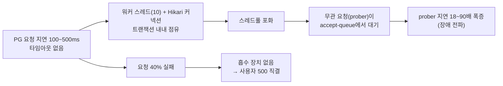

# 01 · Baseline — 무방비 동기 연동의 장애 전파 (As-Is 원점)

> **목적**: 타임아웃·재시도·서킷·fallback이 **전혀 없는** Stage 0 구현이, 외부 PG의 지연·실패 하나로 어떻게 무너지는지 수치로 박제한다. 이후 모든 보강 단계(Stage 2~7)의 비교 원점이다.

---

## 1. 한 줄 결론

**PG 요청을 타임아웃 없이 트랜잭션 안에서 동기 대기하자, 결제와 무관한 조회 요청(prober)의 응답이 부하에 비례해 무너졌고(p50 18ms → 최대 1.62s, ~90배), PG의 요청 실패 40%는 그대로 사용자 500으로 직결됐다.**

---

## 2. 측정 구성

### 2.1 대상 결함 (의도적으로 무방비)

```
POST /api/v1/payments  →  PaymentFacade.createPayment  (@Transactional)
                            ├─ orderRepository.getActiveByIdAndUserId   (DB)
                            ├─ paymentRepository.save (PENDING)         (DB)
                            └─ paymentGateway.requestPayment(...)  ←── Feign 호출, 타임아웃 없음
                                                                        (트랜잭션 안에서 대기)
```

핵심 결함 두 가지:
1. **타임아웃 부재** — PG가 느려도 끊지 않고 워커 스레드가 무한정 대기한다.
2. **트랜잭션 안 외부 호출** — PG를 기다리는 동안 톰캣 워커 스레드 **그리고 Hikari 커넥션**을 동시에 점유한다.

### 2.2 부하 경감 설계 (머신 보호)

200개 기본 스레드를 고갈시키려면 큰 부하가 필요해 측정 머신이 느려진다. 그래서 **톰캣 워커 스레드를 임시로 10개로 축소**해 저부하(20~50 VU)로도 고갈을 재현했다. 파일을 고치지 않고 부팅 시 환경변수로만 덮어 측정 후 평소대로 재기동하면 원복된다.

```bash
SPRING_PROFILES_ACTIVE=local \
SERVER_TOMCAT_THREADS_MAX=10 SERVER_TOMCAT_THREADS_MIN_SPARE=10 \
./gradlew :apps:commerce-api:bootRun
```

> 톰캣이 200스레드였다면 20 VU로는 절대 열화하지 않는다. **20 VU에서 18배 열화가 일어났다는 사실 자체가 풀이 작다(10)는 행동적 증거**다.

### 2.3 환경

| 구성 | 값 |
|---|---|
| commerce-api 톰캣 max-threads | **10** (기본 200에서 축소), accept-count 100 |
| commerce-api Hikari pool | 40 (max), connection-timeout 3s |
| pg-simulator 요청(접수) | **100~500ms 지연 + 40% 확률 500** |
| pg-simulator 처리 | 1~5s 후 콜백(비동기) |
| 시드 | 유저 1, 상품 100, **미결제 주문 3,000건** (`status=CREATED`) |
| prober (무관 요청) | `GET /api/v1/products/{id}` — 인증 없음, DB 단건 조회, 5 req/s 고정 도착률, 클라이언트 타임아웃 10s |
| payment (부하원) | `POST /api/v1/payments` — 인증(매 요청 bcrypt) + DB 쓰기 + Feign PG 호출 |

> 결제는 `orderId`당 1회만 접수 가능(이후 409)하므로, k6는 iteration마다 전역 카운터로 **유니크 주문 id**를 소비한다. 측정 간에는 결제·주문 테이블을 초기화해 409 오염을 제거했다.

### 2.4 타임라인 (단일 실행 90초)

```
0s        15s                        75s        90s
│ warmup   │          load            │ recovery  │
│ prober만 │  prober + 결제 부하 ON   │ 부하 OFF  │
└──────────┴──────────────────────────┴───────────┘
   (깨끗한        (스레드 고갈 →           (회복
    baseline)      무관 요청 열화)          확인)
```

prober 지연은 phase별 분리 메트릭(`prober_warmup_ms` / `prober_load_ms` / `prober_recovery_ms`)으로 기록해 전/중/후를 직접 대비했다.

---

## 3. 결과

두 부하 수준에서 각각 측정했다. **prober 지연은 결제 부하에 비례해 단조 증가**한다.

### 3.1 무관 요청(prober) 지연 — phase별 분포

**Run A — 결제 20 VU**

| phase | p50 | p90 | p95 | p99 | max |
|---|---|---|---|---|---|
| warmup (부하 전) | 21.97ms | 29.73ms | 32.62ms | 78.93ms | 171.64ms |
| **load (부하 중)** | **404.13ms** | 513.39ms | 540.65ms | 566.43ms | 601.79ms |
| recovery (부하 후) | 15.95ms | 22.88ms | 25.21ms | 29.90ms | 33.32ms |

**Run B — 결제 50 VU**

| phase | p50 | p90 | p95 | p99 | max |
|---|---|---|---|---|---|
| warmup (부하 전) | 17.98ms | 28.23ms | 31.90ms | 37.79ms | 39.15ms |
| **load (부하 중)** | **1.62s** | 1.78s | 1.83s | 1.87s | 1.90s |
| recovery (부하 후) | 16.19ms | 22.15ms | 24.30ms | 26.80ms | 29.04ms |

### 3.2 부하에 따른 prober p50 전파 (idle → load)

```
prober p50 응답시간
  20ms  ┤■ (idle ~20ms)
        │
 400ms  ┤■■■■■■■■■■ 404ms        ← 결제 20 VU
        │
        │
 1.6s   ┤■■■■■■■■■■■■■■■■■■■■■■■■■■■■■■■■■■■■■■■■■ 1620ms   ← 결제 50 VU
        └──────────────────────────────────────────
         결제 부하가 커질수록 무관 요청이 더 오래 스레드를 기다린다
```

- 결제 20 VU에서 prober p50가 **약 18배**(22ms→404ms), 50 VU에서 **약 90배**(18ms→1.62s)로 열화.
- Run A의 load p50(404ms)는 결제 1건 처리시간(접수 지연 100~500ms)과 거의 일치한다 — **무관 요청이 "스레드 1슬롯이 비기를" 정확히 그만큼 기다린 것**.
- 부하가 끝나면 두 런 모두 즉시 ~16ms로 회복 → 영구 손상이 아니라 **자원 경합에 의한 전파**임이 분명.

### 3.3 결제 요청 — 실패가 사용자에게 직결

| | Run A (20 VU) | Run B (50 VU) |
|---|---|---|
| payment_500 (500 직결률) | **39.38%** (521/1323) | **39.46%** (556/1409) |
| payment_fail (비2xx 전체) | 39.45% | 39.46% |

- pg-simulator의 요청 실패 확률 40%가 **거의 그대로 사용자 500**으로 나타났다(흡수 장치 없음). `payment_500 ≈ payment_fail` — 실패의 사실상 전부가 500.
- 무방비 상태에선 "외부가 흔들림 = 사용자가 에러를 받음"이 1:1로 성립한다.

### 3.4 부산물 관찰 — 누적 PENDING (Stage 6 동기)

부하 후 접수 성공분(예: Run B 853건)이 **모두 PENDING**으로 남았다. 부하가 만든 pg-simulator 비동기 처리 백로그로 콜백 결과 반영이 지연·누락됐다.

- 이는 결함이 아니라 **"응답을 받았어도(PENDING) 결과는 모른다"는 본질의 정직한 표현**이다.
- 콜백은 유실될 수 있고(횡단 규약상 재발송 없음) 부하에 더 잘 막힌다 → **폴링 정합성 복구(Stage 6)가 필수**임을 baseline이 그대로 보여준다.

---

## 4. 해석 — 왜 이렇게 무너지는가



**왜 완전 붕괴(타임아웃/거부)까지는 안 갔나 — 그리고 그게 왜 함정인가.**
prober 지연은 ~1.9s에서 **plateau**했고 10s 클라이언트 타임아웃에는 닿지 않았다(`prober_fail` 0%). 이유는 두 가지다.
1. PG 접수 지연이 100~500ms로 **짧아 스레드가 빠르게 회전**한다.
2. 부하원이 **닫힌 모델(ramping-vus, 동시성 상한 있음)**이라 큐 깊이가 바운드된다.

→ 실제 트래픽처럼 **도착이 열린 모델**이거나 의존 지연이 더 길면, 큐는 상한 없이 쌓여 **타임아웃·커넥션 거부로 전환**된다. 즉 지금의 "지연 plateau"는 **운이 좋은 것**이지 안전한 게 아니다. **우리가 능동적으로 타임아웃을 걸어 자원을 회수**해야 하는 이유(Stage 2)가 여기서 나온다.

---

## 5. 다음 단계로의 연결

| 이 baseline이 드러낸 결함 | 보강 단계 |
|---|---|
| 무한 대기로 스레드/커넥션 고갈 → 무관 요청 전파 | **Stage 2** 타임아웃 + 외부 호출을 트랜잭션 밖으로 |
| 외부 실패 40% → 사용자 500 직결 | **Stage 3** Fallback(결과 불명 → PENDING 흡수) |
| 부하 중 실패 누적으로 PG를 계속 두드림 | **Stage 4** Circuit Breaker |
| 접수 성공분이 PENDING으로 누적, 콜백 유실 | **Stage 6** 폴링 Reconciliation |

> Stage 2 측정(`02-timeout.md`)은 **동일한 시나리오·동일한 축소 스레드(10)**로 재측정해, prober load p50가 회복되는지로 효과를 증명한다.

---

## 6. 재현 방법

```bash
# 0) 인프라 (MySQL/Redis)
docker-compose -f ./docker/infra-compose.yml up -d

# 1) pg-simulator (포트 8082)
SPRING_PROFILES_ACTIVE=local ./gradlew :apps:pg-simulator:bootRun

# 2) commerce-api — 톰캣 스레드 10으로 축소 부팅 (측정 후 평소대로 재기동하면 원복)
SPRING_PROFILES_ACTIVE=local \
SERVER_TOMCAT_THREADS_MAX=10 SERVER_TOMCAT_THREADS_MIN_SPARE=10 \
./gradlew :apps:commerce-api:bootRun

# 3) 시드 (유저 1 · 상품 100 · 미결제 주문 3000)
bash docs/volume-6/measurement/k6/seed.sh

# 4) 측정
#    moderate (20 VU)
k6 run docs/volume-6/measurement/k6/stage1-baseline.js
#    heavy (50 VU) — 측정 간 결제·주문 초기화 후 재시드 권장(409 오염 방지)
PAY_VUS=50 k6 run docs/volume-6/measurement/k6/stage1-baseline.js
```

측정 간 초기화:

```sql
SET SESSION cte_max_recursion_depth = 1000000;
TRUNCATE TABLE payments;
TRUNCATE TABLE orders;
INSERT INTO orders (user_id, status, ordered_at, original_amount, discount_amount, final_amount, created_at, updated_at)
WITH RECURSIVE seq(n) AS (SELECT 1 UNION ALL SELECT n+1 FROM seq WHERE n < 3000)
SELECT 1, 'CREATED', NOW(), 5000, 0, 5000, NOW(), NOW() FROM seq;
```

---

## 7. 한계 / 정직한 메모

- **닫힌 부하 모델**이라 prober 지연이 plateau했다. 열린 도착 모델이면 더 극적인 붕괴(타임아웃/거부)가 나온다 — 본 baseline은 보수적(낙관적) 수치다.
- 스레드를 10으로 축소한 **상대 비교**다. 절대 수치가 아니라 **전/중/후 배수와 추세**가 증거다.
- 콜백 미반영의 정확한 근인(pg-simulator 비동기 backlog vs 유실)은 분리 측정하지 않았다 — Stage 6에서 다룬다.
