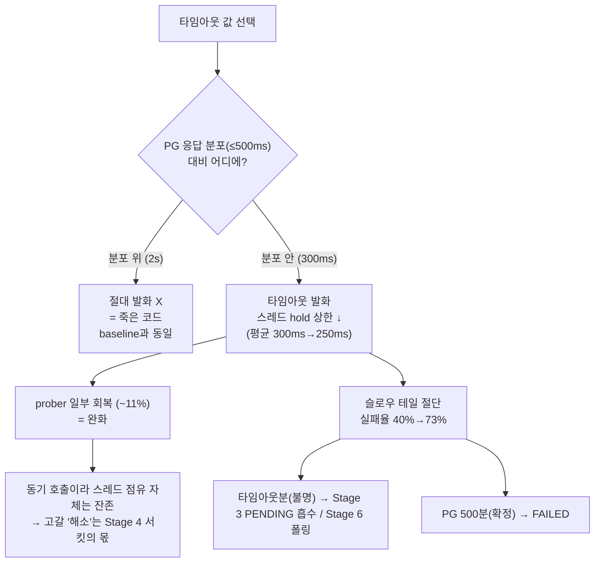

# 02 · Timeout — "안 빠지는 물을 언제 포기할 것인가"

> **목적**: Stage 2(Feign 타임아웃 + 예외 변환 + 외부 호출 트랜잭션 밖)가 baseline의 장애 전파를 얼마나 되받는지 **동일 환경**으로 재측정한다. 핵심 발견은 **"타임아웃 값은 의존성의 응답 분포 안에 있어야 의미가 있다"** 이며, 그 위에서 드러난 **타임아웃의 한계**가 Stage 3·4·6의 동기가 된다.

---

## 1. 한 줄 결론

**타임아웃을 PG 응답 분포(100~500ms) 위(2s)에 두면 단 한 번도 발화하지 않는 죽은 코드였고(baseline과 통계적으로 동일), 분포 안(300ms)으로 내리자 비로소 살아나 무관 요청이 일부 회복(50VU p50 1.62s→1.44s)됐다. 다만 동기 호출이라 스레드 점유 자체는 사라지지 않아 고갈은 "해소"가 아니라 "완화"에 그쳤고, 잘린 슬로우 테일은 실패율을 40%→73%로 끌어올렸다 — 이 실패의 절반은 "결과 불명(타임아웃)"이라 Stage 3·6이 흡수·보정해야 한다.**

---

## 2. 측정 구성

### 2.1 적용한 변경 (Stage 2)

```
POST /api/v1/payments  →  PaymentFacade.createPayment   (@Transactional 제거)
   1) acceptPayment(...)            ─ PENDING 저장, 리포지토리 자체 트랜잭션으로 즉시 커밋(커넥션 반납)
   2) paymentGateway.requestPayment ─ Feign 호출 (connect 1s / read 300ms), 트랜잭션 밖
        └ 실패/타임아웃 → FeignException → CoreException(PAYMENT_GATEWAY_ERROR, 502)
   3) 거래키 저장                    ─ 별도 트랜잭션
```

- **타임아웃**: `spring.cloud.openfeign.client.config.pg-simulator` — connect 1s / **read 300ms**.
- **예외 변환**: 어댑터에서 `FeignException`→`CoreException(502)`. baseline의 막연한 500 직결 제거.
- **트랜잭션 경계**: PG 호출을 어떤 트랜잭션에도 넣지 않음(OSIV=false라 PENDING 커밋 즉시 Hikari 커넥션 반납).

### 2.2 타임아웃 값을 왜 300ms로 잡았나 (이 단계의 핵심 의사결정)

pg-simulator의 접수는 **`Thread.sleep(100~500ms)` 후 40% 확률로 500**이다. 즉 정상 응답은 **항상 ≤500ms**.

- **타임아웃을 500ms보다 크게(예: 2s) 잡으면** — PG가 그보다 느릴 일이 없으므로 **절대 발화하지 않는 죽은 코드**다. "다 기다리겠다"와 같다.
- 현업 결제는 레거시 카드사 연동 탓에 타임아웃을 넉넉히(분 단위) 잡지만, 그건 **실제로 그만큼 느려지는 케이스가 존재**하기 때문이다. 우리 시뮬레이터엔 그런 케이스가 없다.
- 따라서 타임아웃을 **응답 분포 안(200~300ms)** 으로 내려 **"접수 ack를 300ms만 기다리고 초과분은 포기(→PENDING→폴링 보정)"** 하는 정책을 측정 대상으로 삼았다. 우리 아키텍처가 `orderId` 앵커 + PENDING + 폴링으로 설계됐기에 "포기해도 돈은 안 잃는" 일관된 선택이다.

> 그래서 본 리포트는 **2s(죽은 코드) → 300ms(살아있는 코드)** 의 대비를 함께 싣는다. 2s는 "왜 분포 위 타임아웃이 무의미한가"의 증거다.

### 2.3 환경 (baseline과 동일)

| 구성 | 값 |
|---|---|
| commerce-api 톰캣 max-threads | **10** (축소 유지), accept-count 100 |
| commerce-api Hikari pool | 40 (max), connection-timeout 3s |
| **Feign read-timeout** | **2000ms (대조) / 300ms (Stage 2)** |
| pg-simulator 접수 | 100~500ms 지연 + 40% 확률 500 (하드코딩, 변경 없음) |
| 시드 / prober / 부하원 | baseline과 동일 (유저1·상품100·주문3000 / `GET /products/{id}` 5rps / `POST /payments`) |

> 측정 간 결제·주문 테이블을 초기화해 409 오염을 제거했다. 타임라인(90s warmup→load→recovery)도 baseline과 동일.

---

## 3. 결과 — 3-way 비교

### 3.1 무관 요청(prober) load p50 / payment 실패율

| 지표 | **baseline** (무방비) | **2s** (분포 위, inert) | **300ms** (분포 안, active) |
|---|---|---|---|
| prober load p50 (20VU) | 404ms | 438ms | **373ms** |
| prober load p50 (50VU) | 1.62s | 1.69s | **1.44s** |
| prober load p90 (50VU) | 1.78s | 1.83s | **1.55s** |
| payment_fail (20VU) | 39.5% | 42.3% | **73.6%** |
| payment_fail (50VU) | 39.5% | 41.5% | **73.1%** |
| payment_500 (직결) | ~39% | **0%** | **0%** |
| prober idle (warmup/recovery) | ~18 / ~14ms | ~18 / ~14ms | ~14~22 / ~14ms |

### 3.2 prober load p50 (50VU) — 세 레짐

```
prober load p50 (50VU)
 baseline ┤■■■■■■■■■■■■■■■■■■■■■■■■■■■■■■■■■ 1.62s   (무방비)
   2s     ┤■■■■■■■■■■■■■■■■■■■■■■■■■■■■■■■■■■ 1.69s   ← inert: baseline과 사실상 동일
  300ms   ┤■■■■■■■■■■■■■■■■■■■■■■■■■■■■ 1.44s          ← 살아난 타임아웃: ~11% 회복(완화)
          └────────────────────────────────────────
```

### 3.3 payment 실패율 분해 (300ms, 균일분포 역산)

```
read-timeout 300ms · sleep ~ U[100,500]
 ┌ 타임아웃 (sleep>300)        = 50%   → 502, "결과 불명"  ─┐ 이 중 ~60%(=30%p)는
 │                                                          │ 성공할 뻔했으나 끊긴 건 → PENDING(폴링 복구 대상)
 ├ 정상응답 후 PG 500 (40%)    = 50%×40% = 20% → 502, "확정 실패"
 └ 성공 201                    = 50%×60% = 30%
   이론 실패율 ≈ 70%  (측정 73% — 경계·난수 오차 포함)
```

- baseline/2s의 실패 ~40%는 **전부 PG 500(확정 실패)**. 300ms의 실패 73% 중 **~50%p는 타임아웃(결과 불명)**, **~20%p는 PG 500(확정 실패)** 으로 **성격이 다른 두 실패가 섞였다.**

---

## 4. 해석 — 측정이 말해주는 것 (plan 보정)



**(1) 분포 위 타임아웃은 죽은 코드다.** 2s는 baseline과 통계적으로 동일(50VU 1.62s vs 1.69s, 측정 노이즈 범위). PG가 2s를 넘을 일이 없으니 단 한 번도 끊지 못했다. → 타임아웃은 **"의존성이 실제로 그보다 느려질 수 있는 값"** 으로 잡아야 의미가 있다.

**(2) 살아난 타임아웃도 고갈을 "해소"하진 못한다 — "완화"다.** 300ms로 스레드 hold 상한이 낮아져(평균 ~300ms→~250ms) prober p50가 1.62s→1.44s(~11%) 회복됐다. 하지만 **동기 호출에서 스레드는 "호출에 걸린 시간만큼" 점유**되므로(타임아웃은 그 상한만 낮출 뿐), prober는 여전히 1.4s로 *나쁘다*. **스레드를 아예 안 잡게 하려면 "이제 그만 두드린다"(Stage 4 서킷) 가 필요**하다. → plan의 Stage 2 가정("타임아웃 전후 비교에서 스레드 고갈이 해소된다")은 **반증**되었고 "완화"로 보정한다.

**(3) 예외는 명확해졌다.** payment_500이 39%→0%로 사라지고 모든 PG 실패가 **502(PAYMENT_GATEWAY_ERROR)** 로 변환됐다. baseline의 "외부 흔들림 = 사용자 500" 1:1 직결은 끊겼다.

**(4) 그러나 502 하나로 뭉뚱그린 것이 다음 숙제다.** 300ms 실패 73%는 **타임아웃(결과 불명)** 과 **PG 500(확정 실패)** 이 섞여 있는데, 둘은 처리가 달라야 한다:

| 실패 | 의미 | 올바른 귀결 |
|---|---|---|
| **타임아웃** | PG가 처리했는지 우리는 **모른다** | `PENDING` 유지 → 상태조회 API로 보정(돈 안 빠졌으면 취소) |
| **PG 500** | 트랜잭션 키 생성 *전* 실패 → **찌꺼기 없는 확정 실패** | `FAILED` 확정 + (멱등 전제 시) 재시도 후보 |

→ 이 분기는 **Stage 3(fallback: 불명→PENDING 흡수)** 와 함께 도입한다. (Stage 2 범위는 타임아웃·예외·트랜잭션까지라 본 단계에선 502 단일 변환에 머문다.)

**(5) 트랜잭션 경계 효과는 이 시나리오에선 측정상 드러나지 않았다(정직).** PG 호출을 트랜잭션 밖으로 빼 Hikari 커넥션을 PG 대기 중 반납하게 했지만, baseline의 병목은 커넥션(40개)이 아니라 **톰캣 스레드(10개)** 였다. 따라서 prober 수치에 별도 기여가 보이지 않는다. 이 변경은 *커넥션 풀이 병목이 되는 다른 부하 형상*과 *롱 트랜잭션 회피*를 위한 안전장치로서 유효하며, 수치가 아닌 **구조적 정당성**으로 남긴다.

---

## 5. 다음 단계로의 연결

| 이 단계가 드러낸 것 | 보강 단계 |
|---|---|
| 타임아웃은 고갈을 완화만 함(동기 스레드 점유 잔존) | **Stage 4** Circuit Breaker — slow-call/실패율로 호출 자체를 차단 |
| 실패 73%가 "불명(타임아웃)+확정(500)" 혼재, 현재 502 단일 | **Stage 3** Fallback — 불명→PENDING 흡수 / 500→FAILED 분기 |
| 잘린 슬로우 테일의 ~30%p가 "성공할 뻔했으나 끊긴" PENDING | **Stage 6** 폴링 Reconciliation — 상태조회로 SUCCESS/취소 확정 |
| 타임아웃 후 사용자 경험(502 노출) | **Stage 3** "결제 진행 중" 안내 + PENDING (에러 직결 회피) |

---

## 6. 재현 방법

```bash
# 0) 인프라 + pg-simulator(8082)
docker-compose -f ./docker/infra-compose.yml up -d
SPRING_PROFILES_ACTIVE=local ./gradlew :apps:pg-simulator:bootRun

# 1) commerce-api — 톰캣 10 축소. read-timeout은 application.yml(기본 300ms).
#    2s 대조군을 보려면 application.yml의 read-timeout을 2000으로 바꿔 재기동.
SPRING_PROFILES_ACTIVE=local \
SERVER_TOMCAT_THREADS_MAX=10 SERVER_TOMCAT_THREADS_MIN_SPARE=10 \
./gradlew :apps:commerce-api:bootRun

# 2) 시드 + 측정 (측정 간 결제/주문 초기화 후 재시드 — baseline 02-baseline.md §6과 동일 SQL)
bash docs/volume-6/measurement/k6/seed.sh
k6 run docs/volume-6/measurement/k6/stage1-baseline.js            # 20 VU
PAY_VUS=50 k6 run docs/volume-6/measurement/k6/stage1-baseline.js # 50 VU
```

---

## 7. 한계 / 정직한 메모

- **k6 지표가 502를 분해하지 못한다.** `payment_fail`은 타임아웃분과 PG 500분을 합산할 뿐이라, 본 리포트의 분해(§3.3)는 시뮬레이터 분포 기반 **역산**이다. 정밀 분해는 어댑터에서 타임아웃/5xx를 별도 ErrorType로 가른 뒤(Stage 3) 측정해야 정확하다.
- **300ms는 공격적 정책이다.** 정상 성공의 절반가량을 PENDING으로 넘긴다(즉시 성공률 60%→30%). 이는 폴링 보정 부하와 맞바꾼 의도된 선택이며, 보정 안전망(Stage 6)이 없으면 정당화되지 않는다.
- **트랜잭션 경계 효과 미측정.** 커넥션이 병목이 되는 부하 형상은 본 시나리오에 없어 별도 측정하지 않았다.
- **상대 비교다.** 톰캣 10 축소 환경의 전/중/후 배수가 증거이지 절대 수치가 아니다.
