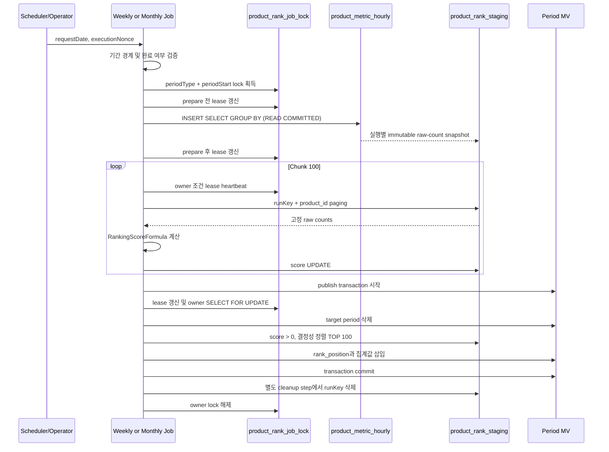
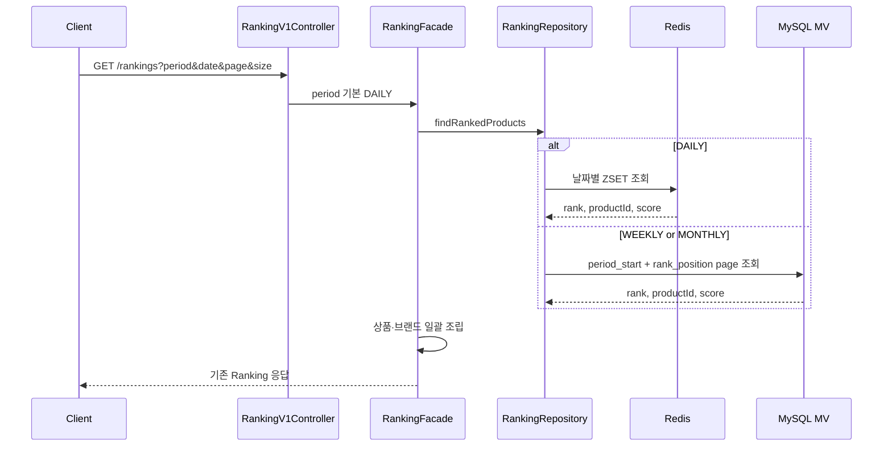
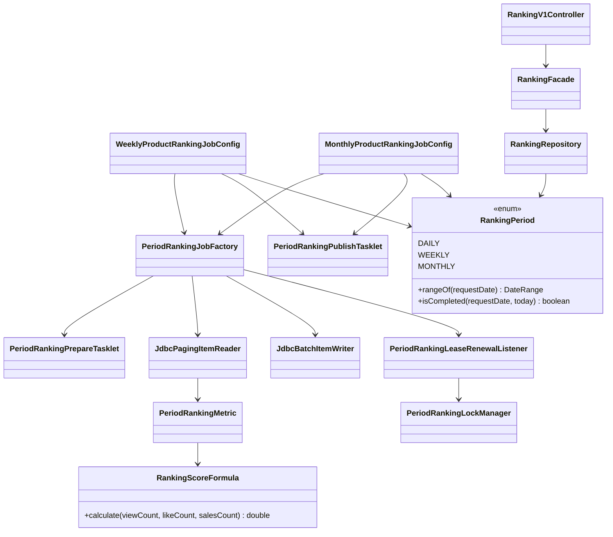
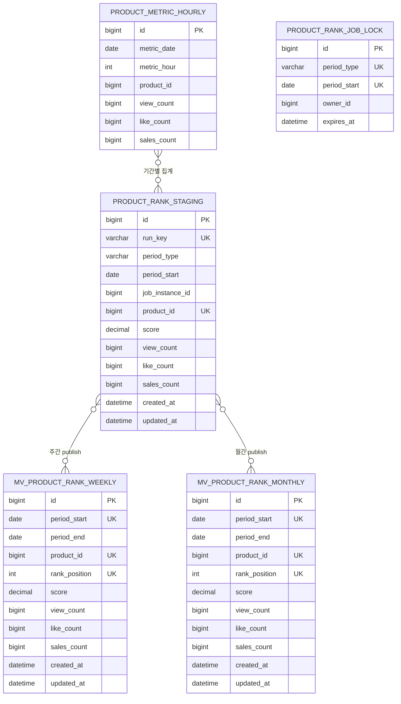

# Round 10 주간·월간 상품 랭킹 설계

## TL;DR

일간 Redis 랭킹은 실시간 조회 모델로 유지하고, 종료된 주·월은 `product_metric_hourly`를 Spring Batch로 다시 집계해 MySQL의 조회 전용 MV 테이블에 적재한다. 원천 집계는 단일 `INSERT ... SELECT GROUP BY`로 실행별 staging snapshot을 한 번만 만들고, chunk는 고정된 snapshot의 점수만 계산한다. 마지막 publish 트랜잭션에서 MV를 완전 교체하므로 실패한 실행이 기존 정상 랭킹을 훼손하지 않는다.

## 문제 정의

### 사용자 관점

사용자는 오늘의 인기 상품만이 아니라 특정 날짜가 속한 주와 월의 인기 상품도 같은 API에서 조회하고 싶다. 기간을 생략한 기존 호출은 일간 랭킹으로 계속 동작해야 한다.

### 비즈니스 관점

주간·월간 랭킹 요청마다 시간별 메트릭 전체를 집계하면 조회량에 비례해 DB 비용이 반복된다. 랭킹은 약간의 지연을 허용할 수 있으므로, 한 번 계산한 TOP 100을 조회 전용 테이블에 저장해 읽기 비용을 일정하게 만드는 편이 적합하다.

### 시스템 관점

대량 집계는 제한된 메모리로 재시작 가능해야 하고, 재실행 중인 부분 결과가 API에 노출되어서는 안 된다. 같은 기간의 두 실행이 staging과 MV를 서로 덮어쓰는 것도 막아야 한다.

### 성공 기준

- `period`를 생략하면 기존 DAILY Redis 조회와 호환된다.
- WEEKLY는 월요일~일요일, MONTHLY는 1일~말일을 집계한다.
- 종료일이 KST 오늘보다 이전인 완료 기간만 배치할 수 있다.
- 양수 점수 TOP 100을 `score DESC, product_id ASC`로 결정성 있게 저장한다.
- 동일 기간 재실행은 이전 결과를 완전히 교체하며, 결과가 0건이어도 이전 행을 제거한다.
- chunk 또는 publish 실패 시 기존 MV는 유지된다.
- 한 실행은 원천 기간 집계를 한 SQL statement에서 한 번만 수행하고, restart도 같은 snapshot을 사용한다.

## 선택지와 결정

### 집계 원천

- A. 누적 `product_metrics`를 기간 이력 테이블로 변경한다.
  - 과제의 테이블 이름과 일치하지만 9주차 streamer의 누적 지표 의미와 쓰기 경로가 바뀐다.
- B. 날짜·시간을 이미 가진 `product_metric_hourly`를 집계한다.
  - 기존 실시간 처리 구조를 보존하고 기간 경계를 정확히 재현할 수 있다.

결정은 B다. 기간 집계의 필수 차원인 `metric_date`가 이미 있고, 과제 범위 밖의 기존 누적 모델 변경을 피할 수 있기 때문이다.

### Job과 MV 구조

- A. 주간 Job/MV와 월간 Job/MV를 분리한다.
  - 운영 스케줄과 장애 범위가 명확하지만 설정 코드가 일부 반복된다.
- B. 하나의 범용 Job과 통합 MV를 사용한다.
  - 확장은 쉽지만 과제의 명시적 산출물과 멀어지고 단일 책임이 흐려진다.

결정은 A다. `weeklyProductRankingJob`, `monthlyProductRankingJob`과 두 MV를 분리해 운영 단위를 드러낸다. 기간 계산과 점수 공식만 `modules:ranking`에서 공유한다.

### 재실행 적재 방식

- A. target을 먼저 삭제하고 chunk마다 직접 적재한다.
  - 단순하지만 중간 실패 시 기존 정상 데이터가 사라지거나 부분 결과가 노출된다.
- B. staging에 chunk 적재 후 마지막 Step에서 target을 교체한다.
  - staging 공간과 publish 단계가 필요하지만 실패 격리와 0건 교체를 함께 만족한다.

결정은 B다. prepare Step은 새 JobInstance에서 현재 run key를 비운 뒤 단일 `INSERT ... SELECT GROUP BY`로 raw count snapshot을 만든다. `READ_COMMITTED` 격리 수준의 consistent read를 사용해 긴 집계가 streamer UPSERT를 불필요하게 막지 않으며, 하나의 SQL statement 안에서는 동일한 원천 시점을 읽는다. FAILED restart는 같은 JobInstance ID를 사용하므로 완료된 prepare Step을 skip하고 고정 snapshot과 앞서 커밋한 score를 이어 쓴다. 의도적 재실행은 새 JobInstance ID를 사용하므로 이전 실행의 staging과 섞이지 않는다. publish Step은 DB 트랜잭션 하나에서 기존 기간 삭제와 TOP 100 삽입만 수행하고, 별도 cleanup Step이 현재 staging을 제거한다. 따라서 publish commit 직후 프로세스가 중단되어도 같은 snapshot으로 publish를 다시 실행할 수 있다.

## 배치 시퀀스

### 이유

시간별 원천을 page마다 다시 `GROUP BY`하면 페이지 수만큼 대규모 집계를 반복하고, 실행 도중 late event가 반영되어 앞·뒤 page의 기준 시점이 달라질 수 있다. 따라서 prepare에서 원천을 한 번만 snapshot하고 Reader는 `(run_key, product_id)` 인덱스로 staging을 paging한다. Reader의 유일 정렬 키를 `product_id`로 두어 paging 중 행 누락과 중복을 막는다. target 교체를 chunk와 분리해야 실패 전까지 서비스가 기존 MV를 계속 읽을 수 있다.

기간 lock은 새 실행과 restart 모두 Job 시작 시 획득하고 종료 시 소유자 조건으로 해제한다. lease는 기본 7,200초이며 설정으로 조정할 수 있다. prepare 전후, 매 chunk 시작, publish 직전에 owner 조건으로 lease를 갱신하고 한 행이 갱신되지 않으면 즉시 실패한다. publish에서는 lock row를 `FOR UPDATE`로 다시 fencing한다.

해석: prepare가 성공하면 원천 변경과 무관한 실행별 snapshot이 확정된다. chunk commit은 같은 staging의 score 변경에만 보인다. 집계 도중 실패하면 MV에는 아무 변화가 없고, restart는 같은 JobInstance run key의 snapshot과 Spring Batch 실행 컨텍스트를 이어 쓴다. 서로 다른 JobInstance의 staging은 분리되므로 lease 이후 겹친 실행도 상대 데이터를 지우지 않는다. 0건이면 publish의 target 삭제는 실행되지만 삽입은 0건이므로 이전 결과가 정확히 제거된다.

## 조회 시퀀스

### 이유

DAILY는 이벤트 반영 지연이 짧은 Redis가 맞고, 종료된 WEEKLY/MONTHLY는 사전 집계한 MySQL MV가 맞다. 상품 상세의 `findRank`는 요구 범위가 오늘 순위이므로 기존 Redis 경로를 유지한다.

해석: API 응답 계약은 바뀌지 않고 조회 원천만 기간에 따라 갈린다. MV에는 원래 `rank_position`을 저장하므로 삭제된 상품을 응답에서 거르더라도 뒤 상품의 순위를 당기지 않는다.

## 클래스 구조

### 이유

기간 경계와 점수 계산은 batch와 API가 함께 해석해야 하므로 작은 공유 계약으로 둔다. 배치 Job은 분리하되 Reader → Processor → Writer → Publish 역할은 동일하게 유지한다.

해석: API는 배치 구현을 알지 않고 MV의 조회 계약만 사용한다. Job과 MV bean 이름은 주간·월간으로 분리하되 공통 step 생성, staging reader, score writer는 `PeriodRankingJobFactory`가 담당해 두 설정의 drift를 줄인다.

## ERD

### 이유

MV의 `(period_start, product_id)`는 기간 내 상품 중복을, `(period_start, rank_position)`은 순위 중복을 막는다. staging의 `(run_key, product_id)`는 snapshot paging과 score UPDATE의 유일 키다. `(run_key, score DESC, product_id)`는 TOP 100 publish를, `(created_at, period_type, period_start)`는 보존기한 범위 탐색 후 active lock 대조를 지원한다. lock의 기간 유니크 키는 같은 기간의 동시 실행을 차단한다.

해석: 이 관계는 FK 소유 관계가 아니라 데이터 생성 흐름이다. 집계·조회 성능을 위해 MV와 staging은 원천 테이블에 물리 FK를 두지 않는다. staging의 구조화된 기간 컬럼은 `run_key` 문자열을 파싱하지 않고 active lock과 안전하게 대조하기 위해 중복 저장한다.

## 운영 리스크와 경계

- 원천 변동: 종료된 시간별 메트릭이 뒤늦게 정정되면 MV는 자동으로 바뀌지 않는다. 같은 기간을 새 `executionNonce`로 재실행해 완전 교체한다.
- staging과 restart: FAILED restart는 같은 JobInstance와 run key를 사용해야 한다. 운영 도구가 임의로 파라미터를 바꾸면 restart가 아니라 새 재계산이 된다. staging은 기본 7일 보존하며 `created_at` 기준으로 정리한다. 보존 기한이 지난 JobInstance는 restart를 포기한 것으로 간주한다. 아직 유효한 `(period_type, period_start)` lock이 있으면 해당 기간 staging은 정리 대상에서 제외한다.
- 동시 실행: `(period_type, period_start)` DB lock과 소유자 조건 해제로 같은 기간 실행을 직렬화한다. `batch.ranking.lock-lease-seconds`의 기본값은 7,200초이며 prepare 전후와 chunk마다 갱신한다. 단, 단일 snapshot SQL 실행 중에는 heartbeat를 commit할 수 없으므로 lease는 관찰된 최대 snapshot 시간보다 길게 설정해야 한다. publish fencing은 만료된 이전 owner가 MV를 교체하지 못하게 한다.
- 원천 부하: prepare의 `INSERT ... SELECT`는 `READ_COMMITTED`로 실행해 InnoDB의 nonlocking consistent read를 사용한다. 그래도 대량 스캔의 CPU·I/O 비용은 있으므로 운영 전 `EXPLAIN ANALYZE`와 실행시간을 측정해 스케줄을 정한다.
- 실측 경계: [기간 랭킹 벤치마크](03-period-ranking-benchmark-report.md)에서 snapshot은 원천 `GROUP BY`를 실행당 1회로 제한하고 동일 digest를 만들었다. 동일한 페이지 transaction 경계에서 1천 상품은 legacy equivalent보다 느렸지만 1만 상품은 약 56% 짧아 규모에 따른 교차점도 확인했다. 다만 하루 1시간 밀도의 로컬 Testcontainers 결과이므로 실제 Job·24시간 밀도·restart 비용은 후속 실험 대상으로 둔다.
- 지연: 완료된 기간만 제공하므로 이번 주·이번 달의 부분 랭킹은 노출하지 않는다. 실시간 요구가 생기면 확정 MV와 진행 중 Redis 집계를 별도 의미로 제공해야 한다.
- 점수 버전: 현재 MV에는 점수 공식 버전을 저장하지 않는다. 가중치가 바뀌면 과거 기간 재계산 범위와 버전 컬럼을 함께 검토해야 한다.

## 배포 전 DDL 적용

`local`, `test` profile은 Hibernate `ddl-auto=create`가 엔티티로 테이블을 생성한다. 반면 `dev`, `qa`, `prd`는 `ddl-auto=none`이므로 애플리케이션 배포만으로 MV, staging, lock 테이블이 생기지 않는다.

배포 순서는 다음과 같다.

1. [기간 랭킹 DDL](sql/01-period-rank-mv.sql)을 DB migration 도구나 승인된 수동 배포 파이프라인에 등록한다.
2. 대상 환경에서 네 테이블과 유니크 제약 생성 여부를 확인한다.
3. commerce-batch와 commerce-api를 배포한다.
4. 종료된 과거 기간으로 배치를 1회 실행한 뒤 MV와 API 조회를 smoke test한다.

DDL 적용 전에 신규 배치나 WEEKLY/MONTHLY API를 먼저 배포하면 테이블 부재로 실패하므로, DB migration이 애플리케이션 배포보다 선행해야 한다.
