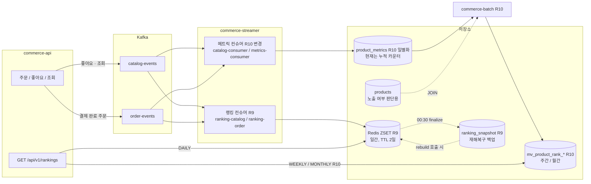
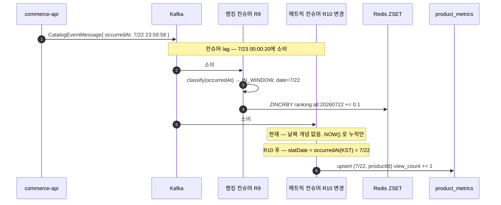
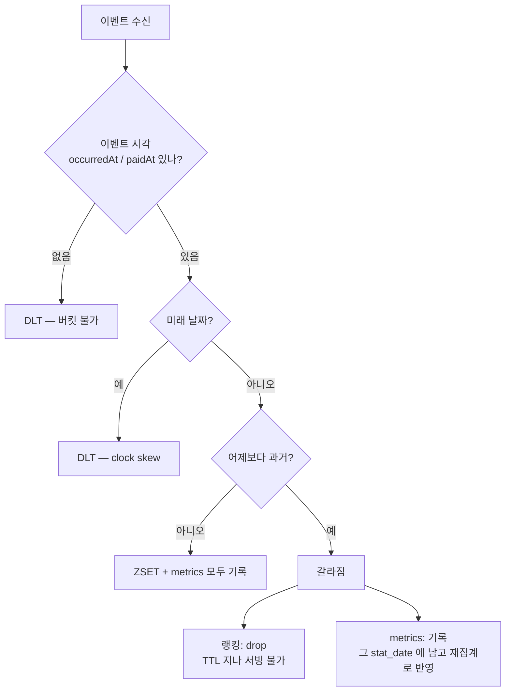
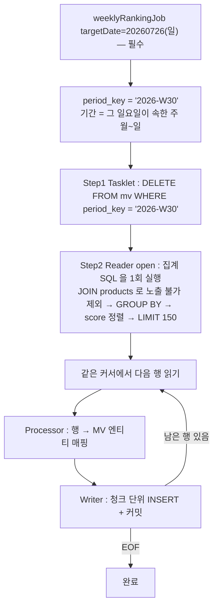
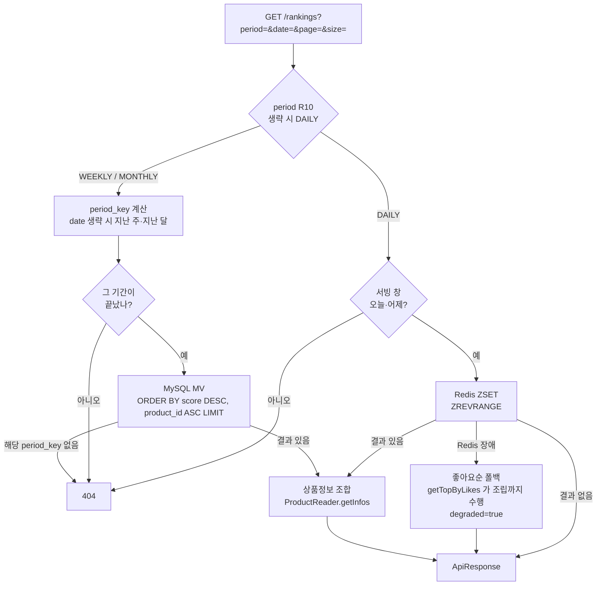

# Flow — 이벤트부터 랭킹 조회까지

`01-requirements.md`가 "왜 그렇게 정했는지"를 다룬다면, 이 문서는 **무엇이 언제 어디서 도는지**만 본다.

> **표기** — 이 문서는 이미 도는 것과 R10에서 만들 것을 함께 그린다. 섞이면 오해하므로 구분해 표시한다.
> **`[R9]`** 현재 동작 중 · **`[R10]`** 이번 주 신규 · **`[R10↻]`** 기존 코드를 이번 주에 변경

## 1. 전체 구성



**한 이벤트가 두 갈래로 갈라진다.** 랭킹 컨슈머는 가중치를 곱해 ZSET에 넣고, 메트릭 컨슈머는 원시 카운트를 쌓는다. 컨슈머 그룹이 달라 서로를 읽지 않고, 한쪽이 죽어도 다른 쪽은 돈다. 토픽은 나뉘어 있다 — 좋아요·조회는 `catalog-events`, 결제 완료 주문은 `order-events`로만 간다.

23:50 carry-over는 이 그림에 없다. Redis 안에서 오늘 키를 내일 키로 복사하는 작업이라 컴포넌트 사이를 오가지 않는다. 시각과 배율은 2절 타임라인에 있다.

| 구성 | 컨슈머 그룹 | 상태 |
| --- | --- | --- |
| 랭킹 컨슈머 → ZSET | `ranking-catalog`, `ranking-order` | `[R10↻]` `occurredAt`/`paidAt` null 가드 (가중치는 상수 그대로) |
| carry-over / finalize / rebuild | — | `[R9]` 변경 없음 |
| 메트릭 컨슈머 → `product_metrics` | `catalog-consumer`, `metrics-consumer` | `[R10↻]` 일별화 |
| 배치 → MV | — | `[R10]` 신규 |
| 랭킹 조회 | — | `[R10↻]` `period` 추가 |

## 2. 타임라인

R9는 매일 돌고, R10 배치는 기간이 끝날 때만 돈다.

```
[매일 R9]
00:00 ─┬─ 새 ZSET 키 시작 (ranking:all:오늘) — 전날 carry-over 씨앗이 들어 있음
00:30 ─┤  finalize : 어제 ZSET → ranking_snapshot 확정
       │  ← 하루 종일 이벤트가 ZSET과 product_metrics 양쪽에 쌓임
23:50 ─┴─ carry-over : 오늘 ZSET × 0.1 → 내일 ZSET

[R10]
매주 월요일 새벽 ── weeklyRankingJob  → 지난 주(월~일) 확정
매월 1일  새벽 ── monthlyRankingJob → 지난 달(1일~말일) 확정
```

cron 실측 — carry-over `0 50 23 * * *`, finalize `0 30 0 * * *` (둘 다 `Asia/Seoul`). 배치 실행 시각은 이번 주에 정하되 새벽대에 두어, 자정 넘어 도착하는 늦은 이벤트가 `product_metrics`에 다 들어온 뒤 읽는다. 배치를 띄우는 주체는 앱 밖이다(6절 참고).

**carry-over와 finalize는 간섭하지 않는다.** carry-over는 *내일* 키에 쓰고 finalize는 *어제* 키를 읽는다. 그리고 carry-over 기여분은 매일 0.1이 곱해져 기하급수로 감쇠하므로(0.1 → 0.01 → …) 누적 오염이 생기지 않는다.

## 3. 이벤트 하나의 여정

상품 조회(`VIEW`) 이벤트가 22일 23:59:58에 발생해 자정을 넘겨 처리되는 경우.



**처리시각(00:00:20)이 아니라 이벤트시각(23:59:58)으로 날짜를 정한다.** 랭킹 컨슈머는 이미 그렇게 동작하고, 메트릭 컨슈머는 이번 주에 그렇게 바꾼다. 근거는 `docs/week9/03-event-time-keying.md`.

producer는 이미 값을 싣고 있다 — `CatalogEventMessage.occurredAt`, `OrderPaidEvent.paidAt` 모두 팩토리가 `ZonedDateTime.now()`로 채운다. 메트릭 쪽 DTO가 필드를 선언하지 않아 Jackson이 버릴 뿐이다.

### 판정이 갈리는 경우 `[R10]`

같은 `RankingWindow.classify()`를 쓰지만 **저장소가 달라 결론이 다르다.** 메트릭 쪽은 이번 주에 새로 넣는 판정이다.



| | ZSET | product_metrics |
| --- | --- | --- |
| TTL | 2일 (`date.plusDays(2)` 절대 만료) | 없음 |
| 읽는 범위 | 오늘·어제 | 배치가 지정한 기간(주·월) |
| 어제보다 과거 | **버린다** — 써도 못 읽는다 | **받는다** — 상한 없이 해당 `stat_date`에 기록 |

ZSET에서 버려진 늦은 이벤트도 주간·월간 집계에는 살아 있다. 두 경로가 서로를 보완한다.

### 고쳐야 할 것 — null `occurredAt`은 지금 DLT로 가지 않는다

위 흐름도의 첫 분기는 **아직 존재하지 않는다.** 랭킹 컨슈머는 메시지 자체의 null만 검사하고 `occurredAt`은 검사하지 않는다.

```java
CatalogEventMessage message = deserialize(record);
if (message == null) continue;                          // 여기까지만
RankingWindow.classify(message.occurredAt(), today);    // occurredAt 이 null 이면
                                                        // classify 안에서 NPE
```

NPE가 `consume()` 밖으로 전파되면 `acknowledgment.acknowledge()`에 도달하지 못한다. manual ack + 배치 리스너라 **같은 배치가 무한 재전달되고 파티션이 멈춘다.** DLT가 아니다.

producer가 항상 채우므로 아직 발생한 적은 없지만 방어가 없다. 메트릭 쪽에 같은 판정을 넣을 때 랭킹 쪽에도 null 가드를 추가한다.

## 4. 배치 한 번의 실행 `[R10]`



- **Reader** — DB가 `products`를 join해 삭제·판매중지를 걸러내고 → `GROUP BY product_id` → 가중치로 score 계산 → `ORDER BY score DESC, product_id ASC LIMIT 150`까지 한 번에 한다. 그 150행을 `JdbcCursorItemReader`가 읽는다. 커서를 고른 건 `LIMIT 150`을 SQL에 직접 쓸 수 있어서다 — 페이징 리더는 `LIMIT` 자리를 `pageSize`가 차지해 상위 150 컷을 SQL로 표현할 수 없다(근거는 요구사항 문서). 가중치는 SQL 바인딩 파라미터로 주입한다(`RankingScoreWeights` 상수).
- **Processor** — 읽은 행을 MV 엔티티로 매핑한다. score는 이미 계산돼 있다.
- **Writer** — MV에 그대로 쓴다. weekly/monthly 대상 테이블은 enum으로 분기한다.

`DELETE`는 별도 Step이다. 재시작 관련 옵션은 붙이지 않고 Spring Batch 기본 동작을 그대로 쓴다 — 완료된 Step1은 스킵되고 Reader가 읽던 자리부터 이어간다. `RunIdIncrementer`도 쓰지 않는다. `targetDate`가 이미 식별 파라미터라 할 일이 없고, 붙이면 동시 실행 가드만 약해진다(근거는 요구사항 문서).

`targetDate`는 필수다. 생략하면 `JobParameters`가 비어 완료 가드가 적용되지 않고, 2주차부터 두 Step이 모두 스킵돼 조용히 아무것도 하지 않는다.

```bash
targetDate=20260726          # 월요일 새벽 정기 실행 → W30 확정
targetDate=20260719 rerun=1  # 그 전 주 재계산 = 백필. 식별 파라미터를 바꿔야 다시 돈다
```

## 5. 조회 경로

`period` 분기가 `[R10]`이다. 현재 컨트롤러는 `date`·`page`·`size`만 받고 전부 ZSET으로 간다.



DAILY 경로(서빙 창 2일, Redis 장애 시 좋아요순 `degraded` 폴백)는 `[R9]` 그대로다.

WEEKLY/MONTHLY는 확정된 지난 기간만 답한다. 진행 중인 이번 주·이번 달을 요청하면 **API가 `period_key`를 계산한 뒤 기간이 안 끝났음을 보고 MV 조회 없이 404**를 준다 — "지금 흐름"은 DAILY의 몫이다. MV 조회는 `(period_key, score DESC, product_id ASC)` 인덱스를 앞에서부터 읽고 멈추며, 기간당 150행뿐이라 정렬 부담이 없다. 노출 불가 상품은 배치가 이미 걸렀으므로 앞에서 자르기만 하면 되고, 순위는 결과의 순번으로 매긴다.

두 소스는 성질이 다르다. ZSET은 휘발성이라 장애 시 폴백이 있고, MV는 영속이라 없으면 그냥 없는 것이다. 그래서 port를 나눈다.

## 6. 무엇이 무엇을 복구하는가

혼동하기 쉬운 부분이라 따로 정리한다.

| 잃은 것 | 복구 방법 | 원천 |
| --- | --- | --- |
| 오늘 ZSET (Redis 소실) | `rebuild` 엔드포인트 `[R9]` | `ranking_snapshot`(어제) × 0.1 |
| MV 한 기간 | 배치 재실행 (`targetDate` + `rerun`) `[R10]` | `product_metrics` |
| `product_metrics` | **복구 불가** | — |

`ranking_snapshot`은 **Redis 재해 복구 전용**이다. 평소 carry-over는 Redis에서 Redis로 복사하는데, Redis가 통째로 날아가면 복사할 원본이 없어서 MySQL에 남은 snapshot이 유일한 재료가 된다. MV와는 역할이 겹치지 않는다.

`product_metrics`가 최종 원천이므로 여기가 깨지면 되돌릴 방법이 없다. 그래서 아래 빚이 중요하다.

## 7. 알고 감수하는 빚

**메트릭 컨슈머는 멱등하지 않다.** 자기 javadoc이 *"재전달 시 중복 누적되는 best-effort 지표로, 정합성 보정은 배치 reconcile 이 담당한다"* 고 적고 있는데, **그 reconcile 배치는 만들어진 적이 없다**(저장소 전체에 존재하지 않음 — `PaymentReconciler`는 무관한 결제 보정이다).

R7에서 멱등을 설계로 확보하며 `event_handled` 테이블을 의도적으로 걷어낸 결과다. 당시엔 `product_metrics`가 화면에 숫자를 보여주는 read model이라 근사값으로 충분했다.

이번 주부터 이 테이블이 **주간·월간 랭킹의 원천**이 된다. 컨슈머가 재전달로 한 번 더 세면 그 값이 그대로 랭킹에 반영되고, 위 표대로 되돌릴 수단이 없다.

이번 범위에서 고치지 않는다. 고치려면 R7에서 걷어낸 멱등 장치를 되살리는 별도 결정이 필요하고, 랭킹은 근사 데이터라는 R9의 전제 위에 서 있기 때문이다. 다만 **모르고 넘어가는 것과 알고 감수하는 것은 다르므로** 여기 남긴다.
