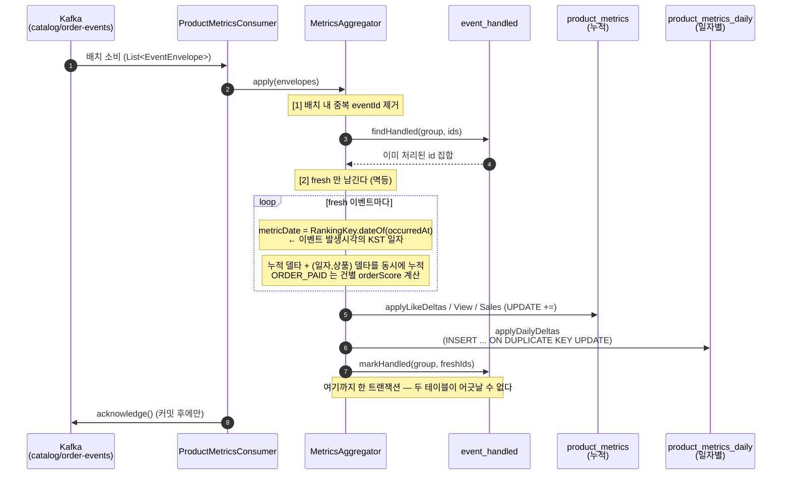
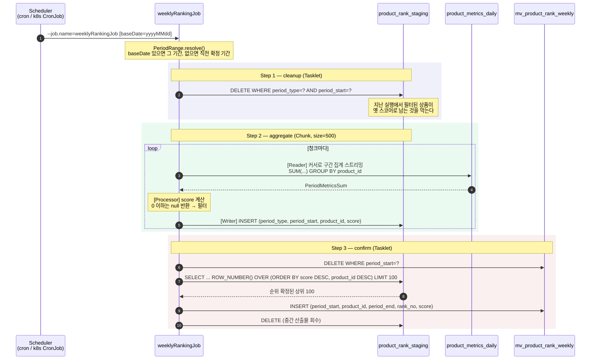
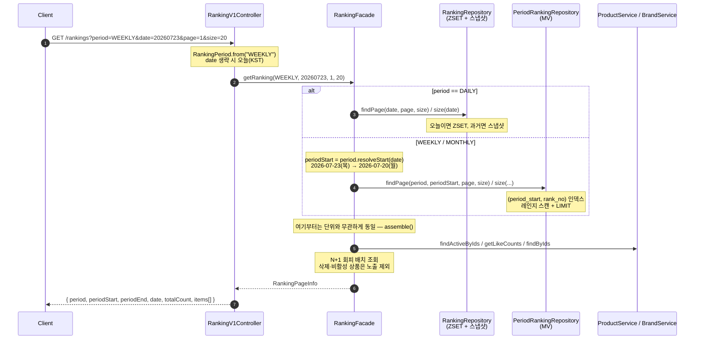

# week10 — 시퀀스 다이어그램

## 1. 적재 — 이벤트 소비 시 일자별 지표 누적

`MetricsAggregator` 가 기존 누적 갱신과 **같은 트랜잭션**에서 일자별 델타를 UPSERT 한다.

**핵심**

- 일자는 **소비 시각이 아니라 이벤트 발생시각**(KST) 기준이다. 소비 시각으로 잡으면 컨슈머 지연이
  자정을 넘길 때 날짜 버킷이 밀린다. 랭킹 ZSET(`RankingKey.dateOf`)과 같은 함수를 재사용해 두 집계를
  대조할 수 있게 한다.
- 행 선생성이 없다. 일자별 행은 그날 첫 이벤트가 와야 존재를 알 수 있어 UPSERT 로 만든다.

## 2. 배치 — 주간/월간 집계 (3-Step)

**왜 Step 을 셋으로 나눴나**

순위는 **전역 정렬**이라 청크 스트리밍 중에는 "지금 이 아이템이 몇 위인지"를 알 수 없다.
Step 2 가 전 상품 스코어를 확정하고(대량 처리 구간), Step 3 이 `ROW_NUMBER()` 한 문장으로 순위를 매긴다.
정렬·순번은 DB 가 가장 잘하는 일이므로 애플리케이션이 전량을 메모리로 올리지 않는다.

## 3. 조회 — 기간별 랭킹 API

**소스 분기는 `period` 하나로 끝난다.** 상품/브랜드/좋아요수를 조합하는 뒷부분은 세 단위가 완전히 같아
`assemble()` 로 공유한다.
