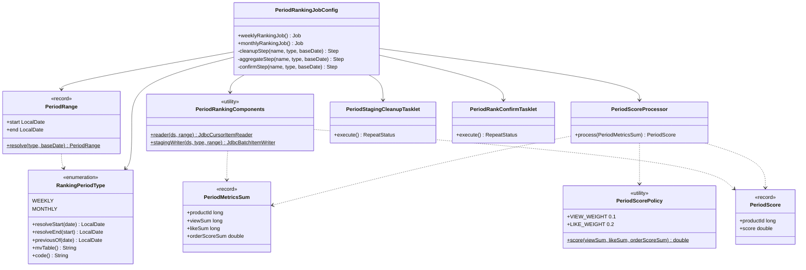
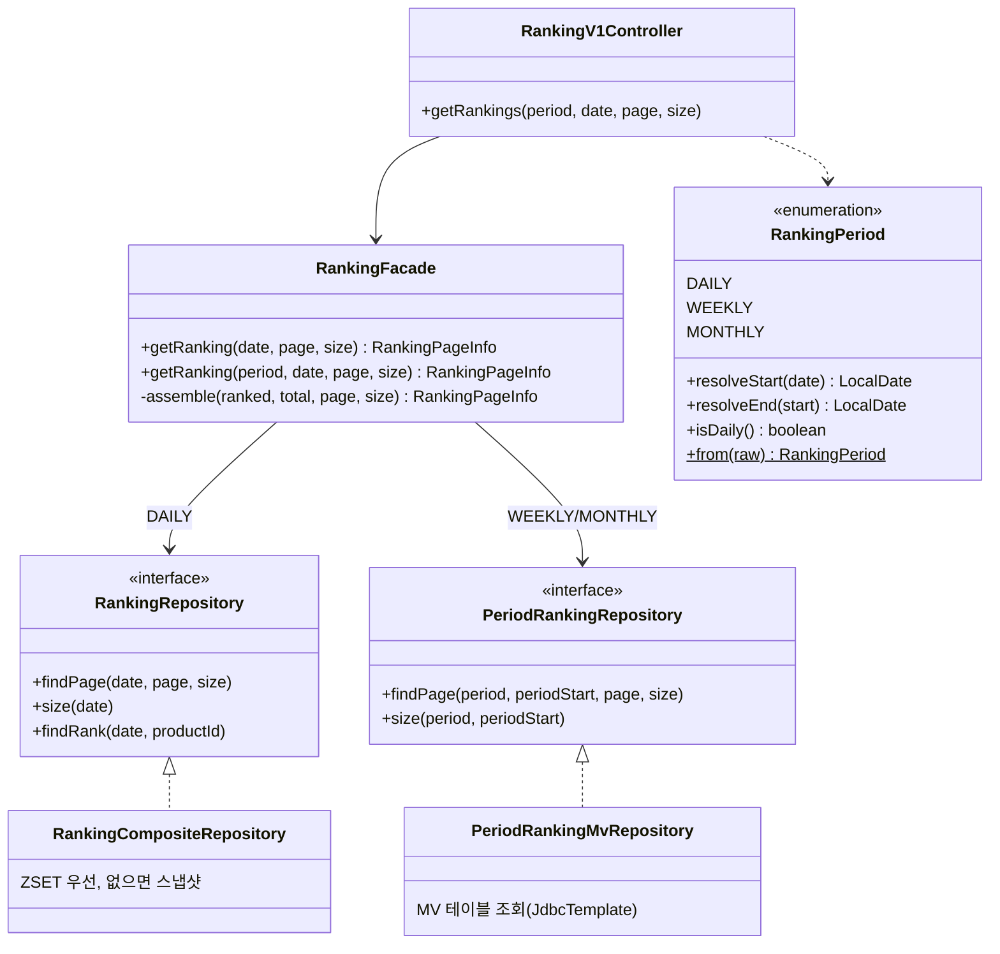
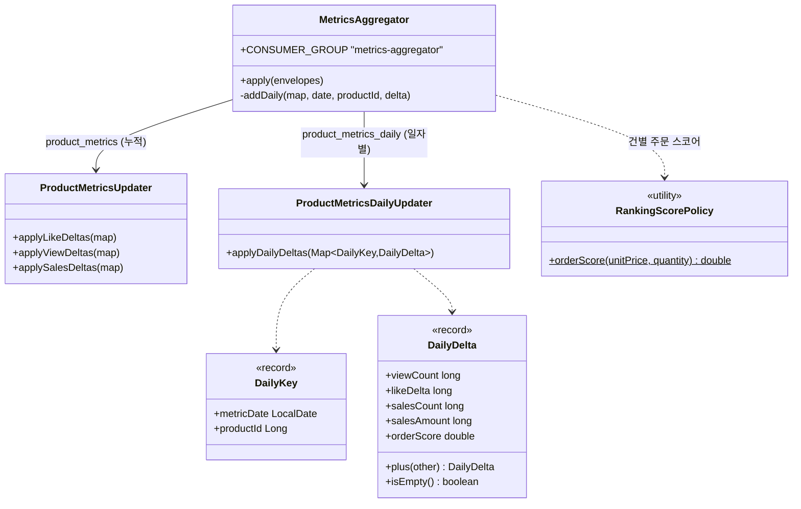

# week10 — 클래스 다이어그램

## 1. commerce-batch — 기간 랭킹 Job

`PeriodRankingComponents` 와 스텝 빌더를 공유해 주간/월간이 **기간 타입만 다른 같은 구조**를 쓴다.
`@JobScope` 바인딩(`#{jobParameters['baseDate']}`)은 각 `@Bean` 이 담당한다.

## 2. commerce-api — 조회 경로

**포트를 나눈 이유**: 일간은 실시간 ZSET(+스냅샷 폴백), 기간은 배치가 확정한 MV 로 **소스도 갱신 주기도 다르다**.
한 포트에 기간 파라미터를 얹으면 일간에만 의미 있는 `findRank`(상품 상세의 실시간 순위)까지 기간 개념을
떠안게 되고 기존 호출부가 전부 바뀐다.

## 3. commerce-streamer — 적재 경로

## 4. 앱 경계에서 복제되는 규칙 (⚠️ 동기화 필요)

앱이 다르면 코드를 공유하지 않고 **규칙만 맞춘다**(`RankingKey` 를 api/streamer 양쪽에 둔 것과 같은 컨벤션).
한쪽만 고치면 조용히 어긋나므로 표로 남긴다.

| 규칙 | commerce-api | commerce-batch | commerce-streamer |
|---|---|---|---|
| 기간 경계(주=월요일 시작) | `RankingPeriod` | `RankingPeriodType` | — |
| 스코어 가중치(0.1 / 0.2) | — | `PeriodScorePolicy` | `RankingScorePolicy` |
| 주문 스코어 `0.6×log10(1+매출)` | — | (order_score 에 반영됨) | `RankingScorePolicy` |
| MV 테이블명 | `PeriodRankingMvRepository` | `RankingPeriodType.mvTable()` | — |

**기간 경계가 어긋나면 조회가 영영 빈 결과**가 되고, **가중치가 어긋나면 일간과 주간이 다른 스케일**이 된다.
