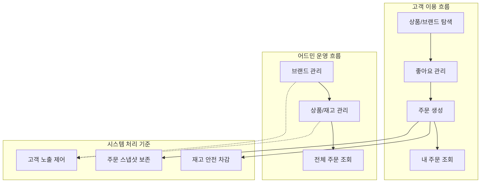
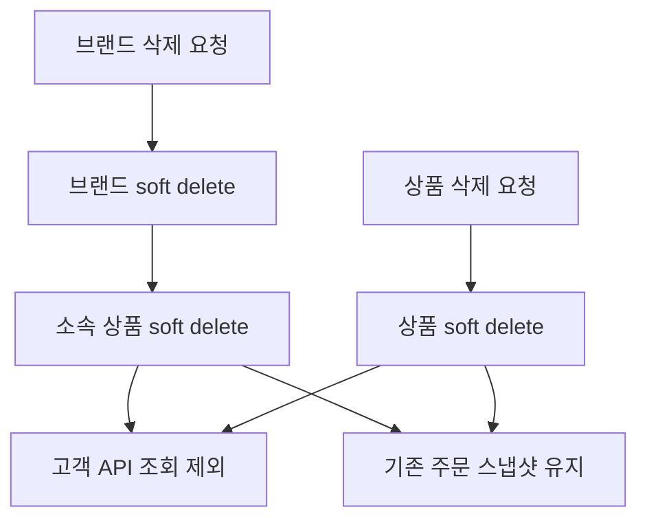
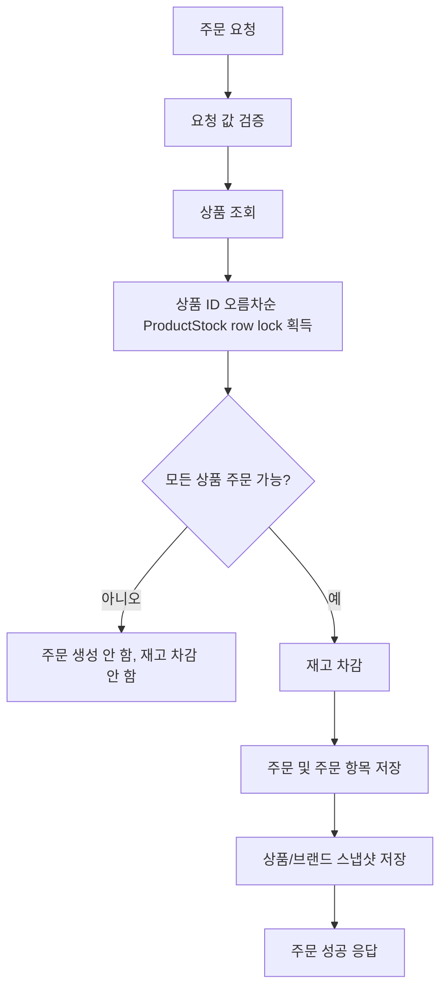

# 감성 이커머스 요구사항 명세

## 1. 한눈에 보는 범위



| 구분 | 이번 범위 | 비고 |
| --- | --- | --- |
| 고객 | 기존 사용자 참조 | 인증된 사용자 식별 결과 사용 |
| 브랜드 | 고객 조회, 어드민 CRUD | 삭제는 소프트 삭제 |
| 상품 | 고객 목록/상세 조회, 어드민 CRUD | 브랜드 소속 필수 |
| 재고 | 상품별 현재 재고 관리, 주문 재고 검증/차감 | `ProductStock`으로 분리, 비관적 락 사용 |
| 좋아요 | 등록, 취소, 내가 좋아요한 상품 목록 | 등록/취소는 멱등 성공 |
| 주문 | 주문 생성, 내 주문 목록/상세, 어드민 주문 조회 | 전체 성공 또는 전체 실패 |

### 1.1 사용자 스토리 요약

| 사용자 | 하고 싶은 일 | 이유 | 연결 도메인 |
| --- | --- | --- | --- |
| 고객 | 브랜드와 상품을 탐색한다 | 원하는 상품을 찾기 위해 | Brand, Product |
| 고객 | 관심 상품에 좋아요를 등록하거나 취소한다 | 선호 상품을 저장하고 관리하기 위해 | Like, Product |
| 고객 | 여러 상품을 한 번에 주문한다 | 구매를 완료하기 위해 | Order, OrderItem, ProductStock |
| 고객 | 내 주문 목록과 상세를 조회한다 | 주문 당시 상품 정보와 금액을 확인하기 위해 | Order, OrderItem |
| 어드민 | 브랜드를 등록, 수정, 삭제한다 | 고객에게 노출할 브랜드를 관리하기 위해 | Brand, Product |
| 어드민 | 상품과 재고를 등록, 수정, 삭제한다 | 판매 가능한 상품과 수량을 관리하기 위해 | Product, ProductStock |
| 어드민 | 전체 주문 목록과 상세를 조회한다 | 운영 관점에서 주문 현황을 확인하기 위해 | Order, OrderItem |

### 1.2 표기 규칙

| 표기 | 의미 |
| --- | --- |
| 고객 API | `/api/v1` prefix를 사용하는 고객 대상 API |
| 어드민 API | `/api-admin/v1` prefix를 사용하는 운영 API |
| 🟦 `GET` | 조회 |
| 🟩 `POST` | 생성 또는 등록 |
| 🟨 `PUT` | 수정 |
| 🟥 `DELETE` | 삭제 또는 취소 |

## 2. 공통 요구사항

### 2.1 API Prefix

| API 유형 | Prefix | 설명 |
| --- | --- | --- |
| 고객 API | `/api/v1` | 일반 사용자에게 제공되는 기능 |
| 어드민 API | `/api-admin/v1` | 운영자가 브랜드, 상품, 주문을 관리하거나 조회하는 기능 |

### 2.2 인증 및 식별

| 대상 | Header | 값 | 적용 범위 |
| --- | --- | --- | --- |
| 고객 | `X-Loopers-LoginId` | 로그인 ID | 로그인 필요한 고객 API |
| 고객 | `X-Loopers-LoginPw` | 비밀번호 | 로그인 필요한 고객 API |
| 어드민 | `X-Loopers-Ldap` | `loopers.admin` | 모든 어드민 API |

- 인증/인가는 주요 구현 스코프가 아니므로 별도 토큰 기반 인증은 도입하지 않는다.
- 고객 API에서 사용자는 타 사용자의 좋아요, 주문에 접근할 수 없다.
- 어드민 API는 `X-Loopers-Ldap: loopers.admin`이 아닌 경우 접근할 수 없다.

### 2.3 응답 형식

- 모든 API 응답은 `ApiResponse<T>` 형식으로 감싼다.
- 성공 응답은 `meta.result`를 성공 상태로 내려준다.
- 실패 응답은 `meta.errorCode`, `meta.message`를 포함한다.
- 비밀번호 원문과 비밀번호 해시는 어떤 응답에도 포함하지 않는다.

### 2.4 페이징 응답

목록 API는 `Page` 구조를 `ApiResponse.data`에 담아 반환한다.

| 필드 | 설명 |
| --- | --- |
| `content` | 현재 페이지의 데이터 목록 |
| `totalElements` | 전체 데이터 수 |
| `totalPages` | 전체 페이지 수 |
| `number` | 현재 페이지 번호 |
| `size` | 페이지 크기 |
| `first` | 첫 페이지 여부 |
| `last` | 마지막 페이지 여부 |

- 기본 페이지 번호는 `0`이다.
- 기본 페이지 크기는 `20`이다.
- 페이지 응답은 고객 상품 목록, 좋아요 목록, 고객 주문 목록, 어드민 브랜드 목록, 어드민 상품 목록, 어드민 주문 목록에 적용한다.

### 2.5 에러 정책

| 상황 | HTTP Status | 예시 |
| --- | --- | --- |
| 요청 값이 유효하지 않음 | `400 Bad Request` | 수량 0, 음수 가격, 빈 상품명 |
| 인증 실패 | `401 Unauthorized` | 고객 헤더 누락, 비밀번호 불일치 |
| 권한 없는 리소스 접근 | `403 Forbidden` | 다른 유저의 좋아요/주문 조회 |
| 리소스를 찾을 수 없음 | `404 Not Found` | 존재하지 않는 상품, 주문, 브랜드 |
| 리소스 현재 상태와 충돌 | `409 Conflict` | 주문 수량보다 재고가 부족함 |
| 서버 예외 | `500 Internal Server Error` | 처리되지 않은 예외 |

### 2.6 삭제 정책



- 브랜드와 상품은 물리 삭제하지 않고 `deletedAt`을 설정하는 방식으로 삭제한다.
- 좋아요는 현재 좋아요 상태를 표현하는 토글 데이터이므로 취소 시 hard delete한다.
- 고객 API에서는 삭제된 브랜드와 상품을 조회할 수 없다.
- 브랜드 삭제 시 해당 브랜드의 상품도 함께 소프트 삭제한다.
- 주문 항목에는 원본 `brandId`, `productId`를 남긴다.
- 주문 항목에는 주문 당시의 브랜드명, 상품명, 가격 등 스냅샷 정보를 함께 저장한다.
- 브랜드나 상품이 이후 수정 또는 삭제되어도 기존 주문 상세는 주문 당시 정보를 유지한다.

## 3. 유저 전제

- 회원가입, 내 정보 조회, 비밀번호 변경 API는 기존 구현을 전제로 한다.
- 이번 명세의 좋아요와 주문 기능은 기존 사용자 식별 결과를 사용한다.
- 고객 인증이 필요한 API에서는 `X-Loopers-LoginId`, `X-Loopers-LoginPw` 헤더로 인증된 사용자만 자신의 리소스에 접근할 수 있다.

## 4. 브랜드 요구사항

> 도메인 책임: 브랜드 기본 정보를 관리하고, 브랜드 삭제 시 소속 상품의 고객 노출을 함께 차단한다.  
> API 대상: 고객 API, 어드민 API

### 4.1 API

#### 고객 API (`/api/v1`)

| Method | URI | 인증 | 설명 |
| --- | --- | --- | --- |
| 🟦 `GET` | `/api/v1/brands/{brandId}` | 없음 | 브랜드 상세 조회 |

#### 어드민 API (`/api-admin/v1`)

| Method | URI | 인증 | 설명 |
| --- | --- | --- | --- |
| 🟦 `GET` | `/api-admin/v1/brands?page=0&size=20` | 어드민 | 브랜드 목록 조회 |
| 🟦 `GET` | `/api-admin/v1/brands/{brandId}` | 어드민 | 브랜드 상세 조회 |
| 🟩 `POST` | `/api-admin/v1/brands` | 어드민 | 브랜드 등록 |
| 🟨 `PUT` | `/api-admin/v1/brands/{brandId}` | 어드민 | 브랜드 정보 수정 |
| 🟥 `DELETE` | `/api-admin/v1/brands/{brandId}` | 어드민 | 브랜드 삭제 |

### 4.2 브랜드 데이터

| 필드 | 요구사항 |
| --- | --- |
| `id` | 브랜드 식별자 |
| `name` | 브랜드명, 비어 있을 수 없음 |
| `description` | 브랜드 소개 또는 설명 |
| `createdAt` | 생성 시각 |
| `updatedAt` | 수정 시각 |
| `deletedAt` | 삭제 시각, 미삭제 상태에서는 `null` |

### 4.3 고객 브랜드 조회

- 고객은 미삭제 브랜드만 조회할 수 있다.
- 존재하지 않거나 삭제된 브랜드는 `404 Not Found`로 처리한다.

### 4.4 어드민 브랜드 관리

- 어드민은 브랜드를 등록, 조회, 수정, 삭제할 수 있다.
- 브랜드 삭제 시 브랜드는 소프트 삭제된다.
- 브랜드 삭제 시 해당 브랜드에 속한 상품도 함께 소프트 삭제된다.
- 삭제된 브랜드의 상품은 고객 상품 목록과 상세에서 제외된다.

## 5. 상품 요구사항

> 도메인 책임: 브랜드에 소속된 상품 기본 정보를 관리하고, 상품별 현재 재고는 별도 재고 도메인에서 관리한다.  
> API 대상: 고객 API, 어드민 API

### 5.1 API

#### 고객 API (`/api/v1`)

| Method | URI | 인증 | 설명 |
| --- | --- | --- | --- |
| 🟦 `GET` | `/api/v1/products` | 없음 | 상품 목록 조회 |
| 🟦 `GET` | `/api/v1/products/{productId}` | 없음 | 상품 상세 조회 |

#### 어드민 API (`/api-admin/v1`)

| Method | URI | 인증 | 설명 |
| --- | --- | --- | --- |
| 🟦 `GET` | `/api-admin/v1/products?page=0&size=20&brandId={brandId}` | 어드민 | 상품 목록 조회 |
| 🟦 `GET` | `/api-admin/v1/products/{productId}` | 어드민 | 상품 상세 조회 |
| 🟩 `POST` | `/api-admin/v1/products` | 어드민 | 상품 등록 |
| 🟨 `PUT` | `/api-admin/v1/products/{productId}` | 어드민 | 상품 정보 수정 |
| 🟥 `DELETE` | `/api-admin/v1/products/{productId}` | 어드민 | 상품 삭제 |

### 5.2 상품 데이터

| 필드 | 요구사항 |
| --- | --- |
| `id` | 상품 식별자 |
| `brandId` | 소속 브랜드 식별자 |
| `name` | 상품명, 비어 있을 수 없음 |
| `description` | 상품 설명, 비어 있을 수 없음 |
| `price` | 상품 가격, 0 이상 |
| `createdAt` | 생성 시각 |
| `updatedAt` | 수정 시각 |
| `deletedAt` | 삭제 시각, 미삭제 상태에서는 `null` |

### 5.3 고객 상품 목록 조회

| Query Parameter | 기본값 | 설명 |
| --- | --- | --- |
| `brandId` | 없음 | 특정 브랜드 상품만 조회 |
| `sort` | `latest` | 정렬 기준 |
| `page` | `0` | 페이지 번호 |
| `size` | `20` | 페이지당 상품 수 |

| Sort | 요구사항 |
| --- | --- |
| `latest` | 최신 등록순, 필수 구현 |

- 고객 상품 목록에서는 삭제된 상품을 제외한다.
- 삭제된 브랜드에 속한 상품도 고객 상품 목록에서 제외한다.
- 존재하지 않거나 삭제된 `brandId`로 필터링하면 빈 목록을 반환한다.

### 5.4 고객 상품 상세 조회

- 고객은 미삭제 상품만 조회할 수 있다.
- 삭제된 브랜드에 속한 상품은 조회할 수 없다.
- 존재하지 않거나 삭제된 상품은 `404 Not Found`로 처리한다.

### 5.5 어드민 상품 관리

- 상품 등록 시 브랜드는 이미 등록된 미삭제 브랜드여야 한다.
- 상품 등록 요청에는 초기 재고 수량이 포함되며, 현재 재고 수량은 재고 도메인에서 관리한다.
- 상품 수정 시 상품의 브랜드는 변경할 수 없다.
- 상품 삭제 시 상품은 소프트 삭제된다.
- 상품 가격은 음수가 될 수 없다.

## 6. 재고 요구사항

> 도메인 책임: 상품별 현재 재고 수량을 관리하고, 주문 생성 시 재고 검증/차감을 동시성 안전하게 처리한다.  
> API 대상: 단독 재고 API는 이번 범위에 추가하지 않고, 어드민 상품 등록/수정과 주문 생성 흐름에서 사용한다.

### 6.1 API 연결

| 연결 흐름 | 재고 도메인 역할 |
| --- | --- |
| 🟩 `POST /api-admin/v1/products` | 상품 등록 시 초기 재고 수량으로 `ProductStock` 생성 |
| 🟨 `PUT /api-admin/v1/products/{productId}` | 재고 값이 포함되면 `ProductStock.quantity` 수정 |
| 🟩 `POST /api/v1/orders` | 주문 수량만큼 재고 검증 후 차감 |

### 6.2 재고 데이터

상품 재고는 상품 기본 정보와 분리해 `ProductStock`으로 관리한다.

| 필드 | 요구사항 |
| --- | --- |
| `id` | 상품 재고 식별자 |
| `productId` | 재고를 관리할 상품 식별자 |
| `quantity` | 현재 재고 수량, 0 이상 |
| `createdAt` | 생성 시각 |
| `updatedAt` | 수정 시각 |

### 6.3 재고 관리 규칙

- 상품 등록 시 초기 재고 수량을 받아 `ProductStock`을 함께 생성한다.
- 현재 재고 수량은 `ProductStock.quantity`로 관리한다.
- 현재 재고 수량은 음수가 될 수 없다.
- 주문 생성 시 재고 검증과 차감은 `ProductStock`을 기준으로 수행한다.
- 주문 생성 시 `ProductStock` row에 비관적 락을 획득한 뒤 재고를 검증하고 차감한다.
- 여러 상품을 한 번에 주문할 때는 `productId` 오름차순으로 `ProductStock` row lock을 획득한다.

## 7. 좋아요 요구사항

> 도메인 책임: 사용자가 선호 상품을 표시하고, 좋아요 등록/취소의 최종 상태를 멱등하게 보장한다.  
> API 대상: 고객 API

### 7.1 API

#### 고객 API (`/api/v1`)

| Method | URI | 인증 필요 | 설명 |
| --- | --- | --- | --- |
| 🟩 `POST` | `/api/v1/products/{productId}/likes` | 예 | 상품 좋아요 등록 |
| 🟥 `DELETE` | `/api/v1/products/{productId}/likes` | 예 | 상품 좋아요 취소 |
| 🟦 `GET` | `/api/v1/users/{userId}/likes` | 예 | 내가 좋아요한 상품 목록 조회 |

### 7.2 좋아요 등록

- 인증된 사용자는 미삭제 상품에 좋아요를 등록할 수 있다.
- 존재하지 않거나 삭제된 상품에는 좋아요를 등록할 수 없다.
- 동일 사용자가 동일 상품에 좋아요를 중복 등록해도 성공으로 응답한다.
- 중복 등록 요청은 데이터를 추가로 변경하지 않는다.

### 7.3 좋아요 취소

- 인증된 사용자는 자신이 등록한 좋아요를 취소할 수 있다.
- 좋아요하지 않은 상품에 대해 취소 요청을 보내도 성공으로 응답한다.
- 이미 취소된 상태의 요청은 데이터를 추가로 변경하지 않는다.
- 좋아요 취소 시 좋아요 row를 hard delete한다.

### 7.4 좋아요 목록 조회

- 인증된 사용자는 자신이 좋아요한 상품 목록만 조회할 수 있다.
- URI의 `{userId}`는 인증된 사용자 ID와 같아야 한다.
- `{userId}`가 인증된 사용자 ID와 다르면 `403 Forbidden`으로 처리한다.
- 좋아요 목록에서는 삭제된 상품을 제외한다.

### 7.5 멱등 정책

| 요청 | 현재 상태 | 결과 |
| --- | --- | --- |
| 좋아요 등록 | 좋아요 없음 | 좋아요 생성 후 성공 |
| 좋아요 등록 | 이미 좋아요 있음 | 변경 없이 성공 |
| 좋아요 취소 | 좋아요 있음 | 좋아요 제거 후 성공 |
| 좋아요 취소 | 좋아요 없음 | 변경 없이 성공 |

## 8. 주문 요구사항

> 도메인 책임: 여러 상품을 한 번에 주문하고, 재고 차감과 주문 당시 상품 정보를 스냅샷으로 보존한다.  
> API 대상: 고객 API, 어드민 API

### 8.1 API

#### 고객 API (`/api/v1`)

| Method | URI | 인증 | 설명 |
| --- | --- | --- | --- |
| 🟩 `POST` | `/api/v1/orders` | 고객 | 주문 요청 |
| 🟦 `GET` | `/api/v1/orders?startAt=2026-01-31&endAt=2026-02-10` | 고객 | 내 주문 목록 조회 |
| 🟦 `GET` | `/api/v1/orders/{orderId}` | 고객 | 내 단일 주문 상세 조회 |

#### 어드민 API (`/api-admin/v1`)

| Method | URI | 인증 | 설명 |
| --- | --- | --- | --- |
| 🟦 `GET` | `/api-admin/v1/orders?page=0&size=20` | 어드민 | 전체 주문 목록 조회 |
| 🟦 `GET` | `/api-admin/v1/orders/{orderId}` | 어드민 | 단일 주문 상세 조회 |

### 8.2 주문 요청

```json
{
  "items": [
    { "productId": 1, "quantity": 2 },
    { "productId": 3, "quantity": 1 }
  ]
}
```

| 항목 | 요구사항 |
| --- | --- |
| `items` | 1개 이상이어야 함 |
| `items[].productId` | 존재하는 미삭제 상품 ID |
| `items[].quantity` | 1 이상 |
| 동일 `productId` 중복 | 허용하지 않으며 `400 Bad Request`로 처리 |

### 8.3 주문 생성 규칙



- 주문은 전체 성공 또는 전체 실패로 처리한다.
- 주문 요청 내 동일한 `productId`가 2개 이상 포함되면 `400 Bad Request`로 처리한다.
- 하나의 항목이라도 실패하면 주문을 생성하지 않는다.
- 하나의 항목이라도 실패하면 어떤 상품의 재고도 차감하지 않는다.
- 존재하지 않는 상품은 주문할 수 없다.
- 삭제된 상품은 주문할 수 없다.
- 삭제된 브랜드에 속한 상품은 주문할 수 없다.
- `ProductStock.quantity`가 주문 수량보다 부족하면 `409 Conflict`로 처리한다.
- 주문 성공 시 각 상품의 `ProductStock.quantity`를 주문 수량만큼 차감한다.

### 8.4 재고 차감 동시성 정책

주문 생성은 동시 주문 상황에서도 재고가 음수가 되거나 초과 판매되지 않도록 비관적 락을 사용한다.

| 항목 | 정책 |
| --- | --- |
| 트랜잭션 경계 | 주문 요청 검증, 상품 조회, 재고 조회, 재고 차감, 주문 저장을 하나의 트랜잭션에서 처리한다 |
| 락 대상 | 주문에 포함된 모든 상품의 `ProductStock` row |
| 락 방식 | 비관적 락을 사용한다 |
| 락 획득 순서 | 주문 요청의 입력 순서와 무관하게 `productId` 오름차순으로 락을 획득한다 |
| 재고 검증 시점 | 락을 획득한 이후 현재 재고를 기준으로 검증한다 |
| 실패 처리 | 하나라도 주문 불가하면 전체 트랜잭션을 롤백한다 |

- `productId` 오름차순 `ProductStock` 락 획득은 여러 상품 주문에서 데드락 가능성을 줄이기 위한 내부 처리 규칙이다.
- 재고 확인과 재고 차감은 `ProductStock` 락을 잡은 상태에서 수행한다.
- 주문 스냅샷은 재고 차감과 같은 트랜잭션에서 저장한다.
- 주문 생성이 `ProductStock` row lock을 먼저 획득하면 주문은 락 시점의 재고를 기준으로 차감과 스냅샷 저장을 완료한다.
- 어드민 재고 수정은 주문 트랜잭션이 종료된 뒤 진행된다.
- 어드민 상품 삭제가 먼저 커밋된 경우 이후 주문 요청은 삭제된 상품으로 판단해 실패한다.
- 이 정책은 이번 범위의 기본 동시성 보장이다.

### 8.5 주문 스냅샷

주문 항목에는 원본 식별자와 주문 당시 표시 정보를 함께 저장한다.

| 필드 | 요구사항 |
| --- | --- |
| `brandId` | 주문 당시 상품의 브랜드 ID |
| `brandName` | 주문 당시 브랜드명 |
| `productId` | 주문한 상품 ID |
| `productName` | 주문 당시 상품명 |
| `unitPrice` | 주문 당시 상품 단가 |
| `quantity` | 주문 수량 |
| `totalPrice` | 주문 항목 총 금액. `unitPrice * quantity` |

- 상품명, 브랜드명, 가격이 이후 수정되어도 주문 상세에는 주문 당시 값이 표시된다.
- 상품이나 브랜드가 이후 삭제되어도 기존 주문 상세는 유지된다.
- 주문 전체 금액은 `orderTotalPrice`로 표현하며, 모든 주문 항목 `totalPrice`의 합이다.

### 8.6 내 주문 조회

- 인증된 사용자는 자신의 주문 목록을 조회할 수 있다.
- `startAt`, `endAt`이 있으면 해당 기간의 주문만 조회한다.
- 다른 사용자의 주문은 조회할 수 없다.
- 다른 사용자의 주문 상세 접근은 `403 Forbidden`으로 처리한다.

### 8.7 어드민 주문 조회

- 어드민은 전체 주문 목록을 조회할 수 있다.
- 어드민은 특정 주문의 상세를 조회할 수 있다.
- 어드민 주문 조회는 주문 스냅샷 정보를 기준으로 응답한다.

## 9. 도메인별 핵심 불변식

| 도메인 | 불변식 |
| --- | --- |
| User | 기존 구현된 사용자 식별 결과를 좋아요와 주문에서 사용한다 |
| Brand | 삭제된 브랜드는 고객 API에 노출하지 않는다 |
| Brand | 브랜드 삭제 시 소속 상품도 함께 삭제 처리한다 |
| Product | 상품은 미삭제 브랜드에 속해야 한다 |
| Product | 가격은 0 이상이다 |
| ProductStock | 현재 재고 수량은 0 이상이다 |
| Like | 사용자와 상품 조합은 논리적으로 하나만 존재한다 |
| Like | 등록과 취소는 멱등 성공 처리한다 |
| Like | 좋아요 취소 시 hard delete한다 |
| Order | 주문은 전체 성공 또는 전체 실패이다 |
| Order | 주문 성공 시 재고 차감과 주문 저장은 함께 완료되어야 한다 |
| Order | 주문 대상 상품의 `ProductStock`은 `productId` 오름차순으로 비관적 락을 획득한 뒤 재고를 검증한다 |
| Order | 주문이 `ProductStock` row lock을 먼저 획득하면 해당 락 시점의 재고로 차감과 스냅샷 저장을 완료한다 |
| OrderItem | 주문 당시 상품/브랜드 정보를 스냅샷으로 보존한다 |
