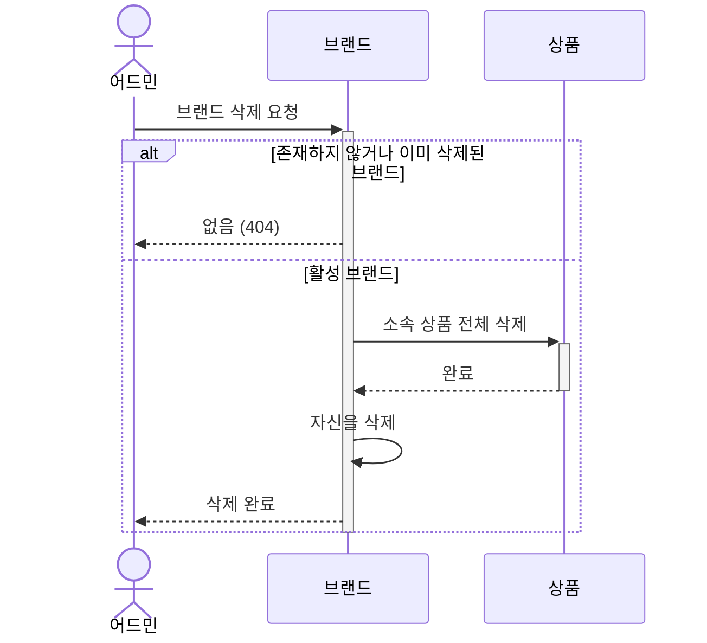
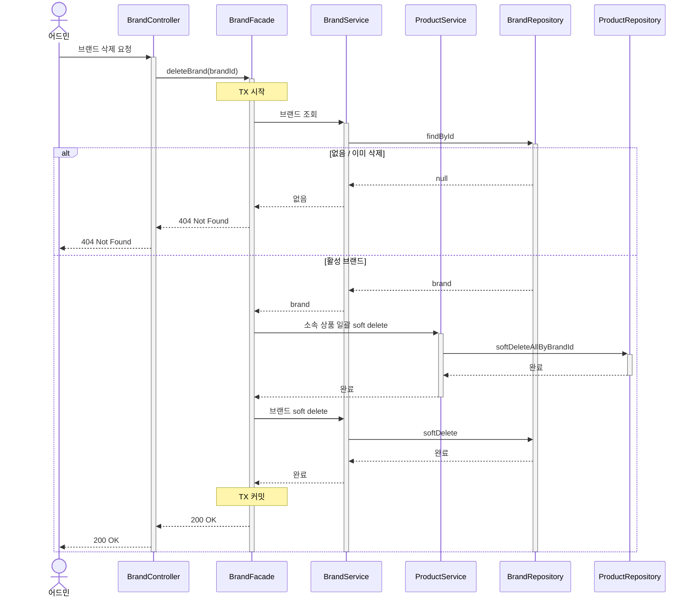
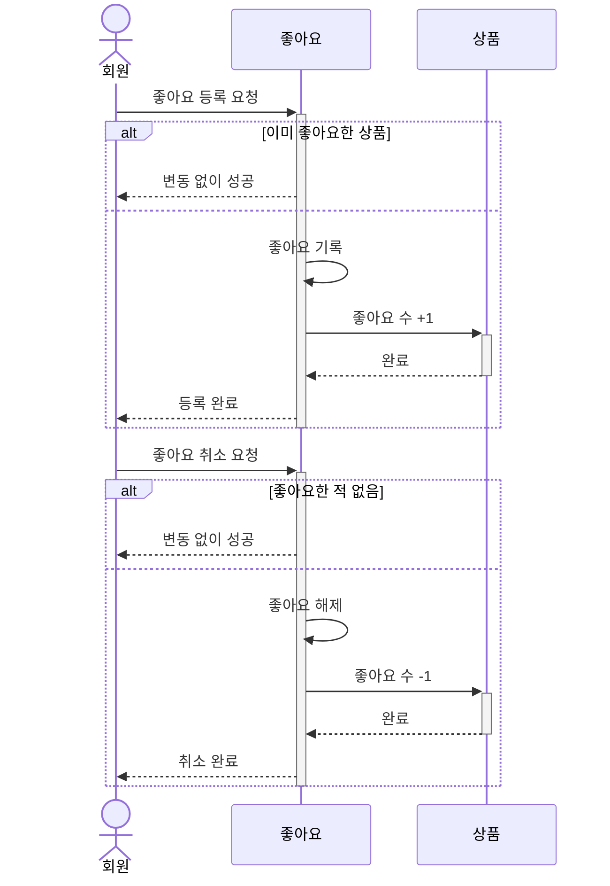
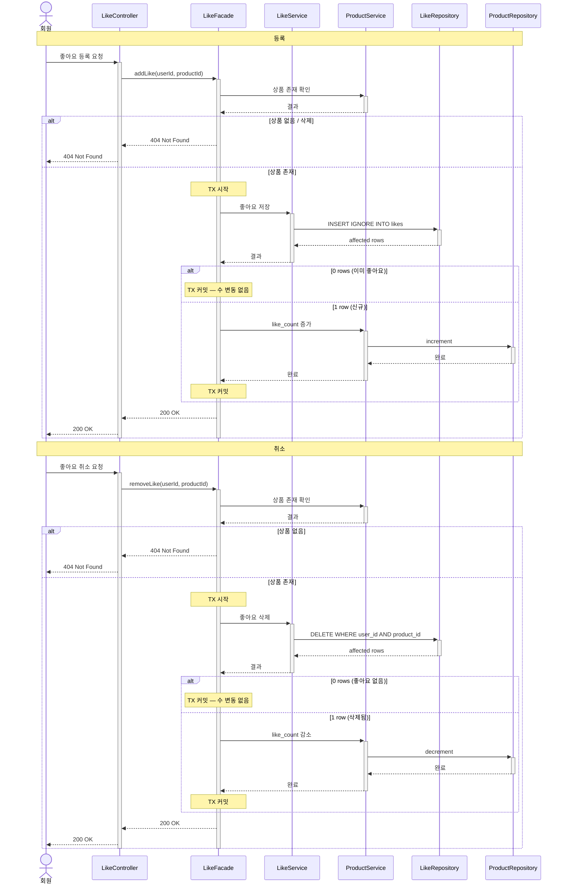
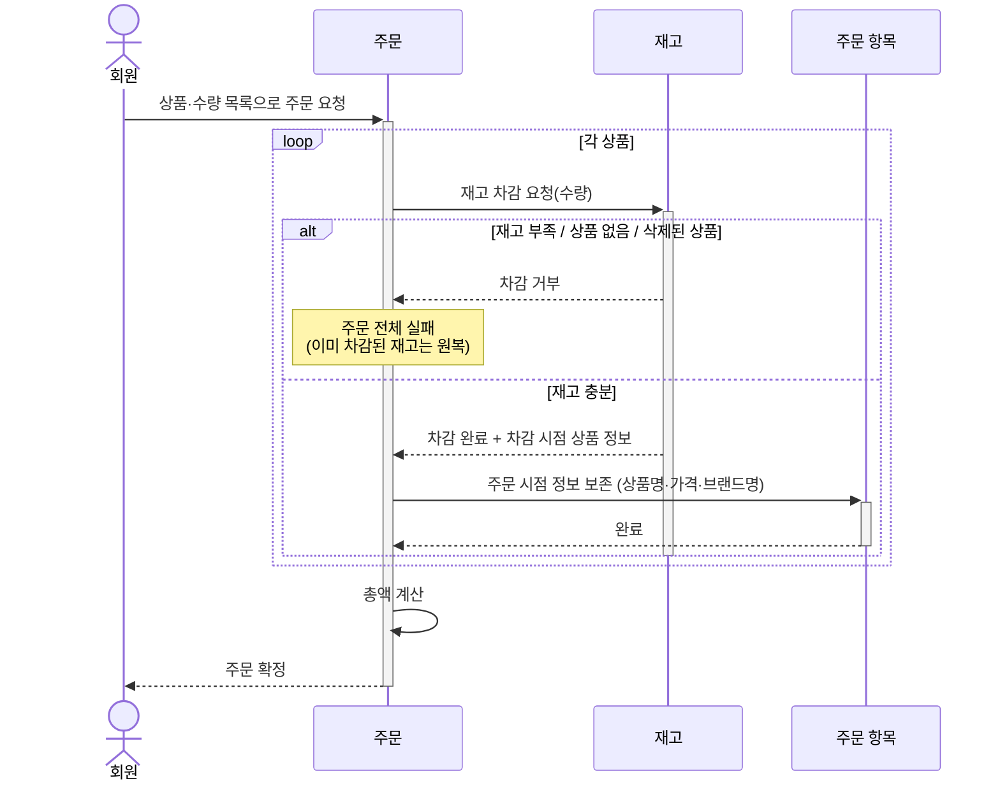
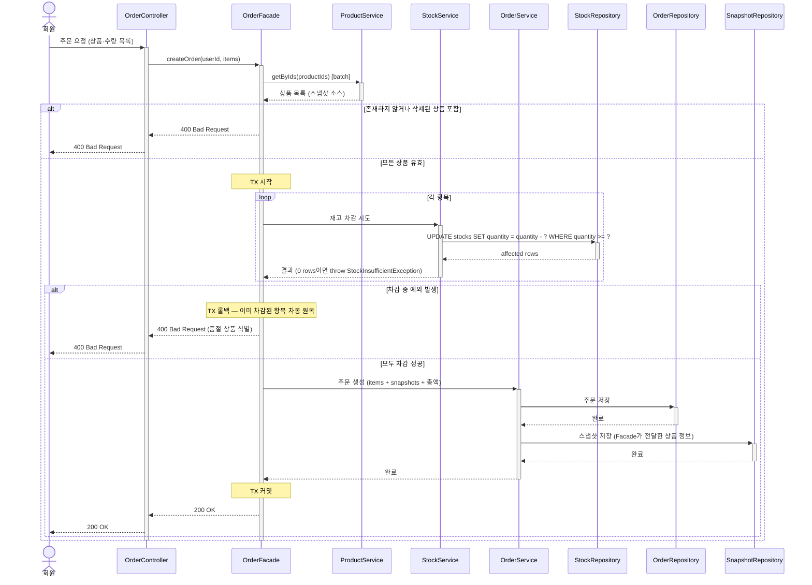

# 시퀀스 다이어그램

비자명한 결정이 있는 흐름만 골라, **도메인 협력**과 **구현 결정** 두 관점으로 그린다.

- **도메인 협력**: 누가 무엇을 책임지는가. 도메인 객체 어휘만 쓴다.
- **구현 결정**: 트랜잭션 경계와 레이어 흐름. 채택한 방식과 버린 대안을 함께 기록한다.

---

## 그릴 대상

| 흐름 | 이유 |
|---|---|
| 브랜드 삭제 | 연쇄 효과 + 멱등성 정책 |
| 좋아요 토글 | 멱등성 보장 위치 + like_count 갱신 주체 |
| 주문 생성 | 부분 주문 + 재고 분리 + 스냅샷 — 결정이 가장 많은 흐름 |

### 그리지 않은 흐름

| 흐름 | 이유 |
|---|---|
| 브랜드/상품 조회 · 등록 · 수정 | 단일 객체 CRUD, 화살표 방향이 자명 |
| 내 좋아요 목록 조회 | 권한 확인(403) 외에 객체 간 협력 없음 |
| 주문 조회 (회원 · 어드민) | 권한 분기 외 협력 없음 |
| 상품 삭제 | 단일 객체 soft delete, cascade 없음 |

---

## 1. 브랜드 삭제

### 도메인 협력

**왜 이 흐름인가**  
브랜드 삭제는 소속 상품 삭제를 연쇄 트리거한다. "브랜드 없는 상품은 없다"는 불변식의 주인이 누구인지, 그리고 이미 삭제된 브랜드에 재삭제 요청이 오면 어떻게 볼 것인지 결정해야 한다.

**읽는 포인트**
- "브랜드 없는 상품" 불변식은 *브랜드*가 소유한다 — 브랜드가 직접 상품 삭제를 트리거하는 이유.
- 이미 삭제된 브랜드 재삭제는 **404**로 처리한다. 어드민 도구에서 존재하지 않는 리소스 조작 시도는 오류로 알려주는 것이 맞다고 판단했다. (참고: 멱등 성공으로 처리하는 방식도 있으나 요구사항에 명시된 정책을 따른다.)

### 구현 결정

**검증할 결정**  
Brand + Product 두 애그리거트를 한 TX 안에서 삭제한다. "한 TX = 한 애그리거트" 원칙의 의도적 예외다.

**결정과 대안**
- **단일 TX 채택** — 상품 삭제 후 브랜드 삭제 실패 시 "상품 없는 활성 브랜드"가 남는 상황을 방지한다. 부분 실패가 아예 없다.  
  Brand와 Product를 각각 독립 Aggregate로 분리했지만 단일 TX로 묶은 이유는, 현재 **모노리스 단일 서비스** 내에서 동작하므로 같은 TX 경계가 현실적으로 가능하기 때문이다. 이 흐름이 자연스럽다면 Brand+Product를 하나의 Catalog BC로 묶는 것도 일관된 선택이 될 수 있다.  
  향후 서비스를 분리할 경우, 단일 TX는 불가능해지므로 "브랜드 삭제 이벤트 발행 → 상품 삭제 핸들러" 방식으로 전환이 필요하다.
- 대안: 브랜드 삭제 이벤트 발행 → 상품 삭제 핸들러로 분리. TX 부담은 줄지만 어드민 응답 시점에 상품이 아직 삭제되지 않은 상태가 노출될 수 있다. 어드민 직후 재조회 시 불일치가 보여 채택하지 않았다.

---

## 2. 좋아요 토글 (등록 · 취소)

### 도메인 협력

**왜 이 흐름인가**  
"한 회원 - 한 상품 = 좋아요 1개" 불변식을 누가 지키는지, like_count를 *좋아요*가 계산할지 *상품*이 직접 소유할지 결정해야 한다.

**읽는 포인트**
- 중복 방지 불변식의 주인은 *좋아요* — 상품은 자기 재고나 가격을 신경 쓰고, 중복 좋아요 여부는 모른다.
- like_count 갱신 주인은 *상품* — 자신의 인기 수치를 외부 집계에 맡기지 않는다.
- 등록/취소 모두 멱등: 이미 원하는 상태라면 그냥 성공 반환.

### 구현 결정

**검증할 결정**  
상품 존재 검증 위치, 멱등성 보장 메커니즘, like_count 갱신 책임, TX 경계.

**결정과 대안**
- **상품 존재 검증은 Facade가 사전 조회** — 명시적이고 흐름이 다이어그램에 드러난다.  
  대안: likes 테이블에 product_id FK를 걸고 FK 위반 예외를 404로 매핑 — DB가 보장하지만 검증 흐름이 코드에 숨겨져 가독성이 떨어진다.
- **멱등성은 MySQL `INSERT IGNORE`로 보장** — unique 충돌 시 예외 없이 0 row를 반환하므로 affected rows로 신규/중복을 분기한다. 예외 catch보다 코드가 단순하고 race condition도 없다.  
  대안 1: `save` 후 DataIntegrityViolationException catch — Spring/JPA에선 일반적이나 정상 흐름에 예외를 사용하는 패턴이 됨.  
  대안 2: exists 사전 조회 — 동시 요청에서 둘 다 false를 읽고 둘 다 저장 시도하는 race condition.
- **like_count 비정규화 컬럼 채택** — 상품 테이블에 카운터를 두고 등록/취소 시 같은 TX에서 갱신한다.  
  근거는 워크로드 특성: 이커머스에서 *상품 상세 조회·인기순 정렬*은 매우 빈번한 read인 반면 *좋아요 등록·취소*는 그보다 훨씬 적은 write다. 읽기가 압도적으로 많은 환경에서 매 조회마다 `COUNT(*)` 집계는 낭비이므로, 갱신 시 한 번 계산해두는 비정규화가 유리하다.  
  대안: likes 테이블 `COUNT(*)` 집계 — 정합 고민이 사라지고 카운터 갱신 경합이 없어 *write-heavy* 환경(라이브 스트리밍 좋아요 등 등록/취소가 조회보다 많은 서비스)에 적합하지만, 우리 워크로드와 반대다.

---

## 3. 주문 생성

### 도메인 협력

**왜 이 흐름인가**  
올-오어-낫싱 정책, 재고 분리, 스냅샷 책임 — 세 가지 비자명한 결정이 한 흐름에 묶여 있다. 특히 "하나라도 품절이면 전체 실패"는 트랜잭션 롤백으로 이미 차감된 재고를 어떻게 복구하는지가 핵심이다.

**읽는 포인트**
- 재고 차감 권한은 *재고* — 상품 정보와 재고를 분리해 상품 수정과 재고 차감이 서로 블로킹되지 않는다.
- 올-오어-낫싱: 하나라도 차감 거부되면 주문 전체가 실패하고, 이미 차감된 재고는 원복된다. B2C에서 사용자 동의 없이 결제 금액이 바뀌어서는 안 되기 때문이다.
- 스냅샷 주인은 *주문 항목* — 이후 상품 가격·이름 변경과 완전히 격리된다.

### 구현 결정

**검증할 결정**  
상품 유효성 검증과 스냅샷 소스 확보 위치, 원자적 재고 차감 방식, 차감 실패 신호 방식, TX 경계.

**결정과 대안**
- **상품 유효성 검증 + 스냅샷 소스는 Facade가 batch 조회** — `ProductService.getByIds(productIds)` 한 번 호출로 존재 검증과 스냅샷 소스를 동시에 확보한다. StockService 책임을 재고에만 한정하면서 추가 조회 횟수도 발생하지 않는다.  
  이 사전 조회는 **빠른 실패(UX 가드)** 용도다. 조회 직후 상품이 삭제될 수 있으므로 강한 불변식 보장이 아니며, 실제 일관성은 재고 차감 쿼리(`WHERE quantity >= ?`)가 최종 보장한다.  
  대안 1: StockService 차감 응답에 상품 정보 포함 — 조회를 가장 적게 하지만 StockService 책임이 비대해진다.  
  대안 2: OrderService가 스냅샷 시점에 별도 조회 — 책임은 깔끔하지만 같은 TX 안에서 N+N 쿼리가 발생한다.
- **재고 차감 실패는 Exception으로 신호** — `StockInsufficientException`을 던져 TX 자동 롤백을 트리거한다. 이미 차감된 항목도 함께 원복되므로 수동 보상 로직이 필요 없다.  
  대안: `StockResult.failed()` 결과 객체 반환 → Facade가 명시적 롤백 트리거. 흐름이 명시적이지만 코드가 장황하고 의도 전달이 약해진다.
- **원자적 재고 차감 채택** — UPDATE 문에 `WHERE quantity >= ?` 조건을 포함해 영향 행이 0이면 실패로 처리. SELECT 후 UPDATE는 동시 요청 시 두 요청이 모두 재고 있음을 읽고 둘 다 차감해 음수가 될 수 있다.  
  대안 1: 비관적 락(SELECT FOR UPDATE) — 직관적이나 다항목 주문에서 락 순서 차이로 데드락 가능. 재고 테이블 분리 이유(블로킹 분리)와도 상충.  
  대안 2: 낙관적 락(version) + 재시도 — 경합이 적을 때 유리하나 핫상품에서 재시도 폭증. 현 범위에서 과설계.

---

## 참고

- [01-requirements.md](./01-requirements.md) — 도메인 정책, 유스케이스 본문, 비기능 요구사항
