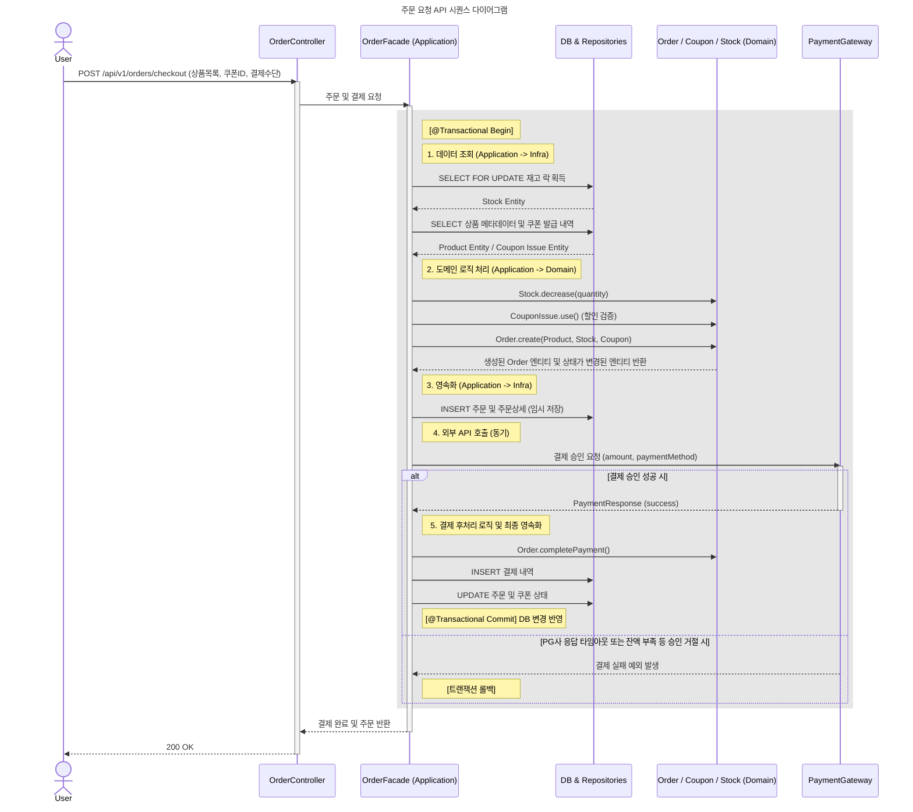
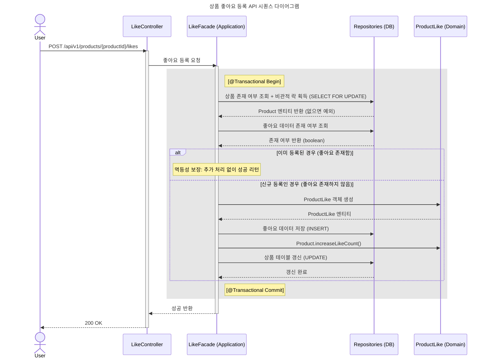
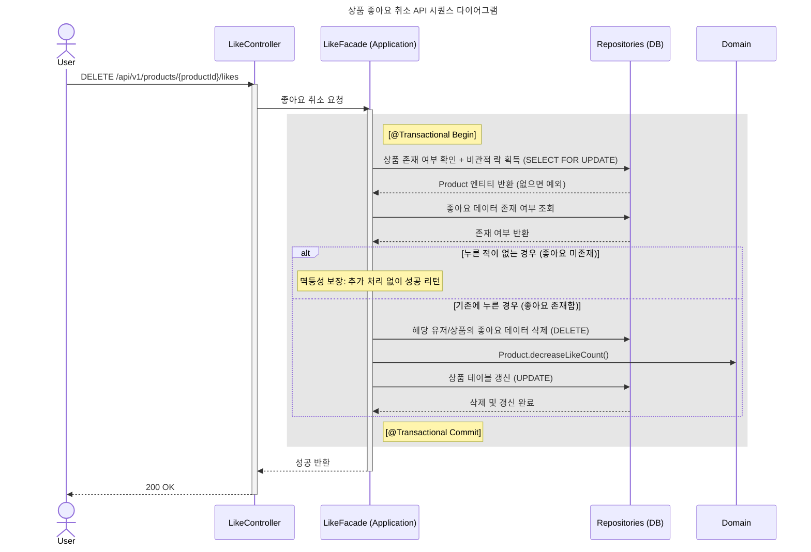
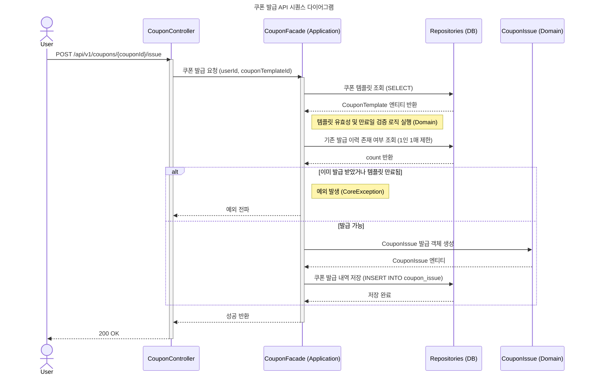
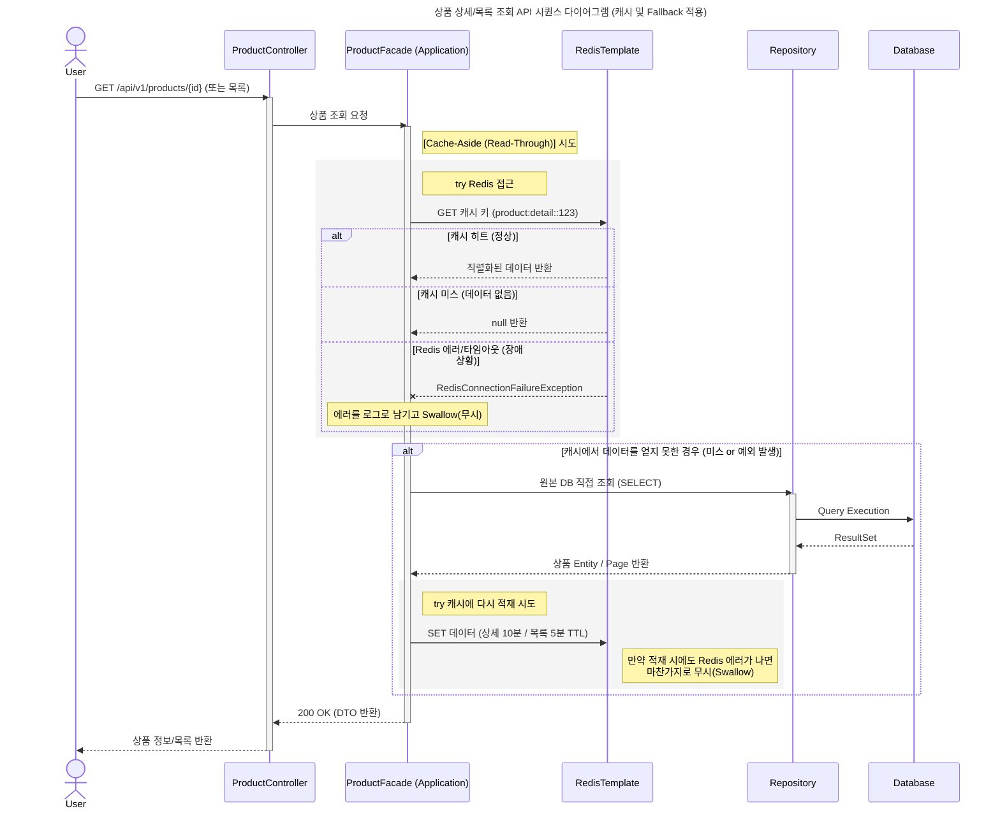

```mermaid
sequenceDiagram
    title 주문 요청 API 시퀀스 다이어그램
    actor User
    participant Controller as OrderController
    participant Facade as OrderFacade (Application)
    participant Repo as DB & Repositories
    participant Domain as Order / Coupon / Stock (Domain)
    participant PG as PaymentGateway

    User->>Controller: POST /api/v1/orders/checkout (상품목록, 쿠폰ID, 결제수단)
    activate Controller

    Controller->>Facade: 주문 및 결제 요청
    activate Facade

    rect rgba(128, 128, 128, 0.2)
        Note right of Facade: [@Transactional Begin]

        Note right of Facade: 1. 데이터 조회 (Application -> Infra)
        Facade->>Repo: SELECT FOR UPDATE 재고 락 획득
        Repo-->>Facade: Stock Entity
        Facade->>Repo: SELECT 상품 메타데이터 및 쿠폰 발급 내역
        Repo-->>Facade: Product Entity / Coupon Issue Entity

        Note right of Facade: 2. 도메인 로직 처리 (Application -> Domain)
        Facade->>Domain: Stock.decrease(quantity)
        Facade->>Domain: CouponIssue.use() (할인 검증)
        Facade->>Domain: Order.create(Product, Stock, Coupon)
        Domain-->>Facade: 생성된 Order 엔티티 및 상태가 변경된 엔티티 반환

        Note right of Facade: 3. 영속화 (Application -> Infra)
        Facade->>Repo: INSERT 주문 및 주문상세 (임시 저장)
        
        Note right of Facade: 4. 외부 API 호출 (동기)
        Facade->>PG: 결제 승인 요청 (amount, paymentMethod)
        activate PG
        
        alt 결제 승인 성공 시
            PG-->>Facade: PaymentResponse (success)
            deactivate PG

            Note right of Facade: 5. 결제 후처리 로직 및 최종 영속화
            Facade->>Domain: Order.completePayment()
            Facade->>Repo: INSERT 결제 내역
            Facade->>Repo: UPDATE 주문 및 쿠폰 상태

            Note right of Facade: [@Transactional Commit] DB 변경 반영
        else PG사 응답 타임아웃 또는 잔액 부족 등 승인 거절 시
            PG-->>Facade: 결제 실패 예외 발생
            Note right of Facade: [트랜잭션 롤백] 
        end
    end

    Facade-->>Controller: 결제 완료 및 주문 반환
    deactivate Facade
    Controller-->>User: 200 OK
    deactivate Controller
```

```mermaid
sequenceDiagram
    title 상품 좋아요 등록 API 시퀀스 다이어그램
    actor User
    participant Controller as LikeController
    participant Facade as LikeFacade (Application)
    participant Repo as Repositories (DB)
    participant Domain as ProductLike (Domain)

    User->>Controller: POST /api/v1/products/{productId}/likes
    activate Controller

    Controller->>Facade: 좋아요 등록 요청
    activate Facade

    rect rgba(128, 128, 128, 0.2)
        Note right of Facade: [@Transactional Begin]

        Facade->>Repo: 상품 존재 여부 조회 + 비관적 락 획득 (SELECT FOR UPDATE)
        Repo-->>Facade: Product 엔티티 반환 (없으면 예외)

        Facade->>Repo: 좋아요 데이터 존재 여부 조회
        Repo-->>Facade: 존재 여부 반환 (boolean)

        alt 이미 등록된 경우 (좋아요 존재함)
            Note over Facade: 멱등성 보장: 추가 처리 없이 성공 리턴
        else 신규 등록인 경우 (좋아요 존재하지 않음)
            Facade->>Domain: ProductLike 객체 생성
            Domain-->>Facade: ProductLike 엔티티
            Facade->>Repo: 좋아요 데이터 저장 (INSERT)
            
            Facade->>Domain: Product.increaseLikeCount()
            Facade->>Repo: 상품 테이블 갱신 (UPDATE)
            Repo-->>Facade: 갱신 완료
        end
        Note right of Facade: [@Transactional Commit]
    end

    Facade-->>Controller: 성공 반환
    deactivate Facade

    Controller-->>User: 200 OK
    deactivate Controller
```

```mermaid
sequenceDiagram
    title 상품 좋아요 취소 API 시퀀스 다이어그램
    actor User
    participant Controller as LikeController
    participant Facade as LikeFacade (Application)
    participant Repo as Repositories (DB)

    User->>Controller: DELETE /api/v1/products/{productId}/likes
    activate Controller

    Controller->>Facade: 좋아요 취소 요청
    activate Facade

    rect rgba(128, 128, 128, 0.2)
        Note right of Facade: [@Transactional Begin]

        Facade->>Repo: 상품 존재 여부 확인 + 비관적 락 획득 (SELECT FOR UPDATE)
        Repo-->>Facade: Product 엔티티 반환 (없으면 예외)

        Facade->>Repo: 좋아요 데이터 존재 여부 조회
        Repo-->>Facade: 존재 여부 반환

        alt 누른 적이 없는 경우 (좋아요 미존재)
            Note over Facade: 멱등성 보장: 추가 처리 없이 성공 리턴
        else 기존에 누른 경우 (좋아요 존재함)
            Facade->>Repo: 해당 유저/상품의 좋아요 데이터 삭제 (DELETE)
            
            Facade->>Domain: Product.decreaseLikeCount()
            Facade->>Repo: 상품 테이블 갱신 (UPDATE)
            Repo-->>Facade: 삭제 및 갱신 완료
        end
        Note right of Facade: [@Transactional Commit]
    end

    Facade-->>Controller: 성공 반환
    deactivate Facade

    Controller-->>User: 200 OK
    deactivate Controller
```

```mermaid
sequenceDiagram
    title 쿠폰 발급 API 시퀀스 다이어그램
    actor User
    participant Controller as CouponController
    participant Facade as CouponFacade (Application)
    participant Repo as Repositories (DB)
    participant Domain as CouponIssue (Domain)

    User->>Controller: POST /api/v1/coupons/{couponId}/issue
    activate Controller

    Controller->>Facade: 쿠폰 발급 요청 (userId, couponTemplateId)
    activate Facade

    Facade->>Repo: 쿠폰 템플릿 조회 (SELECT)
    Repo-->>Facade: CouponTemplate 엔티티 반환

    Note right of Facade: 템플릿 유효성 및 만료일 검증 로직 실행 (Domain)
    Facade->>Repo: 기존 발급 이력 존재 여부 조회 (1인 1매 제한)
    Repo-->>Facade: count 반환 

    alt 이미 발급 받았거나 템플릿 만료됨
        Note right of Facade: 예외 발생 (CoreException)
        Facade-->>Controller: 예외 전파
    else 발급 가능
        Facade->>Domain: CouponIssue 발급 객체 생성
        Domain-->>Facade: CouponIssue 엔티티
        Facade->>Repo: 쿠폰 발급 내역 저장 (INSERT INTO coupon_issue)
        Repo-->>Facade: 저장 완료
    end

    Facade-->>Controller: 성공 반환
    deactivate Facade
    Controller-->>User: 200 OK
    deactivate Controller
```

```mermaid
sequenceDiagram
    title 상품 상세/목록 조회 API 시퀀스 다이어그램 (캐시 및 Fallback 적용)
    actor User
    participant Controller as ProductController
    participant Facade as ProductFacade (Application)
    participant Cache as RedisTemplate
    participant Repo as Repository
    participant DB as Database

    User->>Controller: GET /api/v1/products/{id} (또는 목록)
    activate Controller

    Controller->>Facade: 상품 조회 요청
    activate Facade

    Note right of Facade: [Cache-Aside (Read-Through)] 시도
    
    rect rgba(200, 200, 200, 0.2)
        Note right of Facade: try Redis 접근
        Facade->>Cache: GET 캐시 키 (product:detail::123)
        alt 캐시 히트 (정상)
            Cache-->>Facade: 직렬화된 데이터 반환
        else 캐시 미스 (데이터 없음)
            Cache-->>Facade: null 반환
        else Redis 에러/타임아웃 (장애 상황)
            Cache--xFacade: RedisConnectionFailureException
            Note over Facade: 에러를 로그로 남기고 Swallow(무시)
        end
    end

    alt 캐시에서 데이터를 얻지 못한 경우 (미스 or 예외 발생)
        Facade->>Repo: 원본 DB 직접 조회 (SELECT)
        activate Repo
        Repo->>DB: Query Execution
        DB-->>Repo: ResultSet
        Repo-->>Facade: 상품 Entity / Page 반환
        deactivate Repo
        
        rect rgba(200, 200, 200, 0.2)
            Note right of Facade: try 캐시에 다시 적재 시도
            Facade->>Cache: SET 데이터 (상세 10분 / 목록 5분 TTL)
            Note right of Cache: 만약 적재 시에도 Redis 에러가 나면 <br>마찬가지로 무시(Swallow)
        end
    end

    Facade-->>Controller: 200 OK (DTO 반환)
    deactivate Facade

    Controller-->>User: 상품 정보/목록 반환
    deactivate Controller
```