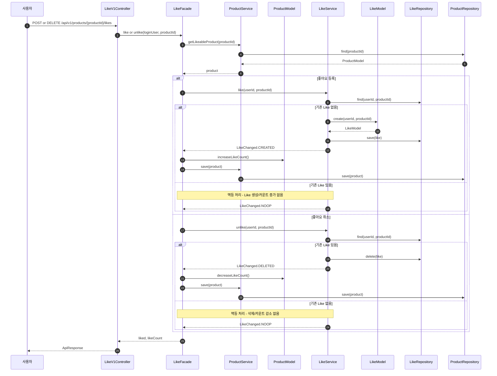
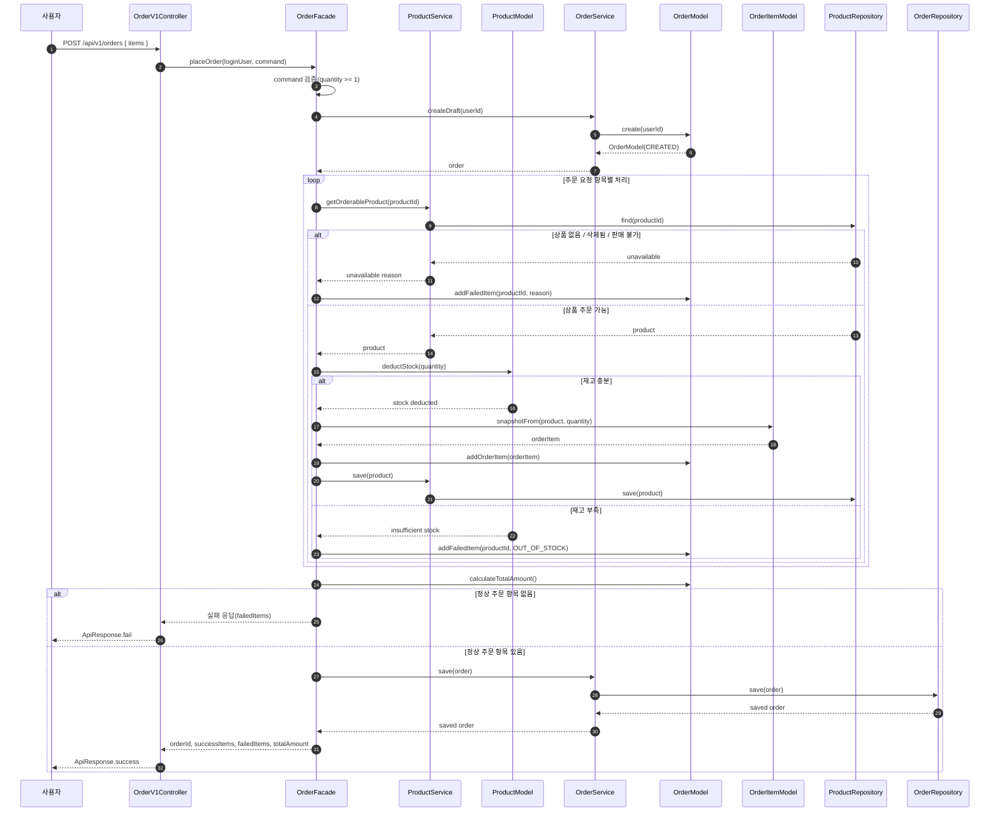
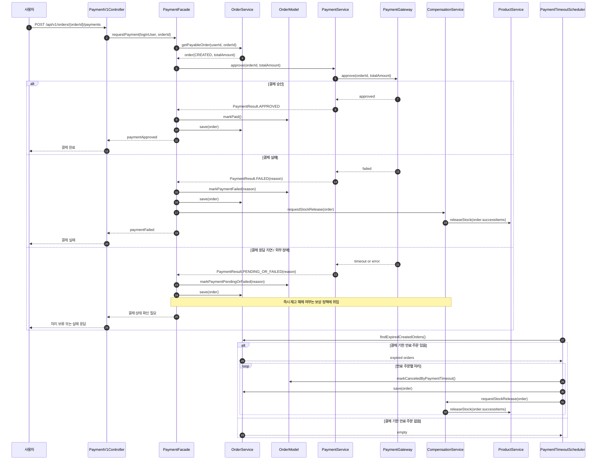

# 02. Sequence Diagrams

## 목적

이 문서는 `01-requirements.md`에서 정의한 요구사항 중 도메인 책임, 유스케이스 조율, 계층 간 의존 방향이 중요한 흐름을 시퀀스 다이어그램으로 정리한다.
단순 조회처럼 요구사항 명세만으로 충분히 이해되는 흐름은 제외한다.

## 작성 기준

- 프로젝트의 계층 구조는 `interfaces/api -> application/*Facade -> domain/*Service + *Model -> domain/*Repository(interface) -> infrastructure` 방향을 따른다.
- Controller는 요청/응답 변환과 인증 사용자 전달만 담당한다.
- Facade는 여러 도메인을 엮는 유스케이스 조율을 담당한다.
- 도메인 Service는 도메인 Repository 인터페이스를 통해 애그리거트를 조회/저장한다.
- 도메인 Model은 상태 변경과 비즈니스 규칙을 수행한다.
- infrastructure 구현체와 JPA Repository는 다이어그램에서 직접 호출 대상으로 두지 않는다.

---

## 1. 좋아요 등록/취소

### 설계 의도

좋아요 등록/취소는 `Like` 관계와 `Product.likeCount`를 함께 다룬다.
`Like` 도메인이 상품 저장소에 직접 의존하지 않도록, `LikeFacade`가 `LikeService`와 `ProductService`를 조율한다.
좋아요 중복 여부 판단은 `LikeService`, 좋아요 수 변경은 `ProductModel`의 책임으로 둔다.

### 시퀀스

### 논의 포인트

- `LikeFacade`가 상품 도메인과 좋아요 도메인의 협력을 조율한다. `LikeService`가 `ProductRepository`를 직접 알지 않도록 한다.
- `Product.likeCount` 변경은 `ProductModel`의 행위로 표현한다. 단순 필드 대입으로 다루지 않는다.
- `LikeRepository`에는 사용자-상품 유니크 제약이 필요하다. 동시 요청에서는 유니크 제약과 트랜잭션 처리가 멱등성의 마지막 방어선이 된다.
- `LikeChanged` 같은 결과 타입이 있으면 Facade가 카운트 변경 여부를 명확히 판단할 수 있다.

---

## 2. 주문 생성

### 설계 의도

주문 생성은 상품 재고 검증, 재고 차감, 주문 항목 스냅샷 생성, 실패 항목 분리를 함께 다룬다.
`OrderFacade`가 상품 도메인과 주문 도메인을 조율하고, 실제 재고 차감은 `ProductModel`, 주문 구성은 `OrderModel`의 책임으로 둔다.
주문 도메인이 상품 저장소를 직접 참조하지 않도록 상품 조회와 재고 차감은 상품 도메인에 맡긴다.

### 시퀀스

### 논의 포인트

- 재고 차감은 `ProductModel.deductStock(quantity)`에서 처리한다. 재고 규칙을 Facade나 Controller에 두지 않는다.
- 주문 항목 스냅샷은 `OrderItemModel.snapshotFrom(product, quantity)`처럼 주문 도메인 객체로 분리한다.
- `OrderModel`은 성공 항목과 실패 항목을 모두 결과로 표현해야 한다. 그래야 부분 주문 허용 정책이 응답에 드러난다.
- Facade가 여러 도메인을 조율하되, 각 도메인의 내부 Repository를 서로 직접 참조하지 않도록 한다.

---

## 3. 결제 승인 및 보상 처리

### 설계 의도

주문 생성과 결제 승인은 분리한다.
결제는 외부 시스템과의 통신이므로 주문 도메인 내부 규칙과 분리하고, `PaymentFacade`가 주문 상태 변경과 보상 요청을 조율한다.
주문 상태 전이는 `OrderModel`, 재고 해제는 상품 도메인 책임으로 둔다.

### 시퀀스

### 논의 포인트

- `PaymentService`는 외부 결제 시스템과의 통신을 캡슐화한다. 주문 상태를 직접 바꾸지 않는다.
- 주문 상태 변경은 `OrderModel.markPaid`, `markPaymentFailed`, `markCanceledByPaymentTimeout` 같은 도메인 행위로 표현한다.
- 보상 처리는 `CompensationService`가 조율하고, 실제 재고 해제는 `ProductService`를 통해 상품 도메인에 위임한다.
- 결제 장애 시 `PENDING` 상태를 명시적으로 둘지, 곧바로 실패로 둘지는 후속 설계에서 더 구체화해야 한다.
