# 02. 시퀀스 다이어그램

> 이 문서는 두 가지 수준의 다이어그램을 제공합니다.
> - **비즈니스 레벨**: 도메인 단위로 추상화. 비개발자도 흐름을 파악할 수 있는 수준.
> - **기술 레벨**: 레이어(Controller → Facade → Service → Repository) 단위 상세 흐름.

---

## 비즈니스 레벨 (Business Level)

내부 구현을 숨기고 **어떤 주체가 어떤 행위를 하는가**에 집중합니다.

---

### SDB-01. 브랜드 조회

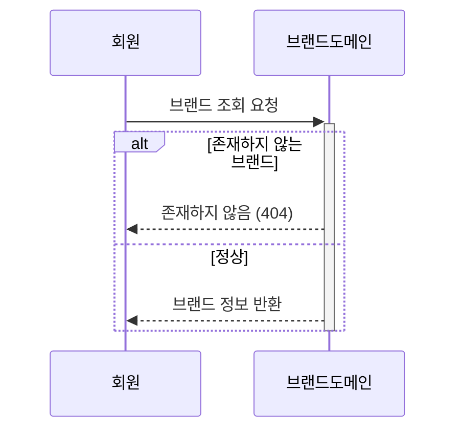
```mermaid
sequenceDiagram
    participant 회원
    participant 브랜드도메인

    회원->>+브랜드도메인: 브랜드 조회 요청
    alt 존재하지 않는 브랜드
        브랜드도메인-->>회원: 존재하지 않음 (404)
    else 정상
        브랜드도메인-->>회원: 브랜드 정보 반환
    end
    deactivate 브랜드도메인
```

---

### SDB-02. 상품 목록 조회

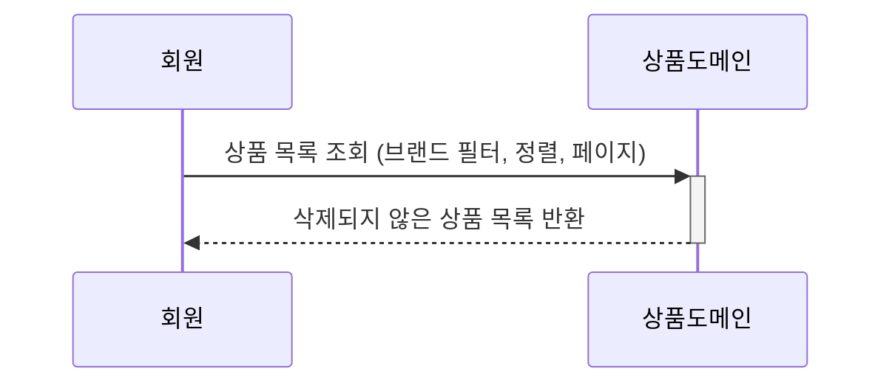
```mermaid
sequenceDiagram
    participant 회원
    participant 상품도메인

    회원->>+상품도메인: 상품 목록 조회 (브랜드 필터, 정렬, 페이지)
    상품도메인-->>-회원: 삭제되지 않은 상품 목록 반환
```

---

### SDB-03. 상품 상세 조회

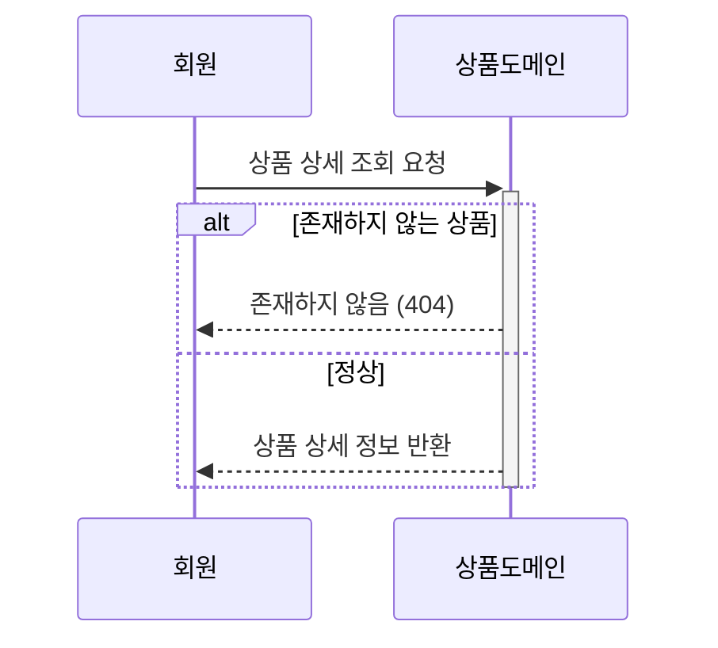
```mermaid
sequenceDiagram
    participant 회원
    participant 상품도메인

    회원->>+상품도메인: 상품 상세 조회 요청
    alt 존재하지 않는 상품
        상품도메인-->>회원: 존재하지 않음 (404)
    else 정상
        상품도메인-->>회원: 상품 상세 정보 반환
    end
    deactivate 상품도메인
```

---

### SDB-04. 좋아요 등록

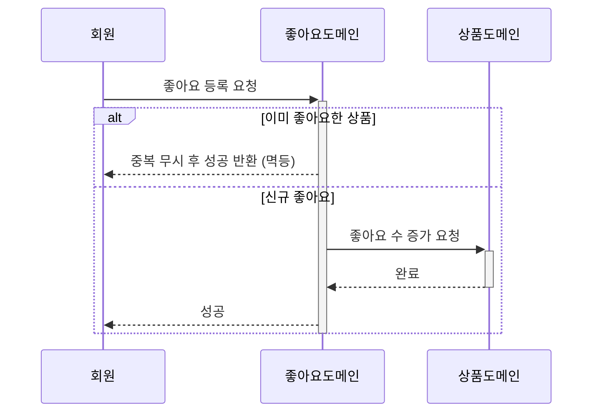
```mermaid
sequenceDiagram
    participant 회원
    participant 좋아요도메인
    participant 상품도메인

    회원->>+좋아요도메인: 좋아요 등록 요청
    alt 이미 좋아요한 상품
        좋아요도메인-->>회원: 중복 무시 후 성공 반환 (멱등)
    else 신규 좋아요
        좋아요도메인->>+상품도메인: 좋아요 수 증가 요청
        상품도메인-->>-좋아요도메인: 완료
        좋아요도메인-->>회원: 성공
    end
    deactivate 좋아요도메인
```

---

### SDB-05. 좋아요 취소

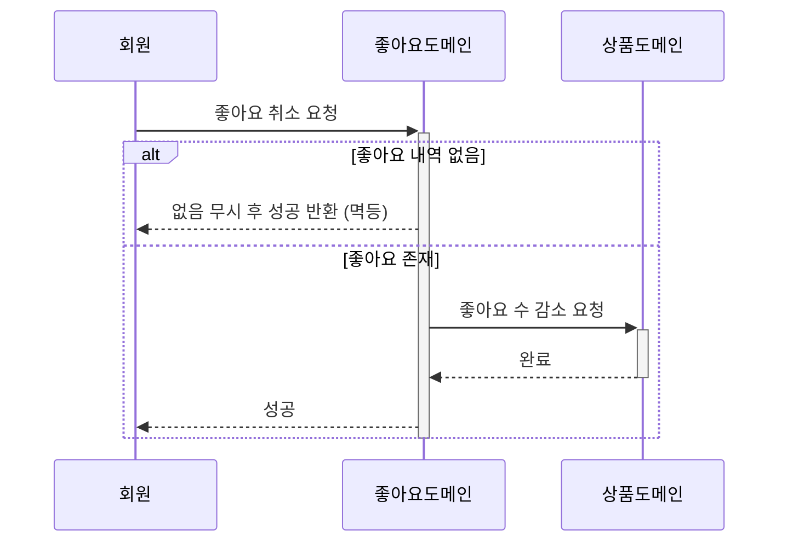
```mermaid
sequenceDiagram
    participant 회원
    participant 좋아요도메인
    participant 상품도메인

    회원->>+좋아요도메인: 좋아요 취소 요청
    alt 좋아요 내역 없음
        좋아요도메인-->>회원: 없음 무시 후 성공 반환 (멱등)
    else 좋아요 존재
        좋아요도메인->>+상품도메인: 좋아요 수 감소 요청
        상품도메인-->>-좋아요도메인: 완료
        좋아요도메인-->>회원: 성공
    end
    deactivate 좋아요도메인
```

---

### SDB-06. 내 좋아요 목록 조회

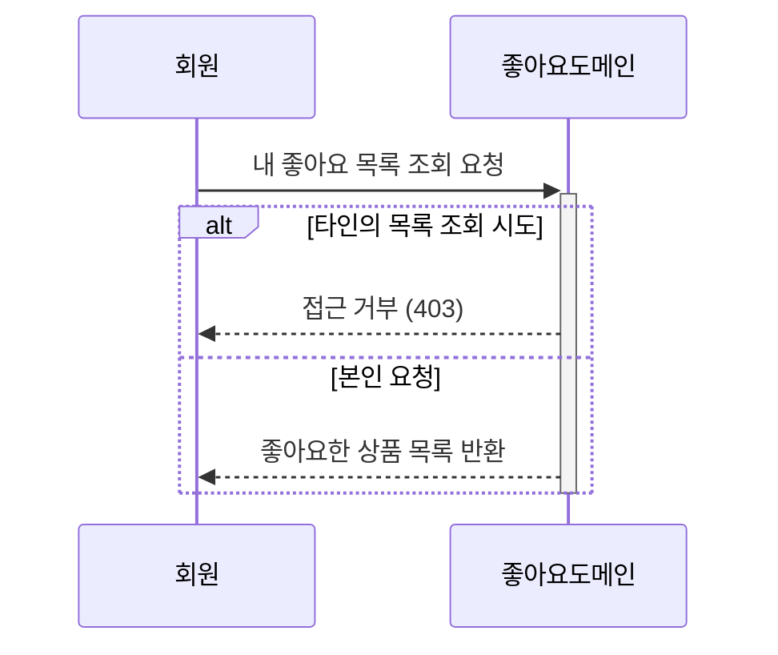
```mermaid
sequenceDiagram
    participant 회원
    participant 좋아요도메인

    회원->>+좋아요도메인: 내 좋아요 목록 조회 요청
    alt 타인의 목록 조회 시도
        좋아요도메인-->>회원: 접근 거부 (403)
    else 본인 요청
        좋아요도메인-->>회원: 좋아요한 상품 목록 반환
    end
    deactivate 좋아요도메인
```

---

### SDB-07. 주문 생성

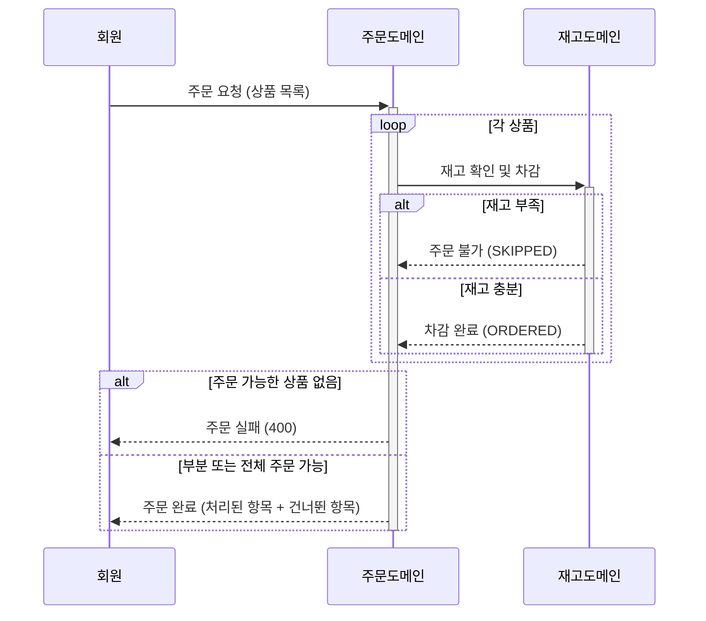
```mermaid
sequenceDiagram
    participant 회원
    participant 주문도메인
    participant 재고도메인

    회원->>+주문도메인: 주문 요청 (상품 목록)
    loop 각 상품
        주문도메인->>+재고도메인: 재고 확인 및 차감
        alt 재고 부족
            재고도메인-->>주문도메인: 주문 불가 (SKIPPED)
        else 재고 충분
            재고도메인-->>주문도메인: 차감 완료 (ORDERED)
        end
        deactivate 재고도메인
    end
    alt 주문 가능한 상품 없음
        주문도메인-->>회원: 주문 실패 (400)
    else 부분 또는 전체 주문 가능
        주문도메인-->>회원: 주문 완료 (처리된 항목 + 건너뛴 항목)
    end
    deactivate 주문도메인
```

---

### SDB-08. 주문 목록 조회

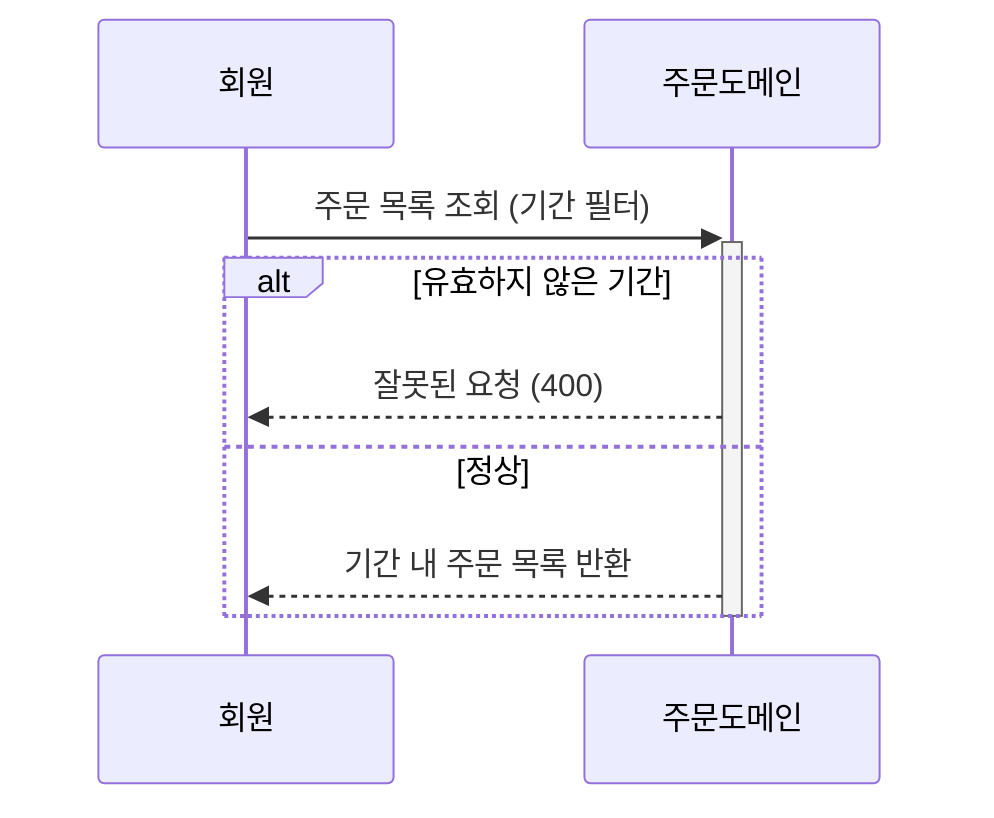
```mermaid
sequenceDiagram
    participant 회원
    participant 주문도메인

    회원->>+주문도메인: 주문 목록 조회 (기간 필터)
    alt 유효하지 않은 기간
        주문도메인-->>회원: 잘못된 요청 (400)
    else 정상
        주문도메인-->>회원: 기간 내 주문 목록 반환
    end
    deactivate 주문도메인
```

---

### SDB-09. 주문 상세 조회

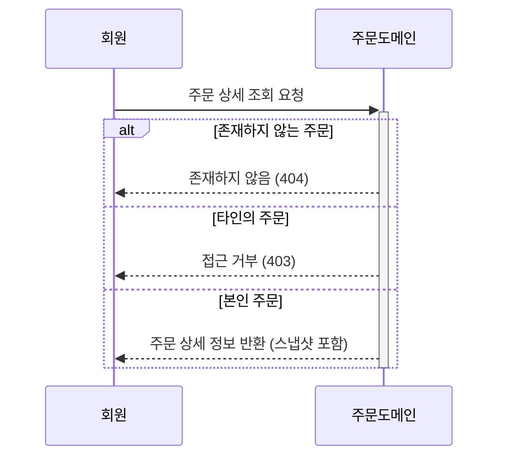
```mermaid
sequenceDiagram
    participant 회원
    participant 주문도메인

    회원->>+주문도메인: 주문 상세 조회 요청
    alt 존재하지 않는 주문
        주문도메인-->>회원: 존재하지 않음 (404)
    else 타인의 주문
        주문도메인-->>회원: 접근 거부 (403)
    else 본인 주문
        주문도메인-->>회원: 주문 상세 정보 반환 (스냅샷 포함)
    end
    deactivate 주문도메인
```

---

### SDB-10. 어드민 브랜드 등록

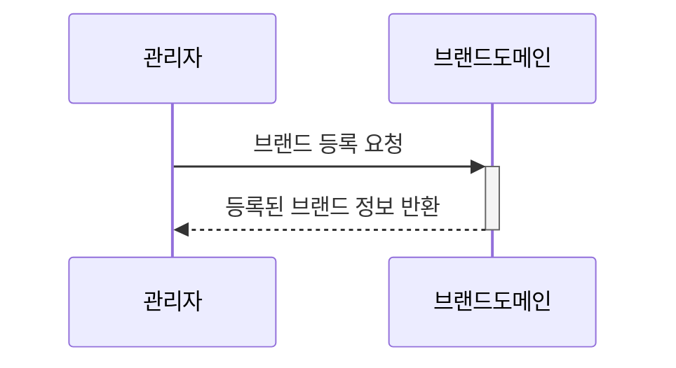
```mermaid
sequenceDiagram
    participant 관리자
    participant 브랜드도메인

    관리자->>+브랜드도메인: 브랜드 등록 요청
    브랜드도메인-->>-관리자: 등록된 브랜드 정보 반환
```

---

### SDB-11. 어드민 브랜드 수정

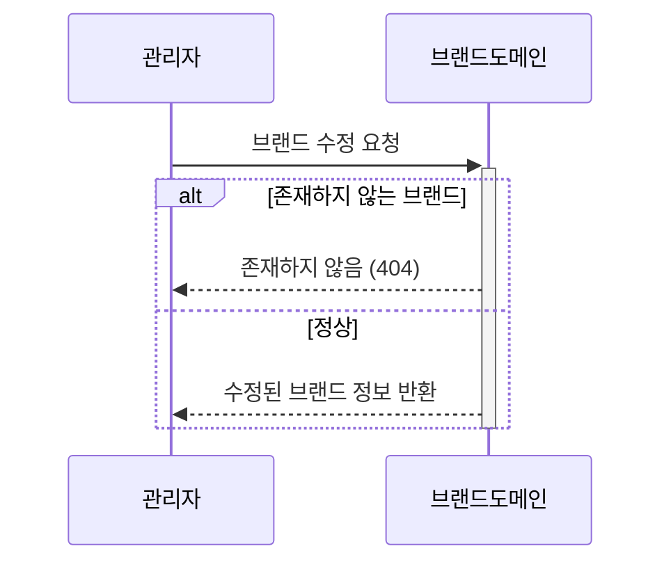
```mermaid
sequenceDiagram
    participant 관리자
    participant 브랜드도메인

    관리자->>+브랜드도메인: 브랜드 수정 요청
    alt 존재하지 않는 브랜드
        브랜드도메인-->>관리자: 존재하지 않음 (404)
    else 정상
        브랜드도메인-->>관리자: 수정된 브랜드 정보 반환
    end
    deactivate 브랜드도메인
```

---

### SDB-12. 어드민 브랜드 삭제

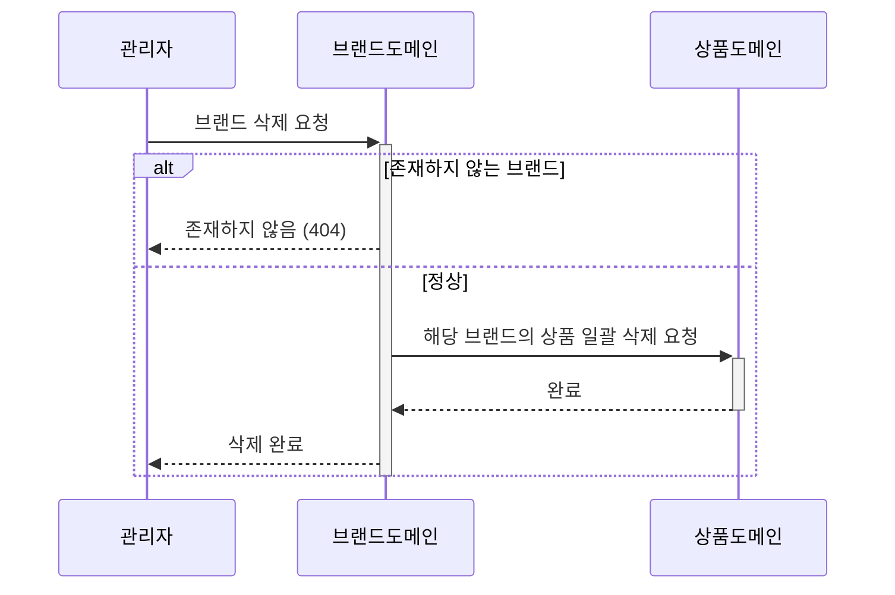
```mermaid
sequenceDiagram
    participant 관리자
    participant 브랜드도메인
    participant 상품도메인

    관리자->>+브랜드도메인: 브랜드 삭제 요청
    alt 존재하지 않는 브랜드
        브랜드도메인-->>관리자: 존재하지 않음 (404)
    else 정상
        브랜드도메인->>+상품도메인: 해당 브랜드의 상품 일괄 삭제 요청
        상품도메인-->>-브랜드도메인: 완료
        브랜드도메인-->>관리자: 삭제 완료
    end
    deactivate 브랜드도메인
```

---

### SDB-13. 어드민 상품 등록

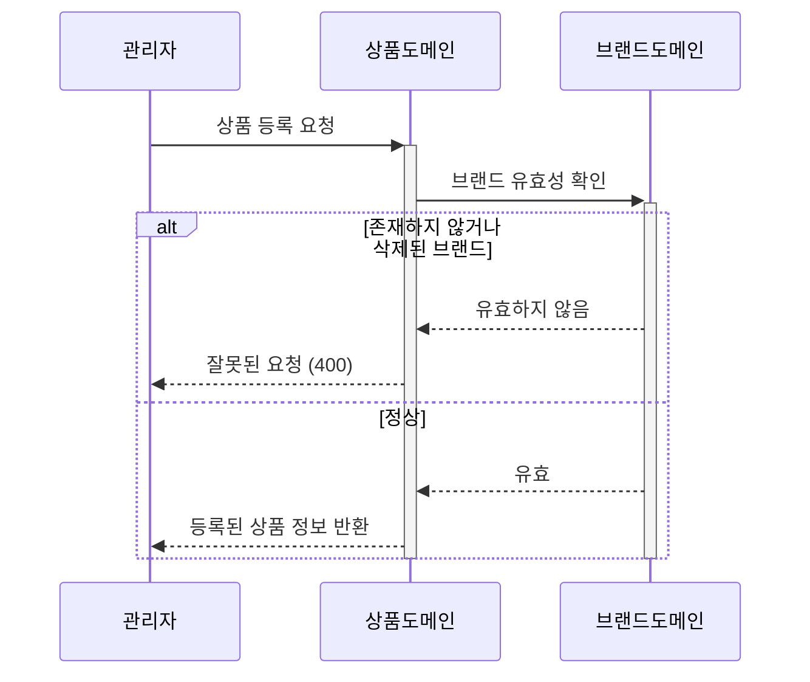
```mermaid
sequenceDiagram
    participant 관리자
    participant 상품도메인
    participant 브랜드도메인

    관리자->>+상품도메인: 상품 등록 요청
    상품도메인->>+브랜드도메인: 브랜드 유효성 확인
    alt 존재하지 않거나 삭제된 브랜드
        브랜드도메인-->>상품도메인: 유효하지 않음
        상품도메인-->>관리자: 잘못된 요청 (400)
    else 정상
        브랜드도메인-->>상품도메인: 유효
        상품도메인-->>관리자: 등록된 상품 정보 반환
    end
    deactivate 브랜드도메인
    deactivate 상품도메인
```

---

### SDB-14. 어드민 상품 수정

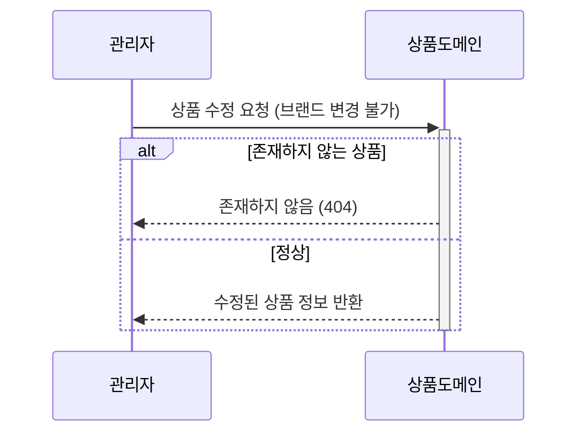
```mermaid
sequenceDiagram
    participant 관리자
    participant 상품도메인

    관리자->>+상품도메인: 상품 수정 요청 (브랜드 변경 불가)
    alt 존재하지 않는 상품
        상품도메인-->>관리자: 존재하지 않음 (404)
    else 정상
        상품도메인-->>관리자: 수정된 상품 정보 반환
    end
    deactivate 상품도메인
```

---

### SDB-15. 어드민 상품 삭제

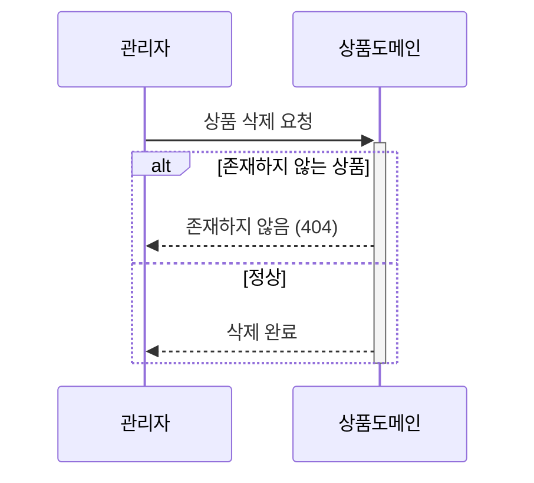
```mermaid
sequenceDiagram
    participant 관리자
    participant 상품도메인

    관리자->>+상품도메인: 상품 삭제 요청
    alt 존재하지 않는 상품
        상품도메인-->>관리자: 존재하지 않음 (404)
    else 정상
        상품도메인-->>관리자: 삭제 완료
    end
    deactivate 상품도메인
```

---

### SDB-16. 어드민 주문 목록 조회

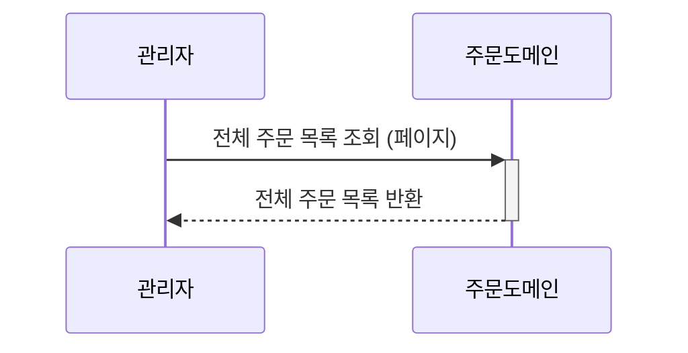
```mermaid
sequenceDiagram
    participant 관리자
    participant 주문도메인

    관리자->>+주문도메인: 전체 주문 목록 조회 (페이지)
    주문도메인-->>-관리자: 전체 주문 목록 반환
```

---

### SDB-17. 어드민 주문 상세 조회

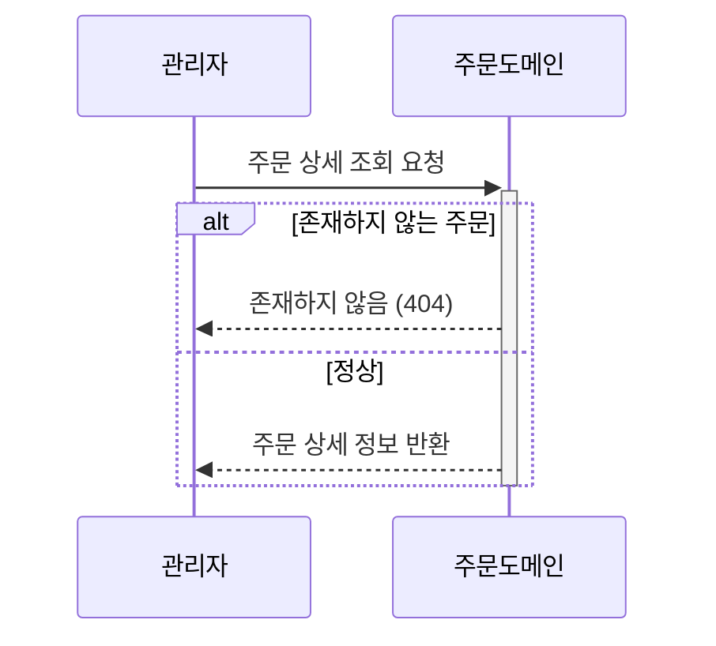
```mermaid
sequenceDiagram
    participant 관리자
    participant 주문도메인

    관리자->>+주문도메인: 주문 상세 조회 요청
    alt 존재하지 않는 주문
        주문도메인-->>관리자: 존재하지 않음 (404)
    else 정상
        주문도메인-->>관리자: 주문 상세 정보 반환
    end
    deactivate 주문도메인
```

---

## 기술 레벨 (Technical Level)

레이어(Controller → Facade → Service → Repository) 단위의 상세 호출 흐름입니다.

---

## SD-01. 브랜드 조회

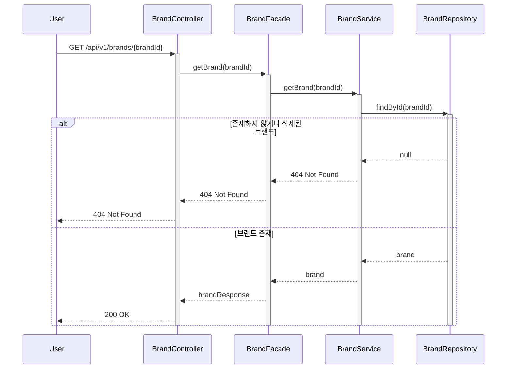
```mermaid
sequenceDiagram
    participant User
    participant BrandController
    participant BrandFacade
    participant BrandService
    participant BrandRepository

    User->>+BrandController: GET /api/v1/brands/{brandId}
    BrandController->>+BrandFacade: getBrand(brandId)
    BrandFacade->>+BrandService: getBrand(brandId)
    BrandService->>+BrandRepository: findById(brandId)

    alt 존재하지 않거나 삭제된 브랜드
        BrandRepository-->>BrandService: null
        BrandService-->>BrandFacade: 404 Not Found
        BrandFacade-->>BrandController: 404 Not Found
        BrandController-->>User: 404 Not Found
    else 브랜드 존재
        BrandRepository-->>BrandService: brand
        BrandService-->>BrandFacade: brand
        BrandFacade-->>BrandController: brandResponse
        BrandController-->>User: 200 OK
    end

    deactivate BrandRepository
    deactivate BrandService
    deactivate BrandFacade
    deactivate BrandController
```

---

## SD-02. 상품 목록 조회

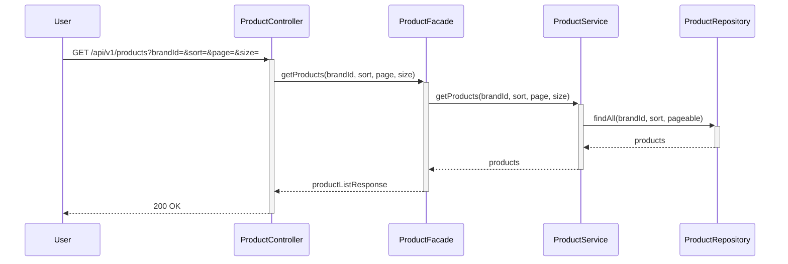
```mermaid
sequenceDiagram
    participant User
    participant ProductController
    participant ProductFacade
    participant ProductService
    participant ProductRepository

    User->>+ProductController: GET /api/v1/products?brandId=&sort=&page=&size=
    ProductController->>+ProductFacade: getProducts(brandId, sort, page, size)
    ProductFacade->>+ProductService: getProducts(brandId, sort, page, size)
    ProductService->>+ProductRepository: findAll(brandId, sort, pageable)
    ProductRepository-->>-ProductService: products
    ProductService-->>-ProductFacade: products
    ProductFacade-->>-ProductController: productListResponse
    ProductController-->>-User: 200 OK
```

**읽는 포인트**
- 삭제되지 않은 상품만 조회된다 (`deleted_at IS NULL` 조건 필수).
- 존재하지 않는 brandId로 필터링 시 빈 목록을 반환한다 (404 아님).

---

## SD-03. 상품 상세 조회

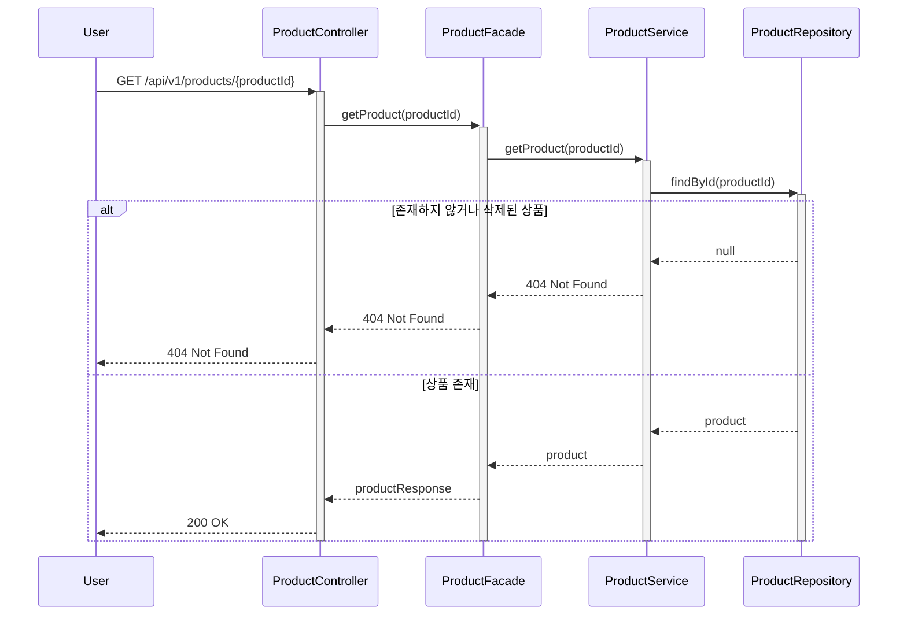
```mermaid
sequenceDiagram
    participant User
    participant ProductController
    participant ProductFacade
    participant ProductService
    participant ProductRepository

    User->>+ProductController: GET /api/v1/products/{productId}
    ProductController->>+ProductFacade: getProduct(productId)
    ProductFacade->>+ProductService: getProduct(productId)
    ProductService->>+ProductRepository: findById(productId)

    alt 존재하지 않거나 삭제된 상품
        ProductRepository-->>ProductService: null
        ProductService-->>ProductFacade: 404 Not Found
        ProductFacade-->>ProductController: 404 Not Found
        ProductController-->>User: 404 Not Found
    else 상품 존재
        ProductRepository-->>ProductService: product
        ProductService-->>ProductFacade: product
        ProductFacade-->>ProductController: productResponse
        ProductController-->>User: 200 OK
    end

    deactivate ProductRepository
    deactivate ProductService
    deactivate ProductFacade
    deactivate ProductController
```

---

## SD-04. 좋아요 등록 (멱등 처리)

좋아요 중복 요청 시 에러 없이 처리되는 멱등성 흐름과 like_count 책임 위치를 검증한다.

```mermaid
sequenceDiagram
    participant User
    participant LikeController
    participant LikeFacade
    participant LikeService
    participant ProductService
    participant LikeRepository

    User->>+LikeController: POST /api/v1/products/{productId}/likes
    LikeController->>+LikeFacade: addLike(userId, productId)
    LikeFacade->>+LikeService: addLike(userId, productId)
    LikeService->>+LikeRepository: exists(userId, productId)

    alt 이미 좋아요한 경우
        LikeRepository-->>LikeService: true
    else 좋아요 없음
        LikeRepository-->>LikeService: false
        LikeService->>LikeRepository: save(like)
        LikeService->>+ProductService: incrementLikeCount(productId)
        ProductService-->>-LikeService: done
    end

    deactivate LikeRepository
    LikeService-->>-LikeFacade: 200 OK
    LikeFacade-->>-LikeController: 200 OK
    LikeController-->>-User: 200 OK
```

**읽는 포인트**
- 이미 좋아요가 존재하면 저장 없이 200 OK를 반환한다. like_count는 변경되지 않는다.
- like_count 증감은 Product 도메인의 책임이므로 LikeService → ProductService로 위임한다.

---

## SD-05. 좋아요 취소 (멱등 처리)

```mermaid
sequenceDiagram
    participant User
    participant LikeController
    participant LikeFacade
    participant LikeService
    participant ProductService
    participant LikeRepository

    User->>+LikeController: DELETE /api/v1/products/{productId}/likes
    LikeController->>+LikeFacade: removeLike(userId, productId)
    LikeFacade->>+LikeService: removeLike(userId, productId)
    LikeService->>+LikeRepository: exists(userId, productId)

    alt 좋아요 없음
        LikeRepository-->>LikeService: false
    else 좋아요 존재
        LikeRepository-->>LikeService: true
        LikeService->>LikeRepository: delete(userId, productId)
        LikeService->>+ProductService: decrementLikeCount(productId)
        ProductService-->>-LikeService: done
    end

    deactivate LikeRepository
    LikeService-->>-LikeFacade: 200 OK
    LikeFacade-->>-LikeController: 200 OK
    LikeController-->>-User: 200 OK
```

---

## SD-06. 내 좋아요 목록 조회

```mermaid
sequenceDiagram
    participant User
    participant LikeController
    participant LikeFacade
    participant LikeService
    participant LikeRepository

    User->>+LikeController: GET /api/v1/users/{userId}/likes
    LikeController->>+LikeFacade: getLikes(requestUserId, userId)
    LikeFacade->>+LikeService: getLikes(requestUserId, userId)

    alt 요청자 != 조회 대상 유저
        LikeService-->>LikeFacade: 403 Forbidden
        LikeFacade-->>LikeController: 403 Forbidden
        LikeController-->>User: 403 Forbidden
    else 본인 요청
        LikeService->>+LikeRepository: findAllByUserId(userId)
        LikeRepository-->>-LikeService: likes
        LikeService-->>LikeFacade: likedProducts
        LikeFacade-->>LikeController: likeListResponse
        LikeController-->>User: 200 OK
    end

    deactivate LikeService
    deactivate LikeFacade
    deactivate LikeController
```

---

## SD-07. 주문 생성

재고 확인 및 차감, 부분 주문 처리, 스냅샷 저장의 책임 분리와 트랜잭션 경계를 검증한다.

```mermaid
sequenceDiagram
    participant User
    participant OrderController
    participant OrderFacade
    participant OrderService
    participant StockService
    participant OrderRepository
    participant OrderItemSnapshotRepository

    User->>+OrderController: POST /api/v1/orders
    OrderController->>+OrderFacade: createOrder(userId, items)

    loop 각 주문 항목
        OrderFacade->>+StockService: deductIfAvailable(productId, quantity)
        alt 재고 충분
            StockService-->>OrderFacade: ORDERED
        else 재고 부족 또는 상품 없음
            StockService-->>OrderFacade: SKIPPED
        end
        deactivate StockService
    end

    alt ORDERED 항목 없음
        OrderFacade-->>OrderController: 400 Bad Request
        OrderController-->>User: 400 Bad Request
    else ORDERED 항목 있음
        OrderFacade->>+OrderService: createOrder(userId, orderedItems, skippedItems)
        OrderService->>+OrderRepository: save(order, orderItems)
        OrderRepository-->>-OrderService: savedOrder
        OrderService->>+OrderItemSnapshotRepository: save(productName, price, brandName)
        OrderItemSnapshotRepository-->>-OrderService: saved
        OrderService-->>-OrderFacade: orderResult
        OrderFacade-->>OrderController: { orderedItems, skippedItems }
        OrderController-->>User: 200 OK
    end

    deactivate OrderFacade
    deactivate OrderController
```

**읽는 포인트**
- ORDERED/SKIPPED 분류는 Facade에서 결정하고, OrderService는 저장만 담당한다.
- 재고 차감과 주문 저장은 단일 트랜잭션으로 처리된다.
- 스냅샷은 OrderService 내부에서 주문 저장 직후 동일 트랜잭션 안에 저장된다.

---

## SD-08. 주문 목록 조회

```mermaid
sequenceDiagram
    participant User
    participant OrderController
    participant OrderFacade
    participant OrderService
    participant OrderRepository

    User->>+OrderController: GET /api/v1/orders?startAt=&endAt=
    OrderController->>+OrderFacade: getOrders(userId, startAt, endAt)
    OrderFacade->>+OrderService: getOrders(userId, startAt, endAt)

    alt startAt > endAt
        OrderService-->>OrderFacade: 400 Bad Request
        OrderFacade-->>OrderController: 400 Bad Request
        OrderController-->>User: 400 Bad Request
    else 유효한 날짜 범위
        OrderService->>+OrderRepository: findAllByUserIdAndDateRange(userId, startAt, endAt)
        OrderRepository-->>-OrderService: orders
        OrderService-->>OrderFacade: orders
        OrderFacade-->>OrderController: orderListResponse
        OrderController-->>User: 200 OK
    end

    deactivate OrderService
    deactivate OrderFacade
    deactivate OrderController
```

---

## SD-09. 주문 상세 조회

```mermaid
sequenceDiagram
    participant User
    participant OrderController
    participant OrderFacade
    participant OrderService
    participant OrderRepository

    User->>+OrderController: GET /api/v1/orders/{orderId}
    OrderController->>+OrderFacade: getOrder(userId, orderId)
    OrderFacade->>+OrderService: getOrder(userId, orderId)
    OrderService->>+OrderRepository: findById(orderId)

    alt 주문 없음
        OrderRepository-->>OrderService: null
        OrderService-->>OrderFacade: 404 Not Found
        OrderFacade-->>OrderController: 404 Not Found
        OrderController-->>User: 404 Not Found
    else 타 유저 주문
        OrderRepository-->>OrderService: order
        OrderService-->>OrderFacade: 403 Forbidden
        OrderFacade-->>OrderController: 403 Forbidden
        OrderController-->>User: 403 Forbidden
    else 본인 주문
        OrderRepository-->>OrderService: order
        OrderService-->>OrderFacade: orderDetail
        OrderFacade-->>OrderController: orderDetailResponse
        OrderController-->>User: 200 OK
    end

    deactivate OrderRepository
    deactivate OrderService
    deactivate OrderFacade
    deactivate OrderController
```

---

## SD-10. 어드민 브랜드 등록

```mermaid
sequenceDiagram
    participant Admin
    participant BrandController
    participant BrandFacade
    participant BrandService
    participant BrandRepository

    Admin->>+BrandController: POST /api-admin/v1/brands
    BrandController->>+BrandFacade: createBrand(request)
    BrandFacade->>+BrandService: createBrand(request)
    BrandService->>+BrandRepository: save(brand)
    BrandRepository-->>-BrandService: savedBrand
    BrandService-->>-BrandFacade: brandResponse
    BrandFacade-->>-BrandController: brandResponse
    BrandController-->>-Admin: 200 OK
```

---

## SD-11. 어드민 브랜드 수정

```mermaid
sequenceDiagram
    participant Admin
    participant BrandController
    participant BrandFacade
    participant BrandService
    participant BrandRepository

    Admin->>+BrandController: PUT /api-admin/v1/brands/{brandId}
    BrandController->>+BrandFacade: updateBrand(brandId, request)
    BrandFacade->>+BrandService: updateBrand(brandId, request)
    BrandService->>+BrandRepository: findById(brandId)

    alt 브랜드 없음
        BrandRepository-->>BrandService: null
        BrandService-->>BrandFacade: 404 Not Found
        BrandFacade-->>BrandController: 404 Not Found
        BrandController-->>Admin: 404 Not Found
    else 브랜드 존재
        BrandRepository-->>BrandService: brand
        BrandService->>BrandRepository: update(brand)
        BrandRepository-->>BrandService: updatedBrand
        BrandService-->>BrandFacade: brandResponse
        BrandFacade-->>BrandController: brandResponse
        BrandController-->>Admin: 200 OK
    end

    deactivate BrandRepository
    deactivate BrandService
    deactivate BrandFacade
    deactivate BrandController
```

---

## SD-12. 어드민 브랜드 삭제 (소프트 딜리트 cascade)

```mermaid
sequenceDiagram
    participant Admin
    participant BrandController
    participant BrandFacade
    participant BrandService
    participant ProductService
    participant BrandRepository
    participant ProductRepository

    Admin->>+BrandController: DELETE /api-admin/v1/brands/{brandId}
    BrandController->>+BrandFacade: deleteBrand(brandId)
    BrandFacade->>+BrandService: deleteBrand(brandId)
    BrandService->>+BrandRepository: findById(brandId)

    alt 브랜드 없음
        BrandRepository-->>BrandService: null
        BrandService-->>BrandFacade: 404 Not Found
        BrandFacade-->>BrandController: 404 Not Found
        BrandController-->>Admin: 404 Not Found
    else 브랜드 존재
        BrandRepository-->>BrandService: brand
        BrandService->>BrandRepository: softDelete(brandId)
        BrandService->>+ProductService: softDeleteByBrandId(brandId)
        ProductService->>+ProductRepository: softDeleteAllByBrandId(brandId)
        ProductRepository-->>-ProductService: done
        ProductService-->>-BrandService: done
        BrandService-->>BrandFacade: 200 OK
        BrandFacade-->>BrandController: 200 OK
        BrandController-->>Admin: 200 OK
    end

    deactivate BrandRepository
    deactivate BrandService
    deactivate BrandFacade
    deactivate BrandController
```

**읽는 포인트**
- 삭제는 소프트 딜리트(`deleted_at`)로 처리되며 브랜드 삭제 시 상품도 함께 소프트 딜리트된다.
- cascade는 DB ON DELETE가 아닌 BrandService → ProductService 호출로 처리한다.

---

## SD-13. 어드민 상품 등록

```mermaid
sequenceDiagram
    participant Admin
    participant ProductController
    participant ProductFacade
    participant ProductService
    participant BrandService
    participant ProductRepository

    Admin->>+ProductController: POST /api-admin/v1/products
    ProductController->>+ProductFacade: createProduct(request)
    ProductFacade->>+BrandService: getBrand(brandId)

    alt 브랜드 없음 or 삭제됨
        BrandService-->>ProductFacade: 400 Bad Request
        ProductFacade-->>ProductController: 400 Bad Request
        ProductController-->>Admin: 400 Bad Request
    else 브랜드 존재
        BrandService-->>ProductFacade: brand
        ProductFacade->>+ProductService: createProduct(request)
        ProductService->>+ProductRepository: save(product)
        ProductRepository-->>-ProductService: savedProduct
        ProductService-->>-ProductFacade: productResponse
        ProductFacade-->>ProductController: productResponse
        ProductController-->>Admin: 200 OK
    end

    deactivate BrandService
    deactivate ProductFacade
    deactivate ProductController
```

---

## SD-14. 어드민 상품 수정

```mermaid
sequenceDiagram
    participant Admin
    participant ProductController
    participant ProductFacade
    participant ProductService
    participant ProductRepository

    Admin->>+ProductController: PUT /api-admin/v1/products/{productId}
    ProductController->>+ProductFacade: updateProduct(productId, request)
    ProductFacade->>+ProductService: updateProduct(productId, request)
    ProductService->>+ProductRepository: findById(productId)

    alt 상품 없음
        ProductRepository-->>ProductService: null
        ProductService-->>ProductFacade: 404 Not Found
        ProductFacade-->>ProductController: 404 Not Found
        ProductController-->>Admin: 404 Not Found
    else 상품 존재
        ProductRepository-->>ProductService: product
        ProductService->>ProductRepository: update(product)
        ProductRepository-->>ProductService: updatedProduct
        ProductService-->>ProductFacade: productResponse
        ProductFacade-->>ProductController: productResponse
        ProductController-->>Admin: 200 OK
    end

    deactivate ProductRepository
    deactivate ProductService
    deactivate ProductFacade
    deactivate ProductController
```

**읽는 포인트**
- 상품 수정 시 브랜드 변경은 허용하지 않으므로 request에서 brandId를 받지 않는다.

---

## SD-15. 어드민 상품 삭제

```mermaid
sequenceDiagram
    participant Admin
    participant ProductController
    participant ProductFacade
    participant ProductService
    participant ProductRepository

    Admin->>+ProductController: DELETE /api-admin/v1/products/{productId}
    ProductController->>+ProductFacade: deleteProduct(productId)
    ProductFacade->>+ProductService: deleteProduct(productId)
    ProductService->>+ProductRepository: findById(productId)

    alt 상품 없음
        ProductRepository-->>ProductService: null
        ProductService-->>ProductFacade: 404 Not Found
        ProductFacade-->>ProductController: 404 Not Found
        ProductController-->>Admin: 404 Not Found
    else 상품 존재
        ProductRepository-->>ProductService: product
        ProductService->>ProductRepository: softDelete(productId)
        ProductRepository-->>ProductService: done
        ProductService-->>ProductFacade: 200 OK
        ProductFacade-->>ProductController: 200 OK
        ProductController-->>Admin: 200 OK
    end

    deactivate ProductRepository
    deactivate ProductService
    deactivate ProductFacade
    deactivate ProductController
```

---

## SD-16. 어드민 주문 목록 조회

```mermaid
sequenceDiagram
    participant Admin
    participant OrderController
    participant OrderFacade
    participant OrderService
    participant OrderRepository

    Admin->>+OrderController: GET /api-admin/v1/orders?page=&size=
    OrderController->>+OrderFacade: getOrders(page, size)
    OrderFacade->>+OrderService: getOrders(page, size)
    OrderService->>+OrderRepository: findAll(pageable)
    OrderRepository-->>-OrderService: orders
    OrderService-->>-OrderFacade: orders
    OrderFacade-->>-OrderController: orderListResponse
    OrderController-->>-Admin: 200 OK
```

---

## SD-17. 어드민 주문 상세 조회

```mermaid
sequenceDiagram
    participant Admin
    participant OrderController
    participant OrderFacade
    participant OrderService
    participant OrderRepository

    Admin->>+OrderController: GET /api-admin/v1/orders/{orderId}
    OrderController->>+OrderFacade: getOrder(orderId)
    OrderFacade->>+OrderService: getOrder(orderId)
    OrderService->>+OrderRepository: findById(orderId)

    alt 주문 없음
        OrderRepository-->>OrderService: null
        OrderService-->>OrderFacade: 404 Not Found
        OrderFacade-->>OrderController: 404 Not Found
        OrderController-->>Admin: 404 Not Found
    else 주문 존재
        OrderRepository-->>OrderService: order
        OrderService-->>OrderFacade: orderDetail
        OrderFacade-->>OrderController: orderDetailResponse
        OrderController-->>Admin: 200 OK
    end

    deactivate OrderRepository
    deactivate OrderService
    deactivate OrderFacade
    deactivate OrderController
```
