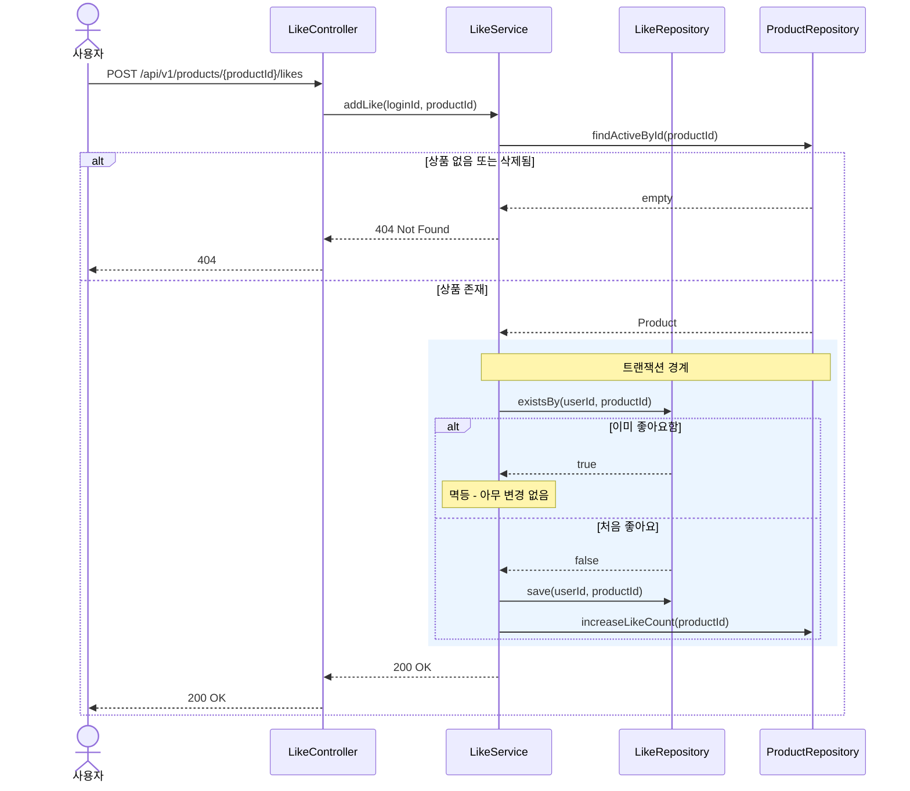
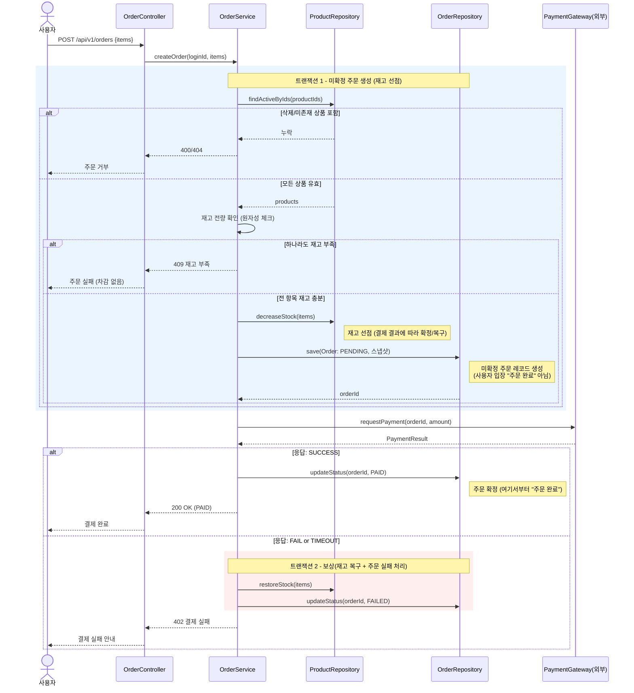
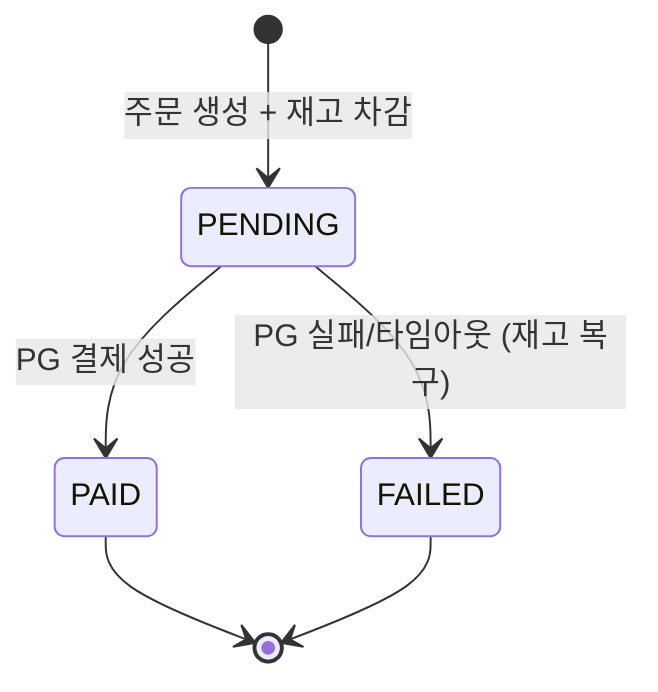

# 02. 시퀀스 다이어그램

> 책임 분리, 호출 순서, 트랜잭션 경계를 검증하기 위한 흐름도 (Mermaid)
> 각 다이어그램: 왜 필요한가 → 다이어그램 → 봐야 할 포인트 순서로 기술

---

## 2-1. 상품 좋아요 등록 (멱등)

### 왜 이 다이어그램이 필요한가
좋아요는 사용자가 버튼을 여러 번 누를 수 있어 멱등성이 핵심이다. 중복 요청이 들어와도 좋아요 수가 한 번만 증가하도록, 어느 객체가 "이미 좋아요했는지"를 판단하고 집계 컬럼을 갱신하는지 책임 경계를 확인한다.

### 이 구조에서 특히 봐야 할 포인트
- **포인트 1 (설계 의도)**: 멱등성 판단 책임은 `LikeService`가 `existsBy` 조회로 수행한다. 컨트롤러는 멱등 로직을 모른다 — 책임 분리.
- **포인트 2 (주의)**: `existsBy` 확인과 `save`+`increaseLikeCount`는 같은 트랜잭션 안에 있어야 한다. 그렇지 않으면 동시 요청 시 좋아요 수가 중복 증가할 수 있다(아래 ERD의 유니크 제약과 함께 방어).
- **포인트 3 (확장)**: 좋아요 수 집계 컬럼(`Product.likeCount`)을 두어 `likes_desc` 정렬 시 매번 count 하지 않도록 했다. 데이터 규모가 커져도 정렬 성능이 유지된다.

---

## 2-2. 주문 생성 및 결제 (재고 차감 + 외부 PG 연동)

### 왜 이 다이어그램이 필요한가
주문은 다건 상품의 재고를 원자적으로 차감하고, 외부 결제 시스템과 연동한 뒤 결과에 따라 재고를 복구해야 한다. 트랜잭션 경계가 어디까지인지, 외부 호출(PG) 실패 시 보상 처리(재고 복구)가 어느 책임 객체에서 일어나는지 검증한다.

### 이 구조에서 특히 봐야 할 포인트
- **포인트 1 (설계 의도)**: 트랜잭션이 둘로 나뉜다. **트랜잭션 1**(재고 차감+주문 생성)은 외부 호출 전에 닫는다. 외부 PG 호출을 DB 트랜잭션 안에 두면 PG 지연 시 커넥션이 오래 점유되기 때문이다.
- **포인트 2 (주의)**: PG 실패·타임아웃은 **보상 트랜잭션**(재고 복구 + 상태 `FAILED`)으로 처리한다. 결제 미확정(타임아웃)도 실패로 간주해 재고를 복구한다 — 정합성을 가용성보다 우선.
- **포인트 3 (확장)**: 주문 저장 시 상품 정보를 스냅샷으로 함께 저장한다. 이후 상품 가격/이름이 바뀌어도 과거 주문 내역은 영향받지 않는다. 향후 PG 콜백(웹훅) 방식으로 전환 시에도 주문 상태 머신(`PENDING→PAID/FAILED`)을 그대로 재사용할 수 있다.

---

## 보충: 상태 전이 요약

- 주문은 생성과 동시에 재고가 차감된 `PENDING` 상태로 시작한다.
- 종료 상태는 `PAID` 또는 `FAILED` 두 가지뿐이며, `FAILED`로 가는 경로에는 항상 재고 복구가 동반된다.
