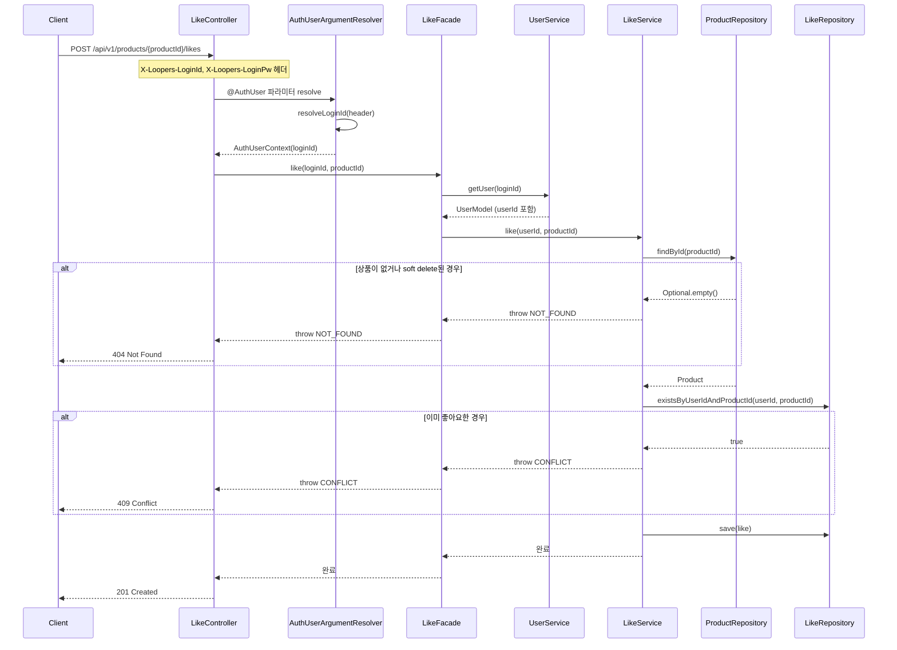
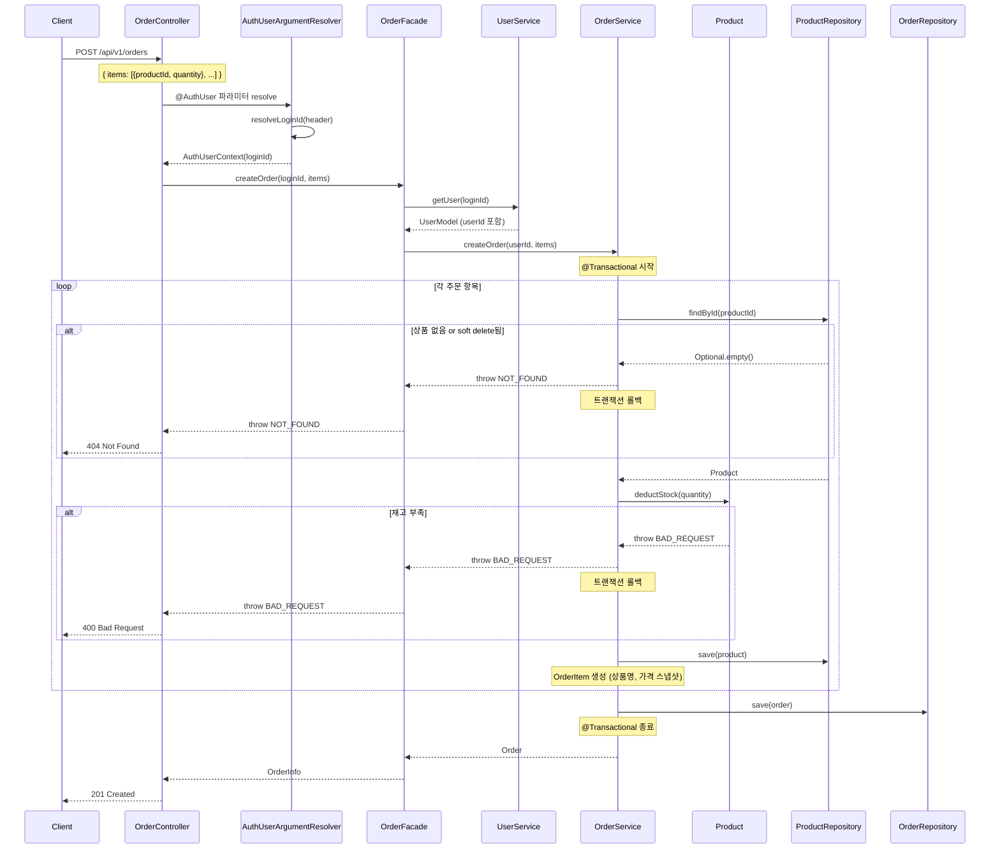
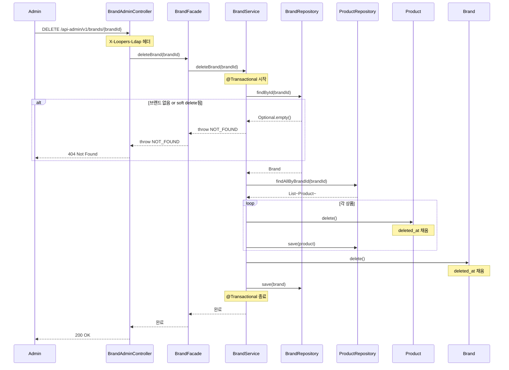

# 시퀀스 다이어그램

## 1. 좋아요 등록

인증 → 상품 존재 여부 → 중복 여부 순서로 책임이 분리되는지, 각 예외 처리가 어느 레이어에서 발생하는지 확인한다.

**읽는 포인트**
- soft delete된 상품은 `findById`에서 `deleted_at IS NULL` 조건으로 걸러진다.
- 중복 좋아요는 DB UK 제약보다 앞서 애플리케이션 레벨에서 먼저 확인한다.
- `AuthUserContext`는 `loginId`(String)만 가지며, Facade에서 `UserService.getUser()`를 통해 `userId`(Long)로 변환한다.
- 인증은 `AuthUserArgumentResolver`에서 완결되어 Controller에는 `AuthUserContext`만 전달된다.

---

## 2. 주문 생성

단일 트랜잭션 범위, 재고 차감 실패 시 전체 롤백 흐름, 스냅샷 저장 시점을 확인한다.

**읽는 포인트**
- `@Transactional`이 루프 전체를 감싸므로 중간 실패 시 이미 차감된 재고도 전부 롤백된다.
- 재고 차감 책임은 `OrderService`가 아닌 `Product.deductStock()`에 있다.
- `OrderItem` 생성 시점에 상품명과 가격을 직접 복사해두므로, 이후 상품 정보가 바뀌어도 주문 내역은 영향받지 않는다.
- loginId → userId 변환은 트랜잭션 바깥인 Facade에서 처리한다. OrderService는 순수하게 userId(Long)만 받는다.

---

## 3. 브랜드 삭제

브랜드 삭제 시 연관 상품도 soft delete 처리되는 흐름, 트랜잭션 범위를 확인한다.

**읽는 포인트**
- 상품 soft delete → 브랜드 soft delete 순서로 처리된다.
- 하나의 트랜잭션 안에서 처리되므로 중간 실패 시 전체 롤백, 부분 삭제 상태가 발생하지 않는다.
- `deleted_at`을 채우는 책임은 `Brand.delete()`, `Product.delete()` 도메인 메서드에 있으며, BaseEntity에서 상속된다.
- `ProductRepository.findAllByBrandId()`는 이미 soft delete된 상품은 제외하고 반환한다 (deletedAt IS NULL 조건).
