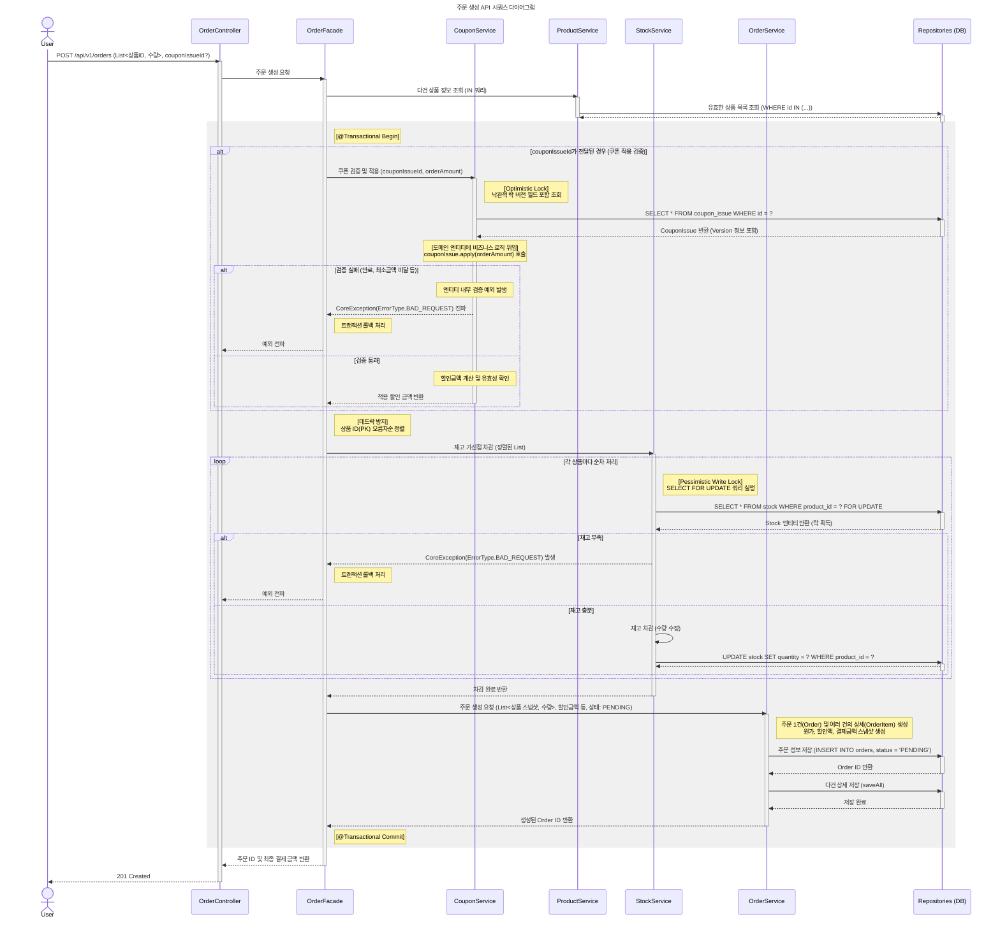
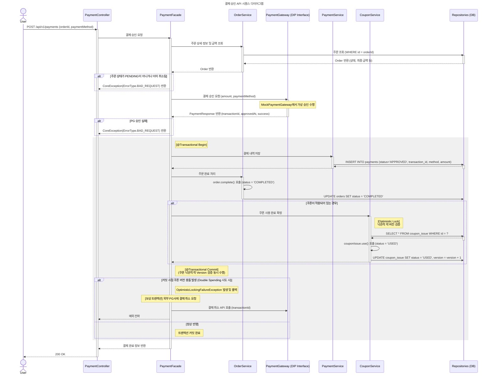
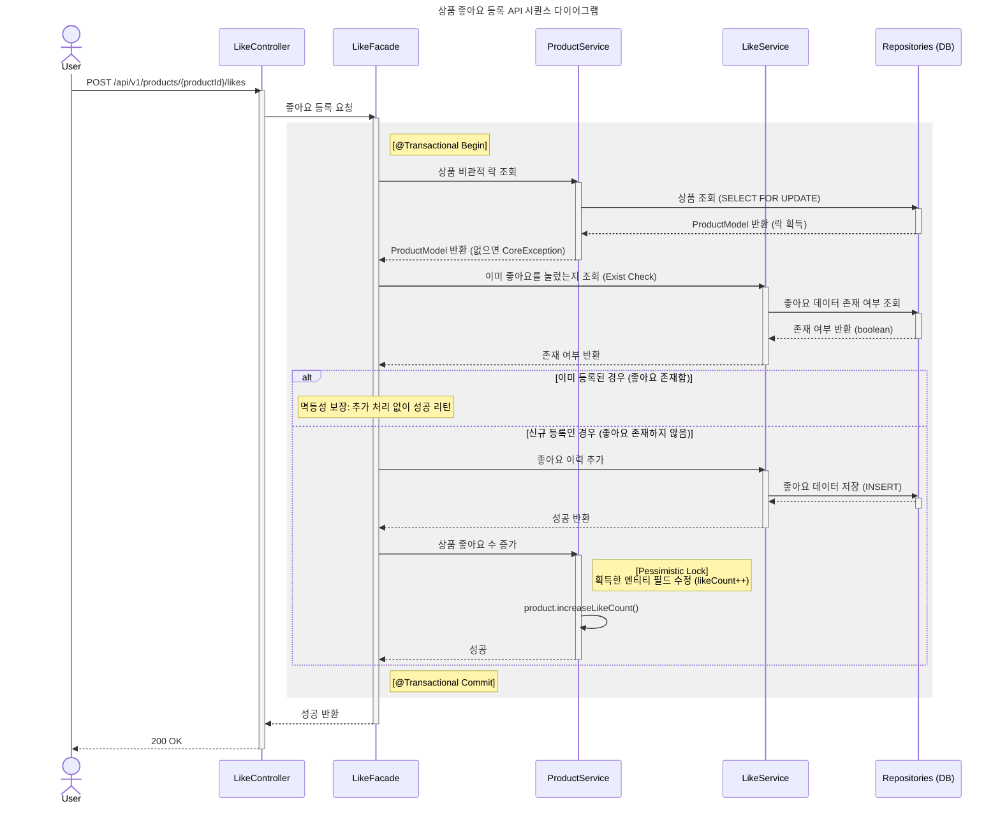
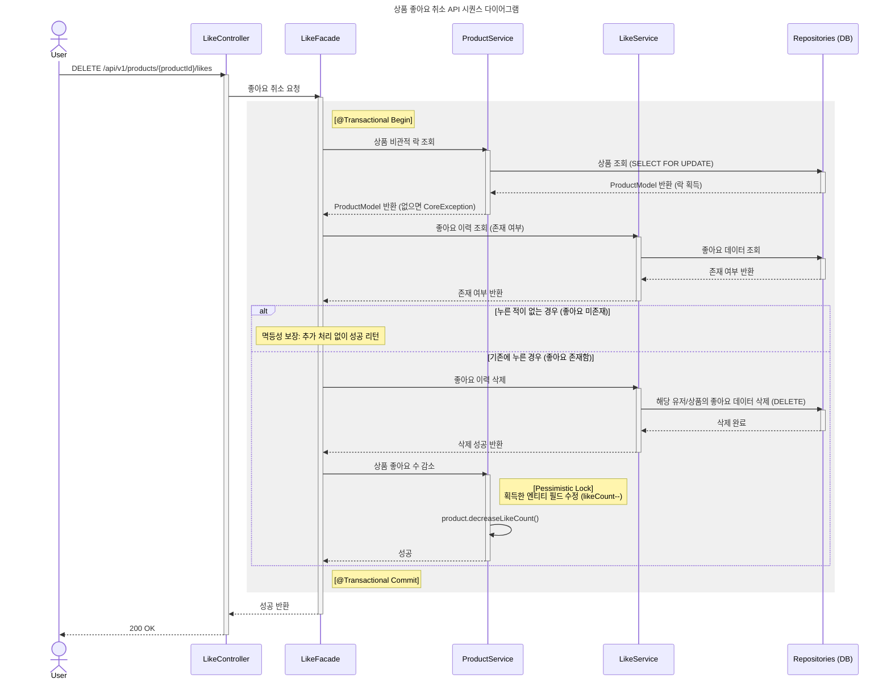
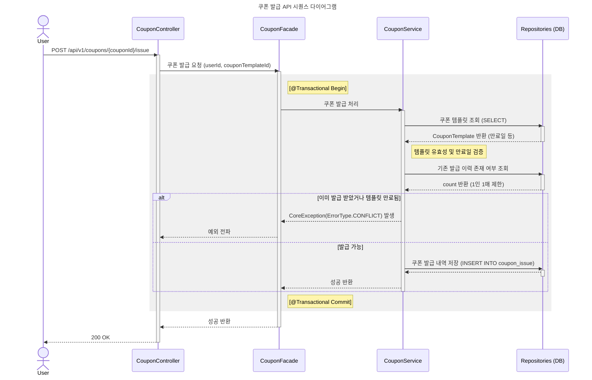

```mermaid
sequenceDiagram
    title 주문 생성 API 시퀀스 다이어그램
    actor User
    participant Controller as OrderController
    participant Facade as OrderFacade
    participant CouponSvc as CouponService
    participant ProductSvc as ProductService
    participant StockSvc as StockService
    participant OrderSvc as OrderService
    participant Repo as Repositories (DB)

    User->>Controller: POST /api/v1/orders (List<상품ID, 수량>, couponIssueId?)
    activate Controller

    Controller->>Facade: 주문 생성 요청
    activate Facade

    Facade->>ProductSvc: 다건 상품 정보 조회 (IN 쿼리)
    activate ProductSvc
    ProductSvc->>Repo: 유효한 상품 목록 조회 (WHERE id IN (...))
    activate Repo
    Repo-->>ProductSvc: 
    deactivate Repo
    deactivate ProductSvc

    rect rgb(240, 240, 240)
        Note right of Facade: [@Transactional Begin]
        
        alt couponIssueId가 전달된 경우 (쿠폰 적용 검증)
            Facade->>CouponSvc: 쿠폰 검증 및 적용 (couponIssueId, orderAmount)
            activate CouponSvc
            Note right of CouponSvc: [Optimistic Lock]<br/>낙관적 락 버전 필드 포함 조회
            CouponSvc->>Repo: SELECT * FROM coupon_issue WHERE id = ?
            activate Repo
            Repo-->>CouponSvc: CouponIssue 반환 (Version 정보 포함)
            deactivate Repo
            
            Note over CouponSvc: [도메인 엔티티에 비즈니스 로직 위임]<br/>couponIssue.apply(orderAmount) 호출
            
            alt 검증 실패 (만료, 최소금액 미달 등)
                Note over CouponSvc: 엔티티 내부 검증 예외 발생
                CouponSvc-->>Facade: CoreException(ErrorType.BAD_REQUEST) 전파
                Note right of Facade: 트랜잭션 롤백 처리
                Facade-->>Controller: 예외 전파
            else 검증 통과
                Note over CouponSvc: 할인금액 계산 및 유효성 확인
                CouponSvc-->>Facade: 적용 할인 금액 반환
                deactivate CouponSvc
            end
        end

        Note right of Facade: [데드락 방지]<br/>상품 ID(PK) 오름차순 정렬
        Facade->>StockSvc: 재고 가선점 차감 (정렬된 List)
        activate StockSvc
        
        loop 각 상품마다 순차 처리
            Note right of StockSvc: [Pessimistic Write Lock]<br/>SELECT FOR UPDATE 쿼리 실행
            StockSvc->>Repo: SELECT * FROM stock WHERE product_id = ? FOR UPDATE
            activate Repo
            Repo-->>StockSvc: Stock 엔티티 반환 (락 획득)
            deactivate Repo
            
            alt 재고 부족
                StockSvc-->>Facade: CoreException(ErrorType.BAD_REQUEST) 발생
                Note right of Facade: 트랜잭션 롤백 처리
                Facade-->>Controller: 예외 전파
            else 재고 충분
                StockSvc->>StockSvc: 재고 차감 (수량 수정)
                StockSvc->>Repo: UPDATE stock SET quantity = ? WHERE product_id = ?
                activate Repo
                Repo-->>StockSvc: 
                deactivate Repo
            end
        end
        StockSvc-->>Facade: 차감 완료 반환
        deactivate StockSvc

        Facade->>OrderSvc: 주문 생성 요청 (List<상품 스냅샷, 수량>, 할인금액 등, 상태: PENDING)
        activate OrderSvc
        Note right of OrderSvc: 주문 1건(Order) 및 여러 건의 상세(OrderItem) 생성<br/>원가, 할인액, 결제금액 스냅샷 생성
        
        OrderSvc->>Repo: 주문 정보 저장 (INSERT INTO orders, status = 'PENDING')
        activate Repo
        Repo-->>OrderSvc: Order ID 반환
        deactivate Repo
        
        OrderSvc->>Repo: 다건 상세 저장 (saveAll)
        activate Repo
        Repo-->>OrderSvc: 저장 완료
        deactivate Repo
        OrderSvc-->>Facade: 생성된 Order ID 반환
        deactivate OrderSvc

        Note right of Facade: [@Transactional Commit]
    end

    Facade-->>Controller: 주문 ID 및 최종 결제 금액 반환
    deactivate Facade
    Controller-->>User: 201 Created
    deactivate Controller
```

```mermaid
sequenceDiagram
    title 결제 승인 API 시퀀스 다이어그램
    actor User
    participant Controller as PaymentController
    participant Facade as PaymentFacade
    participant OrderSvc as OrderService
    participant PG as PaymentGateway (DIP Interface)
    participant PaySvc as PaymentService
    participant CouponSvc as CouponService
    participant Repo as Repositories (DB)

    User->>Controller: POST /api/v1/payments (orderId, paymentMethod)
    activate Controller

    Controller->>Facade: 결제 승인 요청
    activate Facade

    Facade->>OrderSvc: 주문 상세 정보 및 금액 조회
    activate OrderSvc
    OrderSvc->>Repo: 주문 조회 (WHERE id = orderId)
    activate Repo
    Repo-->>OrderSvc: Order 반환 (상태, 최종 금액 등)
    deactivate Repo
    OrderSvc-->>Facade: Order 반환
    deactivate OrderSvc

    alt 주문 상태가 PENDING이 아니거나 이미 취소됨
        Facade-->>Controller: CoreException(ErrorType.BAD_REQUEST) 반환
    end

    %% 외부 PG API 호출 (트랜잭션 외부)
    Facade->>PG: 결제 승인 요청 (amount, paymentMethod)
    activate PG
    Note over PG: MockPaymentGateway에서 가상 승인 수행
    PG-->>Facade: PaymentResponse 반환 (transactionId, approvedAt, success)
    deactivate PG

    alt PG 승인 실패
        Facade-->>Controller: CoreException(ErrorType.BAD_REQUEST) 반환
    end

    rect rgb(240, 240, 240)
        Note right of Facade: [@Transactional Begin]
        
        Facade->>PaySvc: 결제 내역 저장
        activate PaySvc
        PaySvc->>Repo: INSERT INTO payments (status='APPROVED', transaction_id, method, amount)
        activate Repo
        Repo-->>PaySvc: 
        deactivate Repo
        PaySvc-->>Facade: 
        deactivate PaySvc

        Facade->>OrderSvc: 주문 완료 처리
        activate OrderSvc
        OrderSvc->>OrderSvc: order.complete() 호출 (status = 'COMPLETED')
        OrderSvc->>Repo: UPDATE orders SET status = 'COMPLETED'
        deactivate OrderSvc

        alt 쿠폰이 적용되어 있는 경우
            Facade->>CouponSvc: 쿠폰 사용 완료 확정
            activate CouponSvc
            Note right of CouponSvc: [Optimistic Lock]<br/>낙관적 락 버전 검증
            CouponSvc->>Repo: SELECT * FROM coupon_issue WHERE id = ?
            activate Repo
            Repo-->>CouponSvc: 
            deactivate Repo
            CouponSvc->>CouponSvc: couponIssue.use() 호출 (status = 'USED')
            CouponSvc->>Repo: UPDATE coupon_issue SET status = 'USED', version = version + 1
            CouponSvc-->>Facade: 
            deactivate CouponSvc
        end

        Note right of Facade: [@Transactional Commit]<br/>(쿠폰 낙관적 락 Version 검증 동시 수행)
        alt 커밋 시점 쿠폰 버전 충돌 발생 (Double Spending 시도 시)
            Note right of Facade: OptimisticLockingFailureException 발생 및 롤백
            Note over Facade: [보상 트랜잭션] 외부 PG사에 결제 취소 요청
            Facade->>PG: 결제 취소 API 호출 (transactionId)
            Facade-->>Controller: 예외 전파
        else 정상 반영
            Note right of Facade: 트랜잭션 커밋 완료
        end
    end

    Facade-->>Controller: 결제 완료 정보 반환
    deactivate Facade
    Controller-->>User: 200 OK
    deactivate Controller
```

```mermaid
sequenceDiagram
    title 상품 좋아요 등록 API 시퀀스 다이어그램
    actor User
    participant Controller as LikeController
    participant Facade as LikeFacade
    participant ProductSvc as ProductService
    participant LikeSvc as LikeService
    participant Repo as Repositories (DB)

    User->>Controller: POST /api/v1/products/{productId}/likes
    activate Controller

    Controller->>Facade: 좋아요 등록 요청
    activate Facade

    rect rgb(240, 240, 240)
        Note right of Facade: [@Transactional Begin]

        Facade->>ProductSvc: 상품 비관적 락 조회
        activate ProductSvc
        ProductSvc->>Repo: 상품 조회 (SELECT FOR UPDATE)
        activate Repo
        Repo-->>ProductSvc: ProductModel 반환 (락 획득)
        deactivate Repo
        ProductSvc-->>Facade: ProductModel 반환 (없으면 CoreException)
        deactivate ProductSvc

        Facade->>LikeSvc: 이미 좋아요를 눌렀는지 조회 (Exist Check)
        activate LikeSvc
        LikeSvc->>Repo: 좋아요 데이터 존재 여부 조회
        activate Repo
        Repo-->>LikeSvc: 존재 여부 반환 (boolean)
        deactivate Repo
        LikeSvc-->>Facade: 존재 여부 반환
        deactivate LikeSvc

        alt 이미 등록된 경우 (좋아요 존재함)
            Note over Facade: 멱등성 보장: 추가 처리 없이 성공 리턴
        else 신규 등록인 경우 (좋아요 존재하지 않음)
            Facade->>LikeSvc: 좋아요 이력 추가
            activate LikeSvc
            LikeSvc->>Repo: 좋아요 데이터 저장 (INSERT)
            activate Repo
            Repo-->>LikeSvc: 
            deactivate Repo
            LikeSvc-->>Facade: 성공 반환
            deactivate LikeSvc

            Facade->>ProductSvc: 상품 좋아요 수 증가
            activate ProductSvc
            Note right of ProductSvc: [Pessimistic Lock]<br/>획득한 엔티티 필드 수정 (likeCount++)
            ProductSvc->>ProductSvc: product.increaseLikeCount()
            ProductSvc-->>Facade: 성공
            deactivate ProductSvc
        end

        Note right of Facade: [@Transactional Commit]
    end

    Facade-->>Controller: 성공 반환
    deactivate Facade

    Controller-->>User: 200 OK
    deactivate Controller
```

```mermaid
sequenceDiagram
    title 상품 좋아요 취소 API 시퀀스 다이어그램
    actor User
    participant Controller as LikeController
    participant Facade as LikeFacade
    participant ProductSvc as ProductService
    participant LikeSvc as LikeService
    participant Repo as Repositories (DB)

    User->>Controller: DELETE /api/v1/products/{productId}/likes
    activate Controller

    Controller->>Facade: 좋아요 취소 요청
    activate Facade

    rect rgb(240, 240, 240)
        Note right of Facade: [@Transactional Begin]

        Facade->>ProductSvc: 상품 비관적 락 조회
        activate ProductSvc
        ProductSvc->>Repo: 상품 조회 (SELECT FOR UPDATE)
        activate Repo
        Repo-->>ProductSvc: ProductModel 반환 (락 획득)
        deactivate Repo
        ProductSvc-->>Facade: ProductModel 반환 (없으면 CoreException)
        deactivate ProductSvc

        Facade->>LikeSvc: 좋아요 이력 조회 (존재 여부)
        activate LikeSvc
        LikeSvc->>Repo: 좋아요 데이터 조회
        activate Repo
        Repo-->>LikeSvc: 존재 여부 반환
        deactivate Repo
        LikeSvc-->>Facade: 존재 여부 반환
        deactivate LikeSvc

        alt 누른 적이 없는 경우 (좋아요 미존재)
            Note over Facade: 멱등성 보장: 추가 처리 없이 성공 리턴
        else 기존에 누른 경우 (좋아요 존재함)
            Facade->>LikeSvc: 좋아요 이력 삭제
            activate LikeSvc
            LikeSvc->>Repo: 해당 유저/상품의 좋아요 데이터 삭제 (DELETE)
            activate Repo
            Repo-->>LikeSvc: 삭제 완료
            deactivate Repo
            LikeSvc-->>Facade: 삭제 성공 반환
            deactivate LikeSvc

            Facade->>ProductSvc: 상품 좋아요 수 감소
            activate ProductSvc
            Note right of ProductSvc: [Pessimistic Lock]<br/>획득한 엔티티 필드 수정 (likeCount--)
            ProductSvc->>ProductSvc: product.decreaseLikeCount()
            ProductSvc-->>Facade: 성공
            deactivate ProductSvc
        end

        Note right of Facade: [@Transactional Commit]
    end

    Facade-->>Controller: 성공 반환
    deactivate Facade

    Controller-->>User: 200 OK
    deactivate Controller
```

```mermaid
sequenceDiagram
    title 쿠폰 발급 API 시퀀스 다이어그램
    actor User
    participant Controller as CouponController
    participant Facade as CouponFacade
    participant CouponSvc as CouponService
    participant Repo as Repositories (DB)

    User->>Controller: POST /api/v1/coupons/{couponId}/issue
    activate Controller

    Controller->>Facade: 쿠폰 발급 요청 (userId, couponTemplateId)
    activate Facade

    rect rgb(240, 240, 240)
        Note right of Facade: [@Transactional Begin]

        Facade->>CouponSvc: 쿠폰 발급 처리
        activate CouponSvc

        CouponSvc->>Repo: 쿠폰 템플릿 조회 (SELECT)
        activate Repo
        Repo-->>CouponSvc: CouponTemplate 반환 (만료일 등)
        deactivate Repo

        Note right of CouponSvc: 템플릿 유효성 및 만료일 검증
        
        CouponSvc->>Repo: 기존 발급 이력 존재 여부 조회
        activate Repo
        Repo-->>CouponSvc: count 반환 (1인 1매 제한)
        deactivate Repo

        alt 이미 발급 받았거나 템플릿 만료됨
            CouponSvc-->>Facade: CoreException(ErrorType.CONFLICT) 발생
            Facade-->>Controller: 예외 전파
        else 발급 가능
            CouponSvc->>Repo: 쿠폰 발급 내역 저장 (INSERT INTO coupon_issue)
            activate Repo
            Repo-->>CouponSvc: 
            deactivate Repo
            CouponSvc-->>Facade: 성공 반환
        end
        deactivate CouponSvc

        Note right of Facade: [@Transactional Commit]
    end

    Facade-->>Controller: 성공 반환
    deactivate Facade
    Controller-->>User: 200 OK
    deactivate Controller
```