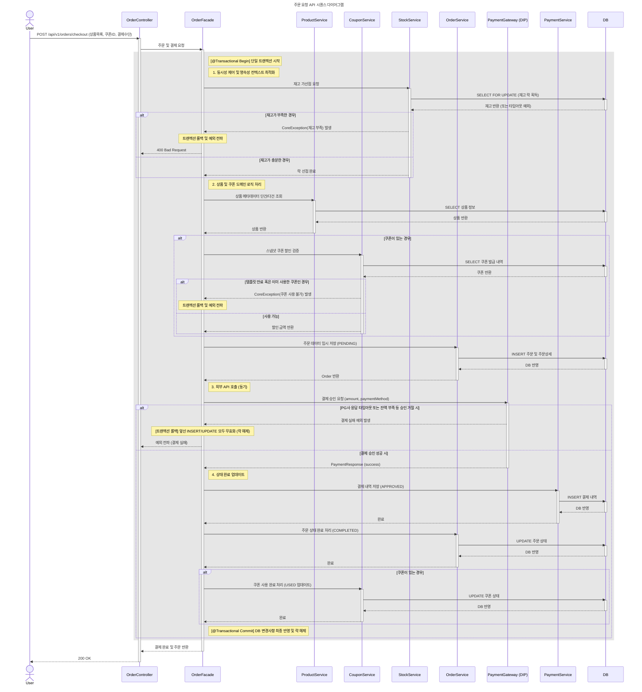
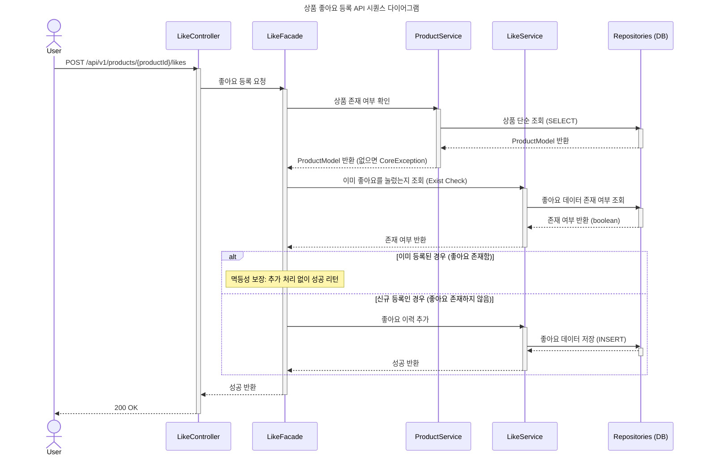
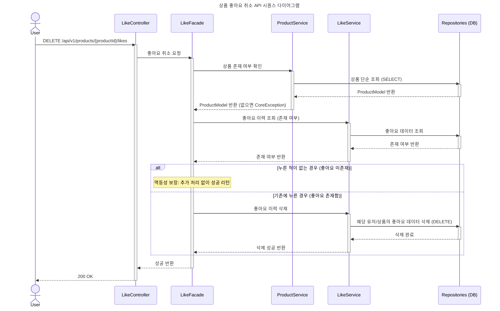
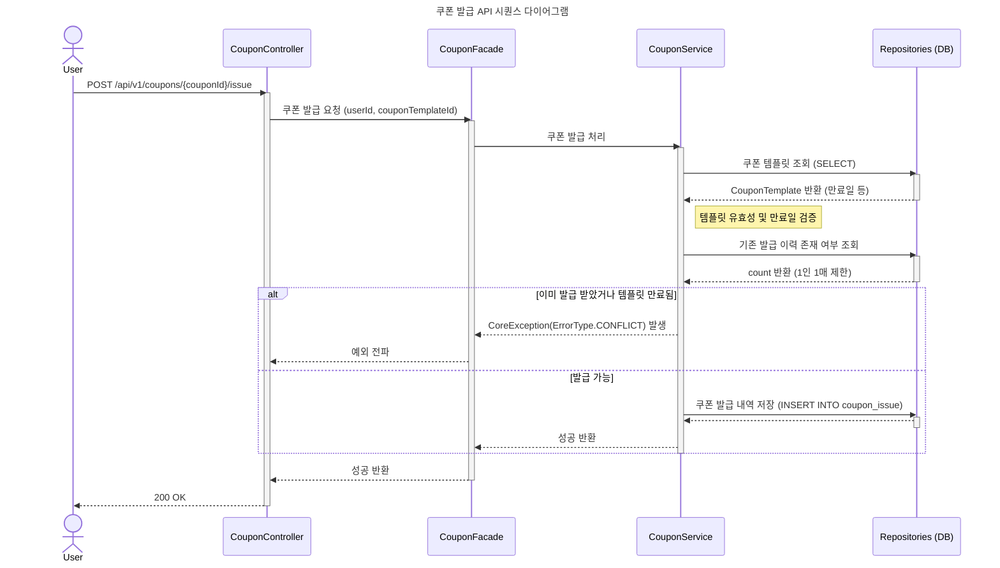
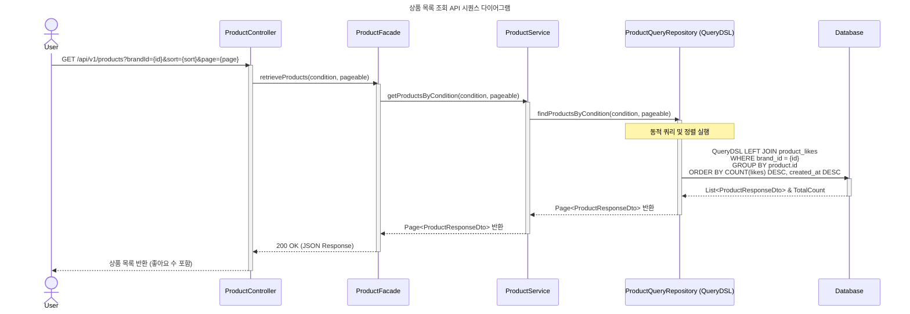

```mermaid
sequenceDiagram
    title 주문 요청 API 시퀀스 다이어그램
    actor User
    participant Controller as OrderController
    participant Facade as OrderFacade
    participant ProductSvc as ProductService
    participant CouponSvc as CouponService
    participant StockSvc as StockService
    participant OrderSvc as OrderService
    participant PG as PaymentGateway (DIP)
    participant PaySvc as PaymentService
    participant Repo as DB

    User->>Controller: POST /api/v1/orders/checkout (상품목록, 쿠폰ID, 결제수단)
    activate Controller

    Controller->>Facade: 주문 및 결제 요청
    activate Facade

    rect rgba(128, 128, 128, 0.2)
        Note right of Facade: [@Transactional Begin] 단일 트랜잭션 시작

        Note right of Facade: 1. 동시성 제어 및 영속성 컨텍스트 최적화
        Facade->>StockSvc: 재고 가선점 요청
        activate StockSvc
        StockSvc->>Repo: SELECT FOR UPDATE (재고 락 획득)
        activate Repo
        Repo-->>StockSvc: 재고 반환 (또는 타임아웃 예외)
        deactivate Repo
        
        alt 재고가 부족한 경우
            StockSvc-->>Facade: CoreException(재고 부족) 발생
            Note over Facade: 트랜잭션 롤백 및 예외 전파
            Facade-->>Controller: 400 Bad Request
        else 재고가 충분한 경우
            StockSvc-->>Facade: 락 선점 완료
        end
        deactivate StockSvc

        Note right of Facade: 2. 상품 및 쿠폰 도메인 로직 처리
        Facade->>ProductSvc: 상품 메타데이터 단건/다건 조회
        activate ProductSvc
        ProductSvc->>Repo: SELECT 상품 정보
        activate Repo
        Repo-->>ProductSvc: 상품 반환
        deactivate Repo
        ProductSvc-->>Facade: 상품 반환
        deactivate ProductSvc

        alt 쿠폰이 있는 경우
            Facade->>CouponSvc: 스냅샷 쿠폰 할인 검증
            activate CouponSvc
            CouponSvc->>Repo: SELECT 쿠폰 발급 내역
            activate Repo
            Repo-->>CouponSvc: 쿠폰 반환
            deactivate Repo
            alt 템플릿 만료 혹은 이미 사용한 쿠폰인 경우
                CouponSvc-->>Facade: CoreException(쿠폰 사용 불가) 발생
                Note over Facade: 트랜잭션 롤백 및 예외 전파
            else 사용 가능
                CouponSvc-->>Facade: 할인 금액 반환
            end
            deactivate CouponSvc
        end

        Facade->>OrderSvc: 주문 데이터 임시 저장 (PENDING)
        activate OrderSvc
        OrderSvc->>Repo: INSERT 주문 및 주문상세
        activate Repo
        Repo-->>OrderSvc: DB 반영
        deactivate Repo
        OrderSvc-->>Facade: Order 반환
        deactivate OrderSvc

        Note right of Facade: 3. 외부 API 호출 (동기)
        Facade->>PG: 결제 승인 요청 (amount, paymentMethod)
        activate PG
        
        alt PG사 응답 타임아웃 또는 잔액 부족 등 승인 거절 시
            PG-->>Facade: 결제 실패 예외 발생
            Note over Facade: [트랜잭션 롤백] 앞선 INSERT/UPDATE 모두 무효화 (락 해제)
            Facade-->>Controller: 예외 전파 (결제 실패)
        else 결제 승인 성공 시
            PG-->>Facade: PaymentResponse (success)
            deactivate PG

            Note right of Facade: 4. 상태 완료 업데이트
            Facade->>PaySvc: 결제 내역 저장 (APPROVED)
            activate PaySvc
            PaySvc->>Repo: INSERT 결제 내역
            activate Repo
            Repo-->>PaySvc: DB 반영
            deactivate Repo
            PaySvc-->>Facade: 완료
            deactivate PaySvc

            Facade->>OrderSvc: 주문 상태 완료 처리 (COMPLETED)
            activate OrderSvc
            OrderSvc->>Repo: UPDATE 주문 상태
            activate Repo
            Repo-->>OrderSvc: DB 반영
            deactivate Repo
            OrderSvc-->>Facade: 완료
            deactivate OrderSvc

            alt 쿠폰이 있는 경우
                Facade->>CouponSvc: 쿠폰 사용 완료 처리 (USED 업데이트)
                activate CouponSvc
                CouponSvc->>Repo: UPDATE 쿠폰 상태
                activate Repo
                Repo-->>CouponSvc: DB 반영
                deactivate Repo
                CouponSvc-->>Facade: 완료
                deactivate CouponSvc
            end

            Note right of Facade: [@Transactional Commit] DB 변경사항 최종 반영 및 락 해제
        end
    end

    Facade-->>Controller: 결제 완료 및 주문 반환
    deactivate Facade
    Controller-->>User: 200 OK
    deactivate Controller
```

```mermaid
sequenceDiagram
    title 상품 좋아요 등록 API 시퀀스 다이어그램
    actor User
    participant Controller as LikeController
    participant Facade as LikeFacade
    participant ProductSvc as ProductService
    participant LikeSvc as LikeService
    participant Repo as Repositories (DB)

    User->>Controller: POST /api/v1/products/{productId}/likes
    activate Controller

    Controller->>Facade: 좋아요 등록 요청
    activate Facade


        Facade->>ProductSvc: 상품 존재 여부 확인
        activate ProductSvc
        ProductSvc->>Repo: 상품 단순 조회 (SELECT)
        activate Repo
        Repo-->>ProductSvc: ProductModel 반환
        deactivate Repo
        ProductSvc-->>Facade: ProductModel 반환 (없으면 CoreException)
        deactivate ProductSvc

        Facade->>LikeSvc: 이미 좋아요를 눌렀는지 조회 (Exist Check)
        activate LikeSvc
        LikeSvc->>Repo: 좋아요 데이터 존재 여부 조회
        activate Repo
        Repo-->>LikeSvc: 존재 여부 반환 (boolean)
        deactivate Repo
        LikeSvc-->>Facade: 존재 여부 반환
        deactivate LikeSvc

        alt 이미 등록된 경우 (좋아요 존재함)
            Note over Facade: 멱등성 보장: 추가 처리 없이 성공 리턴
        else 신규 등록인 경우 (좋아요 존재하지 않음)
            Facade->>LikeSvc: 좋아요 이력 추가
            activate LikeSvc
            LikeSvc->>Repo: 좋아요 데이터 저장 (INSERT)
            activate Repo
            Repo-->>LikeSvc: 
            deactivate Repo
            LikeSvc-->>Facade: 성공 반환
            deactivate LikeSvc
        end


    Facade-->>Controller: 성공 반환
    deactivate Facade

    Controller-->>User: 200 OK
    deactivate Controller
```

```mermaid
sequenceDiagram
    title 상품 좋아요 취소 API 시퀀스 다이어그램
    actor User
    participant Controller as LikeController
    participant Facade as LikeFacade
    participant ProductSvc as ProductService
    participant LikeSvc as LikeService
    participant Repo as Repositories (DB)

    User->>Controller: DELETE /api/v1/products/{productId}/likes
    activate Controller

    Controller->>Facade: 좋아요 취소 요청
    activate Facade


        Facade->>ProductSvc: 상품 존재 여부 확인
        activate ProductSvc
        ProductSvc->>Repo: 상품 단순 조회 (SELECT)
        activate Repo
        Repo-->>ProductSvc: ProductModel 반환
        deactivate Repo
        ProductSvc-->>Facade: ProductModel 반환 (없으면 CoreException)
        deactivate ProductSvc

        Facade->>LikeSvc: 좋아요 이력 조회 (존재 여부)
        activate LikeSvc
        LikeSvc->>Repo: 좋아요 데이터 조회
        activate Repo
        Repo-->>LikeSvc: 존재 여부 반환
        deactivate Repo
        LikeSvc-->>Facade: 존재 여부 반환
        deactivate LikeSvc

        alt 누른 적이 없는 경우 (좋아요 미존재)
            Note over Facade: 멱등성 보장: 추가 처리 없이 성공 리턴
        else 기존에 누른 경우 (좋아요 존재함)
            Facade->>LikeSvc: 좋아요 이력 삭제
            activate LikeSvc
            LikeSvc->>Repo: 해당 유저/상품의 좋아요 데이터 삭제 (DELETE)
            activate Repo
            Repo-->>LikeSvc: 삭제 완료
            deactivate Repo
            LikeSvc-->>Facade: 삭제 성공 반환
            deactivate LikeSvc
        end


    Facade-->>Controller: 성공 반환
    deactivate Facade

    Controller-->>User: 200 OK
    deactivate Controller
```

```mermaid
sequenceDiagram
    title 쿠폰 발급 API 시퀀스 다이어그램
    actor User
    participant Controller as CouponController
    participant Facade as CouponFacade
    participant CouponSvc as CouponService
    participant Repo as Repositories (DB)

    User->>Controller: POST /api/v1/coupons/{couponId}/issue
    activate Controller

    Controller->>Facade: 쿠폰 발급 요청 (userId, couponTemplateId)
    activate Facade


        Facade->>CouponSvc: 쿠폰 발급 처리
        activate CouponSvc

        CouponSvc->>Repo: 쿠폰 템플릿 조회 (SELECT)
        activate Repo
        Repo-->>CouponSvc: CouponTemplate 반환 (만료일 등)
        deactivate Repo

        Note right of CouponSvc: 템플릿 유효성 및 만료일 검증
        
        CouponSvc->>Repo: 기존 발급 이력 존재 여부 조회
        activate Repo
        Repo-->>CouponSvc: count 반환 (1인 1매 제한)
        deactivate Repo

        alt 이미 발급 받았거나 템플릿 만료됨
            CouponSvc-->>Facade: CoreException(ErrorType.CONFLICT) 발생
            Facade-->>Controller: 예외 전파
        else 발급 가능
            CouponSvc->>Repo: 쿠폰 발급 내역 저장 (INSERT INTO coupon_issue)
            activate Repo
            Repo-->>CouponSvc: 
            deactivate Repo
            CouponSvc-->>Facade: 성공 반환
        end
        deactivate CouponSvc


    Facade-->>Controller: 성공 반환
    deactivate Facade
    Controller-->>User: 200 OK
    deactivate Controller
```

```mermaid
sequenceDiagram
    title 상품 목록 조회 API 시퀀스 다이어그램
    actor User
    participant Controller as ProductController
    participant Facade as ProductFacade
    participant ProductSvc as ProductService
    participant Repo as ProductQueryRepository (QueryDSL)
    participant DB as Database

    User->>Controller: GET /api/v1/products?brandId={id}&sort={sort}&page={page}
    activate Controller

    Controller->>Facade: retrieveProducts(condition, pageable)
    activate Facade


    Facade->>ProductSvc: getProductsByCondition(condition, pageable)
    activate ProductSvc

    ProductSvc->>Repo: findProductsByCondition(condition, pageable)
    activate Repo
    
    Note over Repo: 동적 쿼리 및 정렬 실행
    Repo->>DB: QueryDSL LEFT JOIN product_likes<br/>WHERE brand_id = {id}<br/>GROUP BY product.id<br/>ORDER BY COUNT(likes) DESC, created_at DESC
    activate DB
    DB-->>Repo: List<ProductResponseDto> & TotalCount
    deactivate DB

    Repo-->>ProductSvc: Page<ProductResponseDto> 반환
    deactivate Repo

    ProductSvc-->>Facade: Page<ProductResponseDto> 반환
    deactivate ProductSvc

    Facade-->>Controller: 200 OK (JSON Response)
    deactivate Facade

    Controller-->>User: 상품 목록 반환 (좋아요 수 포함)
    deactivate Controller
```