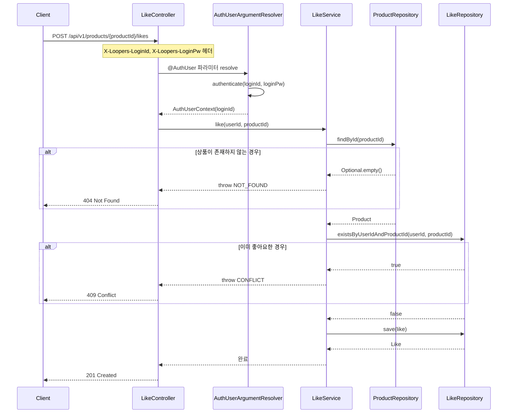
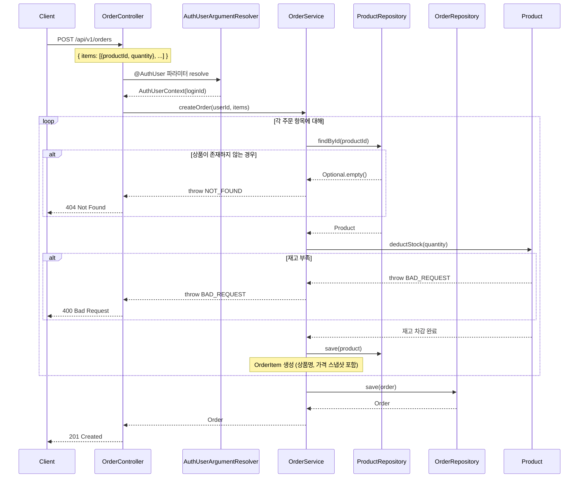
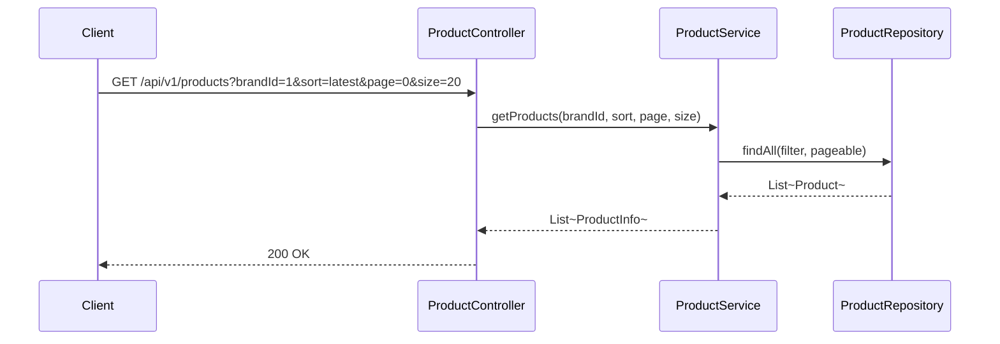

# 시퀀스 다이어그램

## 1. 좋아요 등록

**검증할 것**: 인증 → 상품 존재 여부 → 중복 여부 순서가 맞는지, 좋아요 등록의 책임 분리가 적절한지.

---

## 2. 주문 생성

**검증할 것**: 재고 확인과 차감이 하나의 트랜잭션 안에서 처리되는지, 스냅샷 저장 시점이 언제인지.

---

## 3. 상품 목록 조회

**검증할 것**: 정렬/필터 조건이 어느 레이어에서 처리되는지, 좋아요 수 정렬 시 어떤 방식으로 집계하는지.

---

## 설계 고민

**주문 생성 트랜잭션 범위**

재고 확인과 차감이 같은 트랜잭션 안에 있어야 한다.
여러 상품에 대해 루프를 돌면서 차감하므로, 중간에 하나라도 실패하면 전체 롤백이 보장되어야 한다.

**좋아요 수 기반 정렬**

`likes_desc` 정렬 시 상품별 좋아요 수를 집계해야 한다.
현재 설계에서는 `likes` 테이블 COUNT JOIN으로 처리.
상품 수가 많아지면 성능 이슈가 될 수 있어, 추후 `products.like_count` 캐시 컬럼 도입을 고려할 수 있다.
