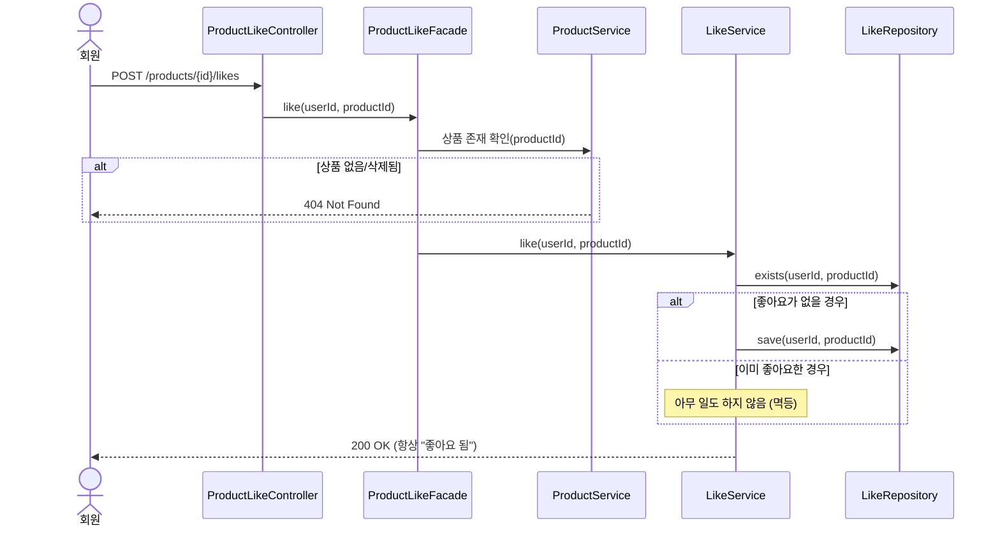
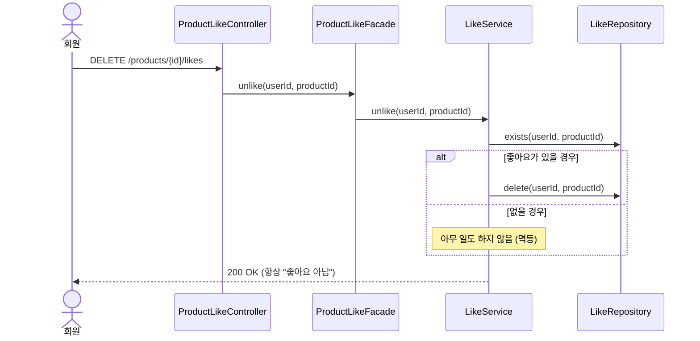
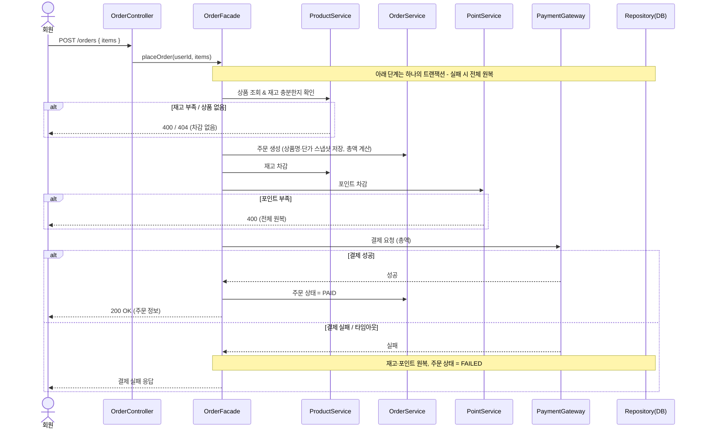
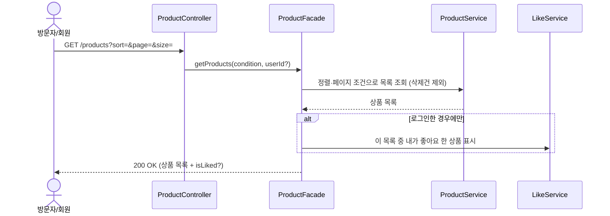

# 02. 시퀀스 다이어그램

> 시퀀스 다이어그램은 **"누가 무엇을 책임지고, 어떤 순서로 일이 일어나는가"** 를 그림으로 보여줍니다.
> 프론트엔드·기획·백엔드가 흐름을 같은 그림으로 이해하기 위한 도구입니다.

## 읽는 법 (공통)

각 흐름은 아래 계층을 따라 메시지가 흐릅니다.

```
사용자 → Controller → Application(Facade) → Domain(Service/Entity) → Infra(Repository)
```

- **Controller**: 요청을 받고 응답을 돌려주는 입구
- **Application(Facade)**: 여러 도메인을 엮어 하나의 작업으로 조립
- **Domain**: 실제 규칙(좋아요 중복 여부, 재고 충분 여부 등)을 판단하는 곳
- **Infra(Repository)**: DB에 저장/조회

> 흐름이 너무 잡다해지지 않도록 **핵심 책임이 드러나는 메시지만** 그립니다.

---

## 1. 좋아요 등록 / 취소 (멱등)

### 왜 이 다이어그램이 필요한가
좋아요는 **여러 번 눌러도 결과가 같아야 하는** 멱등 동작입니다.
"이미 좋아요한 상태에서 또 누르면?", "안 누른 상태에서 취소하면?" 을 흐름으로 검증합니다.

### 다이어그램 - 등록


### 다이어그램 - 취소


### 이 구조에서 봐야 할 포인트
- **멱등성의 핵심은 "존재 여부 확인 → 분기"** 입니다. 이미 있으면 저장하지 않고, 없으면 삭제하지 않습니다.
- 결과는 호출 횟수와 무관하게 항상 같습니다 → 네트워크 재시도·더블클릭에 안전.
- 중복 저장 자체를 막기 위해 DB에 (회원, 상품) **유니크 제약**을 함께 둡니다. (04-erd 참고)

---

## 2. 주문 생성 & 결제

### 왜 이 다이어그램이 필요한가
주문은 **재고 차감 · 포인트 차감 · 외부 결제**가 한 흐름에서 일어납니다.
"중간에 하나라도 실패하면 어떻게 되는가" 즉 **트랜잭션 경계와 원복 책임**을 검증하는 것이 목적입니다.

### 다이어그램


### 이 구조에서 봐야 할 포인트
- **재고·포인트 차감과 외부 결제 결과가 어긋나지 않는 것**이 이 흐름의 전부입니다.
- 어느 단계에서 실패하든 결과는 둘 중 하나로만 수렴합니다: **(전부 차감 + PAID)** 또는 **(아무것도 차감 안 됨 + FAILED)**.
- 주문 항목은 이 시점의 상품명·단가를 **스냅샷으로 복사**하므로, 이후 상품 가격이 바뀌어도 주문 내역은 변하지 않습니다.

### 리스크와 선택지
- **외부 결제는 우리가 통제할 수 없습니다.** 응답이 늦거나 끊기면 "결제됐는데 우리는 실패로 처리"하는 어긋남이 생길 수 있습니다.
  - 선택지 A: 단일 트랜잭션 + 실패 시 즉시 원복 → **구현 단순(이번 채택)**, 외부 지연에 약함
  - 선택지 B: 주문 생성과 결제를 분리하고 상태로 추적 → 구조 복잡, 외부 지연/재시도에 강함
- 시나리오상 결제는 "추후 확장" 영역이므로, 이번엔 **A(단순)** 로 두고 B는 향후 과제로 남깁니다.

---

## 3. 상품 목록 조회

### 왜 이 다이어그램이 필요한가
조회는 단순해 보이지만 **"로그인 여부에 따라 응답이 달라지는"** 분기가 있습니다.
이 분기 책임이 어디에 있는지 확인합니다.

### 다이어그램


### 이 구조에서 봐야 할 포인트
- **목록 조회(Product)** 와 **개인화(Like)** 책임이 분리되어 있습니다.
- 비로그인 사용자에겐 좋아요 여부 조회 자체를 건너뜁니다 → 불필요한 작업 없음.
- 삭제된 브랜드·상품 제외는 조회 단계에서 일괄 처리합니다.
