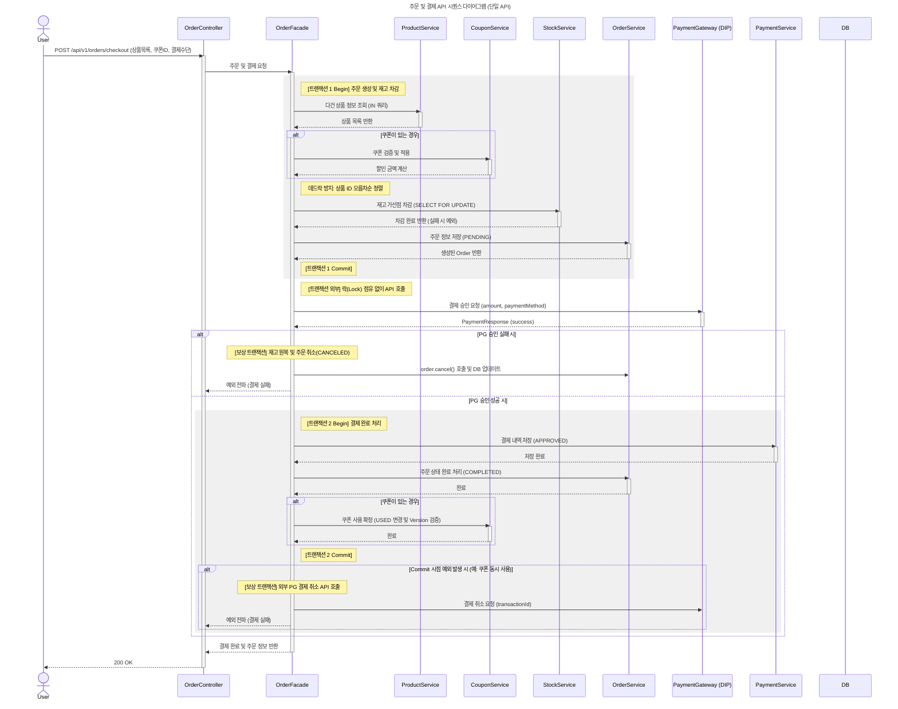
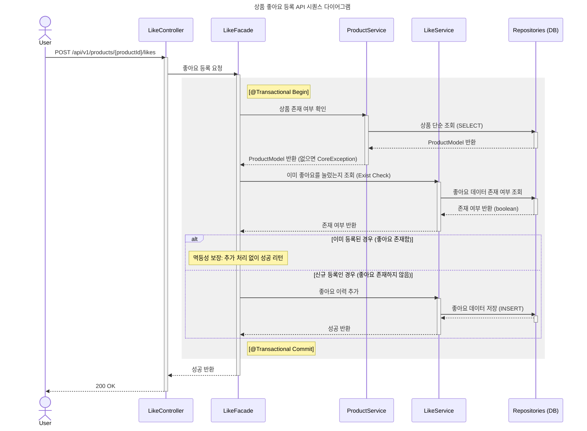
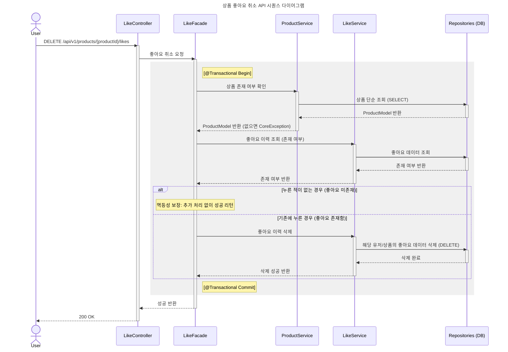
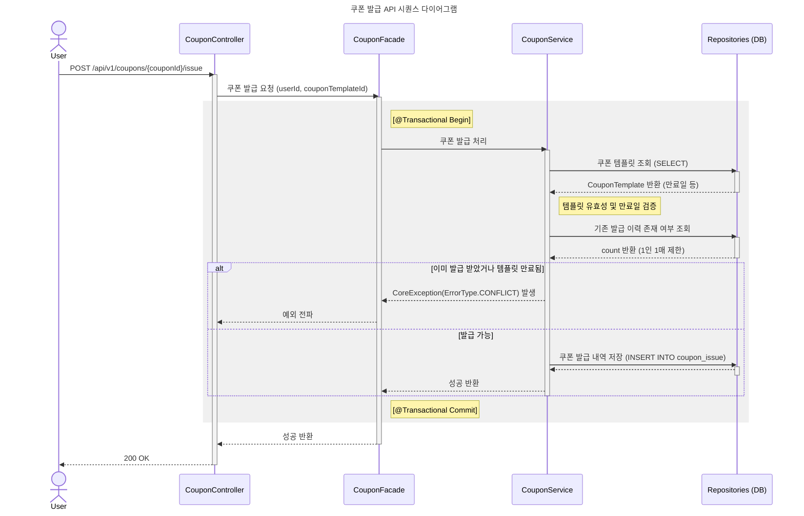

```mermaid
sequenceDiagram
    title 주문 및 결제 API 시퀀스 다이어그램 (단일 API)
    actor User
    participant Controller as OrderController
    participant Facade as OrderFacade
    participant ProductSvc as ProductService
    participant CouponSvc as CouponService
    participant StockSvc as StockService
    participant OrderSvc as OrderService
    participant PG as PaymentGateway (DIP)
    participant PaySvc as PaymentService
    participant Repo as DB

    User->>Controller: POST /api/v1/orders/checkout (상품목록, 쿠폰ID, 결제수단)
    activate Controller

    Controller->>Facade: 주문 및 결제 요청
    activate Facade

    rect rgb(240, 240, 240)
        Note right of Facade: [트랜잭션 1 Begin] 주문 생성 및 재고 차감

        Facade->>ProductSvc: 다건 상품 정보 조회 (IN 쿼리)
        activate ProductSvc
        ProductSvc-->>Facade: 상품 목록 반환
        deactivate ProductSvc

        alt 쿠폰이 있는 경우
            Facade->>CouponSvc: 쿠폰 검증 및 적용
            activate CouponSvc
            CouponSvc-->>Facade: 할인 금액 계산
            deactivate CouponSvc
        end

        Note right of Facade: 데드락 방지: 상품 ID 오름차순 정렬
        Facade->>StockSvc: 재고 가선점 차감 (SELECT FOR UPDATE)
        activate StockSvc
        StockSvc-->>Facade: 차감 완료 반환 (실패 시 예외)
        deactivate StockSvc

        Facade->>OrderSvc: 주문 정보 저장 (PENDING)
        activate OrderSvc
        OrderSvc-->>Facade: 생성된 Order 반환
        deactivate OrderSvc

        Note right of Facade: [트랜잭션 1 Commit]
    end

    %% 외부 PG API 호출 (트랜잭션 외부)
    Note right of Facade: [트랜잭션 외부] 락(Lock) 점유 없이 API 호출
    Facade->>PG: 결제 승인 요청 (amount, paymentMethod)
    activate PG
    PG-->>Facade: PaymentResponse (success)
    deactivate PG

    alt PG 승인 실패 시
        Note over Facade: [보상 트랜잭션] 재고 원복 및 주문 취소(CANCELED)
        Facade->>OrderSvc: order.cancel() 호출 및 DB 업데이트
        Facade-->>Controller: 예외 전파 (결제 실패)
    else PG 승인 성공 시
        rect rgb(240, 240, 240)
            Note right of Facade: [트랜잭션 2 Begin] 결제 완료 처리
            
            Facade->>PaySvc: 결제 내역 저장 (APPROVED)
            activate PaySvc
            PaySvc-->>Facade: 저장 완료
            deactivate PaySvc

            Facade->>OrderSvc: 주문 상태 완료 처리 (COMPLETED)
            activate OrderSvc
            OrderSvc-->>Facade: 완료
            deactivate OrderSvc

            alt 쿠폰이 있는 경우
                Facade->>CouponSvc: 쿠폰 사용 확정 (USED 변경 및 Version 검증)
                activate CouponSvc
                CouponSvc-->>Facade: 완료
                deactivate CouponSvc
            end

            Note right of Facade: [트랜잭션 2 Commit] 
            alt Commit 시점 예외 발생 시 (예: 쿠폰 동시 사용)
                Note over Facade: [보상 트랜잭션] 외부 PG 결제 취소 API 호출
                Facade->>PG: 결제 취소 요청 (transactionId)
                Facade-->>Controller: 예외 전파 (결제 실패)
            end
        end
    end

    Facade-->>Controller: 결제 완료 및 주문 정보 반환
    deactivate Facade
    Controller-->>User: 200 OK
    deactivate Controller
```

```mermaid
sequenceDiagram
    title 상품 좋아요 등록 API 시퀀스 다이어그램
    actor User
    participant Controller as LikeController
    participant Facade as LikeFacade
    participant ProductSvc as ProductService
    participant LikeSvc as LikeService
    participant Repo as Repositories (DB)

    User->>Controller: POST /api/v1/products/{productId}/likes
    activate Controller

    Controller->>Facade: 좋아요 등록 요청
    activate Facade

    rect rgb(240, 240, 240)
        Note right of Facade: [@Transactional Begin]

        Facade->>ProductSvc: 상품 존재 여부 확인
        activate ProductSvc
        ProductSvc->>Repo: 상품 단순 조회 (SELECT)
        activate Repo
        Repo-->>ProductSvc: ProductModel 반환
        deactivate Repo
        ProductSvc-->>Facade: ProductModel 반환 (없으면 CoreException)
        deactivate ProductSvc

        Facade->>LikeSvc: 이미 좋아요를 눌렀는지 조회 (Exist Check)
        activate LikeSvc
        LikeSvc->>Repo: 좋아요 데이터 존재 여부 조회
        activate Repo
        Repo-->>LikeSvc: 존재 여부 반환 (boolean)
        deactivate Repo
        LikeSvc-->>Facade: 존재 여부 반환
        deactivate LikeSvc

        alt 이미 등록된 경우 (좋아요 존재함)
            Note over Facade: 멱등성 보장: 추가 처리 없이 성공 리턴
        else 신규 등록인 경우 (좋아요 존재하지 않음)
            Facade->>LikeSvc: 좋아요 이력 추가
            activate LikeSvc
            LikeSvc->>Repo: 좋아요 데이터 저장 (INSERT)
            activate Repo
            Repo-->>LikeSvc: 
            deactivate Repo
            LikeSvc-->>Facade: 성공 반환
            deactivate LikeSvc
        end

        Note right of Facade: [@Transactional Commit]
    end

    Facade-->>Controller: 성공 반환
    deactivate Facade

    Controller-->>User: 200 OK
    deactivate Controller
```

```mermaid
sequenceDiagram
    title 상품 좋아요 취소 API 시퀀스 다이어그램
    actor User
    participant Controller as LikeController
    participant Facade as LikeFacade
    participant ProductSvc as ProductService
    participant LikeSvc as LikeService
    participant Repo as Repositories (DB)

    User->>Controller: DELETE /api/v1/products/{productId}/likes
    activate Controller

    Controller->>Facade: 좋아요 취소 요청
    activate Facade

    rect rgb(240, 240, 240)
        Note right of Facade: [@Transactional Begin]

        Facade->>ProductSvc: 상품 존재 여부 확인
        activate ProductSvc
        ProductSvc->>Repo: 상품 단순 조회 (SELECT)
        activate Repo
        Repo-->>ProductSvc: ProductModel 반환
        deactivate Repo
        ProductSvc-->>Facade: ProductModel 반환 (없으면 CoreException)
        deactivate ProductSvc

        Facade->>LikeSvc: 좋아요 이력 조회 (존재 여부)
        activate LikeSvc
        LikeSvc->>Repo: 좋아요 데이터 조회
        activate Repo
        Repo-->>LikeSvc: 존재 여부 반환
        deactivate Repo
        LikeSvc-->>Facade: 존재 여부 반환
        deactivate LikeSvc

        alt 누른 적이 없는 경우 (좋아요 미존재)
            Note over Facade: 멱등성 보장: 추가 처리 없이 성공 리턴
        else 기존에 누른 경우 (좋아요 존재함)
            Facade->>LikeSvc: 좋아요 이력 삭제
            activate LikeSvc
            LikeSvc->>Repo: 해당 유저/상품의 좋아요 데이터 삭제 (DELETE)
            activate Repo
            Repo-->>LikeSvc: 삭제 완료
            deactivate Repo
            LikeSvc-->>Facade: 삭제 성공 반환
            deactivate LikeSvc
        end

        Note right of Facade: [@Transactional Commit]
    end

    Facade-->>Controller: 성공 반환
    deactivate Facade

    Controller-->>User: 200 OK
    deactivate Controller
```

```mermaid
sequenceDiagram
    title 쿠폰 발급 API 시퀀스 다이어그램
    actor User
    participant Controller as CouponController
    participant Facade as CouponFacade
    participant CouponSvc as CouponService
    participant Repo as Repositories (DB)

    User->>Controller: POST /api/v1/coupons/{couponId}/issue
    activate Controller

    Controller->>Facade: 쿠폰 발급 요청 (userId, couponTemplateId)
    activate Facade

    rect rgb(240, 240, 240)
        Note right of Facade: [@Transactional Begin]

        Facade->>CouponSvc: 쿠폰 발급 처리
        activate CouponSvc

        CouponSvc->>Repo: 쿠폰 템플릿 조회 (SELECT)
        activate Repo
        Repo-->>CouponSvc: CouponTemplate 반환 (만료일 등)
        deactivate Repo

        Note right of CouponSvc: 템플릿 유효성 및 만료일 검증
        
        CouponSvc->>Repo: 기존 발급 이력 존재 여부 조회
        activate Repo
        Repo-->>CouponSvc: count 반환 (1인 1매 제한)
        deactivate Repo

        alt 이미 발급 받았거나 템플릿 만료됨
            CouponSvc-->>Facade: CoreException(ErrorType.CONFLICT) 발생
            Facade-->>Controller: 예외 전파
        else 발급 가능
            CouponSvc->>Repo: 쿠폰 발급 내역 저장 (INSERT INTO coupon_issue)
            activate Repo
            Repo-->>CouponSvc: 
            deactivate Repo
            CouponSvc-->>Facade: 성공 반환
        end
        deactivate CouponSvc

        Note right of Facade: [@Transactional Commit]
    end

    Facade-->>Controller: 성공 반환
    deactivate Facade
    Controller-->>User: 200 OK
    deactivate Controller
```