# 감성 이커머스 시퀀스 다이어그램

> 기준 문서: [01-requirements.md](01-requirements.md)  
> 작성 방식: Mermaid `sequenceDiagram` + `flowchart`  
> 목적: 클래스/메서드 확정보다 비즈니스 흐름을 쉽게 이해하는 것에 둔다.

## 1. 읽는 방법

이 문서는 구현할 때 흐름을 빠르게 떠올리기 위한 설계 보조 문서다.

- 참여자는 클래스명이 아니라 역할과 도메인 단위로 표현한다.
- 메시지는 구체 메서드명보다 비즈니스 행위 중심으로 적는다.
- 복잡한 API는 시퀀스 다이어그램 뒤에 플로우 차트를 붙여 판단 흐름을 한 번 더 풀어쓴다.
- 시퀀스 다이어그램의 분기는 `[성공]`, `[실패]`, `[빈 결과]`, `[멱등]`, `[목록]`처럼 결과 성격을 먼저 적어 경계를 쉽게 구분한다.
- 실제 클래스명, 메서드명, DTO 이름은 이후 클래스 다이어그램과 구현 단계에서 정한다.

| 표기 | 의미 |
| --- | --- |
| 고객 | 고객 API를 사용하는 사용자 |
| 어드민 | 어드민 API를 사용하는 운영자 |
| 커머스 API | 요청 인증, 입력 검증, 응답 포맷을 담당하는 API 경계 |
| 도메인 | 브랜드, 상품, 좋아요, 주문의 비즈니스 규칙 |
| 저장소 | DB 조회/저장/수정/삭제를 수행하는 영속성 경계 |

### 1.1 도메인별 다이어그램 목차

모든 API를 1:1로 나열하기보다, 구현자가 흐름을 헷갈리기 쉬운 API를 중심으로 다이어그램을 둔다. 단순 Page 목록 조회, 단순 상세 조회, 단순 필드 수정처럼 `인증/검증 -> 조회 또는 저장 -> 응답`으로 끝나는 흐름은 별도 시퀀스 다이어그램에서 제외한다.

| 도메인 | 주요 API/흐름 | 다이어그램 | 표현 이유 |
| --- | --- | --- | --- |
| 브랜드 | 🟦 `GET /api/v1/brands/{brandId}` | [브랜드 상세 조회](#brand-detail) | 고객 조회에서 삭제/404 경계가 필요함 |
| 브랜드 | 🟥 `DELETE /api-admin/v1/brands/{brandId}` | [어드민 브랜드 삭제](#brand-delete) | 브랜드와 소속 상품 soft delete가 함께 일어남 |
| 상품 | 🟦 `GET /api/v1/products` | [상품 목록 조회](#product-list) | `brandId` 필터와 빈 Page 정책이 있음 |
| 상품 | 🟩 `POST /api-admin/v1/products` | [어드민 상품 등록](#product-create) | 미삭제 브랜드 확인 후 등록해야 함 |
| 재고 | 상품 등록의 초기 재고 생성, 주문의 재고 검증/차감, 어드민 재고 수정 경합 | [어드민 상품 등록](#product-create), [주문 생성](#order-create), [주문 생성과 어드민 재고 변경 경합](#order-admin-race) | 단독 API는 없지만 `ProductStock` 생성, 비관적 락, 차감 흐름이 핵심임 |
| 좋아요 | 🟩 `POST /api/v1/products/{productId}/likes`, 🟥 `DELETE /api/v1/products/{productId}/likes` | [좋아요 등록/취소](#like-toggle) | 멱등 처리와 취소 시 hard delete 정책이 있음 |
| 좋아요 | 🟦 `GET /api/v1/users/{userId}/likes` | [내가 좋아요한 상품 목록 조회](#like-list) | 본인 여부 검증과 삭제 상품 제외가 필요함 |
| 주문 | 🟩 `POST /api/v1/orders` | [주문 생성](#order-create), [주문 생성과 어드민 재고 변경 경합](#order-admin-race) | 전체 성공/실패, ProductStock row lock, 재고 차감, 스냅샷 저장이 함께 묶임 |
| 주문 | 🟦 `GET /api/v1/orders`, 🟦 `GET /api/v1/orders/{orderId}` | [내 주문 조회](#my-orders) | 목록/상세 응답과 주문 소유자 검증을 구분해야 함 |
| 주문 | 🟦 `GET /api-admin/v1/orders`, 🟦 `GET /api-admin/v1/orders/{orderId}` | [어드민 주문 조회](#admin-orders) | 고객 조회와 달리 주문 소유자 검증 없이 스냅샷을 조회함 |

별도 다이어그램에서 제외한 대표 흐름은 다음과 같다.

- 어드민 브랜드/상품 목록 조회: 단순 Page 목록 조회다.
- 어드민 브랜드/상품 상세 조회와 고객 상품 상세 조회: 단일 리소스 조회 패턴이며, 삭제된 대상의 404 처리는 브랜드 상세 조회와 같은 방식이다.
- 브랜드 등록/수정, 상품 기본 정보 수정: 필드 검증 후 저장하는 단순 변경 흐름이다.
- 어드민 단일 상품 삭제: 상품 soft delete 자체는 단순하며, 고객 노출 제외 정책은 브랜드 삭제 흐름에서 함께 표현한다.

## 2. 전체 흐름 요약

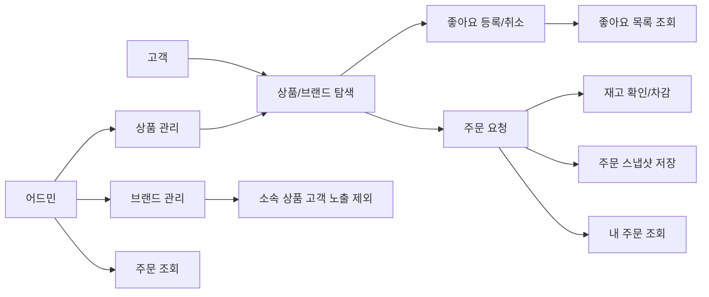
```mermaid
flowchart LR
    Customer["고객"] --> Browse["상품/브랜드 탐색"]
    Browse --> Like["좋아요 등록/취소"]
    Browse --> Order["주문 요청"]
    Like --> LikedList["좋아요 목록 조회"]
    Order --> Stock["재고 확인/차감"]
    Order --> Snapshot["주문 스냅샷 저장"]
    Order --> MyOrders["내 주문 조회"]

    Admin["어드민"] --> BrandManage["브랜드 관리"]
    Admin --> ProductManage["상품 관리"]
    Admin --> OrderRead["주문 조회"]

    BrandManage --> ProductHidden["소속 상품 고객 노출 제외"]
    ProductManage --> Browse
```

## 3. 상품 목록 조회

> 고객 API: `GET /api/v1/products?brandId=&sort=latest&page=&size=`

상품 목록 조회는 고객에게 보여줄 수 있는 상품만 조회하는 흐름이다. 삭제된 상품, 삭제된 브랜드의 상품은 목록에서 빠진다. `brandId`가 존재하지 않거나 삭제된 브랜드여도 조회 자체는 실패하지 않고 빈 페이지를 반환한다.

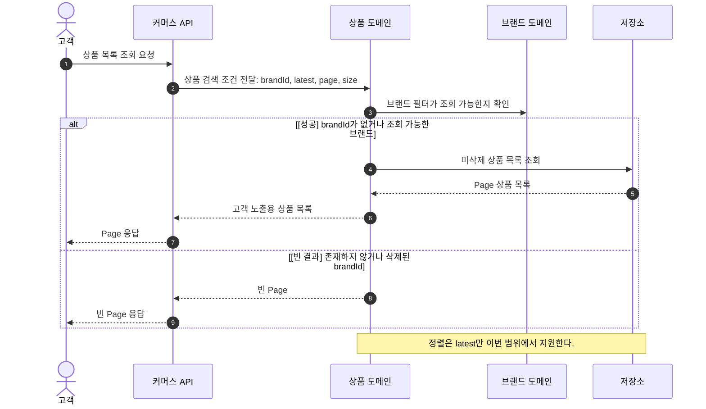
```mermaid
sequenceDiagram
    autonumber
    actor Customer as 고객
    participant API as 커머스 API
    participant Product as 상품 도메인
    participant Brand as 브랜드 도메인
    participant Store as 저장소

    Customer->>API: 상품 목록 조회 요청
    API->>Product: 상품 검색 조건 전달: brandId, latest, page, size
    Product->>Brand: 브랜드 필터가 조회 가능한지 확인

    alt [성공] brandId가 없거나 조회 가능한 브랜드
        Product->>Store: 미삭제 상품 목록 조회
        Store-->>Product: Page 상품 목록
        Product-->>API: 고객 노출용 상품 목록
        API-->>Customer: Page 응답
    else [빈 결과] 존재하지 않거나 삭제된 brandId
        Product-->>API: 빈 Page
        API-->>Customer: 빈 Page 응답
    end

    Note over Product,Store: 정렬은 latest만 이번 범위에서 지원한다.
```

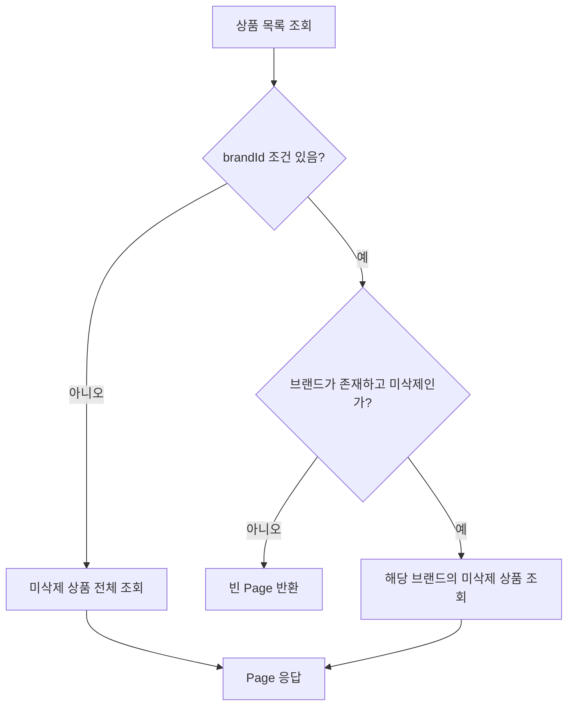
```mermaid
flowchart TD
    Start["상품 목록 조회"] --> HasBrand{"brandId 조건 있음?"}
    HasBrand -- "아니오" --> SearchAll["미삭제 상품 전체 조회"]
    HasBrand -- "예" --> BrandVisible{"브랜드가 존재하고 미삭제인가?"}
    BrandVisible -- "아니오" --> Empty["빈 Page 반환"]
    BrandVisible -- "예" --> SearchBrand["해당 브랜드의 미삭제 상품 조회"]
    SearchAll --> Page["Page 응답"]
    SearchBrand --> Page
```

## 4. 브랜드 상세 조회

> 고객 API: `GET /api/v1/brands/{brandId}`

브랜드 상세 조회는 특정 브랜드 자체를 조회하는 API다. 목록 필터와 달리 대상 브랜드가 없거나 삭제되었으면 `404 Not Found`로 처리한다.

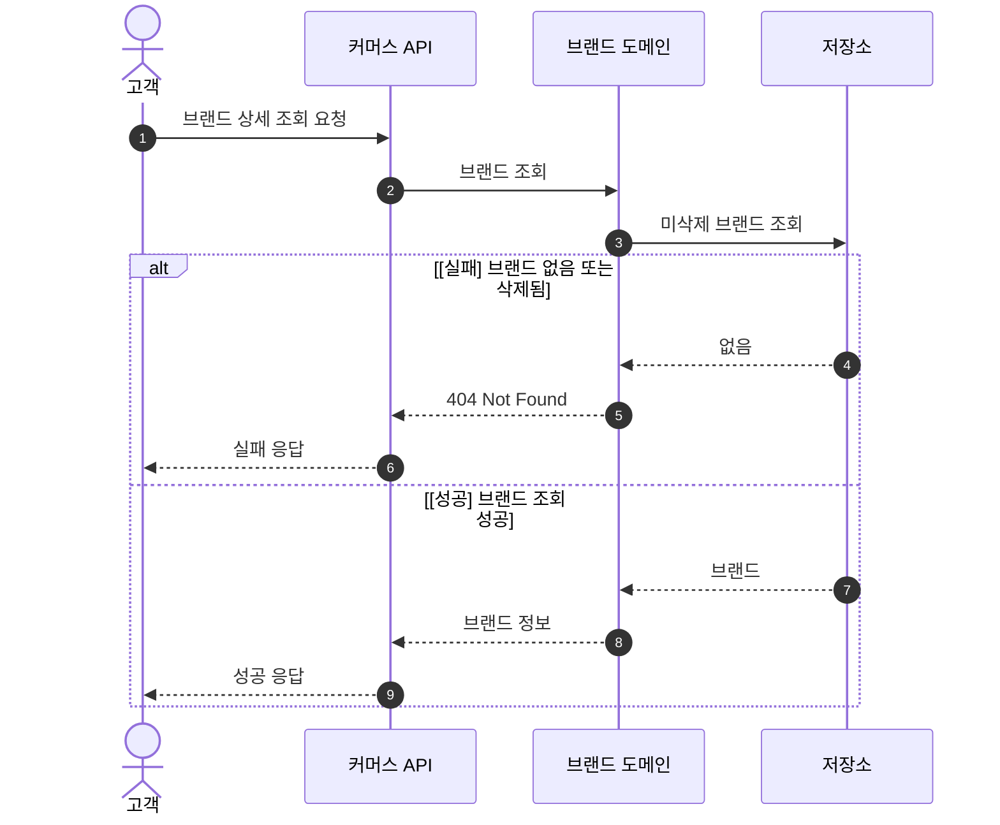
```mermaid
sequenceDiagram
    autonumber
    actor Customer as 고객
    participant API as 커머스 API
    participant Brand as 브랜드 도메인
    participant Store as 저장소

    Customer->>API: 브랜드 상세 조회 요청
    API->>Brand: 브랜드 조회
    Brand->>Store: 미삭제 브랜드 조회

    alt [실패] 브랜드 없음 또는 삭제됨
        Store-->>Brand: 없음
        Brand-->>API: 404 Not Found
        API-->>Customer: 실패 응답
    else [성공] 브랜드 조회 성공
        Store-->>Brand: 브랜드
        Brand-->>API: 브랜드 정보
        API-->>Customer: 성공 응답
    end
```

## 5. 어드민 브랜드 삭제

> 어드민 API: `DELETE /api-admin/v1/brands/{brandId}`

브랜드 삭제는 브랜드만 숨기는 작업이 아니다. 해당 브랜드의 상품도 고객에게 더 이상 보이면 안 되므로, 브랜드와 소속 상품을 같은 트랜잭션에서 소프트 삭제한다.

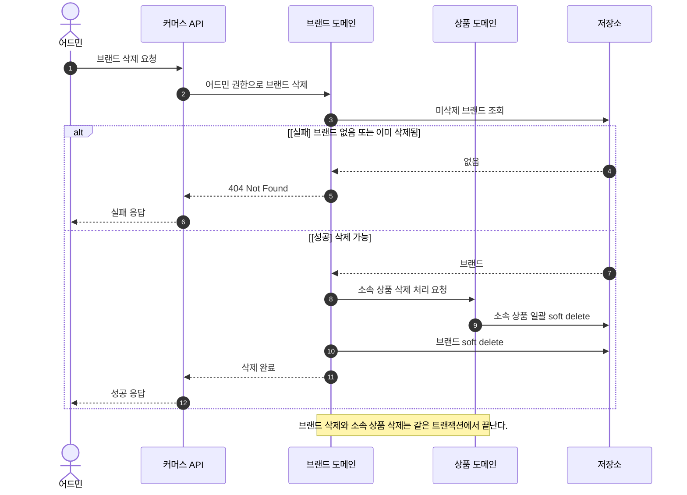
```mermaid
sequenceDiagram
    autonumber
    actor Admin as 어드민
    participant API as 커머스 API
    participant Brand as 브랜드 도메인
    participant Product as 상품 도메인
    participant Store as 저장소

    Admin->>API: 브랜드 삭제 요청
    API->>Brand: 어드민 권한으로 브랜드 삭제
    Brand->>Store: 미삭제 브랜드 조회

    alt [실패] 브랜드 없음 또는 이미 삭제됨
        Store-->>Brand: 없음
        Brand-->>API: 404 Not Found
        API-->>Admin: 실패 응답
    else [성공] 삭제 가능
        Store-->>Brand: 브랜드
        Brand->>Product: 소속 상품 삭제 처리 요청
        Product->>Store: 소속 상품 일괄 soft delete
        Brand->>Store: 브랜드 soft delete
        Brand-->>API: 삭제 완료
        API-->>Admin: 성공 응답
    end

    Note over Brand,Product: 브랜드 삭제와 소속 상품 삭제는 같은 트랜잭션에서 끝난다.
```

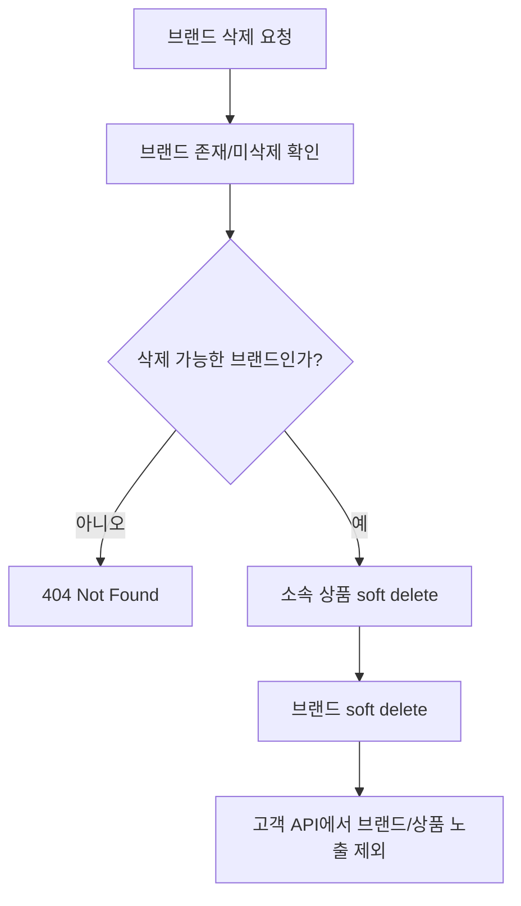
```mermaid
flowchart TD
    Start["브랜드 삭제 요청"] --> Check["브랜드 존재/미삭제 확인"]
    Check --> Exists{"삭제 가능한 브랜드인가?"}
    Exists -- "아니오" --> NotFound["404 Not Found"]
    Exists -- "예" --> DeleteProducts["소속 상품 soft delete"]
    DeleteProducts --> DeleteBrand["브랜드 soft delete"]
    DeleteBrand --> Hidden["고객 API에서 브랜드/상품 노출 제외"]
```

## 6. 어드민 상품 등록

> 어드민 API: `POST /api-admin/v1/products`

상품은 반드시 미삭제 브랜드에 소속되어야 한다. 상품 생성 시 브랜드가 없거나 삭제되어 있으면 상품을 만들지 않는다.

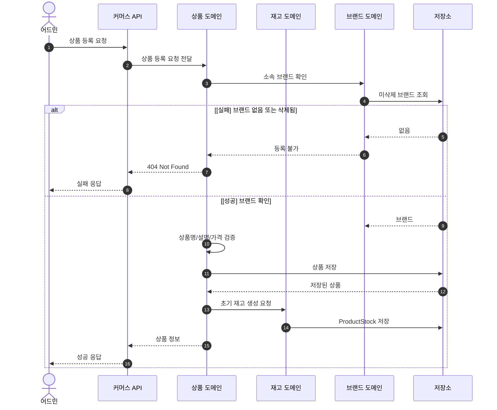
```mermaid
sequenceDiagram
    autonumber
    actor Admin as 어드민
    participant API as 커머스 API
    participant Product as 상품 도메인
    participant Stock as 재고 도메인
    participant Brand as 브랜드 도메인
    participant Store as 저장소

    Admin->>API: 상품 등록 요청
    API->>Product: 상품 등록 요청 전달
    Product->>Brand: 소속 브랜드 확인
    Brand->>Store: 미삭제 브랜드 조회

    alt [실패] 브랜드 없음 또는 삭제됨
        Store-->>Brand: 없음
        Brand-->>Product: 등록 불가
        Product-->>API: 404 Not Found
        API-->>Admin: 실패 응답
    else [성공] 브랜드 확인
        Store-->>Brand: 브랜드
        Product->>Product: 상품명/설명/가격 검증
        Product->>Store: 상품 저장
        Store-->>Product: 저장된 상품
        Product->>Stock: 초기 재고 생성 요청
        Stock->>Store: ProductStock 저장
        Product-->>API: 상품 정보
        API-->>Admin: 성공 응답
    end
```

## 7. 좋아요 등록/취소

> 고객 API: `POST /api/v1/products/{productId}/likes`  
> 고객 API: `DELETE /api/v1/products/{productId}/likes`

좋아요는 현재 상태를 표현하는 토글 데이터다. 등록과 취소는 모두 멱등하게 처리한다. 좋아요 취소 시에는 row를 hard delete한다.

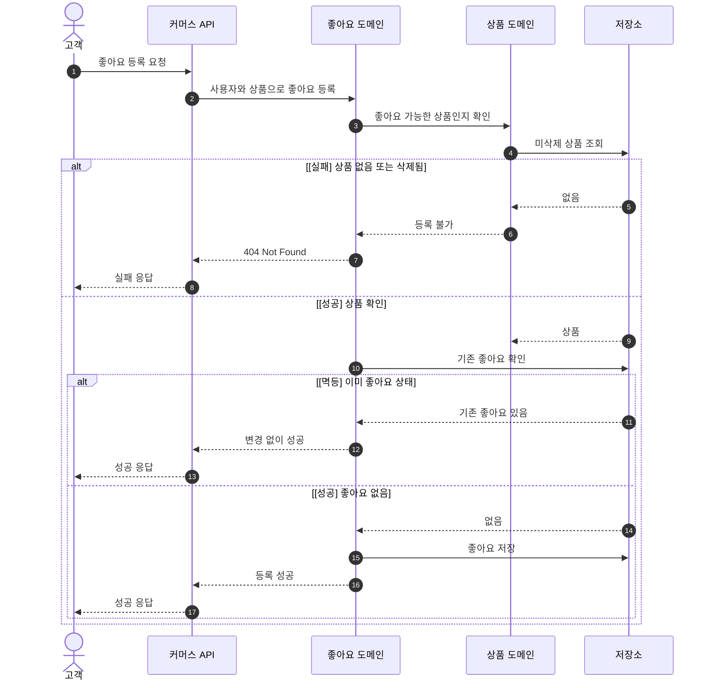
```mermaid
sequenceDiagram
    autonumber
    actor Customer as 고객
    participant API as 커머스 API
    participant Like as 좋아요 도메인
    participant Product as 상품 도메인
    participant Store as 저장소

    Customer->>API: 좋아요 등록 요청
    API->>Like: 사용자와 상품으로 좋아요 등록
    Like->>Product: 좋아요 가능한 상품인지 확인
    Product->>Store: 미삭제 상품 조회

    alt [실패] 상품 없음 또는 삭제됨
        Store-->>Product: 없음
        Product-->>Like: 등록 불가
        Like-->>API: 404 Not Found
        API-->>Customer: 실패 응답
    else [성공] 상품 확인
        Store-->>Product: 상품
        Like->>Store: 기존 좋아요 확인

        alt [멱등] 이미 좋아요 상태
            Store-->>Like: 기존 좋아요 있음
            Like-->>API: 변경 없이 성공
            API-->>Customer: 성공 응답
        else [성공] 좋아요 없음
            Store-->>Like: 없음
            Like->>Store: 좋아요 저장
            Like-->>API: 등록 성공
            API-->>Customer: 성공 응답
        end
    end
```

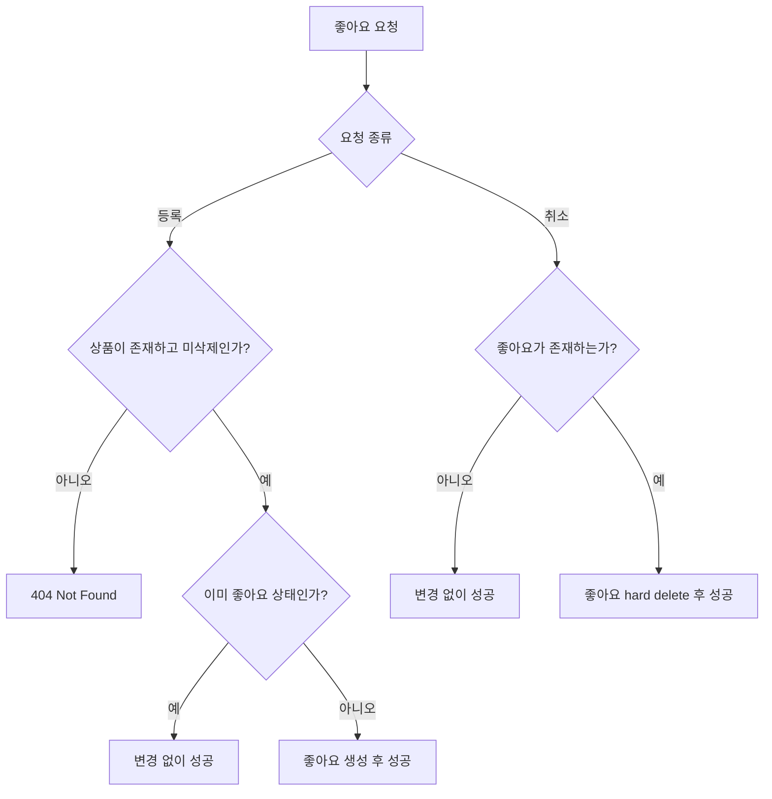
```mermaid
flowchart TD
    Start["좋아요 요청"] --> Type{"요청 종류"}

    Type -- "등록" --> ProductVisible{"상품이 존재하고 미삭제인가?"}
    ProductVisible -- "아니오" --> NotFound["404 Not Found"]
    ProductVisible -- "예" --> AlreadyLiked{"이미 좋아요 상태인가?"}
    AlreadyLiked -- "예" --> LikeNoop["변경 없이 성공"]
    AlreadyLiked -- "아니오" --> CreateLike["좋아요 생성 후 성공"]

    Type -- "취소" --> Liked{"좋아요가 존재하는가?"}
    Liked -- "아니오" --> UnlikeNoop["변경 없이 성공"]
    Liked -- "예" --> DeleteLike["좋아요 hard delete 후 성공"]
```

## 8. 내가 좋아요한 상품 목록 조회

> 고객 API: `GET /api/v1/users/{userId}/likes`

좋아요 목록은 인증된 사용자 본인만 조회할 수 있다. 좋아요 row가 남아 있어도 상품이나 브랜드가 삭제된 경우 목록에서 제외한다.

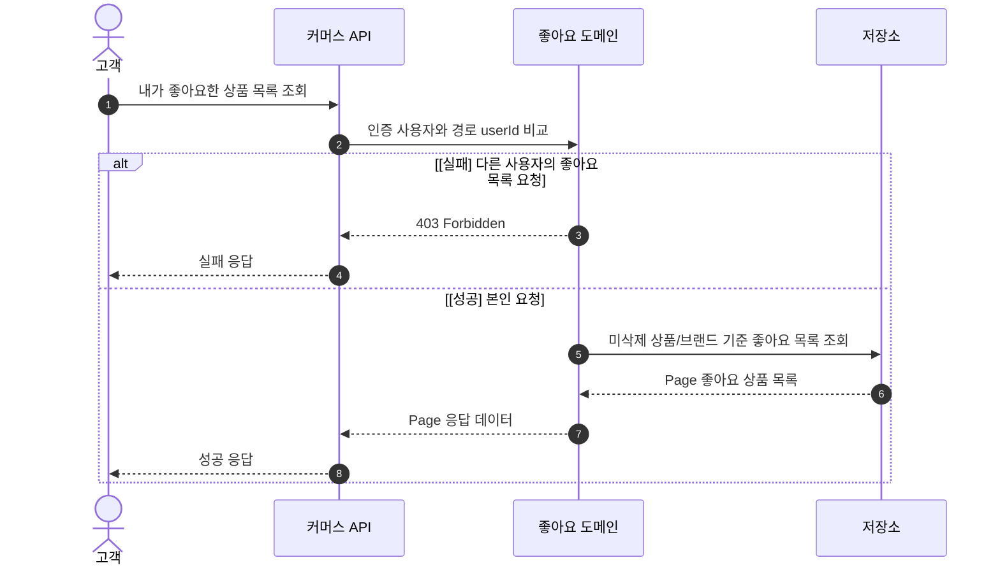
```mermaid
sequenceDiagram
    autonumber
    actor Customer as 고객
    participant API as 커머스 API
    participant Like as 좋아요 도메인
    participant Store as 저장소

    Customer->>API: 내가 좋아요한 상품 목록 조회
    API->>Like: 인증 사용자와 경로 userId 비교

    alt [실패] 다른 사용자의 좋아요 목록 요청
        Like-->>API: 403 Forbidden
        API-->>Customer: 실패 응답
    else [성공] 본인 요청
        Like->>Store: 미삭제 상품/브랜드 기준 좋아요 목록 조회
        Store-->>Like: Page 좋아요 상품 목록
        Like-->>API: Page 응답 데이터
        API-->>Customer: 성공 응답
    end
```

## 9. 주문 생성

> 고객 API: `POST /api/v1/orders`

주문 생성은 이번 설계에서 가장 중요한 흐름이다. 여러 상품을 한 번에 주문하되, 하나라도 주문할 수 없으면 전체 주문을 실패시킨다. 재고 검증, 재고 차감, 주문 스냅샷 저장은 하나의 트랜잭션으로 처리한다.

### 9.1 주문 생성 판단 흐름

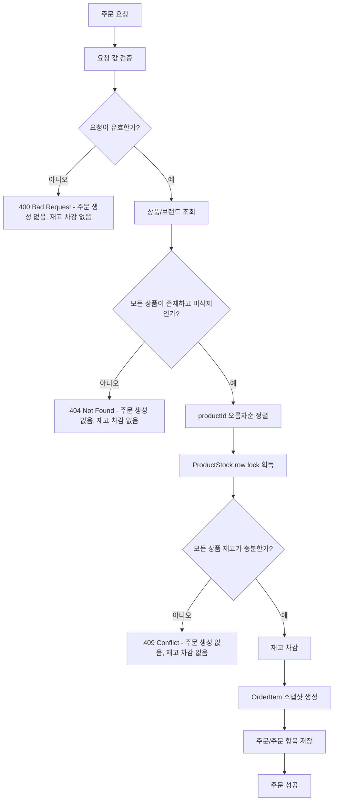
```mermaid
flowchart TD
    Start["주문 요청"] --> Validate["요청 값 검증"]
    Validate --> Valid{"요청이 유효한가?"}
    Valid -- "아니오" --> BadRequest["400 Bad Request - 주문 생성 없음, 재고 차감 없음"]

    Valid -- "예" --> LoadProducts["상품/브랜드 조회"]
    LoadProducts --> ProductOk{"모든 상품이 존재하고 미삭제인가?"}
    ProductOk -- "아니오" --> NotFound["404 Not Found - 주문 생성 없음, 재고 차감 없음"]

    ProductOk -- "예" --> Sort["productId 오름차순 정렬"]
    Sort --> Lock["ProductStock row lock 획득"]
    Lock --> StockOk{"모든 상품 재고가 충분한가?"}
    StockOk -- "아니오" --> Conflict["409 Conflict - 주문 생성 없음, 재고 차감 없음"]

    StockOk -- "예" --> Deduct["재고 차감"]
    Deduct --> Snapshot["OrderItem 스냅샷 생성"]
    Snapshot --> Save["주문/주문 항목 저장"]
    Save --> Success["주문 성공"]
```

### 9.2 해피 케이스: 모든 상품 주문 가능

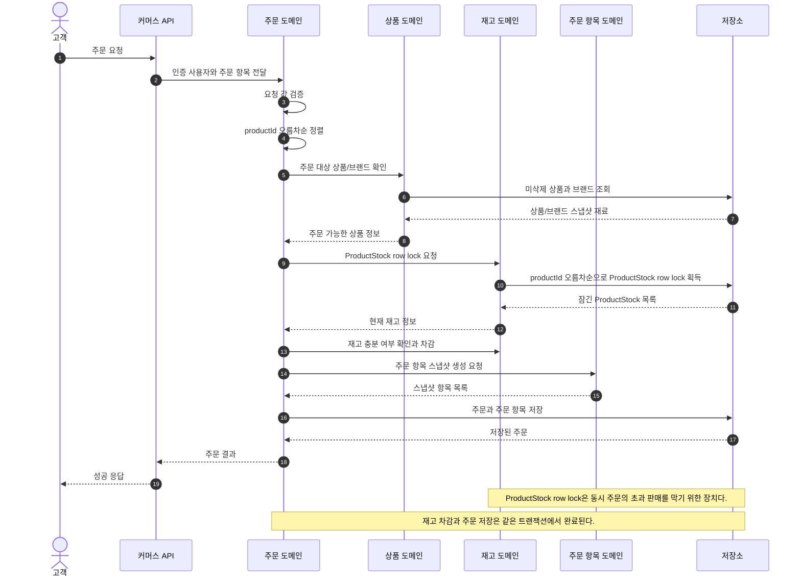
```mermaid
sequenceDiagram
    autonumber
    actor Customer as 고객
    participant API as 커머스 API
    participant Order as 주문 도메인
    participant Product as 상품 도메인
    participant Stock as 재고 도메인
    participant Item as 주문 항목 도메인
    participant Store as 저장소

    Customer->>API: 주문 요청
    API->>Order: 인증 사용자와 주문 항목 전달
    Order->>Order: 요청 값 검증
    Order->>Order: productId 오름차순 정렬
    Order->>Product: 주문 대상 상품/브랜드 확인
    Product->>Store: 미삭제 상품과 브랜드 조회
    Store-->>Product: 상품/브랜드 스냅샷 재료
    Product-->>Order: 주문 가능한 상품 정보
    Order->>Stock: ProductStock row lock 요청
    Stock->>Store: productId 오름차순으로 ProductStock row lock 획득
    Store-->>Stock: 잠긴 ProductStock 목록
    Stock-->>Order: 현재 재고 정보
    Order->>Stock: 재고 충분 여부 확인과 차감
    Order->>Item: 주문 항목 스냅샷 생성 요청
    Item-->>Order: 스냅샷 항목 목록
    Order->>Store: 주문과 주문 항목 저장
    Store-->>Order: 저장된 주문
    Order-->>API: 주문 결과
    API-->>Customer: 성공 응답

    Note over Stock,Store: ProductStock row lock은 동시 주문의 초과 판매를 막기 위한 장치다.
    Note over Order,Store: 재고 차감과 주문 저장은 같은 트랜잭션에서 완료된다.
```

### 9.3 실패 케이스: 요청 값 오류

`items`가 비어 있거나, 수량이 1보다 작거나, 동일한 `productId`가 중복되면 요청 값 오류로 본다. 이 경우 상품 조회나 재고 차감까지 가지 않는다.

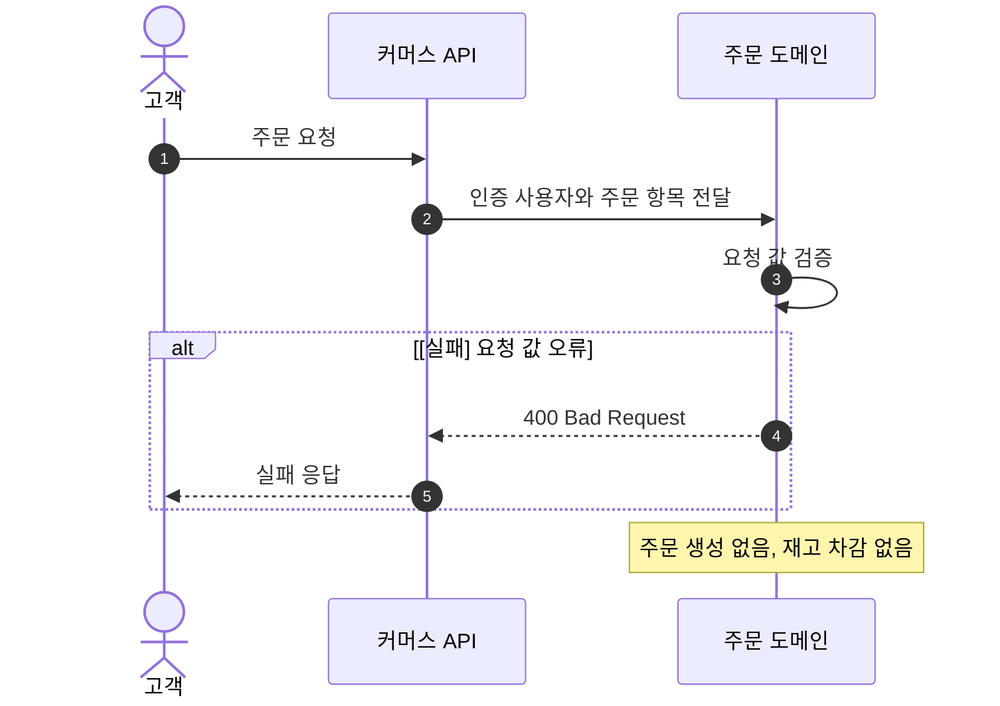
```mermaid
sequenceDiagram
    autonumber
    actor Customer as 고객
    participant API as 커머스 API
    participant Order as 주문 도메인

    Customer->>API: 주문 요청
    API->>Order: 인증 사용자와 주문 항목 전달
    Order->>Order: 요청 값 검증

    alt [실패] 요청 값 오류
        Order-->>API: 400 Bad Request
        API-->>Customer: 실패 응답
    end

    Note over Order: 주문 생성 없음, 재고 차감 없음
```

### 9.4 실패 케이스: 상품이 없거나 삭제됨

요청 값은 유효하지만 주문 대상 상품이 없거나 삭제된 경우다. 삭제된 브랜드에 속한 상품도 주문 불가로 본다.

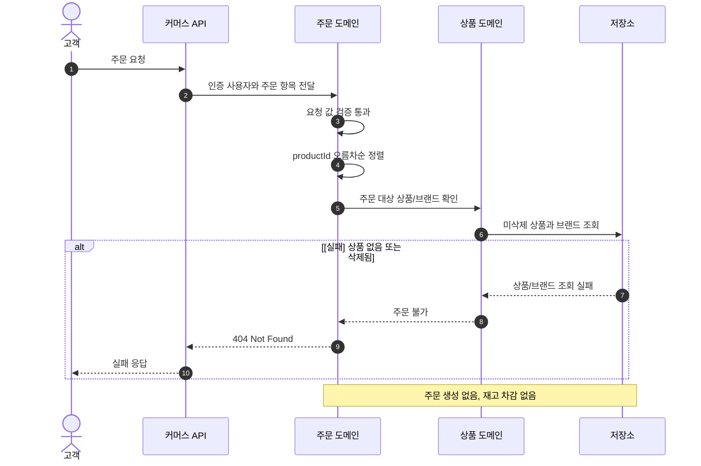
```mermaid
sequenceDiagram
    autonumber
    actor Customer as 고객
    participant API as 커머스 API
    participant Order as 주문 도메인
    participant Product as 상품 도메인
    participant Store as 저장소

    Customer->>API: 주문 요청
    API->>Order: 인증 사용자와 주문 항목 전달
    Order->>Order: 요청 값 검증 통과
    Order->>Order: productId 오름차순 정렬
    Order->>Product: 주문 대상 상품/브랜드 확인
    Product->>Store: 미삭제 상품과 브랜드 조회

    alt [실패] 상품 없음 또는 삭제됨
        Store-->>Product: 상품/브랜드 조회 실패
        Product-->>Order: 주문 불가
        Order-->>API: 404 Not Found
        API-->>Customer: 실패 응답
    end

    Note over Order,Store: 주문 생성 없음, 재고 차감 없음
```

### 9.5 실패 케이스: 재고 부족

상품은 모두 존재하지만 하나라도 재고가 부족하면 전체 주문을 실패시킨다. 이미 lock을 잡은 상태에서 판단하므로 동시에 들어온 주문 때문에 재고가 음수가 되는 상황을 막을 수 있다.

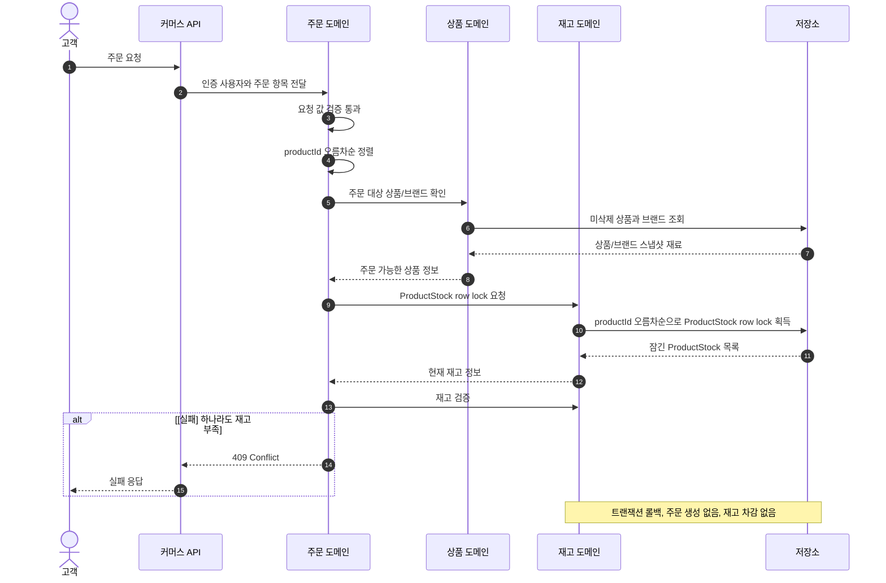
```mermaid
sequenceDiagram
    autonumber
    actor Customer as 고객
    participant API as 커머스 API
    participant Order as 주문 도메인
    participant Product as 상품 도메인
    participant Stock as 재고 도메인
    participant Store as 저장소

    Customer->>API: 주문 요청
    API->>Order: 인증 사용자와 주문 항목 전달
    Order->>Order: 요청 값 검증 통과
    Order->>Order: productId 오름차순 정렬
    Order->>Product: 주문 대상 상품/브랜드 확인
    Product->>Store: 미삭제 상품과 브랜드 조회
    Store-->>Product: 상품/브랜드 스냅샷 재료
    Product-->>Order: 주문 가능한 상품 정보
    Order->>Stock: ProductStock row lock 요청
    Stock->>Store: productId 오름차순으로 ProductStock row lock 획득
    Store-->>Stock: 잠긴 ProductStock 목록
    Stock-->>Order: 현재 재고 정보
    Order->>Stock: 재고 검증

    alt [실패] 하나라도 재고 부족
        Order-->>API: 409 Conflict
        API-->>Customer: 실패 응답
    end

    Note over Stock,Store: 트랜잭션 롤백, 주문 생성 없음, 재고 차감 없음
```

## 10. 주문 생성과 어드민 재고 변경 경합

주문 생성은 `ProductStock` row lock을 잡고 재고를 검증한다. 주문이 먼저 재고 lock을 잡았다면 어드민 재고 수정은 주문 트랜잭션이 끝난 뒤 진행된다. 반대로 어드민 상품 삭제가 먼저 커밋되면 이후 주문은 삭제된 상품으로 판단해 실패한다.

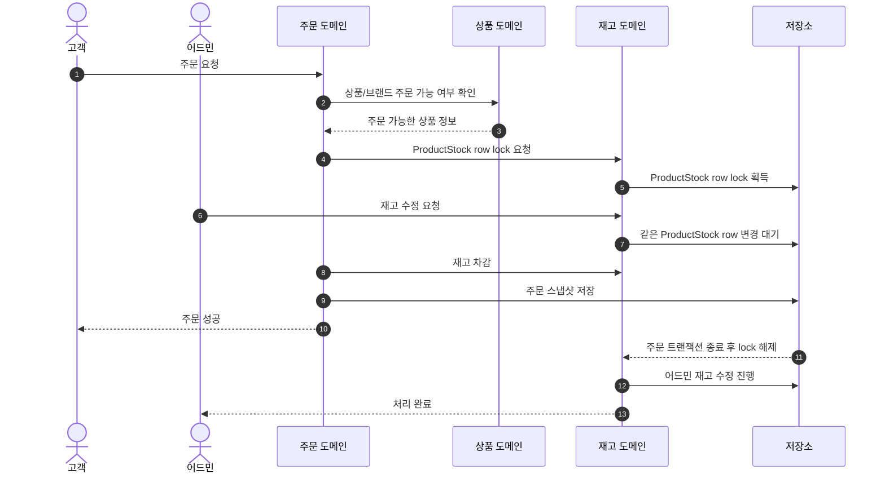
```mermaid
sequenceDiagram
    autonumber
    actor Customer as 고객
    actor Admin as 어드민
    participant Order as 주문 도메인
    participant Product as 상품 도메인
    participant Stock as 재고 도메인
    participant Store as 저장소

    Customer->>Order: 주문 요청
    Order->>Product: 상품/브랜드 주문 가능 여부 확인
    Product-->>Order: 주문 가능한 상품 정보
    Order->>Stock: ProductStock row lock 요청
    Stock->>Store: ProductStock row lock 획득

    Admin->>Stock: 재고 수정 요청
    Stock->>Store: 같은 ProductStock row 변경 대기

    Order->>Stock: 재고 차감
    Order->>Store: 주문 스냅샷 저장
    Order-->>Customer: 주문 성공

    Store-->>Stock: 주문 트랜잭션 종료 후 lock 해제
    Stock->>Store: 어드민 재고 수정 진행
    Stock-->>Admin: 처리 완료
```

## 11. 내 주문 조회

> 고객 API: `GET /api/v1/orders`  
> 고객 API: `GET /api/v1/orders/{orderId}`

고객 주문 조회는 항상 본인 주문만 허용한다. 주문 상세는 현재 상품 정보가 아니라 주문 시점의 스냅샷 기준으로 응답한다.

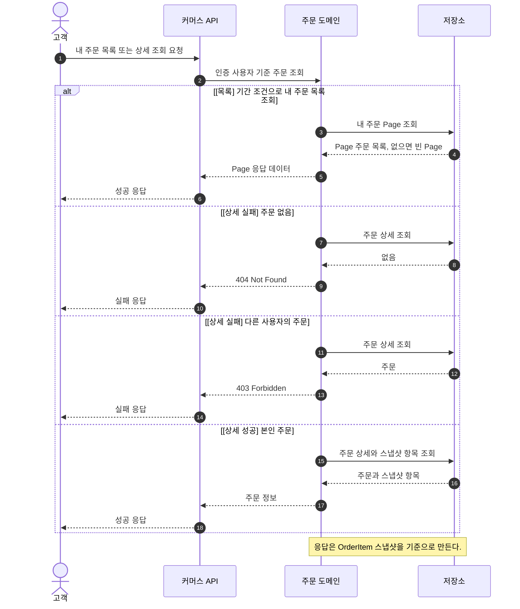
```mermaid
sequenceDiagram
    autonumber
    actor Customer as 고객
    participant API as 커머스 API
    participant Order as 주문 도메인
    participant Store as 저장소

    Customer->>API: 내 주문 목록 또는 상세 조회 요청
    API->>Order: 인증 사용자 기준 주문 조회

    alt [목록] 기간 조건으로 내 주문 목록 조회
        Order->>Store: 내 주문 Page 조회
        Store-->>Order: Page 주문 목록, 없으면 빈 Page
        Order-->>API: Page 응답 데이터
        API-->>Customer: 성공 응답
    else [상세 실패] 주문 없음
        Order->>Store: 주문 상세 조회
        Store-->>Order: 없음
        Order-->>API: 404 Not Found
        API-->>Customer: 실패 응답
    else [상세 실패] 다른 사용자의 주문
        Order->>Store: 주문 상세 조회
        Store-->>Order: 주문
        Order-->>API: 403 Forbidden
        API-->>Customer: 실패 응답
    else [상세 성공] 본인 주문
        Order->>Store: 주문 상세와 스냅샷 항목 조회
        Store-->>Order: 주문과 스냅샷 항목
        Order-->>API: 주문 정보
        API-->>Customer: 성공 응답
    end

    Note over Order,Store: 응답은 OrderItem 스냅샷을 기준으로 만든다.
```

## 12. 어드민 주문 조회

> 어드민 API: `GET /api-admin/v1/orders`  
> 어드민 API: `GET /api-admin/v1/orders/{orderId}`

어드민은 전체 주문을 조회할 수 있다. 고객 주문 조회와 달리 주문 소유자 검증은 하지 않는다.

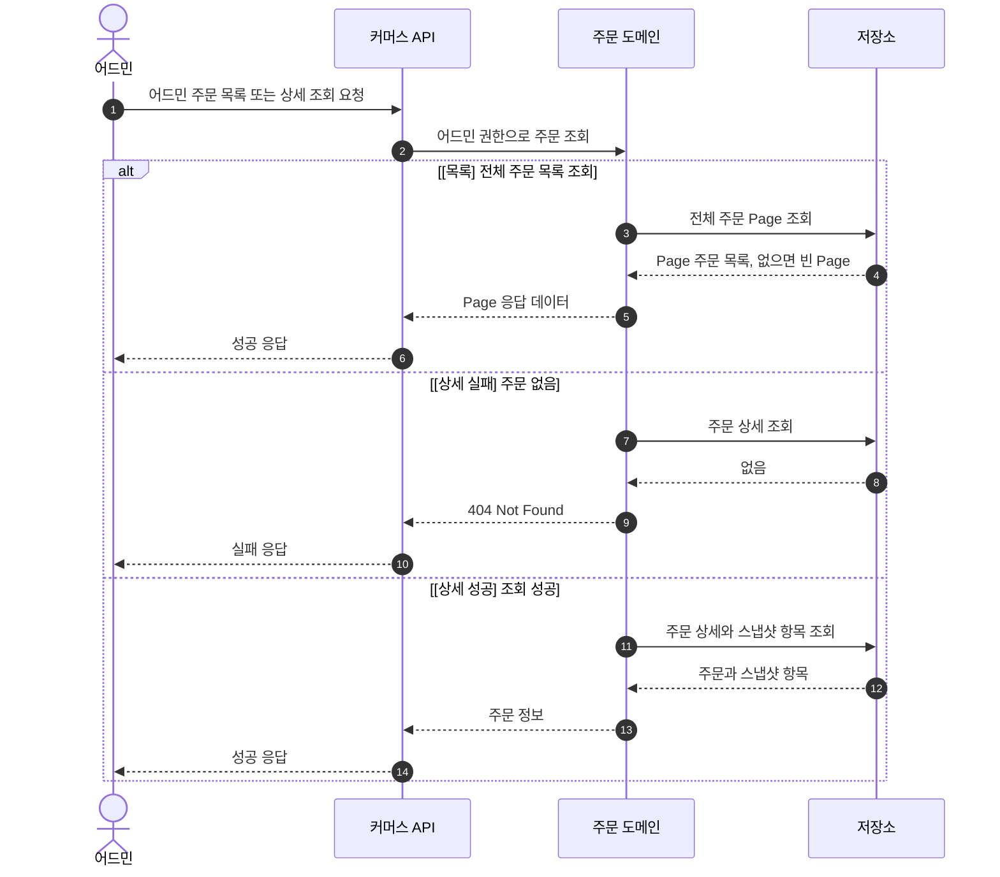
```mermaid
sequenceDiagram
    autonumber
    actor Admin as 어드민
    participant API as 커머스 API
    participant Order as 주문 도메인
    participant Store as 저장소

    Admin->>API: 어드민 주문 목록 또는 상세 조회 요청
    API->>Order: 어드민 권한으로 주문 조회

    alt [목록] 전체 주문 목록 조회
        Order->>Store: 전체 주문 Page 조회
        Store-->>Order: Page 주문 목록, 없으면 빈 Page
        Order-->>API: Page 응답 데이터
        API-->>Admin: 성공 응답
    else [상세 실패] 주문 없음
        Order->>Store: 주문 상세 조회
        Store-->>Order: 없음
        Order-->>API: 404 Not Found
        API-->>Admin: 실패 응답
    else [상세 성공] 조회 성공
        Order->>Store: 주문 상세와 스냅샷 항목 조회
        Store-->>Order: 주문과 스냅샷 항목
        Order-->>API: 주문 정보
        API-->>Admin: 성공 응답
    end
```

## 13. 핵심 정책 요약

| 흐름 | 핵심 정책 |
| --- | --- |
| 상품 목록 조회 | 삭제된 상품/브랜드 제외, 없는 `brandId`는 빈 Page |
| 브랜드 삭제 | 브랜드와 소속 상품을 같은 트랜잭션에서 soft delete |
| 상품 등록 | 미삭제 브랜드에만 등록 가능 |
| 좋아요 등록/취소 | 멱등 성공, 취소는 hard delete |
| 좋아요 목록 조회 | 본인만 조회 가능, 삭제된 상품은 제외 |
| 주문 생성 | 전체 성공 또는 전체 실패 |
| 주문 재고 차감 | ProductStock row lock 후 검증/차감 |
| 주문 스냅샷 | 주문 당시 브랜드/상품/가격 정보를 보존 |
| 주문과 어드민 변경 경합 | 주문이 lock을 먼저 잡으면 주문 완료 후 어드민 변경 |
