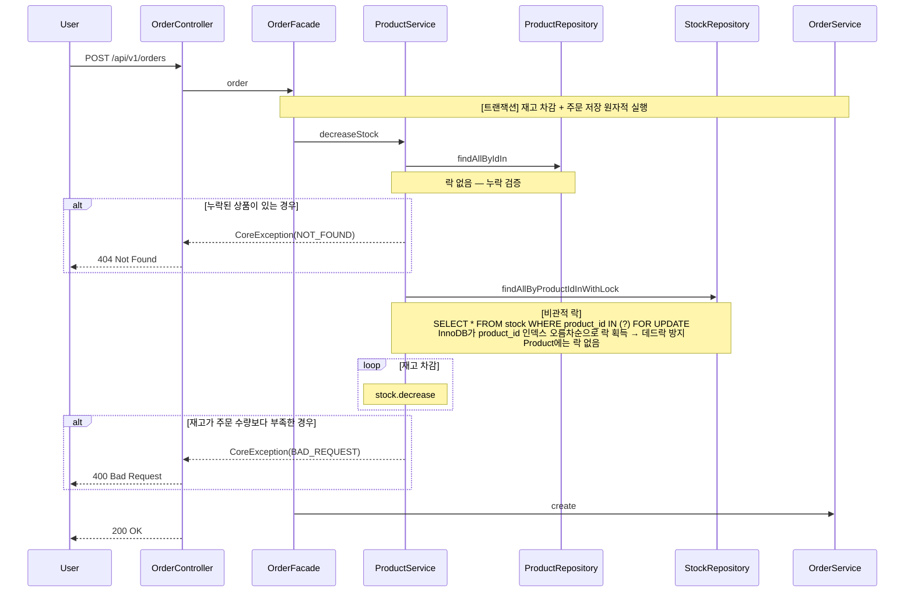
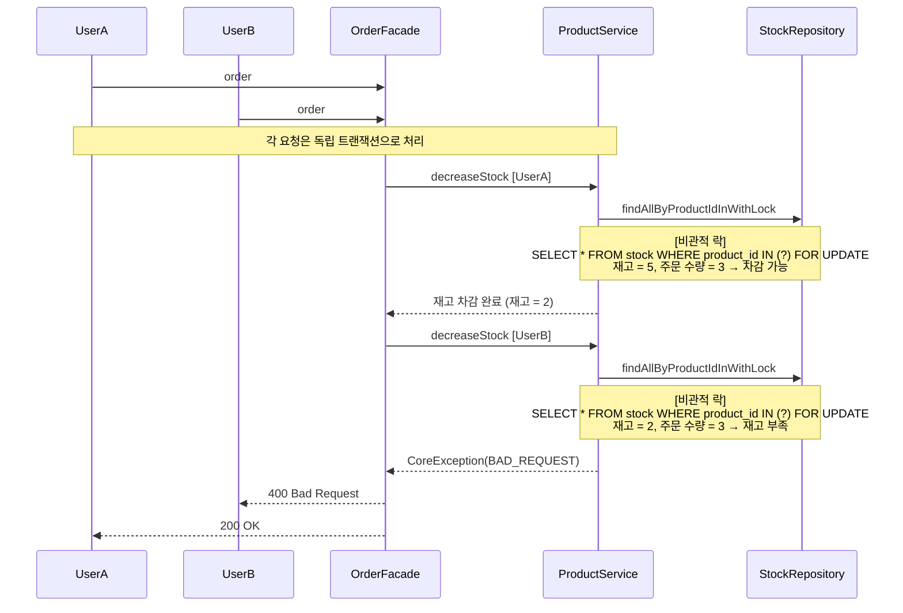
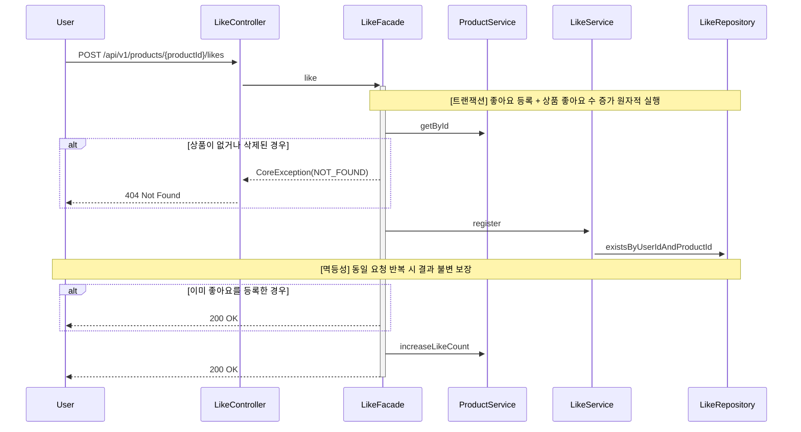
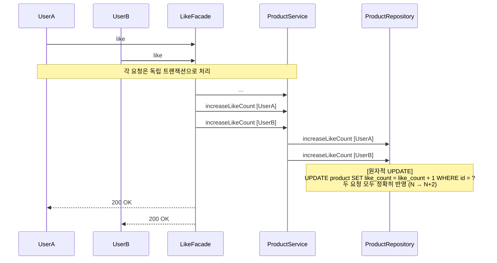
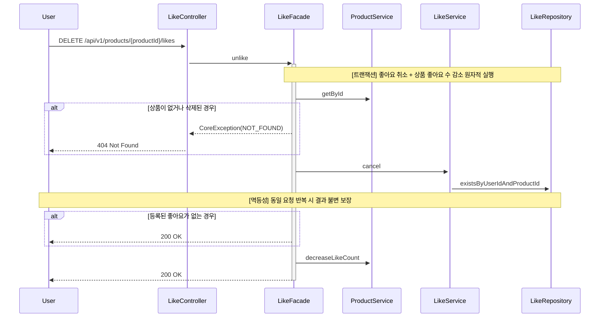
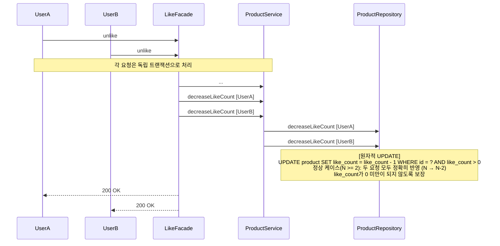

# Sequence Diagrams

> 주문 요청 플로우

```mermaid
sequenceDiagram
    participant User
    participant OrderController
    participant OrderFacade
    participant ProductService
    participant ProductRepository
    participant StockRepository
    participant OrderService

    User->>OrderController: POST /api/v1/orders
    OrderController->>OrderFacade: order
    Note over OrderFacade,OrderService: [트랜잭션] 재고 차감 + 주문 저장 원자적 실행
    OrderFacade->>ProductService: decreaseStock
    ProductService->>ProductRepository: findAllByIdIn
    Note over ProductService,ProductRepository: 락 없음 — 누락 검증
    alt 누락된 상품이 있는 경우
        ProductService-->>OrderController: CoreException(NOT_FOUND)
        OrderController-->>User: 404 Not Found
    end
    ProductService->>StockRepository: findAllByProductIdInWithLock
    Note over ProductService,StockRepository: [비관적 락]<br/>SELECT * FROM stock WHERE product_id IN (?) FOR UPDATE<br/>InnoDB가 product_id 인덱스 오름차순으로 락 획득 → 데드락 방지<br/>Product에는 락 없음
    loop 재고 차감
        Note over ProductService: stock.decrease
    end
    alt 재고가 주문 수량보다 부족한 경우
        ProductService-->>OrderController: CoreException(BAD_REQUEST)
        OrderController-->>User: 400 Bad Request
    end
    OrderFacade->>OrderService: create
    OrderController-->>User: 200 OK
```

> 재고 차감 동시성 시나리오

```mermaid
sequenceDiagram
    participant UserA
    participant UserB
    participant OrderFacade
    participant ProductService
    participant StockRepository

    UserA->>OrderFacade: order
    UserB->>OrderFacade: order

    Note over UserA,ProductService: 각 요청은 독립 트랜잭션으로 처리

    OrderFacade->>ProductService: decreaseStock [UserA]
    ProductService->>StockRepository: findAllByProductIdInWithLock
    Note over ProductService,StockRepository: [비관적 락]<br/>SELECT * FROM stock WHERE product_id IN (?) FOR UPDATE<br/>재고 = 5, 주문 수량 = 3 → 차감 가능
    ProductService-->>OrderFacade: 재고 차감 완료 (재고 = 2)

    OrderFacade->>ProductService: decreaseStock [UserB]
    ProductService->>StockRepository: findAllByProductIdInWithLock
    Note over ProductService,StockRepository: [비관적 락]<br/>SELECT * FROM stock WHERE product_id IN (?) FOR UPDATE<br/>재고 = 2, 주문 수량 = 3 → 재고 부족
    ProductService-->>OrderFacade: CoreException(BAD_REQUEST)

    OrderFacade-->>UserB: 400 Bad Request
    OrderFacade-->>UserA: 200 OK
```

---

> 좋아요 등록 플로우

```mermaid
sequenceDiagram
    participant User
    participant LikeController
    participant LikeFacade
    participant ProductService
    participant LikeService
    participant LikeRepository

    User->>+LikeController: POST /api/v1/products/{productId}/likes
    LikeController->>+LikeFacade: like
    Note over LikeFacade,LikeRepository: [트랜잭션] 좋아요 등록 + 상품 좋아요 수 증가 원자적 실행
    LikeFacade->>+ProductService: getById
    alt 상품이 없거나 삭제된 경우
        LikeFacade-->>LikeController: CoreException(NOT_FOUND)
        LikeController-->>User: 404 Not Found
    end
    LikeFacade->>+LikeService: register
    LikeService->>+LikeRepository: existsByUserIdAndProductId
    Note over User,LikeRepository: [멱등성] 동일 요청 반복 시 결과 불변 보장
    alt 이미 좋아요를 등록한 경우
        LikeFacade-->>User: 200 OK
    end
    LikeFacade->>+ProductService: increaseLikeCount
    LikeFacade-->>-User: 200 OK
```

> 상품 좋아요 수 증가 동시성 시나리오

```mermaid
sequenceDiagram
    participant UserA
    participant UserB
    participant LikeFacade
    participant ProductService
    participant ProductRepository

    UserA->>LikeFacade: like
    UserB->>LikeFacade: like
    Note over UserA,ProductService: 각 요청은 독립 트랜잭션으로 처리

    LikeFacade->>ProductService: ...


    LikeFacade->>ProductService: increaseLikeCount [UserA]
    LikeFacade->>ProductService: increaseLikeCount [UserB]

    ProductService->>ProductRepository: increaseLikeCount [UserA]
    ProductService->>ProductRepository: increaseLikeCount [UserB]

    Note over ProductRepository: [원자적 UPDATE]<br/>UPDATE product SET like_count = like_count + 1 WHERE id = ?<br/>두 요청 모두 정확히 반영 (N → N+2)

    LikeFacade-->>UserA: 200 OK
    LikeFacade-->>UserB: 200 OK

```

---

> 좋아요 취소 플로우

```mermaid
sequenceDiagram
    participant User
    participant LikeController
    participant LikeFacade
    participant ProductService
    participant LikeService
    participant LikeRepository

    User->>+LikeController: DELETE /api/v1/products/{productId}/likes
    LikeController->>+LikeFacade: unlike
    Note over LikeFacade,LikeRepository: [트랜잭션] 좋아요 취소 + 상품 좋아요 수 감소 원자적 실행
    LikeFacade->>+ProductService: getById
    alt 상품이 없거나 삭제된 경우
        LikeFacade-->>LikeController: CoreException(NOT_FOUND)
        LikeController-->>User: 404 Not Found
    end
    LikeFacade->>+LikeService: cancel
    LikeService->>+LikeRepository: existsByUserIdAndProductId
    Note over User,LikeRepository: [멱등성] 동일 요청 반복 시 결과 불변 보장
    alt 등록된 좋아요가 없는 경우
        LikeFacade-->>User: 200 OK
    end
    LikeFacade->>+ProductService: decreaseLikeCount
    LikeFacade-->>-User: 200 OK
```

> 상품 좋아요 수 감소 동시성 시나리오

```mermaid
sequenceDiagram
    participant UserA
    participant UserB
    participant LikeFacade
    participant ProductService
    participant ProductRepository

    UserA->>LikeFacade: unlike
    UserB->>LikeFacade: unlike
    Note over UserA,ProductService: 각 요청은 독립 트랜잭션으로 처리

    LikeFacade->>ProductService: ...

    LikeFacade->>ProductService: decreaseLikeCount [UserA]
    LikeFacade->>ProductService: decreaseLikeCount [UserB]

    ProductService->>ProductRepository: decreaseLikeCount [UserA]
    ProductService->>ProductRepository: decreaseLikeCount [UserB]

    Note over ProductRepository: [원자적 UPDATE]<br/>UPDATE product SET like_count = like_count - 1 WHERE id = ? AND like_count > 0<br/>정상 케이스(N >= 2): 두 요청 모두 정확히 반영 (N → N-2)<br/>like_count가 0 미만이 되지 않도록 보장

    LikeFacade-->>UserA: 200 OK
    LikeFacade-->>UserB: 200 OK
```
