# 시퀀스 다이어그램

> 각 흐름마다 **개요(비개발자/PM용)**와 **상세(개발자용)** 두 가지를 함께 제공한다.
> 흐름은 사용자 여정(User Journey) 순서로 정렬한다.

---

## 1. 회원가입

### 개요

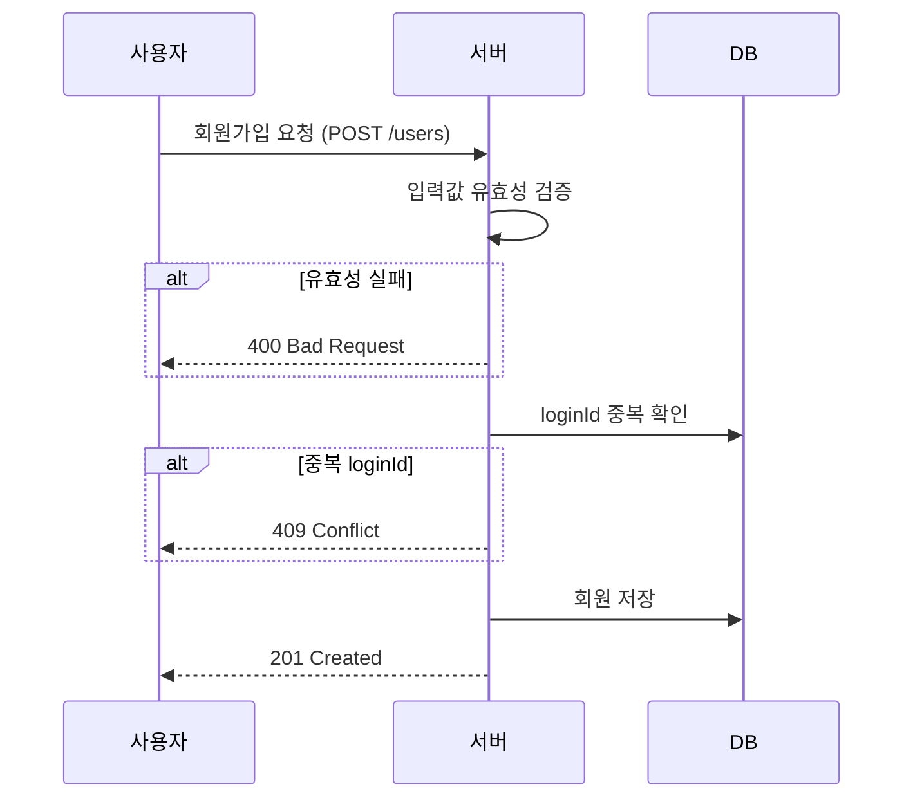
```mermaid
sequenceDiagram
    participant 사용자
    participant 서버
    participant DB

    사용자->>서버: 회원가입 요청 (POST /users)
    서버->>서버: 입력값 유효성 검증
    alt 유효성 실패
        서버-->>사용자: 400 Bad Request
    end
    서버->>DB: loginId 중복 확인
    alt 중복 loginId
        서버-->>사용자: 409 Conflict
    end
    서버->>DB: 회원 저장
    서버-->>사용자: 201 Created
```

### 상세

인증 없이 접근 가능한 엔드포인트. 유효성 검증은 도메인 생성자에서 처리된다.

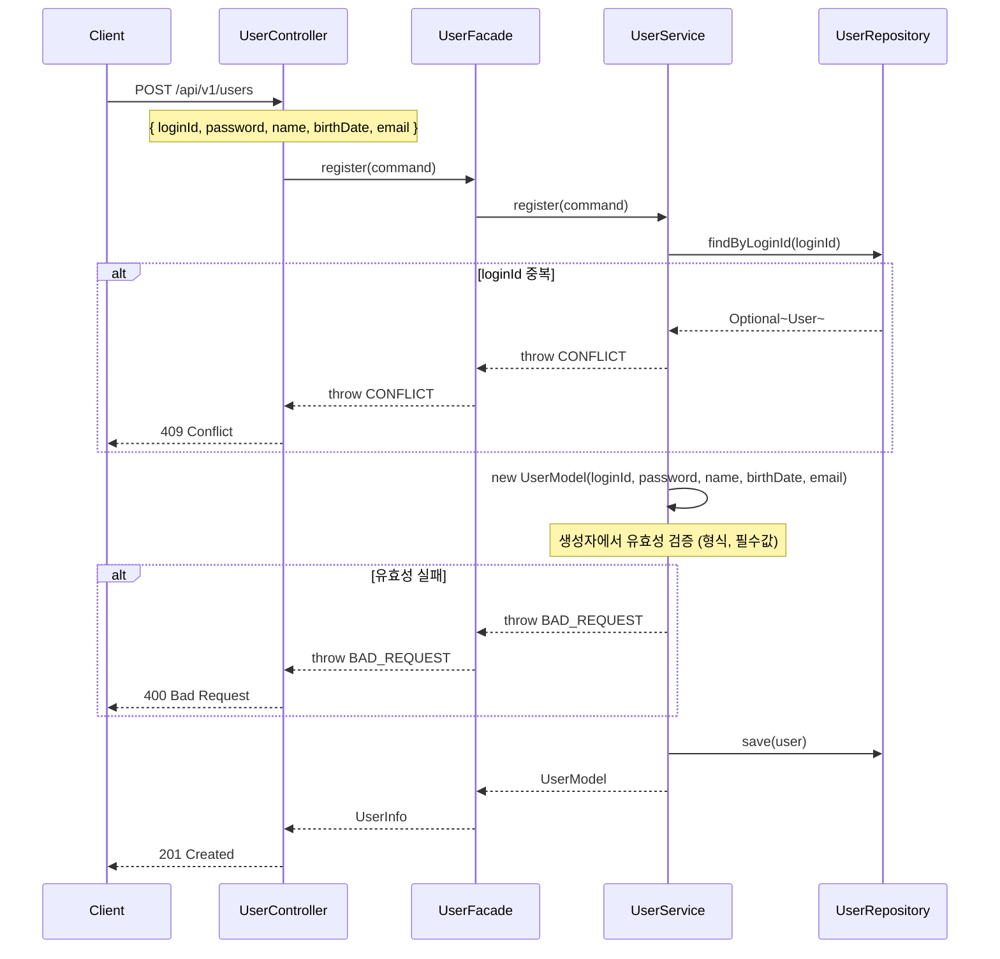
```mermaid
sequenceDiagram
    participant Client
    participant UserController
    participant UserFacade
    participant UserService
    participant UserRepository

    Client->>UserController: POST /api/v1/users
    Note over UserController: { loginId, password, name, birthDate, email }

    UserController->>UserFacade: register(command)

    UserFacade->>UserService: register(command)

    UserService->>UserRepository: findByLoginId(loginId)
    alt loginId 중복
        UserRepository-->>UserService: Optional~User~
        UserService-->>UserFacade: throw CONFLICT
        UserFacade-->>UserController: throw CONFLICT
        UserController-->>Client: 409 Conflict
    end

    UserService->>UserService: new UserModel(loginId, password, name, birthDate, email)
    Note over UserService: 생성자에서 유효성 검증 (형식, 필수값)
    alt 유효성 실패
        UserService-->>UserFacade: throw BAD_REQUEST
        UserFacade-->>UserController: throw BAD_REQUEST
        UserController-->>Client: 400 Bad Request
    end

    UserService->>UserRepository: save(user)
    UserService-->>UserFacade: UserModel
    UserFacade-->>UserController: UserInfo
    UserController-->>Client: 201 Created
```

**읽는 포인트**
- 인증 헤더 없이 접근 가능한 유일한 쓰기 엔드포인트다.
- 유효성 검증(loginId 형식, name 한글 등)은 `UserModel` 생성자에서 처리된다. Controller/Service에 검증 로직이 없다.
- loginId 중복 확인은 DB 조회로 처리한다. UK 제약으로 DB 레벨에서도 중복이 방지된다.

---

## 2. 상품 목록 조회

### 개요

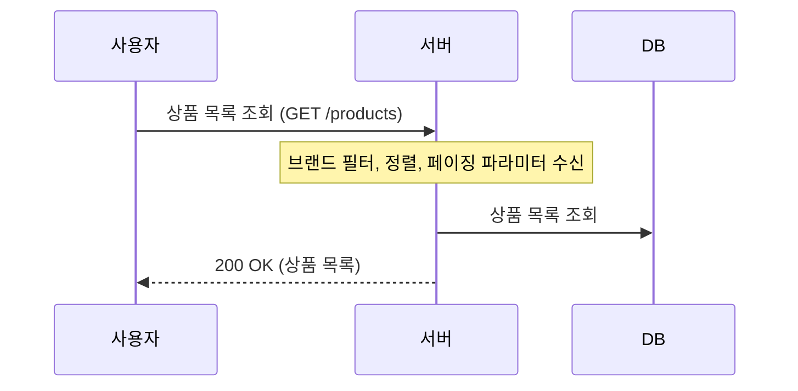
```mermaid
sequenceDiagram
    participant 사용자
    participant 서버
    participant DB

    사용자->>서버: 상품 목록 조회 (GET /products)
    Note over 서버: 브랜드 필터, 정렬, 페이징 파라미터 수신
    서버->>DB: 상품 목록 조회
    서버-->>사용자: 200 OK (상품 목록)
```

### 상세

인증 없이 접근 가능. 브랜드 필터, 정렬(최신순/가격순/좋아요순), 페이징을 지원한다. 삭제된 상품은 자동 제외된다.

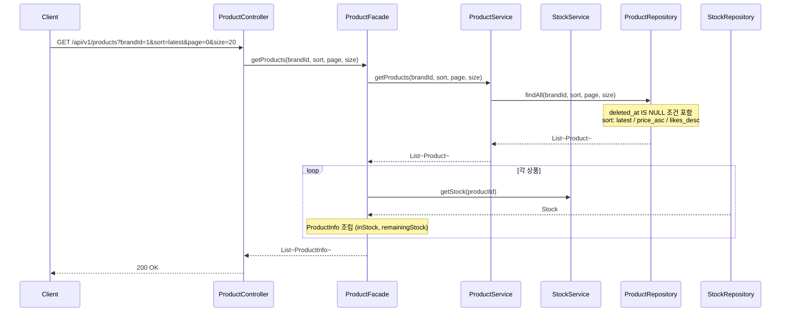
```mermaid
sequenceDiagram
    participant Client
    participant ProductController
    participant ProductFacade
    participant ProductService
    participant StockService
    participant ProductRepository
    participant StockRepository

    Client->>ProductController: GET /api/v1/products?brandId=1&sort=latest&page=0&size=20

    ProductController->>ProductFacade: getProducts(brandId, sort, page, size)

    ProductFacade->>ProductService: getProducts(brandId, sort, page, size)
    ProductService->>ProductRepository: findAll(brandId, sort, page, size)
    Note over ProductRepository: deleted_at IS NULL 조건 포함<br/>sort: latest / price_asc / likes_desc
    ProductRepository-->>ProductService: List~Product~
    ProductService-->>ProductFacade: List~Product~

    loop 각 상품
        ProductFacade->>StockService: getStock(productId)
        StockRepository-->>ProductFacade: Stock
        Note over ProductFacade: ProductInfo 조립 (inStock, remainingStock)
    end

    ProductFacade-->>ProductController: List~ProductInfo~
    ProductController-->>Client: 200 OK
```

**읽는 포인트**
- `deleted_at IS NULL` 조건으로 soft delete된 상품은 자동 제외된다.
- `likes_desc` 정렬은 `likes` 테이블 COUNT 집계를 활용한다. 성능 이슈 시 캐시 컬럼 도입을 검토한다.
- 목록 조회 시 재고는 상품별로 개별 조회한다. N+1 문제가 발생할 수 있으며, 성능 이슈 시 IN 쿼리로 일괄 조회로 개선 가능하다.
- 상품 목록에는 브랜드명이 포함되지 않는다 (상세 조회에서만 제공).

---

## 3. 상품 상세 조회

### 개요

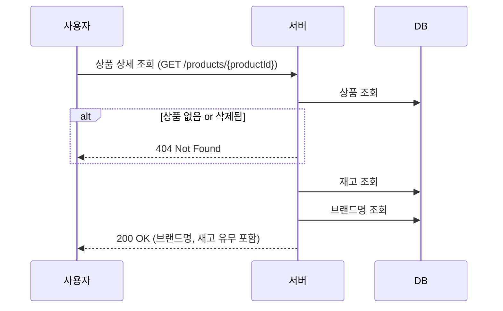
```mermaid
sequenceDiagram
    participant 사용자
    participant 서버
    participant DB

    사용자->>서버: 상품 상세 조회 (GET /products/{productId})
    서버->>DB: 상품 조회
    alt 상품 없음 or 삭제됨
        서버-->>사용자: 404 Not Found
    end
    서버->>DB: 재고 조회
    서버->>DB: 브랜드명 조회
    서버-->>사용자: 200 OK (브랜드명, 재고 유무 포함)
```

### 상세

인증 없이 접근 가능. 브랜드명과 재고 정보를 함께 반환한다.

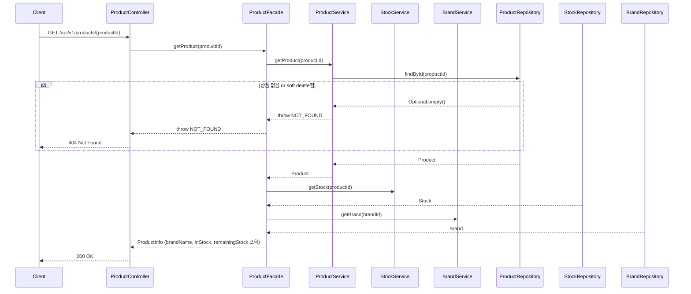
```mermaid
sequenceDiagram
    participant Client
    participant ProductController
    participant ProductFacade
    participant ProductService
    participant StockService
    participant BrandService
    participant ProductRepository
    participant StockRepository
    participant BrandRepository

    Client->>ProductController: GET /api/v1/products/{productId}

    ProductController->>ProductFacade: getProduct(productId)

    ProductFacade->>ProductService: getProduct(productId)
    ProductService->>ProductRepository: findById(productId)
    alt 상품 없음 or soft delete됨
        ProductRepository-->>ProductService: Optional.empty()
        ProductService-->>ProductFacade: throw NOT_FOUND
        ProductFacade-->>ProductController: throw NOT_FOUND
        ProductController-->>Client: 404 Not Found
    end
    ProductRepository-->>ProductService: Product
    ProductService-->>ProductFacade: Product

    ProductFacade->>StockService: getStock(productId)
    StockRepository-->>ProductFacade: Stock

    ProductFacade->>BrandService: getBrand(brandId)
    BrandRepository-->>ProductFacade: Brand

    ProductFacade-->>ProductController: ProductInfo (brandName, inStock, remainingStock 포함)
    ProductController-->>Client: 200 OK
```

**읽는 포인트**
- 상품, 재고, 브랜드 총 3번의 DB 조회가 발생한다. 성능 이슈 시 단일 쿼리(JOIN)로 개선 가능하다.
- 재고가 10개 이하면 `remainingStock`에 수량이 담기고, 초과 시 null이 반환된다.
- 삭제된 상품(`deleted_at IS NULL` 조건 미충족)은 404로 처리된다.

---

## 4. 좋아요 등록

### 개요

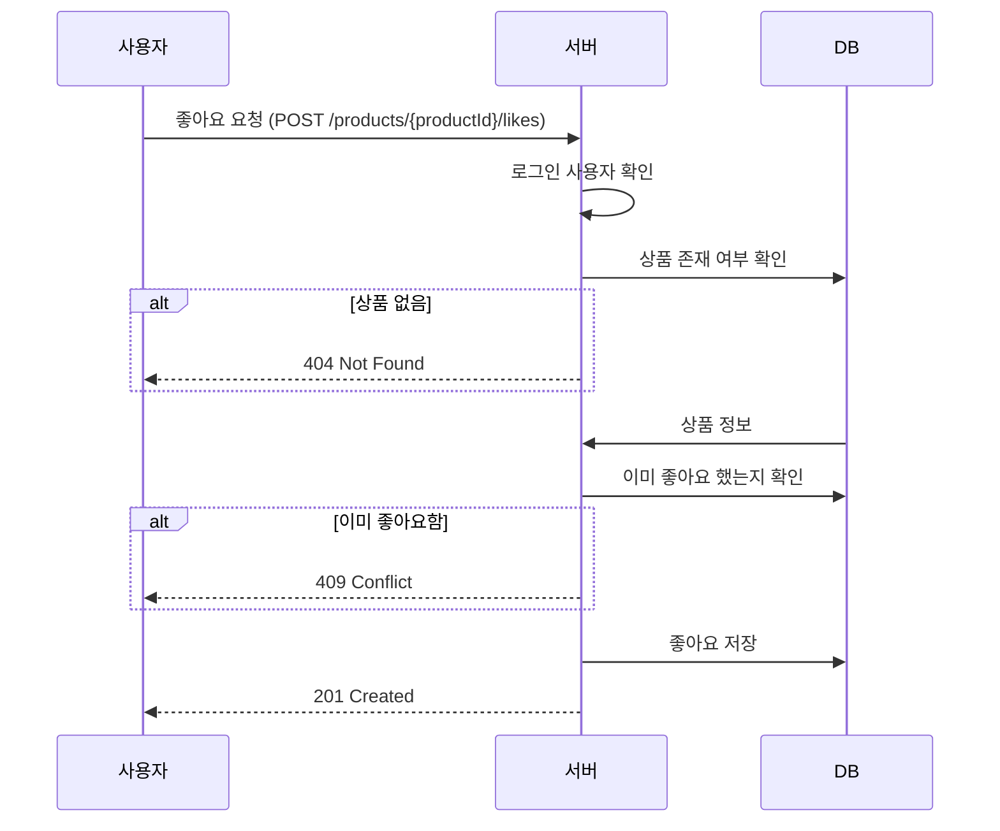
```mermaid
sequenceDiagram
    participant 사용자
    participant 서버
    participant DB

    사용자->>서버: 좋아요 요청 (POST /products/{productId}/likes)
    서버->>서버: 로그인 사용자 확인
    서버->>DB: 상품 존재 여부 확인
    alt 상품 없음
        서버-->>사용자: 404 Not Found
    end
    DB->>서버: 상품 정보
    서버->>DB: 이미 좋아요 했는지 확인
    alt 이미 좋아요함
        서버-->>사용자: 409 Conflict
    end
    서버->>DB: 좋아요 저장
    서버-->>사용자: 201 Created
```

### 상세

인증 → 상품 존재 여부 → 중복 여부 순서로 책임이 분리되는지, 각 예외 처리가 어느 레이어에서 발생하는지 확인한다.

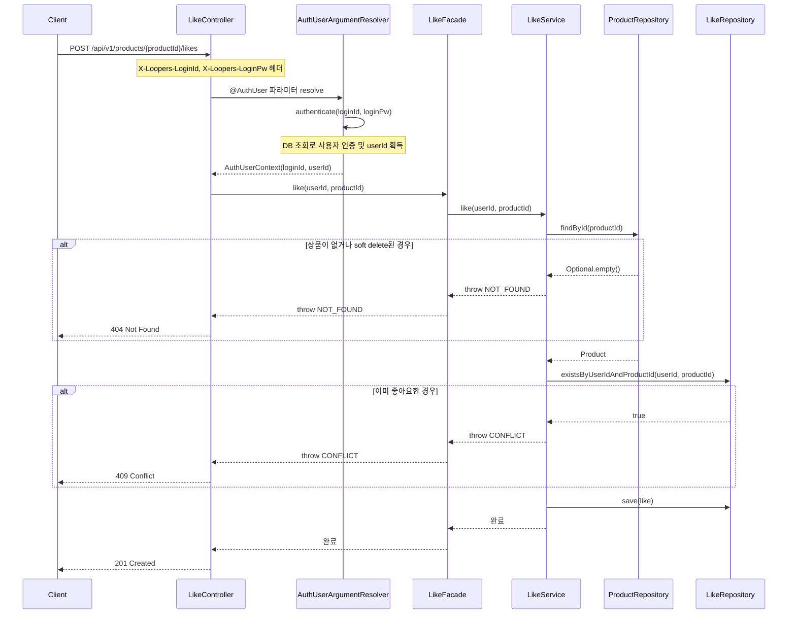
```mermaid
sequenceDiagram
    participant Client
    participant LikeController
    participant AuthUserArgumentResolver
    participant LikeFacade
    participant LikeService
    participant ProductRepository
    participant LikeRepository

    Client->>LikeController: POST /api/v1/products/{productId}/likes
    Note over LikeController: X-Loopers-LoginId, X-Loopers-LoginPw 헤더

    LikeController->>AuthUserArgumentResolver: @AuthUser 파라미터 resolve
    AuthUserArgumentResolver->>AuthUserArgumentResolver: authenticate(loginId, loginPw)
    Note over AuthUserArgumentResolver: DB 조회로 사용자 인증 및 userId 획득
    AuthUserArgumentResolver-->>LikeController: AuthUserContext(loginId, userId)

    LikeController->>LikeFacade: like(userId, productId)

    LikeFacade->>LikeService: like(userId, productId)

    LikeService->>ProductRepository: findById(productId)
    alt 상품이 없거나 soft delete된 경우
        ProductRepository-->>LikeService: Optional.empty()
        LikeService-->>LikeFacade: throw NOT_FOUND
        LikeFacade-->>LikeController: throw NOT_FOUND
        LikeController-->>Client: 404 Not Found
    end
    ProductRepository-->>LikeService: Product

    LikeService->>LikeRepository: existsByUserIdAndProductId(userId, productId)
    alt 이미 좋아요한 경우
        LikeRepository-->>LikeService: true
        LikeService-->>LikeFacade: throw CONFLICT
        LikeFacade-->>LikeController: throw CONFLICT
        LikeController-->>Client: 409 Conflict
    end

    LikeService->>LikeRepository: save(like)
    LikeService-->>LikeFacade: 완료
    LikeFacade-->>LikeController: 완료
    LikeController-->>Client: 201 Created
```

**읽는 포인트**
- soft delete된 상품은 `findById`에서 `deleted_at IS NULL` 조건으로 걸러진다.
- 중복 좋아요는 DB UK 제약보다 앞서 애플리케이션 레벨에서 먼저 확인한다.
- `AuthUserArgumentResolver`에서 `authenticate(loginId, loginPw)`로 DB 조회 후 `userId`까지 `AuthUserContext`에 담아 반환한다. Facade에서 별도로 `UserService.getUser()`를 호출할 필요가 없다.
- 인증은 `AuthUserArgumentResolver`에서 완결되어 Controller에는 `AuthUserContext(loginId, userId)`만 전달된다.

---

## 5. 좋아요 취소

### 개요

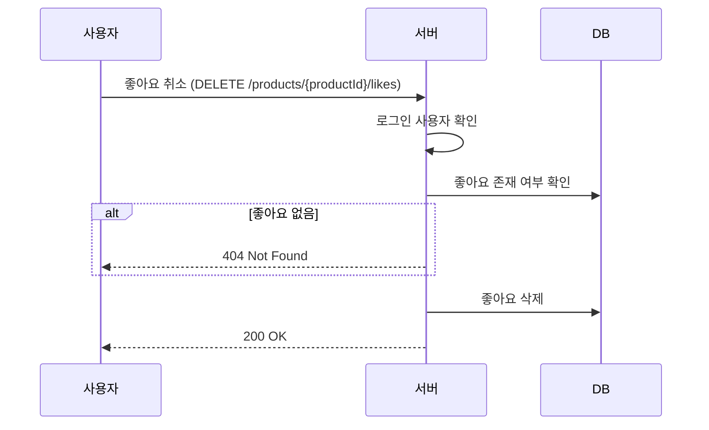
```mermaid
sequenceDiagram
    participant 사용자
    participant 서버
    participant DB

    사용자->>서버: 좋아요 취소 (DELETE /products/{productId}/likes)
    서버->>서버: 로그인 사용자 확인
    서버->>DB: 좋아요 존재 여부 확인
    alt 좋아요 없음
        서버-->>사용자: 404 Not Found
    end
    서버->>DB: 좋아요 삭제
    서버-->>사용자: 200 OK
```

### 상세

좋아요 등록과 달리 상품 존재 여부 확인 없이 좋아요 레코드 존재 여부만 확인한다.

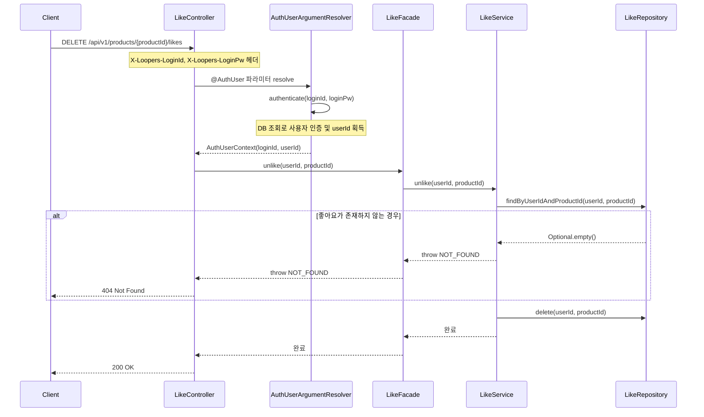
```mermaid
sequenceDiagram
    participant Client
    participant LikeController
    participant AuthUserArgumentResolver
    participant LikeFacade
    participant LikeService
    participant LikeRepository

    Client->>LikeController: DELETE /api/v1/products/{productId}/likes
    Note over LikeController: X-Loopers-LoginId, X-Loopers-LoginPw 헤더

    LikeController->>AuthUserArgumentResolver: @AuthUser 파라미터 resolve
    AuthUserArgumentResolver->>AuthUserArgumentResolver: authenticate(loginId, loginPw)
    Note over AuthUserArgumentResolver: DB 조회로 사용자 인증 및 userId 획득
    AuthUserArgumentResolver-->>LikeController: AuthUserContext(loginId, userId)

    LikeController->>LikeFacade: unlike(userId, productId)
    LikeFacade->>LikeService: unlike(userId, productId)

    LikeService->>LikeRepository: findByUserIdAndProductId(userId, productId)
    alt 좋아요가 존재하지 않는 경우
        LikeRepository-->>LikeService: Optional.empty()
        LikeService-->>LikeFacade: throw NOT_FOUND
        LikeFacade-->>LikeController: throw NOT_FOUND
        LikeController-->>Client: 404 Not Found
    end

    LikeService->>LikeRepository: delete(userId, productId)
    LikeService-->>LikeFacade: 완료
    LikeFacade-->>LikeController: 완료
    LikeController-->>Client: 200 OK
```

**읽는 포인트**
- 좋아요 취소는 상품 존재 여부를 확인하지 않는다. 좋아요 레코드가 없으면 404로 충분하다.
- 이미 삭제된 상품에 걸린 좋아요도 취소할 수 있어야 하므로 상품 조회를 생략한다.

---

## 6. 주문 생성

### 개요

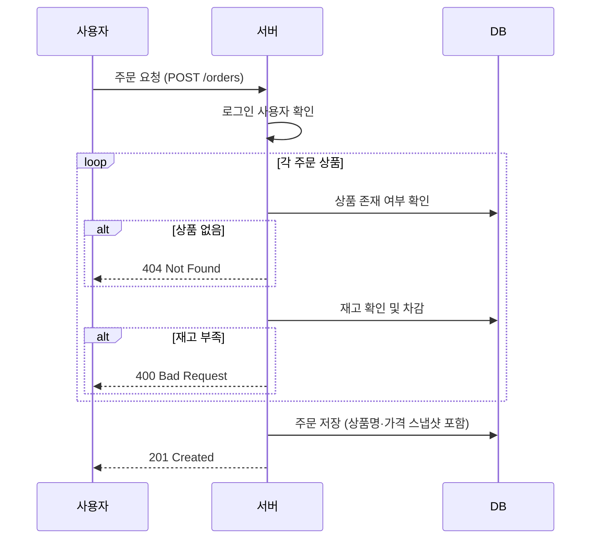
```mermaid
sequenceDiagram
    participant 사용자
    participant 서버
    participant DB

    사용자->>서버: 주문 요청 (POST /orders)
    서버->>서버: 로그인 사용자 확인
    loop 각 주문 상품
        서버->>DB: 상품 존재 여부 확인
        alt 상품 없음
            서버-->>사용자: 404 Not Found
        end
        서버->>DB: 재고 확인 및 차감
        alt 재고 부족
            서버-->>사용자: 400 Bad Request
        end
    end
    서버->>DB: 주문 저장 (상품명·가격 스냅샷 포함)
    서버-->>사용자: 201 Created
```

### 상세

단일 트랜잭션 범위, 재고 차감 실패 시 전체 롤백 흐름, 스냅샷 저장 시점을 확인한다.

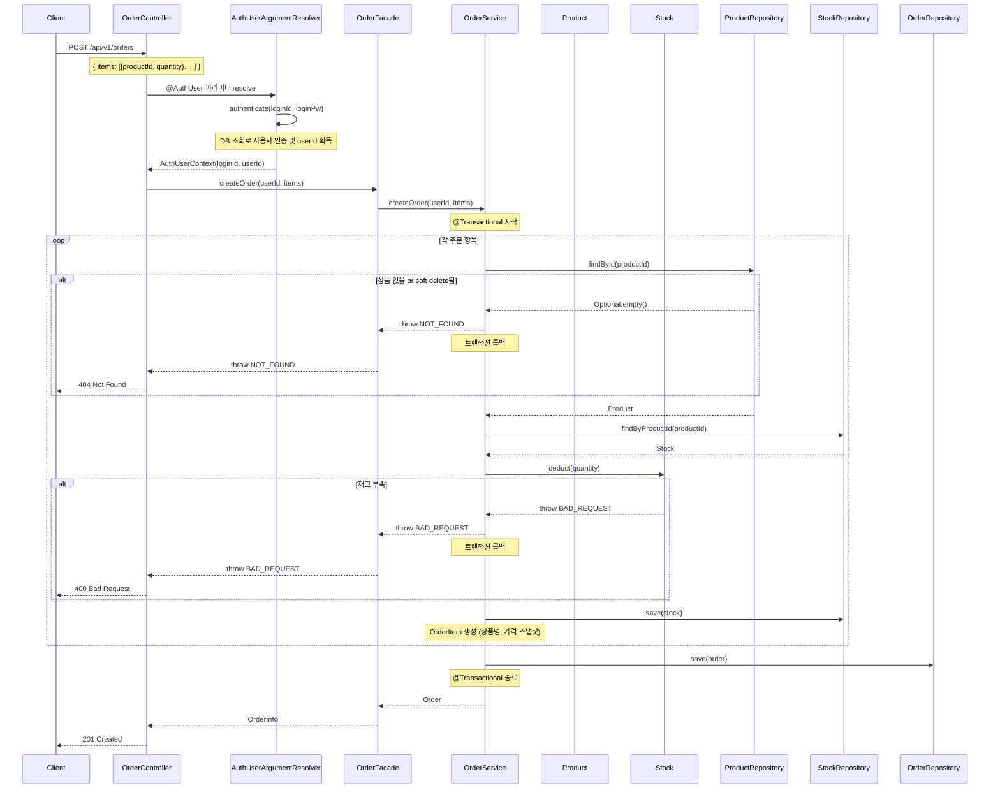
```mermaid
sequenceDiagram
    participant Client
    participant OrderController
    participant AuthUserArgumentResolver
    participant OrderFacade
    participant OrderService
    participant Product
    participant Stock
    participant ProductRepository
    participant StockRepository
    participant OrderRepository

    Client->>OrderController: POST /api/v1/orders
    Note over OrderController: { items: [{productId, quantity}, ...] }

    OrderController->>AuthUserArgumentResolver: @AuthUser 파라미터 resolve
    AuthUserArgumentResolver->>AuthUserArgumentResolver: authenticate(loginId, loginPw)
    Note over AuthUserArgumentResolver: DB 조회로 사용자 인증 및 userId 획득
    AuthUserArgumentResolver-->>OrderController: AuthUserContext(loginId, userId)

    OrderController->>OrderFacade: createOrder(userId, items)

    OrderFacade->>OrderService: createOrder(userId, items)
    Note over OrderService: @Transactional 시작

    loop 각 주문 항목
        OrderService->>ProductRepository: findById(productId)
        alt 상품 없음 or soft delete됨
            ProductRepository-->>OrderService: Optional.empty()
            OrderService-->>OrderFacade: throw NOT_FOUND
            Note over OrderService: 트랜잭션 롤백
            OrderFacade-->>OrderController: throw NOT_FOUND
            OrderController-->>Client: 404 Not Found
        end
        ProductRepository-->>OrderService: Product

        OrderService->>StockRepository: findByProductId(productId)
        StockRepository-->>OrderService: Stock

        OrderService->>Stock: deduct(quantity)
        alt 재고 부족
            Stock-->>OrderService: throw BAD_REQUEST
            OrderService-->>OrderFacade: throw BAD_REQUEST
            Note over OrderService: 트랜잭션 롤백
            OrderFacade-->>OrderController: throw BAD_REQUEST
            OrderController-->>Client: 400 Bad Request
        end

        OrderService->>StockRepository: save(stock)
        Note over OrderService: OrderItem 생성 (상품명, 가격 스냅샷)
    end

    OrderService->>OrderRepository: save(order)
    Note over OrderService: @Transactional 종료

    OrderService-->>OrderFacade: Order
    OrderFacade-->>OrderController: OrderInfo
    OrderController-->>Client: 201 Created
```

**읽는 포인트**
- `@Transactional`이 루프 전체를 감싸므로 중간 실패 시 이미 차감된 재고도 전부 롤백된다.
- 재고 차감 책임은 `OrderService`가 아닌 `Stock.deduct()`에 있다. `Stock`은 `Product`와 분리된 엔티티로, 재고 관련 락 경쟁이 `stocks` row에만 집중된다.
- `OrderItem` 생성 시점에 상품명과 가격을 직접 복사해두므로, 이후 상품 정보가 바뀌어도 주문 내역은 영향받지 않는다.
- `AuthUserArgumentResolver`에서 인증과 동시에 `userId`를 획득하므로 Facade에서 별도 `UserService.getUser()` 호출 없이 바로 `userId`를 사용한다. OrderService는 순수하게 userId(Long)만 받는다.

---

## 7. 주문 상세 조회

### 개요

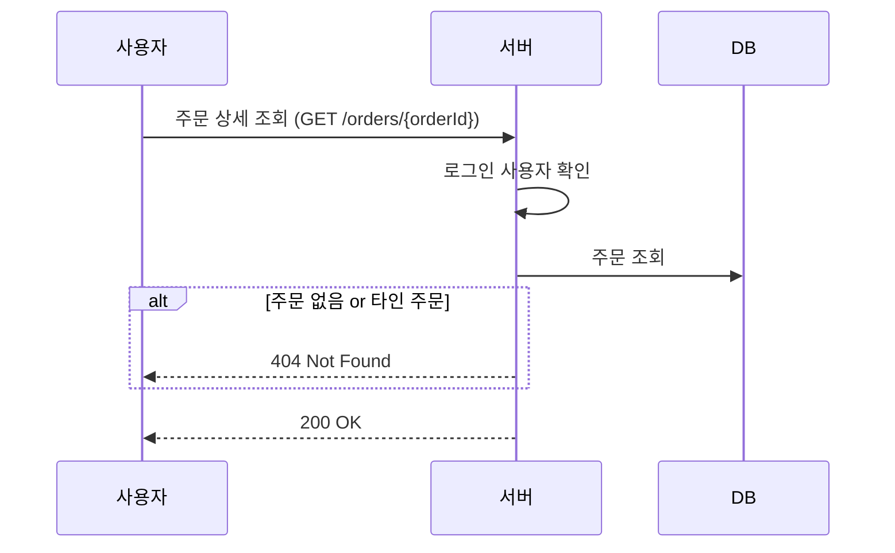
```mermaid
sequenceDiagram
    participant 사용자
    participant 서버
    participant DB

    사용자->>서버: 주문 상세 조회 (GET /orders/{orderId})
    서버->>서버: 로그인 사용자 확인
    서버->>DB: 주문 조회
    alt 주문 없음 or 타인 주문
        서버-->>사용자: 404 Not Found
    end
    서버-->>사용자: 200 OK
```

### 상세

본인 주문만 조회 가능. 타인의 주문 접근 시 존재 여부를 노출하지 않고 404로 응답한다.

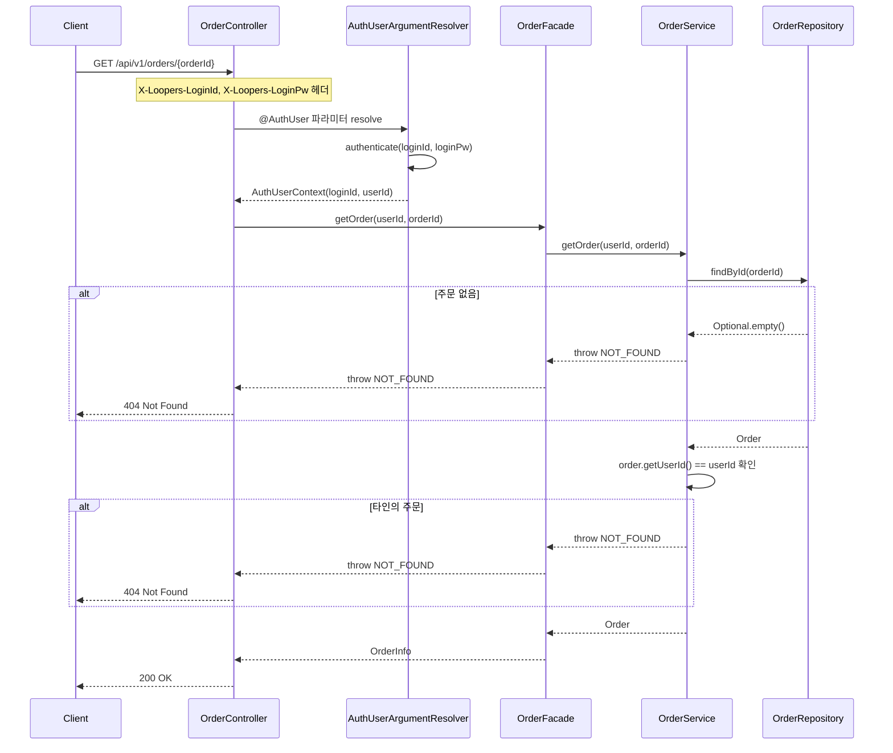
```mermaid
sequenceDiagram
    participant Client
    participant OrderController
    participant AuthUserArgumentResolver
    participant OrderFacade
    participant OrderService
    participant OrderRepository

    Client->>OrderController: GET /api/v1/orders/{orderId}
    Note over OrderController: X-Loopers-LoginId, X-Loopers-LoginPw 헤더

    OrderController->>AuthUserArgumentResolver: @AuthUser 파라미터 resolve
    AuthUserArgumentResolver->>AuthUserArgumentResolver: authenticate(loginId, loginPw)
    AuthUserArgumentResolver-->>OrderController: AuthUserContext(loginId, userId)

    OrderController->>OrderFacade: getOrder(userId, orderId)
    OrderFacade->>OrderService: getOrder(userId, orderId)

    OrderService->>OrderRepository: findById(orderId)
    alt 주문 없음
        OrderRepository-->>OrderService: Optional.empty()
        OrderService-->>OrderFacade: throw NOT_FOUND
        OrderFacade-->>OrderController: throw NOT_FOUND
        OrderController-->>Client: 404 Not Found
    end
    OrderRepository-->>OrderService: Order

    OrderService->>OrderService: order.getUserId() == userId 확인
    alt 타인의 주문
        OrderService-->>OrderFacade: throw NOT_FOUND
        OrderFacade-->>OrderController: throw NOT_FOUND
        OrderController-->>Client: 404 Not Found
    end

    OrderService-->>OrderFacade: Order
    OrderFacade-->>OrderController: OrderInfo
    OrderController-->>Client: 200 OK
```

**읽는 포인트**
- 타인의 주문 접근 시 403 Forbidden이 아닌 404 Not Found로 응답한다. 주문 존재 여부 자체를 노출하지 않기 위함이다.
- userId 검증은 OrderService 레이어에서 처리한다. Controller에서 처리하면 Service가 순수하지 않아진다.

---

## 8. [어드민] 브랜드 삭제

### 개요

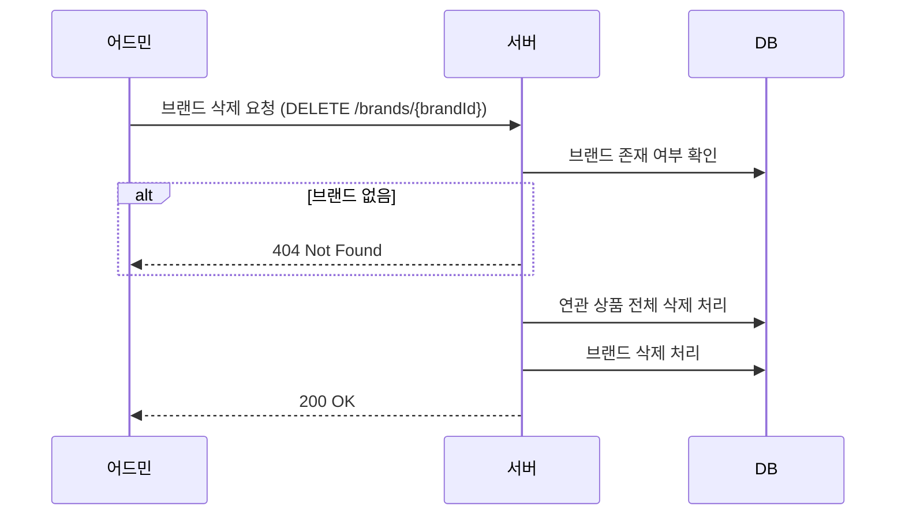
```mermaid
sequenceDiagram
    participant 어드민
    participant 서버
    participant DB

    어드민->>서버: 브랜드 삭제 요청 (DELETE /brands/{brandId})
    서버->>DB: 브랜드 존재 여부 확인
    alt 브랜드 없음
        서버-->>어드민: 404 Not Found
    end
    서버->>DB: 연관 상품 전체 삭제 처리
    서버->>DB: 브랜드 삭제 처리
    서버-->>어드민: 200 OK
```

### 상세

브랜드 삭제 시 연관 상품도 soft delete 처리되는 흐름, 트랜잭션 범위를 확인한다.

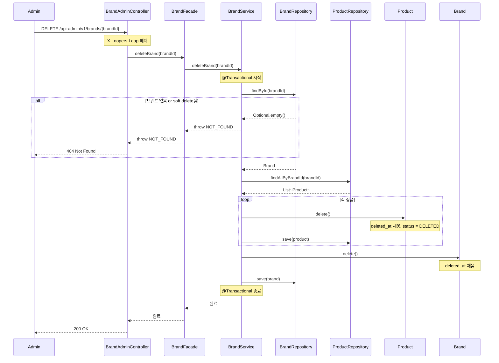
```mermaid
sequenceDiagram
    participant Admin
    participant BrandAdminController
    participant BrandFacade
    participant BrandService
    participant BrandRepository
    participant ProductRepository

    Admin->>BrandAdminController: DELETE /api-admin/v1/brands/{brandId}
    Note over BrandAdminController: X-Loopers-Ldap 헤더

    BrandAdminController->>BrandFacade: deleteBrand(brandId)
    BrandFacade->>BrandService: deleteBrand(brandId)
    Note over BrandService: @Transactional 시작

    BrandService->>BrandRepository: findById(brandId)
    alt 브랜드 없음 or soft delete됨
        BrandRepository-->>BrandService: Optional.empty()
        BrandService-->>BrandFacade: throw NOT_FOUND
        BrandFacade-->>BrandAdminController: throw NOT_FOUND
        BrandAdminController-->>Admin: 404 Not Found
    end
    BrandRepository-->>BrandService: Brand

    BrandService->>ProductRepository: findAllByBrandId(brandId)
    ProductRepository-->>BrandService: List~Product~

    loop 각 상품
        BrandService->>Product: delete()
        Note over Product: deleted_at 채움, status = DELETED
        BrandService->>ProductRepository: save(product)
    end

    BrandService->>Brand: delete()
    Note over Brand: deleted_at 채움
    BrandService->>BrandRepository: save(brand)

    Note over BrandService: @Transactional 종료
    BrandService-->>BrandFacade: 완료
    BrandFacade-->>BrandAdminController: 완료
    BrandAdminController-->>Admin: 200 OK
```

**읽는 포인트**
- 상품 soft delete → 브랜드 soft delete 순서로 처리된다.
- 하나의 트랜잭션 안에서 처리되므로 중간 실패 시 전체 롤백, 부분 삭제 상태가 발생하지 않는다.
- `deleted_at`을 채우는 책임은 `Brand.delete()`, `Product.delete()` 도메인 메서드에 있다. `Product.delete()`는 BaseEntity의 `delete()`를 오버라이드하여 `deleted_at` 채움과 함께 `status = DELETED`로도 변경한다. `Brand`는 status 필드가 없으므로 `deleted_at`만 채운다.
- `ProductRepository.findAllByBrandId()`는 이미 soft delete된 상품은 제외하고 반환한다 (deletedAt IS NULL 조건).
