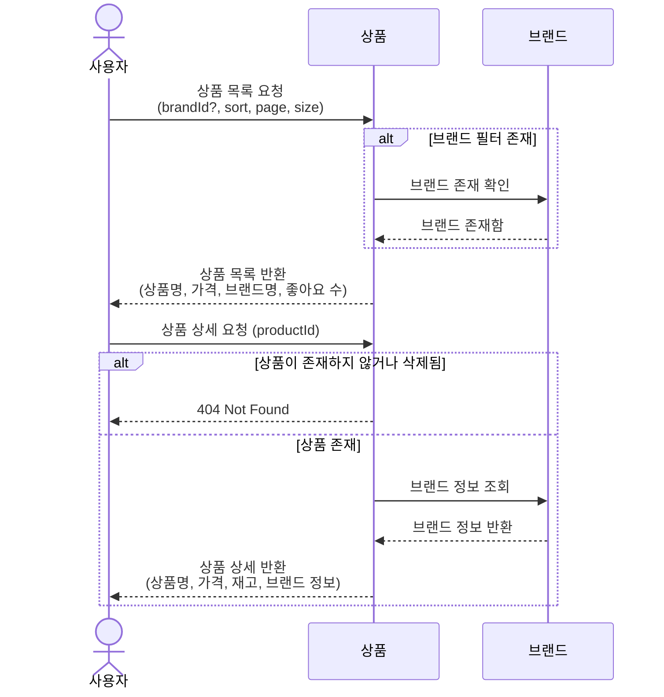
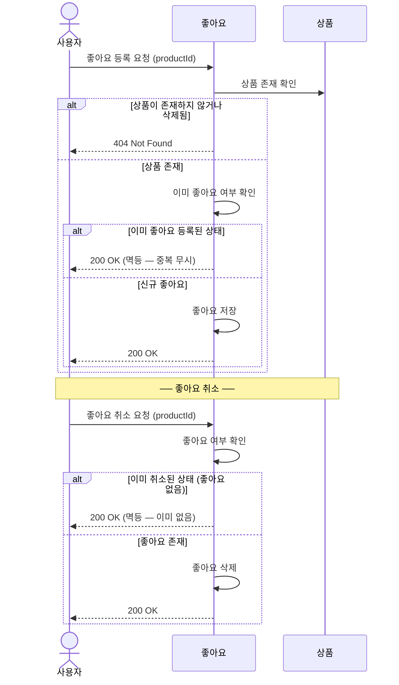
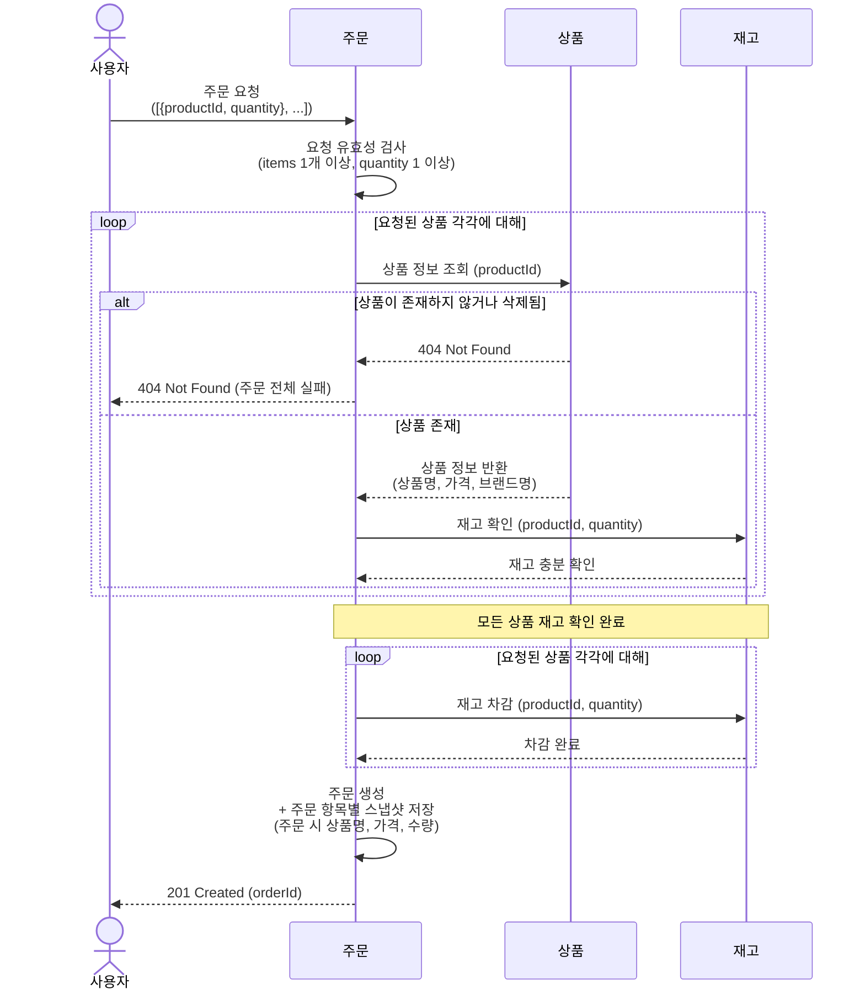
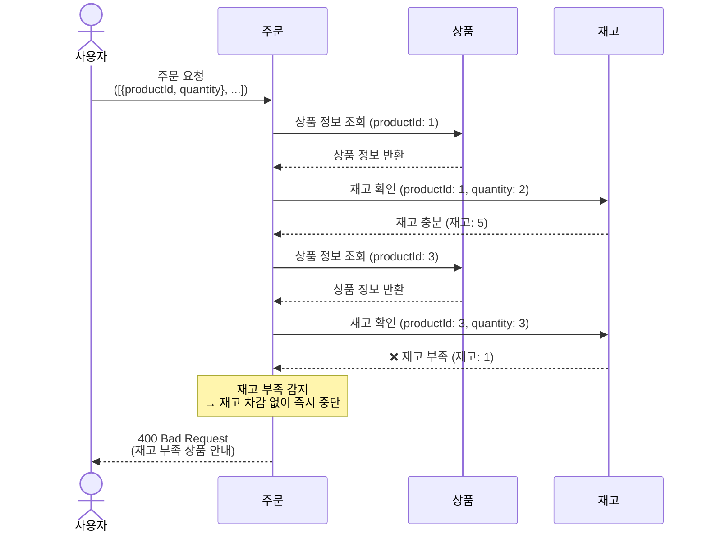

# 02. 시퀀스 다이어그램

> 주요 비즈니스 플로우 4가지를 다이어그램으로 표현합니다.

---

## 목차

1. [상품 탐색 — 목록 조회 → 상세 조회](#1-상품-탐색--목록-조회--상세-조회)
2. [상품 좋아요 등록 / 취소 (멱등)](#2-상품-좋아요-등록--취소-멱등)
3. [주문 생성 — 정상 흐름](#3-주문-생성--정상-흐름)
4. [주문 생성 — 재고 부족 실패 흐름](#4-주문-생성--재고-부족-실패-흐름)

---

## 1. 상품 탐색 — 목록 조회 → 상세 조회

사용자가 상품 목록을 탐색하고, 특정 상품의 상세 정보를 확인하는 흐름입니다.  
브랜드 필터와 정렬 조건을 조합할 수 있으며, 상세 조회 시 브랜드 정보도 함께 제공됩니다.



---

## 2. 상품 좋아요 등록 / 취소 (멱등)

로그인한 사용자가 상품에 좋아요를 등록하거나 취소하는 흐름입니다.  
**멱등성**이 보장되어, 이미 등록/취소된 상태에서 동일 요청이 들어와도 에러 없이 정상 처리됩니다.



---

## 3. 주문 생성 — 정상 흐름

사용자가 여러 상품을 한 번에 주문하는 흐름입니다.  
모든 상품의 재고가 충분할 때, 재고를 차감하고 주문을 생성합니다.  
**주문 시점의 상품 정보(명칭, 가격)는 스냅샷으로 주문 항목에 저장**됩니다.



---

## 4. 주문 생성 — 재고 부족 실패 흐름

재고 확인 중 하나라도 수량이 부족하면 **주문 전체가 실패**합니다.  
재고 차감은 일어나지 않으며, 사용자에게 부족한 상품 정보를 알려줍니다.



---

## 플로우 간 관계 요약

```
[상품 탐색]
  사용자가 상품을 둘러보고, 원하는 상품을 발견한다.
       ↓
[좋아요 등록]
  마음에 드는 상품에 좋아요를 누른다. (멱등)
       ↓
[주문 생성 — 정상]
  여러 상품을 담아 주문한다. 재고 확인 → 차감 → 스냅샷 저장.
       ↓ (재고 부족 시 분기)
[주문 생성 — 실패]
  재고 부족 상품이 있으면 주문 전체가 거부된다.
```
