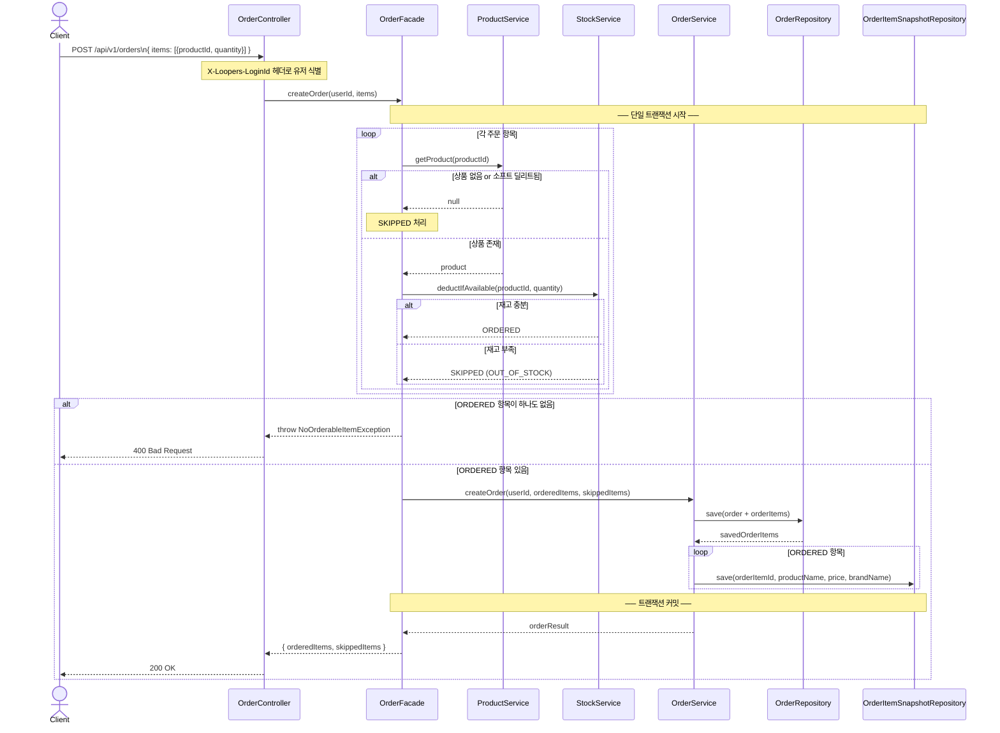
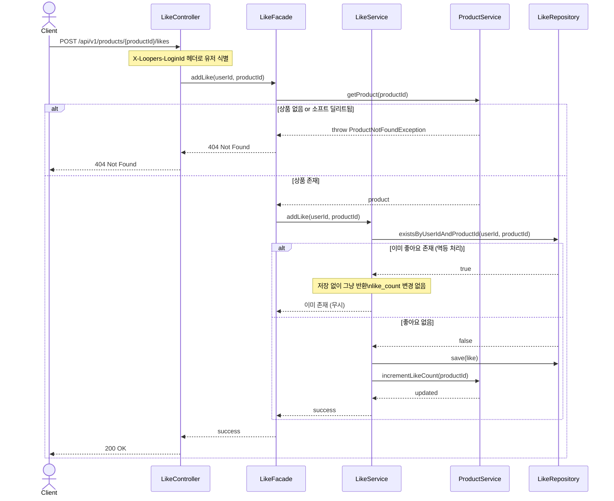
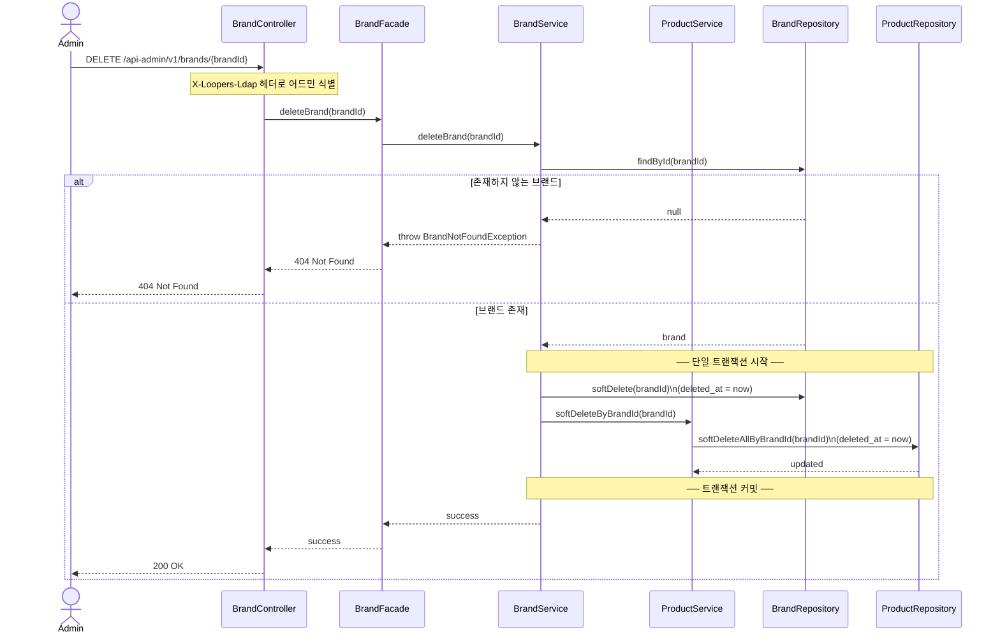

# 02. 시퀀스 다이어그램

---

## SD-01. 주문 생성

### 왜 이 다이어그램이 필요한가

주문 생성은 이 서비스에서 가장 복잡한 흐름이다.
- 재고 확인과 차감이 동일 트랜잭션 안에서 일어나야 하는지
- 부분 주문(SKIPPED 처리)이 어느 레이어에서 결정되는지
- 스냅샷이 언제, 어디서 저장되는지

위 세 가지를 이 다이어그램으로 검증한다.

### 읽는 포인트

1. **트랜잭션 경계**: `단일 트랜잭션 시작` ~ `트랜잭션 커밋` 사이에서 재고 차감과 주문 저장이 함께 일어난다. 둘 중 하나라도 실패하면 전체 롤백된다.
2. **SKIPPED 결정 위치**: Facade 레이어에서 항목별로 ORDERED/SKIPPED를 분류한다. OrderService는 이미 분류된 결과만 받아서 저장하므로 도메인 로직이 오염되지 않는다.
3. **스냅샷 저장 시점**: Order와 OrderItem이 저장된 직후, 동일 트랜잭션 안에서 스냅샷이 저장된다. 트랜잭션이 커밋되어야 스냅샷도 확정된다.

---

## SD-02. 좋아요 등록 (멱등 처리)

### 왜 이 다이어그램이 필요한가

좋아요는 멱등하게 동작해야 한다.
- 같은 요청이 두 번 오더라도 like_count가 중복 증가하지 않아야 한다
- 어느 레이어에서 중복을 판단하고, like_count 업데이트 책임이 어디에 있는지를 검증한다.

### 읽는 포인트

1. **멱등 판단 위치**: LikeService가 DB 조회로 중복 여부를 확인한다. DB의 `(user_id, product_id)` 유니크 제약이 최후 방어선이지만, 서비스 레이어에서 먼저 판단해서 불필요한 예외 발생을 막는다.
2. **like_count 책임**: LikeService가 직접 `like_count`를 수정하지 않고, `ProductService.incrementLikeCount()`에 위임한다. like_count의 소유권은 Product 도메인에 있다.
3. **좋아요 취소도 동일한 구조**: DELETE 요청 시 존재하지 않는 좋아요를 취소하려 해도 200 OK를 반환한다 (멱등).

---

## SD-03. 브랜드 삭제 (소프트 딜리트 cascade)

### 왜 이 다이어그램이 필요한가

브랜드 삭제 시 해당 브랜드의 상품도 함께 삭제된다.
- 이 cascade가 어느 레이어에서 처리되는지
- 소프트 딜리트이므로 실제 행 삭제가 아닌 deleted_at 설정임을 검증한다.
- 이미 주문된 상품이 있어도 주문 이력에는 영향이 없어야 한다.

### 읽는 포인트

1. **소프트 딜리트**: 실제 행을 삭제하지 않고 `deleted_at = now()`로 처리한다. 기존 주문 이력의 `order_item_snapshots`에는 영향이 없다.
2. **cascade 처리 위치**: BrandService가 ProductService를 호출해서 상품도 함께 소프트 딜리트한다. DB의 ON DELETE CASCADE가 아닌 애플리케이션 레벨에서 처리하므로 소프트 딜리트 적용이 가능하다.
3. **주문 이력 보호**: 삭제된 브랜드/상품이더라도 `order_item_snapshots`에 이미 저장된 스냅샷(상품명, 가격, 브랜드명)은 그대로 유지된다. 주문 조회 시 스냅샷 테이블에서 읽기 때문에 원본 상품/브랜드 삭제와 무관하다.
