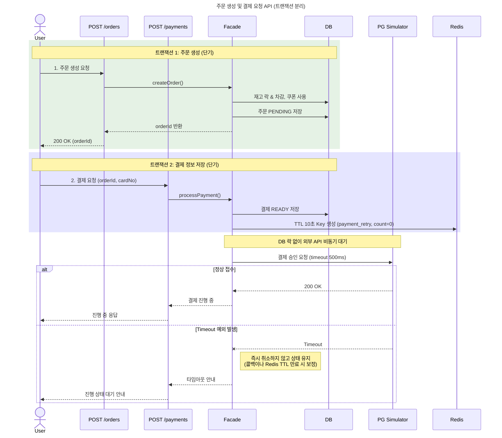
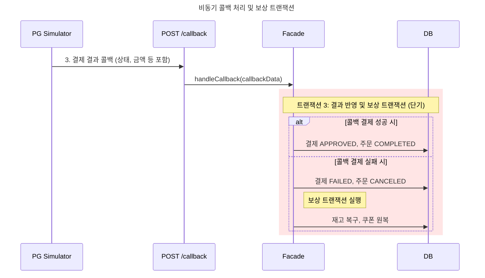
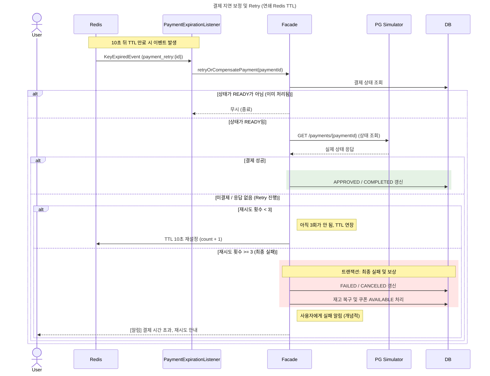
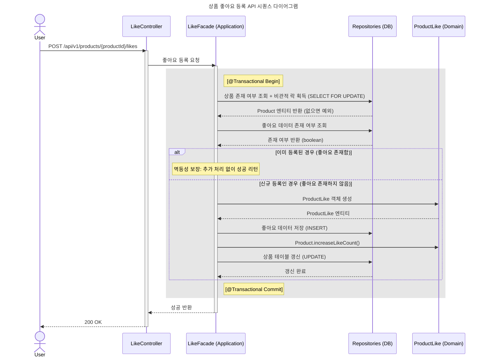
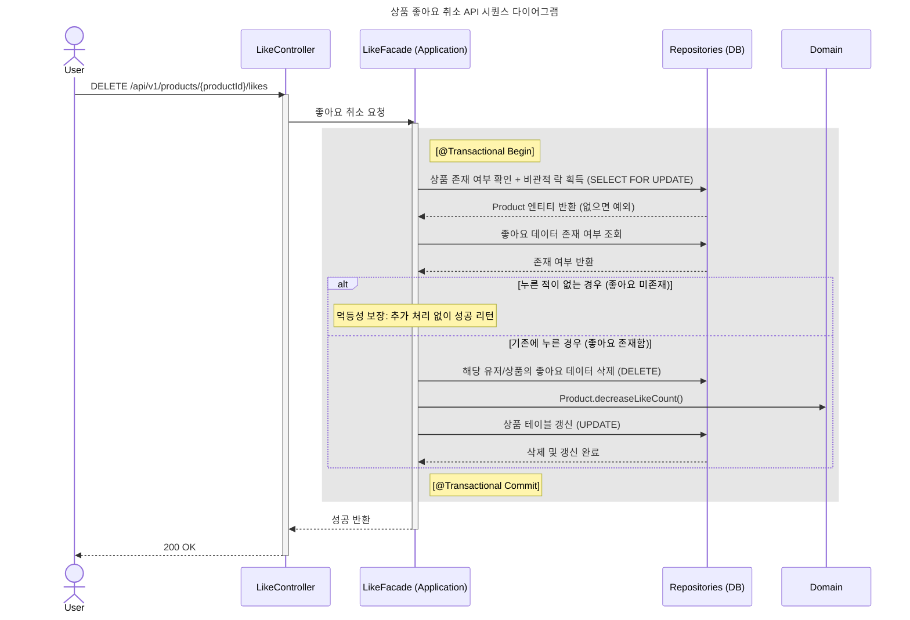
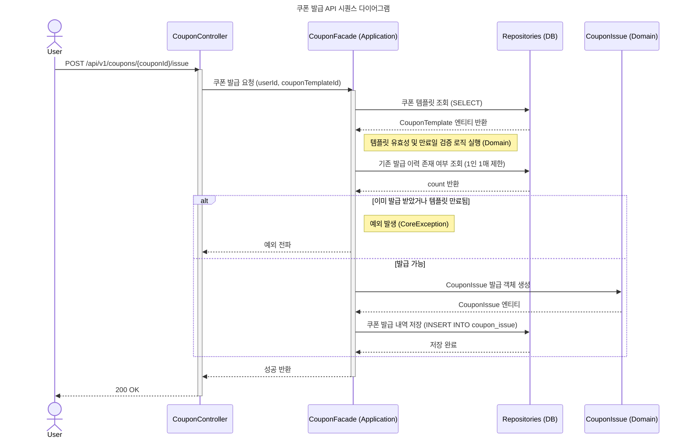
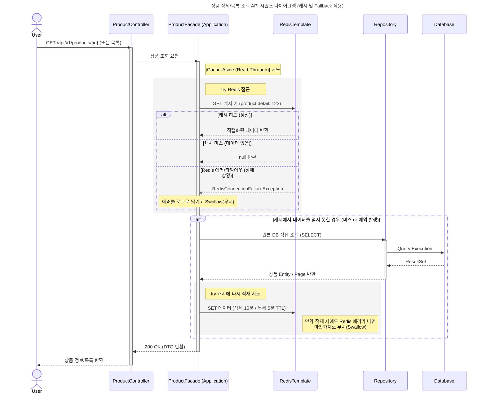
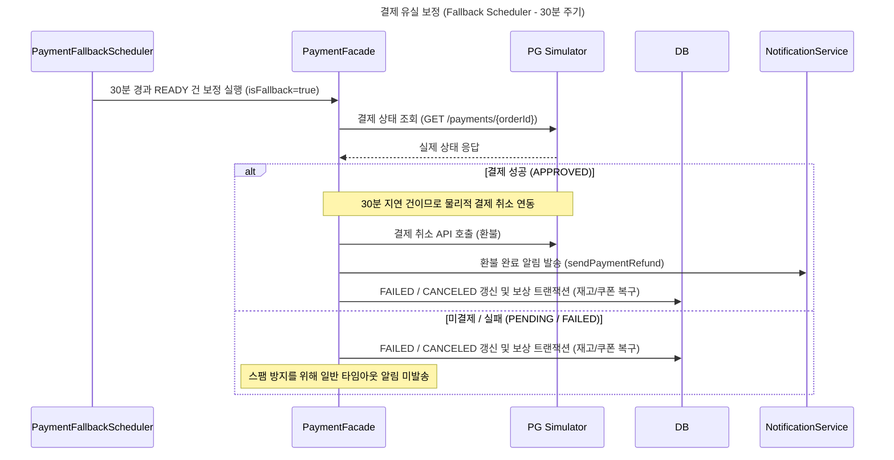

```mermaid
sequenceDiagram
    title 주문 생성 및 결제 요청 API (트랜잭션 분리)
    actor User
    participant OrderAPI as POST /orders
    participant PaymentAPI as POST /payments
    participant Facade as Facade
    participant DB
    participant PG as PG Simulator
    participant Redis

    %% 1단계: 주문 생성
    rect rgba(0, 128, 0, 0.1)
        Note over User, DB: 트랜잭션 1: 주문 생성 (단기)
        User->>OrderAPI: 1. 주문 생성 요청
        OrderAPI->>Facade: createOrder()
        Facade->>DB: 재고 락 & 차감, 쿠폰 사용
        Facade->>DB: 주문 PENDING 저장
        Facade-->>OrderAPI: orderId 반환
        OrderAPI-->>User: 200 OK (orderId)
    end

    %% 2단계: 결제 요청
    rect rgba(0, 0, 255, 0.1)
        Note over User, DB: 트랜잭션 2: 결제 정보 저장 (단기)
        User->>PaymentAPI: 2. 결제 요청 (orderId, cardNo)
        PaymentAPI->>Facade: processPayment()
        Facade->>DB: 결제 READY 저장
        Facade->>Redis: TTL 10초 Key 생성 (payment_retry, count=0)
    end
    
    Note over Facade, PG: DB 락 없이 외부 API 비동기 대기
    Facade->>PG: 결제 승인 요청 (timeout 500ms)
    
    alt 정상 접수
        PG-->>Facade: 200 OK
        Facade-->>PaymentAPI: 결제 진행 중
        PaymentAPI-->>User: 진행 중 응답
    else Timeout 예외 발생
        PG--xFacade: Timeout
        Note right of Facade: 즉시 취소하지 않고 상태 유지<br>(콜백이나 Redis TTL 만료 시 보정)
        Facade-->>PaymentAPI: 타임아웃 안내
        PaymentAPI-->>User: 진행 상태 대기 안내
    end
```

```mermaid
sequenceDiagram
    title 비동기 콜백 처리 및 보상 트랜잭션
    participant PG as PG Simulator
    participant CallbackAPI as POST /callback
    participant Facade as Facade
    participant DB

    PG->>CallbackAPI: 3. 결제 결과 콜백 (상태, 금액 등 포함)
    CallbackAPI->>Facade: handleCallback(callbackData)

    rect rgba(255, 0, 0, 0.1)
        Note over Facade, DB: 트랜잭션 3: 결과 반영 및 보상 트랜잭션 (단기)
        alt 콜백 결제 성공 시
            Facade->>DB: 결제 APPROVED, 주문 COMPLETED
        else 콜백 결제 실패 시
            Facade->>DB: 결제 FAILED, 주문 CANCELED
            Note right of Facade: 보상 트랜잭션 실행
            Facade->>DB: 재고 복구, 쿠폰 원복
        end
    end
```

```mermaid
sequenceDiagram
    title 결제 지연 보정 및 Retry (연쇄 Redis TTL)
    actor User
    participant Redis
    participant Listener as PaymentExpirationListener
    participant Facade as Facade
    participant PG as PG Simulator
    participant DB

    Note over Redis, Listener: 10초 뒤 TTL 만료 시 이벤트 발생
    Redis->>Listener: KeyExpiredEvent (payment_retry:{id})
    Listener->>Facade: retryOrCompensatePayment(paymentId)

    Facade->>DB: 결제 상태 조회
    alt 상태가 READY가 아님 (이미 처리됨)
        Facade-->>Listener: 무시 (종료)
    else 상태가 READY임
        Facade->>PG: GET /payments/{paymentId} (상태 조회)
        PG-->>Facade: 실제 상태 응답
        
        alt 결제 성공
            rect rgba(0, 128, 0, 0.1)
                Facade->>DB: APPROVED / COMPLETED 갱신
            end
        else 미결제 / 응답 없음 (Retry 진행)
            alt 재시도 횟수 < 3
                Note right of Facade: 아직 3회가 안 됨, TTL 연장
                Facade->>Redis: TTL 10초 재설정 (count + 1)
            else 재시도 횟수 >= 3 (최종 실패)
                rect rgba(255, 0, 0, 0.1)
                    Note over Facade, DB: 트랜잭션: 최종 실패 및 보상
                    Facade->>DB: FAILED / CANCELED 갱신
                    Facade->>DB: 재고 복구 및 쿠폰 AVAILABLE 처리
                end
                Note right of Facade: 사용자에게 실패 알림 (개념적)
                Facade-->>User: [알림] 결제 시간 초과, 재시도 안내
            end
        end
    end
```

```mermaid
sequenceDiagram
    title 상품 좋아요 등록 API 시퀀스 다이어그램
    actor User
    participant Controller as LikeController
    participant Facade as LikeFacade (Application)
    participant Repo as Repositories (DB)
    participant Domain as ProductLike (Domain)

    User->>Controller: POST /api/v1/products/{productId}/likes
    activate Controller

    Controller->>Facade: 좋아요 등록 요청
    activate Facade

    rect rgba(128, 128, 128, 0.2)
        Note right of Facade: [@Transactional Begin]

        Facade->>Repo: 상품 존재 여부 조회 + 비관적 락 획득 (SELECT FOR UPDATE)
        Repo-->>Facade: Product 엔티티 반환 (없으면 예외)

        Facade->>Repo: 좋아요 데이터 존재 여부 조회
        Repo-->>Facade: 존재 여부 반환 (boolean)

        alt 이미 등록된 경우 (좋아요 존재함)
            Note over Facade: 멱등성 보장: 추가 처리 없이 성공 리턴
        else 신규 등록인 경우 (좋아요 존재하지 않음)
            Facade->>Domain: ProductLike 객체 생성
            Domain-->>Facade: ProductLike 엔티티
            Facade->>Repo: 좋아요 데이터 저장 (INSERT)
            
            Facade->>Domain: Product.increaseLikeCount()
            Facade->>Repo: 상품 테이블 갱신 (UPDATE)
            Repo-->>Facade: 갱신 완료
        end
        Note right of Facade: [@Transactional Commit]
    end

    Facade-->>Controller: 성공 반환
    deactivate Facade

    Controller-->>User: 200 OK
    deactivate Controller
```

```mermaid
sequenceDiagram
    title 상품 좋아요 취소 API 시퀀스 다이어그램
    actor User
    participant Controller as LikeController
    participant Facade as LikeFacade (Application)
    participant Repo as Repositories (DB)

    User->>Controller: DELETE /api/v1/products/{productId}/likes
    activate Controller

    Controller->>Facade: 좋아요 취소 요청
    activate Facade

    rect rgba(128, 128, 128, 0.2)
        Note right of Facade: [@Transactional Begin]

        Facade->>Repo: 상품 존재 여부 확인 + 비관적 락 획득 (SELECT FOR UPDATE)
        Repo-->>Facade: Product 엔티티 반환 (없으면 예외)

        Facade->>Repo: 좋아요 데이터 존재 여부 조회
        Repo-->>Facade: 존재 여부 반환

        alt 누른 적이 없는 경우 (좋아요 미존재)
            Note over Facade: 멱등성 보장: 추가 처리 없이 성공 리턴
        else 기존에 누른 경우 (좋아요 존재함)
            Facade->>Repo: 해당 유저/상품의 좋아요 데이터 삭제 (DELETE)
            
            Facade->>Domain: Product.decreaseLikeCount()
            Facade->>Repo: 상품 테이블 갱신 (UPDATE)
            Repo-->>Facade: 삭제 및 갱신 완료
        end
        Note right of Facade: [@Transactional Commit]
    end

    Facade-->>Controller: 성공 반환
    deactivate Facade

    Controller-->>User: 200 OK
    deactivate Controller
```

```mermaid
sequenceDiagram
    title 쿠폰 발급 API 시퀀스 다이어그램
    actor User
    participant Controller as CouponController
    participant Facade as CouponFacade (Application)
    participant Repo as Repositories (DB)
    participant Domain as CouponIssue (Domain)

    User->>Controller: POST /api/v1/coupons/{couponId}/issue
    activate Controller

    Controller->>Facade: 쿠폰 발급 요청 (userId, couponTemplateId)
    activate Facade

    Facade->>Repo: 쿠폰 템플릿 조회 (SELECT)
    Repo-->>Facade: CouponTemplate 엔티티 반환

    Note right of Facade: 템플릿 유효성 및 만료일 검증 로직 실행 (Domain)
    Facade->>Repo: 기존 발급 이력 존재 여부 조회 (1인 1매 제한)
    Repo-->>Facade: count 반환 

    alt 이미 발급 받았거나 템플릿 만료됨
        Note right of Facade: 예외 발생 (CoreException)
        Facade-->>Controller: 예외 전파
    else 발급 가능
        Facade->>Domain: CouponIssue 발급 객체 생성
        Domain-->>Facade: CouponIssue 엔티티
        Facade->>Repo: 쿠폰 발급 내역 저장 (INSERT INTO coupon_issue)
        Repo-->>Facade: 저장 완료
    end

    Facade-->>Controller: 성공 반환
    deactivate Facade
    Controller-->>User: 200 OK
    deactivate Controller
```

```mermaid
sequenceDiagram
    title 상품 상세/목록 조회 API 시퀀스 다이어그램 (캐시 및 Fallback 적용)
    actor User
    participant Controller as ProductController
    participant Facade as ProductFacade (Application)
    participant Cache as RedisTemplate
    participant Repo as Repository
    participant DB as Database

    User->>Controller: GET /api/v1/products/{id} (또는 목록)
    activate Controller

    Controller->>Facade: 상품 조회 요청
    activate Facade

    Note right of Facade: [Cache-Aside (Read-Through)] 시도
    
    rect rgba(200, 200, 200, 0.2)
        Note right of Facade: try Redis 접근
        Facade->>Cache: GET 캐시 키 (product:detail::123)
        alt 캐시 히트 (정상)
            Cache-->>Facade: 직렬화된 데이터 반환
        else 캐시 미스 (데이터 없음)
            Cache-->>Facade: null 반환
        else Redis 에러/타임아웃 (장애 상황)
            Cache--xFacade: RedisConnectionFailureException
            Note over Facade: 에러를 로그로 남기고 Swallow(무시)
        end
    end

    alt 캐시에서 데이터를 얻지 못한 경우 (미스 or 예외 발생)
        Facade->>Repo: 원본 DB 직접 조회 (SELECT)
        activate Repo
        Repo->>DB: Query Execution
        DB-->>Repo: ResultSet
        Repo-->>Facade: 상품 Entity / Page 반환
        deactivate Repo
        
        rect rgba(200, 200, 200, 0.2)
            Note right of Facade: try 캐시에 다시 적재 시도
            Facade->>Cache: SET 데이터 (상세 10분 / 목록 5분 TTL)
            Note right of Cache: 만약 적재 시에도 Redis 에러가 나면 <br>마찬가지로 무시(Swallow)
        end
    end

    Facade-->>Controller: 200 OK (DTO 반환)
    deactivate Facade

    Controller-->>User: 상품 정보/목록 반환
    deactivate Controller
```

```mermaid
sequenceDiagram
    title 결제 유실 보정 (Fallback Scheduler - 30분 주기)
    participant Scheduler as PaymentFallbackScheduler
    participant Facade as PaymentFacade
    participant PG as PG Simulator
    participant DB
    participant Notification as NotificationService

    Scheduler->>Facade: 30분 경과 READY 건 보정 실행 (isFallback=true)
    Facade->>PG: 결제 상태 조회 (GET /payments/{orderId})
    PG-->>Facade: 실제 상태 응답
    
    alt 결제 성공 (APPROVED)
        Note over Facade, PG: 30분 지연 건이므로 물리적 결제 취소 연동
        Facade->>PG: 결제 취소 API 호출 (환불)
        Facade->>Notification: 환불 완료 알림 발송 (sendPaymentRefund)
        Facade->>DB: FAILED / CANCELED 갱신 및 보상 트랜잭션 (재고/쿠폰 복구)
    else 미결제 / 실패 (PENDING / FAILED)
        Facade->>DB: FAILED / CANCELED 갱신 및 보상 트랜잭션 (재고/쿠폰 복구)
        Note over Facade: 스팸 방지를 위해 일반 타임아웃 알림 미발송
    end
```