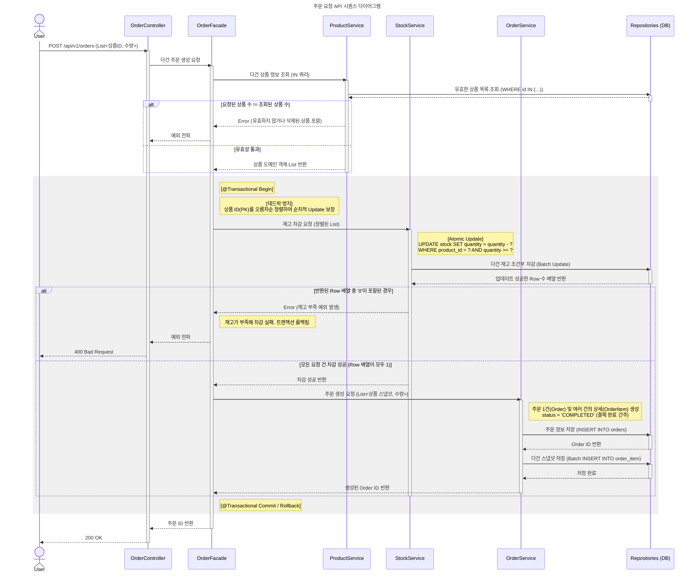
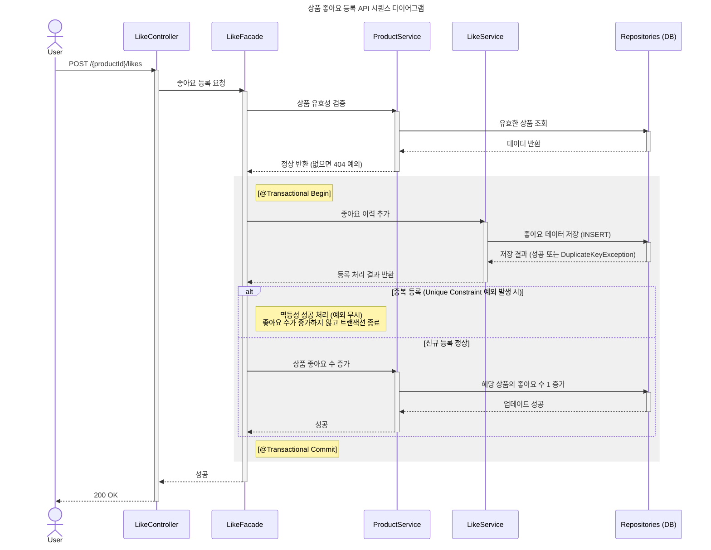
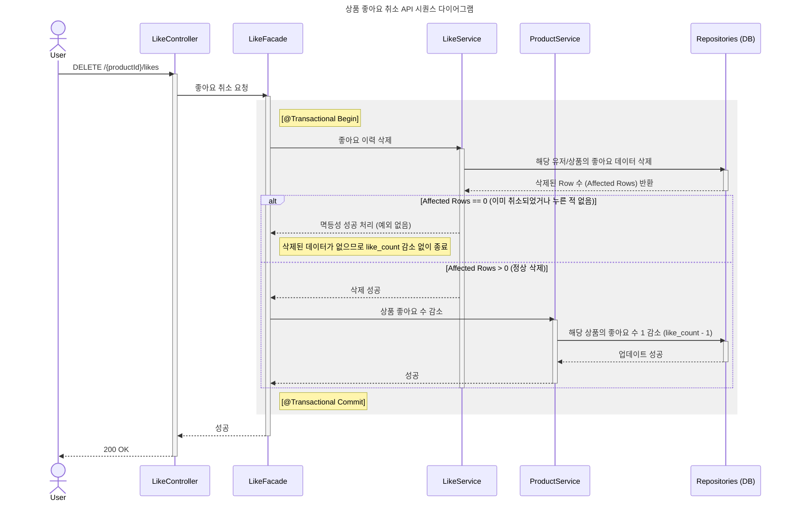
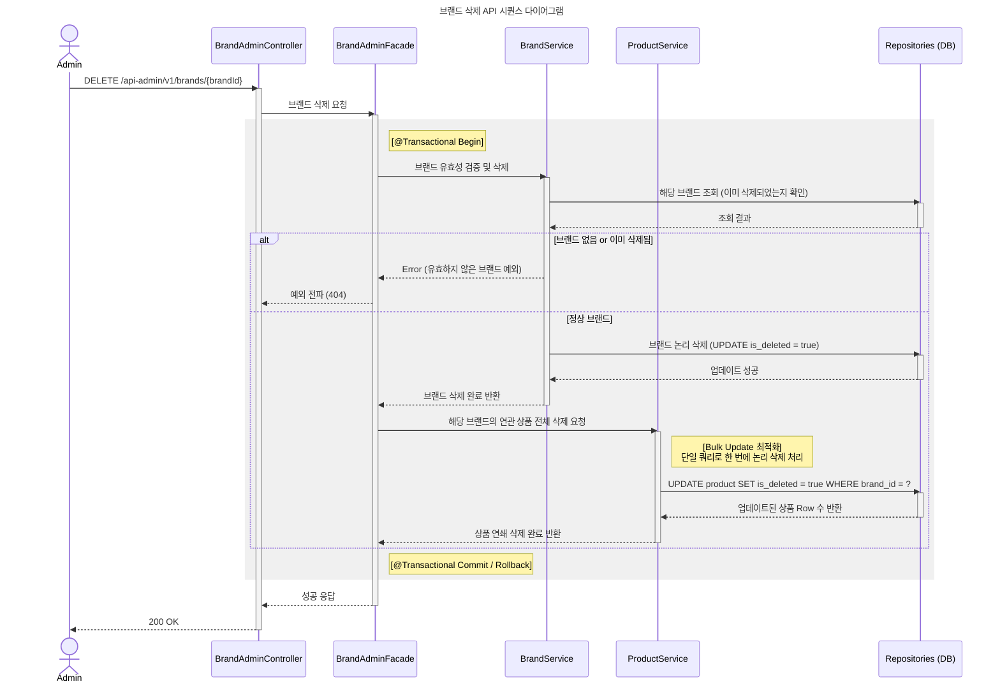

```mermaid
sequenceDiagram
    title 주문 요청 API 시퀀스 다이어그램
    actor User
    participant Controller as OrderController
    participant Facade as OrderFacade
    participant ProductSvc as ProductService
    participant StockSvc as StockService
    participant OrderSvc as OrderService
    participant Repo as Repositories (DB)

    User->>Controller: POST /api/v1/orders (List<상품ID, 수량>)
    activate Controller

    Controller->>Facade: 다건 주문 생성 요청
    activate Facade

    Facade->>ProductSvc: 다건 상품 정보 조회 (IN 쿼리)
    activate ProductSvc
    ProductSvc->>Repo: 유효한 상품 목록 조회 (WHERE id IN (...))
    activate Repo
    Repo-->>ProductSvc: 
    deactivate Repo

    alt 요청된 상품 수 != 조회된 상품 수
        ProductSvc-->>Facade: Error (유효하지 않거나 삭제된 상품 포함)
        Facade-->>Controller: 예외 전파
    else 유효성 통과
        ProductSvc-->>Facade: 상품 도메인 객체 List 반환
    end
    deactivate ProductSvc

    rect rgb(240, 240, 240)
        Note right of Facade: [@Transactional Begin]
        Note right of Facade: [데드락 방지]<br/>상품 ID(PK)를 오름차순 정렬하여 순차적 Update 보장
        
        Facade->>StockSvc: 재고 차감 요청 (정렬된 List)
        activate StockSvc
        Note right of StockSvc: [Atomic Update]<br/>UPDATE stock SET quantity = quantity - ? <br/>WHERE product_id = ? AND quantity >= ?
        
        StockSvc->>Repo: 다건 재고 조건부 차감 (Batch Update)
        activate Repo
        Repo-->>StockSvc: 업데이트 성공한 Row 수 배열 반환
        deactivate Repo

        alt 반환된 Row 배열 중 '0'이 포함된 경우
            StockSvc-->>Facade: Error (재고 부족 예외 발생)
            Note right of Facade: 재고가 부족해 차감 실패. 트랜잭션 롤백됨.
            Facade-->>Controller: 예외 전파
            Controller-->>User: 400 Bad Request
        else 모든 요청 건 차감 성공 (Row 배열이 모두 1)
            StockSvc-->>Facade: 차감 성공 반환
            
            Facade->>OrderSvc: 주문 생성 요청 (List<상품 스냅샷, 수량>)
            activate OrderSvc
            Note right of OrderSvc: 주문 1건(Order) 및 여러 건의 상세(OrderItem) 생성<br/>status = 'COMPLETED' (결제 완료 간주)
            
            OrderSvc->>Repo: 주문 정보 저장 (INSERT INTO orders)
            activate Repo
            Repo-->>OrderSvc: Order ID 반환
            deactivate Repo
            
            OrderSvc->>Repo: 다건 스냅샷 저장 (Batch INSERT INTO order_item)
            activate Repo
            Repo-->>OrderSvc: 저장 완료
            deactivate Repo
            OrderSvc-->>Facade: 생성된 Order ID 반환
            deactivate OrderSvc
        end
        deactivate StockSvc
        Note right of Facade: [@Transactional Commit / Rollback]
    end

    Facade-->>Controller: 주문 ID 반환
    deactivate Facade

    Controller-->>User: 200 OK
    deactivate Controller
```

```mermaid
sequenceDiagram
    title 상품 좋아요 등록 API 시퀀스 다이어그램
    actor User
    participant Controller as LikeController
    participant Facade as LikeFacade
    participant ProductSvc as ProductService
    participant LikeSvc as LikeService
    participant Repo as Repositories (DB)

    User->>Controller: POST /{productId}/likes
    activate Controller

    Controller->>Facade: 좋아요 등록 요청
    activate Facade

    Facade->>ProductSvc: 상품 유효성 검증
    activate ProductSvc
    ProductSvc->>Repo: 유효한 상품 조회
    activate Repo
    Repo-->>ProductSvc: 데이터 반환
    deactivate Repo
    ProductSvc-->>Facade: 정상 반환 (없으면 404 예외)
    deactivate ProductSvc

    rect rgb(240, 240, 240)
        Note right of Facade: [@Transactional Begin]

        Facade->>LikeSvc: 좋아요 이력 추가
        activate LikeSvc
        LikeSvc->>Repo: 좋아요 데이터 저장 (INSERT)
        activate Repo
        Repo-->>LikeSvc: 저장 결과 (성공 또는 DuplicateKeyException)
        deactivate Repo
        LikeSvc-->>Facade: 등록 처리 결과 반환
        deactivate LikeSvc

        alt 중복 등록 (Unique Constraint 예외 발생 시)
            Note right of Facade: 멱등성 성공 처리 (예외 무시)<br/>좋아요 수가 증가하지 않고 트랜잭션 종료
        else 신규 등록 정상
            Facade->>ProductSvc: 상품 좋아요 수 증가
            activate ProductSvc
            ProductSvc->>Repo: 해당 상품의 좋아요 수 1 증가
            activate Repo
            Repo-->>ProductSvc: 업데이트 성공
            deactivate Repo
            ProductSvc-->>Facade: 성공
            deactivate ProductSvc
        end
        Note right of Facade: [@Transactional Commit]
    end

    Facade-->>Controller: 성공
    deactivate Facade

    Controller-->>User: 200 OK
    deactivate Controller
```

```mermaid
sequenceDiagram
    title 상품 좋아요 취소 API 시퀀스 다이어그램
    actor User
    participant Controller as LikeController
    participant Facade as LikeFacade
    participant LikeSvc as LikeService
    participant ProductSvc as ProductService
    participant Repo as Repositories (DB)

    User->>Controller: DELETE /{productId}/likes
    activate Controller

    Controller->>Facade: 좋아요 취소 요청
    activate Facade

    rect rgb(240, 240, 240)
        Note right of Facade: [@Transactional Begin]

        Facade->>LikeSvc: 좋아요 이력 삭제
        activate LikeSvc
        LikeSvc->>Repo: 해당 유저/상품의 좋아요 데이터 삭제
        activate Repo
        Repo-->>LikeSvc: 삭제된 Row 수 (Affected Rows) 반환
        deactivate Repo

        alt Affected Rows == 0 (이미 취소되었거나 누른 적 없음)
            LikeSvc-->>Facade: 멱등성 성공 처리 (예외 없음)
            Note right of Facade: 삭제된 데이터가 없으므로 like_count 감소 없이 종료
        else Affected Rows > 0 (정상 삭제)
            LikeSvc-->>Facade: 삭제 성공
            
            Facade->>ProductSvc: 상품 좋아요 수 감소
            activate ProductSvc
            ProductSvc->>Repo: 해당 상품의 좋아요 수 1 감소 (like_count - 1)
            activate Repo
            Repo-->>ProductSvc: 업데이트 성공
            deactivate Repo
            ProductSvc-->>Facade: 성공
            deactivate ProductSvc
        end
        deactivate LikeSvc
        
        Note right of Facade: [@Transactional Commit]
    end

    Facade-->>Controller: 성공
    deactivate Facade

    Controller-->>User: 200 OK
    deactivate Controller
```

```mermaid
sequenceDiagram
    title 브랜드 삭제 API 시퀀스 다이어그램

    actor Admin
    participant Controller as BrandAdminController
    participant Facade as BrandAdminFacade
    participant BrandSvc as BrandService
    participant ProductSvc as ProductService
    participant Repo as Repositories (DB)

    Admin->>Controller: DELETE /api-admin/v1/brands/{brandId}
    activate Controller

    Controller->>Facade: 브랜드 삭제 요청
    activate Facade

    rect rgb(240, 240, 240)
        Note right of Facade: [@Transactional Begin]

        Facade->>BrandSvc: 브랜드 유효성 검증 및 삭제
        activate BrandSvc
        BrandSvc->>Repo: 해당 브랜드 조회 (이미 삭제되었는지 확인)
        activate Repo
        Repo-->>BrandSvc: 조회 결과
        deactivate Repo

        alt 브랜드 없음 or 이미 삭제됨
            BrandSvc-->>Facade: Error (유효하지 않은 브랜드 예외)
            Facade-->>Controller: 예외 전파 (404)
        else 정상 브랜드
            BrandSvc->>Repo: 브랜드 논리 삭제 (UPDATE is_deleted = true)
            activate Repo
            Repo-->>BrandSvc: 업데이트 성공
            deactivate Repo
            BrandSvc-->>Facade: 브랜드 삭제 완료 반환
            deactivate BrandSvc

            Facade->>ProductSvc: 해당 브랜드의 연관 상품 전체 삭제 요청
            activate ProductSvc
            Note right of ProductSvc: [Bulk Update 최적화]<br/>단일 쿼리로 한 번에 논리 삭제 처리
            ProductSvc->>Repo: UPDATE product SET is_deleted = true WHERE brand_id = ?
            activate Repo
            Repo-->>ProductSvc: 업데이트된 상품 Row 수 반환
            deactivate Repo
            ProductSvc-->>Facade: 상품 연쇄 삭제 완료 반환
            deactivate ProductSvc
        end
        Note right of Facade: [@Transactional Commit / Rollback]
    end

    Facade-->>Controller: 성공 응답
    deactivate Facade

    Controller-->>Admin: 200 OK
    deactivate Controller
```