# 02. 시퀀스 다이어그램

각 유스케이스(`01-requirements.md` §6 참조)의 흐름을 레이어별 참여자 기준으로 시각화한다. 다이어그램은 Mermaid `sequenceDiagram` 문법으로 작성하며, 흐름 분기·조건은 `alt`/`opt` 블록으로 표현한다.

## 0. 표기 규칙

### 0.1 참여자 레이어

실제 Loopers 멀티모듈 패키지 구조에 맞춘 레이어를 사용한다.

| 레이어 | 패키지 | 책임 | 다이어그램 예시 |
| --- | --- | --- | --- |
| Client | — | 사용자/외부 호출자 (User, Guest, Admin) | `actor C as Client` |
| Interface | `interfaces.api.{domain}` | REST 엔드포인트, DTO 변환 | `XxxV1Controller` |
| Application | `application.{domain}` | 유스케이스 조립(Facade). 트랜잭션 경계 | `XxxFacade` |
| Domain Service | `domain.{domain}` | 도메인 로직, 여러 Aggregate 조정 | `XxxService` |
| Domain Aggregate | `domain.{domain}` | 상태와 불변식. 도메인 메서드를 외부에 노출 | `XxxModel` |
| Domain Repository | `domain.{domain}` | 영속화 인터페이스 | `XxxRepository` |
| External | — | 외부 시스템 어댑터 | `PaymentGateway` |

도메인 객체 간 메시지(예: `OrderModel.markPaid()`, `ProductModel.deductStock()`)는 명시적으로 표기한다. Service에서 Repository로 직행하지 않고 항상 Aggregate의 도메인 메서드를 거치는 흐름으로 그린다.

### 0.2 화살표·블록

- `->>` 동기 호출 (메서드 호출)
- `-->>` 응답·반환값
- `alt` / `else` — 분기 (예: 인증 여부)
- `opt` — 선택적 단계 (조건 만족 시만 실행)
- `Note over X: ...` — 트랜잭션 경계, 동시성 처리 등 메타 정보
- 비동기 이벤트(행동 로그)는 `--)` 또는 `Note`로 표현

### 0.3 생략 규칙

- 인증 헤더 검증(`AuthInterceptor` 류) 같은 횡단 관심사는 다이어그램에서 별도 표기하지 않고 Controller 진입을 인증 성공 전제로 시작한다. 인증 실패는 §0.4 공통 에러로 위임.
- 행동 로깅(01 §7.7 활동 기록)은 메인 흐름 마지막에 비동기 `--)` 한 줄로 표현하고 상세는 생략.
- 응답 변환(`Model → Info → Dto`) 단계는 다이어그램에서 한 줄로 압축한다.

### 0.4 공통 에러 (모든 UC 공통)

- `401 UNAUTHORIZED` — 인증 헤더 누락/불일치. Controller 진입 이전 단계에서 종결
- `400 BAD_REQUEST` — 입력 형식·필수값 위반
- 자세한 에러 분기는 `01-requirements.md` 각 UC `Exception Flow` 참조

---

## UC-01. 비밀번호 변경

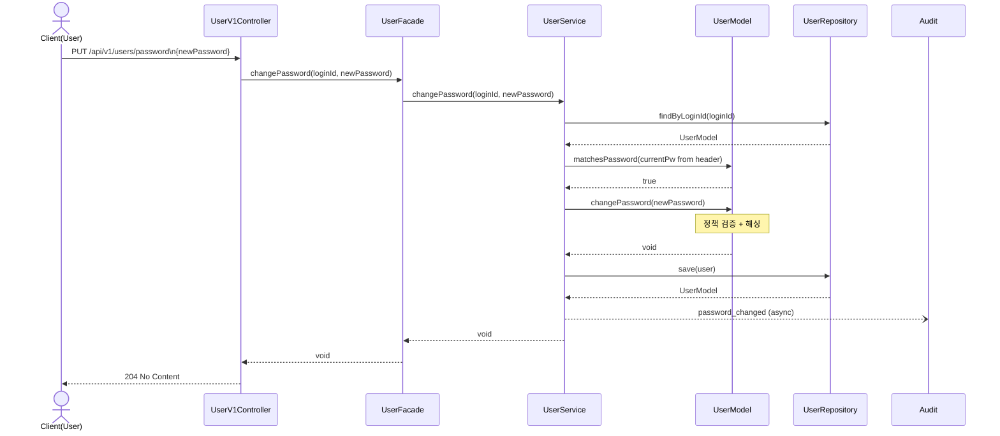

**에러 분기 (요약)**
- `newPassword`가 정책 위반 → `U.changePassword` 내부에서 `CoreException` → `400`
- `newPassword == currentPassword` → Service 선검사에서 `400 SAME_AS_CURRENT`
- 인증 헤더 검증은 진입 이전 단계 (§0.3)

---

## UC-02. 브랜드 조회

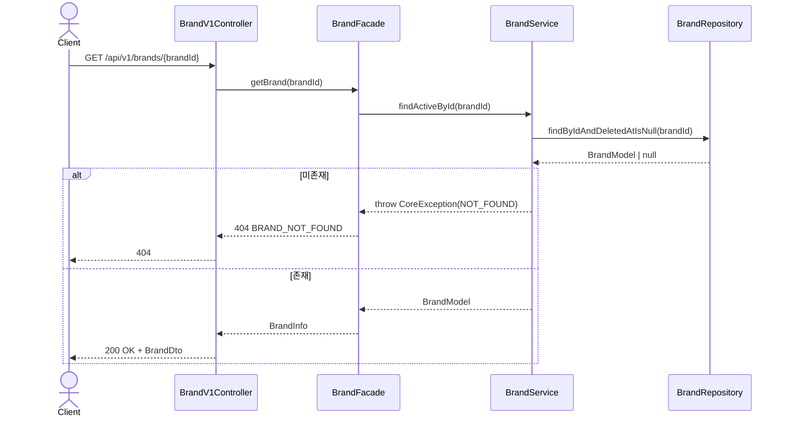

---

## UC-03. 상품 목록 둘러보기

`likedByMe`는 페이지 내 productId 집합에 대해 **단일 IN 쿼리 1회**로 일괄 조회 (N+1 회피 — 04 §3 인덱스 전략).

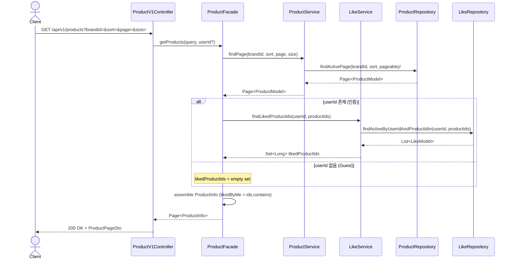

**비고**
- `likes_desc` 정렬은 `products.likesCount` 비정규화 컬럼 기준 (실시간 COUNT 금지 — 01 §7.3 좋아요 수 표시, 04 §2.3)
- 정렬 안정성을 위해 모든 정렬에 `productId DESC` tiebreaker 적용

---

## UC-04. 상품 상세 조회

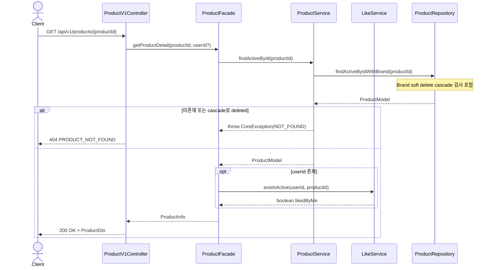

---

## UC-05. 상품 좋아요 등록

기존 행이 있고 `deleted=true`면 INSERT 대신 **reactivate**(UPDATE). MariaDB 부분 인덱스 미지원 회피 — `UNIQUE(userId, productId)` 제약과 양립 (01 §7.5 비활성 처리·전파, 04 §4.4).

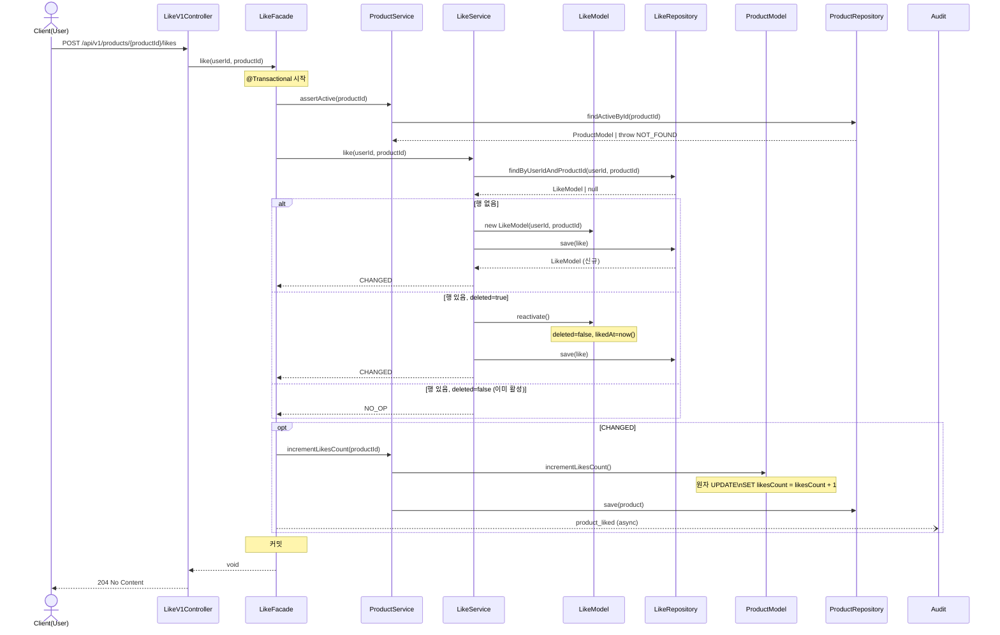

**비고**
- `UNIQUE(userId, productId)` race 발생 시 `LRepo.save`에서 예외 → 1회 재시도. 재시도 후에도 실패 시 `409 CONFLICT`

---

## UC-06. 상품 좋아요 취소

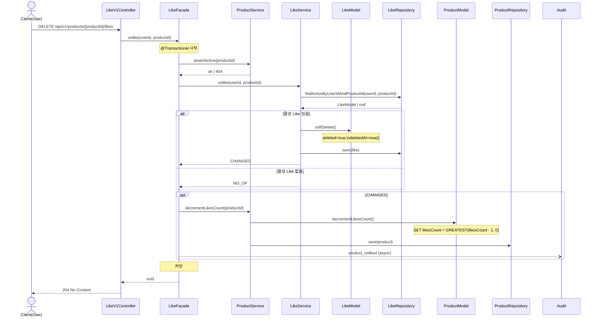

---

## UC-07. 내가 좋아요한 상품 조회

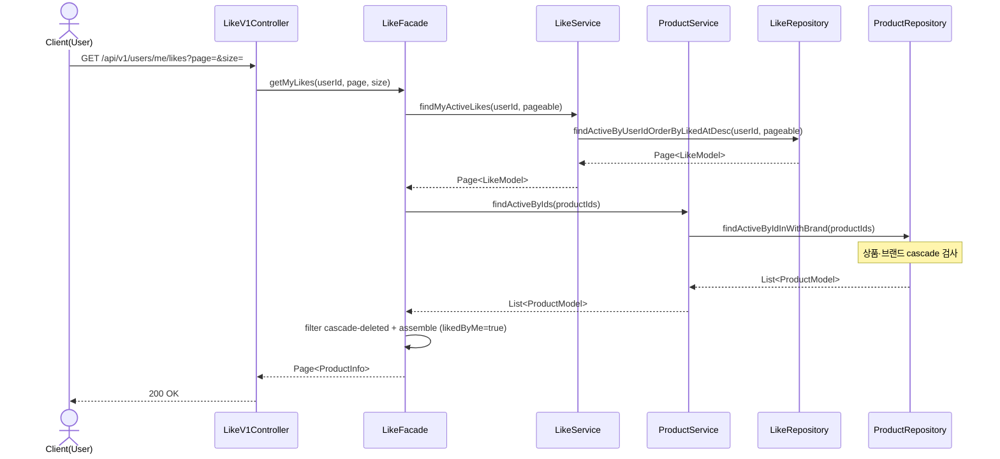

**비고**
- 좋아요한 상품 중 일부가 cascade로 내려간 경우 결과에서 자동 제외 — `totalElements`는 활성 항목 수

---

## UC-08a. 상품 주문·결제 — 정상 흐름 (Main Flow)

PG 호출은 **트랜잭션 커밋 후** 별도 단계에서 수행 (§7.6). 트랜잭션 내에 외부 시스템 호출을 두지 않는다.

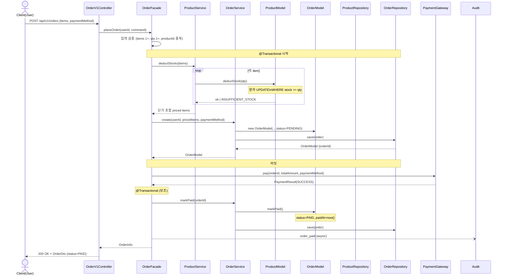

---

## UC-08b. 상품 주문·결제 — PG 실패 (보상 트랜잭션)

PG 호출 결과가 실패면 **보상 트랜잭션**으로 재고 원복 + `Order.status=FAILED`.

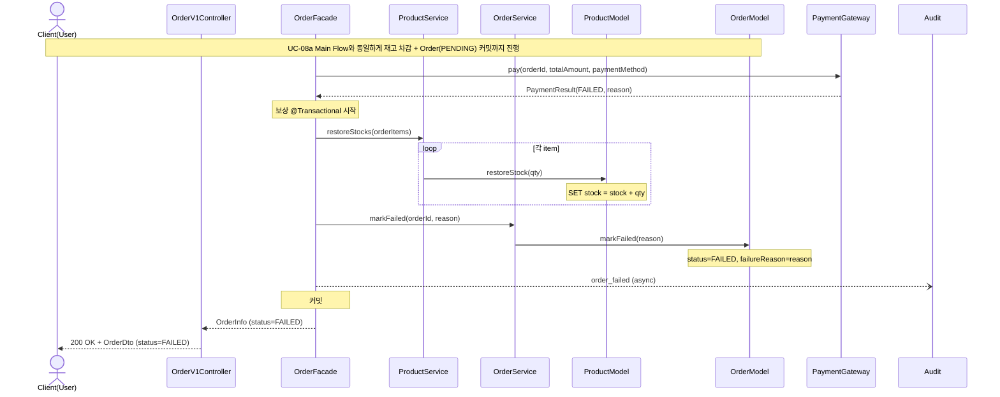

**비고**
- 보상 트랜잭션 자체가 실패하면 `Order.status=PENDING` 잔존 → reconcile job이 후처리 (UC-08c와 동일 경로)

---

## UC-08c. 상품 주문·결제 — PG 타임아웃 (PENDING + Reconcile)

PG 응답이 없거나 타임아웃이면 **재고 차감 상태 유지** + `Order=PENDING`. 비동기 reconcile job이 최종 상태 확정.

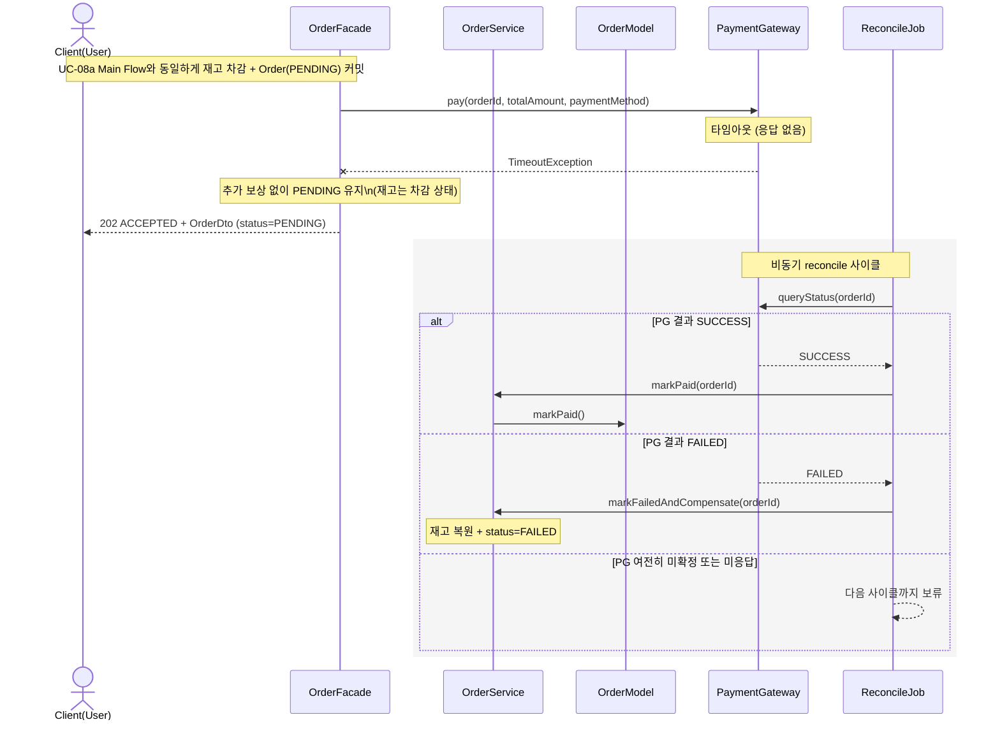

---

## UC-09. 내 주문 조회

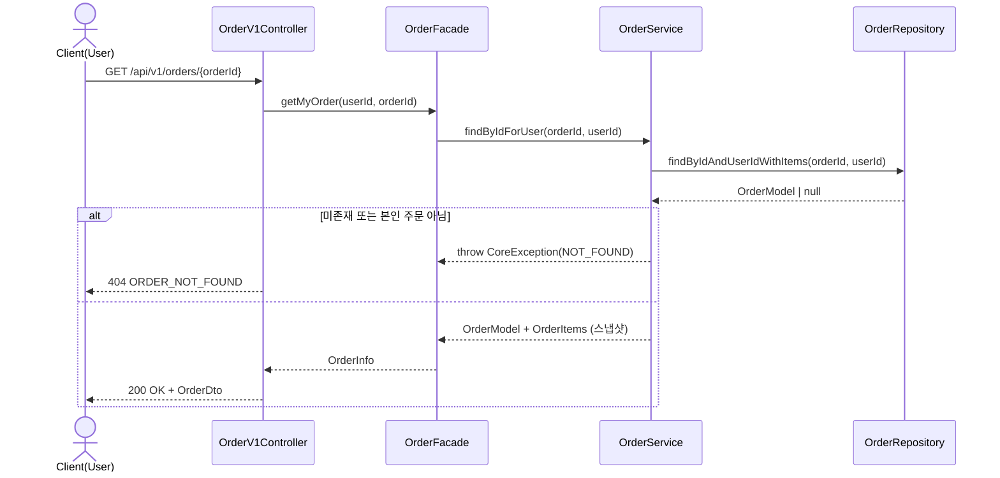

**비고**
- 타인 주문 요청도 동일하게 `404` 반환 — orderId 존재 여부 누설 방지 (01 §7.4 본인 자원 접근 정책)

---

## UC-10. (Admin) 브랜드 삭제 — Cascade

Brand → Product → Like cascade soft delete. Order/OrderItem은 영향 없음 (01 §7.5).

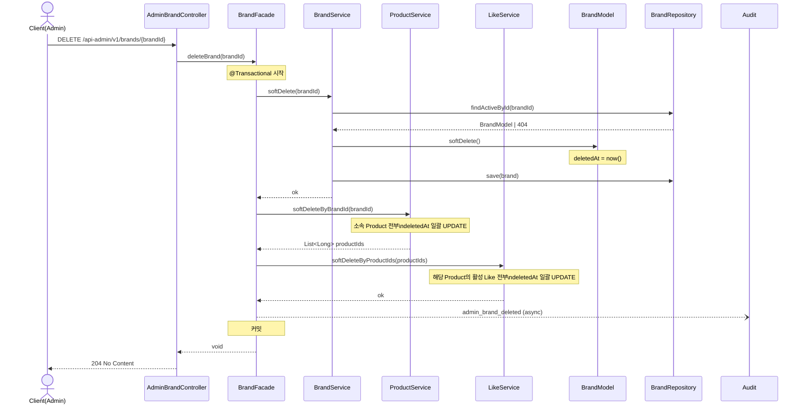

**비고**
- 대량 cascade(상품·좋아요 만 건)는 동기 처리 시 응답 지연 가능 → 비동기 job 분리 검토 (현재는 동기)
- `likesCount`는 cascade 대상 아님 (어차피 비노출 상품의 likesCount는 영향 없음)

---

## UC-11. (Admin) 상품 삭제 — Cascade

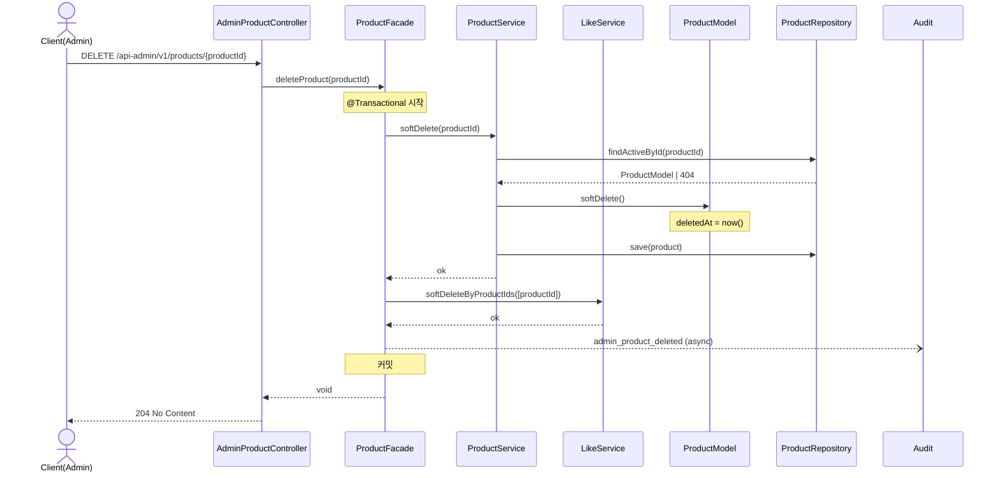

---

## UC-12. (Admin) 주문 모니터링

본인 격리 규칙 미적용. 어드민은 전체 접근.

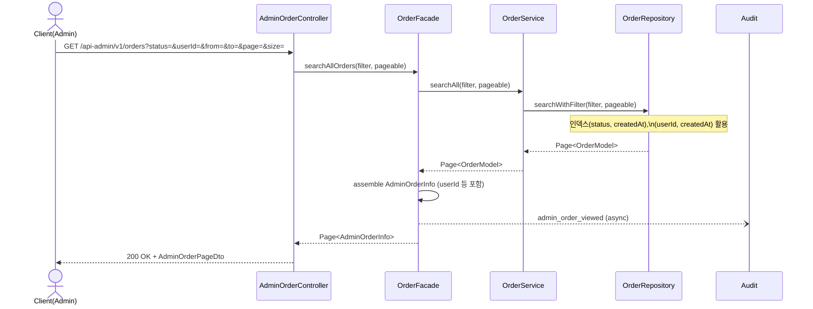

---

## 부록: 다이어그램 ↔ 요구사항 매핑

| 다이어그램 | 요구사항 UC | 핵심 분기·메모 |
| --- | --- | --- |
| UC-01 | §6 UC-01 | 인증 헤더가 현재 비번 확인 매개체 |
| UC-02 | §6 UC-02 | soft delete cascade 검사 |
| UC-03 | §6 UC-03 | likedByMe IN 쿼리 일괄 조회 (N+1 회피) |
| UC-04 | §6 UC-04 | 인증 시에만 like 조회 |
| UC-05 | §6 UC-05 | reactivate 분기, likesCount 원자 UPDATE |
| UC-06 | §6 UC-06 | softDelete 분기, likesCount 음수 방지 |
| UC-07 | §6 UC-07 | 좋아요 시점순, cascade 자동 제외 |
| UC-08a | §6 UC-08 정상 흐름 | PG는 트랜잭션 커밋 후 |
| UC-08b | §6 UC-08 결제 실패 | 보상 트랜잭션 |
| UC-08c | §6 UC-08 응답 지연 | PENDING + reconcile job |
| UC-09 | §6 UC-09 | 본인 외 = 404 |
| UC-10 | §6 UC-10 | Brand→Product→Like cascade |
| UC-11 | §6 UC-11 | Product→Like cascade |
| UC-12 | §6 UC-12 | 본인 격리 미적용, audit 필수 |
