# Sequence Diagrams

이 문서는 주요 유스케이스의 책임 흐름을 DDD 설계 관점에서 확인하기 위해 작성한다. 다이어그램은 실제 구현과 연결하기 쉽도록 주요 컴포넌트 이름을 사용하되, DTO나 JPA 구현체 같은 세부사항은 제외한다.

## Users

### 회원가입

이 다이어그램은 회원가입 과정에서 사용자 식별자 중복 확인과 비밀번호 정책 검증이 선행된 뒤, 새로운 사용자가 생성되는 흐름을 확인하기 위한 것이다.

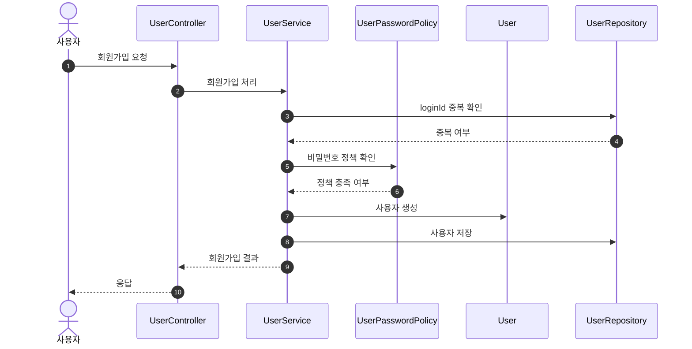

이 흐름에서 핵심은 `User` 생성 전에 식별자 중복과 비밀번호 정책이 먼저 검증된다는 점이다. 비밀번호 인코딩 같은 기술 세부사항은 다이어그램에서 제외하고, 도메인 규칙의 흐름만 표현한다.

### 내 정보 조회

이 다이어그램은 인증된 사용자가 자신의 정보를 조회하는 흐름을 확인하기 위한 것이다. 인증 방식 자체보다, 조회 대상이 인증된 사용자 자신이라는 점이 중요하다.

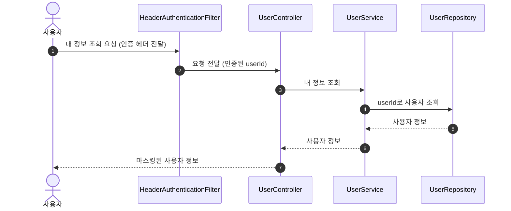

이 흐름에서 `userId`는 인증 결과로 전달된다. 관리자는 별도 인증 시스템의 주체이므로 일반 `User` 조회 흐름에 포함하지 않는다.

### 비밀번호 변경

이 다이어그램은 비밀번호 변경 과정에서 현재 비밀번호 확인과 새 비밀번호 정책 검증이 완료된 뒤 사용자 비밀번호가 변경되는 흐름을 확인하기 위한 것이다.

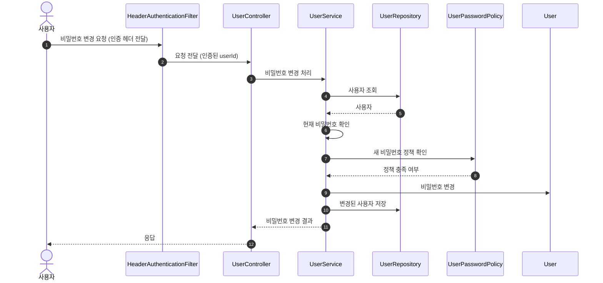

이 흐름에서 핵심은 비밀번호 변경이 인증된 사용자 본인에게만 적용되고, 변경 전에 현재 비밀번호 확인과 새 비밀번호 정책 검증이 필요하다는 점이다.

## Brands

### 브랜드 조회

이 다이어그램은 사용자가 브랜드 정보를 조회하는 흐름을 확인하기 위한 것이다. 브랜드 조회는 인증 없이 가능하며, 상품이 어떤 브랜드에 속하는지 확인하는 기준 정보로 사용된다.

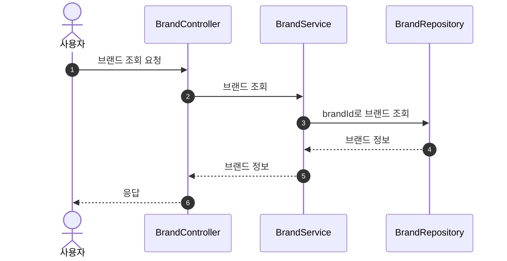

이 흐름에서 브랜드 조회는 상품이나 주문의 상태를 변경하지 않는다. `Brand`는 상품이 소속되는 기준 정보로 사용된다.

### 관리자 브랜드 조회

이 다이어그램은 관리자가 등록된 브랜드 목록이나 상세 정보를 조회하는 흐름을 확인하기 위한 것이다. 관리자 조회는 일반 브랜드 조회와 같은 브랜드 정보를 다루지만, 관리자 권한이 필요한 별도 진입점으로 본다.

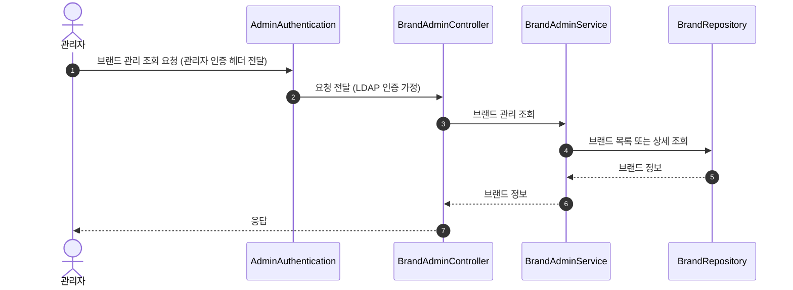

이 흐름에서 관리자는 브랜드를 변경하지 않고 조회만 수행한다. 고객 조회와 관리자 조회의 응답 정보는 현재 범위에서 동일하게 본다.

### 브랜드 삭제

이 다이어그램은 브랜드 삭제 시 해당 브랜드에 속한 상품도 함께 삭제되어야 한다는 정책을 확인하기 위한 것이다. `Brand`와 `Product`는 별도 Aggregate로 보며, 삭제 유스케이스에서 application service가 두 Aggregate의 생명주기를 조율한다.

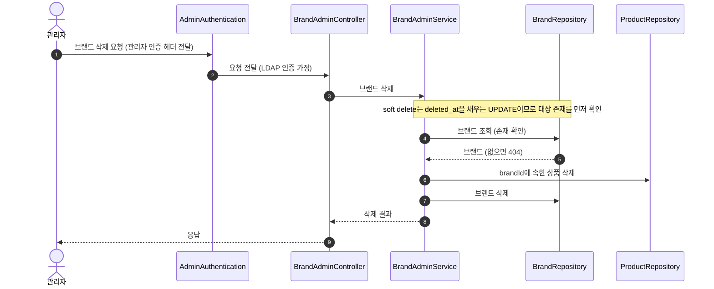

이 흐름에서 하위 상품 삭제는 `Brand`가 `Product`를 소유한다는 의미가 아니다. 브랜드 삭제라는 유스케이스 안에서 관련 Product Aggregate들을 먼저 정리한 뒤, 브랜드를 삭제하는 정책으로 본다.

## Products

### 상품 조회

이 다이어그램은 사용자가 상품 정보를 조회하는 흐름을 확인하기 위한 것이다. 상품은 브랜드 식별자를 통해 브랜드와 연결되지만, `Product`와 `Brand`는 별도 Aggregate로 본다.

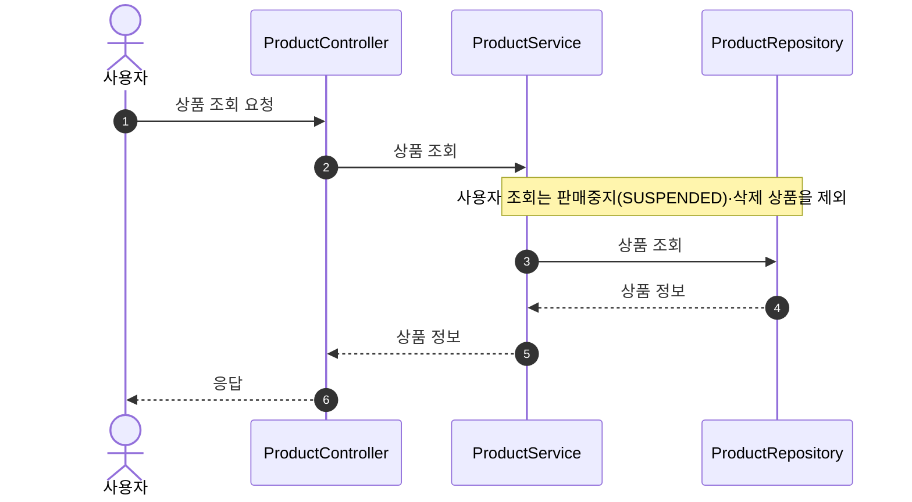

이 흐름에서 상품 조회는 상품 상태를 변경하지 않는다. 브랜드 정보가 함께 필요하더라도 상품은 브랜드 Aggregate를 직접 소유하지 않는다.

### 관리자 상품 조회

이 다이어그램은 관리자가 상품 목록이나 상세 정보를 조회할 때 재고 정보까지 함께 확인하는 흐름을 확인하기 위한 것이다.

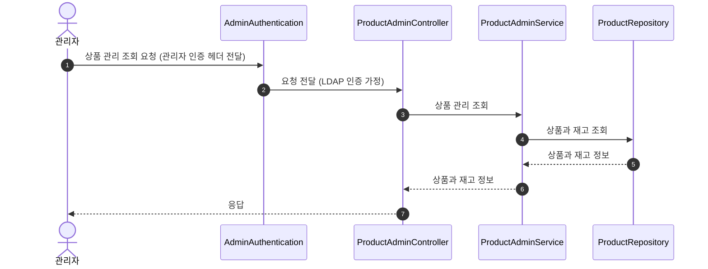

이 흐름에서 관리자 상품 조회는 고객 상품 조회와 달리 재고 정보를 포함한다. 재고는 `ProductStock`으로 관리되지만, 조회 유스케이스에서는 상품 정보와 함께 제공된다.

### 상품 등록

이 다이어그램은 관리자가 상품을 등록할 때 연결할 브랜드가 먼저 확인되어야 한다는 흐름을 확인하기 위한 것이다.

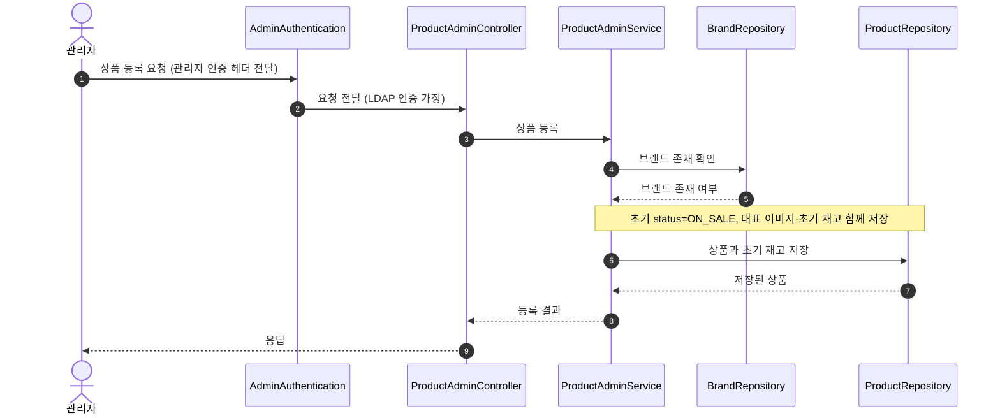

이 흐름에서 브랜드 확인은 상품이 유효한 브랜드에 소속되어야 한다는 규칙을 위한 것이다. 상품 등록 이후에는 상품이 `brandId`를 통해 브랜드를 참조하고, 초기 재고는 `ProductStock`으로 관리한다.

### 상품 삭제

이 다이어그램은 관리자가 상품을 삭제하는 흐름을 확인하기 위한 것이다. 삭제 방식은 공통 삭제 정책을 따른다.

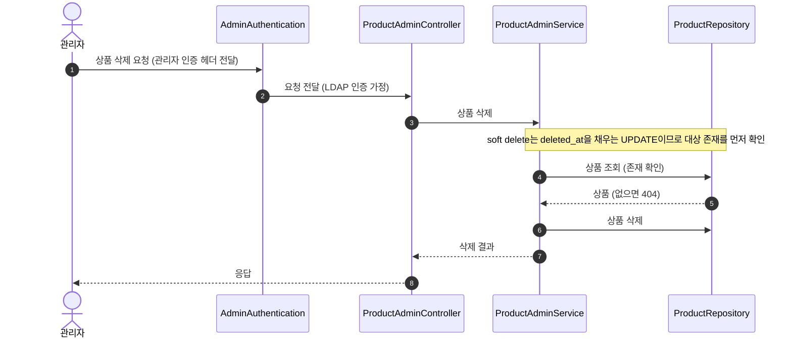

이 흐름에서 상품 삭제는 기존 주문 이력을 제거한다는 의미가 아니다. 주문은 주문 시점의 상품 정보를 별도 스냅샷으로 보관해야 한다.

## Likes

### 좋아요 등록

이 다이어그램은 사용자가 상품에 좋아요를 등록하는 흐름을 확인하기 위한 것이다. 좋아요는 사용자와 상품 사이의 별도 관계로 관리한다.

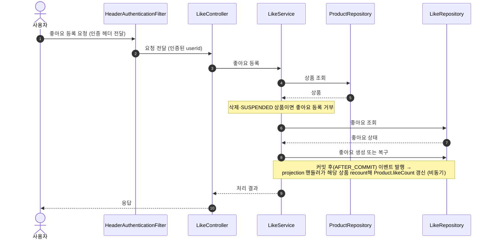

이 흐름에서 이미 좋아요한 상품에 다시 좋아요를 요청해도 같은 상태를 유지한다. 취소된 좋아요가 있으면 기존 좋아요를 복구한다. 응답은 신규 등록·이미 활성 상태 모두 `200 OK`로 통일하고, 현재 좋아요 상태를 본문에 담는다.

### 좋아요 취소

이 다이어그램은 사용자가 상품 좋아요를 취소하는 흐름을 확인하기 위한 것이다. 좋아요 취소는 사용자와 상품 사이의 선호 관계를 비활성화하는 동작으로 본다.

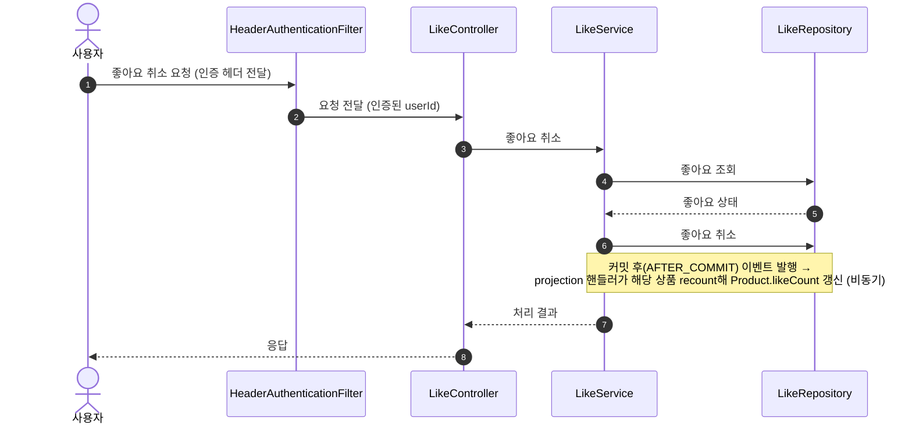

이 흐름에서 이미 취소된 좋아요를 다시 취소해도 같은 상태를 유지한다. 응답은 활성 좋아요 취소·이미 취소된 상태 모두 `200 OK`로 통일하고, 현재 좋아요 상태를 본문에 담는다.

### 좋아요 목록 조회

이 다이어그램은 사용자가 자신이 좋아요한 상품 목록을 조회하는 흐름을 확인하기 위한 것이다. 삭제된 상품은 목록에서 제외하고, 판매중지(`SUSPENDED`) 상품은 '판매중지' 표시로 노출한다.

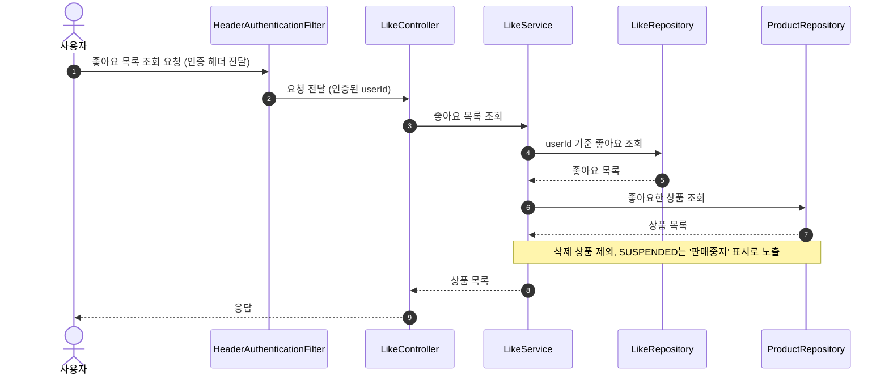

이 흐름에서 `Like`는 상품을 직접 소유하지 않는다. 좋아요 목록 조회는 Like 관계를 기준으로 상품을 다시 조회하며, 삭제된 상품은 제외하고 판매중지(`SUSPENDED`) 상품은 '판매중지' 상태로 표시한다.

## Orders

### 주문 생성

이 다이어그램은 주문 생성 시 상품 조회, 재고 확인/차감, 주문 스냅샷 저장이 하나의 유스케이스 안에서 처리되는 흐름을 확인하기 위한 것이다.

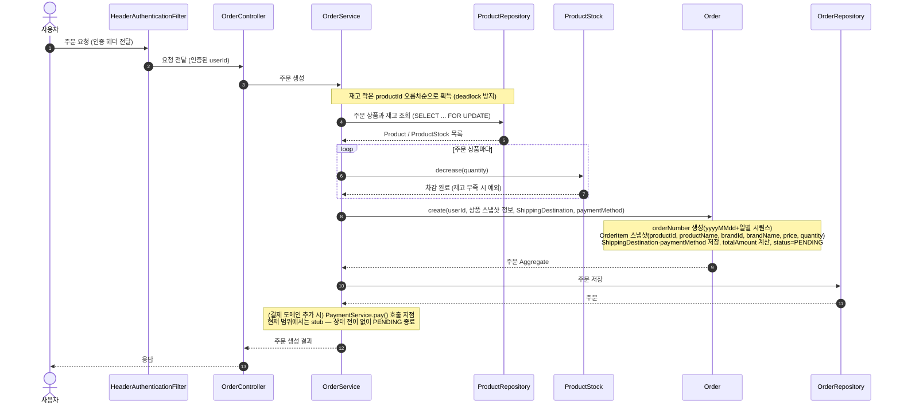

이 흐름에서 주문 생성이 성공했다는 것은 재고가 확보되었다는 의미다. 여러 상품 중 하나라도 주문할 수 없으면 전체 주문을 생성하지 않는다.

재고 락은 deadlock을 피하기 위해 `productId` 오름차순으로 잡고, `SELECT ... FOR UPDATE`로 차감 직전까지 보유한다. 재고 차감과 주문 스냅샷 저장은 하나의 트랜잭션 안에서 함께 처리한다.

### 주문 생성과 결제 흐름 (결제 도메인 추가 시)

이 다이어그램은 결제 도메인이 추가되었을 때 주문 생성에서 결제 완료/실패까지의 전체 흐름을 확인하기 위한 것이다. Requirements 도메인 규칙에 따라 현재 범위에서는 주문이 `PENDING` 상태로 종료되므로, 이 흐름은 결제 도메인 도입 시점의 목표 설계로 본다.

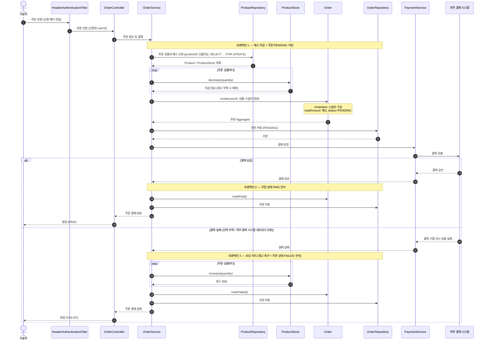

이 흐름에서 봐야 할 포인트는 세 가지다.

첫째, 외부 결제 시스템 호출은 DB 트랜잭션 바깥에서 이루어진다. 결제 호출이 길어지거나 네트워크 오류로 지연되더라도 재고 락이 길게 유지되지 않도록 트랜잭션을 분리한다.

둘째, 재고 차감과 주문 `PENDING` 저장은 한 트랜잭션으로 묶이고, 결제 결과에 따른 상태 전이는 별도 트랜잭션으로 처리한다. 결제 응답을 받기 전까지 주문은 `PENDING` 상태로 영속화되어 있어야 중간 장애 상황에서도 추적할 수 있다.

셋째, 결제 실패 시 재고 복구는 DB 자동 롤백이 아니라 명시적 보상 트랜잭션이다. 트랜잭션 1이 이미 커밋된 뒤이므로 재고를 다시 늘리고 주문 상태를 `FAILED`로 전이하는 후속 작업이 필요하다. 잔액 부족과 외부 시스템 네트워크 오류는 모두 결제 실패로 일괄 처리하며, 사유 구분이 필요해지면 별도 실패 사유 정보를 도입한다.

### 주문 목록 조회

이 다이어그램은 사용자가 본인의 주문 목록을 조회하는 흐름을 확인하기 위한 것이다. 기간 조건은 선택값이며, 없으면 최신 주문부터 조회한다.

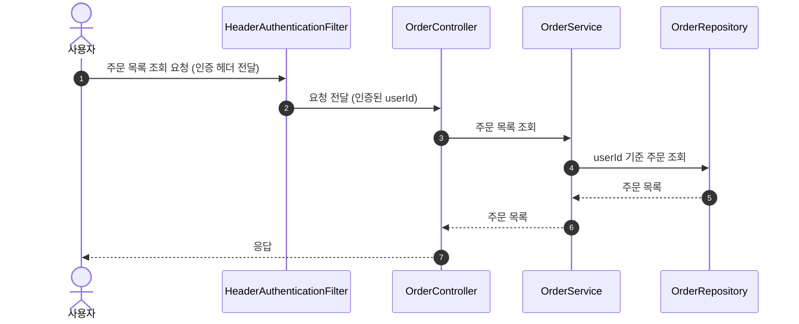

이 흐름에서 일반 사용자는 자신의 주문만 조회한다. 관리자는 별도 관리자 조회 흐름에서 전체 주문을 조회할 수 있다.

### 관리자 주문 목록 조회

이 다이어그램은 관리자가 전체 주문을 조회하는 흐름을 확인하기 위한 것이다. 일반 사용자 조회와 달리 특정 userId로 범위를 제한하지 않는다.

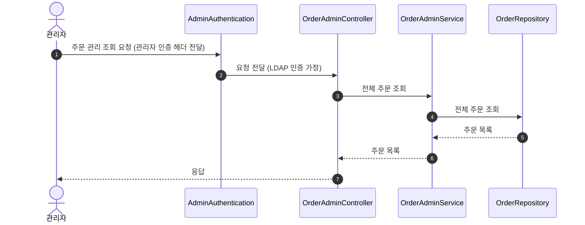

이 흐름에서 관리자는 전체 주문을 조회한다. 주문 자체의 소유자는 여전히 일반 사용자이며, 관리자 조회는 주문 Aggregate의 소유 관계를 바꾸지 않는다.
