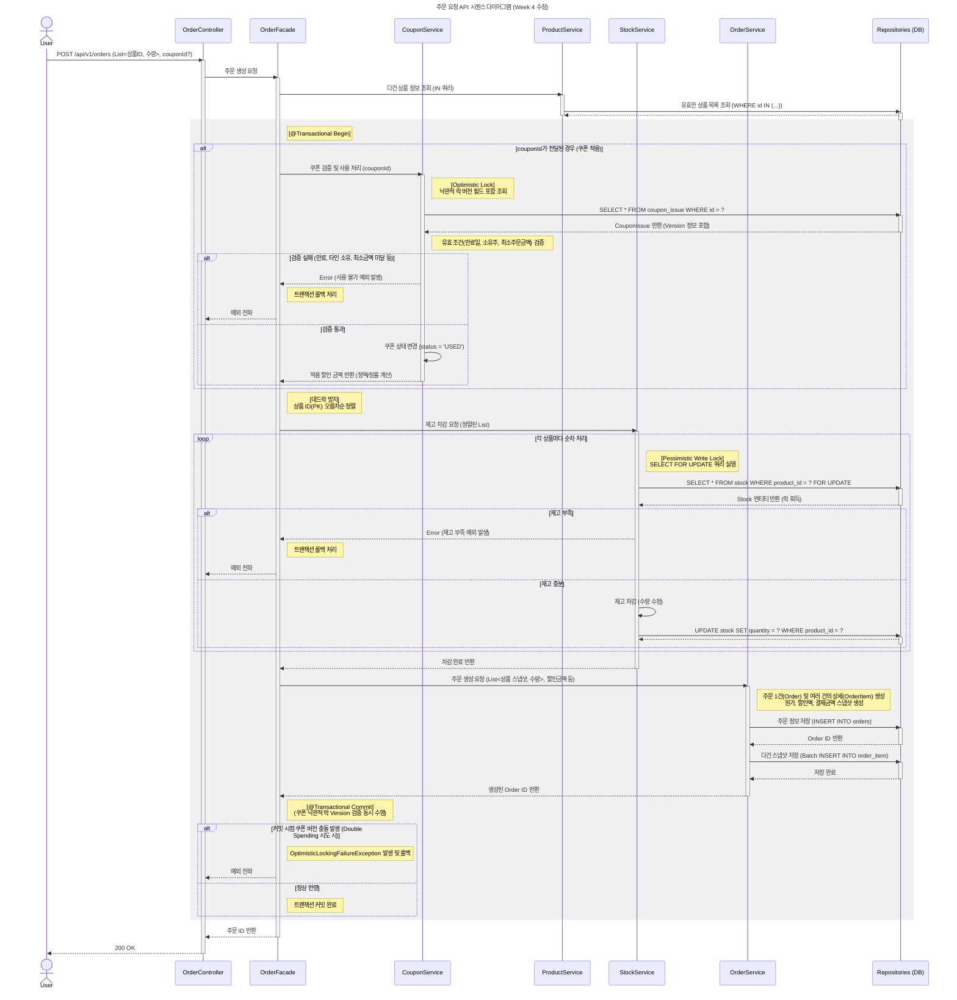
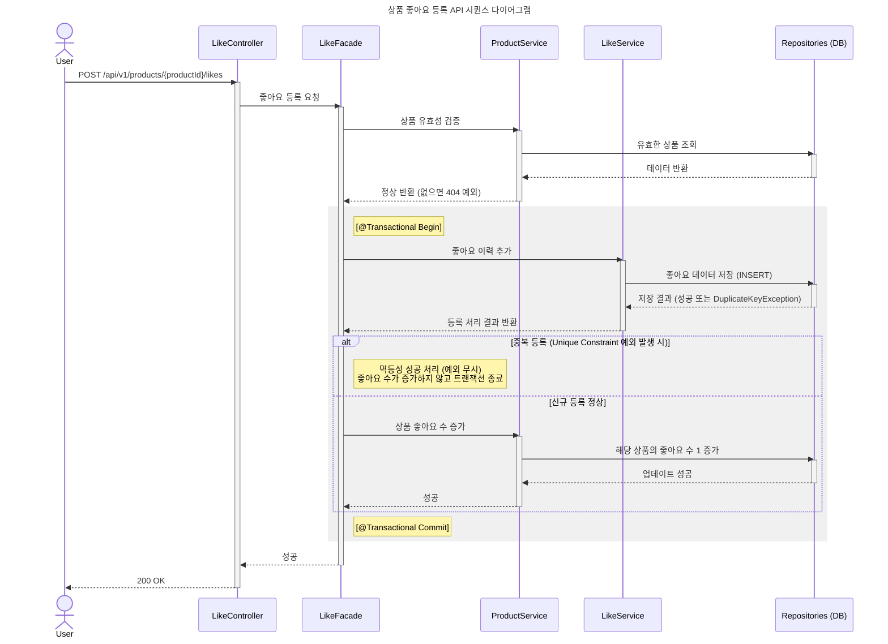
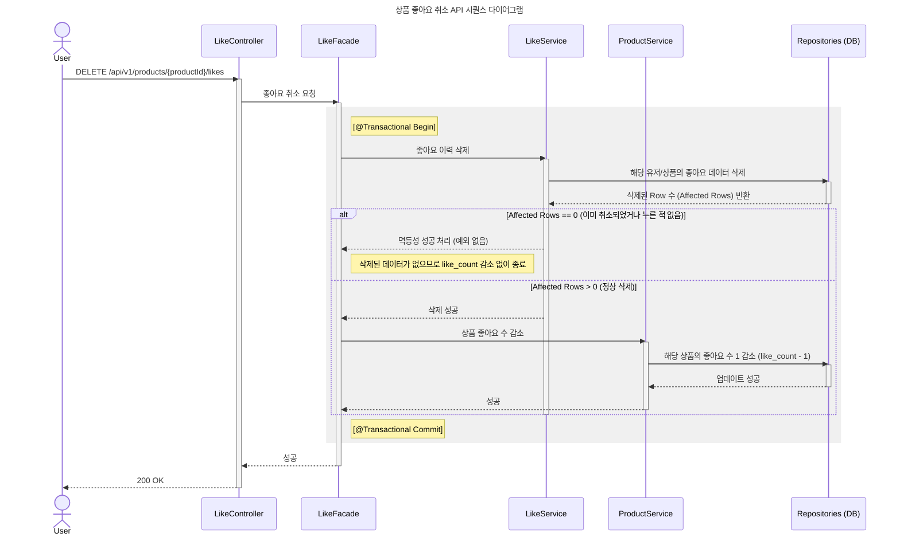
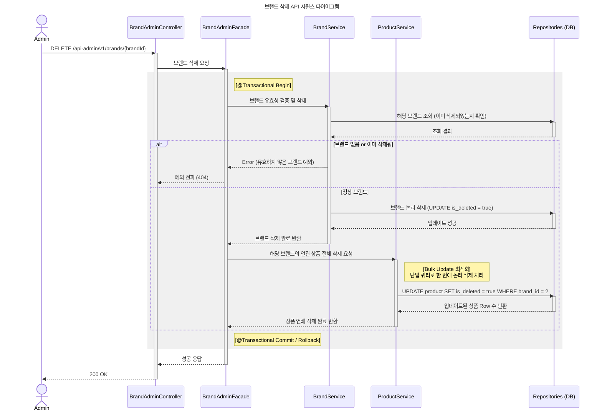
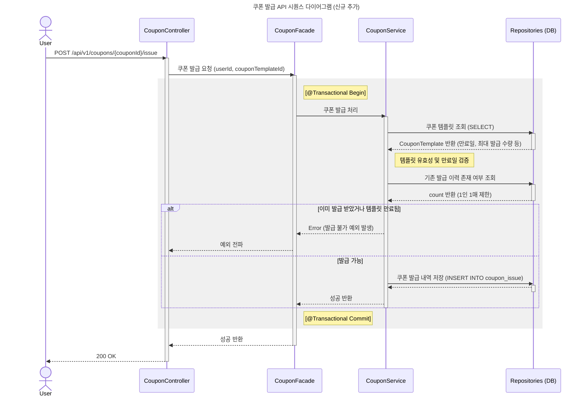

```mermaid
sequenceDiagram
    title 주문 요청 API 시퀀스 다이어그램 (Week 4 수정)
    actor User
    participant Controller as OrderController
    participant Facade as OrderFacade
    participant CouponSvc as CouponService
    participant ProductSvc as ProductService
    participant StockSvc as StockService
    participant OrderSvc as OrderService
    participant Repo as Repositories (DB)

    User->>Controller: POST /api/v1/orders (List<상품ID, 수량>, couponId?)
    activate Controller

    Controller->>Facade: 주문 생성 요청
    activate Facade

    Facade->>ProductSvc: 다건 상품 정보 조회 (IN 쿼리)
    activate ProductSvc
    ProductSvc->>Repo: 유효한 상품 목록 조회 (WHERE id IN (...))
    activate Repo
    Repo-->>ProductSvc: 
    deactivate Repo
    deactivate ProductSvc

    rect rgb(240, 240, 240)
        Note right of Facade: [@Transactional Begin]
        
        alt couponId가 전달된 경우 (쿠폰 적용)
            Facade->>CouponSvc: 쿠폰 검증 및 사용 처리 (couponId)
            activate CouponSvc
            Note right of CouponSvc: [Optimistic Lock]<br/>낙관적 락 버전 필드 포함 조회
            CouponSvc->>Repo: SELECT * FROM coupon_issue WHERE id = ?
            activate Repo
            Repo-->>CouponSvc: CouponIssue 반환 (Version 정보 포함)
            deactivate Repo
            
            Note right of CouponSvc: 유효 조건(만료일, 소유주, 최소주문금액) 검증
            alt 검증 실패 (만료, 타인 소유, 최소금액 미달 등)
                CouponSvc-->>Facade: Error (사용 불가 예외 발생)
                Note right of Facade: 트랜잭션 롤백 처리
                Facade-->>Controller: 예외 전파
            else 검증 통과
                CouponSvc->>CouponSvc: 쿠폰 상태 변경 (status = 'USED')
                CouponSvc-->>Facade: 적용 할인 금액 반환 (정액/정률 계산)
                deactivate CouponSvc
            end
        end

        Note right of Facade: [데드락 방지]<br/>상품 ID(PK) 오름차순 정렬
        Facade->>StockSvc: 재고 차감 요청 (정렬된 List)
        activate StockSvc
        
        loop 각 상품마다 순차 처리
            Note right of StockSvc: [Pessimistic Write Lock]<br/>SELECT FOR UPDATE 쿼리 실행
            StockSvc->>Repo: SELECT * FROM stock WHERE product_id = ? FOR UPDATE
            activate Repo
            Repo-->>StockSvc: Stock 엔티티 반환 (락 획득)
            deactivate Repo
            
            alt 재고 부족
                StockSvc-->>Facade: Error (재고 부족 예외 발생)
                Note right of Facade: 트랜잭션 롤백 처리
                Facade-->>Controller: 예외 전파
            else 재고 충분
                StockSvc->>StockSvc: 재고 차감 (수량 수정)
                StockSvc->>Repo: UPDATE stock SET quantity = ? WHERE product_id = ?
                activate Repo
                Repo-->>StockSvc: 
                deactivate Repo
            end
        end
        StockSvc-->>Facade: 차감 완료 반환
        deactivate StockSvc

        Facade->>OrderSvc: 주문 생성 요청 (List<상품 스냅샷, 수량>, 할인금액 등)
        activate OrderSvc
        Note right of OrderSvc: 주문 1건(Order) 및 여러 건의 상세(OrderItem) 생성<br/>원가, 할인액, 결제금액 스냅샷 생성
        
        OrderSvc->>Repo: 주문 정보 저장 (INSERT INTO orders)
        activate Repo
        Repo-->>OrderSvc: Order ID 반환
        deactivate Repo
        
        OrderSvc->>Repo: 다건 스냅샷 저장 (Batch INSERT INTO order_item)
        activate Repo
        Repo-->>OrderSvc: 저장 완료
        deactivate Repo
        OrderSvc-->>Facade: 생성된 Order ID 반환
        deactivate OrderSvc

        Note right of Facade: [@Transactional Commit]<br/>(쿠폰 낙관적 락 Version 검증 동시 수행)
        alt 커밋 시점 쿠폰 버전 충돌 발생 (Double Spending 시도 시)
            Note right of Facade: OptimisticLockingFailureException 발생 및 롤백
            Facade-->>Controller: 예외 전파
        else 정상 반영
            Note right of Facade: 트랜잭션 커밋 완료
        end
    end

    Facade-->>Controller: 주문 ID 반환
    deactivate Facade
    Controller-->>User: 200 OK
    deactivate Controller
```

```mermaid
sequenceDiagram
    title 상품 좋아요 등록 API 시퀀스 다이어그램
    actor User
    participant Controller as LikeController
    participant Facade as LikeFacade
    participant ProductSvc as ProductService
    participant LikeSvc as LikeService
    participant Repo as Repositories (DB)

    User->>Controller: POST /api/v1/products/{productId}/likes
    activate Controller

    Controller->>Facade: 좋아요 등록 요청
    activate Facade

    Facade->>ProductSvc: 상품 유효성 검증
    activate ProductSvc
    ProductSvc->>Repo: 유효한 상품 조회
    activate Repo
    Repo-->>ProductSvc: 데이터 반환
    deactivate Repo
    ProductSvc-->>Facade: 정상 반환 (없으면 404 예외)
    deactivate ProductSvc

    rect rgb(240, 240, 240)
        Note right of Facade: [@Transactional Begin]

        Facade->>LikeSvc: 좋아요 이력 추가
        activate LikeSvc
        LikeSvc->>Repo: 좋아요 데이터 저장 (INSERT)
        activate Repo
        Repo-->>LikeSvc: 저장 결과 (성공 또는 DuplicateKeyException)
        deactivate Repo
        LikeSvc-->>Facade: 등록 처리 결과 반환
        deactivate LikeSvc

        alt 중복 등록 (Unique Constraint 예외 발생 시)
            Note right of Facade: 멱등성 성공 처리 (예외 무시)<br/>좋아요 수가 증가하지 않고 트랜잭션 종료
        else 신규 등록 정상
            Facade->>ProductSvc: 상품 좋아요 수 증가
            activate ProductSvc
            ProductSvc->>Repo: 해당 상품의 좋아요 수 1 증가
            activate Repo
            Repo-->>ProductSvc: 업데이트 성공
            deactivate Repo
            ProductSvc-->>Facade: 성공
            deactivate ProductSvc
        end
        Note right of Facade: [@Transactional Commit]
    end

    Facade-->>Controller: 성공
    deactivate Facade

    Controller-->>User: 200 OK
    deactivate Controller
```

```mermaid
sequenceDiagram
    title 상품 좋아요 취소 API 시퀀스 다이어그램
    actor User
    participant Controller as LikeController
    participant Facade as LikeFacade
    participant LikeSvc as LikeService
    participant ProductSvc as ProductService
    participant Repo as Repositories (DB)

    User->>Controller: DELETE /api/v1/products/{productId}/likes
    activate Controller

    Controller->>Facade: 좋아요 취소 요청
    activate Facade

    rect rgb(240, 240, 240)
        Note right of Facade: [@Transactional Begin]

        Facade->>LikeSvc: 좋아요 이력 삭제
        activate LikeSvc
        LikeSvc->>Repo: 해당 유저/상품의 좋아요 데이터 삭제
        activate Repo
        Repo-->>LikeSvc: 삭제된 Row 수 (Affected Rows) 반환
        deactivate Repo

        alt Affected Rows == 0 (이미 취소되었거나 누른 적 없음)
            LikeSvc-->>Facade: 멱등성 성공 처리 (예외 없음)
            Note right of Facade: 삭제된 데이터가 없으므로 like_count 감소 없이 종료
        else Affected Rows > 0 (정상 삭제)
            LikeSvc-->>Facade: 삭제 성공
            
            Facade->>ProductSvc: 상품 좋아요 수 감소
            activate ProductSvc
            ProductSvc->>Repo: 해당 상품의 좋아요 수 1 감소 (like_count - 1)
            activate Repo
            Repo-->>ProductSvc: 업데이트 성공
            deactivate Repo
            ProductSvc-->>Facade: 성공
            deactivate ProductSvc
        end
        deactivate LikeSvc
        
        Note right of Facade: [@Transactional Commit]
    end

    Facade-->>Controller: 성공
    deactivate Facade

    Controller-->>User: 200 OK
    deactivate Controller
```

```mermaid
sequenceDiagram
    title 브랜드 삭제 API 시퀀스 다이어그램

    actor Admin
    participant Controller as BrandAdminController
    participant Facade as BrandAdminFacade
    participant BrandSvc as BrandService
    participant ProductSvc as ProductService
    participant Repo as Repositories (DB)

    Admin->>Controller: DELETE /api-admin/v1/brands/{brandId}
    activate Controller

    Controller->>Facade: 브랜드 삭제 요청
    activate Facade

    rect rgb(240, 240, 240)
        Note right of Facade: [@Transactional Begin]

        Facade->>BrandSvc: 브랜드 유효성 검증 및 삭제
        activate BrandSvc
        BrandSvc->>Repo: 해당 브랜드 조회 (이미 삭제되었는지 확인)
        activate Repo
        Repo-->>BrandSvc: 조회 결과
        deactivate Repo

        alt 브랜드 없음 or 이미 삭제됨
            BrandSvc-->>Facade: Error (유효하지 않은 브랜드 예외)
            Facade-->>Controller: 예외 전파 (404)
        else 정상 브랜드
            BrandSvc->>Repo: 브랜드 논리 삭제 (UPDATE is_deleted = true)
            activate Repo
            Repo-->>BrandSvc: 업데이트 성공
            deactivate Repo
            BrandSvc-->>Facade: 브랜드 삭제 완료 반환
            deactivate BrandSvc

            Facade->>ProductSvc: 해당 브랜드의 연관 상품 전체 삭제 요청
            activate ProductSvc
            Note right of ProductSvc: [Bulk Update 최적화]<br/>단일 쿼리로 한 번에 논리 삭제 처리
            ProductSvc->>Repo: UPDATE product SET is_deleted = true WHERE brand_id = ?
            activate Repo
            Repo-->>ProductSvc: 업데이트된 상품 Row 수 반환
            deactivate Repo
            ProductSvc-->>Facade: 상품 연쇄 삭제 완료 반환
            deactivate ProductSvc
        end
        Note right of Facade: [@Transactional Commit / Rollback]
    end

    Facade-->>Controller: 성공 응답
    deactivate Facade

    Controller-->>Admin: 200 OK
    deactivate Controller
```

```mermaid
sequenceDiagram
    title 쿠폰 발급 API 시퀀스 다이어그램 (신규 추가)
    actor User
    participant Controller as CouponController
    participant Facade as CouponFacade
    participant CouponSvc as CouponService
    participant Repo as Repositories (DB)

    User->>Controller: POST /api/v1/coupons/{couponId}/issue
    activate Controller

    Controller->>Facade: 쿠폰 발급 요청 (userId, couponTemplateId)
    activate Facade

    rect rgb(240, 240, 240)
        Note right of Facade: [@Transactional Begin]

        Facade->>CouponSvc: 쿠폰 발급 처리
        activate CouponSvc

        CouponSvc->>Repo: 쿠폰 템플릿 조회 (SELECT)
        activate Repo
        Repo-->>CouponSvc: CouponTemplate 반환 (만료일, 최대 발급 수량 등)
        deactivate Repo

        Note right of CouponSvc: 템플릿 유효성 및 만료일 검증
        
        CouponSvc->>Repo: 기존 발급 이력 존재 여부 조회
        activate Repo
        Repo-->>CouponSvc: count 반환 (1인 1매 제한)
        deactivate Repo

        alt 이미 발급 받았거나 템플릿 만료됨
            CouponSvc-->>Facade: Error (발급 불가 예외 발생)
            Facade-->>Controller: 예외 전파
        else 발급 가능
            CouponSvc->>Repo: 쿠폰 발급 내역 저장 (INSERT INTO coupon_issue)
            activate Repo
            Repo-->>CouponSvc: 
            deactivate Repo
            CouponSvc-->>Facade: 성공 반환
        end
        deactivate CouponSvc

        Note right of Facade: [@Transactional Commit]
    end

    Facade-->>Controller: 성공 반환
    deactivate Facade
    Controller-->>User: 200 OK
    deactivate Controller
```