# 시퀀스 다이어그램

> 각 흐름마다 **개요(비개발자/PM용)**와 **상세(개발자용)** 두 가지를 함께 제공한다.
> 흐름은 사용자 여정(User Journey) 순서로 정렬한다.

---

## 1. 회원가입

### 개요

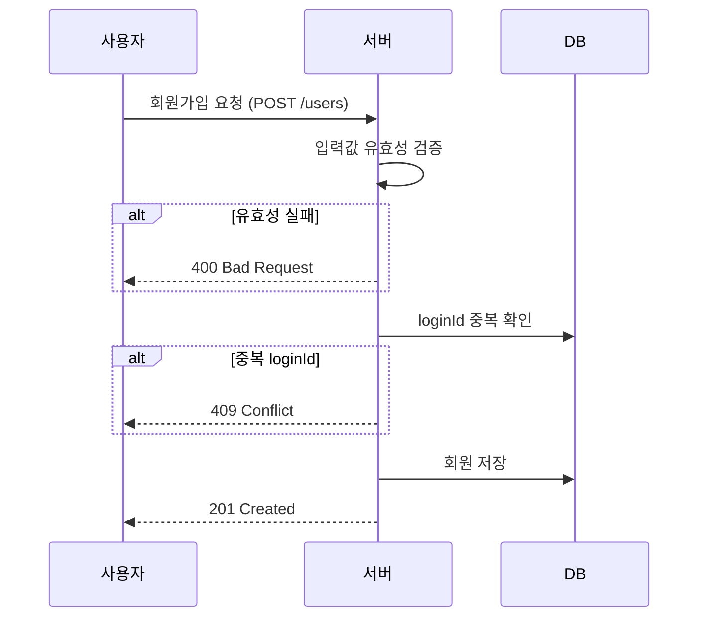
```mermaid
sequenceDiagram
    participant 사용자
    participant 서버
    participant DB

    사용자->>서버: 회원가입 요청 (POST /users)
    서버->>서버: 입력값 유효성 검증
    alt 유효성 실패
        서버-->>사용자: 400 Bad Request
    end
    서버->>DB: loginId 중복 확인
    alt 중복 loginId
        서버-->>사용자: 409 Conflict
    end
    서버->>DB: 회원 저장
    서버-->>사용자: 201 Created
```

### 상세

인증 없이 접근 가능한 엔드포인트. 유효성 검증은 도메인 생성자에서 처리된다.

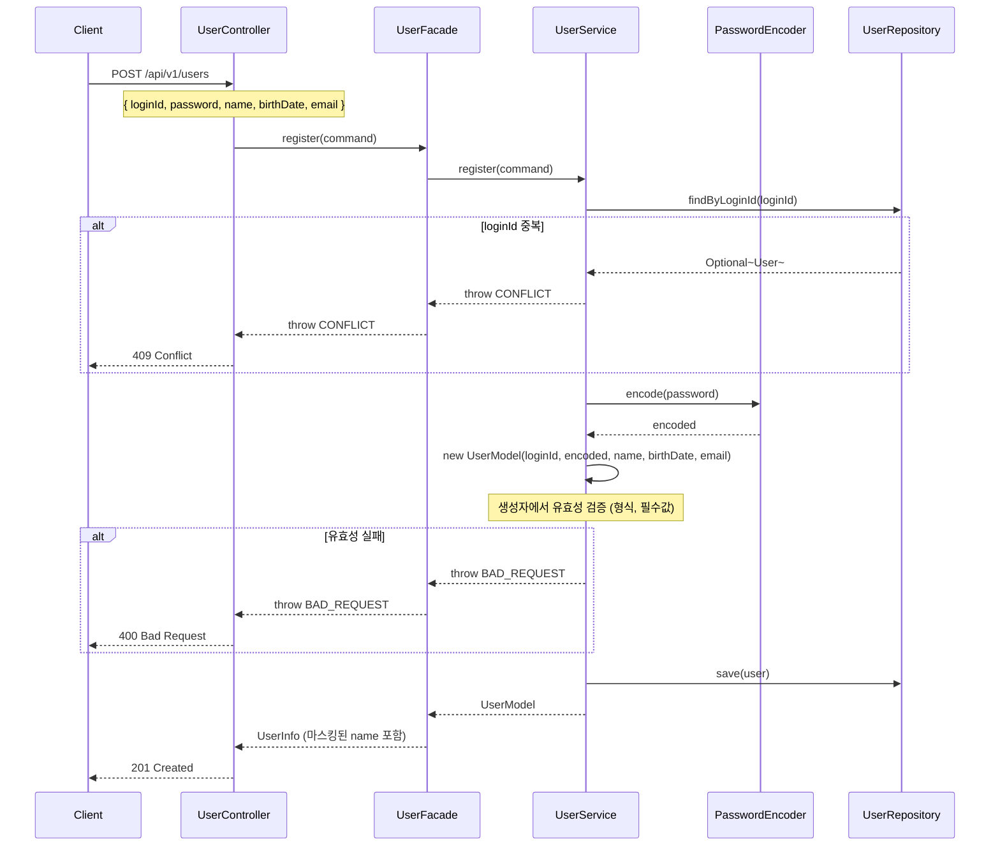
```mermaid
sequenceDiagram
    participant Client
    participant UserController
    participant UserFacade
    participant UserService
    participant PasswordEncoder
    participant UserRepository

    Client->>UserController: POST /api/v1/users
    Note over UserController: { loginId, password, name, birthDate, email }

    UserController->>UserFacade: register(command)
    UserFacade->>UserService: register(command)

    UserService->>UserRepository: findByLoginId(loginId)
    alt loginId 중복
        UserRepository-->>UserService: Optional~User~
        UserService-->>UserFacade: throw CONFLICT
        UserFacade-->>UserController: throw CONFLICT
        UserController-->>Client: 409 Conflict
    end

    UserService->>PasswordEncoder: encode(password)
    PasswordEncoder-->>UserService: encoded
    UserService->>UserService: new UserModel(loginId, encoded, name, birthDate, email)
    Note over UserService: 생성자에서 유효성 검증 (형식, 필수값)
    alt 유효성 실패
        UserService-->>UserFacade: throw BAD_REQUEST
        UserFacade-->>UserController: throw BAD_REQUEST
        UserController-->>Client: 400 Bad Request
    end

    UserService->>UserRepository: save(user)
    UserService-->>UserFacade: UserModel
    UserFacade-->>UserController: UserInfo (마스킹된 name 포함)
    UserController-->>Client: 201 Created
```

**읽는 포인트**
- 인증 헤더 없이 접근 가능한 유일한 쓰기 엔드포인트다.
- 유효성 검증(loginId 형식, name 한글 등)은 `UserModel` 생성자에서 처리된다. Controller/Service에 검증 로직이 없다.
- 비밀번호는 `PasswordEncoder`를 통과한 결과만 DB에 저장된다.
- 응답의 `name`은 마지막 글자가 `*`로 마스킹된 값이다.

---

## 2. 내 정보 조회

### 개요

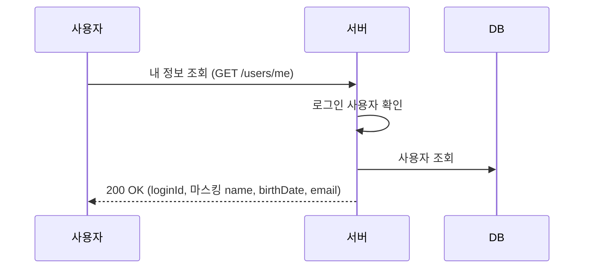
```mermaid
sequenceDiagram
    participant 사용자
    participant 서버
    participant DB

    사용자->>서버: 내 정보 조회 (GET /users/me)
    서버->>서버: 로그인 사용자 확인
    서버->>DB: 사용자 조회
    서버-->>사용자: 200 OK (loginId, 마스킹 name, birthDate, email)
```

### 상세

인증된 사용자 본인의 정보를 반환한다. `password`는 응답에 포함되지 않는다.

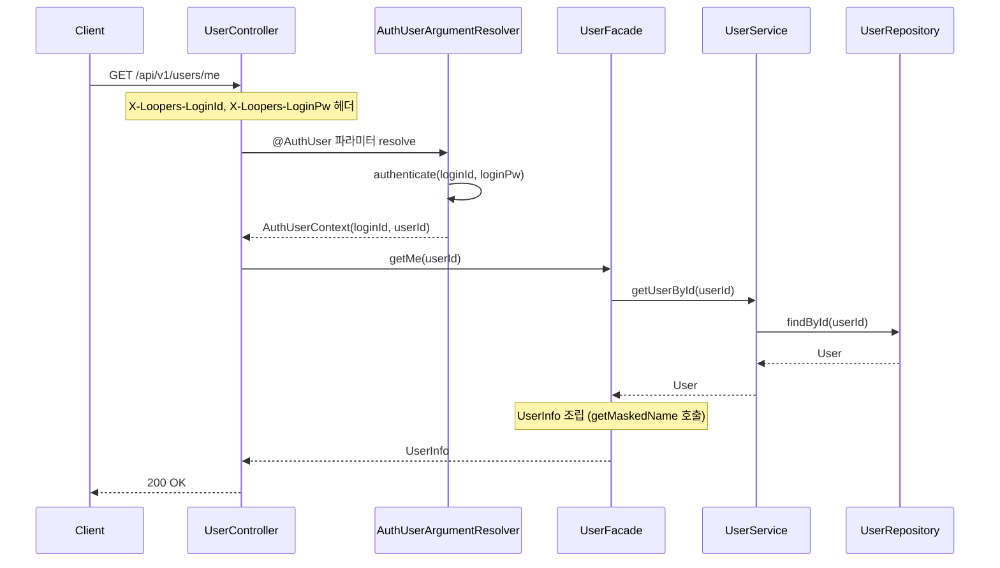
```mermaid
sequenceDiagram
    participant Client
    participant UserController
    participant AuthUserArgumentResolver
    participant UserFacade
    participant UserService
    participant UserRepository

    Client->>UserController: GET /api/v1/users/me
    Note over UserController: X-Loopers-LoginId, X-Loopers-LoginPw 헤더

    UserController->>AuthUserArgumentResolver: @AuthUser 파라미터 resolve
    AuthUserArgumentResolver->>AuthUserArgumentResolver: authenticate(loginId, loginPw)
    AuthUserArgumentResolver-->>UserController: AuthUserContext(loginId, userId)

    UserController->>UserFacade: getMe(userId)
    UserFacade->>UserService: getUserById(userId)
    UserService->>UserRepository: findById(userId)
    UserRepository-->>UserService: User
    UserService-->>UserFacade: User
    Note over UserFacade: UserInfo 조립 (getMaskedName 호출)
    UserFacade-->>UserController: UserInfo
    UserController-->>Client: 200 OK
```

**읽는 포인트**
- `password`는 응답 DTO 어디에도 노출되지 않는다.
- `name`은 도메인 메서드 `User.getMaskedName()`을 통해 마스킹된 값을 반환한다. Facade/Controller가 직접 자르지 않는다.
- 인증 단계에서 이미 사용자 존재가 확인되므로 별도 404 분기는 없다.
- 인증 시 이미 획득한 `userId`를 그대로 사용해 PK로 조회한다. `loginId`로 다시 조회하지 않아 DB 라운드트립이 줄어든다.

---

## 3. 비밀번호 변경

### 개요

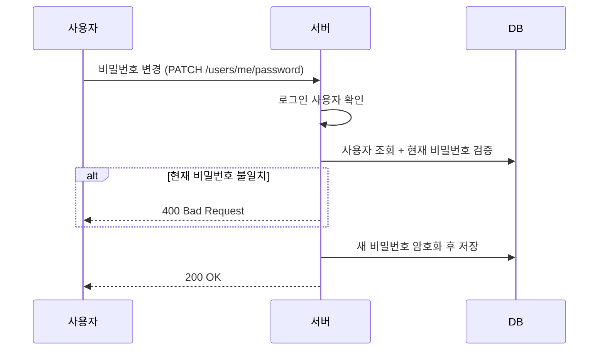
```mermaid
sequenceDiagram
    participant 사용자
    participant 서버
    participant DB

    사용자->>서버: 비밀번호 변경 (PATCH /users/me/password)
    서버->>서버: 로그인 사용자 확인
    서버->>DB: 사용자 조회 + 현재 비밀번호 검증
    alt 현재 비밀번호 불일치
        서버-->>사용자: 400 Bad Request
    end
    서버->>DB: 새 비밀번호 암호화 후 저장
    서버-->>사용자: 200 OK
```

### 상세

현재 비밀번호 일치 여부를 검증하고, 새 비밀번호를 인코딩하여 저장한다.

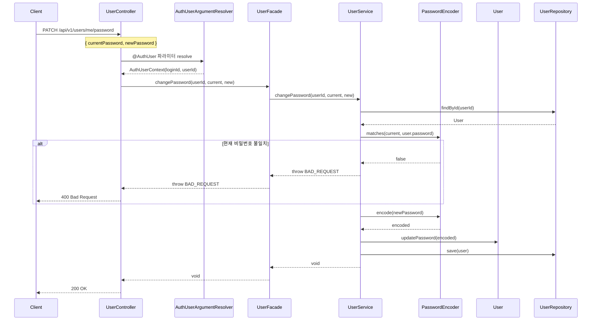
```mermaid
sequenceDiagram
    participant Client
    participant UserController
    participant AuthUserArgumentResolver
    participant UserFacade
    participant UserService
    participant PasswordEncoder
    participant User
    participant UserRepository

    Client->>UserController: PATCH /api/v1/users/me/password
    Note over UserController: { currentPassword, newPassword }

    UserController->>AuthUserArgumentResolver: @AuthUser 파라미터 resolve
    AuthUserArgumentResolver-->>UserController: AuthUserContext(loginId, userId)

    UserController->>UserFacade: changePassword(userId, current, new)
    UserFacade->>UserService: changePassword(userId, current, new)

    UserService->>UserRepository: findById(userId)
    UserRepository-->>UserService: User

    UserService->>PasswordEncoder: matches(current, user.password)
    alt 현재 비밀번호 불일치
        PasswordEncoder-->>UserService: false
        UserService-->>UserFacade: throw BAD_REQUEST
        UserFacade-->>UserController: throw BAD_REQUEST
        UserController-->>Client: 400 Bad Request
    end

    UserService->>PasswordEncoder: encode(newPassword)
    PasswordEncoder-->>UserService: encoded
    UserService->>User: updatePassword(encoded)
    UserService->>UserRepository: save(user)
    UserService-->>UserFacade: void
    UserFacade-->>UserController: void
    UserController-->>Client: 200 OK
```

**읽는 포인트**
- 현재 비밀번호 검증과 새 비밀번호 저장이 하나의 트랜잭션 안에서 처리된다.
- `User.updatePassword()`는 도메인 메서드. 인코딩 결과만 받아 저장하고, 인코딩 자체는 `PasswordEncoder`가 담당한다.
- 인증 실패(잘못된 로그인 정보)와 현재 비밀번호 불일치(올바른 로그인이지만 잘못된 currentPassword)는 다른 케이스다.
- 인증 단계에서 획득한 `userId`로 PK 조회한다.

---

## 4. 상품 목록 조회

### 개요

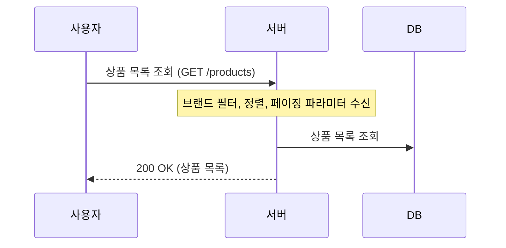
```mermaid
sequenceDiagram
    participant 사용자
    participant 서버
    participant DB

    사용자->>서버: 상품 목록 조회 (GET /products)
    Note over 서버: 브랜드 필터, 정렬, 페이징 파라미터 수신
    서버->>DB: 상품 목록 조회
    서버-->>사용자: 200 OK (상품 목록)
```

### 상세

인증 없이 접근 가능. 브랜드 필터, 정렬(최신순/가격순/좋아요순), 페이징을 지원한다. 삭제된 상품은 자동 제외된다.

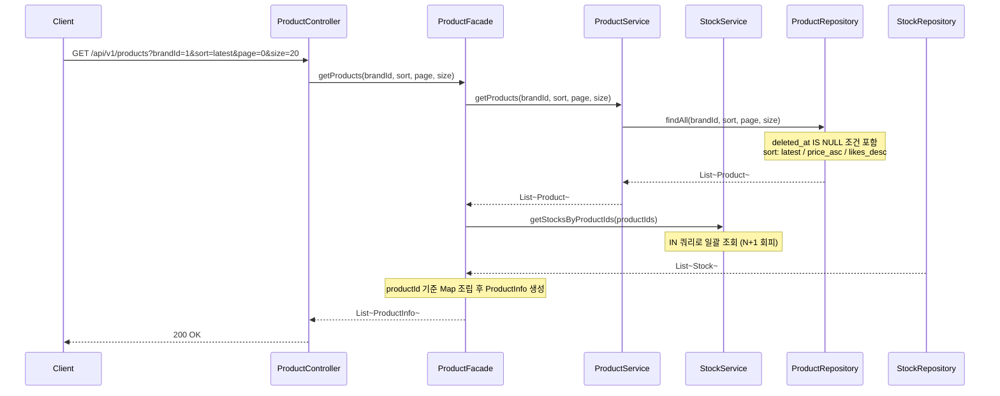
```mermaid
sequenceDiagram
    participant Client
    participant ProductController
    participant ProductFacade
    participant ProductService
    participant StockService
    participant ProductRepository
    participant StockRepository

    Client->>ProductController: GET /api/v1/products?brandId=1&sort=latest&page=0&size=20

    ProductController->>ProductFacade: getProducts(brandId, sort, page, size)

    ProductFacade->>ProductService: getProducts(brandId, sort, page, size)
    ProductService->>ProductRepository: findAll(brandId, sort, page, size)
    Note over ProductRepository: deleted_at IS NULL 조건 포함<br/>sort: latest / price_asc / likes_desc
    ProductRepository-->>ProductService: List~Product~
    ProductService-->>ProductFacade: List~Product~

    ProductFacade->>StockService: getStocksByProductIds(productIds)
    Note over StockService: IN 쿼리로 일괄 조회 (N+1 회피)
    StockRepository-->>ProductFacade: List~Stock~

    Note over ProductFacade: productId 기준 Map 조립 후 ProductInfo 생성

    ProductFacade-->>ProductController: List~ProductInfo~
    ProductController-->>Client: 200 OK
```

**읽는 포인트**
- `deleted_at IS NULL` 조건으로 soft delete된 상품은 자동 제외된다.
- `likes_desc` 정렬은 `likes` 테이블 COUNT 집계를 활용한다. 성능 이슈 시 캐시 컬럼 도입을 검토한다.
- 재고는 상품별 개별 조회 대신 **IN 쿼리로 일괄 조회**하여 N+1 문제를 회피한다.
- 상품 목록에는 브랜드명이 포함되지 않는다 (상세 조회에서만 제공).

---

## 5. 상품 상세 조회

### 개요

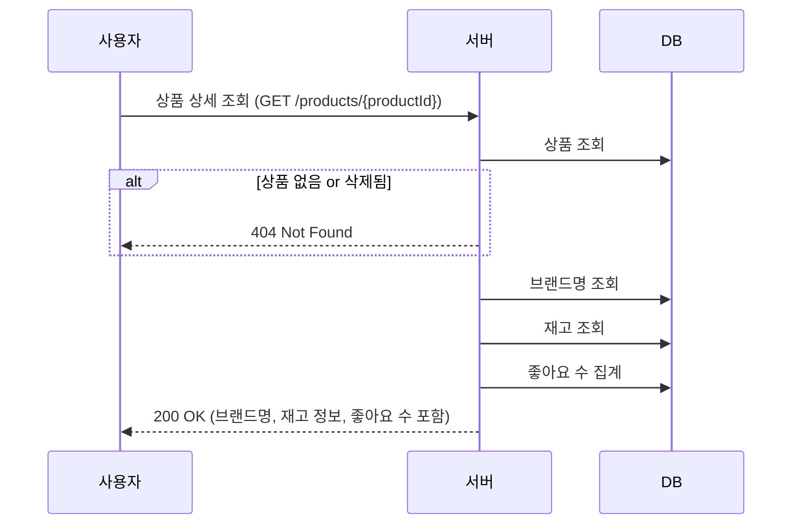
```mermaid
sequenceDiagram
    participant 사용자
    participant 서버
    participant DB

    사용자->>서버: 상품 상세 조회 (GET /products/{productId})
    서버->>DB: 상품 조회
    alt 상품 없음 or 삭제됨
        서버-->>사용자: 404 Not Found
    end
    서버->>DB: 브랜드명 조회
    서버->>DB: 재고 조회
    서버->>DB: 좋아요 수 집계
    서버-->>사용자: 200 OK (브랜드명, 재고 정보, 좋아요 수 포함)
```

### 상세

인증 없이 접근 가능. 브랜드명, 재고 정보, 좋아요 수를 함께 반환한다.

**도메인 협력 구조**
- `Product + Brand` 조합은 **Domain Service (`ProductDetailService`)** 가 담당한다. 두 도메인 객체의 협력 로직을 Application 계층으로 새지 않게 한다.
- Application Facade (`ProductFacade`) 는 `ProductDetailService` 의 결과 + `Stock` + 좋아요 수를 모아 `ProductDetailInfo` 로 어셈블하는 흐름 조율만 담당한다.

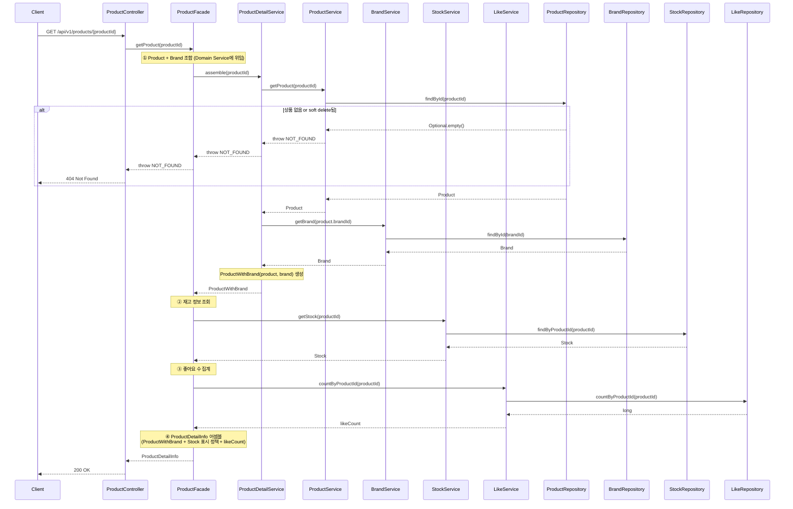
```mermaid
sequenceDiagram
    participant Client
    participant ProductController
    participant ProductFacade
    participant ProductDetailService
    participant ProductService
    participant BrandService
    participant StockService
    participant LikeService
    participant ProductRepository
    participant BrandRepository
    participant StockRepository
    participant LikeRepository

    Client->>ProductController: GET /api/v1/products/{productId}

    ProductController->>ProductFacade: getProduct(productId)

    Note over ProductFacade: ① Product + Brand 조합 (Domain Service에 위임)
    ProductFacade->>ProductDetailService: assemble(productId)
    ProductDetailService->>ProductService: getProduct(productId)
    ProductService->>ProductRepository: findById(productId)
    alt 상품 없음 or soft delete됨
        ProductRepository-->>ProductService: Optional.empty()
        ProductService-->>ProductDetailService: throw NOT_FOUND
        ProductDetailService-->>ProductFacade: throw NOT_FOUND
        ProductFacade-->>ProductController: throw NOT_FOUND
        ProductController-->>Client: 404 Not Found
    end
    ProductRepository-->>ProductService: Product
    ProductService-->>ProductDetailService: Product

    ProductDetailService->>BrandService: getBrand(product.brandId)
    BrandService->>BrandRepository: findById(brandId)
    BrandRepository-->>BrandService: Brand
    BrandService-->>ProductDetailService: Brand

    Note over ProductDetailService: ProductWithBrand(product, brand) 생성
    ProductDetailService-->>ProductFacade: ProductWithBrand

    Note over ProductFacade: ② 재고 정보 조회
    ProductFacade->>StockService: getStock(productId)
    StockService->>StockRepository: findByProductId(productId)
    StockRepository-->>StockService: Stock
    StockService-->>ProductFacade: Stock

    Note over ProductFacade: ③ 좋아요 수 집계
    ProductFacade->>LikeService: countByProductId(productId)
    LikeService->>LikeRepository: countByProductId(productId)
    LikeRepository-->>LikeService: long
    LikeService-->>ProductFacade: likeCount

    Note over ProductFacade: ④ ProductDetailInfo 어셈블<br/>(ProductWithBrand + Stock 표시 정책 + likeCount)
    ProductFacade-->>ProductController: ProductDetailInfo
    ProductController-->>Client: 200 OK
```

**읽는 포인트**
- **Domain Service 도입 이유**: `Product + Brand` 두 도메인 객체의 조합은 도메인 협력 로직이므로 Application Facade가 아닌 Domain Service에 위치시킨다. Facade는 "유스케이스 흐름 조율 + DTO 어셈블"만 책임진다.
- `ProductWithBrand`는 두 도메인 객체를 묶은 **Domain Object** 다. Application/Interface 계층 DTO가 아니라 도메인 내부에서만 유통된다.
- 상품, 브랜드, 재고, 좋아요 수 총 **4번의 DB 조회**가 발생한다. 성능 이슈 시 단일 쿼리(JOIN + COUNT 서브쿼리)로 개선 가능하다.
- 재고가 10개 이하면 `remainingStock`에 수량이 담기고, 초과 시 `null`이 반환된다. 이 표시 정책은 `Stock.getDisplayQuantity()` 도메인 메서드에 캡슐화되어 있다.
- 삭제된 상품(`deleted_at IS NULL` 조건 미충족)은 404로 처리된다.

---

## 6. 좋아요 등록 (멱등)

### 개요

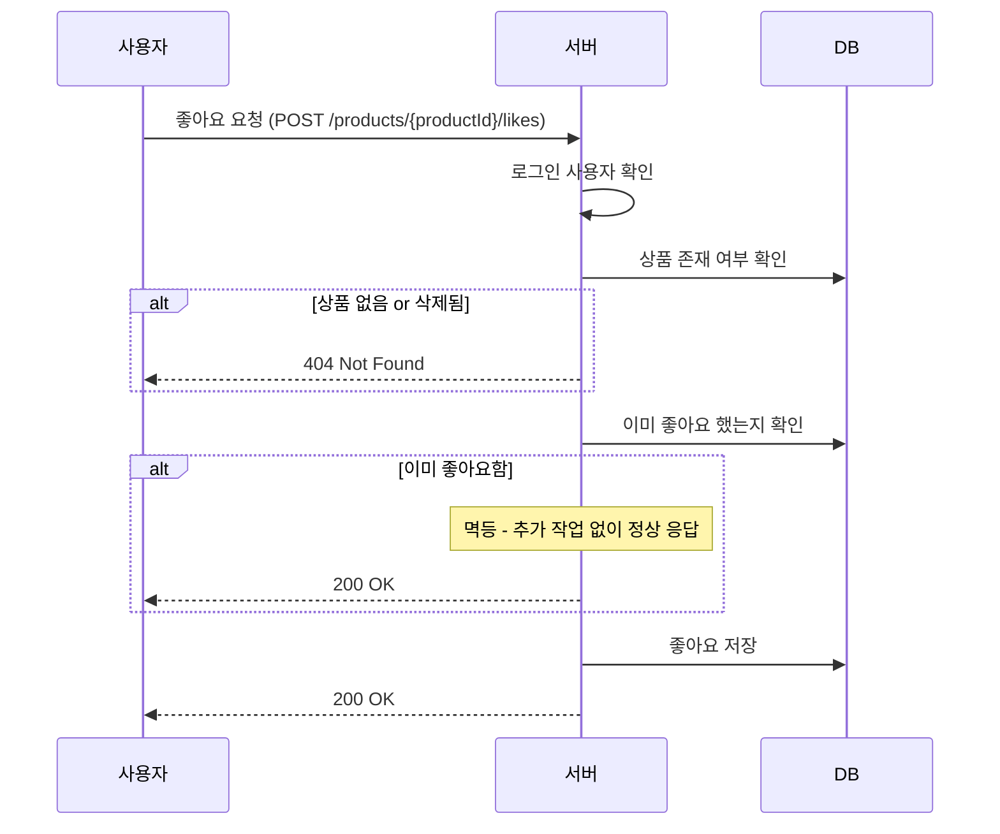
```mermaid
sequenceDiagram
    participant 사용자
    participant 서버
    participant DB

    사용자->>서버: 좋아요 요청 (POST /products/{productId}/likes)
    서버->>서버: 로그인 사용자 확인
    서버->>DB: 상품 존재 여부 확인
    alt 상품 없음 or 삭제됨
        서버-->>사용자: 404 Not Found
    end
    서버->>DB: 이미 좋아요 했는지 확인
    alt 이미 좋아요함
        Note over 서버: 멱등 - 추가 작업 없이 정상 응답
        서버-->>사용자: 200 OK
    end
    서버->>DB: 좋아요 저장
    서버-->>사용자: 200 OK
```

### 상세

요구사항 P-1에 따라 멱등하게 동작한다. 이미 좋아요한 상태에서 다시 요청해도 200 OK로 응답하며, DB 변화는 없다.

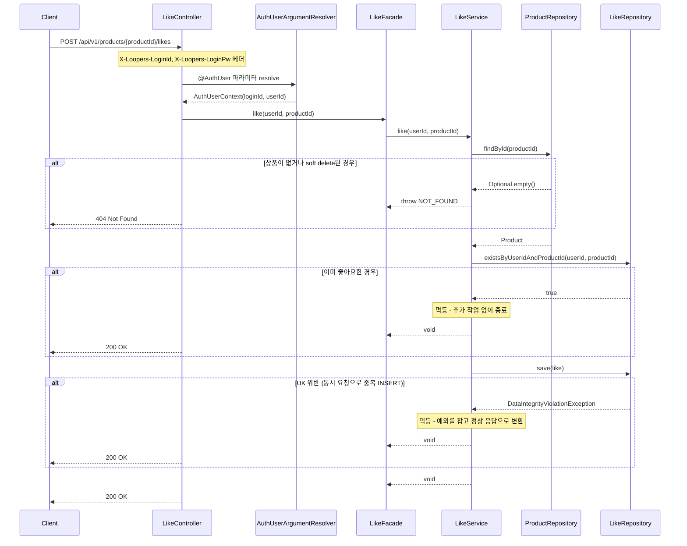
```mermaid
sequenceDiagram
    participant Client
    participant LikeController
    participant AuthUserArgumentResolver
    participant LikeFacade
    participant LikeService
    participant ProductRepository
    participant LikeRepository

    Client->>LikeController: POST /api/v1/products/{productId}/likes
    Note over LikeController: X-Loopers-LoginId, X-Loopers-LoginPw 헤더

    LikeController->>AuthUserArgumentResolver: @AuthUser 파라미터 resolve
    AuthUserArgumentResolver-->>LikeController: AuthUserContext(loginId, userId)

    LikeController->>LikeFacade: like(userId, productId)
    LikeFacade->>LikeService: like(userId, productId)

    LikeService->>ProductRepository: findById(productId)
    alt 상품이 없거나 soft delete된 경우
        ProductRepository-->>LikeService: Optional.empty()
        LikeService-->>LikeFacade: throw NOT_FOUND
        LikeController-->>Client: 404 Not Found
    end
    ProductRepository-->>LikeService: Product

    LikeService->>LikeRepository: existsByUserIdAndProductId(userId, productId)
    alt 이미 좋아요한 경우
        LikeRepository-->>LikeService: true
        Note over LikeService: 멱등 - 추가 작업 없이 종료
        LikeService-->>LikeFacade: void
        LikeController-->>Client: 200 OK
    end

    LikeService->>LikeRepository: save(like)
    alt UK 위반 (동시 요청으로 중복 INSERT)
        LikeRepository-->>LikeService: DataIntegrityViolationException
        Note over LikeService: 멱등 - 예외를 잡고 정상 응답으로 변환
        LikeService-->>LikeFacade: void
        LikeController-->>Client: 200 OK
    end

    LikeService-->>LikeFacade: void
    LikeController-->>Client: 200 OK
```

**읽는 포인트**
- 삭제된 상품 좋아요는 멱등 대상이 아니라 명확한 404로 응답한다 (P-3).
- 존재 여부 확인은 애플리케이션 레벨에서 먼저 처리하지만, 동시 요청으로 인한 race condition은 DB의 UK 제약이 최후 방어선이다.
- UK 위반 예외(`DataIntegrityViolationException`)는 LikeService에서 캐치하여 멱등 응답으로 변환한다.
- 동일 사용자가 같은 상품에 좋아요를 여러 번 눌러도 결과는 항상 "좋아요 1건"이다.

---

## 7. 좋아요 취소 (멱등)

### 개요

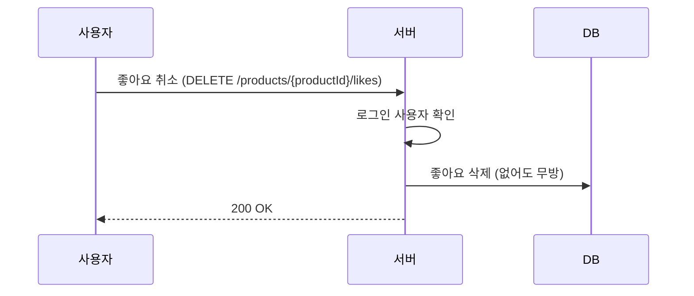
```mermaid
sequenceDiagram
    participant 사용자
    participant 서버
    participant DB

    사용자->>서버: 좋아요 취소 (DELETE /products/{productId}/likes)
    서버->>서버: 로그인 사용자 확인
    서버->>DB: 좋아요 삭제 (없어도 무방)
    서버-->>사용자: 200 OK
```

### 상세

요구사항 P-2에 따라 멱등하게 동작한다. 좋아요가 없는 상태에서 취소 요청을 받아도 200 OK로 응답한다.

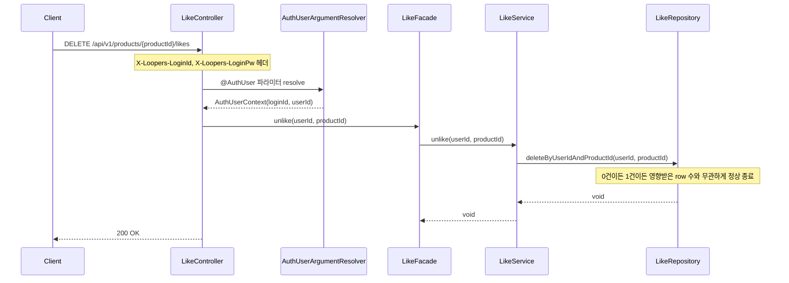
```mermaid
sequenceDiagram
    participant Client
    participant LikeController
    participant AuthUserArgumentResolver
    participant LikeFacade
    participant LikeService
    participant LikeRepository

    Client->>LikeController: DELETE /api/v1/products/{productId}/likes
    Note over LikeController: X-Loopers-LoginId, X-Loopers-LoginPw 헤더

    LikeController->>AuthUserArgumentResolver: @AuthUser 파라미터 resolve
    AuthUserArgumentResolver-->>LikeController: AuthUserContext(loginId, userId)

    LikeController->>LikeFacade: unlike(userId, productId)
    LikeFacade->>LikeService: unlike(userId, productId)

    LikeService->>LikeRepository: deleteByUserIdAndProductId(userId, productId)
    Note over LikeRepository: 0건이든 1건이든 영향받은 row 수와 무관하게 정상 종료
    LikeRepository-->>LikeService: void

    LikeService-->>LikeFacade: void
    LikeController-->>Client: 200 OK
```

**읽는 포인트**
- 좋아요 취소는 상품 존재 여부도, 좋아요 레코드 존재 여부도 확인하지 않는다.
- `DELETE` 쿼리는 본질적으로 멱등하다. 영향받은 row 수에 관계없이 같은 결과로 응답한다.
- 이미 삭제된 상품에 걸린 기존 좋아요도 취소할 수 있다.

---

## 8. 주문 생성 + 결제

### 개요

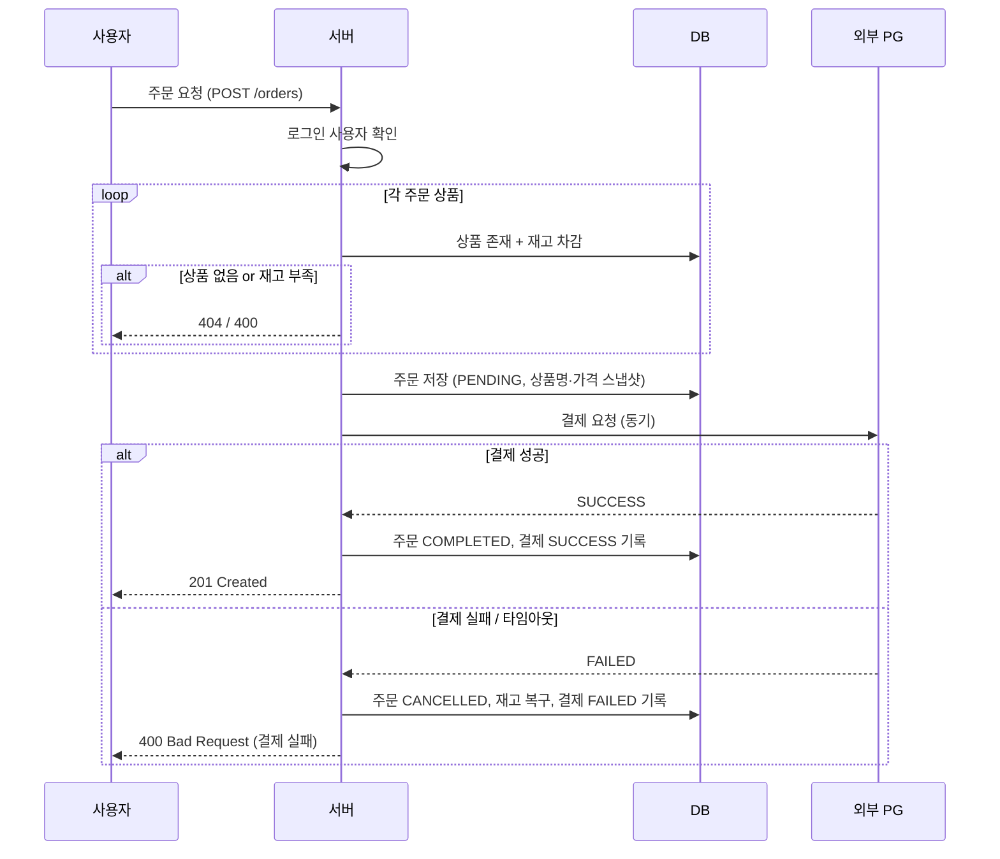
```mermaid
sequenceDiagram
    participant 사용자
    participant 서버
    participant DB
    participant PG as 외부 PG

    사용자->>서버: 주문 요청 (POST /orders)
    서버->>서버: 로그인 사용자 확인
    loop 각 주문 상품
        서버->>DB: 상품 존재 + 재고 차감
        alt 상품 없음 or 재고 부족
            서버-->>사용자: 404 / 400
        end
    end
    서버->>DB: 주문 저장 (PENDING, 상품명·가격 스냅샷)
    서버->>PG: 결제 요청 (동기)
    alt 결제 성공
        PG-->>서버: SUCCESS
        서버->>DB: 주문 COMPLETED, 결제 SUCCESS 기록
        서버-->>사용자: 201 Created
    else 결제 실패 / 타임아웃
        PG-->>서버: FAILED
        서버->>DB: 주문 CANCELLED, 재고 복구, 결제 FAILED 기록
        서버-->>사용자: 400 Bad Request (결제 실패)
    end
```

### 상세

요구사항 P-5/P-6에 따라 주문 생성 + 재고 차감 + 결제 요청을 단일 트랜잭션으로 처리한다. 결제 실패 시 보상 로직(주문 취소 + 재고 복구)이 같은 트랜잭션 내에서 실행되고, 실패 기록은 보존된다.

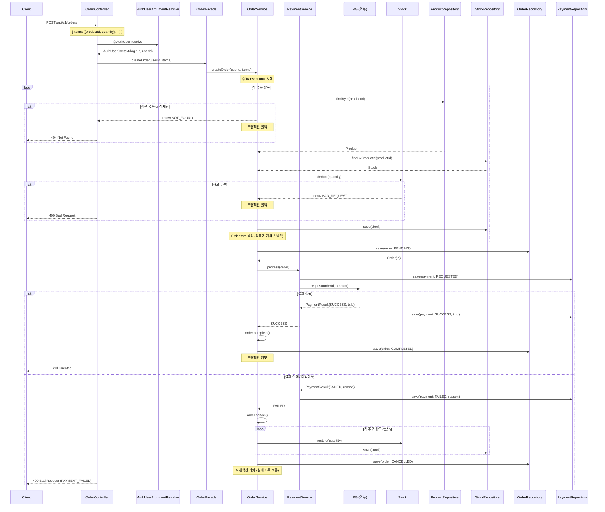
```mermaid
sequenceDiagram
    participant Client
    participant OrderController
    participant AuthUserArgumentResolver
    participant OrderFacade
    participant OrderService
    participant PaymentService
    participant PaymentGateway as PG (외부)
    participant Stock
    participant ProductRepository
    participant StockRepository
    participant OrderRepository
    participant PaymentRepository

    Client->>OrderController: POST /api/v1/orders
    Note over OrderController: { items: [{productId, quantity}, ...] }

    OrderController->>AuthUserArgumentResolver: @AuthUser resolve
    AuthUserArgumentResolver-->>OrderController: AuthUserContext(loginId, userId)

    OrderController->>OrderFacade: createOrder(userId, items)
    OrderFacade->>OrderService: createOrder(userId, items)
    Note over OrderService: @Transactional 시작

    loop 각 주문 항목
        OrderService->>ProductRepository: findById(productId)
        alt 상품 없음 or 삭제됨
            OrderService-->>OrderController: throw NOT_FOUND
            Note over OrderService: 트랜잭션 롤백
            OrderController-->>Client: 404 Not Found
        end
        ProductRepository-->>OrderService: Product

        OrderService->>StockRepository: findByProductId(productId)
        StockRepository-->>OrderService: Stock

        OrderService->>Stock: deduct(quantity)
        alt 재고 부족
            Stock-->>OrderService: throw BAD_REQUEST
            Note over OrderService: 트랜잭션 롤백
            OrderController-->>Client: 400 Bad Request
        end
        OrderService->>StockRepository: save(stock)
        Note over OrderService: OrderItem 생성 (상품명·가격 스냅샷)
    end

    OrderService->>OrderRepository: save(order: PENDING)
    OrderRepository-->>OrderService: Order(id)

    OrderService->>PaymentService: process(order)
    PaymentService->>PaymentRepository: save(payment: REQUESTED)
    PaymentService->>PaymentGateway: request(orderId, amount)

    alt 결제 성공
        PaymentGateway-->>PaymentService: PaymentResult(SUCCESS, txId)
        PaymentService->>PaymentRepository: save(payment: SUCCESS, txId)
        PaymentService-->>OrderService: SUCCESS
        OrderService->>OrderService: order.complete()
        OrderService->>OrderRepository: save(order: COMPLETED)
        Note over OrderService: 트랜잭션 커밋
        OrderController-->>Client: 201 Created
    else 결제 실패 / 타임아웃
        PaymentGateway-->>PaymentService: PaymentResult(FAILED, reason)
        PaymentService->>PaymentRepository: save(payment: FAILED, reason)
        PaymentService-->>OrderService: FAILED
        OrderService->>OrderService: order.cancel()
        loop 각 주문 항목 (보상)
            OrderService->>Stock: restore(quantity)
            OrderService->>StockRepository: save(stock)
        end
        OrderService->>OrderRepository: save(order: CANCELLED)
        Note over OrderService: 트랜잭션 커밋 (실패 기록 보존)
        OrderController-->>Client: 400 Bad Request (PAYMENT_FAILED)
    end
```

**읽는 포인트**
- `@Transactional`이 주문 + 재고 차감 + 결제 + 보상까지 전체를 감싼다. 결제 실패 시 롤백이 아니라 **보상 로직(주문 CANCELLED + 재고 복구)** 으로 처리하고 트랜잭션은 커밋한다. 그래야 결제 실패 기록이 DB에 남는다.
- 외부 PG 호출이 트랜잭션 내부에 있으므로 호출 시간만큼 DB 커넥션이 점유된다. 리스크 항목 참조 (요구사항 9번).
- 재고 차감 책임은 `Stock.deduct()`, 복구 책임은 `Stock.restore()`. OrderService는 호출자일 뿐.
- 결제 게이트웨이는 `PaymentGateway` 인터페이스로 추상화되어, 테스트에서는 가짜 구현체로 교체 가능하다.

---

## 9. 주문 상세 조회

### 개요

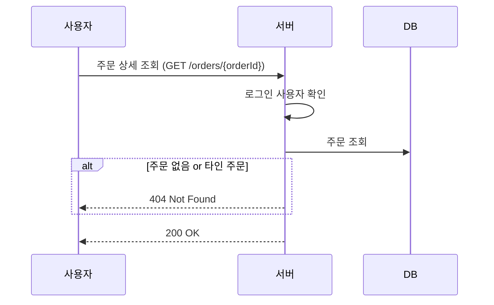
```mermaid
sequenceDiagram
    participant 사용자
    participant 서버
    participant DB

    사용자->>서버: 주문 상세 조회 (GET /orders/{orderId})
    서버->>서버: 로그인 사용자 확인
    서버->>DB: 주문 조회
    alt 주문 없음 or 타인 주문
        서버-->>사용자: 404 Not Found
    end
    서버-->>사용자: 200 OK
```

### 상세

본인 주문만 조회 가능. 타인의 주문 접근 시 존재 여부를 노출하지 않고 404로 응답한다.

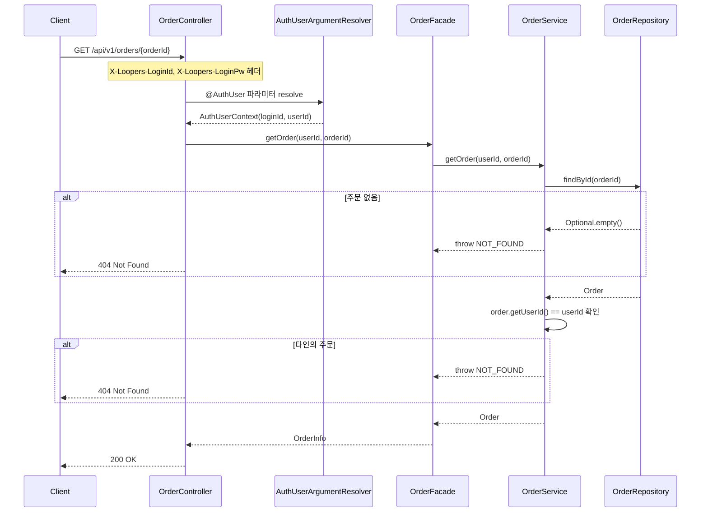
```mermaid
sequenceDiagram
    participant Client
    participant OrderController
    participant AuthUserArgumentResolver
    participant OrderFacade
    participant OrderService
    participant OrderRepository

    Client->>OrderController: GET /api/v1/orders/{orderId}
    Note over OrderController: X-Loopers-LoginId, X-Loopers-LoginPw 헤더

    OrderController->>AuthUserArgumentResolver: @AuthUser 파라미터 resolve
    AuthUserArgumentResolver-->>OrderController: AuthUserContext(loginId, userId)

    OrderController->>OrderFacade: getOrder(userId, orderId)
    OrderFacade->>OrderService: getOrder(userId, orderId)

    OrderService->>OrderRepository: findById(orderId)
    alt 주문 없음
        OrderRepository-->>OrderService: Optional.empty()
        OrderService-->>OrderFacade: throw NOT_FOUND
        OrderController-->>Client: 404 Not Found
    end
    OrderRepository-->>OrderService: Order

    OrderService->>OrderService: order.getUserId() == userId 확인
    alt 타인의 주문
        OrderService-->>OrderFacade: throw NOT_FOUND
        OrderController-->>Client: 404 Not Found
    end

    OrderService-->>OrderFacade: Order
    OrderFacade-->>OrderController: OrderInfo
    OrderController-->>Client: 200 OK
```

**읽는 포인트**
- 타인의 주문 접근 시 403 Forbidden이 아닌 404 Not Found로 응답한다. 주문 존재 여부 자체를 노출하지 않기 위함이다 (P-11).
- userId 검증은 OrderService 레이어에서 처리한다. Controller에서 처리하면 Service가 순수하지 않아진다.

---

## 10. [어드민] 브랜드 삭제

### 개요

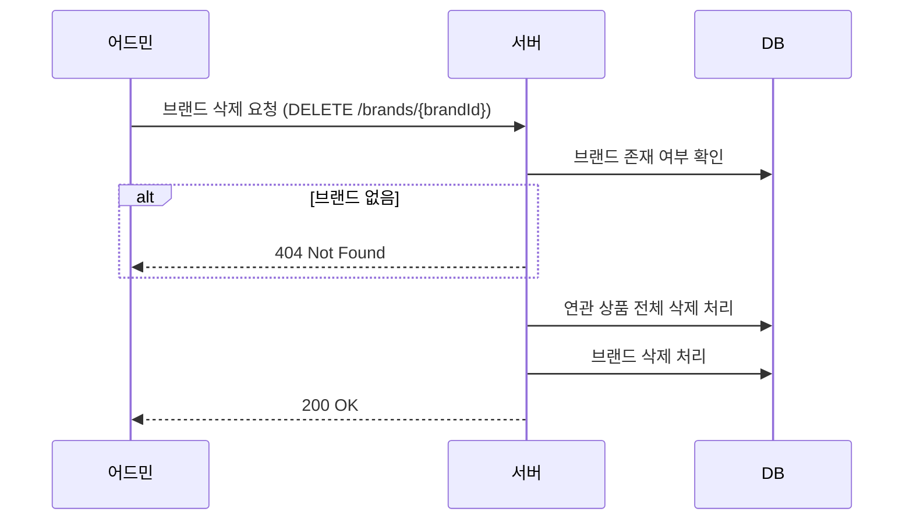
```mermaid
sequenceDiagram
    participant 어드민
    participant 서버
    participant DB

    어드민->>서버: 브랜드 삭제 요청 (DELETE /brands/{brandId})
    서버->>DB: 브랜드 존재 여부 확인
    alt 브랜드 없음
        서버-->>어드민: 404 Not Found
    end
    서버->>DB: 연관 상품 전체 삭제 처리
    서버->>DB: 브랜드 삭제 처리
    서버-->>어드민: 200 OK
```

### 상세

브랜드 삭제 시 연관 상품도 soft delete 처리되는 흐름, 트랜잭션 범위를 확인한다.

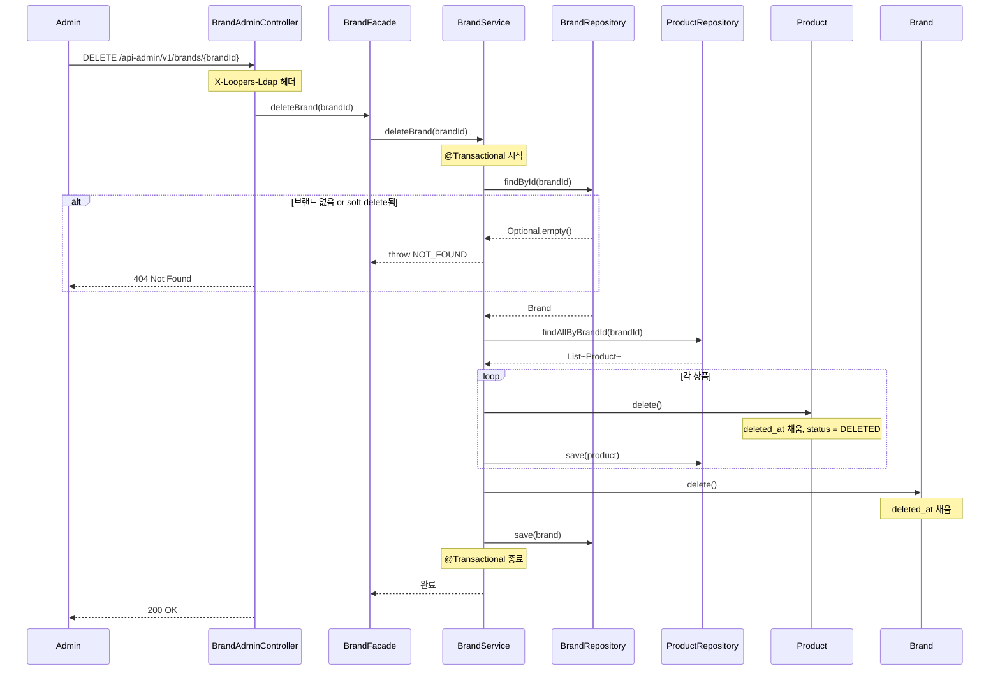
```mermaid
sequenceDiagram
    participant Admin
    participant BrandAdminController
    participant BrandFacade
    participant BrandService
    participant BrandRepository
    participant ProductRepository

    Admin->>BrandAdminController: DELETE /api-admin/v1/brands/{brandId}
    Note over BrandAdminController: X-Loopers-Ldap 헤더

    BrandAdminController->>BrandFacade: deleteBrand(brandId)
    BrandFacade->>BrandService: deleteBrand(brandId)
    Note over BrandService: @Transactional 시작

    BrandService->>BrandRepository: findById(brandId)
    alt 브랜드 없음 or soft delete됨
        BrandRepository-->>BrandService: Optional.empty()
        BrandService-->>BrandFacade: throw NOT_FOUND
        BrandAdminController-->>Admin: 404 Not Found
    end
    BrandRepository-->>BrandService: Brand

    BrandService->>ProductRepository: findAllByBrandId(brandId)
    ProductRepository-->>BrandService: List~Product~

    loop 각 상품
        BrandService->>Product: delete()
        Note over Product: deleted_at 채움, status = DELETED
        BrandService->>ProductRepository: save(product)
    end

    BrandService->>Brand: delete()
    Note over Brand: deleted_at 채움
    BrandService->>BrandRepository: save(brand)

    Note over BrandService: @Transactional 종료
    BrandService-->>BrandFacade: 완료
    BrandAdminController-->>Admin: 200 OK
```

**읽는 포인트**
- 상품 soft delete → 브랜드 soft delete 순서로 처리된다.
- 하나의 트랜잭션 안에서 처리되므로 중간 실패 시 전체 롤백, 부분 삭제 상태가 발생하지 않는다.
- `deleted_at`을 채우는 책임은 `Brand.delete()`, `Product.delete()` 도메인 메서드에 있다. `Product.delete()`는 BaseEntity의 `delete()`를 오버라이드하여 `deleted_at` 채움과 함께 `status = DELETED`로도 변경한다. `Brand`는 status 필드가 없으므로 `deleted_at`만 채운다.
- `ProductRepository.findAllByBrandId()`는 이미 soft delete된 상품은 제외하고 반환한다 (deletedAt IS NULL 조건).
