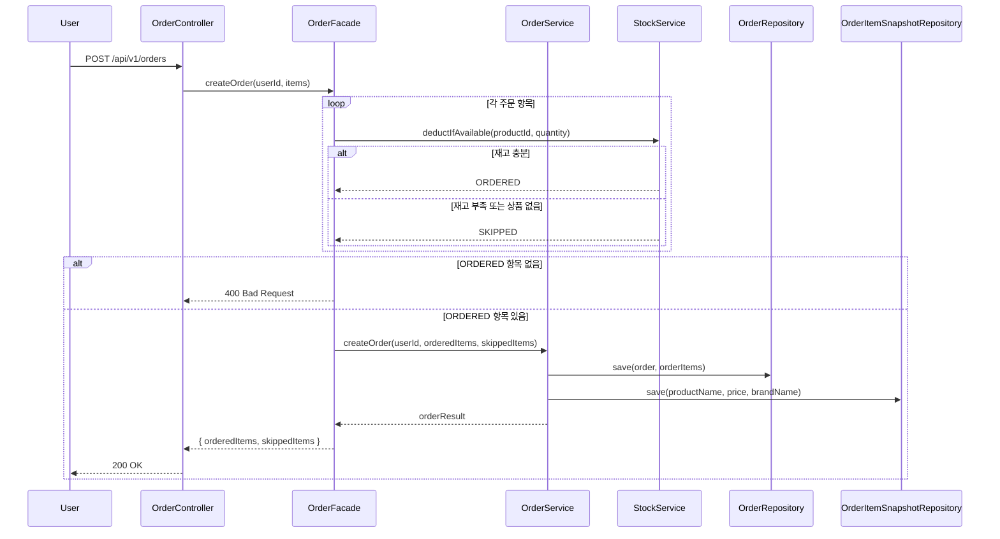
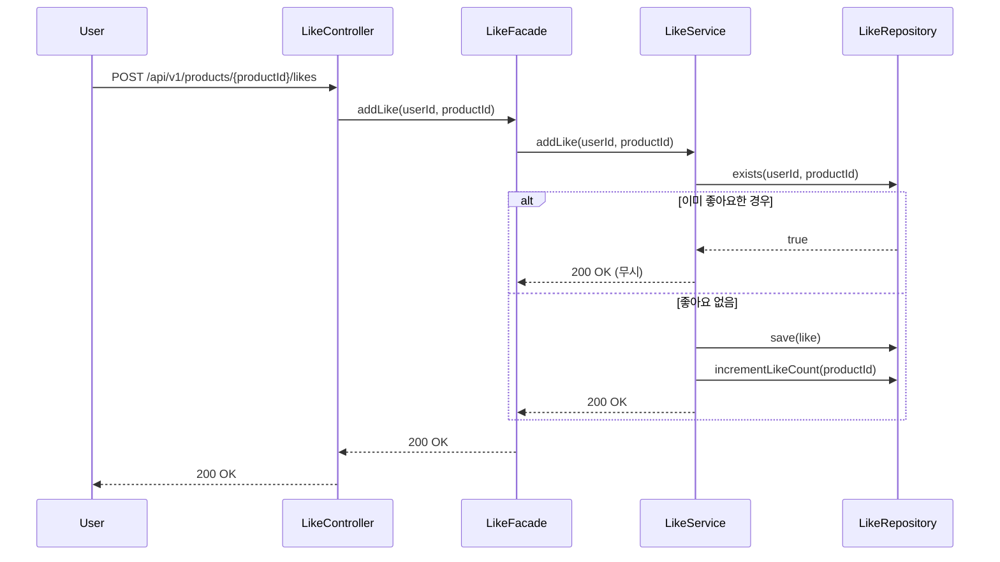
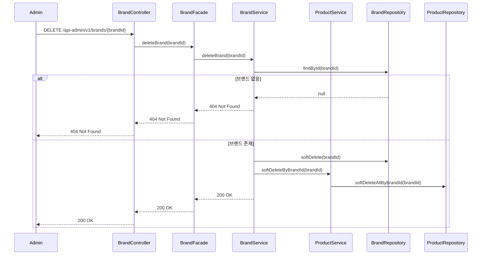

# 02. 시퀀스 다이어그램

---

## SD-01. 주문 생성

재고 확인 및 차감, 부분 주문 처리, 스냅샷 저장의 책임 분리와 트랜잭션 경계를 검증한다.

**읽는 포인트**
- ORDERED/SKIPPED 분류는 Facade에서 결정하고, OrderService는 저장만 담당한다.
- 재고 차감과 주문 저장은 단일 트랜잭션으로 처리된다.
- 스냅샷은 OrderService 내부에서 주문 저장 직후 동일 트랜잭션 안에 저장된다.

---

## SD-02. 좋아요 등록 (멱등 처리)

좋아요 중복 요청 시 에러 없이 처리되는 멱등성 흐름과 like_count 책임 위치를 검증한다.

**읽는 포인트**
- 이미 좋아요가 존재하면 저장 없이 200 OK를 반환한다. like_count는 변경되지 않는다.
- like_count 증감 책임은 LikeService가 가지며, Product 도메인에 위임한다.

---

## SD-03. 브랜드 삭제 (소프트 딜리트 cascade)

브랜드 삭제 시 상품 cascade 처리가 애플리케이션 레벨에서 일어남을 검증한다.

**읽는 포인트**
- 실제 행 삭제 없이 `deleted_at` 설정으로 처리하므로 기존 주문 스냅샷에 영향이 없다.
- cascade는 DB ON DELETE가 아닌 BrandService → ProductService 호출로 처리한다.
