# 시퀀스 다이어그램

> 1단계 요구사항 명세서(`01-requirements.md`)의 유저 시나리오를, 시스템 안에서 **누가 무엇을 책임지고 어떤 순서로 처리하는지**로 풀어낸 문서다.
> 시퀀스 다이어그램으로 확인하려는 것: **책임 분리 · 호출 순서 · 정상/예외 흐름**.
> 분기와 여러 책임이 얽히는 **주문 생성**·**좋아요 등록·취소**·**쿠폰 발급**·**결제(PG 연동)** 시나리오를 다룬다 — 브랜드·상품·쿠폰 템플릿 CRUD/조회는 흐름이 단순해 별도 시퀀스를 두지 않고, 요구사항 명세서·3·4단계(클래스·ERD)에서 다룬다.
> 결제(4번)는 **외부 시스템(PG)** 이 우리 트랜잭션 밖에 있어, 정상 흐름보다 **끊겼을 때(지연·실패·중복·응답 유실)** 내부/외부 상태가 어긋나는 지점과 그 복구(콜백·정산)에 초점을 둔다.

## 1. 주문 생성

**시나리오 개요**

- **목적**: 로그인 사용자가 여러 상품을 한 번에 주문한다(쿠폰 0~1장 사용 가능).
- **선행조건**: 로그인 상태, 주문 항목 1개 이상.
- **관련 요구사항**: US-07 (AC-07-1 ~ AC-07-9).

**참여자**

| 약어 | 정식명 | 역할 |
|------|--------|------|
| U | 사용자 | 주문을 요청하는 로그인 사용자 |
| O | 주문 서비스 | 주문 생성, 흐름 오케스트레이션, 주문 이력 보관 |
| P | 상품·재고 서비스 | 상품 조회(스냅샷 + 비관적 행 락), 재고 차감 |
| C | 쿠폰 서비스 | 쿠폰 소유·사용 가능 검증, 할인 계산, 사용 처리 |
| DB | 데이터 저장소 | 주문·상품·재고·쿠폰의 영속화 |

### 주문 생성 흐름

요청 검증 → 상품 조회(스냅샷용, **락 없음**) → 상품 존재 확인 → (쿠폰 지정 시) 쿠폰 검증·할인 계산 → 그다음 재고(`Inventory`) 조회(**비관적 쓰기 락**으로 잠가 로드) → **잠근 재고에 차감**(도메인이 `재고 ≥ 수량` 검증 후 차감) → 쿠폰 사용 처리 → 주문 저장으로 이어진다. 상품 없음·쿠폰 사용 불가·재고 부족 중 하나라도 걸리면 아무것도 변경하지 않고 거부한다. 이 모든 과정은 **하나의 트랜잭션**으로 묶인다(AC-07-4·AC-07-8). 쿠폰 검증을 **재고 락보다 앞에** 두어, 타인/사용된 쿠폰 같은 흔한 실패가 인기 상품 핫 로우 락을 점유하지 않게 한다(fail-cheap-first). 재고를 `products`에서 분리해 별도 `inventories` 행을 잠그므로, 주문 락이 좋아요 카운터 등 무관한 `products` 쓰기와 충돌하지 않는다(false sharing 제거 — 4단계 ERD `inventories`).

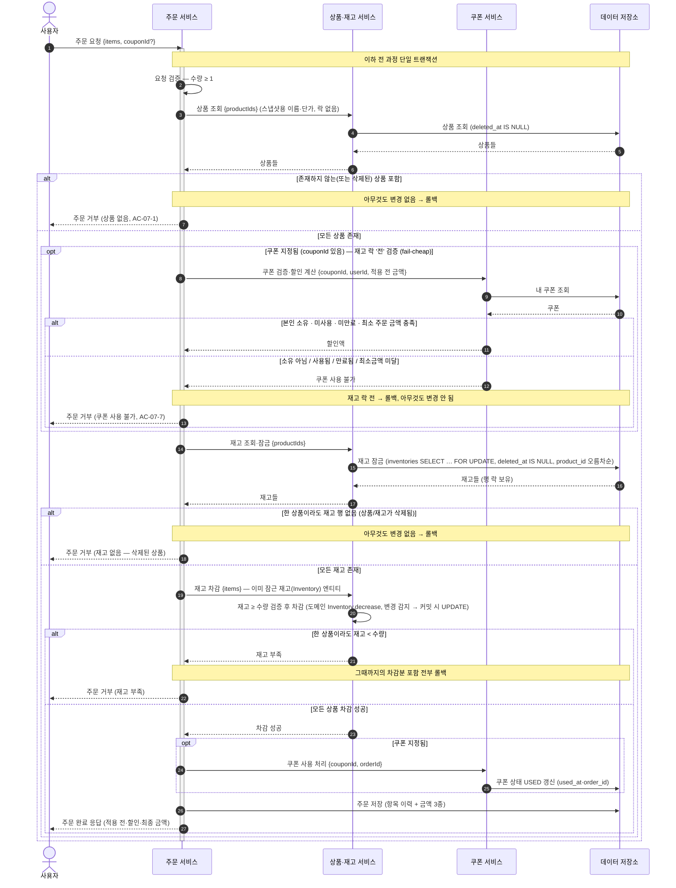
```mermaid
sequenceDiagram
    autonumber
    actor U as 사용자
    participant O as 주문 서비스
    participant P as 상품·재고 서비스
    participant C as 쿠폰 서비스
    participant DB as 데이터 저장소

    U->>O: 주문 요청 {items, couponId?}
    activate O
    Note over O,DB: 이하 전 과정 단일 트랜잭션
    O->>O: 요청 검증 — 수량 ≥ 1
    O->>P: 상품 조회 {productIds} (스냅샷용 이름·단가, 락 없음)
    P->>DB: 상품 조회 (deleted_at IS NULL)
    DB-->>P: 상품들
    P-->>O: 상품들

    alt 존재하지 않는(또는 삭제된) 상품 포함
        Note over O,DB: 아무것도 변경 없음 → 롤백
        O-->>U: 주문 거부 (상품 없음, AC-07-1)
    else 모든 상품 존재
        opt 쿠폰 지정됨 (couponId 있음) — 재고 락 '전' 검증 (fail-cheap)
            O->>C: 쿠폰 검증·할인 계산 {couponId, userId, 적용 전 금액}
            C->>DB: 내 쿠폰 조회
            DB-->>C: 쿠폰
            alt 본인 소유 · 미사용 · 미만료 · 최소 주문 금액 충족
                C-->>O: 할인액
            else 소유 아님 / 사용됨 / 만료됨 / 최소금액 미달
                C-->>O: 쿠폰 사용 불가
                Note over O,DB: 재고 락 전 → 롤백, 아무것도 변경 안 됨
                O-->>U: 주문 거부 (쿠폰 사용 불가, AC-07-7)
            end
        end

        O->>P: 재고 조회·잠금 {productIds}
        P->>DB: 재고 잠금 (inventories SELECT … FOR UPDATE, deleted_at IS NULL, product_id 오름차순)
        DB-->>P: 재고들 (행 락 보유)
        P-->>O: 재고들
        alt 한 상품이라도 재고 행 없음 (상품/재고가 삭제됨)
            Note over O,DB: 아무것도 변경 없음 → 롤백
            O-->>U: 주문 거부 (재고 없음 — 삭제된 상품)
        else 모든 재고 존재
            O->>P: 재고 차감 {items} — 이미 잠근 재고(Inventory) 엔티티
            P->>P: 재고 ≥ 수량 검증 후 차감 (도메인 Inventory.decrease, 변경 감지 → 커밋 시 UPDATE)
            alt 한 상품이라도 재고 < 수량
                P-->>O: 재고 부족
                Note over O,DB: 그때까지의 차감분 포함 전부 롤백
                O-->>U: 주문 거부 (재고 부족)
            else 모든 상품 차감 성공
                P-->>O: 차감 성공

                opt 쿠폰 지정됨
                    O->>C: 쿠폰 사용 처리 {couponId, orderId}
                    C->>DB: 쿠폰 상태 USED 갱신 (used_at·order_id)
                end

                O->>DB: 주문 저장 (항목 이력 + 금액 3종)
                O-->>U: 주문 완료 응답 (적용 전·할인·최종 금액)
            end
        end
    end
    deactivate O
```

**해석** — 상품은 스냅샷용(이름·단가)이라 **락 없이** 읽는다. 존재 확인에서 먼저 갈리고(없거나 삭제됐으면 거부, AC-07-1), 쿠폰이 지정된 경우 쿠폰 검증·할인 계산(`opt`)을 **재고 락보다 먼저** 끝낸다(fail-cheap). 그다음 차감 대상인 **재고(`Inventory`) 행만 비관적 쓰기 락으로 잠가 로드**한다 — 삭제된 상품은 재고 행도 소프트 삭제돼 `deleted_at IS NULL` 필터에 걸리지 않으므로, 잠글 재고가 없으면 "재고 없음"으로 거부된다(삭제↔주문 경쟁 차단). **재고 충분성은 도메인이 `재고 ≥ 수량`을 검증한 뒤 차감**하며(부족하면 거부), 차감은 잠근 엔티티의 변경 감지로 커밋 시 UPDATE에 반영된다. 동시 주문은 같은 재고 행 락에 직렬화되므로 read-modify-write 간극이 사라져 oversell이 차단된다. 모두 통과하면 재고 차감 → 쿠폰 사용 처리(`USED` 전이, AC-07-8) → 주문 저장(금액 3종 스냅샷, AC-07-6) 순으로 진행된다. 할인 계산은 **쿠폰 서비스가 책임지고**(최소 주문 금액 검사 포함), 주문 서비스는 그 결과 할인액만 받아 최종 금액을 산출한다.

> **락 시점** — 재고(`Inventory`) 행 락을 **쿠폰 검증을 통과한 뒤** 잡는다. 인기 상품 핫 로우 락을 가장 흔한 실패(타인/사용된 쿠폰) 뒤로 미뤄, 무효 쿠폰 주문이 락을 점유하지 않게 한다(fail-cheap-first). 락을 잡은 뒤로는 차감·쿠폰 사용·커밋까지 보유하지만, 외부 호출 없이 in-memory 연산과 짧은 DB 쓰기뿐이라 보유 시간이 짧다. 최종 쿠폰 중복 사용은 커밋 시 `@Version` 낙관 락이 막는다.
> **데드락 회피** — 여러 재고를 `findAllByProductIdInAndDeletedAtIsNullOrderByProductIdAsc`로 **product_id 오름차순** 잠가, 동시 주문들이 같은 순서로 락을 획득해 순환 대기(데드락)가 생기지 않는다.
> **삭제↔주문 경쟁** — 상품 삭제는 상품과 **그 재고를 함께 소프트 삭제**한다. 삭제의 재고 UPDATE 가 같은 행 락을 잡아 주문의 `FOR UPDATE` 와 직렬화되고, 주문의 락 조회는 `deleted_at IS NULL` 로 필터하므로 — 삭제가 먼저면 주문은 재고를 못 잠그고 거부, 주문이 먼저면 정상 차감 후 삭제로 깔끔히 갈린다(4단계 ERD `inventories`).
> 전 과정이 단일 트랜잭션이므로, 어느 단계에서 거부되든 그때까지의 재고 차감·쿠폰 사용은 롤백되어 흔적이 남지 않는다(AC-07-4·AC-07-8). 한 쿠폰이 동시에 두 주문에 사용되는 중복 사용은 `user_coupons`의 **낙관적 락(`@Version`)** 으로 막는다 — 동시 사용 시 한쪽만 성공하고 나머지는 충돌로 이 트랜잭션 전체가 롤백된다(ERD 참조).

---

## 2. 좋아요 등록·취소

**시나리오 개요**

- **목적**: 로그인 사용자가 상품 좋아요를 등록/취소한다.
- **선행조건**: 로그인 상태.
- **관련 요구사항**: US-04 (AC-04-1 ~ 4), US-05 (AC-05-1 ~ 4).

**참여자**

| 약어 | 정식명 | 역할 |
|------|--------|------|
| U | 사용자 | 좋아요를 누르는 로그인 사용자 |
| L | 좋아요 서비스 | 좋아요 등록/취소, **멱등 판정**(이미 있는지 확인) |
| P | 상품 서비스 | 상품 존재 확인 (좋아요 등록 시) |
| DB | 데이터 저장소 | 좋아요·상품의 영속화 |

### 좋아요 등록

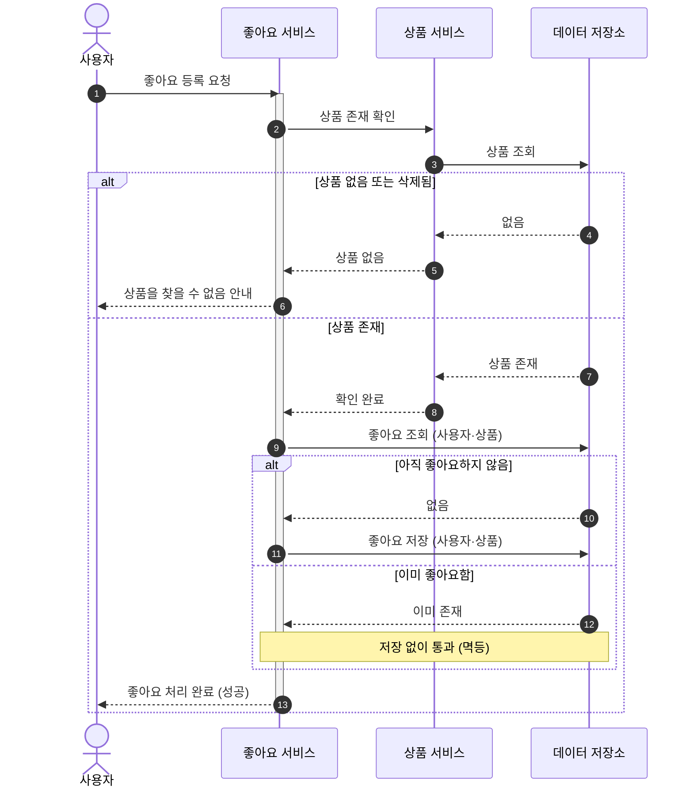
```mermaid
sequenceDiagram
    autonumber
    actor U as 사용자
    participant L as 좋아요 서비스
    participant P as 상품 서비스
    participant DB as 데이터 저장소

    U->>L: 좋아요 등록 요청
    activate L
    L->>P: 상품 존재 확인
    P->>DB: 상품 조회

    alt 상품 없음 또는 삭제됨
        DB-->>P: 없음
        P-->>L: 상품 없음
        L-->>U: 상품을 찾을 수 없음 안내
    else 상품 존재
        DB-->>P: 상품 존재
        P-->>L: 확인 완료
        L->>DB: 좋아요 조회 (사용자·상품)
        alt 아직 좋아요하지 않음
            DB-->>L: 없음
            L->>DB: 좋아요 저장 (사용자·상품)
        else 이미 좋아요함
            DB-->>L: 이미 존재
            Note over L,DB: 저장 없이 통과 (멱등)
        end
        L-->>U: 좋아요 처리 완료 (성공)
    end
    deactivate L
```

**해석** — 멱등의 핵심은 좋아요 행이 **실제로 생겼는지**다. 등록은 `INSERT IGNORE`로 시도해 영향 행 수가 1(신규)일 때만 `products.like_count`를 **원자적으로 +1** 한다 — 이미 있으면 0행이라 카운터를 건드리지 않고 **그대로 성공**으로 응답한다(AC-04-2). 취소도 대칭으로 `DELETE` 영향 행 수가 1일 때만 `-1`. 좋아요 수는 행을 비정규화한 카운터라, 고경합에서도 원자적 UPDATE로 lost update 없이 정확히 반영된다(4단계 ERD `products` 참조).

### 좋아요 취소

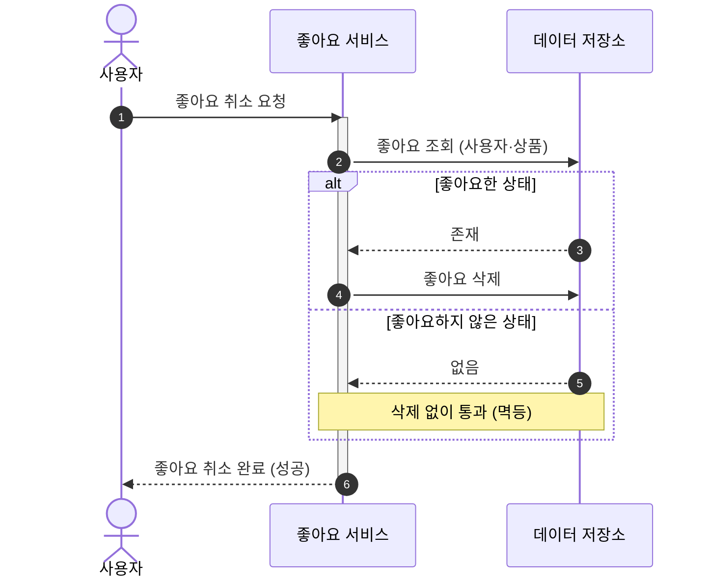
```mermaid
sequenceDiagram
    autonumber
    actor U as 사용자
    participant L as 좋아요 서비스
    participant DB as 데이터 저장소

    U->>L: 좋아요 취소 요청
    activate L
    L->>DB: 좋아요 조회 (사용자·상품)
    alt 좋아요한 상태
        DB-->>L: 존재
        L->>DB: 좋아요 삭제
    else 좋아요하지 않은 상태
        DB-->>L: 없음
        Note over L,DB: 삭제 없이 통과 (멱등)
    end
    L-->>U: 좋아요 취소 완료 (성공)
    deactivate L
```

**해석** — 등록과 대칭이다. 좋아요하지 않은 상품을 취소해도 오류 없이 성공으로 처리한다(AC-05-2). 취소는 "상품이 없으면 좋아요도 없다"는 관계라, 상품 존재 확인을 따로 두지 않고 좋아요 유무로만 분기한다(AC-05-4) — 좋아요 서비스 안에서 끝난다.

---

## 3. 쿠폰 발급

**시나리오 개요**

- **목적**: 로그인 사용자가 쿠폰 템플릿으로 자신의 쿠폰을 발급받는다.
- **선행조건**: 로그인 상태.
- **관련 요구사항**: US-19 (AC-19-1 ~ 4).

**참여자**

| 약어 | 정식명 | 역할 |
|------|--------|------|
| U | 사용자 | 쿠폰을 발급받는 로그인 사용자 |
| C | 쿠폰 서비스 | 템플릿 확인, 중복 발급 판정, 발급(스냅샷 복사) |
| DB | 데이터 저장소 | 쿠폰 템플릿·내 쿠폰의 영속화 |

### 쿠폰 발급 흐름

템플릿 존재를 확인하고, 같은 템플릿을 이미 발급받았는지(1인 1매) 검사한 뒤, 통과하면 발급 시점의 혜택·이름·만료일을 복사해 내 쿠폰을 저장한다. 좋아요 등록과 달리 **중복 발급은 멱등 통과가 아니라 거부**한다(AC-19-2).

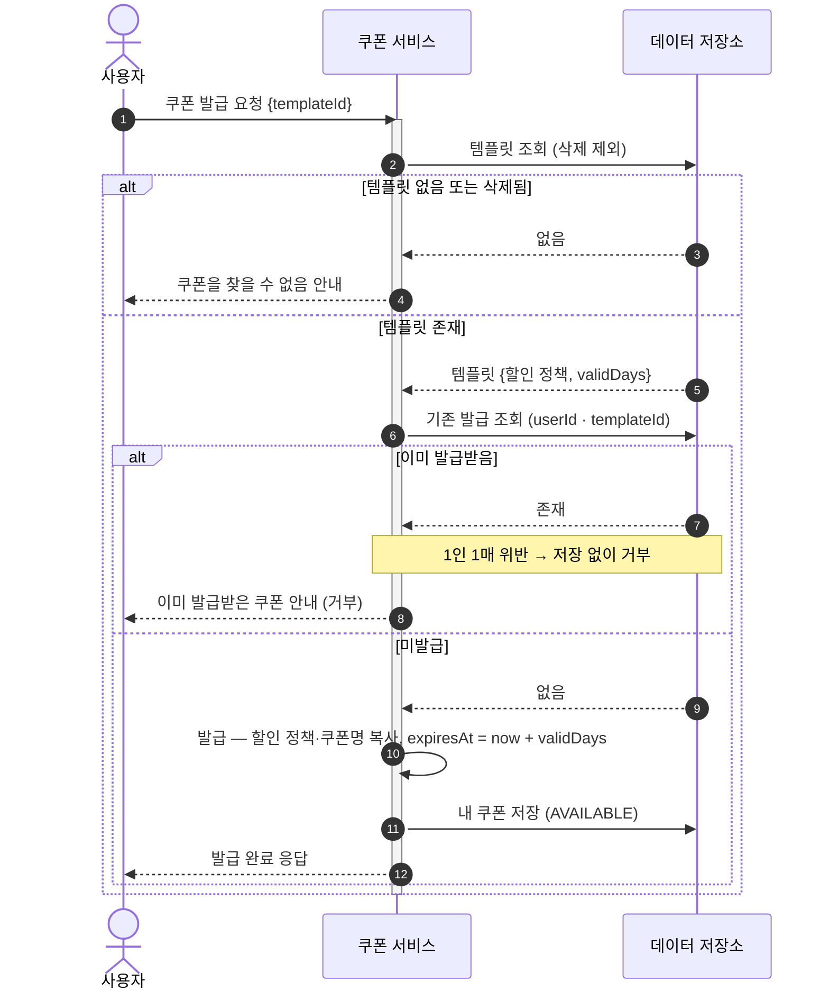
```mermaid
sequenceDiagram
    autonumber
    actor U as 사용자
    participant C as 쿠폰 서비스
    participant DB as 데이터 저장소

    U->>C: 쿠폰 발급 요청 {templateId}
    activate C
    C->>DB: 템플릿 조회 (삭제 제외)

    alt 템플릿 없음 또는 삭제됨
        DB-->>C: 없음
        C-->>U: 쿠폰을 찾을 수 없음 안내
    else 템플릿 존재
        DB-->>C: 템플릿 {할인 정책, validDays}
        C->>DB: 기존 발급 조회 (userId · templateId)
        alt 이미 발급받음
            DB-->>C: 존재
            Note over C,DB: 1인 1매 위반 → 저장 없이 거부
            C-->>U: 이미 발급받은 쿠폰 안내 (거부)
        else 미발급
            DB-->>C: 없음
            C->>C: 발급 — 할인 정책·쿠폰명 복사, expiresAt = now + validDays
            C->>DB: 내 쿠폰 저장 (AVAILABLE)
            C-->>U: 발급 완료 응답
        end
    end
    deactivate C
```

**해석** — 두 번 분기한다. 먼저 템플릿이 없거나 삭제됐으면 거부하고(AC-19-3), 다음으로 같은 (사용자, 템플릿) 쌍이 이미 있으면 거부한다(AC-19-2). 발급 시점에 템플릿의 할인 정책·이름을 **복사(스냅샷)** 하고 만료일을 확정(`now + validDays`)하므로, 이후 템플릿이 수정·삭제돼도 이 쿠폰은 자립한다(클래스 다이어그램 `UserCoupon` 참조). 애플리케이션의 중복 확인이 동시성으로 뚫려도 `user_coupons (user_id, template_id)` 유니크 제약이 최종 방어선이 된다(ERD 참조).

---

## 4. 결제 (PG 연동) — Round 6

**시나리오 개요**

- **목적**: 로그인 사용자가 생성된(`CREATED`) 주문을 외부 PG로 결제한다. PG는 비동기라 요청은 *접수*만 확인하고, 결과는 콜백/조회로 확정한다.
- **선행조건**: 로그인 상태, 본인 소유의 `CREATED` 주문 존재.
- **관련 요구사항**: US-25 ~ US-28 (AC-25-1 ~ AC-28-2).

**참여자**

| 약어 | 정식명 | 역할 |
|------|--------|------|
| U | 사용자(브라우저) | 결제를 요청하고, 결과 확정까지 상태를 **폴링**한다 |
| Pay | 결제 서비스 | 결제 저장(`PENDING`)·PG 호출 오케스트레이션, 콜백/정산 결과 반영, 멱등 처리 |
| O | 주문 서비스 | 주문 소유·상태 확인, 성공 시 `PAID` 전이 |
| PG | PG(외부) | 카드 승인 대행. 접수 응답 + 콜백/상태조회 제공(우리 트랜잭션 밖) |
| DB | 데이터 저장소 | 결제·주문의 영속화 |

> **경계(0단계)** — 모든 정합성 위험의 뿌리는 **외부 호출 지점과 DB 커밋 지점의 순서**다. 본 설계는 ① 결제(`PENDING`)를 **먼저 커밋**하고(TX1), ② PG 호출은 **트랜잭션 밖**에서 하며(Timeout/CB/Fallback), ③ 거래키만 따로 저장한다(TX2). 결과 확정은 콜백/정산이 별도 트랜잭션으로 한다.

### 4-1. 결제 요청 (US-25)

요청을 받으면 **주문 행을 비관락(FOR UPDATE)으로 잡고** 소유·중복(같은 주문에 살아있는 결제)을 확인한 뒤, 결제를 `PENDING`으로 저장하고 커밋한다(락 해제). 그다음 트랜잭션/락 **밖에서** PG에 결제를 요청한다 — 접수되면 거래키를 저장(여전히 `PENDING`)하고, 타임아웃/차단되면 Fallback으로 `PENDING`을 유지한 채 "접수됨"으로 응답한다(타임아웃=모름). 즉 이 단계의 응답은 어떤 경로든 **"접수(PENDING)"** 이고, 성공/실패는 4-2/4-3가 정한다.

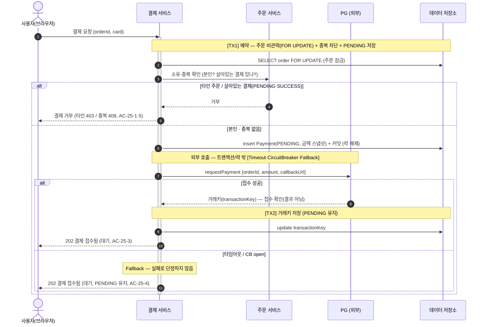
```mermaid
sequenceDiagram
    autonumber
    actor U as 사용자(브라우저)
    participant Pay as 결제 서비스
    participant O as 주문 서비스
    participant PG as PG (외부)
    participant DB as 데이터 저장소

    U->>Pay: 결제 요청 {orderId, card}
    activate Pay
    Note over Pay,DB: [TX1] 예약 — 주문 비관락(FOR UPDATE) + 중복 차단 + PENDING 저장
    Pay->>DB: SELECT order FOR UPDATE (주문 잠금)
    Pay->>O: 소유·중복 확인 (본인? 살아있는 결제 있나?)
    alt 타인 주문 / 살아있는 결제(PENDING·SUCCESS)
        O-->>Pay: 거부
        Pay-->>U: 결제 거부 (타인 403 / 중복 409, AC-25-1·5)
    else 본인 · 중복 없음
        Pay->>DB: insert Payment(PENDING, 금액 스냅샷) + 커밋 (락 해제)
        Note over Pay,PG: 외부 호출 — 트랜잭션/락 밖 [Timeout·CircuitBreaker·Fallback]
        Pay->>PG: requestPayment {orderId, amount, callbackUrl}
        alt 접수 성공
            PG-->>Pay: 거래키(transactionKey) — 접수 확인(결과 아님)
            Note over Pay,DB: [TX2] 거래키 저장 (PENDING 유지)
            Pay->>DB: update transactionKey
            Pay-->>U: 202 결제 접수됨 (대기, AC-25-3)
        else 타임아웃 / CB open
            Note over Pay: Fallback — 실패로 단정하지 않음
            Pay-->>U: 202 결제 접수됨 (대기, PENDING 유지, AC-25-4)
        end
    end
    deactivate Pay
```

**해석** — 결제를 **먼저 `PENDING`으로 커밋**하는 이유는 두 가지다. ① 외부 호출을 트랜잭션 밖으로 빼 커넥션·락이 PG 응답 시간에 묶이지 않게 하고(자원 보호), ② 이후 콜백/정산이 **매칭할 대상이 항상 존재**하게 한다(dual-write 안전 순서). 따닥(동시 결제)은 **주문 행 비관락(FOR UPDATE)으로 직렬화**한다 — `if 존재? 차단 : 생성`(read-then-write)은 동시 더블클릭이 둘 다 "없음"을 읽는 창이 있으나, 예약 트랜잭션이 주문 행을 먼저 잡아 **검사+삽입을 한 번에** 처리하므로 패자는 승자가 커밋한 `PENDING`을 보고 `CONFLICT`가 된다(차단 기준은 SUCCESS만이 아니라 **살아있는 시도(PENDING·SUCCESS)** — 결과가 콜백으로 뒤늦게 찍히기 전에 막아야 PG 이중 청구를 차단할 수 있다). 락은 검사+삽입에만 걸고 **PG 호출 전에 해제**한다(외부 호출을 락 안에 품지 않음). PG 응답은 **접수 확인일 뿐 결과가 아니라서**, 접수돼도 `PENDING`을 유지하고, 타임아웃·차단도 실패가 아니라 `PENDING`으로 둔다(타임아웃=모름).

> **요청 타임아웃 ≠ 처리 대기** — 요청 타임아웃은 *접수*까지만 짧게 잡는다(요청지연 상한 + 여유). 카드 *처리* 지연은 타임아웃 대상이 아니라 콜백/정산으로 기다린다 — 이 둘을 섞어 타임아웃을 길게 잡으면 스레드를 처리 시간만큼 점유한다.
> **재결제(AC-25-6)** — 4-2에서 결제가 `FAILED`로 끝나도 주문은 `CREATED`다. `FAILED`는 "살아있는 시도"가 아니므로 예약의 중복 가드를 통과하고, 사용자가 카드를 바꿔 다시 요청하면 이 흐름을 그대로 타며 **새 Payment(시도)** 가 생긴다(재고·쿠폰은 주문에 묶여 재차감 없음). 반대로 직전 시도가 `PENDING`(in-doubt 포함)으로 살아있으면 차단된다 — 청구 여부를 모르는 채 병렬 시도를 허용하지 않는다.

### 4-2. 결제 결과 확정 — 콜백 (US-27) · 폴링 (US-26)

결과는 **두 개의 독립 채널**로 다뤄진다. **콜백**(PG→서버)이 결제·주문 상태를 *확정*하고, **폴링**(브라우저→서버)은 그 확정된 상태를 *읽어* 화면을 갱신한다. 브라우저는 콜백을 직접 받을 수 없다(콜백은 서버로 온다).

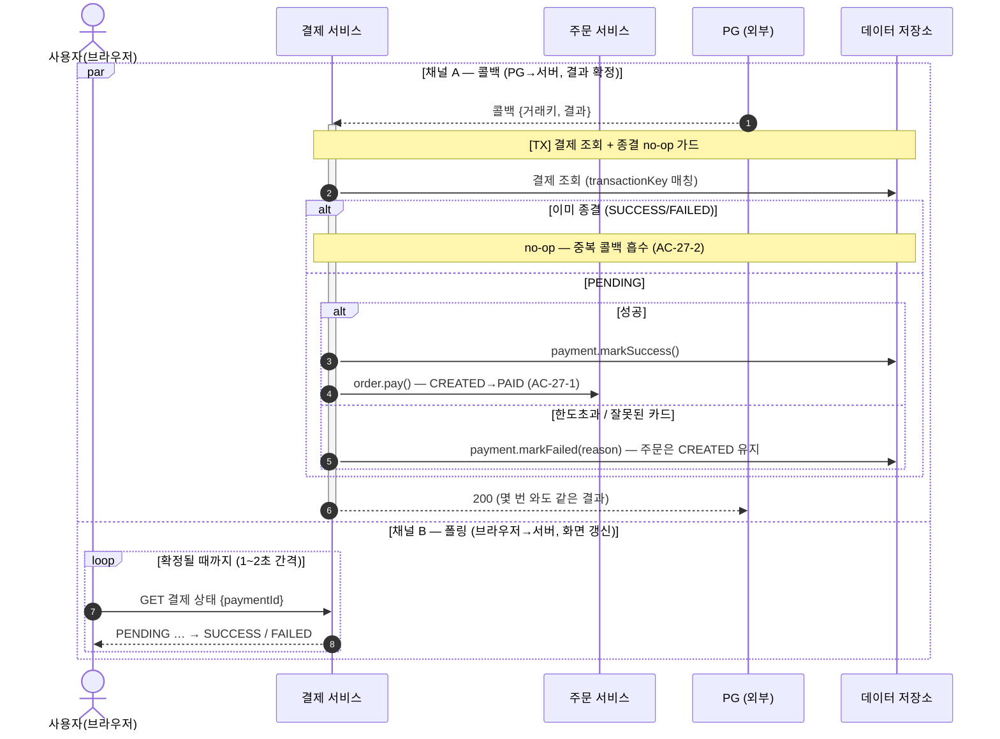
```mermaid
sequenceDiagram
    autonumber
    actor U as 사용자(브라우저)
    participant Pay as 결제 서비스
    participant O as 주문 서비스
    participant PG as PG (외부)
    participant DB as 데이터 저장소

    par 채널 A — 콜백 (PG→서버, 결과 확정)
        PG-->>Pay: 콜백 {거래키, 결과}
        activate Pay
        Note over Pay,DB: [TX] 결제 조회 + 종결 no-op 가드
        Pay->>DB: 결제 조회 (transactionKey 매칭)
        alt 이미 종결 (SUCCESS/FAILED)
            Note over Pay,DB: no-op — 중복 콜백 흡수 (AC-27-2)
        else PENDING
            alt 성공
                Pay->>DB: payment.markSuccess()
                Pay->>O: order.pay() — CREATED→PAID (AC-27-1)
            else 한도초과 / 잘못된 카드
                Pay->>DB: payment.markFailed(reason) — 주문은 CREATED 유지
            end
        end
        Pay-->>PG: 200 (몇 번 와도 같은 결과)
        deactivate Pay
    and 채널 B — 폴링 (브라우저→서버, 화면 갱신)
        loop 확정될 때까지 (1~2초 간격)
            U->>Pay: GET 결제 상태 {paymentId}
            Pay-->>U: PENDING … → SUCCESS / FAILED
        end
    end
```

**해석** — **종결 no-op 가드**가 멱등의 핵심이다: 종결 상태(`SUCCESS`/`FAILED`)에서는 추가 콜백을 무시하고(no-op, AC-27-2), `PENDING`에서만 전이한다. 콜백과 정산(4-3)이 같은 결제를 동시에 종결시키려는 경쟁은 이 가드가 흡수한다 — `markSuccess()`/`markFailed()`가 종결 상태에서 전이를 무시(`false` 반환)하고, **전이가 실제 일어났을 때만** `order.pay()`를 호출하므로 같은 값으로의 동시 전이는 무해하다(AC-27-3). 지금은 `order.pay()`가 순수 상태 전이라 별도 락 없이 안전하지만, `PAID`에 적립·알림 같은 부작용이 붙으면 이중 실행 위험이 생기므로 그 시점에 낙관락(`@Version`)을 도입한다(**현재 미적용**). 브라우저는 콜백이 바꾼 **우리 DB 상태**를 폴링으로 읽을 뿐, PG를 직접 보지 않는다.

> **콜백 매칭 = transactionKey** — 현재 콜백/조회의 결제 매칭은 PG가 부여한 `transactionKey`로 한다. 요청 타임아웃으로 거래키 응답이 유실된 결제(in-doubt)는 이 매칭으로는 결과를 못 붙이므로, `orderId`를 상관키로 쓰는 매칭과 주문 기준 정산(reconcile-by-orderId)은 **후속 하드닝으로 남긴다(AC-27-4, 미구현)**.

### 4-3. 정산/복구 (US-28)

콜백이 오지 않아 오래 `PENDING`인 결제를, 시스템이 PG **상태 조회**로 확인해 정합성을 맞춘다(콜백 유실 안전망). 콜백과 **같은 전이 가드**를 적용해, 이미 종결된 건은 건너뛴다.

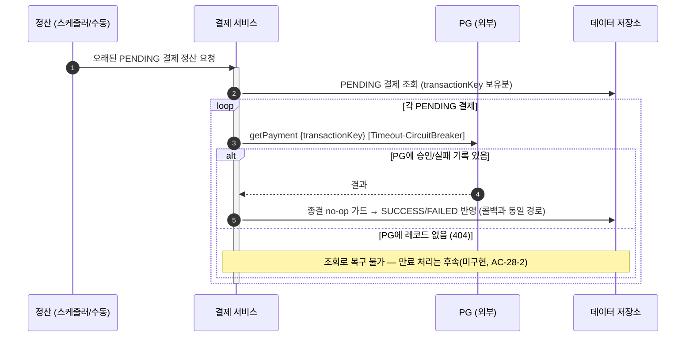
```mermaid
sequenceDiagram
    autonumber
    participant S as 정산 (스케줄러/수동)
    participant Pay as 결제 서비스
    participant PG as PG (외부)
    participant DB as 데이터 저장소

    S->>Pay: 오래된 PENDING 결제 정산 요청
    activate Pay
    Pay->>DB: PENDING 결제 조회 (transactionKey 보유분)
    loop 각 PENDING 결제
        Pay->>PG: getPayment {transactionKey} [Timeout·CircuitBreaker]
        alt PG에 승인/실패 기록 있음
            PG-->>Pay: 결과
            Pay->>DB: 종결 no-op 가드 → SUCCESS/FAILED 반영 (콜백과 동일 경로)
        else PG에 레코드 없음 (404)
            Note over Pay,DB: 조회로 복구 불가 — 만료 처리는 후속(미구현, AC-28-2)
        end
    end
    deactivate Pay
```

**해석** — 정산은 "콜백을 못 받아도 살아남기" 위한 이중화다. 현재 구현은 **transactionKey를 보유한 PENDING 결제**를 PG에 되물어, 승인/실패 기록이 있으면 콜백과 같은 종결 no-op 가드로 반영해 영구 `PENDING`을 막는다. 정산의 PG 조회도 외부 호출이라 Timeout·CircuitBreaker를 동일하게 적용한다.

> **후속(미구현)** — ① 거래키가 없는 PENDING(요청 타임아웃으로 응답 유실된 in-doubt, 또는 미접수)은 키가 없어 위 경로로 복구할 수 없다 → `orderId` 기준 PG 조회(reconcile-by-orderId)가 필요하다. ② "조회 불가 + 시간 경과 → 시도 만료" 처리도 아직 없다(AC-28-2). pg-simulator는 `findByOrderId`를 제공하므로 ①의 복구 핸들은 존재한다.

> **상태 어긋남 표(요약)** — 내부 결제 상태와 PG 실제 상태가 어긋나는 조합과 복구 주체:
> | 내부 | PG 실제 | 발생 경로 | 복구 |
> |---|---|---|---|
> | PENDING(키 보유) | 승인됨 | 콜백 유실 | 정산(transactionKey 조회) |
> | PENDING(키 없음) | 승인됨 | 요청 타임아웃(in-doubt) | orderId 조회 — 후속(미구현) |
> | PENDING | 레코드 없음 | 요청 미접수 | 만료·재시도 — 후속(미구현, AC-28-2) |
> | SUCCESS | 승인됨(콜백 2회) | at-least-once | 종결 no-op 가드 |
> | FAILED | 승인됨 | "타임아웃→실패" 단정 시 | **단정 안 함**으로 차단 |

## 5. 이벤트 기반 집계·전파 (Kafka) — Round 7

**시나리오 개요**

- **목적**: 확정된 사실(좋아요·결제성공·조회)을 부가 효과(지표 집계)로 **비동기 전파**한다. 주요 흐름은 동기 유지, 집계는 다른 앱(`commerce-streamer`)이 소유하는 read model(`product_metrics`)에 eventual 반영.
- **선행조건**: 각 주요 트랜잭션(좋아요/결제/조회)이 성립.
- **관련 요구사항**: US-29 ~ US-33.

**참여자**

| 약어 | 정식명 | 역할 |
|------|--------|------|
| U | 사용자 | 좋아요/결제/조회를 일으키는 주체 |
| A | 주요 서비스 (commerce-api) | 좋아요/결제/조회 처리 + 도메인 이벤트 발행 |
| OB | Outbox (api) | BEFORE_COMMIT 리스너로 전파 기록 적재 + relay 폴링 발행 |
| K | Kafka | `catalog-events` / `order-events` 토픽(+ `.DLT`) |
| MC | 지표 collector (commerce-streamer) | 이벤트 소비 → 멱등 판정 → `product_metrics` 집계 |
| DB | api DB | 도메인 상태 + `outbox_events` |
| MDB | streamer read model | `product_metrics` + `event_handled` |

> **경계** — 모든 전파 정합성의 뿌리는 **DB 커밋 지점과 메시지 발행 지점의 순서**다(결제의 "외부 호출 vs 커밋 순서"와 같은 뿌리). 상태 변경이 있는 전파는 **outbox에 같은 트랜잭션으로 적재**한 뒤 relay가 발행하고(유실 0), 상태 변경이 없는 전파(조회수)는 **커밋 후 직접 발행**한다(내구성 불필요).

### 5-1. 좋아요 → 지표 집계 (Step 1 경계 + Step 2 outbox 전 구간)

좋아요는 **주요(좋아요 행 저장)** 와 **부가(집계·전파 이벤트)** 로 갈린다. 좋아요 트랜잭션은 **좋아요 행 저장 + 이벤트 발행**만 하고, `like_count` 증감은 하지 않는다. BEFORE_COMMIT 리스너가 **같은 트랜잭션에** outbox 행을 적재한 뒤(상태변경↔전파기록 원자성) 커밋되면, 같은 이벤트를 **두 소비자**가 듣는다 — ① **`@Async` AFTER_COMMIT 리스너**가 `products.like_count`를 원자 UPDATE(**로컬·best-effort**, 정렬용), ② **relay**가 outbox를 Kafka로 밀어 collector가 멱등 판정 후 `product_metrics`에 반영(**크로스앱·guaranteed**).

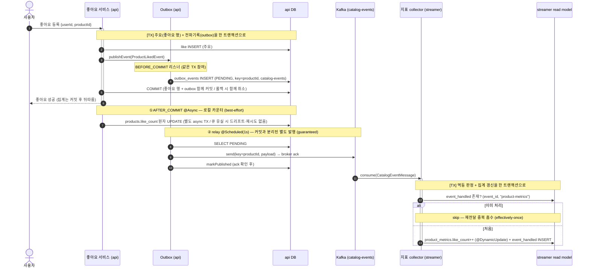
```mermaid
sequenceDiagram
    autonumber
    actor U as 사용자
    participant A as 좋아요 서비스 (api)
    participant OB as Outbox (api)
    participant DB as api DB
    participant K as Kafka (catalog-events)
    participant MC as 지표 collector (streamer)
    participant MDB as streamer read model

    U->>A: 좋아요 등록 {userId, productId}
    activate A
    Note over A,DB: [TX] 주요(좋아요 행) + 전파기록(outbox)을 한 트랜잭션으로
    A->>DB: like INSERT (주요)
    A->>OB: publishEvent(ProductLikedEvent)
    Note over OB: BEFORE_COMMIT 리스너 (같은 TX 참여)
    OB->>DB: outbox_events INSERT (PENDING, key=productId, catalog-events)
    A->>DB: COMMIT (좋아요 행 + outbox 함께 커밋 / 롤백 시 함께 취소)
    A-->>U: 좋아요 성공 (집계는 커밋 후 뒤따름)
    deactivate A

    Note over A,DB: ① AFTER_COMMIT @Async — 로컬 카운터 (best-effort)
    A->>DB: products.like_count 원자 UPDATE (별도 async TX / 큐 유실 시 드리프트·재시도 없음)

    Note over OB,K: ② relay @Scheduled(1s) — 커밋과 분리된 별도 발행 (guaranteed)
    OB->>DB: SELECT PENDING
    OB->>K: send(key=productId, payload) → broker ack
    OB->>DB: markPublished (ack 확인 후)
    K->>MC: consume(CatalogEventMessage)
    activate MC
    Note over MC,MDB: [TX] 멱등 판정 + 집계 갱신을 한 트랜잭션으로
    MC->>MDB: event_handled 존재? (event_id, "product-metrics")
    alt 이미 처리
        Note over MC,MDB: skip — 재전달 중복 흡수 (effectively-once)
    else 처음
        MC->>MDB: product_metrics.like_count++ (@DynamicUpdate) + event_handled INSERT
    end
    deactivate MC
```

**해석** — 세 개의 트랜잭션 경계가 핵심이다. ① **주요(좋아요 행)+전파기록(outbox)** 을 한 TX로 묶어 dual-write를 없앤다 — 좋아요 행과 outbox가 함께 커밋/롤백되므로 "좋아요는 됐는데 전파 기록이 없다"가 구조적으로 불가능하다(BEFORE_COMMIT이라 발행 TX에 참여, AFTER_COMMIT이면 별도 TX가 되어 다시 dual-write). ② **relay는 별도**다 — 발행 실패해도 PENDING으로 남아 재시도하므로 유실이 없다(broker ack 확인 후에만 PUBLISHED). ③ **소비도 멱등 판정+집계를 한 TX**로 묶어, 재전달(at-least-once)이 와도 한 번만 반영한다(`event_handled` 원장). 같은 이벤트를 듣는 두 카운터 — `products.like_count`(**로컬·best-effort·저지연**, `@Async` 큐 유실 시 드리프트·재시도 없음)와 `product_metrics.like_count`(**크로스앱·guaranteed**, outbox+멱등으로 유실 0) — 의 **의도적 중복**은 소비처와 보장 수준이 달라서다(정렬은 작은 드리프트 허용, 분석은 정확). 둘 다 eventual이며, `like_count`는 **동기 즉시 반영이 아니라** 커밋 뒤 비동기로 뒤따른다.

> **부가 리스너(Step 1)** — 알림·행동 로깅은 위 그림과 별개로 **AFTER_COMMIT**에 듣는다(커밋된 뒤에만 실행, 롤백이면 미발화). 지표 집계 이벤트를 outbox로 보내는 것과 달리, 알림/로깅은 커밋 후 처리로 충분해 phase를 나눈다.
> **순서·동시성** — `key=productId`라 같은 상품 이벤트는 같은 파티션→단일 소비자 스레드→순차 처리다. `find→증감→save`에 락이 필요 없다(파티션 직렬화 = 동시성 제어).

### 5-2. 결제 성공 → 판매량 집계 (상품별 분해)

판매량은 "결제 성공" 기준이다. 결제 성공 확정(`order.pay()`) 트랜잭션에서 `PaymentCompletedEvent`(주문 단위, 얇음)를 발행하면, outbox 리스너가 **같은 TX에서 주문을 재조회해 상품별로 분해**한다 — 상품이 N개면 `order-events` 행 N개(각 `key=productId`, 수량 포함).

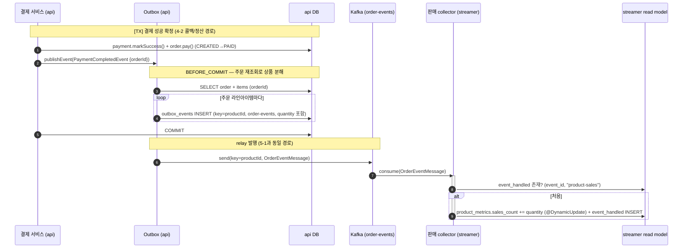
```mermaid
sequenceDiagram
    autonumber
    participant Pay as 결제 서비스 (api)
    participant OB as Outbox (api)
    participant DB as api DB
    participant K as Kafka (order-events)
    participant SC as 판매 collector (streamer)
    participant MDB as streamer read model

    Note over Pay,DB: [TX] 결제 성공 확정 (4-2 콜백/정산 경로)
    Pay->>DB: payment.markSuccess() + order.pay() (CREATED→PAID)
    Pay->>OB: publishEvent(PaymentCompletedEvent {orderId})
    Note over OB,DB: BEFORE_COMMIT — 주문 재조회로 상품 분해
    OB->>DB: SELECT order + items (orderId)
    loop 주문 라인아이템마다
        OB->>DB: outbox_events INSERT (key=productId, order-events, quantity 포함)
    end
    Pay->>DB: COMMIT

    Note over OB,K: relay 발행 (5-1과 동일 경로)
    OB->>K: send(key=productId, OrderEventMessage)
    K->>SC: consume(OrderEventMessage)
    activate SC
    SC->>MDB: event_handled 존재? (event_id, "product-sales")
    alt 처음
        SC->>MDB: product_metrics.sales_count += quantity (@DynamicUpdate) + event_handled INSERT
    end
    deactivate SC
```

**해석** — 두 가지 설계 선택이 겹친다. ① **페이로드 조립은 outbox의 책임**: 이벤트는 `orderId`만 담아 얇게 두고, 상품 분해(재조회→라인아이템)는 BEFORE_COMMIT 리스너가 한다 — `PaymentCompletedEvent`를 알림·로깅도 듣기 때문에 items로 오염시키지 않는다(같은 TX PK 조회라 저렴). ② **상품별 productId-키 메시지로 분해**: `product_metrics`의 무락 집계는 "같은 productId=단일 writer"에 기대므로, 결제 1건도 상품별로 쪼개 각 `key=productId`로 보내야 파티션 직렬화가 유지된다(`orderId`로 묶으면 서로 다른 주문이 같은 상품을 동시 증분 → lost update).

> **다중 writer 방어** — 좋아요/조회는 `product-metrics` collector가, 판매는 `product-sales` collector가 같은 `product_metrics` 행을 건드린다(다른 스레드). 각 카운터는 파티션 직렬화로 단일 writer지만 행은 다중 writer라, **`@DynamicUpdate`로 변경 컬럼만 UPDATE**(like_count vs sales_count)해 교차 lost update를 막는다. 멱등 원장의 handler도 collector별로 달라(`product-metrics` / `product-sales`) 멱등 스코프가 분리된다.

### 5-3. 상품 조회 → 조회수 (직접 발행, 유실 허용)

조회는 **읽기**라 DB 상태 변경이 없고, 캐시 히트 경로는 트랜잭션도 없다(커넥션 선점 회피). outbox에 묶을 대상이 없으므로 **커밋 후 직접 발행**한다(내구성 대신 성능). 발행 실패는 삼켜서 조회 응답을 막지 않는다.

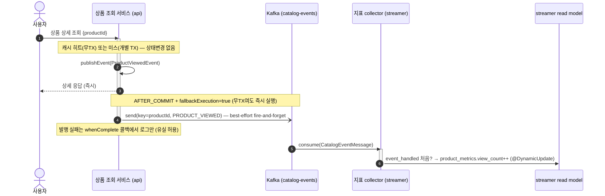
```mermaid
sequenceDiagram
    autonumber
    actor U as 사용자
    participant P as 상품 조회 서비스 (api)
    participant K as Kafka (catalog-events)
    participant MC as 지표 collector (streamer)
    participant MDB as streamer read model

    U->>P: 상품 상세 조회 {productId}
    activate P
    Note over P: 캐시 히트(무TX) 또는 미스(개별 TX) — 상태변경 없음
    P->>P: publishEvent(ProductViewedEvent)
    P-->>U: 상세 응답 (즉시)
    Note over P,K: AFTER_COMMIT + fallbackExecution=true (무TX여도 즉시 실행)
    P-)K: send(key=productId, PRODUCT_VIEWED) — best-effort fire-and-forget
    Note over P: 발행 실패는 whenComplete 콜백에서 로그만 (유실 허용)
    deactivate P

    K->>MC: consume(CatalogEventMessage)
    activate MC
    MC->>MDB: event_handled 처음? → product_metrics.view_count++ (@DynamicUpdate)
    deactivate MC
```

**해석** — 조회수만 outbox를 쓰지 않는 게 핵심 결정이다. **outbox는 "상태변경에 종속된 전파" 전용 도구**이므로, 상태변경이 없는 조회는 outbox가 줄 게 없다(원자성으로 묶을 대상 부재). 게다가 캐시 히트는 성능을 위해 트랜잭션을 열지 않아 커밋 후 처리(AFTER_COMMIT)가 성립하지 않으므로 **`fallbackExecution=true`** 로 무TX에서도 즉시 발행한다. 조회수는 유실 허용 분석 지표라 **best-effort fire-and-forget**으로 보낸다 — `send()`는 비동기라 broker ack 실패가 반환 future 로만 오므로, "실패는 로그만"을 정확히 지키려면 **`whenComplete` 완료 콜백에서 로깅**한다(직렬화 실패 같은 동기 예외는 발행 전에 잡아 건너뜀). 어느 실패든 조회 응답을 막지 않는다 — 좋아요/판매(내구 outbox)와 급을 달리한 의도적 선택이다. 소비 쪽은 `catalog-events`를 그대로 태워 기존 collector가 `view_count`만 추가로 올린다.

### 5-4. 실패 격리 (DLQ) — 공통

collector가 한 메시지 처리에 실패하면 offset을 커밋하지 않아 재전달된다. 아무 장치가 없으면 poison(반드시 실패하는 메시지)이 파티션을 영구 정지시키므로, **재시도 후 DLQ 격리**로 파이프를 지킨다.

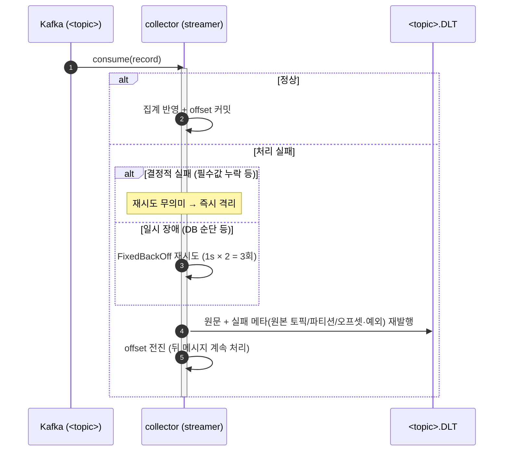
```mermaid
sequenceDiagram
    autonumber
    participant K as Kafka (<topic>)
    participant MC as collector (streamer)
    participant DLT as <topic>.DLT

    K->>MC: consume(record)
    activate MC
    alt 정상
        MC->>MC: 집계 반영 + offset 커밋
    else 처리 실패
        alt 결정적 실패 (필수값 누락 등)
            Note over MC: 재시도 무의미 → 즉시 격리
        else 일시 장애 (DB 순단 등)
            MC->>MC: FixedBackOff 재시도 (1s × 2 = 3회)
        end
        MC->>DLT: 원문 + 실패 메타(원본 토픽/파티션/오프셋·예외) 재발행
        MC->>MC: offset 전진 (뒤 메시지 계속 처리)
    end
    deactivate MC
```

**해석** — 두 축으로 실패를 가른다. **시간축**: 일시 장애는 backoff 재시도로 흡수하고, 소진되면 격리. **타입축**: 결정적 실패(필수값 null 등 `IllegalArgumentException` 계열, 역직렬화 불가)는 재시도해도 반드시 실패하므로 재시도 없이 즉시 DLQ로 보낸다 — 결제의 "확정 실패 vs in-doubt"와 같은 렌즈다. 격리는 **원문+실패 메타**를 보존해(DLQ는 버리는 곳이 아니라 재처리소) 운영자가 원인을 확인·재처리할 수 있고, offset을 전진시켜 poison이 파티션을 막지 않게 한다. DLT 목적지는 `원본토픽 + ".DLT"` 로 소스별 분기되어 `catalog`·`order` collector가 에러 핸들러를 공유해도 격리가 뒤섞이지 않는다.

---

## 6. 선착순 쿠폰 발급 (commerce-streamer · 조건부 원자 UPDATE) — Round 7 Step 3

**시나리오 개요**

- **목적**: 수량이 한정된 쿠폰을 폭주하는 요청 속에서도 **한도까지만** 발급한다. `commerce-api`가 요청을 접수·발행하고, **`commerce-streamer`가 소비**해 발급 슬롯을 **조건부 원자 UPDATE**(`issued_count < issue_limit`)로 확보한다.
- **선행조건**: 로그인 상태, 한도(`issueLimit`)가 설정된 템플릿 존재.
- **관련 요구사항**: US-34 (AC-34-1 ~ AC-34-7).

**참여자**

| 약어 | 정식명 | 역할 |
|------|--------|------|
| U | 사용자 | 발급을 요청하고, `requestId`로 결과를 **폴링**한다 |
| A | 쿠폰 접수 (commerce-api) | 요청을 `PENDING` 저장 + outbox 적재(한 트랜잭션), `requestId` 반환. 폴링 응답(소유자 검증) |
| OB | Outbox + Relay (api) | `coupon-issue-requests` 로 `key=templateId` 발행 |
| K | Kafka | `coupon-issue-requests` 토픽(+ `.DLT`) |
| CC | 발급 소비자 (commerce-streamer) | JdbcTemplate 로 멱등·중복·한도(원자 UPDATE)·발급, manual ack |
| DB | shared MySQL | `coupon_templates` · `coupon_issue_requests` · `user_coupons` (api 소유, streamer 도 씀) |

> **경계** — 발급 소비자는 **`commerce-streamer`가 호스팅**한다(Kafka consumer 앱이 실제로 처리 = 과제 요건). streamer 는 쿠폰 도메인(엔티티·불변식)을 복제하지 않고, 발급이 필요로 하는 최소 쿼리만 **JdbcTemplate 으로 같은 MySQL(shared DB)** 에 실행한다. 대가는 발급 규칙(스냅샷·만료·한도)이 SQL 로 재표현되어 api 의 `UserCoupon.issue()`/`CouponTemplate` 불변식과 **드리프트**할 수 있다는 것(컴파일러 미검출) + `user_coupons` write 소유권이 두 앱에 걸친다는 것. 그 대신 한도 강제는 조건부 원자 UPDATE 라 소비 위치와 무관하게 안전하다.

### 6-1. 요청 접수 → 발급 처리 → 폴링

접수는 요청 행(`PENDING`)과 outbox를 **한 트랜잭션**으로 저장하고 `requestId`를 즉시 돌려준다(US-31 원자성). relay가 `key=templateId`로 발행하면 한 템플릿의 요청이 한 파티션에 모여 streamer 소비자가 순차 처리한다. 소비자는 **요청 상태로 멱등 판정** 후, 처리 대상(`userId`·`templateId`)을 **메시지가 아니라 DB 요청 행**을 진실로 삼아 중복→한도(조건부 원자 UPDATE)→발급 순으로 결과를 확정한다.

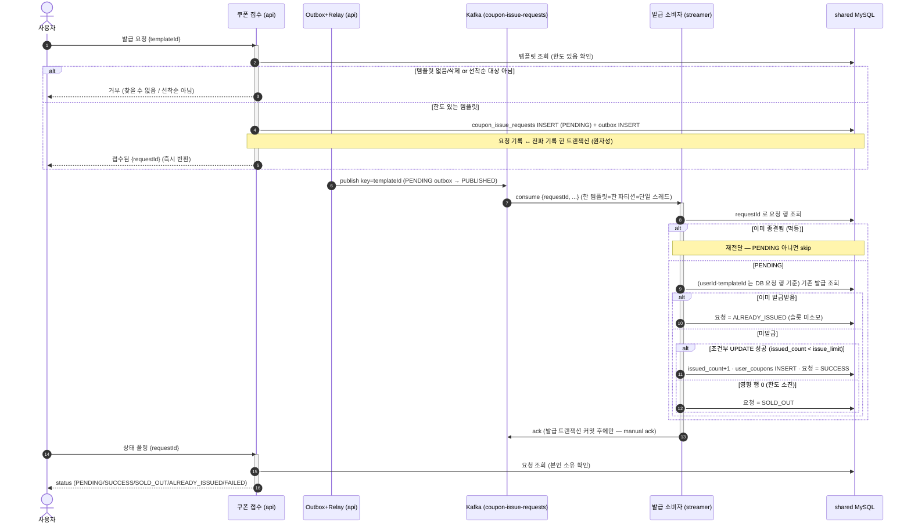
```mermaid
sequenceDiagram
    autonumber
    actor U as 사용자
    participant A as 쿠폰 접수 (api)
    participant OB as Outbox+Relay (api)
    participant K as Kafka (coupon-issue-requests)
    participant CC as 발급 소비자 (streamer)
    participant DB as shared MySQL

    U->>A: 발급 요청 {templateId}
    activate A
    A->>DB: 템플릿 조회 (한도 있음 확인)
    alt 템플릿 없음/삭제 or 선착순 대상 아님
        A-->>U: 거부 (찾을 수 없음 / 선착순 아님)
    else 한도 있는 템플릿
        A->>DB: coupon_issue_requests INSERT (PENDING) + outbox INSERT
        Note over A,DB: 요청 기록 ↔ 전파 기록 한 트랜잭션 (원자성)
        A-->>U: 접수됨 {requestId} (즉시 반환)
    end
    deactivate A

    OB->>K: publish key=templateId (PENDING outbox → PUBLISHED)
    K->>CC: consume {requestId, ...} (한 템플릿=한 파티션=단일 스레드)
    activate CC
    CC->>DB: requestId 로 요청 행 조회
    alt 이미 종결됨 (멱등)
        Note over CC,DB: 재전달 — PENDING 아니면 skip
    else PENDING
        CC->>DB: (userId·templateId 는 DB 요청 행 기준) 기존 발급 조회
        alt 이미 발급받음
            CC->>DB: 요청 = ALREADY_ISSUED (슬롯 미소모)
        else 미발급
            alt 조건부 UPDATE 성공 (issued_count < issue_limit)
                CC->>DB: issued_count+1 · user_coupons INSERT · 요청 = SUCCESS
            else 영향 행 0 (한도 소진)
                CC->>DB: 요청 = SOLD_OUT
            end
        end
    end
    CC->>K: ack (발급 트랜잭션 커밋 후에만 — manual ack)
    deactivate CC

    U->>A: 상태 폴링 {requestId}
    activate A
    A->>DB: 요청 조회 (본인 소유 확인)
    A-->>U: status (PENDING/SUCCESS/SOLD_OUT/ALREADY_ISSUED/FAILED)
    deactivate A
```

**해석** — 세 겹의 안전장치가 겹친다. ① **접수의 원자성**: 요청과 outbox가 한 트랜잭션이라 "접수됐는데 발행 안 됨"이 없다(US-31). ② **조건부 원자 UPDATE**: 한도 강제는 `UPDATE ... SET issued_count = issued_count + 1 WHERE issued_count < issue_limit`의 영향 행 수로 판정한다(AC-34-3) — 재고 차감과 같은 패턴이라 파티션 직렬화(순서·멱등을 돕는 `key=templateId`)가 없어도 초과 발급이 불가능하다. ③ **멱등 + DB 진실**: 요청 상태가 `PENDING`일 때만 처리하고(재전달 흡수, AC-34-5), 처리 대상을 외부 경계인 메시지가 아니라 DB 요청 행에서 읽어 "요청과 발급 결과가 갈리는" 무결성 균열을 원천 차단한다. `ack`는 발급 트랜잭션이 커밋된 뒤에만 호출하므로(manual ack), 처리 중 장애가 나면 오프셋이 전진하지 않아 재시도→DLQ로 흐른다(성공 시에만 전진 = at-least-once). 결정적 실패(템플릿 삭제/무제한)만 `FAILED`로 확정하고 일시 장애는 상태를 남기지 않는다(AC-34-7). 중복 방지의 최후 방어선은 `user_coupons (user_id, template_id)` 유니크다(US-19와 공유). 발급 규칙(스냅샷·만료·한도)은 streamer JdbcTemplate SQL 에 재표현되므로, api 의 `UserCoupon.issue()`가 바뀌면 이 SQL 도 함께 맞춰야 한다(shared DB 분리의 대가).

---

## 7. 주문 대기열 — 진입 → 순번 폴링 → 입장 토큰 → 주문 게이트 (Round 8)

**시나리오 개요**

- **목적**: 폭증 트래픽에서 주문 API 하류(커넥션 풀·재고 핫로우)를 보호하기 위해, 유저를 Redis 대기열에 줄 세우고 **하류가 감당할 속도로만** 입장 토큰을 발급해 주문을 허용한다.
- **선행조건**: 로그인 상태, `queue.enabled=true` (행사 중).
- **관련 요구사항**: US-35 ~ US-37 (AC-35-1 ~ AC-37-6).

**참여자**

| 약어 | 정식명 | 역할 |
|------|--------|------|
| U | 사용자 | 대기열 진입·순번 폴링 후 토큰으로 주문하는 로그인 사용자 |
| Q | 대기열 서비스 (api) | 진입(멱등)·순번/예상 대기·동적 폴링 간격 응답, 토큰 보유자 처리 |
| S | 토큰 발급 스케줄러 (api) | 주기(100ms)마다 대기열 앞 N명을 꺼내 토큰 발급 |
| G | 주문 게이트 (인터셉터) | 주문 요청의 토큰 검증(전처리)·소진(후처리). 주문 도메인은 대기열을 모른다 |
| O | 주문 서비스 | 기존 주문 생성 흐름(1번 시퀀스) — 무변경 |
| R | Redis (master) | `waiting-queue` ZSET + `entry-token:{userId}` TTL 키 |

> **경계** — 대기열·토큰 연산은 전부 **Redis master** 로 고정한다(기본 커넥션은 replica 우선 — `ZADD` 직후 `ZRANK` 가 복제 지연으로 "없음"을 반환할 수 있다). 토큰 검증은 **HandlerInterceptor** 에 격리해 주문 도메인·응용 레이어가 대기열의 존재를 모르게 한다 — 트래픽 제어는 유스케이스가 아니라 진입 지점의 관심사다.

### 7-1. 진입 · 폴링 · 발급 · 게이트 전체 흐름

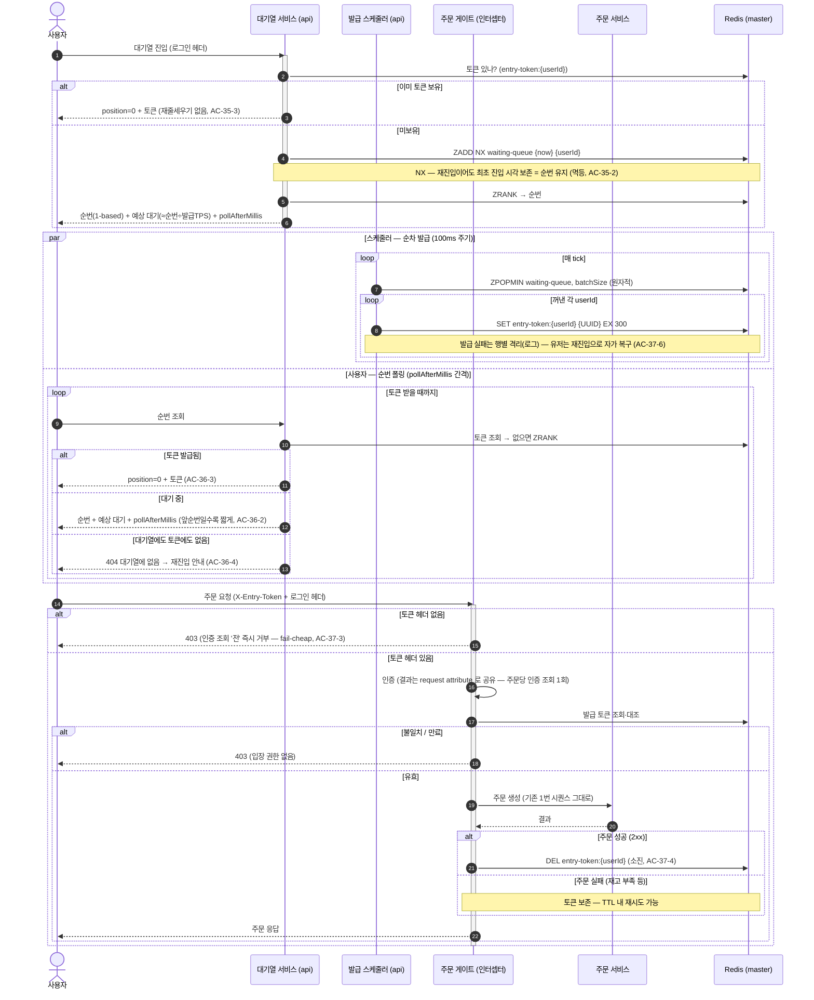
```mermaid
sequenceDiagram
    autonumber
    actor U as 사용자
    participant Q as 대기열 서비스 (api)
    participant S as 발급 스케줄러 (api)
    participant G as 주문 게이트 (인터셉터)
    participant O as 주문 서비스
    participant R as Redis (master)

    U->>Q: 대기열 진입 (로그인 헤더)
    activate Q
    Q->>R: 토큰 있나? (entry-token:{userId})
    alt 이미 토큰 보유
        Q-->>U: position=0 + 토큰 (재줄세우기 없음, AC-35-3)
    else 미보유
        Q->>R: ZADD NX waiting-queue {now} {userId}
        Note over Q,R: NX — 재진입이어도 최초 진입 시각 보존 = 순번 유지 (멱등, AC-35-2)
        Q->>R: ZRANK → 순번
        Q-->>U: 순번(1-based) + 예상 대기(≈순번÷발급TPS) + pollAfterMillis
    end
    deactivate Q

    par 스케줄러 — 순차 발급 (100ms 주기)
        loop 매 tick
            S->>R: ZPOPMIN waiting-queue, batchSize (원자적)
            loop 꺼낸 각 userId
                S->>R: SET entry-token:{userId} {UUID} EX 300
                Note over S,R: 발급 실패는 행별 격리(로그) — 유저는 재진입으로 자가 복구 (AC-37-6)
            end
        end
    and 사용자 — 순번 폴링 (pollAfterMillis 간격)
        loop 토큰 받을 때까지
            U->>Q: 순번 조회
            Q->>R: 토큰 조회 → 없으면 ZRANK
            alt 토큰 발급됨
                Q-->>U: position=0 + 토큰 (AC-36-3)
            else 대기 중
                Q-->>U: 순번 + 예상 대기 + pollAfterMillis (앞순번일수록 짧게, AC-36-2)
            else 대기열에도 토큰에도 없음
                Q-->>U: 404 대기열에 없음 → 재진입 안내 (AC-36-4)
            end
        end
    end

    U->>G: 주문 요청 (X-Entry-Token + 로그인 헤더)
    activate G
    alt 토큰 헤더 없음
        G-->>U: 403 (인증 조회 '전' 즉시 거부 — fail-cheap, AC-37-3)
    else 토큰 헤더 있음
        G->>G: 인증 (결과는 request attribute 로 공유 — 주문당 인증 조회 1회)
        G->>R: 발급 토큰 조회·대조
        alt 불일치 / 만료
            G-->>U: 403 (입장 권한 없음)
        else 유효
            G->>O: 주문 생성 (기존 1번 시퀀스 그대로)
            O-->>G: 결과
            alt 주문 성공 (2xx)
                G->>R: DEL entry-token:{userId} (소진, AC-37-4)
            else 주문 실패 (재고 부족 등)
                Note over G,R: 토큰 보존 — TTL 내 재시도 가능
            end
            G-->>U: 주문 응답
        end
    end
    deactivate G
```

**해석** — 대기열의 본질은 **발급 속도 = 주문 유입 TPS** 라는 등식이다. 스케줄러의 `ZPOPMIN`(원자적 배치 pop)이 하류에서 역산한 속도로만 토큰을 만들므로, 진입이 아무리 폭주해도 주문 API 에 도달하는 요청은 상한이 있다. 유입 폭주는 ZSET 삽입(O(log N))이 흡수하고, 하류는 발급 속도가 지킨다.

멱등·경합 처리가 세 군데 있다. ① **진입 멱등은 `ZADD NX`**: 대기 화면의 새로고침이 곧 재진입이므로, score(진입 시각)를 덮어쓰면 "새로고침하면 줄 맨 뒤로"가 된다 — NX 로 최초 진입 시각을 보존해야 멱등이 성립한다. ② **pop→토큰 SET 찰나의 조회**: 유저가 대기열에서 빠졌지만(pop) 토큰이 아직 저장되기 전에 순번을 조회하면 둘 다 "없음"이 될 수 있다 — 순번 조회는 토큰을 **이중 확인**해 이 창을 흡수하고, 그래도 없으면 404 로 재진입을 안내한다(유실 자가 복구 경로 겸용). ③ **토큰 소진은 주문 성공(2xx)에만**: 재고 부족·입력 오류로 실패한 유저의 토큰을 소진시키면 시스템 사정으로 줄을 다시 서야 한다 — afterCompletion 에서 응답 코드를 보고 성공에만 DEL 한다.

게이트의 순서도 의도적이다 — 토큰 헤더가 아예 없으면 **인증(DB 조회) 전에 즉시 403**: DB 를 보호하려는 관문이 무자격 요청에 인증 쿼리를 써 주면 모순이다(fail-cheap-first — 주문 생성의 "쿠폰 검증을 재고 락 앞에" 와 같은 렌즈). 토큰 검증을 위해 인터셉터가 인증하면 그 결과를 request attribute 로 공유해, 컨트롤러의 `@LoginUser` 리졸버가 같은 요청을 **다시 인증하지 않는다**(주문당 인증 조회 1회 유지).

네 번째 경합 지점 — **토큰 검증과 소진의 시점 분리**다. 검증(find+대조)은 아무것도 지우지 않고 소진(DEL)은 afterCompletion 이라, 같은 토큰의 동시 주문이 모두 검증을 통과해 "토큰 1장 = 주문 1건"이 깨질 수 있다(검사-사용 TOCTOU). 검증 통과 직후 `SETNX processing-token:{userId}` 로 유저당 in-flight 마크를 선점해 동시 2건째부터 409 로 막는다. 단순 "검증 시 즉시 DEL"이 못 쓰이는 이유는 그러면 주문 실패 시 토큰이 사라져 AC-37-4(실패 보존)와 충돌하기 때문 — 마크(선점/해제)와 토큰(성공 시에만 소진)을 분리해야 두 불변식이 양립한다. 해제·소진은 마크를 **선점한 요청만** 수행하고(request attribute 로 소유권 표시 — 거절된 동시 요청이 선행 요청의 마크를 지우지 않도록), 마크 TTL 은 크래시 시 자동 해제 안전망이다(정상 경로는 즉시 해제, 정확성 백스톱은 재고 핫로우 비관락). 마크 값은 요청마다 고유한 owner token 이라 해제가 **값 일치 시에만**(compare-and-delete, Lua) 일어난다 — TTL 만료로 다른 요청이 새 마크를 선점한 뒤 늦게 도착한 해제가 남의 마크를 지우는 "값으로 소유한 락" 문제를 막는다.

> **응답 코드 403** — "인증은 됐지만 입장 권한 없음" 시맨틱이다. 429 는 rate limit(재시도 시점 안내)의 표준 시맨틱이라 어긋나고, 401 은 인증 실패와 섞인다.
> **발급 간격** — 같은 발급 총량이라도 1s 일괄 발급은 그 인원이 동시에 주문을 때려 매초 스파이크를 재현한다(Thundering Herd). 100ms 분산 발급은 같은 총량을 10배 평탄하게 흘린다 — 실측으로 단일 핫로우 주문 p50 이 11배 갈렸다(비기능 요구사항 "트래픽 제어" 참조).
