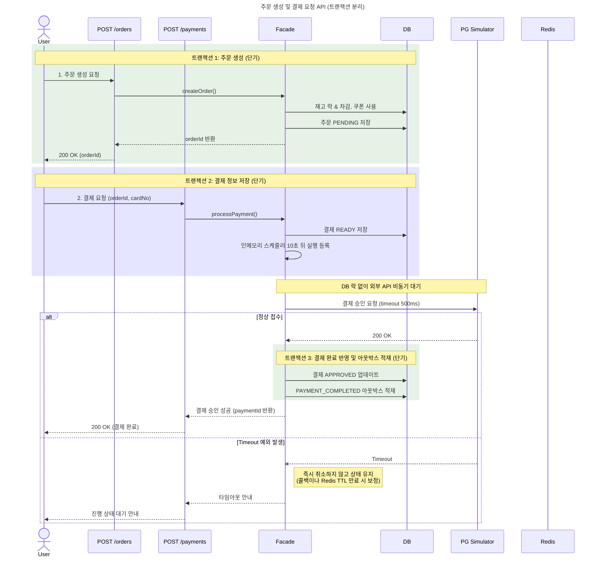
```mermaid
sequenceDiagram
    title 주문 생성 및 결제 요청 API (트랜잭션 분리)
    actor User
    participant OrderAPI as POST /orders
    participant PaymentAPI as POST /payments
    participant Facade as Facade
    participant DB
    participant PG as PG Simulator
    participant Redis

    %% 1단계: 주문 생성
    rect rgba(0, 128, 0, 0.1)
        Note over User, DB: 트랜잭션 1: 주문 생성 (단기)
        User->>OrderAPI: 1. 주문 생성 요청
        OrderAPI->>Facade: createOrder()
        Facade->>DB: 재고 락 & 차감, 쿠폰 사용
        Facade->>DB: 주문 PENDING 저장
        Facade-->>OrderAPI: orderId 반환
        OrderAPI-->>User: 200 OK (orderId)
    end

    %% 2단계: 결제 요청
    rect rgba(0, 0, 255, 0.1)
        Note over User, DB: 트랜잭션 2: 결제 정보 저장 (단기)
        User->>PaymentAPI: 2. 결제 요청 (orderId, cardNo)
        PaymentAPI->>Facade: processPayment()
        Facade->>DB: 결제 READY 저장
        Facade->>Facade: 인메모리 스케줄러 10초 뒤 실행 등록
    end
    
    Note over Facade, PG: DB 락 없이 외부 API 비동기 대기
    Facade->>PG: 결제 승인 요청 (timeout 500ms)
    
    alt 정상 접수
        PG-->>Facade: 200 OK
        rect rgba(0, 128, 0, 0.1)
            Note over Facade, DB: 트랜잭션 3: 결제 완료 반영 및 아웃박스 적재 (단기)
            Facade->>DB: 결제 APPROVED 업데이트
            Facade->>DB: PAYMENT_COMPLETED 아웃박스 적재
        end
        Facade-->>PaymentAPI: 결제 승인 성공 (paymentId 반환)
        PaymentAPI-->>User: 200 OK (결제 완료)
    else Timeout 예외 발생
        PG--xFacade: Timeout
        Note right of Facade: 즉시 취소하지 않고 상태 유지<br>(콜백이나 Redis TTL 만료 시 보정)
        Facade-->>PaymentAPI: 타임아웃 안내
        PaymentAPI-->>User: 진행 상태 대기 안내
    end
```

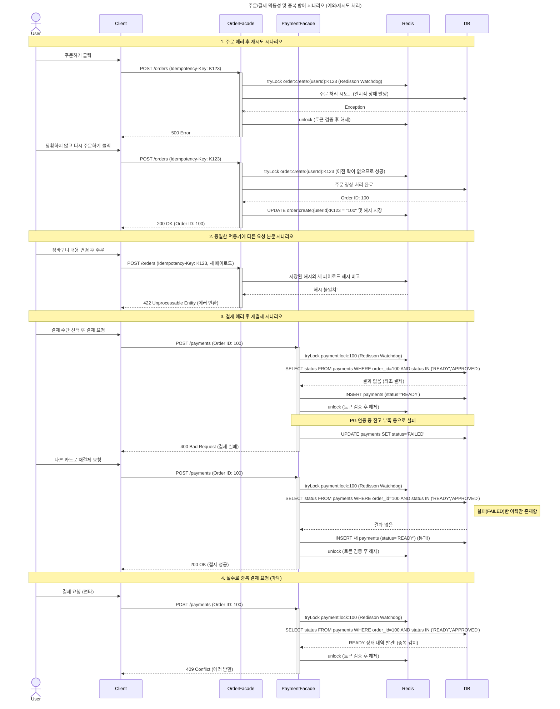
```mermaid
sequenceDiagram
    title 주문/결제 멱등성 및 중복 방어 시나리오 (예외/재시도 처리)
    actor User
    participant Client
    participant OrderFacade
    participant PaymentFacade
    participant Redis
    participant DB

    Note over User, DB: 1. 주문 에러 후 재시도 시나리오
    User->>Client: 주문하기 클릭
    Client->>OrderFacade: POST /orders (Idempotency-Key: K123)
    activate OrderFacade
    OrderFacade->>Redis: tryLock order:create:{userId}:K123 (Redisson Watchdog)
    OrderFacade->>DB: 주문 처리 시도... (일시적 장애 발생)
    DB--xOrderFacade: Exception
    OrderFacade->>Redis: unlock (토큰 검증 후 해제)
    OrderFacade-->>Client: 500 Error
    deactivate OrderFacade

    User->>Client: 당황하지 않고 다시 주문하기 클릭
    Client->>OrderFacade: POST /orders (Idempotency-Key: K123)
    activate OrderFacade
    OrderFacade->>Redis: tryLock order:create:{userId}:K123 (이전 락이 없으므로 성공)
    OrderFacade->>DB: 주문 정상 처리 완료
    DB-->>OrderFacade: Order ID: 100
    OrderFacade->>Redis: UPDATE order:create:{userId}:K123 = "100" 및 해시 저장
    OrderFacade-->>Client: 200 OK (Order ID: 100)
    deactivate OrderFacade

    Note over User, DB: 2. 동일한 멱등키에 다른 요청 본문 시나리오
    User->>Client: 장바구니 내용 변경 후 주문
    Client->>OrderFacade: POST /orders (Idempotency-Key: K123, 새 페이로드)
    activate OrderFacade
    OrderFacade->>Redis: 저장된 해시와 새 페이로드 해시 비교
    Redis-->>OrderFacade: 해시 불일치!
    OrderFacade-->>Client: 422 Unprocessable Entity (에러 반환)
    deactivate OrderFacade

    Note over User, DB: 3. 결제 에러 후 재결제 시나리오
    User->>Client: 결제 수단 선택 후 결제 요청
    Client->>PaymentFacade: POST /payments (Order ID: 100)
    activate PaymentFacade
    PaymentFacade->>Redis: tryLock payment:lock:100 (Redisson Watchdog)
    PaymentFacade->>DB: SELECT status FROM payments WHERE order_id=100 AND status IN ('READY','APPROVED')
    DB-->>PaymentFacade: 결과 없음 (최초 결제)
    PaymentFacade->>DB: INSERT payments (status='READY')
    PaymentFacade->>Redis: unlock (토큰 검증 후 해제)
    Note over PaymentFacade, DB: PG 연동 중 잔고 부족 등으로 실패
    PaymentFacade->>DB: UPDATE payments SET status='FAILED'
    PaymentFacade-->>Client: 400 Bad Request (결제 실패)
    deactivate PaymentFacade

    User->>Client: 다른 카드로 재결제 요청
    Client->>PaymentFacade: POST /payments (Order ID: 100)
    activate PaymentFacade
    PaymentFacade->>Redis: tryLock payment:lock:100 (Redisson Watchdog)
    PaymentFacade->>DB: SELECT status FROM payments WHERE order_id=100 AND status IN ('READY','APPROVED')
    Note right of DB: 실패(FAILED)한 이력만 존재함
    DB-->>PaymentFacade: 결과 없음
    PaymentFacade->>DB: INSERT 새 payments (status='READY') (통과!)
    PaymentFacade->>Redis: unlock (토큰 검증 후 해제)
    PaymentFacade-->>Client: 200 OK (결제 성공)
    deactivate PaymentFacade

    Note over User, DB: 4. 실수로 중복 결제 요청 (따닥)
    User->>Client: 결제 요청 (연타)
    Client->>PaymentFacade: POST /payments (Order ID: 100)
    activate PaymentFacade
    PaymentFacade->>Redis: tryLock payment:lock:100 (Redisson Watchdog)
    PaymentFacade->>DB: SELECT status FROM payments WHERE order_id=100 AND status IN ('READY','APPROVED')
    DB-->>PaymentFacade: READY 상태 내역 발견! (중복 감지)
    PaymentFacade->>Redis: unlock (토큰 검증 후 해제)
    PaymentFacade-->>Client: 409 Conflict (에러 반환)
    deactivate PaymentFacade
```

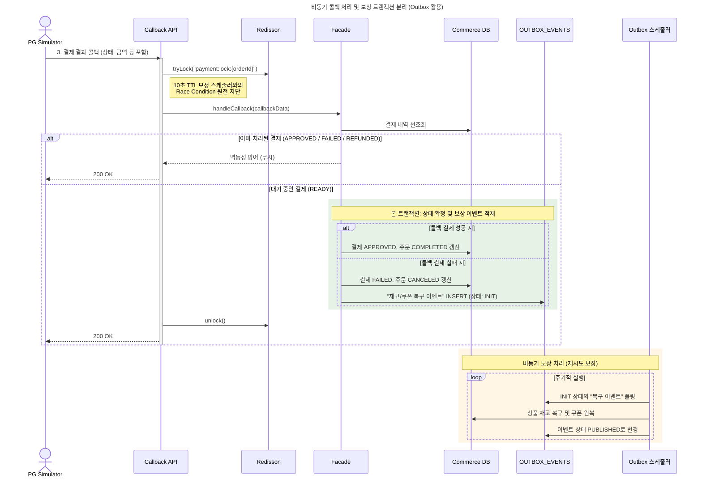
```mermaid
sequenceDiagram
    title 비동기 콜백 처리 및 보상 트랜잭션 분리 (Outbox 활용)
    actor PG as PG Simulator
    participant API as Callback API
    participant Lock as Redisson
    participant Facade as Facade
    participant DB as Commerce DB
    participant Outbox as OUTBOX_EVENTS
    participant Scheduler as Outbox 스케줄러

    PG->>API: 3. 결제 결과 콜백 (상태, 금액 등 포함)
    activate API

    API->>Lock: tryLock("payment:lock:{orderId}")
    Note right of API: 10초 TTL 보정 스케줄러와의<br>Race Condition 원천 차단
    
    API->>Facade: handleCallback(callbackData)
    Facade->>DB: 결제 내역 선조회
    
    alt 이미 처리된 결제 (APPROVED / FAILED / REFUNDED)
        Facade-->>API: 멱등성 방어 (무시)
        API-->>PG: 200 OK
    else 대기 중인 결제 (READY)
        rect rgba(0, 128, 0, 0.1)
            Note over Facade, Outbox: 본 트랜잭션: 상태 확정 및 보상 이벤트 적재
            alt 콜백 결제 성공 시
                Facade->>DB: 결제 APPROVED, 주문 COMPLETED 갱신
            else 콜백 결제 실패 시
                Facade->>DB: 결제 FAILED, 주문 CANCELED 갱신
                Facade->>Outbox: "재고/쿠폰 복구 이벤트" INSERT (상태: INIT)
            end
        end
        API->>Lock: unlock()
        API-->>PG: 200 OK
    end
    deactivate API

    rect rgba(255, 165, 0, 0.1)
        Note over Scheduler, DB: 비동기 보상 처리 (재시도 보장)
        loop 주기적 실행
            Scheduler->>Outbox: INIT 상태의 "복구 이벤트" 폴링
            Scheduler->>DB: 상품 재고 복구 및 쿠폰 원복
            Scheduler->>Outbox: 이벤트 상태 PUBLISHED로 변경
        end
    end
```

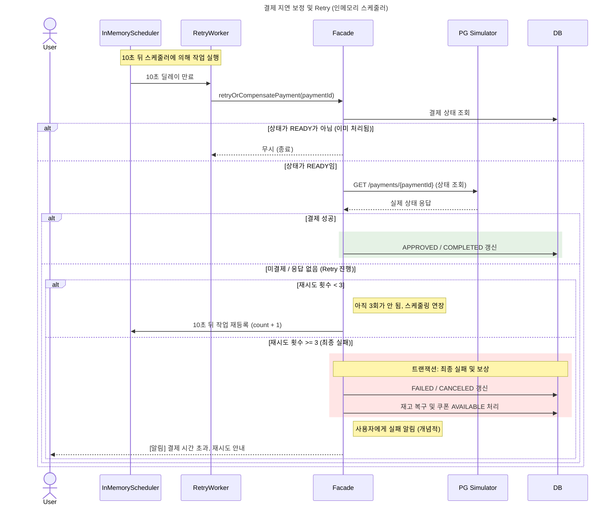
```mermaid
sequenceDiagram
    title 결제 지연 보정 및 Retry (인메모리 스케줄러)
    actor User
    participant Scheduler as InMemoryScheduler
    participant Worker as RetryWorker
    participant Facade as Facade
    participant PG as PG Simulator
    participant DB

    Note over Scheduler, Worker: 10초 뒤 스케줄러에 의해 작업 실행
    Scheduler->>Worker: 10초 딜레이 만료
    Worker->>Facade: retryOrCompensatePayment(paymentId)

    Facade->>DB: 결제 상태 조회
    alt 상태가 READY가 아님 (이미 처리됨)
        Facade-->>Worker: 무시 (종료)
    else 상태가 READY임
        Facade->>PG: GET /payments/{paymentId} (상태 조회)
        PG-->>Facade: 실제 상태 응답
        
        alt 결제 성공
            rect rgba(0, 128, 0, 0.1)
                Facade->>DB: APPROVED / COMPLETED 갱신
            end
        else 미결제 / 응답 없음 (Retry 진행)
            alt 재시도 횟수 < 3
                Note right of Facade: 아직 3회가 안 됨, 스케줄링 연장
                Facade->>Scheduler: 10초 뒤 작업 재등록 (count + 1)
            else 재시도 횟수 >= 3 (최종 실패)
                rect rgba(255, 0, 0, 0.1)
                    Note over Facade, DB: 트랜잭션: 최종 실패 및 보상
                    Facade->>DB: FAILED / CANCELED 갱신
                    Facade->>DB: 재고 복구 및 쿠폰 AVAILABLE 처리
                end
                Note right of Facade: 사용자에게 실패 알림 (개념적)
                Facade-->>User: [알림] 결제 시간 초과, 재시도 안내
            end
        end
    end
```

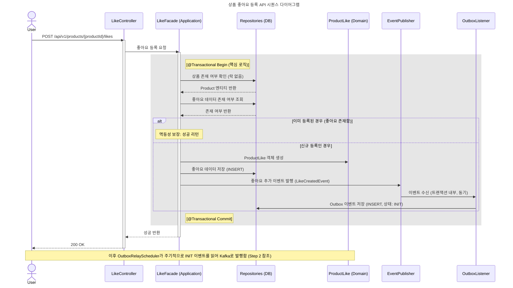
```mermaid
sequenceDiagram
    title 상품 좋아요 등록 API 시퀀스 다이어그램
    actor User
    participant Controller as LikeController
    participant Facade as LikeFacade (Application)
    participant Repo as Repositories (DB)
    participant Domain as ProductLike (Domain)

    User->>Controller: POST /api/v1/products/{productId}/likes
    activate Controller

    Controller->>Facade: 좋아요 등록 요청
    activate Facade

    rect rgba(128, 128, 128, 0.2)
        Note right of Facade: [@Transactional Begin (핵심 로직)]

        Facade->>Repo: 상품 존재 여부 확인 (락 없음)
        Repo-->>Facade: Product 엔티티 반환

        Facade->>Repo: 좋아요 데이터 존재 여부 조회
        Repo-->>Facade: 존재 여부 반환

        alt 이미 등록된 경우 (좋아요 존재함)
            Note over Facade: 멱등성 보장: 성공 리턴
        else 신규 등록인 경우
            Facade->>Domain: ProductLike 객체 생성
            Facade->>Repo: 좋아요 데이터 저장 (INSERT)
            Facade->>EventPublisher: 좋아요 추가 이벤트 발행 (LikeCreatedEvent)
            EventPublisher->>OutboxListener: 이벤트 수신 (트랜잭션 내부, 동기)
            OutboxListener->>Repo: Outbox 이벤트 저장 (INSERT, 상태: INIT)
        end
        Note right of Facade: [@Transactional Commit]
    end

    Facade-->>Controller: 성공 반환
    deactivate Facade
    
    Controller-->>User: 200 OK
    deactivate Controller

    Note over User, Domain: 이후 OutboxRelayScheduler가 주기적으로 INIT 이벤트를 읽어 Kafka로 발행함 (Step 2 참조)
```

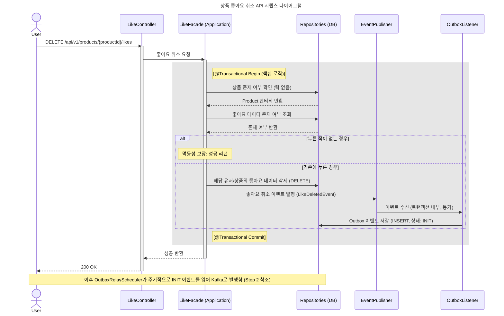
```mermaid
sequenceDiagram
    title 상품 좋아요 취소 API 시퀀스 다이어그램
    actor User
    participant Controller as LikeController
    participant Facade as LikeFacade (Application)
    participant Repo as Repositories (DB)

    User->>Controller: DELETE /api/v1/products/{productId}/likes
    activate Controller

    Controller->>Facade: 좋아요 취소 요청
    activate Facade

    rect rgba(128, 128, 128, 0.2)
        Note right of Facade: [@Transactional Begin (핵심 로직)]

        Facade->>Repo: 상품 존재 여부 확인 (락 없음)
        Repo-->>Facade: Product 엔티티 반환

        Facade->>Repo: 좋아요 데이터 존재 여부 조회
        Repo-->>Facade: 존재 여부 반환

        alt 누른 적이 없는 경우
            Note over Facade: 멱등성 보장: 성공 리턴
        else 기존에 누른 경우
            Facade->>Repo: 해당 유저/상품의 좋아요 데이터 삭제 (DELETE)
            Facade->>EventPublisher: 좋아요 취소 이벤트 발행 (LikeDeletedEvent)
            EventPublisher->>OutboxListener: 이벤트 수신 (트랜잭션 내부, 동기)
            OutboxListener->>Repo: Outbox 이벤트 저장 (INSERT, 상태: INIT)
        end
        Note right of Facade: [@Transactional Commit]
    end

    Facade-->>Controller: 성공 반환
    deactivate Facade
    
    Controller-->>User: 200 OK
    deactivate Controller

    Note over User, Repo: 이후 OutboxRelayScheduler가 주기적으로 INIT 이벤트를 읽어 Kafka로 발행함 (Step 2 참조)
```

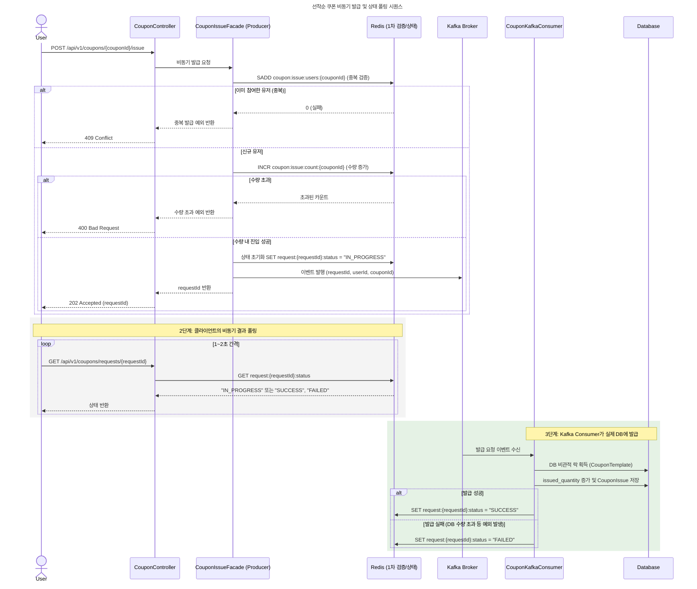
```mermaid
sequenceDiagram
    title 선착순 쿠폰 비동기 발급 및 상태 폴링 시퀀스
    actor User
    participant Controller as CouponController
    participant Facade as CouponIssueFacade (Producer)
    participant Redis as Redis (1차 검증/상태)
    participant Kafka as Kafka Broker
    participant Consumer as CouponKafkaConsumer
    participant DB as Database

    %% 1단계: 발급 요청 (Producer)
    User->>Controller: POST /api/v1/coupons/{couponId}/issue
    Controller->>Facade: 비동기 발급 요청
    
    Facade->>Redis: SADD coupon:issue:users:{couponId} (중복 검증)
    alt 이미 참여한 유저 (중복)
        Redis-->>Facade: 0 (실패)
        Facade-->>Controller: 중복 발급 예외 반환
        Controller-->>User: 409 Conflict
    else 신규 유저
        Facade->>Redis: INCR coupon:issue:count:{couponId} (수량 증가)
        alt 수량 초과
            Redis-->>Facade: 초과된 카운트
            Facade-->>Controller: 수량 초과 예외 반환
            Controller-->>User: 400 Bad Request
        else 수량 내 진입 성공
            Facade->>Redis: 상태 초기화 SET request:{requestId}:status = "IN_PROGRESS"
            Facade->>Kafka: 이벤트 발행 (requestId, userId, couponId)
            Facade-->>Controller: requestId 반환
            Controller-->>User: 202 Accepted (requestId)
        end
    end

    %% 2단계: 결과 폴링
    rect rgba(200, 200, 200, 0.2)
        Note over User, Redis: 2단계: 클라이언트의 비동기 결과 폴링
        loop 1~2초 간격
            User->>Controller: GET /api/v1/coupons/requests/{requestId}
            Controller->>Redis: GET request:{requestId}:status
            Redis-->>Controller: "IN_PROGRESS" 또는 "SUCCESS", "FAILED"
            Controller-->>User: 상태 반환
        end
    end

    %% 3단계: 백그라운드 발급 (Consumer)
    rect rgba(0, 128, 0, 0.1)
        Note over Consumer, DB: 3단계: Kafka Consumer가 실제 DB에 발급
        Kafka->>Consumer: 발급 요청 이벤트 수신
        Consumer->>DB: DB 비관적 락 획득 (CouponTemplate)
        Consumer->>DB: issued_quantity 증가 및 CouponIssue 저장
        alt 발급 성공
            Consumer->>Redis: SET request:{requestId}:status = "SUCCESS"
        else 발급 실패 (DB 수량 초과 등 예외 발생)
            Consumer->>Redis: SET request:{requestId}:status = "FAILED"
        end
    end
```

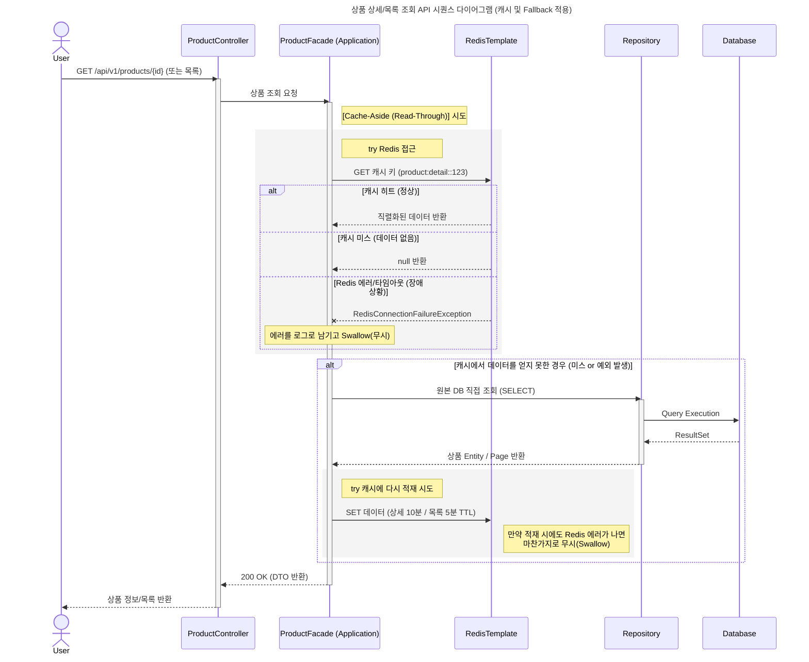
```mermaid
sequenceDiagram
    title 상품 상세/목록 조회 API 시퀀스 다이어그램 (캐시 및 Fallback 적용)
    actor User
    participant Controller as ProductController
    participant Facade as ProductFacade (Application)
    participant Cache as RedisTemplate
    participant Repo as Repository
    participant DB as Database

    User->>Controller: GET /api/v1/products/{id} (또는 목록)
    activate Controller

    Controller->>Facade: 상품 조회 요청
    activate Facade

    Note right of Facade: [Cache-Aside (Read-Through)] 시도
    
    rect rgba(200, 200, 200, 0.2)
        Note right of Facade: try Redis 접근
        Facade->>Cache: GET 캐시 키 (product:detail::123)
        alt 캐시 히트 (정상)
            Cache-->>Facade: 직렬화된 데이터 반환
        else 캐시 미스 (데이터 없음)
            Cache-->>Facade: null 반환
        else Redis 에러/타임아웃 (장애 상황)
            Cache--xFacade: RedisConnectionFailureException
            Note over Facade: 에러를 로그로 남기고 Swallow(무시)
        end
    end

    alt 캐시에서 데이터를 얻지 못한 경우 (미스 or 예외 발생)
        Facade->>Repo: 원본 DB 직접 조회 (SELECT)
        activate Repo
        Repo->>DB: Query Execution
        DB-->>Repo: ResultSet
        Repo-->>Facade: 상품 Entity / Page 반환
        deactivate Repo
        
        rect rgba(200, 200, 200, 0.2)
            Note right of Facade: try 캐시에 다시 적재 시도
            Facade->>Cache: SET 데이터 (상세 10분 / 목록 5분 TTL)
            Note right of Cache: 만약 적재 시에도 Redis 에러가 나면 <br>마찬가지로 무시(Swallow)
        end
    end

    Facade-->>Controller: 200 OK (DTO 반환)
    deactivate Facade

    Controller-->>User: 상품 정보/목록 반환
    deactivate Controller
```

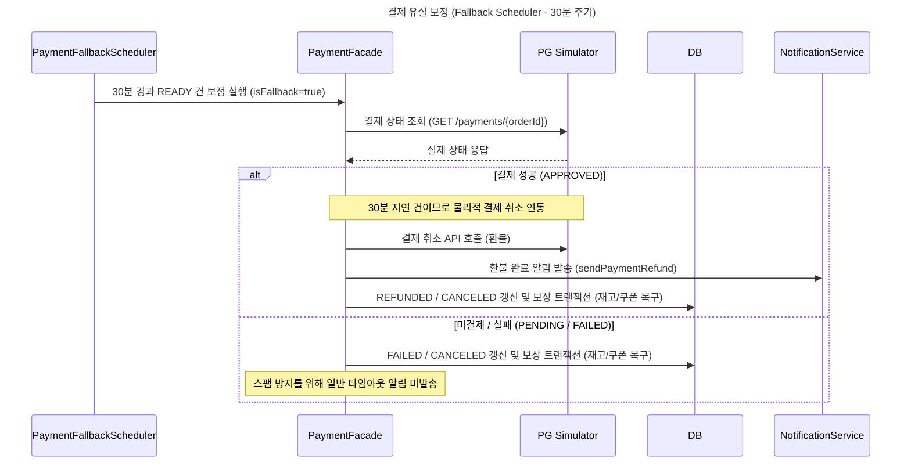
```mermaid
sequenceDiagram
    title 결제 유실 보정 (Fallback Scheduler - 30분 주기)
    participant Scheduler as PaymentFallbackScheduler
    participant Facade as PaymentFacade
    participant PG as PG Simulator
    participant DB
    participant Notification as NotificationService

    Scheduler->>Facade: 30분 경과 READY 건 보정 실행 (isFallback=true)
    Facade->>PG: 결제 상태 조회 (GET /payments/{orderId})
    PG-->>Facade: 실제 상태 응답
    
    alt 결제 성공 (APPROVED)
        Note over Facade, PG: 30분 지연 건이므로 물리적 결제 취소 연동
        Facade->>PG: 결제 취소 API 호출 (환불)
        Facade->>Notification: 환불 완료 알림 발송 (sendPaymentRefund)
        Facade->>DB: REFUNDED / CANCELED 갱신 및 보상 트랜잭션 (재고/쿠폰 복구)
    else 미결제 / 실패 (PENDING / FAILED)
        Facade->>DB: FAILED / CANCELED 갱신 및 보상 트랜잭션 (재고/쿠폰 복구)
        Note over Facade: 스팸 방지를 위해 일반 타임아웃 알림 미발송
    end
```

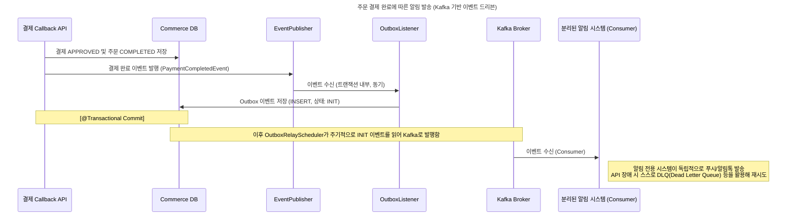
```mermaid
sequenceDiagram
    title 주문 결제 완료에 따른 알림 발송 (Kafka 기반 이벤트 드리븐)
    participant CallbackAPI as 결제 Callback API
    participant DB as Commerce DB
    participant EventPublisher
    participant OutboxListener
    participant Kafka as Kafka Broker
    participant NotificationSystem as 분리된 알림 시스템 (Consumer)

    CallbackAPI->>DB: 결제 APPROVED 및 주문 COMPLETED 저장
    CallbackAPI->>EventPublisher: 결제 완료 이벤트 발행 (PaymentCompletedEvent)
    EventPublisher->>OutboxListener: 이벤트 수신 (트랜잭션 내부, 동기)
    OutboxListener->>DB: Outbox 이벤트 저장 (INSERT, 상태: INIT)
    Note over CallbackAPI, DB: [@Transactional Commit]
    
    Note over DB, Kafka: 이후 OutboxRelayScheduler가 주기적으로 INIT 이벤트를 읽어 Kafka로 발행함
    
    Kafka->>NotificationSystem: 이벤트 수신 (Consumer)
    Note right of NotificationSystem: 알림 전용 시스템이 독립적으로 푸시/알림톡 발송<br>API 장애 시 스스로 DLQ(Dead Letter Queue) 등을 활용해 재시도
```

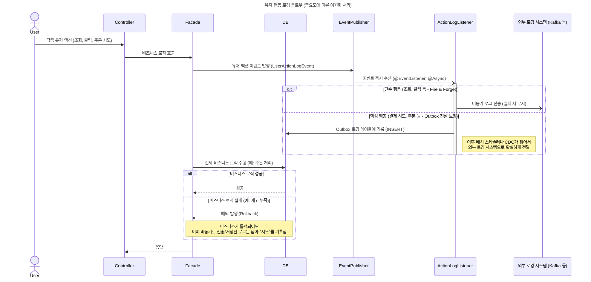
```mermaid
sequenceDiagram
    title 유저 행동 로깅 플로우 (중요도에 따른 이원화 처리)
    actor User
    participant Controller
    participant Facade
    participant DB
    participant EventPublisher
    participant LogListener as ActionLogListener
    participant ExternalLog as 외부 로깅 시스템 (Kafka 등)

    User->>Controller: 각종 유저 액션 (조회, 클릭, 주문 시도)
    Controller->>Facade: 비즈니스 로직 호출
    Facade->>EventPublisher: 유저 액션 이벤트 발행 (UserActionLogEvent)
    
    %% 비동기 로그 처리 (트랜잭션 결과와 무관)
    EventPublisher-)LogListener: 이벤트 즉시 수신 (@EventListener, @Async)
    activate LogListener
    
    alt 단순 행동 (조회, 클릭 등 - Fire & Forget)
        LogListener-)ExternalLog: 비동기 로그 전송 (실패 시 무시)
    else 핵심 행동 (결제 시도, 주문 등 - Outbox 전달 보장)
        LogListener->>DB: Outbox 로깅 테이블에 기록 (INSERT)
        Note right of LogListener: 이후 배치 스케줄러나 CDC가 읽어서 <br>외부 로깅 시스템으로 확실하게 전달
    end
    deactivate LogListener
    
    Facade->>DB: 실제 비즈니스 로직 수행 (예: 주문 처리)
    alt 비즈니스 로직 성공
        DB-->>Facade: 성공
    else 비즈니스 로직 실패 (예: 재고 부족)
        DB--xFacade: 예외 발생 (Rollback)
        Note over DB, Facade: 비즈니스가 롤백되어도 <br>이미 비동기로 전송/저장된 로그는 남아 "시도"를 기록함
    end
    Facade-->>Controller: 응답
```

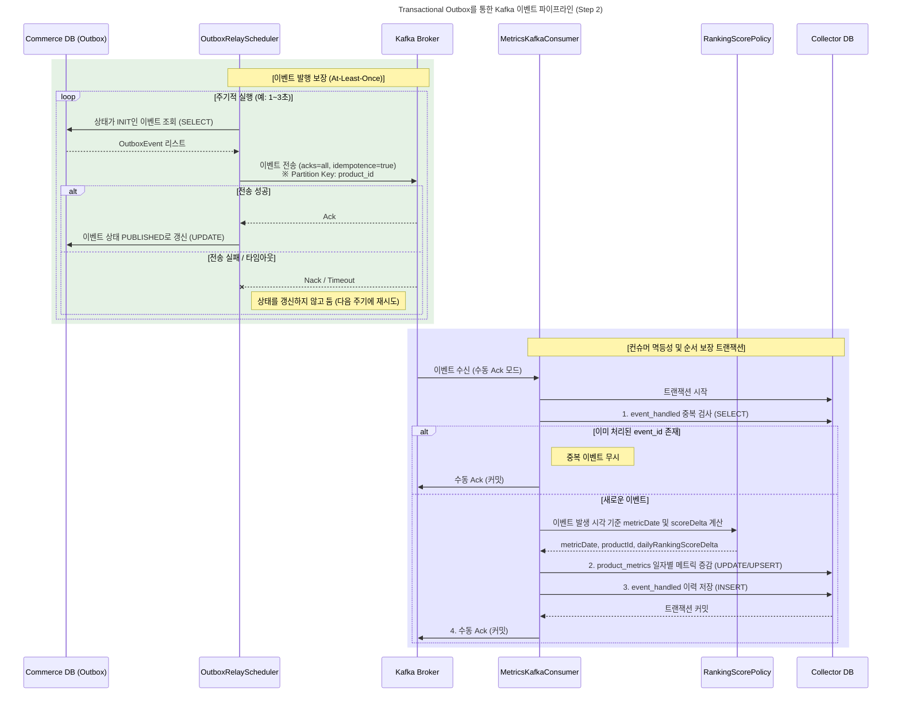
```mermaid
sequenceDiagram
    title Transactional Outbox를 통한 Kafka 이벤트 파이프라인 (Step 2)
    participant DB as Commerce DB (Outbox)
    participant Scheduler as OutboxRelayScheduler
    participant Kafka as Kafka Broker
    participant Consumer as MetricsKafkaConsumer
    participant ScorePolicy as RankingScorePolicy
    participant CDB as Collector DB

    rect rgba(0, 128, 0, 0.1)
        Note over Scheduler, Kafka: [이벤트 발행 보장 (At-Least-Once)]
        loop 주기적 실행 (예: 1~3초)
            Scheduler->>DB: 상태가 INIT인 이벤트 조회 (SELECT)
            DB-->>Scheduler: OutboxEvent 리스트
            
            Scheduler->>Kafka: 이벤트 전송 (acks=all, idempotence=true)<br/>※ Partition Key: product_id
            
            alt 전송 성공
                Kafka-->>Scheduler: Ack
                Scheduler->>DB: 이벤트 상태 PUBLISHED로 갱신 (UPDATE)
            else 전송 실패 / 타임아웃
                Kafka--xScheduler: Nack / Timeout
                Note right of Scheduler: 상태를 갱신하지 않고 둠 (다음 주기에 재시도)
            end
        end
    end

    rect rgba(0, 0, 255, 0.1)
        Note over Consumer, CDB: [컨슈머 멱등성 및 순서 보장 트랜잭션]
        Kafka->>Consumer: 이벤트 수신 (수동 Ack 모드)
        
        Consumer->>CDB: 트랜잭션 시작
        Consumer->>CDB: 1. event_handled 중복 검사 (SELECT)
        
        alt 이미 처리된 event_id 존재
            Note right of Consumer: 중복 이벤트 무시
            Consumer->>Kafka: 수동 Ack (커밋)
        else 새로운 이벤트
            Consumer->>ScorePolicy: 이벤트 발생 시각 기준 metricDate 및 scoreDelta 계산
            ScorePolicy-->>Consumer: metricDate, productId, dailyRankingScoreDelta
            Consumer->>CDB: 2. product_metrics 일자별 메트릭 증감 (UPDATE/UPSERT)
            Consumer->>CDB: 3. event_handled 이력 저장 (INSERT)
            CDB-->>Consumer: 트랜잭션 커밋
            Consumer->>Kafka: 4. 수동 Ack (커밋)
        end
    end
```

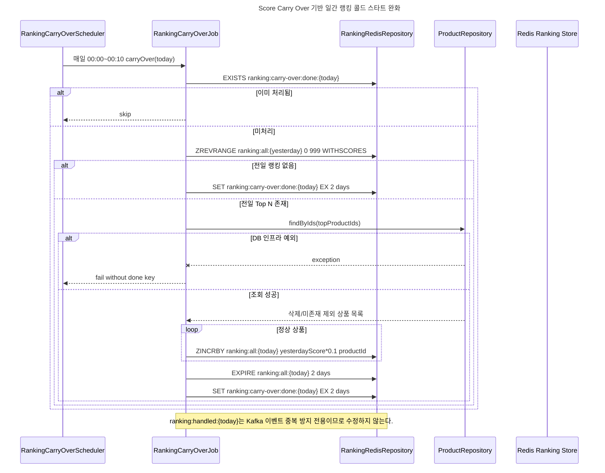
```mermaid
sequenceDiagram
    title Score Carry Over 기반 일간 랭킹 콜드 스타트 완화
    participant Scheduler as RankingCarryOverScheduler
    participant Job as RankingCarryOverJob
    participant RankingStore as RankingRedisRepository
    participant ProductRepository
    participant Redis as Redis Ranking Store

    Scheduler->>Job: 매일 00:00~00:10 carryOver(today)
    Job->>RankingStore: EXISTS ranking:carry-over:done:{today}
    alt 이미 처리됨
        Job-->>Scheduler: skip
    else 미처리
        Job->>RankingStore: ZREVRANGE ranking:all:{yesterday} 0 999 WITHSCORES
        alt 전일 랭킹 없음
            Job->>RankingStore: SET ranking:carry-over:done:{today} EX 2 days
        else 전일 Top N 존재
            Job->>ProductRepository: findByIds(topProductIds)
            alt DB 인프라 예외
                ProductRepository--xJob: exception
                Job-->>Scheduler: fail without done key
            else 조회 성공
                ProductRepository-->>Job: 삭제/미존재 제외 상품 목록
                loop 정상 상품
                    Job->>RankingStore: ZINCRBY ranking:all:{today} yesterdayScore*0.1 productId
                end
                Job->>RankingStore: EXPIRE ranking:all:{today} 2 days
                Job->>RankingStore: SET ranking:carry-over:done:{today} EX 2 days
            end
        end
    end
    Note over Job,RankingStore: ranking:handled:{today}는 Kafka 이벤트 중복 방지 전용이므로 수정하지 않는다.
```

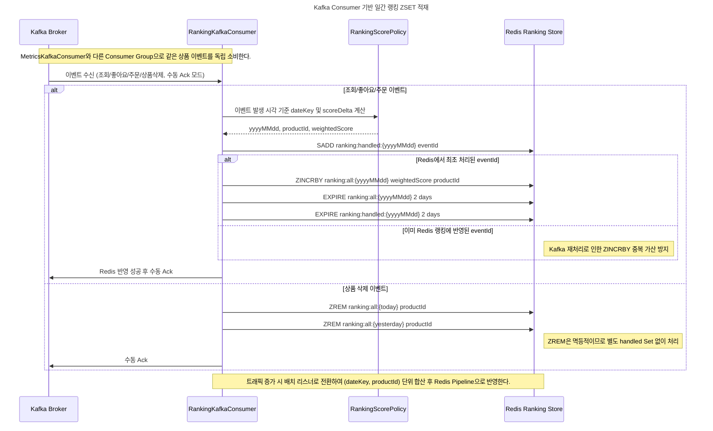
```mermaid
sequenceDiagram
    title Kafka Consumer 기반 일간 랭킹 ZSET 적재
    participant Kafka as Kafka Broker
    participant Consumer as RankingKafkaConsumer
    participant ScorePolicy as RankingScorePolicy
    participant Redis as Redis Ranking Store

    Note over Kafka, Consumer: MetricsKafkaConsumer와 다른 Consumer Group으로 같은 상품 이벤트를 독립 소비한다.
    Kafka->>Consumer: 이벤트 수신 (조회/좋아요/주문/상품삭제, 수동 Ack 모드)

    alt 조회/좋아요/주문 이벤트
        Consumer->>ScorePolicy: 이벤트 발생 시각 기준 dateKey 및 scoreDelta 계산
        ScorePolicy-->>Consumer: yyyyMMdd, productId, weightedScore
        Consumer->>Redis: SADD ranking:handled:{yyyyMMdd} eventId
        alt Redis에서 최초 처리된 eventId
            Consumer->>Redis: ZINCRBY ranking:all:{yyyyMMdd} weightedScore productId
            Consumer->>Redis: EXPIRE ranking:all:{yyyyMMdd} 2 days
            Consumer->>Redis: EXPIRE ranking:handled:{yyyyMMdd} 2 days
        else 이미 Redis 랭킹에 반영된 eventId
            Note right of Redis: Kafka 재처리로 인한 ZINCRBY 중복 가산 방지
        end
        Consumer->>Kafka: Redis 반영 성공 후 수동 Ack
    else 상품 삭제 이벤트
        Consumer->>Redis: ZREM ranking:all:{today} productId
        Consumer->>Redis: ZREM ranking:all:{yesterday} productId
        Note right of Redis: ZREM은 멱등적이므로 별도 handled Set 없이 처리
        Consumer->>Kafka: 수동 Ack
    end

    Note over Consumer, Redis: 트래픽 증가 시 배치 리스너로 전환하여 (dateKey, productId) 단위 합산 후 Redis Pipeline으로 반영한다.
```

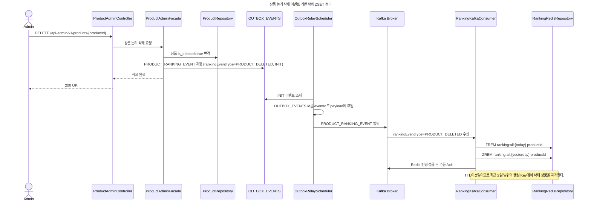
```mermaid
sequenceDiagram
    title 상품 논리 삭제 이벤트 기반 랭킹 ZSET 정리
    actor Admin
    participant ProductAdminController
    participant ProductAdminFacade
    participant ProductRepository
    participant Outbox as OUTBOX_EVENTS
    participant Relay as OutboxRelayScheduler
    participant Kafka as Kafka Broker
    participant Consumer as RankingKafkaConsumer
    participant RankingStore as RankingRedisRepository

    Admin->>ProductAdminController: DELETE /api-admin/v1/products/{productId}
    ProductAdminController->>ProductAdminFacade: 상품 논리 삭제 요청
    ProductAdminFacade->>ProductRepository: 상품 is_deleted=true 변경
    ProductAdminFacade->>Outbox: PRODUCT_RANKING_EVENT 저장 (rankingEventType=PRODUCT_DELETED, INIT)
    ProductAdminFacade-->>ProductAdminController: 삭제 완료
    ProductAdminController-->>Admin: 200 OK

    Relay->>Outbox: INIT 이벤트 조회
    Relay->>Relay: OUTBOX_EVENTS.id를 eventId로 payload에 주입
    Relay->>Kafka: PRODUCT_RANKING_EVENT 발행
    Kafka->>Consumer: rankingEventType=PRODUCT_DELETED 수신
    Consumer->>RankingStore: ZREM ranking:all:{today} productId
    Consumer->>RankingStore: ZREM ranking:all:{yesterday} productId
    Consumer->>Kafka: Redis 반영 성공 후 수동 Ack

    Note over Consumer, RankingStore: TTL이 2일이므로 최근 2일 범위의 랭킹 Key에서 삭제 상품을 제거한다.
```

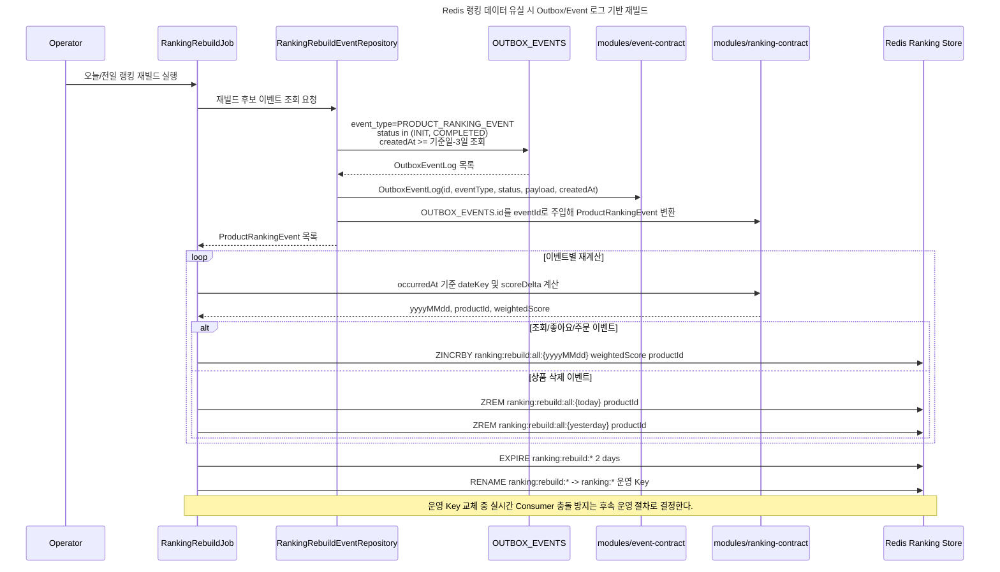
```mermaid
sequenceDiagram
    title Redis 랭킹 데이터 유실 시 Outbox/Event 로그 기반 재빌드
    participant Operator
    participant RebuildJob as RankingRebuildJob
    participant EventSource as RankingRebuildEventRepository
    participant Outbox as OUTBOX_EVENTS
    participant EventContract as modules/event-contract
    participant RankingContract as modules/ranking-contract
    participant Redis as Redis Ranking Store

    Operator->>RebuildJob: 오늘/전일 랭킹 재빌드 실행
    RebuildJob->>EventSource: 재빌드 후보 이벤트 조회 요청
    EventSource->>Outbox: event_type=PRODUCT_RANKING_EVENT<br/>status in (INIT, COMPLETED)<br/>createdAt >= 기준일-3일 조회
    Outbox-->>EventSource: OutboxEventLog 목록
    EventSource->>EventContract: OutboxEventLog(id, eventType, status, payload, createdAt)
    EventSource->>RankingContract: OUTBOX_EVENTS.id를 eventId로 주입해 ProductRankingEvent 변환
    EventSource-->>RebuildJob: ProductRankingEvent 목록
    loop 이벤트별 재계산
        RebuildJob->>RankingContract: occurredAt 기준 dateKey 및 scoreDelta 계산
        RankingContract-->>RebuildJob: yyyyMMdd, productId, weightedScore
        alt 조회/좋아요/주문 이벤트
            RebuildJob->>Redis: ZINCRBY ranking:rebuild:all:{yyyyMMdd} weightedScore productId
        else 상품 삭제 이벤트
            RebuildJob->>Redis: ZREM ranking:rebuild:all:{today} productId
            RebuildJob->>Redis: ZREM ranking:rebuild:all:{yesterday} productId
        end
    end
    RebuildJob->>Redis: EXPIRE ranking:rebuild:* 2 days
    RebuildJob->>Redis: RENAME ranking:rebuild:* -> ranking:* 운영 Key
    Note over RebuildJob, Redis: 운영 Key 교체 중 실시간 Consumer 충돌 방지는 후속 운영 절차로 결정한다.
```

이 다이어그램은 주간/월간 랭킹이 API 조회 시점에 동기 집계되지 않고, Spring Batch가 미리 만든 조회 전용 테이블을 통해 제공되는지 확인하기 위한 흐름이다. 특히 `period/startDate/endDate`가 Batch 재실행 단위이고, `batch_run_id`가 Snapshot 버전 식별자로 쓰이는지를 검증한다.

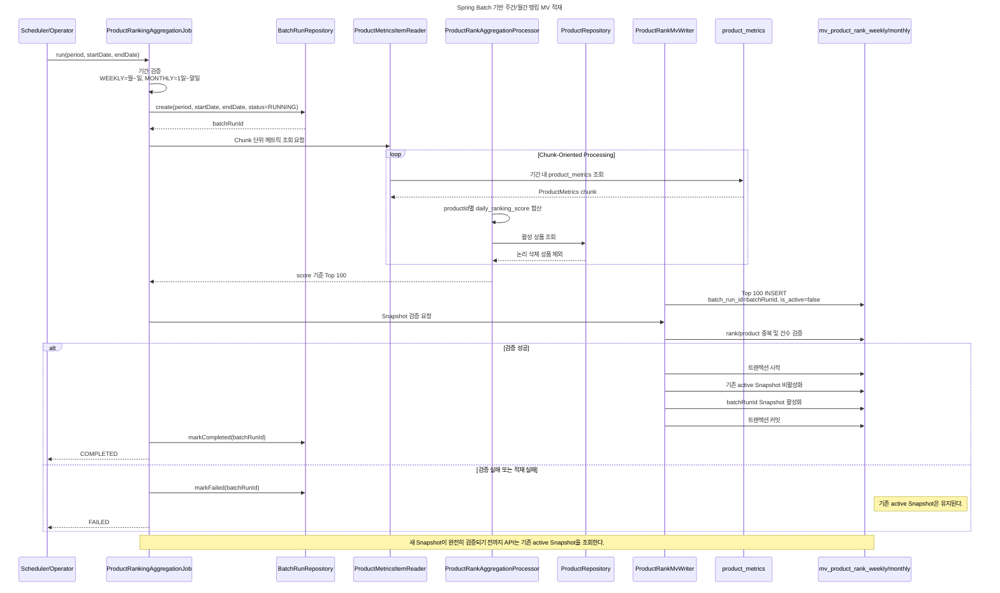
```mermaid
sequenceDiagram
    title Spring Batch 기반 주간/월간 랭킹 MV 적재
    participant Operator as Scheduler/Operator
    participant Job as ProductRankingAggregationJob
    participant BatchRunRepository
    participant Reader as ProductMetricsItemReader
    participant Processor as ProductRankAggregationProcessor
    participant ProductRepository
    participant Writer as ProductRankMvWriter
    participant MetricsDB as product_metrics
    participant MvDB as mv_product_rank_weekly/monthly

    Operator->>Job: run(period, startDate, endDate)
    Job->>Job: 기간 검증<br/>WEEKLY=월~일, MONTHLY=1일~말일
    Job->>BatchRunRepository: create(period, startDate, endDate, status=RUNNING)
    BatchRunRepository-->>Job: batchRunId
    Job->>Reader: Chunk 단위 메트릭 조회 요청
    loop Chunk-Oriented Processing
        Reader->>MetricsDB: 기간 내 product_metrics 조회
        MetricsDB-->>Reader: ProductMetrics chunk
        Processor->>Processor: productId별 daily_ranking_score 합산
        Processor->>ProductRepository: 활성 상품 조회
        ProductRepository-->>Processor: 논리 삭제 상품 제외
    end
    Processor-->>Job: score 기준 Top 100
    Writer->>MvDB: Top 100 INSERT<br/>batch_run_id=batchRunId, is_active=false
    Job->>Writer: Snapshot 검증 요청
    Writer->>MvDB: rank/product 중복 및 건수 검증
    alt 검증 성공
        Writer->>MvDB: 트랜잭션 시작
        Writer->>MvDB: 기존 active Snapshot 비활성화
        Writer->>MvDB: batchRunId Snapshot 활성화
        Writer->>MvDB: 트랜잭션 커밋
        Job->>BatchRunRepository: markCompleted(batchRunId)
        Job-->>Operator: COMPLETED
    else 검증 실패 또는 적재 실패
        Job->>BatchRunRepository: markFailed(batchRunId)
        Note right of MvDB: 기존 active Snapshot은 유지된다.
        Job-->>Operator: FAILED
    end

    Note over Job,MvDB: 새 Snapshot이 완전히 검증되기 전까지 API는 기존 active Snapshot을 조회한다.
```

이 구조에서 봐야 할 포인트는 Reader가 `product_metrics`를 Chunk 단위로 읽고, Processor가 기간 점수 집계와 삭제 상품 제외를 담당하며, Writer가 Snapshot 적재와 active 전환을 분리한다는 점이다. Batch가 중간 실패하더라도 기존 active Snapshot을 건드리지 않으므로 조회 API는 빈 랭킹을 노출하지 않는다.

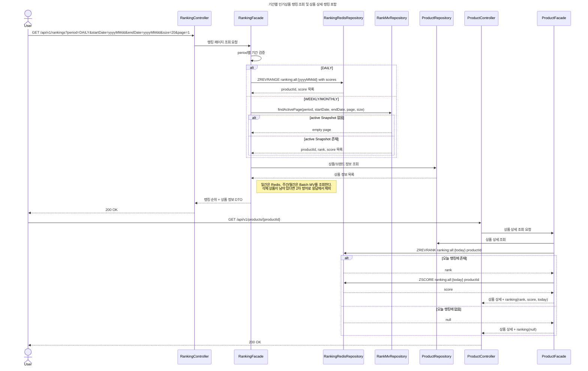
```mermaid
sequenceDiagram
    title 기간별 인기상품 랭킹 조회 및 상품 상세 랭킹 포함
    actor User
    participant RankingController
    participant RankingFacade
    participant RankingStore as RankingRedisRepository
    participant RankMvRepository
    participant ProductRepository
    participant ProductController
    participant ProductFacade

    User->>RankingController: GET /api/v1/rankings?period=DAILY&startDate=yyyyMMdd&endDate=yyyyMMdd&size=20&page=1
    RankingController->>RankingFacade: 랭킹 페이지 조회 요청
    RankingFacade->>RankingFacade: period별 기간 검증
    alt DAILY
        RankingFacade->>RankingStore: ZREVRANGE ranking:all:{yyyyMMdd} with scores
        RankingStore-->>RankingFacade: productId, score 목록
    else WEEKLY/MONTHLY
        RankingFacade->>RankMvRepository: findActivePage(period, startDate, endDate, page, size)
        alt active Snapshot 없음
            RankMvRepository-->>RankingFacade: empty page
        else active Snapshot 존재
            RankMvRepository-->>RankingFacade: productId, rank, score 목록
        end
    end
    RankingFacade->>ProductRepository: 상품/브랜드 정보 조회
    ProductRepository-->>RankingFacade: 상품 정보 목록
    Note right of RankingFacade: 일간은 Redis, 주간/월간은 Batch MV를 조회한다.<br/>삭제 상품이 남아 있다면 2차 방어로 응답에서 제외
    RankingFacade-->>RankingController: 랭킹 순위 + 상품 정보 DTO
    RankingController-->>User: 200 OK

    User->>ProductController: GET /api/v1/products/{productId}
    ProductController->>ProductFacade: 상품 상세 조회 요청
    ProductFacade->>ProductRepository: 상품 상세 조회
    ProductFacade->>RankingStore: ZREVRANK ranking:all:{today} productId
    alt 오늘 랭킹에 존재
        RankingStore-->>ProductFacade: rank
        ProductFacade->>RankingStore: ZSCORE ranking:all:{today} productId
        RankingStore-->>ProductFacade: score
        ProductFacade-->>ProductController: 상품 상세 + ranking(rank, score, today)
    else 오늘 랭킹에 없음
        RankingStore-->>ProductFacade: null
        ProductFacade-->>ProductController: 상품 상세 + ranking(null)
    end
    ProductController-->>User: 200 OK
```

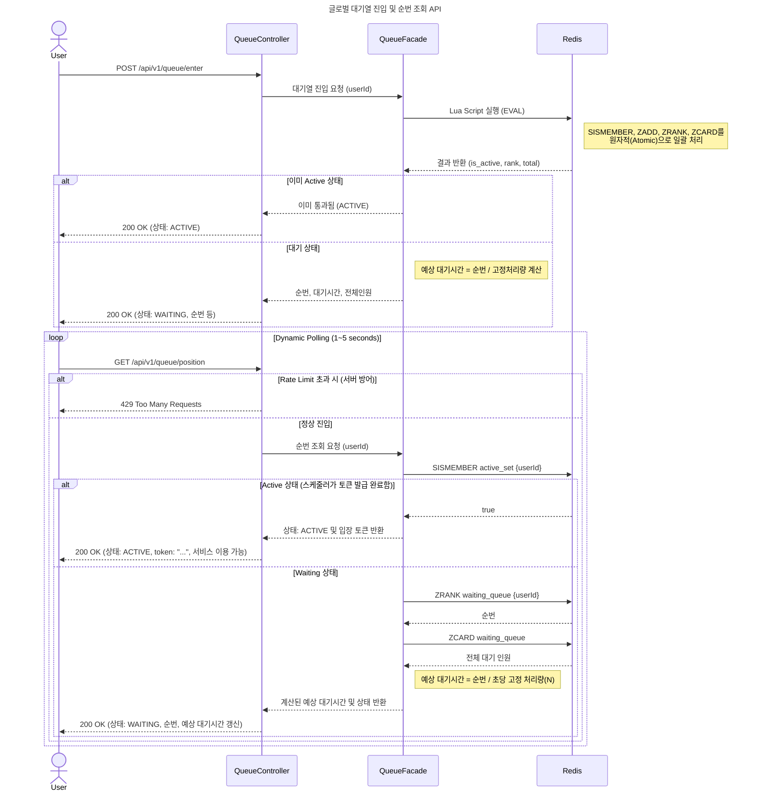
```mermaid
sequenceDiagram
    title 글로벌 대기열 진입 및 순번 조회 API
    actor User
    participant Controller as QueueController
    participant Facade as QueueFacade
    participant Redis

    %% 1. 대기열 진입
    User->>Controller: POST /api/v1/queue/enter
    Controller->>Facade: 대기열 진입 요청 (userId)
    
    Facade->>Redis: Lua Script 실행 (EVAL)
    Note right of Redis: SISMEMBER, ZADD, ZRANK, ZCARD를<br/>원자적(Atomic)으로 일괄 처리
    Redis-->>Facade: 결과 반환 (is_active, rank, total)
    alt 이미 Active 상태
        Facade-->>Controller: 이미 통과됨 (ACTIVE)
        Controller-->>User: 200 OK (상태: ACTIVE)
    else 대기 상태
        Note right of Facade: 예상 대기시간 = 순번 / 고정처리량 계산
        Facade-->>Controller: 순번, 대기시간, 전체인원
        Controller-->>User: 200 OK (상태: WAITING, 순번 등)
    end

    %% 2. 순번 폴링 조회 (클라이언트 동적 주기)
    loop Dynamic Polling (1~5 seconds)
        User->>Controller: GET /api/v1/queue/position
        
        alt Rate Limit 초과 시 (서버 방어)
            Controller-->>User: 429 Too Many Requests
        else 정상 진입
            Controller->>Facade: 순번 조회 요청 (userId)
            
            Facade->>Redis: SISMEMBER active_set {userId}
            alt Active 상태 (스케줄러가 토큰 발급 완료함)
                Redis-->>Facade: true
                Facade-->>Controller: 상태: ACTIVE 및 입장 토큰 반환
                Controller-->>User: 200 OK (상태: ACTIVE, token: "...", 서비스 이용 가능)
            else Waiting 상태
                Facade->>Redis: ZRANK waiting_queue {userId}
                Redis-->>Facade: 순번
                Facade->>Redis: ZCARD waiting_queue
                Redis-->>Facade: 전체 대기 인원
                Note right of Facade: 예상 대기시간 = 순번 / 초당 고정 처리량(N)
                Facade-->>Controller: 계산된 예상 대기시간 및 상태 반환
                Controller-->>User: 200 OK (상태: WAITING, 순번, 예상 대기시간 갱신)
            end
        end
    end
```

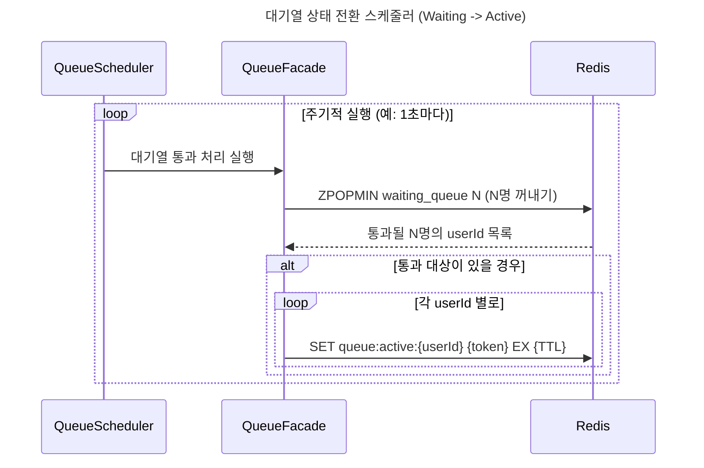
```mermaid
sequenceDiagram
    title 대기열 상태 전환 스케줄러 (Waiting -> Active)
    participant Scheduler as QueueScheduler
    participant Facade as QueueFacade
    participant Redis

    loop 주기적 실행 (예: 1초마다)
        Scheduler->>Facade: 대기열 통과 처리 실행
        Facade->>Redis: ZPOPMIN waiting_queue N (N명 꺼내기)
        Redis-->>Facade: 통과될 N명의 userId 목록
        
        alt 통과 대상이 있을 경우
            loop 각 userId 별로
                Facade->>Redis: SET queue:active:{userId} {token} EX {TTL}
            end
        end
    end
```

```mermaid
sequenceDiagram
    title 입장 토큰 검증 및 결제 실패 시 TTL 유지 (재시도) 시나리오
    actor User
    participant Interceptor as TokenInterceptor
    participant Facade as OrderFacade / PaymentFacade
    participant Redis
    participant DB

    %% 1. 정상 진입 시도
    User->>Interceptor: POST /api/v1/orders
    Interceptor->>Redis: GET queue:active:{userId}
    
    alt 토큰 없음 (대기 중 또는 미진입)
        Redis-->>Interceptor: (nil)
        Interceptor-->>User: 401 Unauthorized (또는 403 Forbidden)
    else 토큰 있음 (Active)
        Redis-->>Interceptor: {token}
        Interceptor->>Facade: 요청 전달
        Facade->>DB: 주문 및 결제 처리 시도
        
        alt 결제 실패 (잔고 부족 등)
            Facade-->>User: 400 Bad Request (결제 실패)
            Note right of User: 실패해도 Redis의 토큰은 파기되지 않음.<br>TTL(예: 5분) 내에서 재시도 가능.
        else 결제 성공
            Facade->>DB: 상태 업데이트 (APPROVED)
            Facade->>Redis: DEL queue:active:{userId} (토큰 회수)
            Facade-->>User: 200 OK (결제 완료)
        end
    end
```
