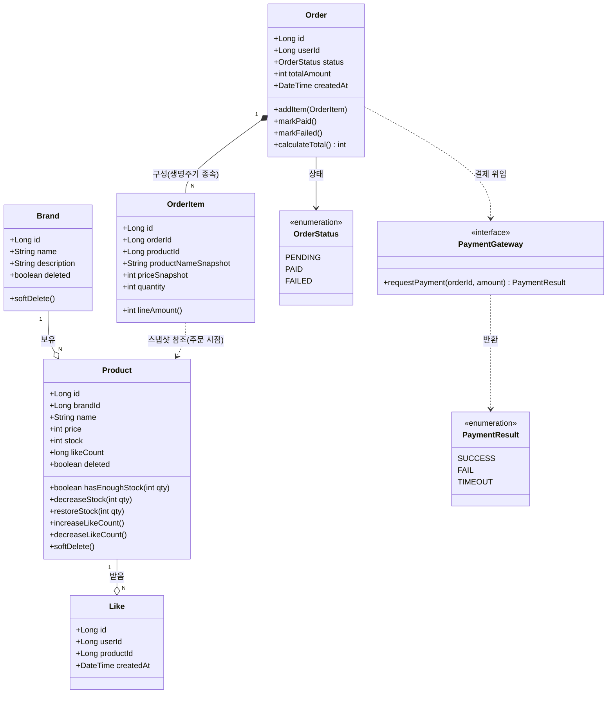
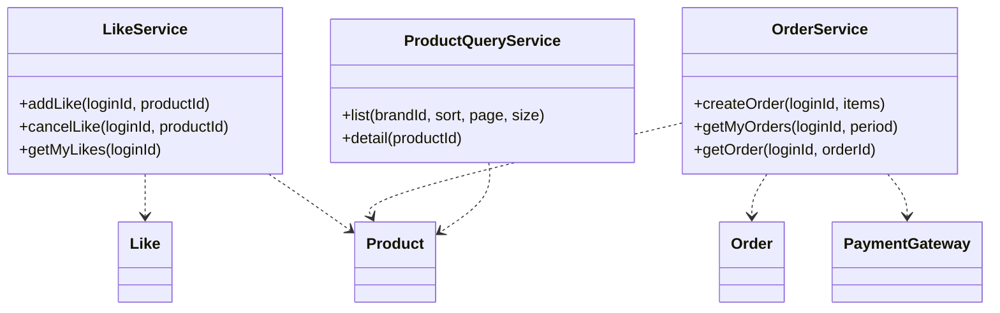

# 03. 클래스 다이어그램 (도메인 객체 설계)

> 도메인 책임, 의존 방향, 응집도를 검증하기 위한 객체 구조 (Mermaid)

---

## 왜 이 다이어그램이 필요한가
주문/결제 흐름에는 재고 차감, 멱등 좋아요, 스냅샷 저장 등 여러 책임이 얽혀 있다. 어떤 도메인 객체가 어떤 데이터와 행위를 갖는지, 의존 방향이 한쪽으로 흐르는지(순환 의존 없음)를 검증한다.

---

## 이 구조에서 특히 봐야 할 포인트

- **포인트 1 (설계 의도 — 재고/좋아요 책임의 응집)**: 재고 검증·차감·복구(`hasEnoughStock`, `decreaseStock`, `restoreStock`)와 좋아요 수 증감을 모두 `Product`가 직접 책임진다. 외부에서 `stock` 값을 직접 조작하지 않고 메서드를 통해서만 변경 → 불변식(재고 음수 금지) 보호.

- **포인트 2 (주의 — Order와 OrderItem의 합성 관계)**: `Order *-- OrderItem`는 합성(composition)이다. `OrderItem`은 `Order` 없이 존재하지 않으며, `productNameSnapshot`/`priceSnapshot`을 보유해 주문 시점 정보를 고정한다. `OrderItem`이 `Product`를 직접 참조하지 않고 스냅샷만 갖는 것이 핵심 — 이후 상품 변경/삭제와 분리된다.

- **포인트 3 (확장 — PaymentGateway 추상화)**: 외부 결제는 `PaymentGateway` 인터페이스로 추상화했다. `Order`는 구체 PG 구현을 모르고 인터페이스에만 의존하므로, PG 교체나 콜백 방식 도입 시 `Order` 도메인은 변경되지 않는다(의존 역전).

- **포인트 4 (책임 과다 점검)**: `Product`가 재고와 좋아요 수를 동시에 책임진다. 현재 규모에서는 응집도 측면에서 한 객체에 두는 것이 합리적이나, 좋아요 집계가 매우 고빈도가 되면 좋아요 카운트를 별도 집계 테이블/객체로 분리하는 것을 검토해야 한다(아래 04-erd 리스크 참조).

---

## 서비스 계층 책임 (보조)

도메인 객체와 별개로, 흐름 조율(orchestration)은 서비스가 담당한다.

- **조회와 명령 분리**: 단순 조회(`ProductQueryService`)와 상태 변경(`OrderService`, `LikeService`)의 책임을 나눠 조회 로직이 트랜잭션 경계에 끌려가지 않게 한다.
- **서비스는 도메인에 의존, 도메인은 서비스를 모른다**: 의존 방향이 서비스 → 도메인 한 방향으로만 흐른다(순환 없음).
