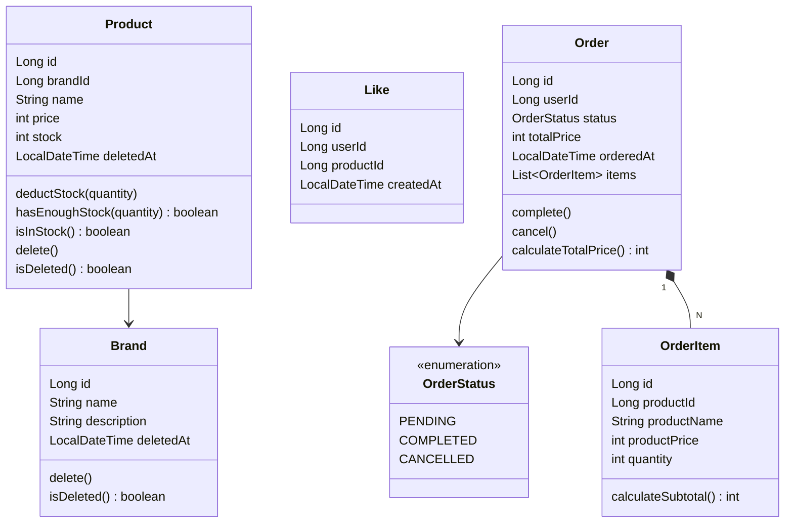
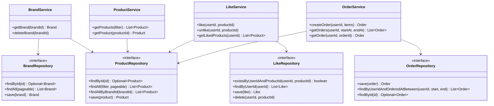

# 클래스 다이어그램

## 도메인 모델

도메인 객체의 책임과 의존 방향, 비즈니스 로직이 Service에 몰리지 않고 적절히 분산되어 있는지 확인한다.

**읽는 포인트**
- `Product.deductStock()`이 재고 부족 예외를 던지는 책임까지 가진다. Service가 `stock >= quantity` 조건을 직접 체크하지 않는다.
- `Brand.delete()`, `Product.delete()`는 `deletedAt`을 채우는 메서드로, 물리 삭제가 아닌 상태 변경이다.
- `OrderItem`은 `Order` 없이 존재할 수 없는 구조(Aggregate Root 패턴). `productName`, `productPrice`는 주문 시점 스냅샷이라 이후 상품 변경에 영향받지 않는다.

---

## 레이어별 구조

각 Service가 어떤 Repository에 의존하는지, 의존 방향이 domain → infrastructure로 향하는지 확인한다.

**읽는 포인트**
- `BrandService`가 `ProductRepository`에 의존하는 이유: 브랜드 삭제 시 연관 상품도 soft delete 처리해야 하기 때문이다.
- `LikeService`가 `ProductRepository`에 의존하는 이유: 좋아요 등록 전 상품 존재 여부 확인이 필요하기 때문이다.
- Repository는 모두 interface로 선언하여 domain이 infrastructure 구현체에 직접 의존하지 않는다.
