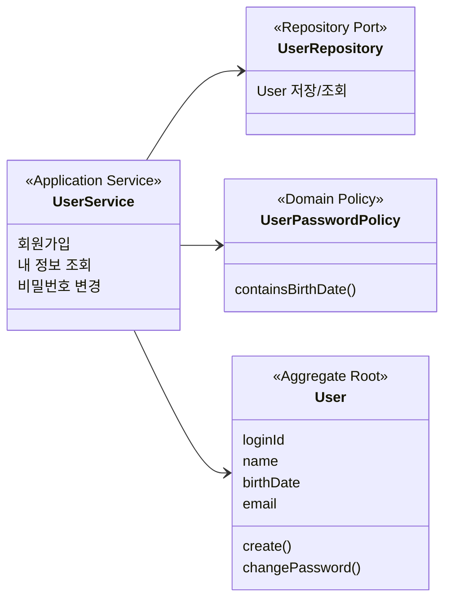
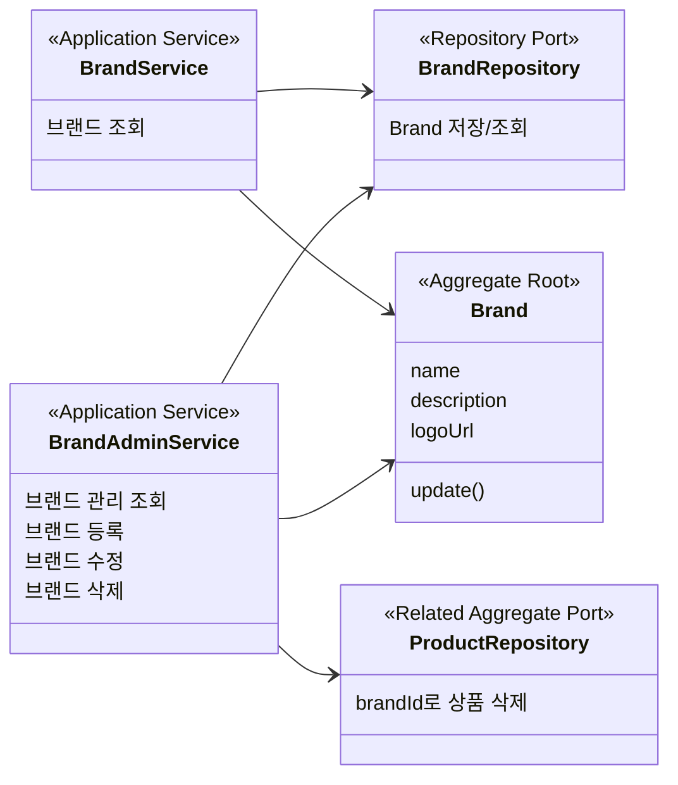
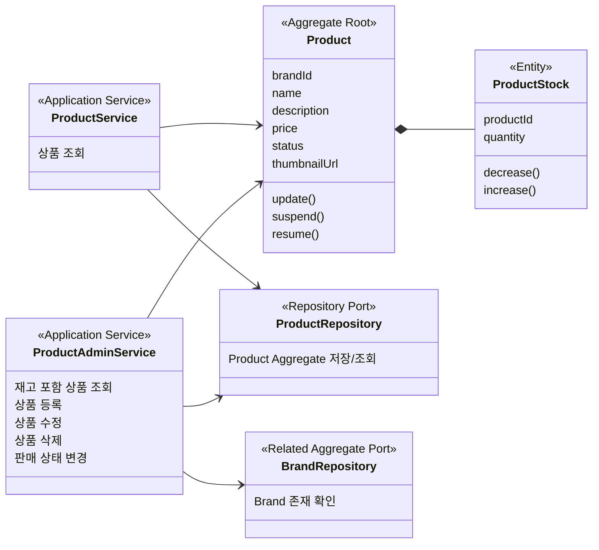
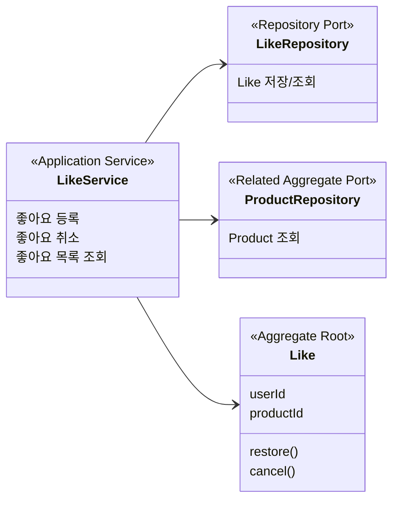
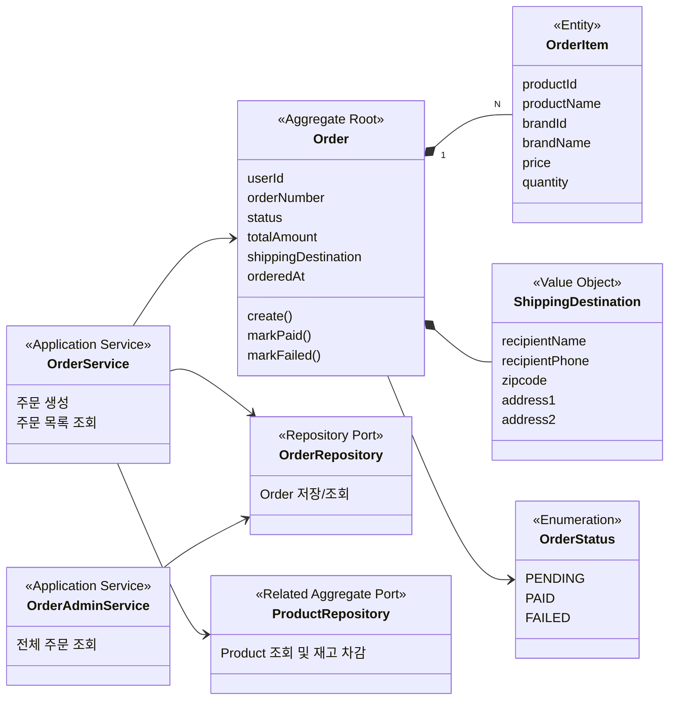
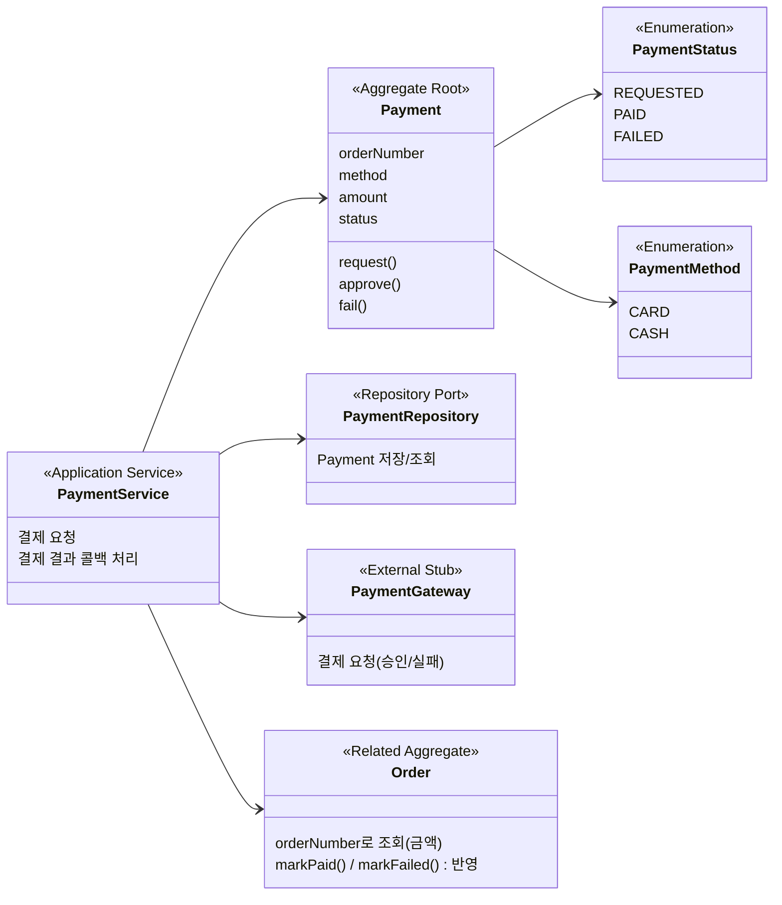

# Class Diagram

이 문서는 코드 패키지 구조가 아니라 DDD 관점의 도메인 모델을 설명한다. Controller, DTO, JPA 구현체 같은 기술 세부사항보다 Aggregate, Domain Policy, Repository Port, Application Service의 책임과 의존 방향을 중심으로 정리한다.

## Users

### 개념 모델

액터:
- 일반 사용자: 회원가입, 내 정보 조회, 비밀번호 변경을 수행한다.
- 관리자: LDAP 등 별도 인증 시스템을 통해 관리자 API에 접근한다. 일반 `User` 도메인에 저장하지 않는다.

핵심 도메인:
- `User`: 일반 고객 회원을 표현하는 aggregate root.

보조/외부 시스템:
- Security: 인증 결과와 권한을 관리한다.
- PasswordEncoder: raw password와 encoded password 사이의 인코딩/검증을 담당한다.
- LDAP: 관리자 인증을 담당하는 외부 인증 시스템으로 가정한다.

### 클래스 다이어그램

이 다이어그램은 User 도메인의 핵심 개념과 책임 경계를 보여준다. 실제 구현 클래스의 모든 필드와 메서드를 표현하지 않고, 도메인 설계에 필요한 수준의 책임만 표현한다.

여기서 봐야 할 점은 `User`가 일반 고객 회원을 표현하는 aggregate root라는 것이다. 관리자 권한은 `User`의 속성으로 두지 않고, 인증 시스템의 권한으로 분리한다.

`UserService`는 도메인 객체 자체라기보다 유스케이스 흐름을 조율하는 application service로 본다. 비밀번호 정책은 `UserPasswordPolicy`로 분리하지만, 비밀번호 인코딩 검증처럼 기술 컴포넌트가 필요한 부분은 application service 흐름에서 처리한다.

### 설계 리스크

- 검증 로직을 유스케이스 흐름 안에 두었기 때문에, 비밀번호 정책이나 가입 검증이 계속 늘어나면 application service가 비대해질 수 있다.
- 해결 선택지는 두 가지다. 현재처럼 단순하게 유지하거나, 검증이 재사용/확장되는 시점에 별도 validator로 분리한다.
- 관리자 권한을 Security authority로 분리했기 때문에, 관리자 계정 자체를 서비스 DB에서 관리해야 하는 요구가 생기면 별도 Admin 도메인이나 인증 연동 모델을 다시 검토해야 한다.

## Brands

### 개념 모델

액터:
- 일반 사용자: 브랜드 정보를 조회한다.
- 관리자: 브랜드 목록과 상세 정보를 조회하고, 브랜드를 등록, 수정, 삭제한다.

핵심 도메인:
- `Brand`: 상품이 소속되는 기준을 표현하는 aggregate root.

관련 도메인:
- `Product`: 브랜드에 소속되는 별도 aggregate. `Brand`가 `Product`를 소유하지 않는다.

### 클래스 다이어그램

이 다이어그램은 `Brand`와 `Product`를 같은 Aggregate로 묶지 않고, 브랜드 삭제 유스케이스에서 관련 상품 삭제를 조율하는 구조를 보여준다.

여기서 봐야 할 점은 `Brand`가 상품 목록을 내부 컬렉션으로 소유하지 않는다는 것이다. 브랜드 삭제 시 상품 삭제가 필요하지만, 이는 같은 Aggregate 내부의 불변식이 아니라 application service가 여러 Aggregate를 조율하는 정책으로 본다.

사용자 조회와 관리자 관리(등록/수정/삭제)는 액터와 관심사가 다르므로 application service를 `BrandService`(조회)와 `BrandAdminService`(관리)로 분리한다. 두 서비스는 `Brand` 도메인 모델과 `BrandRepository`를 공유하며, 도메인 로직이나 port를 중복하지 않는다. soft delete(`delete()`/`restore()`)는 `BaseEntity` 공통 기능이므로 Aggregate 다이어그램에는 `Brand` 고유 행위인 `update()`만 표시한다.

### 설계 리스크

- 브랜드 삭제 시 상품까지 함께 삭제하므로, 상품 수가 많아질 경우 하나의 트랜잭션이 커질 수 있다.
- 현재는 동기 삭제로 단순하게 처리할 수 있지만, 상품 수가 많아지면 브랜드 삭제 이벤트를 발행하고 상품 삭제를 별도 처리하는 방식도 고려할 수 있다.
- 삭제된 브랜드와 하위 상품의 복구 정책은 현재 범위에서 다루지 않는다. 필요해지면 자동 복구 여부를 포함해 별도로 결정한다.
- 브랜드 정보가 주문 스냅샷에 포함되는 요구가 생기면, 삭제된 브랜드라도 과거 주문 내역에는 당시 브랜드 정보가 유지되어야 한다.

## Products

### 개념 모델

액터:
- 일반 사용자: 상품 목록과 상품 상세 정보를 조회한다.
- 관리자: 상품 목록과 상세 정보를 조회하고, 상품을 등록, 수정, 삭제한다.

핵심 도메인:
- `Product`: 판매 대상 상품을 표현하는 aggregate root.

관련 도메인:
- `Brand`: 상품이 소속되는 별도 aggregate.
- `Order`: 주문 시점의 상품 정보를 스냅샷으로 저장하는 별도 aggregate.

### 클래스 다이어그램

이 다이어그램은 `Product`가 브랜드와 주문에 연결되지만, 각각을 직접 소유하지 않는 별도 Aggregate라는 점을 보여준다.

여기서 봐야 할 점은 `Product`가 `Brand` 객체를 소유하지 않고 `brandId`로 참조한다는 것이다. 재고는 `ProductStock`으로 분리하지만 Product Aggregate 안의 구성요소로 본다.

관리자 상품 조회는 상품 기본 정보와 함께 `ProductStock`의 재고 정보를 포함한다. 고객 상품 조회는 상품 탐색에 필요한 기본 상품 정보를 중심으로 제공한다.

`ProductStock`은 상품 생명주기에 종속된다. 다만 재고는 주문 과정에서 자주 변경되고 동시성 제어의 대상이므로, 영속성은 상품 기본 정보와 분리한다.

`status`는 관리자 의도(`ON_SALE`/`SUSPENDED`)만 담고, 관리자가 `suspend()`/`resume()`로 전환한다. 품절은 `status`에 저장하지 않고 재고로 판단한다(재고가 SSOT). soft delete(`delete()`/`restore()`)는 `BaseEntity` 공통 기능이라 Aggregate에는 `Product` 고유 행위(`update()`, `suspend()`, `resume()`)만 표시한다. 사용자 조회와 관리자 관리는 `ProductService`(조회)와 `ProductAdminService`(등록/수정/삭제/상태 변경)로 분리하며, `Product` 도메인 모델과 `ProductRepository`를 공유한다.

### 설계 리스크

- 상품 재고 차감은 주문과 함께 일어나므로 동시 주문 상황에서 재고 일관성을 보장해야 한다. 1차로는 `ProductStock`에 대한 Pessimistic Lock(`SELECT ... FOR UPDATE`)을 적용한다. 트래픽이 늘어나면 분산락이나 비동기 처리 방식을 다시 검토한다.
- 결제 실패 등 보상이 필요한 경우 `ProductStock.increase()`로 차감분을 되돌린다. 이 복구는 DB 자동 롤백이 아니라 별도 트랜잭션의 명시적 보상이다.
- 브랜드 삭제 시 상품이 함께 삭제되므로, 상품 삭제가 주문 이력을 훼손하지 않도록 주문은 상품 정보를 스냅샷으로 저장해야 한다.
- 좋아요 수 정렬(`likes_desc`)은 현재 `Like` 테이블을 매번 집계해 처리한다. 집계 컬럼이나 캐시 도입은 성능 측정 후 별도로 검토한다.

## Likes

### 개념 모델

액터:
- 일반 사용자: 상품에 좋아요를 등록하거나 취소하고, 좋아요한 상품 목록을 조회한다.

핵심 도메인:
- `Like`: 사용자와 상품 사이의 선호 관계를 표현하는 aggregate root.

관련 도메인:
- `User`: 좋아요를 남기는 주체.
- `Product`: 좋아요 대상.

### 클래스 다이어그램

이 다이어그램은 `Like`가 `User`나 `Product` 내부 컬렉션이 아니라 별도 관계 Aggregate라는 점을 보여준다.

여기서 봐야 할 점은 `Like`가 `userId`, `productId`를 통해 `User`, `Product`를 참조한다는 것이다. `Product`가 좋아요 목록을 직접 소유하지 않으므로 상품 Aggregate가 과도하게 커지지 않는다.

### 설계 리스크

- 같은 사용자와 상품 조합은 한 row로 관리한다. 취소는 `deleted_at`을 채워 비활성화하고, 재등록은 `deleted_at`을 비워 복구한다. `UNIQUE(user_id, product_id)` 제약을 통해 중복 row가 생기지 않도록 한다.
- 좋아요 취소 상태가 조회 결과에 섞이지 않도록 활성 좋아요 조회 조건이 일관되게 적용되어야 한다.
- 좋아요 수 정렬은 현재 범위에서 `likes`를 매번 집계해 처리한다. 정렬 성능이 문제가 되면 집계 컬럼이나 캐시 도입을 별도로 설계한다.
- 상품 외 다른 대상에 좋아요가 생기면 `Like`라는 이름이 너무 넓어질 수 있으므로 모델 범위를 다시 검토해야 한다.

## Orders

### 개념 모델

액터:
- 일반 사용자: 상품을 주문하고 본인의 주문 목록을 조회한다.
- 관리자: 전체 주문을 조회한다.

핵심 도메인:
- `Order`: 사용자 주문을 표현하는 aggregate root.
- `OrderItem`: 주문 당시의 상품 정보를 담는 Order Aggregate 내부 구성요소.

관련 도메인:
- `User`: 주문을 생성하는 주체.
- `Product`: 주문 대상 상품.
- `ProductStock`: 주문 시 확인되고 차감되는 재고.

### 클래스 다이어그램

이 다이어그램은 `Order`가 주문 당시 상품 정보를 스냅샷으로 보관하고, `Product`를 직접 소유하지 않는다는 점을 보여준다.

여기서 봐야 할 점은 `OrderItem`이 `Product`가 아니라 주문 당시 상품 스냅샷이라는 것이다. 상품명, 브랜드명, 가격이 이후 변경되어도 기존 주문 정보는 바뀌지 않는다.

`OrderStatus`는 `PENDING`(생성·결제대기) → `PAID`(결제 완료) / `FAILED`(결제 실패, 재고 복구·종료)로 전이한다. 상태 전이 권한은 `Order`에 두고(`markPaid()`/`markFailed()`), 결제 결과는 별도 Payment 도메인이 알려준다(아래 Payments 참고). 주문 생성은 `PENDING`까지만 책임지고 결제를 직접 호출하지 않는다.

배송지·수령인은 `ShippingDestination` 값 객체로 묶어 `Order`가 보유하며, 주문 시점 스냅샷이다(영속성은 ORDERS 테이블에 `@Embedded` 평면 컬럼). 결제수단은 Order가 아니라 Payment가 소유한다. 사용자 주문 생성·본인 주문 조회는 `OrderService`, 관리자 전체 주문 조회는 `OrderAdminService`로 분리한다.

### 설계 리스크

- 주문 생성과 재고 차감을 하나의 트랜잭션으로 처리하므로, 주문 상품 수가 많아지면 트랜잭션이 커질 수 있다.
- 재고 차감은 동시 주문 상황에서 충돌 가능성이 있으므로 ProductStock에 대한 동시성 제어가 필요하다.
- 한 주문에 여러 상품이 포함될 때, 락 획득 순서가 엇갈리면 deadlock이 발생할 수 있다. 이를 막기 위해 재고 락은 `productId` 오름차순으로 획득한다.
- 상태 전이(`PENDING → PAID/FAILED`)는 `Order` 내부 메서드(`markPaid()`, `markFailed()`)에서 처리하고, 허용되지 않은 전이는 예외로 막는다. 결제 결과는 Payment 도메인이 전달하지만 상태 변경·재고 복구 권한은 `Order`에 둔다.
- 결제는 별도 Payment 도메인이 별도 API + webhook로 처리한다(아래 Payments). 주문 생성 트랜잭션은 결제 호출을 포함하지 않아 재고 락이 외부 결제 동안 잡히지 않는다.

## Payments

### 개념 모델

액터:
- 일반 사용자: 생성한 주문에 대해 결제를 요청한다.

핵심 도메인:
- `Payment`: 한 번의 결제 시도를 표현하는 aggregate root.

관련 도메인:
- `Order`: 결제 대상 주문. `orderNumber`로 참조하고, 결제 결과를 `Order`에 반영한다(`Order`는 `Payment`를 모름).

보조/외부 시스템:
- `PaymentGateway`: 외부 PG 연동 추상화. 현재 범위에서는 즉시 승인하는 stub.

### 클래스 다이어그램

이 다이어그램은 `Payment`가 `Order`와 별도 Aggregate이며, PG 연동·결과 확정을 책임지고 결과만 `Order`에 반영한다는 점을 보여준다.

여기서 봐야 할 점은 `Payment`가 `orderNumber`로만 `Order`를 참조하고 `Order`는 `Payment`를 모른다는 것이다(의존 단방향). 결제 요청 시 `Payment`를 `REQUESTED`로 만들고 `PaymentGateway`(stub)를 호출하며, PG webhook 콜백으로 `PAID`/`FAILED`를 확정한다. 결제 금액은 클라이언트 값을 믿지 않고 `orderNumber`로 조회한 주문의 `totalAmount`를 쓴다. 결과 확정 시 `Order`의 `markPaid()`/`markFailed()`(+재고 복구)를 호출해 반영하며, 상태 전이·재고 권한은 `Order`에 둔다.

### 설계 리스크

- 결제 콜백은 중복 수신될 수 있으므로 멱등 처리한다(이미 확정된 결제·주문은 재반영하지 않음).
- PG 호출은 외부·비동기이므로 재고 락이 걸린 주문 생성 트랜잭션 안에서 호출하지 않는다(주문 생성과 결제는 분리된 단계).
- `CASH`(입금 대기)와 `CARD`(PG 승인)는 흐름이 다르지만 현재 stub에선 즉시 승인으로 단순화한다. 실제 PG 연동 시 구체화한다.
- 미결제 `PENDING` 주문이 재고를 점유하므로, 만료 배치로 정리한다(재고 복구 + 주문 종료).
